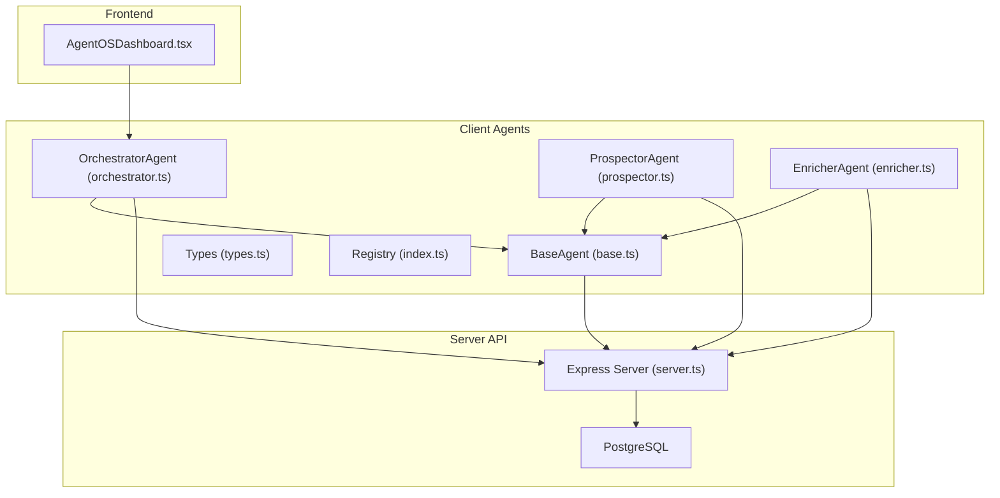
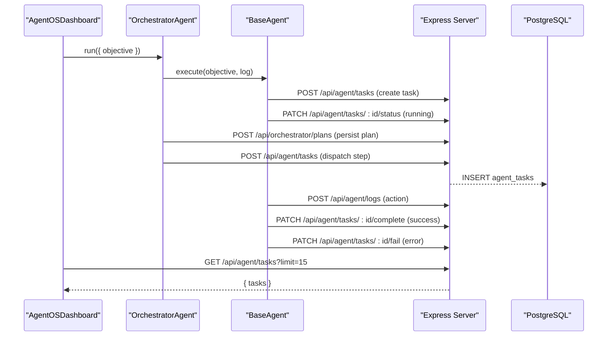
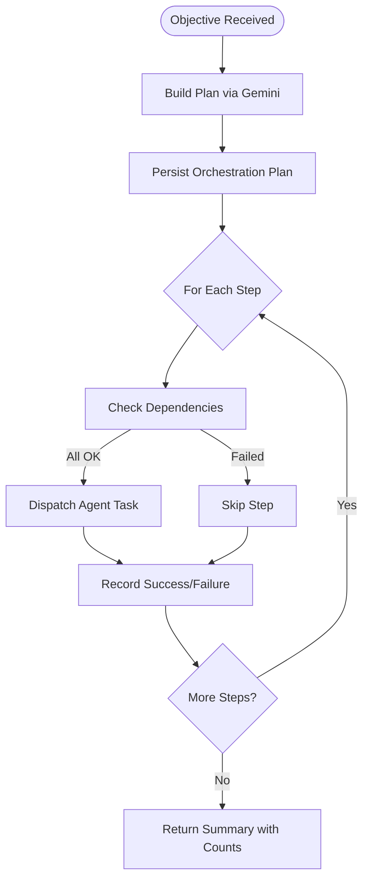
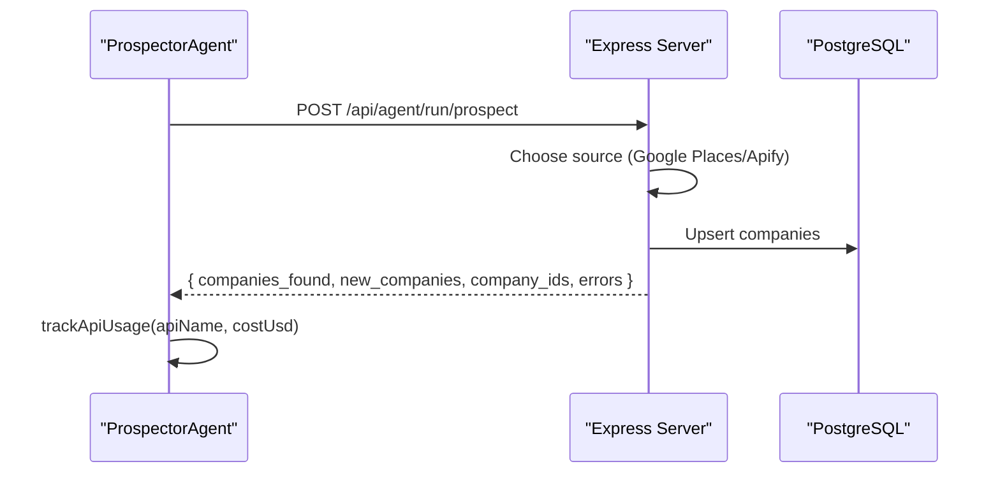
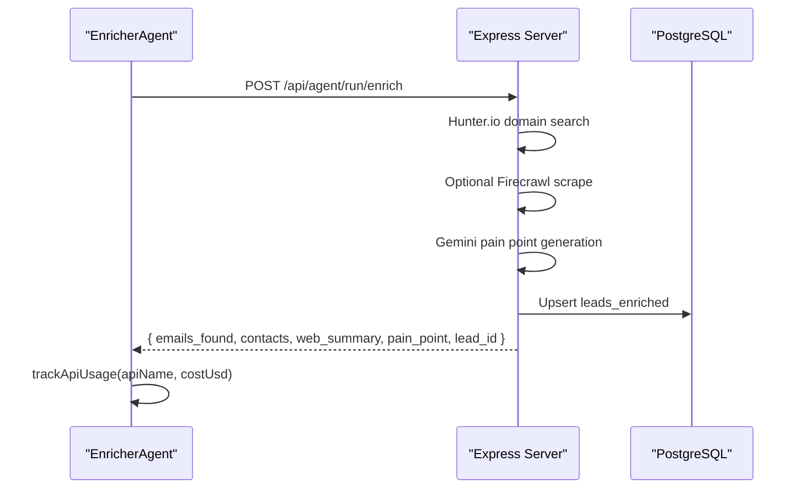
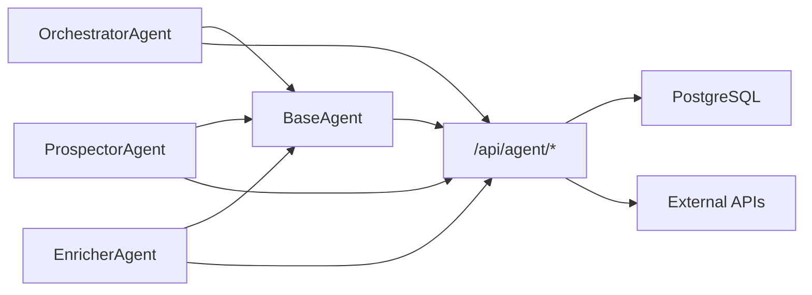

# AI Agent System

<cite>
**Referenced Files in This Document**
- [base.ts](file://src/agents/base.ts)
- [index.ts](file://src/agents/index.ts)
- [types.ts](file://src/agents/types.ts)
- [orchestrator.ts](file://src/agents/orchestrator.ts)
- [prospector.ts](file://src/agents/prospector.ts)
- [enricher.ts](file://src/agents/enricher.ts)
- [server.ts](file://server.ts)
- [api/index.ts](file://api/index.ts)
- [AgentOSDashboard.tsx](file://src/components/crm-full/AgentOSDashboard.tsx)
</cite>

## Table of Contents
1. [Introduction](#introduction)
2. [Project Structure](#project-structure)
3. [Core Components](#core-components)
4. [Architecture Overview](#architecture-overview)
5. [Detailed Component Analysis](#detailed-component-analysis)
6. [Dependency Analysis](#dependency-analysis)
7. [Performance Considerations](#performance-considerations)
8. [Troubleshooting Guide](#troubleshooting-guide)
9. [Conclusion](#conclusion)
10. [Appendices](#appendices)

## Introduction
This document explains the AI agent framework that powers marketing automation within the project. It covers the base agent architecture, the registry and types system, task orchestration patterns, and specialized agents (Orchestrator, Prospector, Enricher). It also details the lifecycle of tasks, message passing between agents and server endpoints, error handling, performance optimization strategies, and guidelines for creating custom agents and integrating new AI capabilities.

## Project Structure
The agent framework is implemented as a set of TypeScript modules under src/agents, with a server-side Express API that persists tasks, logs, and usage metrics to PostgreSQL. The frontend dashboard visualizes live status, pipeline funnel, costs, and recent logs.



**Diagram sources**
- [base.ts:18-193](file://src/agents/base.ts#L18-L193)
- [orchestrator.ts:10-180](file://src/agents/orchestrator.ts#L10-L180)
- [prospector.ts:26-71](file://src/agents/prospector.ts#L26-L71)
- [enricher.ts:32-75](file://src/agents/enricher.ts#L32-L75)
- [server.ts:3889-4100](file://server.ts#L3889-L4100)
- [AgentOSDashboard.tsx:143-205](file://src/components/crm-full/AgentOSDashboard.tsx#L143-L205)

**Section sources**
- [base.ts:1-199](file://src/agents/base.ts#L1-L199)
- [index.ts:1-28](file://src/agents/index.ts#L1-L28)
- [types.ts:1-181](file://src/agents/types.ts#L1-L181)
- [server.ts:3889-4100](file://server.ts#L3889-L4100)
- [AgentOSDashboard.tsx:143-205](file://src/components/crm-full/AgentOSDashboard.tsx#L143-L205)

## Core Components
- BaseAgent: Abstract class providing task lifecycle management, retries with exponential backoff, logging, cost tracking, and shared Gemini proxy calls.
- OrchestratorAgent: Parses natural-language objectives into structured execution plans and dispatches steps to specific agents while respecting dependencies.
- ProspectorAgent: Finds companies via Google Places or Apify and persists them to the database.
- EnricherAgent: Enriches company data by searching Hunter.io, optionally scraping websites via Firecrawl, and generating pain points using Gemini.
- Types and Registry: Strongly typed interfaces for tasks, logs, results, and orchestrator plans; central exports for easy consumption.

Key responsibilities:
- BaseAgent encapsulates cross-cutting concerns: task creation, status updates, completion/failure, logging, API usage tracking, and Gemini integration.
- Specialized agents implement execute() to perform domain-specific work and return standardized AgentResult objects.
- Orchestrator coordinates multi-step workflows, persists plans, and tracks step-level success/failure.

**Section sources**
- [base.ts:18-193](file://src/agents/base.ts#L18-L193)
- [orchestrator.ts:10-180](file://src/agents/orchestrator.ts#L10-L180)
- [prospector.ts:26-71](file://src/agents/prospector.ts#L26-L71)
- [enricher.ts:32-75](file://src/agents/enricher.ts#L32-L75)
- [types.ts:1-181](file://src/agents/types.ts#L1-L181)
- [index.ts:1-28](file://src/agents/index.ts#L1-L28)

## Architecture Overview
The system follows a layered architecture:
- Client-side agents call server endpoints to create tasks, update statuses, log actions, and track usage.
- The server persists state to PostgreSQL and proxies external services (Gemini, Google Places, Apify, Hunter.io, Firecrawl).
- The dashboard polls server endpoints to visualize real-time status, pipeline metrics, and logs.



**Diagram sources**
- [base.ts:76-126](file://src/agents/base.ts#L76-L126)
- [orchestrator.ts:147-177](file://src/agents/orchestrator.ts#L147-L177)
- [server.ts:3889-4100](file://server.ts#L3889-L4100)
- [AgentOSDashboard.tsx:155-174](file://src/components/crm-full/AgentOSDashboard.tsx#L155-L174)

## Detailed Component Analysis

### BaseAgent
Responsibilities:
- Task lifecycle: create, update status, complete, fail.
- Retry loop with exponential backoff.
- Logging and API usage tracking.
- Shared Gemini proxy helper.

Data structures:
- AgentRunOptions: taskId, parentTaskId, maxRetries, timeoutMs.
- AgentResult: success, data, error, tokens_used, cost_usd, duration_ms.

Error handling:
- Catches errors during execute(), logs retry attempts, updates status to retrying, and ultimately fails if all retries exhausted.

Performance:
- Exponential backoff reduces pressure on failing services.
- Non-blocking logging and usage tracking use .catch(() => {}) to avoid blocking execution.

```mermaid
classDiagram
class BaseAgent {
+name : AgentName
+taskType : TaskType
-taskId : string | null
+run(input, options) AgentResult
-createTask(input, opts) Promise~{id}~
-updateTaskStatus(status) void
-completeTask(result, durationMs) void
-failTask(error, durationMs) void
+log(action, detail, meta) void
+trackApiUsage(opts) void
+callGemini(prompt, opts) Promise~{text,tokensIn,tokensOut,costUsd}~
#execute(input, log) Promise~AgentResult~
}
```

**Diagram sources**
- [base.ts:18-193](file://src/agents/base.ts#L18-L193)

**Section sources**
- [base.ts:18-193](file://src/agents/base.ts#L18-L193)

### OrchestratorAgent
Responsibilities:
- Parse natural-language objective into an execution plan using Gemini.
- Persist orchestration plan.
- Dispatch steps sequentially, respecting depends_on constraints.
- Track per-step results and overall completion counts.

Communication protocol:
- Uses /api/agent/tasks to create child tasks for each step.
- Uses /api/orchestrator/plans to persist the plan.
- Logs key events like parse_objective, plan_ready, dispatch, dispatched, skip_step, dispatch_error.

Error handling:
- If dependency steps failed, skips dependent steps.
- Catches dispatch errors and records failure without halting the entire orchestration.



**Diagram sources**
- [orchestrator.ts:14-76](file://src/agents/orchestrator.ts#L14-L76)
- [orchestrator.ts:79-144](file://src/agents/orchestrator.ts#L79-L144)
- [orchestrator.ts:147-177](file://src/agents/orchestrator.ts#L147-L177)

**Section sources**
- [orchestrator.ts:10-180](file://src/agents/orchestrator.ts#L10-L180)

### ProspectorAgent
Responsibilities:
- Validate input (industry, city).
- Call server-side runner endpoint to search companies via Google Places or Apify.
- Track API usage and compute cost based on number of companies found.

Input/Output:
- Input: industry, city, country, limit, source.
- Output: companies_found, new_companies, company_ids, errors.

Error handling:
- Throws descriptive errors when required fields are missing or runner returns non-ok.



**Diagram sources**
- [prospector.ts:30-67](file://src/agents/prospector.ts#L30-L67)
- [server.ts:4305-4392](file://server.ts#L4305-L4392)

**Section sources**
- [prospector.ts:26-71](file://src/agents/prospector.ts#L26-L71)

### EnricherAgent
Responsibilities:
- Validate input (company_id, company_name).
- Call server-side runner endpoint to enrich company data via Hunter.io, optional Firecrawl scraping, and Gemini-based pain point generation.
- Track API usage and report enrichment results.

Input/Output:
- Input: company_id, company_name, website, domain, city, industry.
- Output: emails_found, contacts, web_summary, pain_point, lead_id.

Error handling:
- Throws descriptive errors when required fields are missing or runner returns non-ok.



**Diagram sources**
- [enricher.ts:36-71](file://src/agents/enricher.ts#L36-L71)
- [server.ts:4396-4500](file://server.ts#L4396-L4500)

**Section sources**
- [enricher.ts:32-75](file://src/agents/enricher.ts#L32-L75)

### Types and Registry
- Types define AgentName, TaskType, AgentTask, AgentLog, AgentResult, OrchestratorPlan, SystemStatus, PipelineFunnel, Company, EnrichedLead, Proposal, Campaign, CampaignEmail, Conversation.
- Registry exports concrete agents and types for consistent consumption across the app.

**Section sources**
- [types.ts:1-181](file://src/agents/types.ts#L1-L181)
- [index.ts:1-28](file://src/agents/index.ts#L1-L28)

## Dependency Analysis
The agent framework has clear separation of concerns:
- Client agents depend on BaseAgent for lifecycle and utilities.
- Orchestrator depends on BaseAgent and server endpoints for plan persistence and task dispatch.
- Prospector and Enricher depend on BaseAgent and server runners for external integrations.
- Server endpoints depend on PostgreSQL and external APIs (Gemini, Google Places, Apify, Hunter.io, Firecrawl).



**Diagram sources**
- [base.ts:76-126](file://src/agents/base.ts#L76-L126)
- [orchestrator.ts:147-177](file://src/agents/orchestrator.ts#L147-L177)
- [prospector.ts:41-50](file://src/agents/prospector.ts#L41-L50)
- [enricher.ts:46-55](file://src/agents/enricher.ts#L46-L55)
- [server.ts:3889-4100](file://server.ts#L3889-L4100)

**Section sources**
- [base.ts:76-126](file://src/agents/base.ts#L76-L126)
- [server.ts:3889-4100](file://server.ts#L3889-L4100)

## Performance Considerations
- Retries with exponential backoff reduce load on failing services and improve resilience.
- Non-blocking logging and usage tracking ensure agent execution is not delayed by I/O.
- Server-side runners batch operations (e.g., upsert companies) to minimize database round-trips.
- Fallback mechanisms (Apify when Google Places fails, default pain points when Gemini unavailable) maintain continuity.
- Dashboard auto-refresh interval balances responsiveness with server load.

[No sources needed since this section provides general guidance]

## Troubleshooting Guide
Common issues and resolutions:
- Missing environment variables: Ensure GOOGLE_MAPS_PLATFORM_KEY, APIFY_API_TOKEN, GEMINI_API_KEY, SMTP_USER, SMTP_PASS, CRM_INTERNAL_TOKEN are configured.
- Authentication failures: Verify session configuration and role checks; admin-only endpoints require proper roles.
- Database connectivity: Confirm DATABASE_URL and pool settings; mock pool used when DATABASE_URL is absent.
- API rate limits: Monitor api_usage_logs and adjust limits or sources accordingly.
- Task failures: Inspect agent_logs and task status; check error messages returned by runners.

**Section sources**
- [server.ts:3889-4100](file://server.ts#L3889-L4100)
- [server.ts:4305-4500](file://server.ts#L4305-L4500)

## Conclusion
The AI agent framework provides a robust, extensible foundation for marketing automation. BaseAgent standardizes lifecycle and observability, while specialized agents encapsulate domain logic. The Orchestrator enables dynamic workflow planning and execution. The server layer ensures secure access to external APIs and persistent state management. Following the guidelines below will help you extend the system with new agents and capabilities.

[No sources needed since this section summarizes without analyzing specific files]

## Appendices

### Guidelines for Creating Custom Agents
- Extend BaseAgent and implement execute(input, log): Promise<AgentResult>.
- Define name and taskType properties matching types.ts enums.
- Use log() to record actions and trackApiUsage() to report API costs.
- Handle validation and throw descriptive errors for invalid inputs.
- Delegate heavy lifting to server-side runners via POST /api/agent/run/* endpoints.
- Update types.ts with any new interfaces and export from index.ts.

**Section sources**
- [base.ts:18-193](file://src/agents/base.ts#L18-L193)
- [types.ts:1-181](file://src/agents/types.ts#L1-L181)
- [index.ts:1-28](file://src/agents/index.ts#L1-L28)

### Integrating New AI Capabilities
- Add a new server endpoint under /api/agent/run/* to handle the capability.
- Implement the logic in server.ts, including external API calls and database operations.
- Create a new agent class extending BaseAgent to call the endpoint and process results.
- Optionally add Gemini prompts for analysis or summarization via callGemini().
- Update the Orchestrator’s system prompt to include the new agent type if it should be part of automated plans.

**Section sources**
- [server.ts:4305-4500](file://server.ts#L4305-L4500)
- [orchestrator.ts:79-144](file://src/agents/orchestrator.ts#L79-L144)

### API Endpoints Reference
- Task lifecycle:
  - POST /api/agent/tasks
  - GET /api/agent/tasks
  - GET /api/agent/tasks/:id
  - PATCH /api/agent/tasks/:id/status
  - PATCH /api/agent/tasks/:id/complete
  - PATCH /api/agent/tasks/:id/fail
- Logging and usage:
  - POST /api/agent/logs
  - GET /api/agent/logs
  - POST /api/agent/api-usage
- AI proxy:
  - POST /api/agent/ai/gemini
- Runners:
  - POST /api/agent/run/prospect
  - POST /api/agent/run/enrich

**Section sources**
- [server.ts:3889-4100](file://server.ts#L3889-L4100)
- [server.ts:4305-4500](file://server.ts#L4305-L4500)

### Frontend Integration
- Use AgentOSDashboard to poll /api/agent/tasks, /api/orchestrator/status, and /api/pipeline/funnel.
- Trigger orchestrator runs via POST /api/orchestrator with user objectives.
- Display real-time status, costs, and logs to provide visibility into agent operations.

**Section sources**
- [AgentOSDashboard.tsx:143-205](file://src/components/crm-full/AgentOSDashboard.tsx#L143-L205)