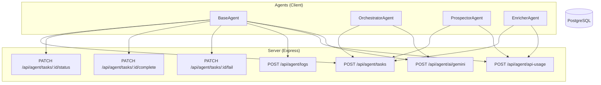
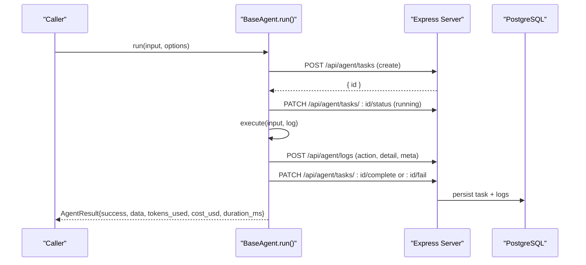
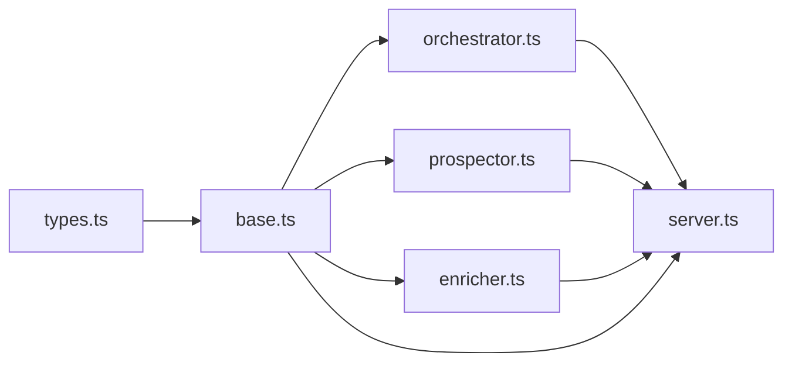

# Agent Framework Core

<cite>
**Referenced Files in This Document**
- [base.ts](file://src/agents/base.ts)
- [types.ts](file://src/agents/types.ts)
- [index.ts](file://src/agents/index.ts)
- [orchestrator.ts](file://src/agents/orchestrator.ts)
- [prospector.ts](file://src/agents/prospector.ts)
- [enricher.ts](file://src/agents/enricher.ts)
- [server.ts](file://server.ts)
</cite>

## Table of Contents
1. [Introduction](#introduction)
2. [Project Structure](#project-structure)
3. [Core Components](#core-components)
4. [Architecture Overview](#architecture-overview)
5. [Detailed Component Analysis](#detailed-component-analysis)
6. [Dependency Analysis](#dependency-analysis)
7. [Performance Considerations](#performance-considerations)
8. [Troubleshooting Guide](#troubleshooting-guide)
9. [Conclusion](#conclusion)
10. [Appendices](#appendices)

## Introduction
This document explains the core agent framework architecture used by the application. It focuses on the BaseAgent class, its lifecycle management, the shared type system (AgentName, AgentResult, AgentTask, and related interfaces), and the agent registry pattern exposed via index.ts. It also provides guidelines for implementing custom agents, handling communication protocols with the server endpoints, error handling strategies, and performance considerations. Concrete examples are provided through references to actual code locations rather than inline code snippets.

## Project Structure
The agent framework is implemented under src/agents and integrates with a Node/Express server that exposes REST endpoints for task management, logging, API usage tracking, and AI proxying. The key files are:
- base.ts: Abstract BaseAgent class providing lifecycle, retries, logging, and API helpers.
- types.ts: Shared TypeScript types for agents, tasks, logs, results, and domain entities.
- orchestrator.ts: OrchestratorAgent that plans and dispatches multi-step workflows.
- prospector.ts: ProspectorAgent implementation for company discovery.
- enricher.ts: EnricherAgent implementation for lead enrichment.
- index.ts: Registry module exporting agent classes, instances, and shared types.
- server.ts: Express server exposing /api/agent/* endpoints for persistence and orchestration.



**Diagram sources**
- [base.ts:76-171](file://src/agents/base.ts#L76-L171)
- [orchestrator.ts:147-177](file://src/agents/orchestrator.ts#L147-L177)
- [prospector.ts:41-66](file://src/agents/prospector.ts#L41-L66)
- [enricher.ts:46-70](file://src/agents/enricher.ts#L46-L70)
- [server.ts:3889-4100](file://server.ts#L3889-L4100)

**Section sources**
- [base.ts:1-199](file://src/agents/base.ts#L1-L199)
- [types.ts:1-181](file://src/agents/types.ts#L1-L181)
- [index.ts:1-28](file://src/agents/index.ts#L1-L28)
- [server.ts:3889-4100](file://server.ts#L3889-L4100)

## Core Components
- BaseAgent: Abstract base class that standardizes agent execution, task lifecycle, retry/backoff, logging, cost tracking, and AI calls.
- OrchestratorAgent: Specialized agent that converts natural-language objectives into structured execution plans and dispatches dependent steps.
- ProspectorAgent: Implements prospecting logic by calling server-side runners for external data sources.
- EnricherAgent: Enriches leads using multiple services and tracks usage/costs.
- Types: Strongly-typed definitions for agent names, task types, statuses, results, logs, and domain models.

Key responsibilities:
- Lifecycle: create → running → complete/fail with status transitions.
- Retries: exponential backoff with configurable max retries.
- Logging: structured logs per task with optional token/cost metadata.
- Cost tracking: per-API usage and per-task duration/cost aggregation.
- AI integration: centralized Gemini proxy endpoint for consistent model access and usage accounting.

**Section sources**
- [base.ts:18-193](file://src/agents/base.ts#L18-L193)
- [orchestrator.ts:10-181](file://src/agents/orchestrator.ts#L10-L181)
- [prospector.ts:26-71](file://src/agents/prospector.ts#L26-L71)
- [enricher.ts:32-75](file://src/agents/enricher.ts#L32-L75)
- [types.ts:5-181](file://src/agents/types.ts#L5-L181)

## Architecture Overview
The framework follows a client-side agent runtime communicating with a server-side API layer. Agents encapsulate business logic while delegating persistence and external integrations to the server. The orchestrator coordinates multi-step workflows with dependency resolution.



**Diagram sources**
- [base.ts:31-73](file://src/agents/base.ts#L31-L73)
- [server.ts:3889-3996](file://server.ts#L3889-L3996)

## Detailed Component Analysis

### BaseAgent Class
BaseAgent defines the contract and common behavior for all agents:
- Abstract members: name (AgentName), taskType (TaskType).
- Public entry point: run(input, options) manages lifecycle, retries, and timing.
- Task lifecycle methods: createTask, updateTaskStatus, completeTask, failTask.
- Logging and tracking: log(action, detail, meta), trackApiUsage(opts).
- AI helper: callGemini(prompt, opts) proxies to server endpoint.

Lifecycle flow:
- Create task record with input and metadata.
- Update status to running.
- Execute business logic via subclass-provided execute(input, log).
- Complete or fail task with aggregated metrics.
- Return standardized result including duration.

Retries:
- Configurable maxRetries with exponential backoff.
- Logs each retry attempt and final failure reason.

Error handling:
- Non-fatal network errors during status updates/logging are swallowed to avoid blocking execution.
- Exceptions thrown in execute propagate up and trigger failTask after retries.

Performance characteristics:
- Minimal synchronous overhead; I/O-bound operations use async fetch calls.
- Backoff prevents thundering herds on transient failures.

```mermaid
classDiagram
class BaseAgent {
+name : AgentName
+taskType : TaskType
-taskId : string|null
+run(input, options) Promise~AgentResult~
#execute(input, log) Promise~AgentResult~
-createTask(input, opts) Promise~{id}~
-updateTaskStatus(status) Promise~void~
-completeTask(result, durationMs) Promise~void~
-failTask(error, durationMs) Promise~void~
#log(action, detail, meta) Promise~void~
#trackApiUsage(opts) Promise~void~
#callGemini(prompt, opts) Promise~{text,tokensIn,tokensOut,costUsd}~
}
```

**Diagram sources**
- [base.ts:18-193](file://src/agents/base.ts#L18-L193)

**Section sources**
- [base.ts:18-193](file://src/agents/base.ts#L18-L193)

### Type System
Shared types define the contract between agents and the server:
- AgentName: Enumerated agent identifiers.
- TaskType: Enumerated task categories.
- TaskStatus: Lifecycle states for tasks.
- AgentTask: Persistent task record shape.
- AgentLog: Structured log entries.
- AgentResult: Standardized return value from execute.
- Domain models: Company, EnrichedLead, Proposal, Campaign, CampaignEmail, Conversation.

These types ensure consistency across client-side agents and server-side handlers.

**Section sources**
- [types.ts:5-181](file://src/agents/types.ts#L5-L181)

### Agent Registry Pattern
The registry module re-exports agent classes and pre-instantiated singletons, centralizing imports and simplifying usage throughout the app. It also re-exports shared types for consumers.

Key exports:
- BaseAgent abstract class.
- OrchestratorAgent and orchestratorAgent instance.
- ProspectorAgent and prospectorAgent instance.
- EnricherAgent and enricherAgent instance.
- All shared types from types.ts.

Usage pattern:
- Import specific agent classes or instances from index.ts.
- Use typed inputs/outputs defined alongside each agent.

**Section sources**
- [index.ts:1-28](file://src/agents/index.ts#L1-L28)

### OrchestratorAgent
Responsibilities:
- Parse natural-language objective into a structured plan via Gemini.
- Persist orchestration plan and assign an orchestration ID.
- Dispatch steps sequentially, respecting depends_on constraints.
- Aggregate results and report completion/failure counts.

Communication:
- Uses BaseAgent.callGemini for plan generation.
- Creates child tasks via POST /api/agent/tasks with parent_task_id linkage.

Error handling:
- Logs skipped steps when dependencies fail.
- Catches dispatch errors and records them without halting the entire workflow.

**Section sources**
- [orchestrator.ts:10-181](file://src/agents/orchestrator.ts#L10-L181)

### ProspectorAgent
Responsibilities:
- Validate required inputs (industry, city).
- Call server-side runner endpoint for prospecting.
- Track API usage and estimate costs based on companies found.
- Return standardized result with counts and new company IDs.

Communication:
- POST /api/agent/run/prospect with industry, city, country, limit, source.

Error handling:
- Throws descriptive errors on non-ok responses.
- Logs actions and outcomes.

**Section sources**
- [prospector.ts:26-71](file://src/agents/prospector.ts#L26-L71)

### EnricherAgent
Responsibilities:
- Validate required inputs (company_id, company_name).
- Call server-side runner endpoint for enrichment.
- Track API usage and fixed cost per enrichment.
- Return enriched data including contacts and pain-point analysis.

Communication:
- POST /api/agent/run/enrich with company details.

Error handling:
- Throws descriptive errors on non-ok responses.
- Logs actions and outcomes.

**Section sources**
- [enricher.ts:32-75](file://src/agents/enricher.ts#L32-L75)

### Server-Side Agent Endpoints
The Express server implements the agent API surface:
- Task CRUD and status transitions:
  - POST /api/agent/tasks
  - GET /api/agent/tasks
  - GET /api/agent/tasks/:id
  - PATCH /api/agent/tasks/:id/status
  - PATCH /api/agent/tasks/:id/complete
  - PATCH /api/agent/tasks/:id/fail
- Logging:
  - POST /api/agent/logs
  - GET /api/agent/logs
- Usage tracking:
  - POST /api/agent/api-usage
- AI proxy:
  - POST /api/agent/ai/gemini

Persistence:
- PostgreSQL queries insert/update agent_tasks and agent_logs tables.
- Aggregates tokens, costs, and durations for observability.

Security and validation:
- Input validation and error responses for missing fields.
- Centralized error handling with consistent JSON error shapes.

**Section sources**
- [server.ts:3889-4100](file://server.ts#L3889-L4100)

## Dependency Analysis
The agent framework exhibits clear separation of concerns:
- BaseAgent depends on shared types and communicates exclusively via HTTP endpoints.
- Concrete agents depend on BaseAgent and server endpoints for external integrations.
- OrchestratorAgent depends on BaseAgent and server endpoints for planning and dispatch.
- Server endpoints depend on PostgreSQL and external AI services via a proxy.



**Diagram sources**
- [types.ts:5-181](file://src/agents/types.ts#L5-L181)
- [base.ts:18-193](file://src/agents/base.ts#L18-L193)
- [orchestrator.ts:10-181](file://src/agents/orchestrator.ts#L10-L181)
- [prospector.ts:26-71](file://src/agents/prospector.ts#L26-L71)
- [enricher.ts:32-75](file://src/agents/enricher.ts#L32-L75)
- [server.ts:3889-4100](file://server.ts#L3889-L4100)

**Section sources**
- [index.ts:1-28](file://src/agents/index.ts#L1-L28)
- [server.ts:3889-4100](file://server.ts#L3889-L4100)

## Performance Considerations
- Retry strategy: Exponential backoff reduces load spikes and improves resilience against transient failures.
- Async I/O: All network calls are non-blocking; avoid synchronous operations in execute.
- Logging granularity: Keep log payloads minimal to reduce bandwidth and DB write overhead.
- Cost tracking: Use trackApiUsage sparingly; aggregate where possible to minimize requests.
- Concurrency: Avoid fan-out patterns within a single agent unless necessary; prefer sequential processing with dependency checks in orchestrator.
- Timeouts: Consider adding request timeouts for external APIs to prevent hanging tasks.

[No sources needed since this section provides general guidance]

## Troubleshooting Guide
Common issues and resolutions:
- Task creation fails:
  - Verify server endpoint availability and database connectivity.
  - Check required fields (type, agent_name) in request payload.
- Status updates not reflected:
  - Ensure taskId is set before calling updateTaskStatus.
  - Inspect server logs for SQL errors.
- Execution errors:
  - Review execute implementation for input validation and error throwing.
  - Check retry count and backoff behavior.
- Logging gaps:
  - Confirm log calls include agent_name and action.
  - Verify server accepts and persists logs.
- AI proxy failures:
  - Ensure GEMINI_API_KEY or fallback key is configured.
  - Validate prompt format and model selection.

**Section sources**
- [server.ts:3889-4100](file://server.ts#L3889-L4100)
- [base.ts:76-171](file://src/agents/base.ts#L76-L171)

## Conclusion
The agent framework provides a robust, extensible foundation for building autonomous agents with standardized lifecycle management, observability, and cost tracking. By extending BaseAgent and adhering to the shared type system, developers can implement specialized agents that integrate seamlessly with the server’s API surface. The orchestrator enables complex, dependency-aware workflows, while the registry simplifies instantiation and import patterns. Following the guidelines in this document ensures reliable, maintainable, and performant agent implementations.

[No sources needed since this section summarizes without analyzing specific files]

## Appendices

### Guidelines for Implementing Custom Agents
- Extend BaseAgent and implement:
  - name: Assign a unique AgentName.
  - taskType: Assign a corresponding TaskType.
  - execute(input, log): Implement business logic, validate inputs, call server endpoints, and return AgentResult.
- Use log() to record meaningful actions and optional metadata (tokens, cost, duration).
- Use trackApiUsage() to account for external API consumption.
- Handle errors explicitly; throw descriptive errors to trigger retry/fail logic.
- Prefer server-side runners for sensitive operations requiring API keys.

**Section sources**
- [base.ts:18-193](file://src/agents/base.ts#L18-L193)
- [types.ts:5-181](file://src/agents/types.ts#L5-L181)

### Example Workflows
- Instantiating an agent:
  - Import from index.ts and call run(input, options).
- Executing a task:
  - Provide input conforming to the agent’s expected schema.
  - Optionally pass taskId, parentTaskId, maxRetries.
- Processing results:
  - Inspect success flag, data payload, tokens_used, cost_usd, duration_ms.

**Section sources**
- [index.ts:1-28](file://src/agents/index.ts#L1-L28)
- [base.ts:31-73](file://src/agents/base.ts#L31-L73)