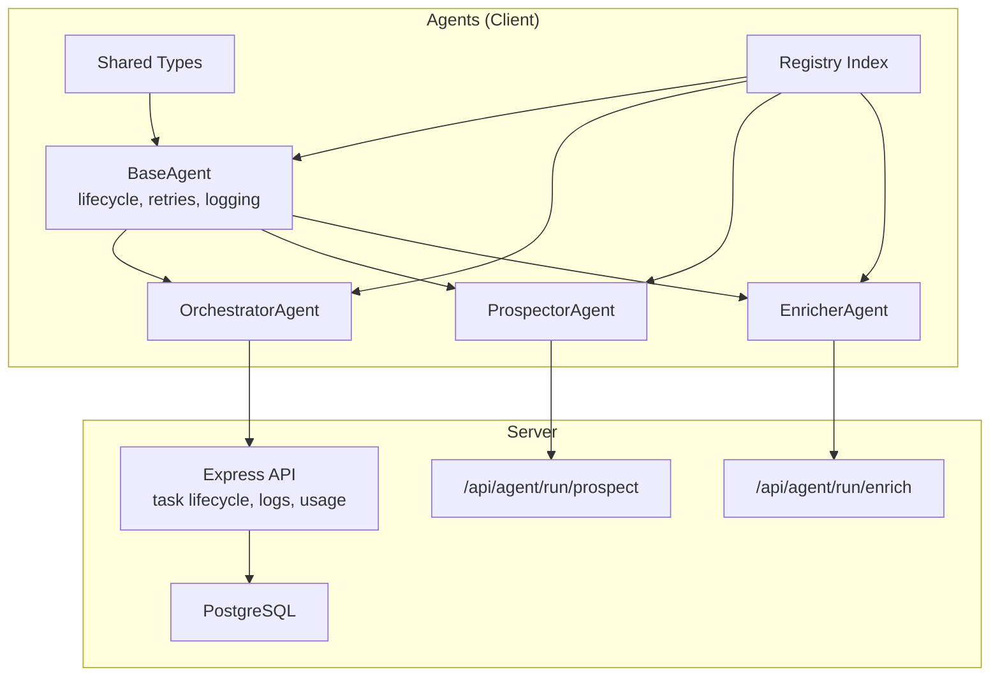
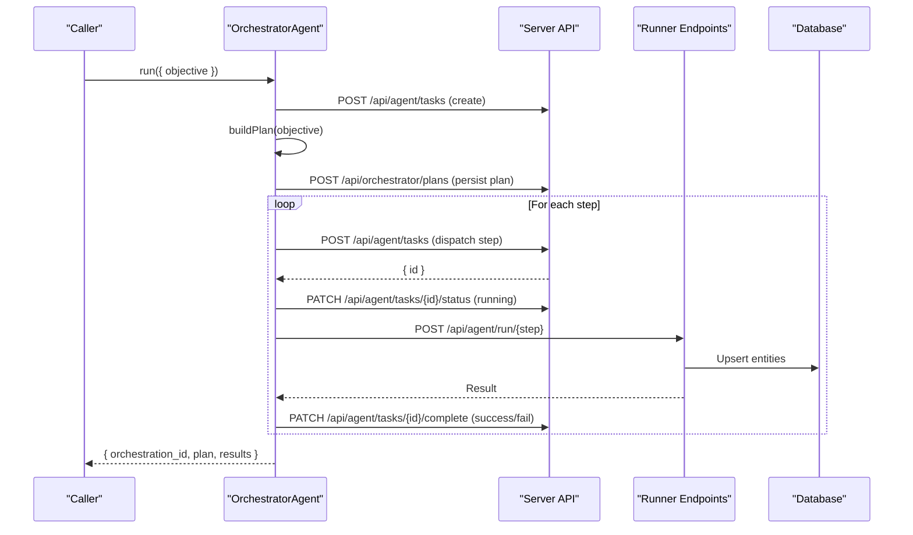
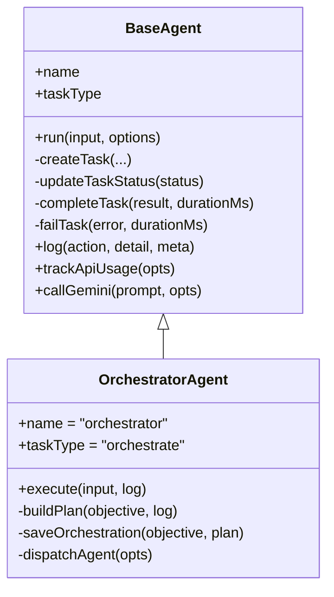
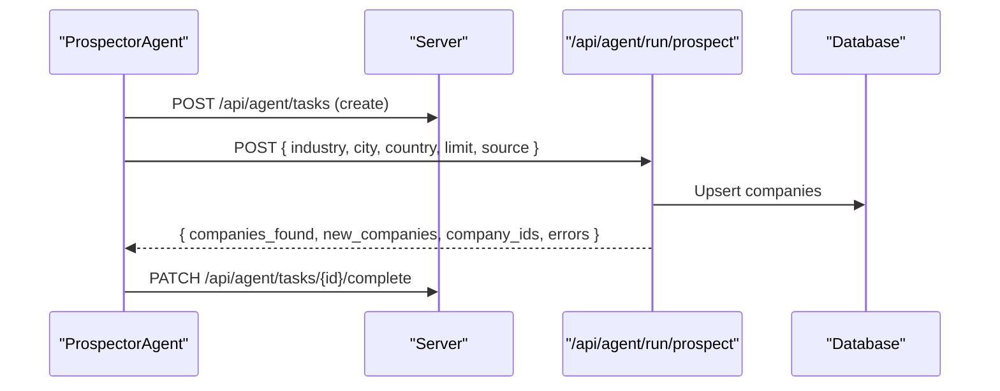
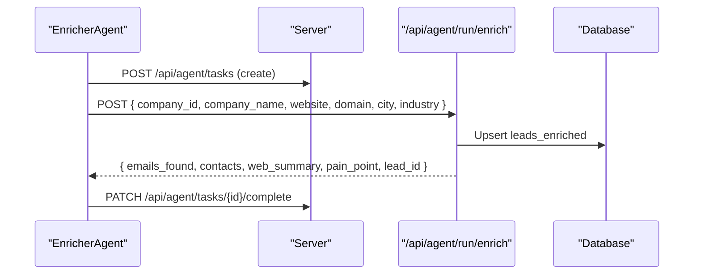
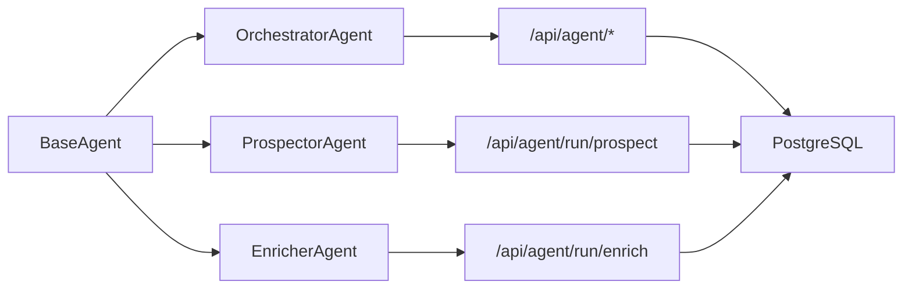

# Custom Agent Development

<cite>
**Referenced Files in This Document**
- [base.ts](file://src/agents/base.ts)
- [types.ts](file://src/agents/types.ts)
- [index.ts](file://src/agents/index.ts)
- [orchestrator.ts](file://src/agents/orchestrator.ts)
- [prospector.ts](file://src/agents/prospector.ts)
- [enricher.ts](file://src/agents/enricher.ts)
- [server.ts](file://server.ts)
- [package.json](file://package.json)
- [README.md](file://README.md)
</cite>

## Table of Contents
1. Introduction
2. Project Structure
3. Core Components
4. Architecture Overview
5. Detailed Component Analysis
6. Dependency Analysis
7. Performance Considerations
8. Troubleshooting Guide
9. Conclusion
10. Appendices

## Introduction
This guide explains how to develop custom AI agents within the Clientum framework. It covers extending BaseAgent, implementing required methods, defining input/output schemas, registering agents, dependency injection patterns, configuration management, integration with external APIs, performance optimization, debugging strategies, monitoring agent health, and scaling for high-throughput scenarios. The examples are grounded in the existing Orchestrator, Prospector, and Enricher agents and their server-side execution endpoints.

## Project Structure
The agent framework is implemented under src/agents with a clear separation between base infrastructure, concrete agents, shared types, and a registry index. Server-side execution and external integrations live in server.ts. Configuration and environment setup are described in README.md and package.json.



**Diagram sources**
- [base.ts:18-193](file://src/agents/base.ts#L18-L193)
- [orchestrator.ts:10-180](file://src/agents/orchestrator.ts#L10-L180)
- [prospector.ts:26-71](file://src/agents/prospector.ts#L26-L71)
- [enricher.ts:32-75](file://src/agents/enricher.ts#L32-L75)
- [types.ts:5-31](file://src/agents/types.ts#L5-L31)
- [index.ts:5-10](file://src/agents/index.ts#L5-L10)
- [server.ts:4303-4492](file://server.ts#L4303-L4492)

**Section sources**
- [base.ts:18-193](file://src/agents/base.ts#L18-L193)
- [types.ts:5-31](file://src/agents/types.ts#L5-L31)
- [index.ts:5-10](file://src/agents/index.ts#L5-L10)
- [orchestrator.ts:10-180](file://src/agents/orchestrator.ts#L10-L180)
- [prospector.ts:26-71](file://src/agents/prospector.ts#L26-L71)
- [enricher.ts:32-75](file://src/agents/enricher.ts#L32-L75)
- [server.ts:4303-4492](file://server.ts#L4303-L4492)

## Core Components
- BaseAgent: Abstract class providing task lifecycle management, retry/backoff, logging, cost tracking, and helper utilities like callGemini and trackApiUsage.
- OrchestratorAgent: Parses natural-language objectives into structured plans and dispatches steps to other agents via server endpoints.
- ProspectorAgent: Delegates company discovery to a server-side runner that integrates Google Places or Apify.
- EnricherAgent: Delegates enrichment to a server-side runner integrating Hunter.io, optional web scraping, and Gemini analysis.
- Shared Types: Defines AgentName, TaskType, AgentResult, AgentTask, AgentLog, and domain models used across agents and server.

Key responsibilities:
- Input validation inside execute() before calling external services.
- Use log() to record actions and metadata for observability.
- Use trackApiUsage() to report token/cost metrics.
- Return typed AgentResult with success flag, data payload, and optional cost/tokens.

**Section sources**
- [base.ts:18-193](file://src/agents/base.ts#L18-L193)
- [orchestrator.ts:10-180](file://src/agents/orchestrator.ts#L10-L180)
- [prospector.ts:26-71](file://src/agents/prospector.ts#L26-L71)
- [enricher.ts:32-75](file://src/agents/enricher.ts#L32-L75)
- [types.ts:5-31](file://src/agents/types.ts#L5-L31)

## Architecture Overview
The client-side agents orchestrate tasks by creating and updating task records through /api/agent/* endpoints. Concrete business logic requiring secrets runs server-side behind dedicated /api/agent/run/* endpoints. The orchestrator composes multi-step workflows and delegates step execution to specific agents.



**Diagram sources**
- [orchestrator.ts:14-76](file://src/agents/orchestrator.ts#L14-L76)
- [orchestrator.ts:147-177](file://src/agents/orchestrator.ts#L147-L177)
- [base.ts:76-126](file://src/agents/base.ts#L76-L126)
- [server.ts:4303-4492](file://server.ts#L4303-L4492)

## Detailed Component Analysis

### BaseAgent Lifecycle and Utilities
BaseAgent encapsulates:
- run(): Creates task, updates status, executes with retries and exponential backoff, completes or fails task, returns duration and result.
- createTask(), updateTaskStatus(), completeTask(), failTask(): HTTP calls to manage task state.
- log(): Posts structured logs with optional tokens, API name, cost, and duration.
- trackApiUsage(): Reports API usage metrics.
- callGemini(): Standardized call to Gemini via server endpoint.

Best practices:
- Always validate inputs in execute() before making external calls.
- Use log() at key decision points and around I/O operations.
- Report tokens and costs via trackApiUsage() and AgentResult fields.

```mermaid
flowchart TD
Start([run() entry]) --> CreateTask["Create task via /api/agent/tasks"]
CreateTask --> Loop{"Attempt <= maxRetries?"}
Loop --> |Yes| UpdateStatus["PATCH status=running"]
UpdateStatus --> Execute["execute(input, log)"]
Execute --> Success{"Success?"}
Success --> |Yes| Complete["PATCH complete with output, tokens, cost, duration"]
Success --> |No| Retry["log retry + sleep(backoff)"]
Retry --> Loop
Loop --> |No| Fail["PATCH fail with error and duration"]
Complete --> End([Return result])
Fail --> End
```

**Diagram sources**
- [base.ts:31-73](file://src/agents/base.ts#L31-L73)
- [base.ts:76-126](file://src/agents/base.ts#L76-L126)

**Section sources**
- [base.ts:18-193](file://src/agents/base.ts#L18-L193)

### OrchestratorAgent
Responsibilities:
- Parse objective into an execution plan using Gemini.
- Persist plan and dispatch steps respecting dependencies.
- Track per-step success and aggregate results.

Implementation highlights:
- Uses callGemini() with a system prompt describing available agents and task types.
- Falls back to a default plan if Gemini response parsing fails.
- Dispatches via POST /api/agent/tasks and tracks parent_task_id.



**Diagram sources**
- [base.ts:18-193](file://src/agents/base.ts#L18-L193)
- [orchestrator.ts:10-180](file://src/agents/orchestrator.ts#L10-L180)

**Section sources**
- [orchestrator.ts:14-76](file://src/agents/orchestrator.ts#L14-L76)
- [orchestrator.ts:78-144](file://src/agents/orchestrator.ts#L78-L144)
- [orchestrator.ts:147-177](file://src/agents/orchestrator.ts#L147-L177)

### ProspectorAgent
Responsibilities:
- Validate input (industry, city).
- Call server-side runner POST /api/agent/run/prospect.
- Track API usage and return standardized result.

Input/Output schema:
- Input: industry, city, country, limit, source.
- Output: companies_found, new_companies, company_ids, errors.



**Diagram sources**
- [prospector.ts:30-67](file://src/agents/prospector.ts#L30-L67)
- [server.ts:4303-4392](file://server.ts#L4303-L4392)

**Section sources**
- [prospector.ts:26-71](file://src/agents/prospector.ts#L26-L71)

### EnricherAgent
Responsibilities:
- Validate input (company_id, company_name).
- Call server-side runner POST /api/agent/run/enrich.
- Track API usage and return standardized result.

Input/Output schema:
- Input: company_id, company_name, website, domain, city, industry.
- Output: company_id, emails_found, contacts[], web_summary?, pain_point?, lead_id?



**Diagram sources**
- [enricher.ts:36-71](file://src/agents/enricher.ts#L36-L71)
- [server.ts:4394-4492](file://server.ts#L4394-L4492)

**Section sources**
- [enricher.ts:32-75](file://src/agents/enricher.ts#L32-L75)

### Shared Types and Registry
- Types define AgentName, TaskType, AgentResult, AgentTask, AgentLog, and domain models.
- Registry index re-exports BaseAgent, concrete agents, and types for consumers.

Use cases:
- Strongly-typed inputs/outputs for agents.
- Centralized type definitions ensure consistency across client and server.

**Section sources**
- [types.ts:5-31](file://src/agents/types.ts#L5-L31)
- [index.ts:5-10](file://src/agents/index.ts#L5-L10)

## Dependency Analysis
Client-side agents depend on:
- BaseAgent for lifecycle, logging, retries, and Gemini helper.
- Server endpoints for task management and specialized runners.

Server depends on:
- PostgreSQL for persistence.
- External APIs (Google Places, Apify, Hunter.io, Firecrawl, Gemini) invoked server-side.



**Diagram sources**
- [base.ts:18-193](file://src/agents/base.ts#L18-L193)
- [orchestrator.ts:147-177](file://src/agents/orchestrator.ts#L147-L177)
- [prospector.ts:41-67](file://src/agents/prospector.ts#L41-L67)
- [enricher.ts:46-71](file://src/agents/enricher.ts#L46-L71)
- [server.ts:4303-4492](file://server.ts#L4303-L4492)

**Section sources**
- [base.ts:18-193](file://src/agents/base.ts#L18-L193)
- [server.ts:4303-4492](file://server.ts#L4303-L4492)

## Performance Considerations
- Retries and backoff: BaseAgent implements exponential backoff; tune maxRetries per agent workload.
- Batch operations: Prefer batch upserts on server side to reduce round-trips (see prospect and enrich runners).
- Caching: Cache expensive lookups (e.g., domain enrichment) when safe.
- Timeouts: Set request timeouts for external calls to avoid hanging tasks.
- Concurrency: Limit concurrent tasks per agent to protect downstream APIs and database.
- Cost control: Track tokens and costs via trackApiUsage() and AgentResult.cost_usd; set budgets and alerts.

[No sources needed since this section provides general guidance]

## Troubleshooting Guide
Common issues and resolutions:
- Task creation failures: Verify server availability and network reachability; check API_BASE configuration.
- Status updates not persisted: Ensure taskId is set before calling updateTaskStatus(); confirm server endpoints accept PATCH requests.
- Logging gaps: Confirm log() is called after task creation; verify /api/agent/logs accepts payloads.
- External API errors: Inspect server logs for runner endpoints; validate environment variables for API keys.
- Orchestration plan parsing: If Gemini returns non-JSON, fallback plan is used; improve prompts and model selection.

Operational tips:
- Monitor SystemStatus fields (active_tasks, pending_tasks, failed_tasks_24h, completed_tasks_24h, total_cost_usd_24h, total_tokens_24h, agents_running).
- Use detailed logs with action names and durations to pinpoint bottlenecks.
- Add explicit error messages in execute() for invalid inputs.

**Section sources**
- [base.ts:76-126](file://src/agents/base.ts#L76-L126)
- [base.ts:129-171](file://src/agents/base.ts#L129-L171)
- [types.ts:84-93](file://src/agents/types.ts#L84-L93)
- [server.ts:4303-4492](file://server.ts#L4303-L4492)

## Conclusion
The Clientum agent framework provides a robust foundation for building custom AI agents. By extending BaseAgent, implementing execute() with strong input validation, leveraging built-in logging and cost tracking, and delegating sensitive operations to server-side runners, you can create reliable, observable, and scalable agents. Use the Orchestrator to compose complex workflows and integrate external APIs securely. Follow best practices for retries, timeouts, concurrency, and monitoring to achieve high throughput and resilience.

[No sources needed since this section summarizes without analyzing specific files]

## Appendices

### Step-by-Step: Creating a New Agent
1. Define input/output interfaces in your agent file.
2. Extend BaseAgent and implement:
   - name and taskType properties.
   - execute(input, log) method with validation, logging, and external calls.
   - Return AgentResult with success, data, and optional tokens/cost.
3. Register the agent in src/agents/index.ts for export.
4. Add server-side runner endpoint(s) under server.ts for secret-heavy operations.
5. Wire the orchestrator to include your new agent/taskType in planning prompts if applicable.
6. Test via the orchestrator or direct agent.run() calls; monitor logs and task status.

**Section sources**
- [index.ts:5-10](file://src/agents/index.ts#L5-L10)
- [base.ts:18-193](file://src/agents/base.ts#L18-L193)
- [server.ts:4303-4492](file://server.ts#L4303-L4492)

### Best Practices Summary
- Validate inputs early in execute().
- Log meaningful actions with context and durations.
- Track API usage and costs consistently.
- Handle errors gracefully with informative messages.
- Use server-side runners for secrets and heavy processing.
- Keep agents focused and composable via the orchestrator.

**Section sources**
- [base.ts:129-171](file://src/agents/base.ts#L129-L171)
- [orchestrator.ts:78-144](file://src/agents/orchestrator.ts#L78-L144)

### Environment and Setup
- Install dependencies and configure environment variables as described in README.md.
- Ensure DATABASE_URL and API keys are set for server-side runners.
- Use package.json scripts to run dev, build, and start processes.

**Section sources**
- [README.md:11-21](file://README.md#L11-L21)
- [package.json:6-13](file://package.json#L6-L13)