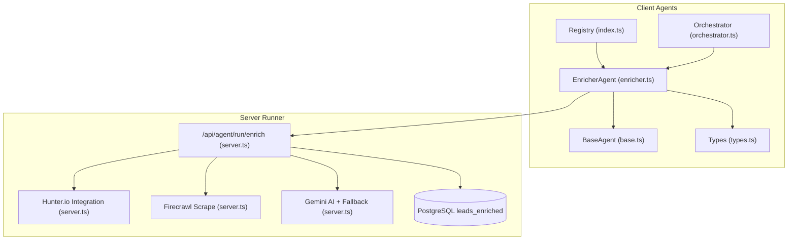
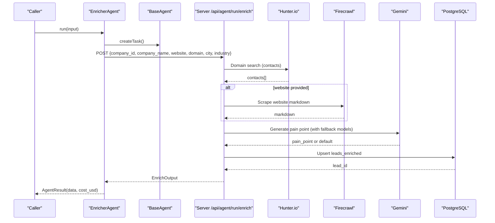
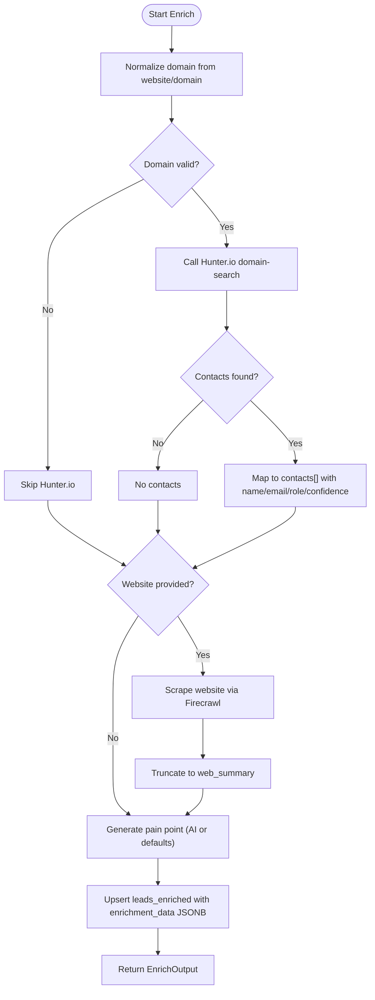
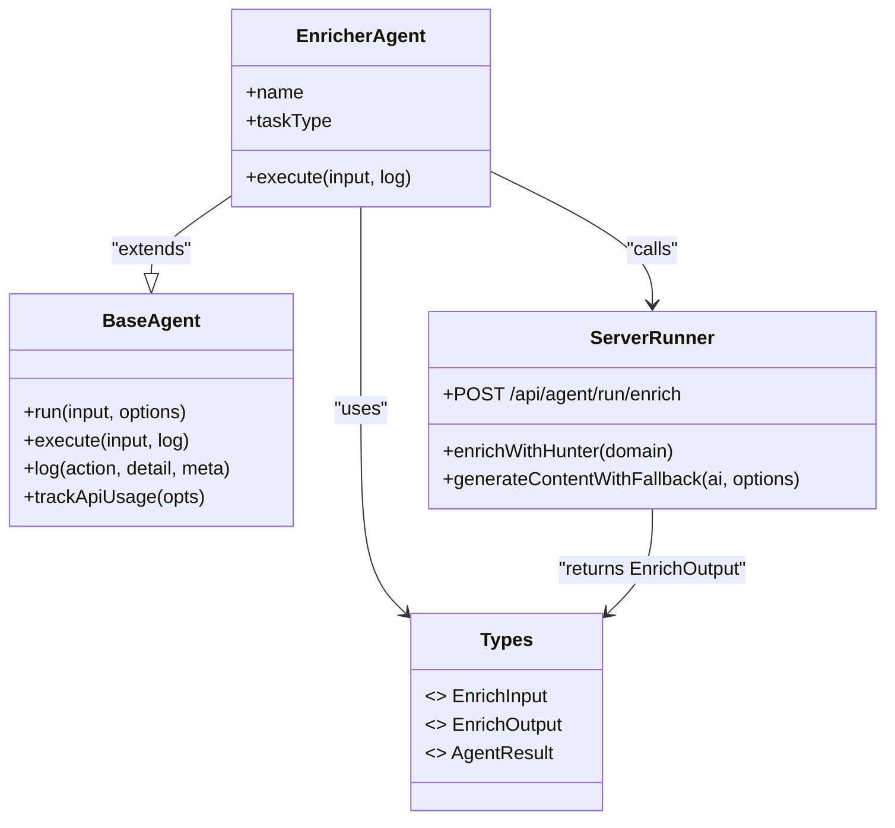

# Enricher Agent

<cite>
**Referenced Files in This Document**
- [enricher.ts](file://src/agents/enricher.ts)
- [base.ts](file://src/agents/base.ts)
- [types.ts](file://src/agents/types.ts)
- [index.ts](file://src/agents/index.ts)
- [orchestrator.ts](file://src/agents/orchestrator.ts)
- [server.ts](file://server.ts)
</cite>

## Table of Contents
1. Introduction
2. Project Structure
3. Core Components
4. Architecture Overview
5. Detailed Component Analysis
6. Dependency Analysis
7. Performance Considerations
8. Troubleshooting Guide
9. Conclusion

## Introduction
The EnricherAgent enhances lead data by combining multiple external sources to produce a richer, more actionable profile for each company. It orchestrates domain-based contact discovery, optional website content extraction, and AI-driven pain-point analysis, then persists the enriched results into the application’s database. The agent is part of a broader multi-agent system where an Orchestrator can dispatch enrichment tasks as part of a larger sales workflow.

## Project Structure
The EnricherAgent lives within the agents module and delegates heavy lifting to a server-side runner endpoint. Key files:
- Client-side agent definition and schema types
- Base agent lifecycle and task management
- Server-side enrichment pipeline and integrations
- Agent registry and shared types

**Diagram sources**
- [enricher.ts:1-75](file://src/agents/enricher.ts#L1-L75)
- [base.ts:1-199](file://src/agents/base.ts#L1-L199)
- [types.ts:1-181](file://src/agents/types.ts#L1-L181)
- [index.ts:1-28](file://src/agents/index.ts#L1-L28)
- [orchestrator.ts:1-181](file://src/agents/orchestrator.ts#L1-L181)
- [server.ts:4390-4525](file://server.ts#L4390-L4525)

**Section sources**
- [enricher.ts:1-75](file://src/agents/enricher.ts#L1-L75)
- [base.ts:1-199](file://src/agents/base.ts#L1-L199)
- [types.ts:1-181](file://src/agents/types.ts#L1-L181)
- [index.ts:1-28](file://src/agents/index.ts#L1-L28)
- [orchestrator.ts:1-181](file://src/agents/orchestrator.ts#L1-L181)
- [server.ts:4390-4525](file://server.ts#L4390-L4525)

## Core Components
- EnrichInput and EnrichOutput schemas define the contract between client and server for enrichment requests and responses.
- EnricherAgent extends BaseAgent to reuse task lifecycle, retries, logging, and cost tracking.
- The server endpoint /api/agent/run/enrich implements the actual enrichment logic, integrating Hunter.io, Firecrawl, and Gemini with robust fallbacks.

Key responsibilities:
- Validate inputs and delegate execution to the server runner.
- Track API usage and costs.
- Return standardized AgentResult structures.

**Section sources**
- [enricher.ts:13-30](file://src/agents/enricher.ts#L13-L30)
- [enricher.ts:32-74](file://src/agents/enricher.ts#L32-L74)
- [base.ts:18-73](file://src/agents/base.ts#L18-L73)
- [types.ts:63-70](file://src/agents/types.ts#L63-L70)

## Architecture Overview
The enrichment flow spans client and server layers:
- The EnricherAgent validates input and calls the server endpoint.
- The server performs three stages:
  1) Hunter.io domain search to find contacts
  2) Optional Firecrawl scrape to summarize website content
  3) Gemini-powered pain-point generation with model fallbacks
- Results are persisted to PostgreSQL and returned to the client.

**Diagram sources**
- [enricher.ts:36-71](file://src/agents/enricher.ts#L36-L71)
- [base.ts:31-73](file://src/agents/base.ts#L31-L73)
- [server.ts:4396-4525](file://server.ts#L4396-L4525)
- [server.ts:1913-1959](file://server.ts#L1913-L1959)
- [server.ts:850-971](file://server.ts#L850-L971)

## Detailed Component Analysis

### EnrichInput and EnrichOutput Schemas
- EnrichInput fields:
  - company_id (required): Unique identifier for the company
  - company_name (required): Human-readable company name
  - website (optional): Company website URL
  - domain (optional): Domain string; derived from website if missing
  - city (optional): City for contextual pain-point generation
  - industry (optional): Industry vertical for tailored insights
- EnrichOutput fields:
  - company_id: Echoed identifier
  - emails_found: Count of discovered contacts
  - contacts: Array of contact objects with name, email, role, confidence
  - web_summary: Optional truncated website summary
  - pain_point: Optional AI-generated insight
  - lead_id: Database record ID for the enriched lead

These schemas ensure consistent contracts across client and server.

**Section sources**
- [enricher.ts:13-30](file://src/agents/enricher.ts#L13-L30)

### Enrichment Workflow and Data Transformation
The server-side pipeline executes these steps:
- Normalize domain from website or domain field
- Hunter.io integration to retrieve contacts
- Optional website scraping via Firecrawl
- AI pain-point generation using Gemini with model fallbacks
- Persist enriched data into PostgreSQL with upsert semantics

**Diagram sources**
- [server.ts:4396-4525](file://server.ts#L4396-L4525)
- [server.ts:1913-1959](file://server.ts#L1913-L1959)
- [server.ts:850-971](file://server.ts#L850-L971)

**Section sources**
- [server.ts:4396-4525](file://server.ts#L4396-L4525)

### Field Mapping Strategies
- Contacts mapping:
  - name: Concatenated first and last names when available
  - email: Primary email value
  - role: Position or default “Contact”
  - confidence: Confidence score from source
- Pain point generation:
  - Uses company_name, city, industry, and optional web_summary
  - Falls back to industry-specific templates if AI unavailable
- Persistence mapping:
  - Full name, email, role mapped to top-level columns
  - contacts[], web_summary, pain_point, domain stored in enrichment_data JSONB

**Section sources**
- [server.ts:1913-1959](file://server.ts#L1913-L1959)
- [server.ts:4486-4507](file://server.ts#L4486-L4507)

### Conflict Resolution and Data Consistency
- Upsert strategy on leads_enriched uses company_id and email as unique keys
- On conflict, enrichment_data is updated and timestamps refreshed
- Default values ensure partial enrichments still produce usable records

**Section sources**
- [server.ts:4486-4507](file://server.ts#L4486-L4507)

### Example Enrichment Requests and Responses
- Request payload includes company identifiers and optional context fields
- Response includes contact counts, contact arrays, summaries, and AI insights
- Lead IDs are returned for downstream processing

Example request fields:
- company_id, company_name, website, domain, city, industry

Example response fields:
- company_id, emails_found, contacts[], web_summary?, pain_point?, lead_id?

**Section sources**
- [enricher.ts:46-57](file://src/agents/enricher.ts#L46-L57)
- [server.ts:4513-4520](file://server.ts#L4513-L4520)

### Quality Checks and Validation
- Input validation ensures required fields exist before calling the runner
- Domain normalization guards against malformed URLs
- Graceful handling of external service failures prevents pipeline collapse

**Section sources**
- [enricher.ts:40-42](file://src/agents/enricher.ts#L40-L42)
- [server.ts:4398-4411](file://server.ts#L4398-L4411)

## Dependency Analysis
The EnricherAgent depends on:
- BaseAgent for lifecycle, retries, logging, and cost tracking
- Server endpoints for actual enrichment logic
- External services: Hunter.io, Firecrawl, Gemini
- PostgreSQL for persistence

**Diagram sources**
- [base.ts:18-73](file://src/agents/base.ts#L18-L73)
- [enricher.ts:32-74](file://src/agents/enricher.ts#L32-L74)
- [types.ts:63-70](file://src/agents/types.ts#L63-L70)
- [server.ts:4396-4525](file://server.ts#L4396-L4525)

**Section sources**
- [base.ts:18-73](file://src/agents/base.ts#L18-L73)
- [enricher.ts:32-74](file://src/agents/enricher.ts#L32-L74)
- [types.ts:63-70](file://src/agents/types.ts#L63-L70)
- [server.ts:4396-4525](file://server.ts#L4396-L4525)

## Performance Considerations
- Timeouts:
  - Hunter.io calls use short timeouts to avoid blocking
  - Firecrawl scrape has explicit timeout signals
- Retries and Backoff:
  - BaseAgent implements exponential backoff for transient errors
  - Gemini fallback cycles through multiple models and retries transient failures
- Concurrency:
  - Steps are sequential to maintain deterministic enrichment order
- Cost Tracking:
  - Each enrichment tracks approximate cost per call

Optimization opportunities:
- Cache frequent domain searches to reduce repeated API calls
- Batch enrichment for multiple companies when feasible
- Implement rate limiting at the server layer for external APIs

**Section sources**
- [base.ts:45-73](file://src/agents/base.ts#L45-L73)
- [server.ts:1933-1933](file://server.ts#L1933-L1933)
- [server.ts:4440-4440](file://server.ts#L4440-L4440)
- [server.ts:881-971](file://server.ts#L881-L971)

## Troubleshooting Guide
Common issues and resolutions:
- Missing required fields: Ensure company_id and company_name are present
- Domain normalization failures: Provide clean domains or valid websites
- External service unavailability:
  - Hunter.io: Check API key and quota; expect null results gracefully
  - Firecrawl: Network errors are ignored; continue without web_summary
  - Gemini: Model fallbacks and local defaults provide pain_point even when offline
- Database errors: Upsert handles conflicts; check constraints and indexes

Debugging tips:
- Inspect logs emitted by BaseAgent for task lifecycle events
- Review server logs for enrichment steps and errors
- Use health checks to verify external service connectivity

**Section sources**
- [enricher.ts:40-55](file://src/agents/enricher.ts#L40-L55)
- [server.ts:4447-4450](file://server.ts#L4447-L4450)
- [server.ts:4469-4472](file://server.ts#L4469-L4472)
- [server.ts:4521-4524](file://server.ts#L4521-L4524)

## Conclusion
The EnricherAgent provides a robust, extensible framework for enriching lead data through integrated external services and AI capabilities. Its design emphasizes reliability via fallbacks, clear schemas for consistency, and comprehensive lifecycle management. By combining contact discovery, website analysis, and AI-driven insights, it delivers high-quality enriched profiles ready for downstream sales workflows.