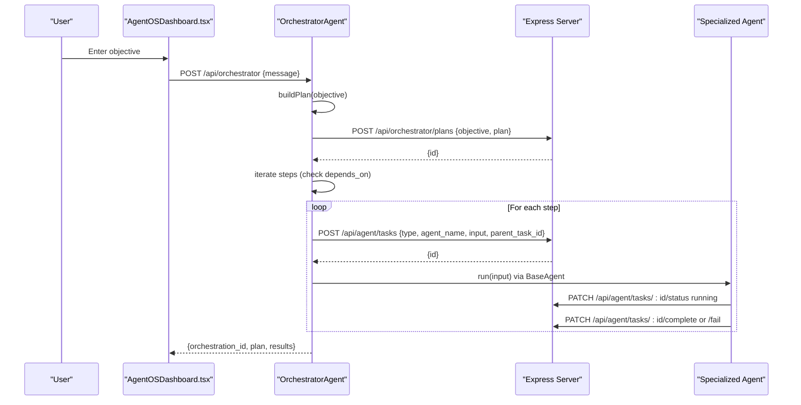
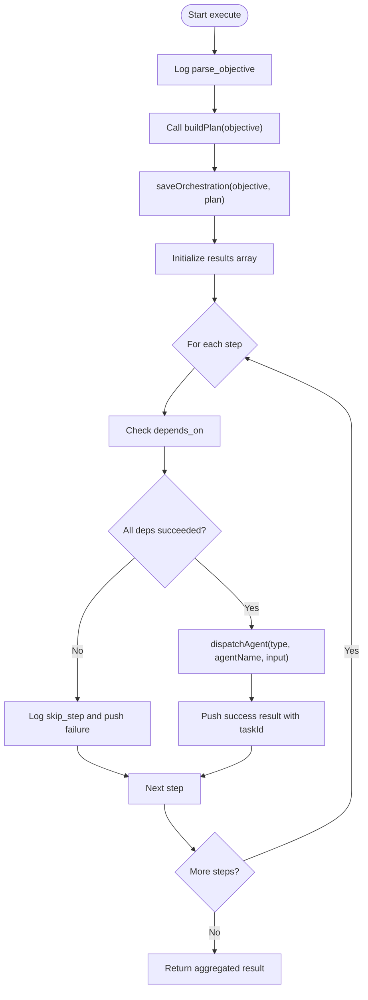
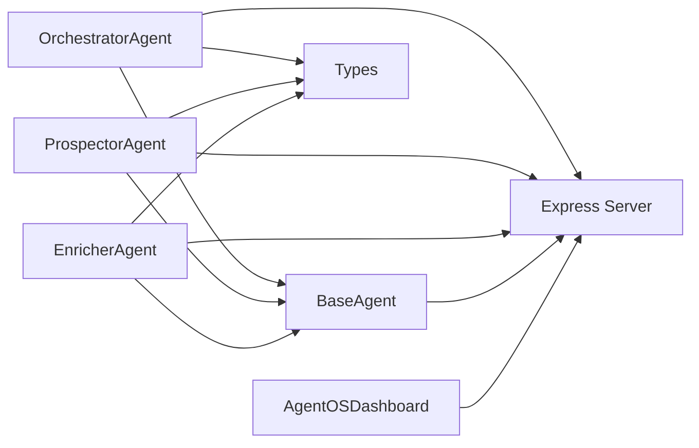

# Orchestrator Agent

<cite>
**Referenced Files in This Document**
- [orchestrator.ts](file://src/agents/orchestrator.ts)
- [base.ts](file://src/agents/base.ts)
- [types.ts](file://src/agents/types.ts)
- [index.ts](file://src/agents/index.ts)
- [prospector.ts](file://src/agents/prospector.ts)
- [enricher.ts](file://src/agents/enricher.ts)
- [AgentOSDashboard.tsx](file://src/components/crm-full/AgentOSDashboard.tsx)
- [server.ts](file://server.ts)
</cite>

## Table of Contents
1. Introduction
2. Project Structure
3. Core Components
4. Architecture Overview
5. Detailed Component Analysis
6. Dependency Analysis
7. Performance Considerations
8. Troubleshooting Guide
9. Conclusion

## Introduction
This document explains the OrchestratorAgent that coordinates multi-step AI workflows across specialized agents. It covers how the orchestrator decomposes objectives into executable plans, schedules and dispatches tasks to agents, manages inter-agent communication via REST endpoints, handles errors and retries, tracks progress, and aggregates results. It also includes guidance on performance optimization, concurrency limits, and debugging techniques for orchestrated tasks.

## Project Structure
The orchestration system is implemented as a set of TypeScript modules under src/agents, with a shared base class providing lifecycle, logging, retry, and API integration. The server exposes REST endpoints for task management, orchestration persistence, and status/metrics. The UI dashboard consumes these endpoints to visualize live state.

```mermaid
graph TB
subgraph "Frontend"
Dashboard["AgentOSDashboard.tsx"]
end
subgraph "Agents (Client)"
Base["BaseAgent (base.ts)"]
Orchestrator["OrchestratorAgent (orchestrator.ts)"]
Prospector["ProspectorAgent (prospector.ts)"]
Enricher["EnricherAgent (enricher.ts)"]
Types["Types (types.ts)"]
end
subgraph "Server"
Server["Express App (server.ts)"]
end
Dashboard --> Orchestrator
Orchestrator --> Base
Prospector --> Base
Enricher --> Base
Orchestrator --> Server
Prospector --> Server
Enricher --> Server
Base --> Server
Orchestrator --> Types
Prospector --> Types
Enricher --> Types
```

**Diagram sources**
- [orchestrator.ts:10-178](file://src/agents/orchestrator.ts#L10-L178)
- [base.ts:18-193](file://src/agents/base.ts#L18-L193)
- [prospector.ts:26-71](file://src/agents/prospector.ts#L26-L71)
- [enricher.ts:32-75](file://src/agents/enricher.ts#L32-L75)
- [types.ts:5-104](file://src/agents/types.ts#L5-L104)
- [AgentOSDashboard.tsx:143-200](file://src/components/crm-full/AgentOSDashboard.tsx#L143-L200)
- [server.ts:3889-3983](file://server.ts#L3889-L3983)

**Section sources**
- [orchestrator.ts:10-178](file://src/agents/orchestrator.ts#L10-L178)
- [base.ts:18-193](file://src/agents/base.ts#L18-L193)
- [types.ts:5-104](file://src/agents/types.ts#L5-L104)
- [AgentOSDashboard.tsx:143-200](file://src/components/crm-full/AgentOSDashboard.tsx#L143-L200)
- [server.ts:3889-3983](file://server.ts#L3889-L3983)

## Core Components
- OrchestratorAgent: Parses natural-language objectives, builds an execution plan using Gemini, persists the plan, and dispatches steps sequentially while respecting dependencies.
- BaseAgent: Provides common lifecycle (create/update/complete/fail), logging, retry with exponential backoff, cost tracking, and shared utilities like callGemini.
- Agent types: Strongly typed interfaces for tasks, logs, results, and orchestration plans.
- Specialized agents: ProspectorAgent and EnricherAgent demonstrate how agents implement execute() and delegate to server-side runners.

Key responsibilities:
- Task decomposition: OrchestratorAgent generates a structured plan with ordered steps, inputs, and dependency constraints.
- Scheduling: Steps are executed in order; dependencies are validated before dispatch.
- Inter-agent communication: Orchestrator uses REST endpoints to create tasks and pass parameters; agents update status and complete/fail via BaseAgent.
- Progress tracking: Each agent logs actions and updates task status; the dashboard polls for live updates.

**Section sources**
- [orchestrator.ts:14-76](file://src/agents/orchestrator.ts#L14-L76)
- [base.ts:31-73](file://src/agents/base.ts#L31-L73)
- [types.ts:33-104](file://src/agents/types.ts#L33-L104)
- [prospector.ts:30-67](file://src/agents/prospector.ts#L30-L67)
- [enricher.ts:36-71](file://src/agents/enricher.ts#L36-L71)

## Architecture Overview
The OrchestratorAgent acts as the single entry point for user objectives. It calls a language model to produce a JSON plan, persists it, then iterates through steps, checking dependencies and dispatching tasks to specific agents. Agents run their logic and report back via BaseAgent’s lifecycle methods. The server stores tasks/logs and exposes endpoints for status and metrics.



**Diagram sources**
- [orchestrator.ts:14-76](file://src/agents/orchestrator.ts#L14-L76)
- [orchestrator.ts:147-177](file://src/agents/orchestrator.ts#L147-L177)
- [base.ts:76-126](file://src/agents/base.ts#L76-L126)
- [server.ts:3889-3983](file://server.ts#L3889-L3983)
- [AgentOSDashboard.tsx:186-200](file://src/components/crm-full/AgentOSDashboard.tsx#L186-L200)

## Detailed Component Analysis

### OrchestratorAgent
Responsibilities:
- Parse objective and generate a plan using Gemini.
- Persist plan and assign orchestration ID.
- Execute steps sequentially, enforcing dependency checks.
- Dispatch tasks to agents and aggregate results.

Scheduling algorithm:
- Sequential iteration over plan.steps.
- Before executing a step, filter previous results to find dependencies by step.order.
- If any dependency failed, skip current step and record failure.

Error handling:
- Catches dispatch errors per step and records them without aborting the entire orchestration.
- Returns aggregated success/failure counts and per-step outcomes.

Parameter passing:
- Step input is merged with orchestration_id and passed to the agent task payload.

Result aggregation:
- Collects per-step results including taskId when available, and computes completed/failed totals.



**Diagram sources**
- [orchestrator.ts:14-76](file://src/agents/orchestrator.ts#L14-L76)
- [orchestrator.ts:147-177](file://src/agents/orchestrator.ts#L147-L177)

**Section sources**
- [orchestrator.ts:14-76](file://src/agents/orchestrator.ts#L14-L76)
- [orchestrator.ts:79-144](file://src/agents/orchestrator.ts#L79-L144)
- [orchestrator.ts:147-177](file://src/agents/orchestrator.ts#L147-L177)

### BaseAgent
Responsibilities:
- Provide a standardized run() method that creates tasks, updates status, executes agent logic, completes or fails tasks, and tracks duration.
- Implement retry with exponential backoff.
- Centralize logging and API usage tracking.
- Offer callGemini helper for LLM interactions.

Retry mechanism:
- Attempts up to maxRetries; on error, logs retry attempt, updates status to retrying, sleeps with increasing delay, then retries.

Progress tracking:
- Updates task status to running, then complete or fail with output, tokens, cost, and duration.

API integration:
- Uses fetch to interact with server endpoints for tasks and logs.

```mermaid
classDiagram
class BaseAgent {
+name : AgentName
+taskType : TaskType
-taskId : string|null
+run(input, options) AgentResult
-createTask(input, opts) Promise~{id}~
-updateTaskStatus(status) void
-completeTask(result, durationMs) void
-failTask(error, durationMs) void
+log(action, detail, meta) void
+trackApiUsage(opts) void
+callGemini(prompt, opts) Promise~{text,tokensIn,tokensOut,costUsd}~
}
```

**Diagram sources**
- [base.ts:18-193](file://src/agents/base.ts#L18-L193)

**Section sources**
- [base.ts:31-73](file://src/agents/base.ts#L31-L73)
- [base.ts:76-126](file://src/agents/base.ts#L76-L126)
- [base.ts:129-171](file://src/agents/base.ts#L129-L171)
- [base.ts:174-192](file://src/agents/base.ts#L174-L192)

### OrchestratorPlan Interface
Structure:
- objective: string describing the goal.
- steps: array of ordered steps, each specifying agent, type, input, optional depends_on, and description.

Complexity:
- Plan parsing involves extracting JSON from LLM response; fallback ensures robustness.

Validation:
- Orchestrator validates dependency satisfaction before dispatching steps.

**Section sources**
- [types.ts:72-82](file://src/agents/types.ts#L72-L82)
- [orchestrator.ts:79-144](file://src/agents/orchestrator.ts#L79-L144)

### Specialized Agents: ProspectorAgent and EnricherAgent
ProspectorAgent:
- Validates industry and city inputs.
- Calls server runner endpoint to search companies and returns counts and new company IDs.
- Tracks API usage and cost.

EnricherAgent:
- Validates company_id and company_name.
- Calls server runner to enrich leads with emails, web summary, and pain-point analysis.
- Tracks API usage and cost.

Both extend BaseAgent and implement execute(), delegating heavy operations to server-side runners.

**Section sources**
- [prospector.ts:30-67](file://src/agents/prospector.ts#L30-L67)
- [enricher.ts:36-71](file://src/agents/enricher.ts#L36-L71)

### UI Integration: AgentOSDashboard
- Polls /api/orchestrator/status, /api/pipeline/funnel, and /api/agent/tasks to display live state.
- Allows users to submit objectives to the orchestrator via POST /api/orchestrator.
- Shows task statuses, costs, and recent logs.

**Section sources**
- [AgentOSDashboard.tsx:143-200](file://src/components/crm-full/AgentOSDashboard.tsx#L143-L200)
- [AgentOSDashboard.tsx:314-341](file://src/components/crm-full/AgentOSDashboard.tsx#L314-L341)

## Dependency Analysis
Components and relationships:
- OrchestratorAgent depends on BaseAgent for lifecycle and on server endpoints for persistence and task creation.
- Specialized agents depend on BaseAgent and server endpoints for external integrations.
- Types define contracts between components.
- Dashboard depends on server endpoints for observability.



**Diagram sources**
- [orchestrator.ts:14-177](file://src/agents/orchestrator.ts#L14-L177)
- [base.ts:18-193](file://src/agents/base.ts#L18-L193)
- [types.ts:5-104](file://src/agents/types.ts#L5-L104)
- [AgentOSDashboard.tsx:143-200](file://src/components/crm-full/AgentOSDashboard.tsx#L143-L200)
- [server.ts:3889-3983](file://server.ts#L3889-L3983)

**Section sources**
- [orchestrator.ts:14-177](file://src/agents/orchestrator.ts#L14-L177)
- [base.ts:18-193](file://src/agents/base.ts#L18-L193)
- [types.ts:5-104](file://src/agents/types.ts#L5-L104)
- [AgentOSDashboard.tsx:143-200](file://src/components/crm-full/AgentOSDashboard.tsx#L143-L200)
- [server.ts:3889-3983](file://server.ts#L3889-L3983)

## Performance Considerations
- Concurrency limits: The orchestrator currently executes steps sequentially to honor dependencies. To improve throughput, consider parallelizing independent steps after dependency resolution.
- Retry strategy: BaseAgent uses exponential backoff; tune maxRetries and sleep intervals based on external API reliability.
- API usage tracking: Agents track tokens and costs; ensure accurate reporting to avoid hidden overhead.
- Server endpoints: Batch operations where possible and minimize round-trips for large datasets.
- Logging overhead: Keep log payloads concise; use sampling for high-frequency logs.

[No sources needed since this section provides general guidance]

## Troubleshooting Guide
Common issues and remedies:
- Plan generation failures: If Gemini returns invalid JSON, the orchestrator falls back to a default plan. Verify prompt formatting and model selection.
- Dispatch errors: Check HTTP status codes and error messages from /api/agent/tasks. Ensure required fields (type, agent_name, input) are present.
- Dependency failures: Steps depending on failed predecessors will be skipped. Inspect earlier steps’ results and logs.
- Retries exhausted: Review error logs and adjust maxRetries or backend stability.
- Observability: Use /api/orchestrator/status and /api/agent/tasks to monitor active tasks, costs, and recent logs.

Relevant endpoints:
- Create task: POST /api/agent/tasks
- Update status: PATCH /api/agent/tasks/:id/status
- Complete task: PATCH /api/agent/tasks/:id/complete
- Fail task: PATCH /api/agent/tasks/:id/fail
- Save plan: POST /api/orchestrator/plans
- Status snapshot: GET /api/orchestrator/status

**Section sources**
- [orchestrator.ts:147-177](file://src/agents/orchestrator.ts#L147-L177)
- [base.ts:76-126](file://src/agents/base.ts#L76-L126)
- [server.ts:3889-3983](file://server.ts#L3889-L3983)
- [server.ts:4170-4187](file://server.ts#L4170-L4187)

## Conclusion
The OrchestratorAgent provides a robust framework for coordinating multi-step AI workflows. It transforms natural-language objectives into executable plans, enforces dependency-aware scheduling, and integrates seamlessly with specialized agents through well-defined REST endpoints. With strong typing, centralized lifecycle management, and comprehensive observability, it supports complex orchestration scenarios while maintaining clarity and reliability. Future enhancements can include parallel execution of independent steps, richer error recovery strategies, and advanced metrics for performance tuning.

[No sources needed since this section summarizes without analyzing specific files]