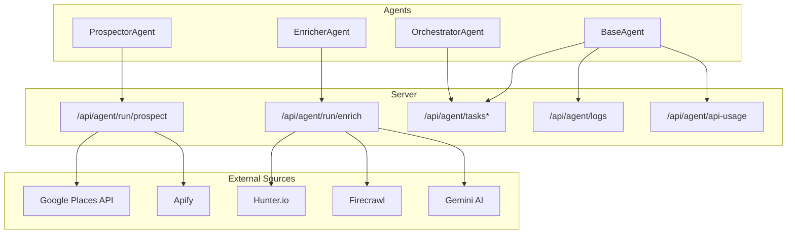
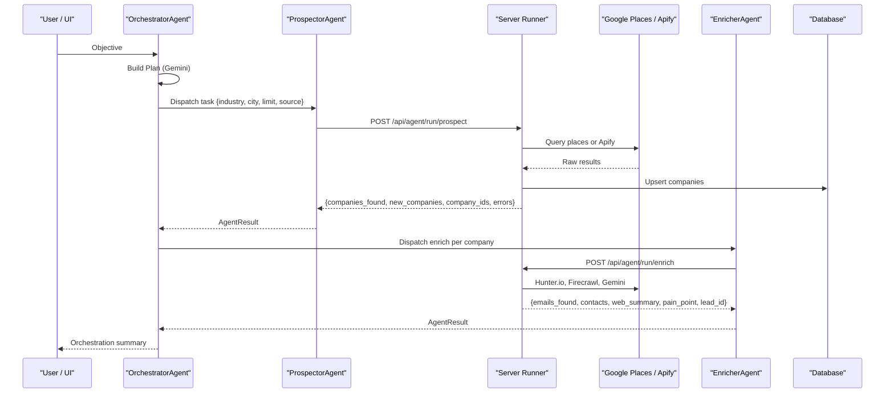
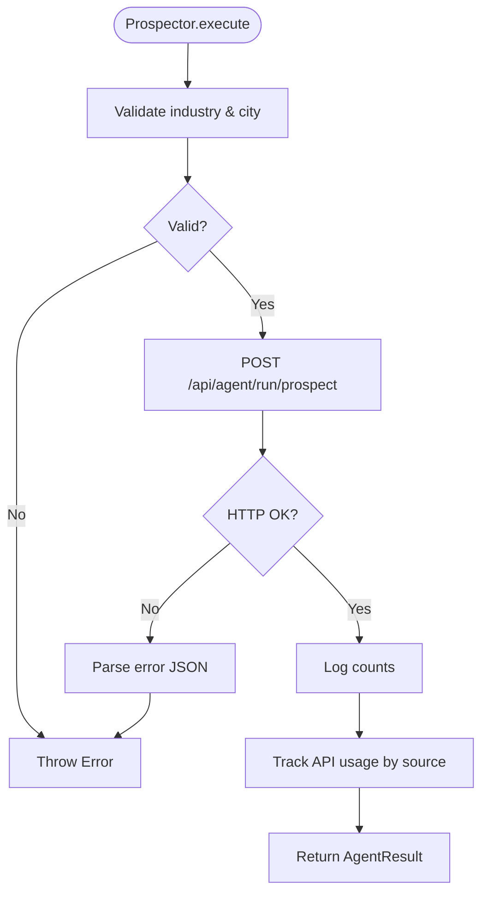
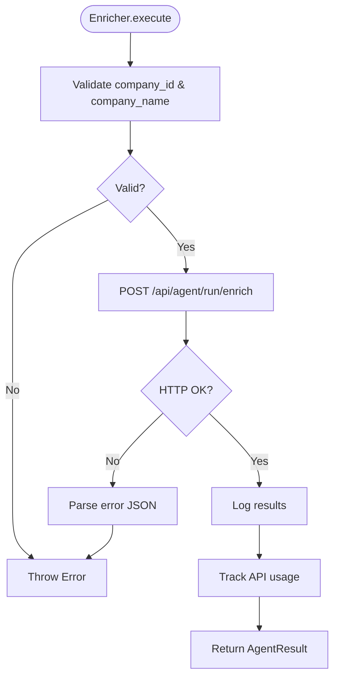
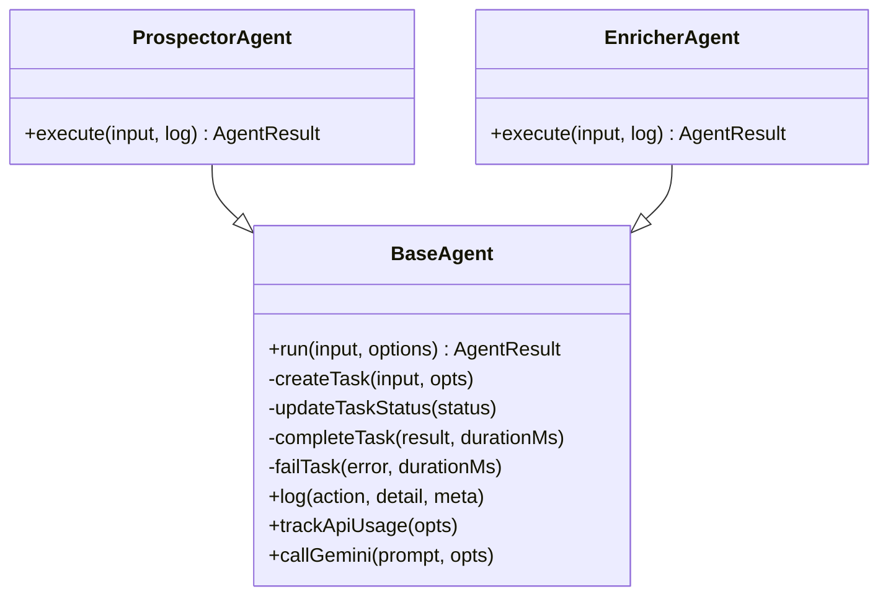
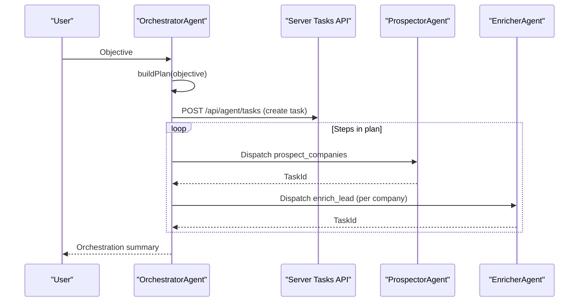
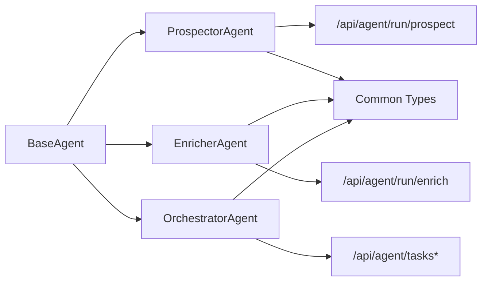
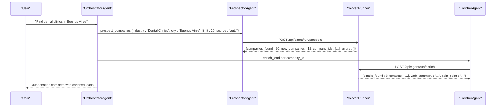

# Prospector Agent

<cite>
**Referenced Files in This Document**
- [prospector.ts](file://src/agents/prospector.ts)
- [enricher.ts](file://src/agents/enricher.ts)
- [orchestrator.ts](file://src/agents/orchestrator.ts)
- [base.ts](file://src/agents/base.ts)
- [types.ts](file://src/agents/types.ts)
- [index.ts](file://src/agents/index.ts)
- [server.ts](file://server.ts)
</cite>

## Table of Contents
1. [Introduction](#introduction)
2. [Project Structure](#project-structure)
3. [Core Components](#core-components)
4. [Architecture Overview](#architecture-overview)
5. [Detailed Component Analysis](#detailed-component-analysis)
6. [Dependency Analysis](#dependency-analysis)
7. [Performance Considerations](#performance-considerations)
8. [Troubleshooting Guide](#troubleshooting-guide)
9. [Conclusion](#conclusion)
10. [Appendices](#appendices)

## Introduction
This document explains the ProspectorAgent responsible for lead discovery and qualification within the Clientum AI Sales OS. It covers the ProspectInput and ProspectOutput data structures, the search workflow, integration with external data sources (Google Places and Apify), enrichment processes via the EnricherAgent, filtering criteria, lead scoring fields, and end-to-end orchestration from search to qualified lead generation. It also includes guidance on performance optimization, caching strategies, and error handling for failed lookups.

## Project Structure
The prospecting capability is implemented as a set of agents that extend a shared BaseAgent, which standardizes task lifecycle, logging, retries, and API usage tracking. The ProspectorAgent delegates actual data sourcing to server-side endpoints that hold API keys and implement search logic. The OrchestratorAgent builds execution plans and dispatches tasks across agents.

**Diagram sources**
- [base.ts](file://src/agents/base.ts)
- [prospector.ts](file://src/agents/prospector.ts)
- [enricher.ts](file://src/agents/enricher.ts)
- [orchestrator.ts](file://src/agents/orchestrator.ts)
- [server.ts](file://server.ts)

**Section sources**
- [base.ts](file://src/agents/base.ts)
- [prospector.ts](file://src/agents/prospector.ts)
- [enricher.ts](file://src/agents/enricher.ts)
- [orchestrator.ts](file://src/agents/orchestrator.ts)
- [types.ts](file://src/agents/types.ts)
- [index.ts](file://src/agents/index.ts)
- [server.ts](file://server.ts)

## Core Components
- ProspectorAgent: Accepts industry, city, optional country, limit, and source selection; validates inputs; calls the server-side runner; tracks API usage and returns standardized results.
- EnricherAgent: For each company found, enriches with contact emails, website text summary, and pain-point analysis; tracks usage and returns enriched lead data.
- BaseAgent: Provides run() lifecycle with retries, status updates, logging, cost tracking, and Gemini helper.
- OrchestratorAgent: Parses objectives into an execution plan and dispatches agent tasks respecting dependencies.
- Types: Defines Company, EnrichedLead, and other domain models used downstream.

Key responsibilities:
- Input validation and defaults
- Server-side delegation for secure API key access
- Standardized result envelope and cost accounting
- Logging and observability hooks

**Section sources**
- [prospector.ts](file://src/agents/prospector.ts)
- [enricher.ts](file://src/agents/enricher.ts)
- [base.ts](file://src/agents/base.ts)
- [orchestrator.ts](file://src/agents/orchestrator.ts)
- [types.ts](file://src/agents/types.ts)

## Architecture Overview
The prospecting workflow spans client-side agents and server-side runners:

**Diagram sources**
- [orchestrator.ts](file://src/agents/orchestrator.ts)
- [prospector.ts](file://src/agents/prospector.ts)
- [enricher.ts](file://src/agents/enricher.ts)
- [server.ts](file://server.ts)

## Detailed Component Analysis

### Data Structures
- ProspectInput: industry (required), city (required), country (optional), limit (optional), source (google_places | apify | auto).
- ProspectOutput: companies_found (number), new_companies (number), company_ids (string[]), errors (string[]).
- EnrichInput: company_id, company_name, website, domain, city, industry.
- EnrichOutput: company_id, emails_found, contacts (name, email, role, confidence), web_summary, pain_point, lead_id.
- Company: id, name, industry, city, country, address, phone, website, rating, source, status, created_at.
- EnrichedLead: id, company_id, name, email, phone, linkedin, whatsapp, role, source, icp_fit (0–100), meddic_score (0–30), created_at.

These types define the contract between agents and the server runner, and model entities persisted and consumed downstream.

**Section sources**
- [prospector.ts](file://src/agents/prospector.ts)
- [enricher.ts](file://src/agents/enricher.ts)
- [types.ts](file://src/agents/types.ts)

### ProspectorAgent Workflow
- Validates required fields (industry, city).
- Logs call to runner with parameters.
- Calls server endpoint /api/agent/run/prospect with payload.
- On success, logs counts and tracks API usage based on selected source.
- Returns standardized AgentResult with cost_usd proportional to companies_found.

**Diagram sources**
- [prospector.ts](file://src/agents/prospector.ts)

**Section sources**
- [prospector.ts](file://src/agents/prospector.ts)

### EnricherAgent Workflow
- Validates company_id and company_name.
- Calls server endpoint /api/agent/run/enrich with company context.
- Logs outcome and tracks usage.
- Returns enriched lead data including contacts and pain-point insights.

**Diagram sources**
- [enricher.ts](file://src/agents/enricher.ts)

**Section sources**
- [enricher.ts](file://src/agents/enricher.ts)

### BaseAgent Lifecycle and Observability
- run(): Creates task, sets status to running, executes agent logic, completes/fails task, applies retries with exponential backoff, records duration.
- Logging: Emits structured logs per action with optional tokens and cost metadata.
- API Usage Tracking: Records apiName, endpoint, and costUsd for billing/analytics.
- Gemini Helper: Centralized LLM call interface.

**Diagram sources**
- [base.ts](file://src/agents/base.ts)
- [prospector.ts](file://src/agents/prospector.ts)
- [enricher.ts](file://src/agents/enricher.ts)

**Section sources**
- [base.ts](file://src/agents/base.ts)

### Orchestrator Integration
- Builds an execution plan using Gemini, mapping user objectives to agent steps.
- Persists orchestration plan and dispatches tasks sequentially while honoring depends_on constraints.
- Aggregates results and reports completed/failed step counts.

**Diagram sources**
- [orchestrator.ts](file://src/agents/orchestrator.ts)

**Section sources**
- [orchestrator.ts](file://src/agents/orchestrator.ts)

### Search Algorithms and Filtering Criteria
- Source selection: google_places, apify, or auto.
- Inputs: industry, city, country, limit.
- Output metrics: companies_found, new_companies, company_ids, errors.
- Filtering criteria are applied server-side during lookup and upsert; clients rely on returned counts and IDs.

Example search queries (conceptual):
- Industry: "Dental Clinics", City: "Buenos Aires", Country: "Argentina", Limit: 20, Source: "auto"
- Industry: "Software Development", City: "Córdoba", Country: "Argentina", Limit: 15, Source: "google_places"
- Industry: "Marketing Agencies", City: "Rosario", Country: "Argentina", Limit: 10, Source: "apify"

Result interpretation:
- companies_found: total matches returned by the source.
- new_companies: count of newly inserted companies.
- company_ids: identifiers for further enrichment or CRM actions.
- errors: list of non-fatal issues encountered during processing.

Lead validation:
- Use Company.status transitions (new → enriched → analyzed → proposed → in_campaign → replied → closed/discard).
- EnrichedLead fields like icp_fit and meddic_score provide quantitative fit and MEDDIC assessment.

**Section sources**
- [prospector.ts](file://src/agents/prospector.ts)
- [types.ts](file://src/agents/types.ts)

### Lead Scoring Mechanisms
- ICP Fit Score: numeric field (0–100) indicating how well a lead matches the Ideal Customer Profile.
- MEDDIC Score: numeric field (0–30) summarizing key sales qualification dimensions.
- These scores are part of the EnrichedLead model and can be computed server-side during enrichment or updated later by scoring agents.

**Section sources**
- [types.ts](file://src/agents/types.ts)

### External Integrations
- Google Places API: High-precision geolocated business discovery.
- Apify: Automated scraping and fallback discovery.
- Hunter.io: Contact email discovery by domain.
- Firecrawl: Website content extraction for summaries.
- Gemini AI: Pain-point analysis and plan generation.

Configuration hints:
- API keys are managed server-side and referenced via environment variables.
- Settings UI exposes configuration entries for Apify, Google Maps Platform, and Hunter.io.

**Section sources**
- [server.ts](file://server.ts)
- [enricher.ts](file://src/agents/enricher.ts)
- [prospector.ts](file://src/agents/prospector.ts)

## Dependency Analysis
- ProspectorAgent depends on BaseAgent for lifecycle and on server endpoint /api/agent/run/prospect.
- EnricherAgent depends on BaseAgent and server endpoint /api/agent/run/enrich.
- OrchestratorAgent depends on BaseAgent and server endpoints for tasks and plans.
- All agents share common types and return AgentResult envelopes.

**Diagram sources**
- [base.ts](file://src/agents/base.ts)
- [prospector.ts](file://src/agents/prospector.ts)
- [enricher.ts](file://src/agents/enricher.ts)
- [orchestrator.ts](file://src/agents/orchestrator.ts)
- [types.ts](file://src/agents/types.ts)

**Section sources**
- [base.ts](file://src/agents/base.ts)
- [prospector.ts](file://src/agents/prospector.ts)
- [enricher.ts](file://src/agents/enricher.ts)
- [orchestrator.ts](file://src/agents/orchestrator.ts)
- [types.ts](file://src/agents/types.ts)

## Performance Considerations
- Batch operations: Prefer batching company upserts and enrichment requests where possible on the server side to reduce round-trips.
- Caching strategies:
  - Cache recent search results keyed by industry+city+country+limit to avoid redundant external calls.
  - Cache enrichment results by company_id/domain to prevent repeated Hunter/Firecrawl/Gemini calls.
  - Implement TTL-based cache invalidation tied to data freshness policies.
- Concurrency control:
  - Use database-level locking or advisory locks when upserting companies to avoid duplicates under high concurrency.
  - Apply rate limiting around external API calls to respect provider quotas.
- Pagination and limits:
  - Respect limit parameter and paginate through large result sets if needed.
- Monitoring:
  - Leverage BaseAgent logging and API usage tracking to monitor latency, costs, and failure rates.

[No sources needed since this section provides general guidance]

## Troubleshooting Guide
Common issues and resolutions:
- Missing required fields: Ensure industry and city are provided to ProspectorAgent; company_id and company_name to EnricherAgent.
- HTTP errors from runner: Inspect response body for error messages; verify API keys and network connectivity.
- Retry behavior: BaseAgent retries with exponential backoff; check max_retries and observe retry logs.
- Cost anomalies: Review trackApiUsage calls and ensure correct apiName and costUsd calculations.
- Database connectivity: When DATABASE_URL is missing, server uses mock pool; confirm production configuration.

Operational tips:
- Enable detailed logging via BaseAgent.log to trace execution steps.
- Monitor /api/agent/tasks* endpoints for task status and errors.
- Validate external service health (Google Places, Apify, Hunter.io, Firecrawl, Gemini).

**Section sources**
- [base.ts](file://src/agents/base.ts)
- [prospector.ts](file://src/agents/prospector.ts)
- [enricher.ts](file://src/agents/enricher.ts)
- [server.ts](file://server.ts)

## Conclusion
The ProspectorAgent integrates tightly with the broader agent ecosystem to deliver robust lead discovery and qualification. By delegating sensitive integrations to server-side runners, enforcing standardized lifecycles through BaseAgent, and leveraging structured types, the system ensures reliability, observability, and scalability. With proper caching, concurrency controls, and monitoring, it can handle large datasets efficiently while maintaining accurate cost accounting and error resilience.

[No sources needed since this section summarizes without analyzing specific files]

## Appendices

### Example End-to-End Flow
- Orchestrator receives objective and generates a plan including prospecting and enrichment steps.
- Prospector searches companies via Google Places or Apify, persists results, and returns IDs.
- Enricher enriches each company with contact info, website insights, and pain-point analysis.
- Downstream systems consume Company and EnrichedLead records for campaigns and proposals.

**Diagram sources**
- [orchestrator.ts](file://src/agents/orchestrator.ts)
- [prospector.ts](file://src/agents/prospector.ts)
- [enricher.ts](file://src/agents/enricher.ts)
- [server.ts](file://server.ts)