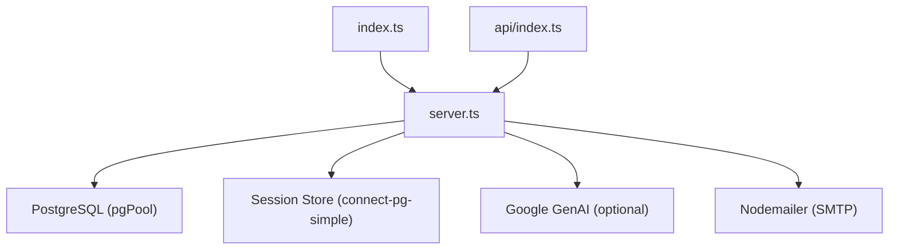
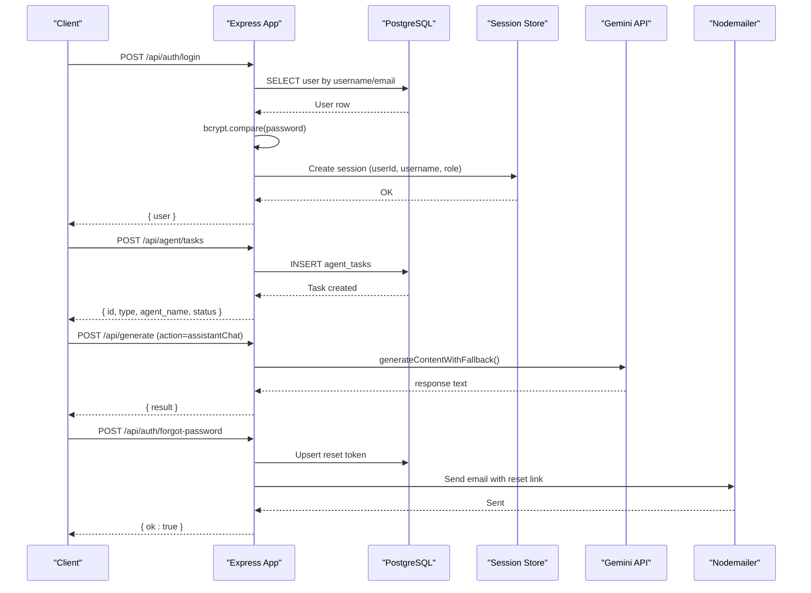
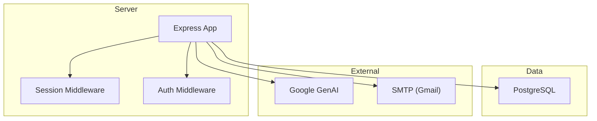

# API Reference

<cite>
**Referenced Files in This Document**
- [server.ts](file://server.ts)
- [index.ts](file://index.ts)
- [api/index.ts](file://api/index.ts)
- [src/agents/orchestrator.ts](file://src/agents/orchestrator.ts)
- [src/components/crm-full/AgentOSDashboard.tsx](file://src/components/crm-full/AgentOSDashboard.tsx)
</cite>

## Table of Contents
1. Introduction
2. Project Structure
3. Core Components
4. Architecture Overview
5. Detailed Component Analysis
6. Dependency Analysis
7. Performance Considerations
8. Troubleshooting Guide
9. Conclusion

## Introduction
This document provides a comprehensive API reference for the Express.js server that powers the application. It covers authentication endpoints, agent orchestration endpoints, data management endpoints, and content generation endpoints exposed by the server. For each endpoint, it specifies HTTP methods, URL patterns, request/response schemas, authentication requirements, error codes, and practical client examples using curl and JavaScript fetch. Rate limiting is not implemented in the current codebase; see the Performance Considerations section for guidance.

## Project Structure
The server is implemented as an Express application with routes defined at module level. The entry points are:
- index.ts: Initializes database tables and exports the Express app for serverless environments.
- api/index.ts: Exposes a handler that delegates to the Express app.
- server.ts: Defines all middleware, session configuration, and API routes.

**Diagram sources**
- [index.ts:1-20](file://index.ts#L1-L20)
- [api/index.ts:1-5](file://api/index.ts#L1-L5)
- [server.ts:1-125](file://server.ts#L1-L125)

**Section sources**
- [index.ts:1-20](file://index.ts#L1-L20)
- [api/index.ts:1-5](file://api/index.ts#L1-L5)
- [server.ts:1-125](file://server.ts#L1-L125)

## Core Components
- Authentication and Session Management:
  - POST /api/auth/register
  - POST /api/auth/login
  - POST /api/auth/logout
  - GET /api/auth/me
  - POST /api/auth/neon-register
  - POST /api/auth/neon-login
  - POST /api/auth/forgot-password
  - POST /api/auth/reset-password
- Agent Orchestration:
  - POST /api/agent/tasks
  - GET /api/agent/tasks
  - GET /api/agent/tasks/:id
  - PATCH /api/agent/tasks/:id/status
  - PATCH /api/agent/tasks/:id/complete
  - PATCH /api/agent/tasks/:id/fail
  - GET /api/orchestrator/status
  - GET /api/pipeline/funnel
- Data Management:
  - POST /api/chatbot-leads
  - GET /api/chatbot-leads
  - PATCH /api/chatbot-leads/:id
  - POST /api/webhooks/chatbot-lead
  - POST /api/enrich-contact
  - POST /api/scrape-places
  - POST /api/places/search
  - GET /api/places/history
  - POST /api/places/:id/score
  - POST /api/places/bulk-import
- Content Generation and AI Proxy:
  - POST /api/generate (action-based routing for multiple actions)
- LMS (Learning Management System):
  - POST /api/lms/enroll
  - GET /api/lms/my
  - PUT /api/lms/progress
  - POST /api/lms/complete
  - GET /api/lms/certificate/:id

Authentication requirements:
- Session-based auth via express-session with cookie "connect.sid".
- Admin-only endpoints require role "admin" checked against the users table on each request.
- Server-to-server endpoints use headers:
  - X-API-Key for Santi SDR integration
  - X-CRM-Token for CRM webhooks

Error handling strategy:
- Validation errors return 400 with { error: string }.
- Unauthorized returns 401 with { error: string }.
- Forbidden returns 403 with { error: string }.
- Not found returns 404 with { error: string } where applicable.
- Internal errors return 500 with { error: string }.

Rate limiting:
- No built-in rate limiting is present in the codebase. Implement at the reverse proxy or via middleware if needed.

**Section sources**
- [server.ts:266-392](file://server.ts#L266-L392)
- [server.ts:394-748](file://server.ts#L394-L748)
- [server.ts:750-830](file://server.ts#L750-L830)
- [server.ts:832-851](file://server.ts#L832-L851)
- [server.ts:1964-2000](file://server.ts#L1964-L2000)
- [server.ts:2008-2150](file://server.ts#L2008-L2150)
- [server.ts:2153-2177](file://server.ts#L2153-L2177)
- [server.ts:2180-2218](file://server.ts#L2180-L2218)
- [server.ts:2221-2245](file://server.ts#L2221-L2245)
- [server.ts:2262-3241](file://server.ts#L2262-L3241)
- [server.ts:3316-3423](file://server.ts#L3316-L3423)
- [server.ts:3490-3581](file://server.ts#L3490-L3581)
- [server.ts:3890-3996](file://server.ts#L3890-L3996)

## Architecture Overview
The server uses Express with session middleware backed by PostgreSQL. Authentication flows support both local bcrypt-based accounts and Neon Auth integration. Agent orchestration endpoints manage task lifecycle and logging. Data endpoints provide CRUD operations for chatbot leads and places search results. Content generation endpoints route to Gemini-based processing with fallbacks.

**Diagram sources**
- [server.ts:340-392](file://server.ts#L340-L392)
- [server.ts:3890-3906](file://server.ts#L3890-L3906)
- [server.ts:2467-2487](file://server.ts#L2467-L2487)
- [server.ts:750-830](file://server.ts#L750-L830)

## Detailed Component Analysis

### Authentication Endpoints
- POST /api/auth/register
  - Method: POST
  - URL: /api/auth/register
  - Auth: None
  - Request body: { username: string, password: string }
  - Response: 201 { user: { id: number, username: string, role: string } }
  - Errors: 400 validation, 409 conflict, 500 internal
  - Notes: First user becomes admin; subsequent users get role "user". Supports email-like usernames.

- POST /api/auth/login
  - Method: POST
  - URL: /api/auth/login
  - Auth: None
  - Request body: { username: string, password: string }
  - Response: 200 { user: { id: number, username: string, role: string } }
  - Errors: 400 validation, 401 invalid credentials, 500 internal

- POST /api/auth/logout
  - Method: POST
  - URL: /api/auth/logout
  - Auth: Required (session)
  - Request body: none
  - Response: 200 { ok: boolean }
  - Errors: 500 internal

- GET /api/auth/me
  - Method: GET
  - URL: /api/auth/me
  - Auth: Required (session)
  - Response: 200 { user: { id: number, username: string, role: string } }
  - Errors: 401 unauthorized, 500 internal

- POST /api/auth/neon-register
  - Method: POST
  - URL: /api/auth/neon-register
  - Auth: None
  - Request body: { email: string, password: string, name?: string }
  - Response: 201 or 200 depending on flow
  - Errors: 400 validation, 409 conflict, 403 email not verified (Neon), 500 internal

- POST /api/auth/neon-login
  - Method: POST
  - URL: /api/auth/neon-login
  - Auth: None
  - Request body: { email: string, password: string }
  - Response: 200 { user: { id: number, username: string, role: string } }
  - Errors: 400 validation, 401 invalid credentials, 403 email not verified (Neon), 500 internal

- POST /api/auth/forgot-password
  - Method: POST
  - URL: /api/auth/forgot-password
  - Auth: None
  - Request body: { email: string }
  - Response: 200 { ok: boolean, message: string }
  - Errors: 400 validation, 500 internal

- POST /api/auth/reset-password
  - Method: POST
  - URL: /api/auth/reset-password
  - Auth: None
  - Request body: { token: string, newPassword: string }
  - Response: 200 { ok: boolean, message: string }
  - Errors: 400 validation, 500 internal

Practical examples:
- curl login:
  - curl -X POST http://localhost:3000/api/auth/login -H "Content-Type: application/json" -d '{"username":"user@example.com","password":"yourpassword"}'
- fetch login:
  - fetch("/api/auth/login", { method: "POST", headers: { "Content-Type": "application/json" }, body: JSON.stringify({ username: "user@example.com", password: "yourpassword" }) }).then(r => r.json())

**Section sources**
- [server.ts:266-338](file://server.ts#L266-L338)
- [server.ts:340-392](file://server.ts#L340-L392)
- [server.ts:383-392](file://server.ts#L383-L392)
- [server.ts:832-851](file://server.ts#L832-L851)
- [server.ts:594-680](file://server.ts#L594-L680)
- [server.ts:683-748](file://server.ts#L683-L748)
- [server.ts:750-830](file://server.ts#L750-L830)

### Agent Orchestration Endpoints
- POST /api/agent/tasks
  - Method: POST
  - URL: /api/agent/tasks
  - Auth: None
  - Request body: { id?: string, type: string, agent_name: string, input?: Record<string, unknown>, parent_task_id?: string, max_retries?: number }
  - Response: 200 { id, type, agent_name, status, created_at }
  - Errors: 400 validation, 500 internal

- GET /api/agent/tasks
  - Method: GET
  - URL: /api/agent/tasks?status=&agent=&limit=&offset=
  - Auth: None
  - Response: 200 { tasks: Array, total: number }
  - Errors: 500 internal

- GET /api/agent/tasks/:id
  - Method: GET
  - URL: /api/agent/tasks/:id
  - Auth: None
  - Response: 200 { task: Object, logs: Array }
  - Errors: 404 not found, 500 internal

- PATCH /api/agent/tasks/:id/status
  - Method: PATCH
  - URL: /api/agent/tasks/:id/status
  - Auth: None
  - Request body: { status: string }
  - Response: 200 { ok: boolean }
  - Errors: 500 internal

- PATCH /api/agent/tasks/:id/complete
  - Method: PATCH
  - URL: /api/agent/tasks/:id/complete
  - Auth: None
  - Request body: { output?: Record<string, unknown>, tokens_used?: number, cost_usd?: number, duration_ms?: number }
  - Response: 200 { ok: boolean }
  - Errors: 500 internal

- PATCH /api/agent/tasks/:id/fail
  - Method: PATCH
  - URL: /api/agent/tasks/:id/fail
  - Auth: None
  - Request body: { error?: string, duration_ms?: number }
  - Response: 200 { ok: boolean }
  - Errors: 500 internal

- GET /api/orchestrator/status
  - Method: GET
  - URL: /api/orchestrator/status
  - Auth: None
  - Response: 200 { active_tasks, pending_tasks, failed_tasks_24h, completed_tasks_24h, total_cost_usd_24h, total_tokens_24h, agents_running, last_orchestration }
  - Errors: 500 internal

- GET /api/pipeline/funnel
  - Method: GET
  - URL: /api/pipeline/funnel
  - Auth: None
  - Response: 200 { companies, leads_enriched, proposals_sent, campaigns_active, emails_sent, emails_opened, replies, meetings }
  - Errors: 500 internal

Practical examples:
- curl create task:
  - curl -X POST http://localhost:3000/api/agent/tasks -H "Content-Type: application/json" -d '{"type":"prospector","agent_name":"prospector","input":{"city":"General Roca","industry":"Comercio"}}'
- fetch list tasks:
  - fetch("/api/agent/tasks?limit=15").then(r => r.json()).then(data => console.log(data.tasks))

**Section sources**
- [server.ts:3890-3906](file://server.ts#L3890-L3906)
- [server.ts:3909-3931](file://server.ts#L3909-L3931)
- [server.ts:3934-3947](file://server.ts#L3934-L3947)
- [server.ts:3950-3964](file://server.ts#L3950-L3964)
- [server.ts:3967-3980](file://server.ts#L3967-L3980)
- [server.ts:3983-3996](file://server.ts#L3983-L3996)
- [src/components/crm-full/AgentOSDashboard.tsx:155-174](file://src/components/crm-full/AgentOSDashboard.tsx#L155-L174)

### Data Management Endpoints
- POST /api/chatbot-leads
  - Method: POST
  - URL: /api/chatbot-leads
  - Auth: Required (session)
  - Request body: { name: string, phone?: string, email?: string, company?: string, notes?: string, conversation?: string }
  - Response: 201 { ok: boolean, lead: Object }
  - Errors: 400 validation, 500 internal

- GET /api/chatbot-leads
  - Method: GET
  - URL: /api/chatbot-leads
  - Auth: Required (session)
  - Response: 200 { leads: Array }
  - Errors: 500 internal

- PATCH /api/chatbot-leads/:id
  - Method: PATCH
  - URL: /api/chatbot-leads/:id
  - Auth: Required (session)
  - Request body: { status: "nuevo" | "contactado" | "calificado" | "descartado" }
  - Response: 200 { ok: boolean, id: string, status: string }
  - Errors: 400 validation, 404 not found, 500 internal

- POST /api/webhooks/chatbot-lead
  - Method: POST
  - URL: /api/webhooks/chatbot-lead
  - Auth: Requires header X-CRM-Token matching CRM_INTERNAL_TOKEN
  - Request body: { email: string, first_name?: string, last_name?: string, phone?: string, company?: string, source?: string, tags?: string[], metadata?: object }
  - Response: 201 { ok: boolean, lead: Object }
  - Errors: 400 validation, 401 unauthorized, 503 misconfigured webhook, 500 internal

- POST /api/enrich-contact
  - Method: POST
  - URL: /api/enrich-contact
  - Auth: Required (session)
  - Request body: { domain: string }
  - Response: 200 { contacts: Array, organization?: string, source: string }
  - Errors: 400 validation, 500 internal

- POST /api/scrape-places
  - Method: POST
  - URL: /api/scrape-places
  - Auth: Required (session)
  - Request body: { city: string, industry: string }
  - Response: 200 { prospects: Array, isRealScraped: boolean }
  - Errors: 400 validation, 500 internal

- POST /api/places/search
  - Method: POST
  - URL: /api/places/search
  - Auth: None
  - Request body: { rubro: string, ciudad: string, radio?: number, googlePlacesKey?: string }
  - Response: 200 { results: Array, simulated: boolean }
  - Errors: 400 validation, 500 internal

- GET /api/places/history
  - Method: GET
  - URL: /api/places/history
  - Auth: None
  - Response: 200 { history: Array }
  - Errors: 500 internal

- POST /api/places/:id/score
  - Method: POST
  - URL: /api/places/:id/score
  - Auth: None
  - Request body: place object (name, category, rating, phone, website, address)
  - Response: 200 { score: number, reason: string, action: string }
  - Errors: 500 internal

- POST /api/places/bulk-import
  - Method: POST
  - URL: /api/places/bulk-import
  - Auth: None
  - Request body: { places: Array }
  - Response: 200 { imported: number, total: number }
  - Errors: 400 validation, 500 internal

Practical examples:
- curl create lead:
  - curl -X POST http://localhost:3000/api/chatbot-leads -H "Content-Type: application/json" -H "Cookie: connect.sid=..." -d '{"name":"John Doe","email":"john@example.com"}'
- fetch enrich contact:
  - fetch("/api/enrich-contact", { method: "POST", headers: { "Content-Type": "application/json" }, body: JSON.stringify({ domain: "example.com" }) }).then(r => r.json())

**Section sources**
- [server.ts:3490-3507](file://server.ts#L3490-L3507)
- [server.ts:3511-3523](file://server.ts#L3511-L3523)
- [server.ts:3565-3581](file://server.ts#L3565-L3581)
- [server.ts:3534-3561](file://server.ts#L3534-L3561)
- [server.ts:1964-1986](file://server.ts#L1964-L1986)
- [server.ts:1988-2000](file://server.ts#L1988-L2000)
- [server.ts:2008-2150](file://server.ts#L2008-L2150)
- [server.ts:2153-2177](file://server.ts#L2153-L2177)
- [server.ts:2180-2218](file://server.ts#L2180-L2218)
- [server.ts:2221-2245](file://server.ts#L2221-L2245)

### Content Generation and AI Proxy Endpoints
- POST /api/generate
  - Method: POST
  - URL: /api/generate
  - Auth: Depends on action:
    - Public actions: chatbotAnswer, assistantChat
    - Admin-only actions: generateIndustryCopy, optimizeCopy, generateImage, translateBrochure
    - Other actions require authenticated session
  - Request body: { action: string, payload: object }
  - Responses vary by action; typical structure: { result: any, isFallback?: boolean }
  - Actions include:
    - validateGooglePlacesKey
    - generateIndustryCopy
    - assistantChat
    - chatbotAnswer
    - optimizeCopy
    - translateBrochure
    - prospectLeads
    - buildICP
    - researchProspect
    - generateOutreach
    - salesAdvisorAnswer
    - generateImage
    - generateSEOAudit
    - generateSEOKeywords
    - generateSocialPost
    - repurposeContent
  - Errors: 400 invalid action or missing fields, 401/403 authorization, 500 internal

Practical examples:
- curl assistantChat:
  - curl -X POST http://localhost:3000/api/generate -H "Content-Type: application/json" -d '{"action":"assistantChat","payload":{"message":"How do I set up WhatsApp automation?"}}'
- fetch generate image:
  - fetch("/api/generate", { method: "POST", headers: { "Content-Type": "application/json" }, body: JSON.stringify({ action: "generateImage", payload: { industry: "gastronomia", pageNumber: 1 } }) }).then(r => r.json())

**Section sources**
- [server.ts:2262-3241](file://server.ts#L2262-L3241)

### LMS Endpoints
- POST /api/lms/enroll
  - Method: POST
  - URL: /api/lms/enroll
  - Auth: Required (session)
  - Request body: { course_slug: string, course_name: string }
  - Response: 200 { ok: boolean }
  - Errors: 400 validation, 500 internal

- GET /api/lms/my
  - Method: GET
  - URL: /api/lms/my
  - Auth: Required (session)
  - Response: 200 { ok: boolean, enrollments: Array }
  - Errors: 500 internal

- PUT /api/lms/progress
  - Method: PUT
  - URL: /api/lms/progress
  - Auth: Required (session)
  - Request body: { course_slug: string, progress_pct: number }
  - Response: 200 { ok: boolean, progress_pct: number }
  - Errors: 400 validation, 500 internal

- POST /api/lms/complete
  - Method: POST
  - URL: /api/lms/complete
  - Auth: Required (session)
  - Request body: { course_slug: string }
  - Response: 200 { ok: boolean, certificate_id: string, issued_at: string }
  - Errors: 400 validation, 500 internal

- GET /api/lms/certificate/:id
  - Method: GET
  - URL: /api/lms/certificate/:id
  - Auth: None
  - Response: 200 { ok: boolean, certificate: Object }
  - Errors: 404 not found, 500 internal

Practical examples:
- curl enroll:
  - curl -X POST http://localhost:3000/api/lms/enroll -H "Content-Type: application/json" -H "Cookie: connect.sid=..." -d '{"course_slug":"crm-basics","course_name":"CRM Basics"}'
- fetch my enrollments:
  - fetch("/api/lms/my", { headers: { "Cookie": "connect.sid=..." } }).then(r => r.json())

**Section sources**
- [server.ts:3316-3423](file://server.ts#L3316-L3423)

## Dependency Analysis
The server depends on:
- Express for routing and middleware
- express-session and connect-pg-simple for session persistence
- pg (node-postgres) for database interactions
- bcryptjs for password hashing
- nodemailer for email sending
- @google/genai for AI content generation

**Diagram sources**
- [server.ts:1-125](file://server.ts#L1-L125)
- [server.ts:854-878](file://server.ts#L854-L878)
- [server.ts:133-207](file://server.ts#L133-L207)

**Section sources**
- [server.ts:1-125](file://server.ts#L1-L125)
- [server.ts:854-878](file://server.ts#L854-L878)
- [server.ts:133-207](file://server.ts#L133-L207)

## Performance Considerations
- No rate limiting is implemented. Consider adding middleware like express-rate-limit or implementing limits at the reverse proxy layer.
- Database queries are direct SQL; ensure proper indexing and connection pooling are configured.
- AI calls have fallback mechanisms to avoid failures when quotas are exceeded or services are unavailable.
- Session storage uses PostgreSQL; ensure adequate connection pool size and session cleanup policies.

[No sources needed since this section provides general guidance]

## Troubleshooting Guide
Common issues and resolutions:
- Authentication failures:
  - Ensure SESSION_SECRET is configured and cookies are sent correctly.
  - Verify user credentials and password hashing.
- Database errors:
  - Check DATABASE_URL and SSL settings for production.
  - Ensure tables are initialized (users, agent_tasks, etc.).
- Email delivery:
  - Configure SMTP_USER and SMTP_PASS for password reset emails.
- AI service errors:
  - Validate GEMINI_API_KEY and handle fallback responses gracefully.

**Section sources**
- [server.ts:107-125](file://server.ts#L107-L125)
- [server.ts:24-77](file://server.ts#L24-L77)
- [server.ts:133-207](file://server.ts#L133-L207)
- [server.ts:854-878](file://server.ts#L854-L878)

## Conclusion
This API reference documents the core endpoints for authentication, agent orchestration, data management, and content generation. The server provides robust session-based authentication, flexible agent task management, and comprehensive data operations. While no rate limiting is currently implemented, the architecture supports easy integration of such features. Clients should handle errors appropriately and implement retries for transient failures.

[No sources needed since this section summarizes without analyzing specific files]