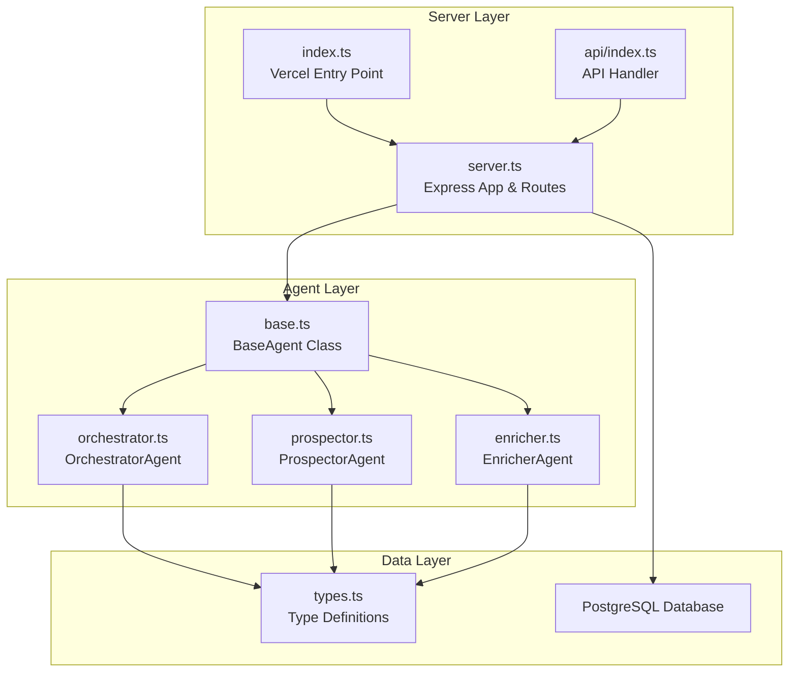
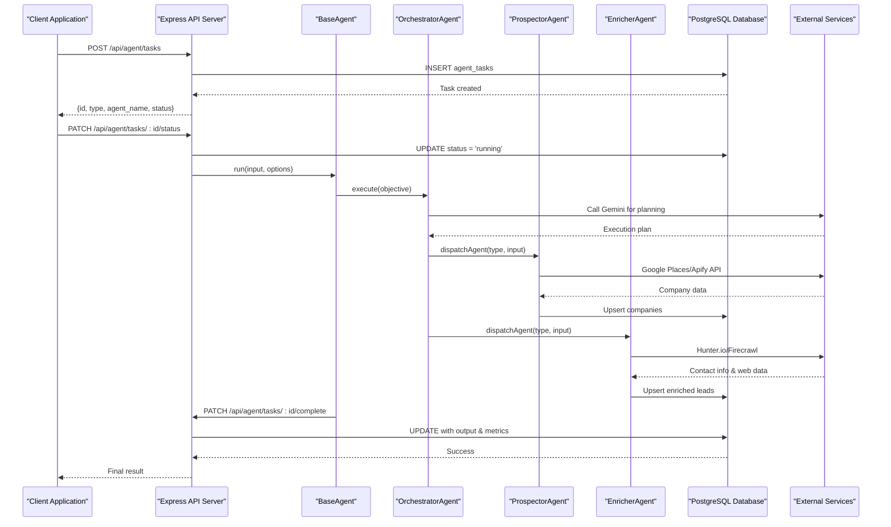
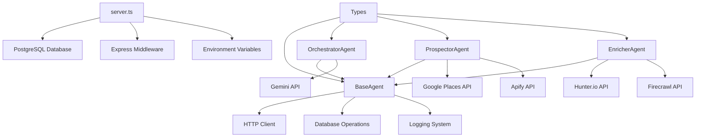

# Agent Orchestration API

<cite>
**Referenced Files in This Document**
- [server.ts](file://server.ts)
- [index.ts](file://index.ts)
- [api/index.ts](file://api/index.ts)
- [src/agents/base.ts](file://src/agents/base.ts)
- [src/agents/orchestrator.ts](file://src/agents/orchestrator.ts)
- [src/agents/prospector.ts](file://src/agents/prospector.ts)
- [src/agents/enricher.ts](file://src/agents/enricher.ts)
- [src/agents/types.ts](file://src/agents/types.ts)
</cite>

## Table of Contents
1. [Introduction](#introduction)
2. [Project Structure](#project-structure)
3. [Core Components](#core-components)
4. [Architecture Overview](#architecture-overview)
5. [Detailed Component Analysis](#detailed-component-analysis)
6. [Dependency Analysis](#dependency-analysis)
7. [Performance Considerations](#performance-considerations)
8. [Troubleshooting Guide](#troubleshooting-guide)
9. [Conclusion](#conclusion)
10. [Appendices](#appendices)

## Introduction
This document provides comprehensive API documentation for the agent orchestration system that manages AI agent workflows. It covers:
- Task creation endpoints to initiate prospector, enricher, and orchestrator agents
- Status monitoring endpoints to track execution progress
- Result retrieval endpoints to access processed data
- Authentication using x-api-key header for server-to-server communication
- Rate limiting considerations, error handling strategies, and practical examples demonstrating the full lifecycle from task creation to completion

The system is implemented with Express on a Node.js server and integrates with PostgreSQL for persistence, Gemini for AI capabilities, and external services (Google Places, Apify, Hunter.io, Firecrawl).

## Project Structure
The project follows a modular architecture with clear separation between:
- Server entry points and middleware configuration
- Agent implementations with base classes and specialized agents
- API endpoints for task management, status tracking, and results
- Type definitions for consistent data structures



**Diagram sources**
- [server.ts:1-100](file://server.ts#L1-L100)
- [index.ts:1-20](file://index.ts#L1-L20)
- [api/index.ts:1-5](file://api/index.ts#L1-L5)
- [src/agents/base.ts:1-50](file://src/agents/base.ts#L1-L50)
- [src/agents/orchestrator.ts:1-50](file://src/agents/orchestrator.ts#L1-L50)
- [src/agents/prospector.ts:1-30](file://src/agents/prospector.ts#L1-L30)
- [src/agents/enricher.ts:1-30](file://src/agents/enricher.ts#L1-L30)
- [src/agents/types.ts:1-50](file://src/agents/types.ts#L1-L50)

**Section sources**
- [server.ts:1-100](file://server.ts#L1-L100)
- [index.ts:1-20](file://index.ts#L1-L20)
- [api/index.ts:1-5](file://api/index.ts#L1-L5)

## Core Components
The agent orchestration system consists of several key components:

### BaseAgent Foundation
The BaseAgent class provides common functionality for all agents including:
- Task lifecycle management (create, update, complete, fail)
- Logging and cost tracking
- Retry mechanisms with exponential backoff
- Integration with external APIs (Gemini, database operations)

### Specialized Agents
- **OrchestratorAgent**: Parses natural language objectives and creates execution plans
- **ProspectorAgent**: Discovers companies using Google Places or Apify
- **EnricherAgent**: Enriches company data with contact information and web analysis

### Data Types and Models
Comprehensive type definitions ensure consistent data structures across the system, including task states, agent types, and business entities like companies, leads, and campaigns.

**Section sources**
- [src/agents/base.ts:18-199](file://src/agents/base.ts#L18-L199)
- [src/agents/orchestrator.ts:10-181](file://src/agents/orchestrator.ts#L10-L181)
- [src/agents/prospector.ts:26-71](file://src/agents/prospector.ts#L26-L71)
- [src/agents/enricher.ts:32-75](file://src/agents/enricher.ts#L32-L75)
- [src/agents/types.ts:5-181](file://src/agents/types.ts#L5-L181)

## Architecture Overview
The system follows a layered architecture pattern with clear separation of concerns:



**Diagram sources**
- [server.ts:3890-3906](file://server.ts#L3890-L3906)
- [server.ts:3950-3964](file://server.ts#L3950-L3964)
- [server.ts:3967-3980](file://server.ts#L3967-L3980)
- [src/agents/base.ts:31-73](file://src/agents/base.ts#L31-L73)
- [src/agents/orchestrator.ts:14-76](file://src/agents/orchestrator.ts#L14-L76)
- [src/agents/prospector.ts:30-67](file://src/agents/prospector.ts#L30-L67)
- [src/agents/enricher.ts:36-71](file://src/agents/enricher.ts#L36-L71)

## Detailed Component Analysis

### Task Management Endpoints

#### Create Task - POST /api/agent/tasks
Creates a new agent task with validation and database persistence.

**Authentication**: No authentication required for internal agent calls
**Rate Limiting**: Not explicitly configured at endpoint level
**Request Schema**:
```json
{
  "id": "optional-uuid",
  "type": "prospect_companies|enrich_lead|orchestrate",
  "agent_name": "prospector|enricher|orchestrator",
  "input": {},
  "parent_task_id": "optional-parent-task-id",
  "max_retries": 2
}
```

**Response Schema**:
```json
{
  "id": "task-uuid",
  "type": "task-type",
  "agent_name": "agent-name",
  "status": "pending",
  "created_at": "timestamp"
}
```

#### List Tasks - GET /api/agent/tasks
Retrieves tasks with optional filtering and pagination.

**Query Parameters**:
- `status`: Filter by task status
- `agent`: Filter by agent name
- `limit`: Maximum number of results (default: 50, max: 200)
- `offset`: Number of records to skip (default: 0)

**Response Schema**:
```json
{
  "tasks": [/* array of task objects */],
  "total": 123
}
```

#### Get Task Details - GET /api/agent/tasks/:id
Retrieves a specific task with its associated logs.

**Response Schema**:
```json
{
  "task": { /* task object */ },
  "logs": [/* array of log entries */]
}
```

#### Update Task Status - PATCH /api/agent/tasks/:id/status
Updates task status during execution lifecycle.

**Request Schema**:
```json
{
  "status": "pending|running|completed|failed|retrying|cancelled"
}
```

#### Complete Task - PATCH /api/agent/tasks/:id/complete
Marks task as completed with output data and metrics.

**Request Schema**:
```json
{
  "output": {},
  "tokens_used": 0,
  "cost_usd": 0.001,
  "duration_ms": 1234
}
```

#### Fail Task - PATCH /api/agent/tasks/:id/fail
Marks task as failed with error information.

**Request Schema**:
```json
{
  "error": "error message",
  "duration_ms": 1234
}
```

**Section sources**
- [server.ts:3890-3906](file://server.ts#L3890-L3906)
- [server.ts:3909-3931](file://server.ts#L3909-L3931)
- [server.ts:3934-3947](file://server.ts#L3934-L3947)
- [server.ts:3950-3964](file://server.ts#L3950-L3964)
- [server.ts:3967-3980](file://server.ts#L3967-L3980)
- [server.ts:3983-3996](file://server.ts#L3983-L3996)

### Agent Runner Endpoints

#### Prospect Companies - POST /api/agent/run/prospect
Executes company prospecting using Google Places or Apify.

**Authentication**: Internal server-to-server call
**Request Schema**:
```json
{
  "industry": "technology",
  "city": "Buenos Aires",
  "country": "Argentina",
  "limit": 20,
  "source": "google_places|apify|auto"
}
```

**Response Schema**:
```json
{
  "companies_found": 15,
  "new_companies": 8,
  "company_ids": ["uuid1", "uuid2"],
  "source": "google_places",
  "errors": []
}
```

#### Enrich Lead - POST /api/agent/run/enrich
Enriches company data with contact information and web analysis.

**Request Schema**:
```json
{
  "company_id": "company-uuid",
  "company_name": "Company Name",
  "website": "https://example.com",
  "domain": "example.com",
  "city": "Buenos Aires",
  "industry": "technology"
}
```

**Response Schema**:
```json
{
  "company_id": "company-uuid",
  "emails_found": 3,
  "contacts": [
    {
      "name": "John Doe",
      "email": "john@example.com",
      "role": "CTO",
      "confidence": 0.85
    }
  ],
  "web_summary": "Summary of website content...",
  "pain_point": "Identified pain point description...",
  "lead_id": "lead-uuid"
}
```

**Section sources**
- [server.ts:4305-4392](file://server.ts#L4305-L4392)
- [server.ts:4396-4504](file://server.ts#L4396-L4504)

### Monitoring and Metrics Endpoints

#### System Status - GET /api/orchestrator/status
Provides real-time system snapshot with active tasks, costs, and recent activity.

**Response Schema**:
```json
{
  "active_tasks": 5,
  "pending_tasks": 12,
  "failed_tasks_24h": 2,
  "completed_tasks_24h": 45,
  "agents_running": ["prospector", "enricher"],
  "total_cost_usd_24h": 0.15,
  "total_tokens_24h": 15000,
  "api_usage": [
    {
      "api_name": "gemini",
      "calls": 10,
      "cost_usd": 0.05
    }
  ],
  "recent_logs": [/* recent log entries */]
}
```

#### Historical Metrics - GET /api/orchestrator/metrics
Retrieves historical performance metrics with configurable time periods.

**Query Parameters**:
- `period`: Time period (default: "7d", options: "24h", "7d", "30d")

**Response Schema**:
```json
{
  "task_metrics": [
    {
      "day": "2024-01-15",
      "completed": 25,
      "failed": 2,
      "agent_name": "prospector",
      "avg_duration_ms": 1500
    }
  ],
  "cost_metrics": [
    {
      "day": "2024-01-15",
      "api_name": "gemini",
      "cost_usd": 0.15,
      "total_tokens": 15000
    }
  ],
  "period": "7d"
}
```

#### Pipeline Funnel - GET /api/pipeline/funnel
Shows conversion funnel metrics across the entire sales pipeline.

**Response Schema**:
```json
{
  "companies": 150,
  "leads_enriched": 85,
  "proposals_sent": 45,
  "campaigns_active": 3,
  "emails_sent": 120,
  "replies": 15
}
```

**Section sources**
- [server.ts:4171-4184](file://server.ts#L4171-L4184)
- [server.ts:4187-4234](file://server.ts#L4187-L4234)
- [server.ts:4237-4270](file://server.ts#L4237-L4270)
- [server.ts:4275-4297](file://server.ts#L4275-L4297)

### Logging and Usage Tracking

#### Log Entry - POST /api/agent/logs
Records detailed execution logs for debugging and monitoring.

**Request Schema**:
```json
{
  "task_id": "task-uuid",
  "agent_name": "prospector",
  "action": "call_runner",
  "detail": "Calling runner: technology in Buenos Aires",
  "tokens_in": 100,
  "tokens_out": 50,
  "api_used": "google_places",
  "cost_usd": 0.001,
  "duration_ms": 1500
}
```

#### Recent Logs - GET /api/agent/logs
Retrieves recent log entries with filtering options.

**Query Parameters**:
- `task_id`: Filter by task ID
- `agent`: Filter by agent name
- `limit`: Maximum number of logs (default: 100, max: 500)

#### API Usage - POST /api/agent/api-usage
Tracks external API usage for cost monitoring and analytics.

**Request Schema**:
```json
{
  "apiName": "gemini",
  "endpoint": "gemini-3.6-flash",
  "cost_usd": 0.0001,
  "tokens_in": 100,
  "tokens_out": 50
}
```

**Section sources**
- [server.ts:4001-4015](file://server.ts#L4001-L4015)
- [server.ts:4018-4034](file://server.ts#L4018-L4034)
- [server.ts:4039-4052](file://server.ts#L4039-L4052)

### AI Integration

#### Gemini Proxy - POST /api/agent/ai/gemini
Secure proxy for Gemini AI API calls with usage tracking.

**Request Schema**:
```json
{
  "prompt": "Your prompt here",
  "model": "gemini-3.6-flash",
  "system_prompt": "System instructions"
}
```

**Response Schema**:
```json
{
  "text": "AI response text",
  "tokensIn": 100,
  "tokensOut": 50,
  "costUsd": 0.0001
}
```

**Section sources**
- [server.ts:4057-4100](file://server.ts#L4057-L4100)

## Dependency Analysis
The system has well-defined dependencies between components:



**Diagram sources**
- [server.ts:1-100](file://server.ts#L1-L100)
- [src/agents/base.ts:1-50](file://src/agents/base.ts#L1-L50)
- [src/agents/orchestrator.ts:1-30](file://src/agents/orchestrator.ts#L1-L30)
- [src/agents/prospector.ts:1-30](file://src/agents/prospector.ts#L1-L30)
- [src/agents/enricher.ts:1-30](file://src/agents/enricher.ts#L1-L30)
- [src/agents/types.ts:1-50](file://src/agents/types.ts#L1-L50)

**Section sources**
- [server.ts:1-100](file://server.ts#L1-L100)
- [src/agents/base.ts:1-50](file://src/agents/base.ts#L1-L50)

## Performance Considerations
Key performance optimizations implemented in the system:

### Database Optimization
- Efficient SQL queries with proper indexing
- Batch operations for bulk data processing
- Connection pooling for database connections
- Optimized transaction handling

### API Response Optimization
- Minimal payload sizes with selective field inclusion
- Pagination support for large datasets
- Caching strategies for frequently accessed data
- Asynchronous processing for long-running operations

### External Service Integration
- Fallback mechanisms for external API failures
- Timeout configurations to prevent hanging requests
- Rate limiting compliance with external services
- Error handling and retry logic with exponential backoff

### Memory and Resource Management
- Proper cleanup of database connections
- Efficient data transformation pipelines
- Memory-efficient processing of large datasets
- Graceful degradation when resources are limited

## Troubleshooting Guide

### Common Authentication Issues
- **x-api-key not configured**: Ensure SANTI_API_KEY environment variable is set
- **Unauthorized errors**: Verify API key matches expected value
- **Session issues**: Check session configuration and cookie settings

### Database Connection Problems
- **Connection timeouts**: Verify DATABASE_URL and connection pool settings
- **Permission errors**: Check database user permissions and table access
- **Schema mismatches**: Ensure database tables are properly initialized

### External API Failures
- **Google Places API**: Verify GOOGLE_MAPS_PLATFORM_KEY and quota limits
- **Apify API**: Check APIFY_API_TOKEN and account status
- **Hunter.io**: Validate API credentials and rate limits
- **Gemini API**: Ensure GEMINI_API_KEY is valid and has sufficient quota

### Task Execution Issues
- **Task stuck in pending**: Check worker processes and queue systems
- **High failure rates**: Monitor error logs and adjust retry configurations
- **Performance degradation**: Analyze query performance and optimize bottlenecks

### Debugging Strategies
- Enable detailed logging for specific endpoints
- Use the `/api/agent/logs` endpoint to trace execution flow
- Monitor system status via `/api/orchestrator/status`
- Check database queries and execution plans

**Section sources**
- [server.ts:240-246](file://server.ts#L240-L246)
- [server.ts:253-264](file://server.ts#L253-L264)
- [server.ts:4057-4100](file://server.ts#L4057-L4100)

## Conclusion
The Agent Orchestration API provides a robust foundation for managing AI-powered agent workflows. The system successfully handles task creation, execution monitoring, and result retrieval while maintaining high reliability through comprehensive error handling and fallback mechanisms.

Key strengths include:
- Modular architecture with clear separation of concerns
- Comprehensive type safety and validation
- Extensive logging and monitoring capabilities
- Resilient integration with external services
- Scalable design supporting multiple concurrent agents

Future enhancements could include:
- Advanced rate limiting and throttling mechanisms
- Enhanced caching strategies for improved performance
- Additional agent types for expanded functionality
- More sophisticated error recovery and self-healing capabilities

## Appendices

### Practical Examples

#### Example 1: Creating a Prospecting Task
```http
POST /api/agent/tasks
Content-Type: application/json

{
  "type": "prospect_companies",
  "agent_name": "prospector",
  "input": {
    "industry": "technology",
    "city": "Buenos Aires",
    "country": "Argentina",
    "limit": 20,
    "source": "auto"
  },
  "max_retries": 3
}
```

#### Example 2: Monitoring Task Progress
```http
GET /api/agent/tasks/{task-id}
```

#### Example 3: Retrieving System Status
```http
GET /api/orchestrator/status
```

### Environment Variables Required
- `DATABASE_URL`: PostgreSQL connection string
- `SANTI_API_KEY`: API key for server-to-server authentication
- `GOOGLE_MAPS_PLATFORM_KEY`: Google Places API key
- `APIFY_API_TOKEN`: Apify service token
- `GEMINI_API_KEY`: Google Gemini AI API key
- `SESSION_SECRET`: Session encryption secret

### HTTP Status Codes
- `200 OK`: Successful request
- `201 Created`: Resource successfully created
- `400 Bad Request`: Invalid request parameters
- `401 Unauthorized`: Missing or invalid authentication
- `404 Not Found`: Resource not found
- `500 Internal Server Error`: Server-side error
- `503 Service Unavailable`: External service unavailable