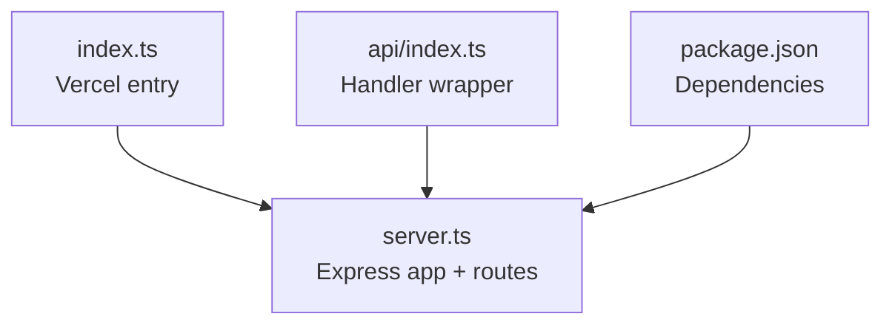
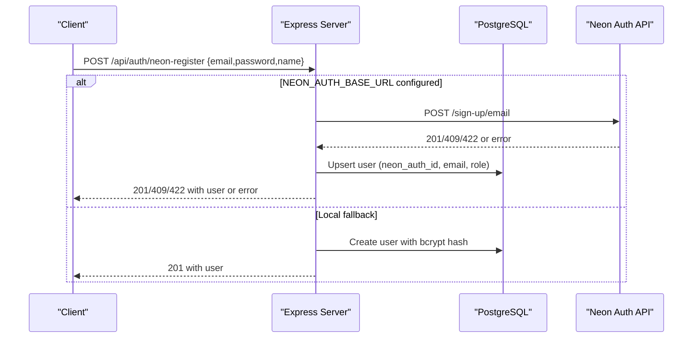
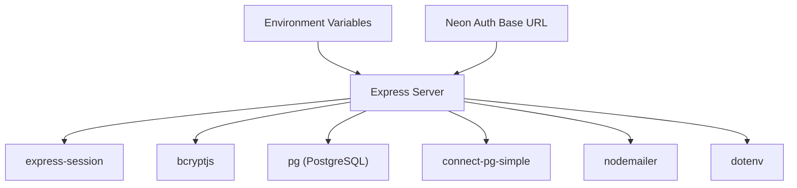

# Authentication API

<cite>
**Referenced Files in This Document**
- [server.ts](file://server.ts)
- [index.ts](file://index.ts)
- [api/index.ts](file://api/index.ts)
- [package.json](file://package.json)
</cite>

## Table of Contents
1. [Introduction](#introduction)
2. [Project Structure](#project-structure)
3. [Core Components](#core-components)
4. [Architecture Overview](#architecture-overview)
5. [Detailed Component Analysis](#detailed-component-analysis)
6. [Dependency Analysis](#dependency-analysis)
7. [Performance Considerations](#performance-considerations)
8. [Troubleshooting Guide](#troubleshooting-guide)
9. [Conclusion](#conclusion)
10. [Appendices](#appendices)

## Introduction
This document provides comprehensive API documentation for all authentication endpoints exposed by the application. It covers:
- Username/password registration and login with session management
- Email-based registration and login via Neon Auth integration
- Session termination
- Security considerations including password hashing with bcryptjs and secure session configuration
- Practical client examples using curl and JavaScript fetch, along with error handling strategies

The server is implemented with Express, uses express-session for sessions, connect-pg-simple for persistent sessions backed by PostgreSQL, and bcryptjs for password hashing. Neon Auth integration is supported via a base URL environment variable; when not configured, the system falls back to local email/password auth.

## Project Structure
Authentication logic is centralized in the Express server file. The Vercel/serverless entry point initializes database tables and exports the Express app.

**Diagram sources**
- [index.ts:1-20](file://index.ts#L1-L20)
- [api/index.ts:1-5](file://api/index.ts#L1-L5)
- [package.json:1-64](file://package.json#L1-L64)

**Section sources**
- [index.ts:1-20](file://index.ts#L1-L20)
- [api/index.ts:1-5](file://api/index.ts#L1-L5)
- [server.ts:1-125](file://server.ts#L1-L125)

## Core Components
- HTTP Server: Express application with JSON and URL-encoded body parsing
- Session Management: express-session with PostgreSQL-backed store (connect-pg-simple)
- Password Hashing: bcryptjs with salt rounds configured at 12
- Database: PostgreSQL pool for user data and sessions
- Optional Identity Provider: Neon Auth REST API proxy for email-based flows

Key security features:
- Secure cookie settings (httpOnly, sameSite, secure in production)
- Session regeneration on successful authentication
- Role re-check from DB on protected endpoints
- CSRF-safe cookie policy (sameSite lax) and HTTPS enforcement in production

**Section sources**
- [server.ts:18-125](file://server.ts#L18-L125)
- [server.ts:209-235](file://server.ts#L209-L235)
- [server.ts:547-591](file://server.ts#L547-L591)

## Architecture Overview
The authentication architecture supports two modes:
- Local mode: username/email + password stored locally with bcrypt hashes
- Neon Auth mode: email-based identity provider via Neon Auth REST API, with local upsert for CRM role continuity

**Diagram sources**
- [server.ts:594-680](file://server.ts#L594-L680)
- [server.ts:408-470](file://server.ts#L408-L470)

**Section sources**
- [server.ts:594-680](file://server.ts#L594-L680)
- [server.ts:408-470](file://server.ts#L408-L470)

## Detailed Component Analysis

### Endpoint: POST /api/auth/register
Registers a new user with username/password validation and creates a session automatically after successful registration.

- Method: POST
- URL: /api/auth/register
- Request Body:
  - username: string (3–64 chars; letters, numbers, . _ - @; also accepts email format)
  - password: string (minimum 8 characters)
- Response:
  - 201 Created: { user: { id: number, username: string, role: string } }
  - 400 Bad Request: { error: string }
  - 409 Conflict: { error: string } (username already exists)
  - 500 Internal Server Error: { error: string }
- Authentication: None required
- Behavior:
  - Validates input types and formats
  - Checks uniqueness against both username and email columns
  - Hashes password with bcrypt (salt rounds 12)
  - First user becomes admin; subsequent users get role "user"
  - Regenerates session and sets userId, username, role
  - Persists session to PostgreSQL if configured

Security considerations:
- Passwords are hashed with bcrypt before storage
- Session regenerated to prevent fixation
- Cookie flags set appropriately (httpOnly, sameSite, secure in production)

Practical examples:
- curl:
  - curl -X POST https://your-domain/api/auth/register -H "Content-Type: application/json" -d '{"username":"alice","password":"securePass123"}'
- JavaScript fetch:
  - fetch("/api/auth/register", { method: "POST", headers: { "Content-Type": "application/json" }, body: JSON.stringify({ username: "alice", password: "securePass123" }) }).then(r => r.json()).then(console.log)

Error handling strategy:
- Validate inputs early and return 400 with descriptive messages
- Handle duplicate usernames with 409
- Wrap DB operations in try/catch and return 500 with generic message

**Section sources**
- [server.ts:266-338](file://server.ts#L266-L338)
- [server.ts:127-128](file://server.ts#L127-L128)
- [server.ts:291-316](file://server.ts#L291-L316)
- [server.ts:318-333](file://server.ts#L318-L333)

### Endpoint: POST /api/auth/login
Authenticates a user with username/password and creates a session. Accepts either username or email in the username field.

- Method: POST
- URL: /api/auth/login
- Request Body:
  - username: string (accepts username or email)
  - password: string
- Response:
  - 200 OK: { user: { id: number, username: string, role: string } }
  - 400 Bad Request: { error: string }
  - 401 Unauthorized: { error: string }
  - 500 Internal Server Error: { error: string }
- Authentication: None required
- Behavior:
  - Validates input types
  - Looks up user by username or email
  - Compares password using bcrypt.compare
  - Regenerates session and persists it
  - Returns user profile without sensitive fields

Security considerations:
- Constant-time comparison via bcrypt.compare mitigates timing attacks
- Session regeneration prevents session fixation
- No password leakage in responses

Practical examples:
- curl:
  - curl -X POST https://your-domain/api/auth/login -H "Content-Type: application/json" -d '{"username":"alice@example.com","password":"securePass123"}'
- JavaScript fetch:
  - fetch("/api/auth/login", { method: "POST", headers: { "Content-Type": "application/json" }, body: JSON.stringify({ username: "alice@example.com", password: "securePass123" }) }).then(r => r.json()).then(console.log)

Error handling strategy:
- Return 401 for invalid credentials
- Return 400 for malformed requests
- Catch DB errors and return 500

**Section sources**
- [server.ts:340-381](file://server.ts#L340-L381)
- [server.ts:348-355](file://server.ts#L348-L355)
- [server.ts:361-376](file://server.ts#L361-L376)

### Endpoint: POST /api/auth/logout
Terminates the current session and clears the session cookie.

- Method: POST
- URL: /api/auth/logout
- Request Body: None
- Response:
  - 200 OK: { ok: boolean }
  - 500 Internal Server Error: { error: string }
- Authentication: Requires active session
- Behavior:
  - Destroys session
  - Clears connect.sid cookie
  - Returns success response

Security considerations:
- Ensures server-side session destruction
- Clears client-side cookie to prevent reuse

Practical examples:
- curl:
  - curl -X POST https://your-domain/api/auth/logout -c cookies.txt -b cookies.txt
- JavaScript fetch:
  - fetch("/api/auth/logout", { method: "POST", credentials: "include" }).then(r => r.json()).then(console.log)

Error handling strategy:
- Log and return 500 if session destruction fails

**Section sources**
- [server.ts:383-392](file://server.ts#L383-L392)

### Endpoint: POST /api/auth/neon-register
Email-based registration with optional Neon Auth integration. Falls back to local email/password auth if Neon Auth is not configured.

- Method: POST
- URL: /api/auth/neon-register
- Request Body:
  - email: string (must contain "@")
  - password: string (minimum 8 characters)
  - name: string (optional)
- Response:
  - 201 Created: { user: { id: number, username: string, role: string } }
  - 400 Bad Request: { error: string }
  - 409 Conflict: { error: string } (email already exists)
  - 422 Unprocessable Entity: { error: string } (Neon Auth conflict)
  - 500 Internal Server Error: { error: string }
- Authentication: None required
- Behavior:
  - Validates email format and password length
  - If NEON_AUTH_BASE_URL is set:
    - Calls Neon Auth /sign-up/email
    - Handles 409/422 as existing user; updates local password_hash and creates session
    - On success, upserts user into local DB with neon_auth_id and derives username
  - If not configured:
    - Uses localNeonRegister to create user with bcrypt hash
  - Creates session with user info

Security considerations:
- Password hashed locally even when using Neon Auth for fallback verification
- Session created securely with regeneration
- Origin header included in Neon Auth calls

Practical examples:
- curl:
  - curl -X POST https://your-domain/api/auth/neon-register -H "Content-Type: application/json" -d '{"email":"alice@example.com","password":"securePass123","name":"Alice"}'
- JavaScript fetch:
  - fetch("/api/auth/neon-register", { method: "POST", headers: { "Content-Type": "application/json" }, body: JSON.stringify({ email: "alice@example.com", password: "securePass123", name: "Alice" }) }).then(r => r.json()).then(console.log)

Error handling strategy:
- Validate inputs and return 400
- Handle Neon Auth conflicts (409/422) gracefully
- Map Neon Auth errors to appropriate status codes
- Fallback to local auth when Neon Auth is unavailable

**Section sources**
- [server.ts:594-680](file://server.ts#L594-L680)
- [server.ts:408-470](file://server.ts#L408-L470)
- [server.ts:472-524](file://server.ts#L472-L524)

### Endpoint: POST /api/auth/neon-login
Email-based login with local-first optimization and Neon Auth fallback.

- Method: POST
- URL: /api/auth/neon-login
- Request Body:
  - email: string
  - password: string
- Response:
  - 200 OK: { user: { id: number, username: string, role: string } }
  - 400 Bad Request: { error: string }
  - 401 Unauthorized: { error: string }
  - 403 Forbidden: { error: string } (email not verified in Neon Auth)
  - 500 Internal Server Error: { error: string }
- Authentication: None required
- Behavior:
  - Validates input types
  - Checks local DB for existing user with password_hash
  - If local hash exists and matches, creates session immediately (fast path)
  - If no local hash and NEON_AUTH_BASE_URL configured:
    - Calls Neon Auth /sign-in/email
    - Handles EMAIL_NOT_VERIFIED (403) with specific message
    - On success, upserts user and creates session
  - Otherwise returns 401

Security considerations:
- Local-first approach reduces latency and external dependencies
- Constant-time bcrypt.compare used for local verification
- Session creation secured with regeneration

Practical examples:
- curl:
  - curl -X POST https://your-domain/api/auth/neon-login -H "Content-Type: application/json" -d '{"email":"alice@example.com","password":"securePass123"}'
- JavaScript fetch:
  - fetch("/api/auth/neon-login", { method: "POST", headers: { "Content-Type": "application/json" }, body: JSON.stringify({ email: "alice@example.com", password: "securePass123" }) }).then(r => r.json()).then(console.log)

Error handling strategy:
- Return 400 for invalid inputs
- Return 401 for wrong credentials
- Return 403 for unverified email in Neon Auth flow
- Catch and log unexpected errors with 500

**Section sources**
- [server.ts:683-748](file://server.ts#L683-L748)
- [server.ts:526-545](file://server.ts#L526-L545)

### Additional Endpoints

#### GET /api/auth/me
Returns current authenticated user information.

- Method: GET
- URL: /api/auth/me
- Response:
  - 200 OK: { user: { id: number, username: string, role: string } }
  - 401 Unauthorized: { error: string }
  - 500 Internal Server Error: { error: string }
- Authentication: Requires active session
- Behavior: Re-checks role from DB to ensure latest permissions

**Section sources**
- [server.ts:832-851](file://server.ts#L832-L851)

#### POST /api/auth/forgot-password
Generates a password reset token and sends an email.

- Method: POST
- URL: /api/auth/forgot-password
- Request Body: { email: string }
- Response:
  - 200 OK: { ok: boolean, message: string }
  - 400 Bad Request: { error: string }
  - 500 Internal Server Error: { error: string }
- Authentication: None required
- Behavior: Always responds OK even if email doesn't exist (security best practice)

**Section sources**
- [server.ts:753-791](file://server.ts#L753-L791)

#### POST /api/auth/reset-password
Resets password using a valid reset token.

- Method: POST
- URL: /api/auth/reset-password
- Request Body: { token: string, newPassword: string }
- Response:
  - 200 OK: { ok: boolean, message: string }
  - 400 Bad Request: { error: string }
  - 500 Internal Server Error: { error: string }
- Authentication: None required
- Behavior: Validates token, hashes new password, updates user, invalidates old sessions

**Section sources**
- [server.ts:795-830](file://server.ts#L795-L830)

## Dependency Analysis
The authentication system depends on several key libraries and configurations:

**Diagram sources**
- [server.ts:1-15](file://server.ts#L1-L15)
- [package.json:15-45](file://package.json#L15-L45)

Key dependencies:
- express-session: Session management with configurable stores
- bcryptjs: Password hashing with configurable salt rounds
- pg: PostgreSQL client for database operations
- connect-pg-simple: Persistent session storage in PostgreSQL
- nodemailer: Email sending for password reset functionality
- dotenv: Environment variable loading

Configuration requirements:
- DATABASE_URL: PostgreSQL connection string
- SESSION_SECRET: Secret for signing session cookies
- NEON_AUTH_BASE_URL: Optional Neon Auth endpoint
- SMTP_USER/SMTP_PASS: For password reset emails
- APP_URL: Application base URL for email links

**Section sources**
- [server.ts:1-15](file://server.ts#L1-L15)
- [server.ts:24-77](file://server.ts#L24-L77)
- [server.ts:107-125](file://server.ts#L107-L125)
- [package.json:15-45](file://package.json#L15-L45)

## Performance Considerations
- Local-first login optimization: neon-login checks local password hash first to avoid external API calls
- Session persistence: PostgreSQL-backed sessions provide durability across server restarts
- Connection pooling: PostgreSQL pool manages database connections efficiently
- Async operations: All database and external API calls use async/await patterns
- Timeout protection: Session creation includes timeout guards to prevent hanging requests

Optimization opportunities:
- Implement rate limiting for authentication endpoints
- Add caching for frequently accessed user data
- Consider Redis for session storage in high-throughput scenarios
- Implement request logging and monitoring

## Troubleshooting Guide
Common issues and solutions:

Database connectivity:
- Ensure DATABASE_URL is properly configured
- Check PostgreSQL service availability
- Verify SSL settings in production

Session issues:
- Confirm SESSION_SECRET is set and sufficiently random
- Check PostgreSQL session table creation
- Verify cookie settings match deployment environment

Password hashing problems:
- Ensure bcryptjs is properly installed
- Check password complexity requirements
- Verify password hash format compatibility

Neon Auth integration:
- Validate NEON_AUTH_BASE_URL configuration
- Check network connectivity to Neon Auth service
- Review CORS and origin header settings

Email delivery:
- Configure SMTP_USER and SMTP_PASS for password reset emails
- Verify Gmail SMTP settings and app passwords
- Check email templates and link generation

**Section sources**
- [server.ts:24-77](file://server.ts#L24-L77)
- [server.ts:107-125](file://server.ts#L107-L125)
- [server.ts:133-207](file://server.ts#L133-L207)

## Conclusion
The authentication system provides robust user management with support for both traditional username/password and modern email-based authentication through Neon Auth integration. Key security features include bcrypt password hashing, secure session management, and proper error handling. The system is designed for scalability with PostgreSQL-backed sessions and supports both local and cloud-based identity providers.

Implementation guidelines emphasize security best practices, performance optimization, and comprehensive error handling. The modular design allows for easy extension and maintenance while providing clear APIs for client integration.

## Appendices

### Security Best Practices Checklist
- Use HTTPS in production environments
- Set strong SESSION_SECRET values
- Configure proper cookie security flags
- Implement rate limiting on authentication endpoints
- Regularly update dependencies
- Monitor authentication logs for suspicious activity
- Use environment variables for sensitive configuration

### Client Implementation Guidelines
- Always handle authentication errors gracefully
- Store session cookies securely
- Implement proper logout functionality
- Handle network failures and timeouts
- Validate user input on both client and server sides
- Use appropriate HTTP methods and status codes