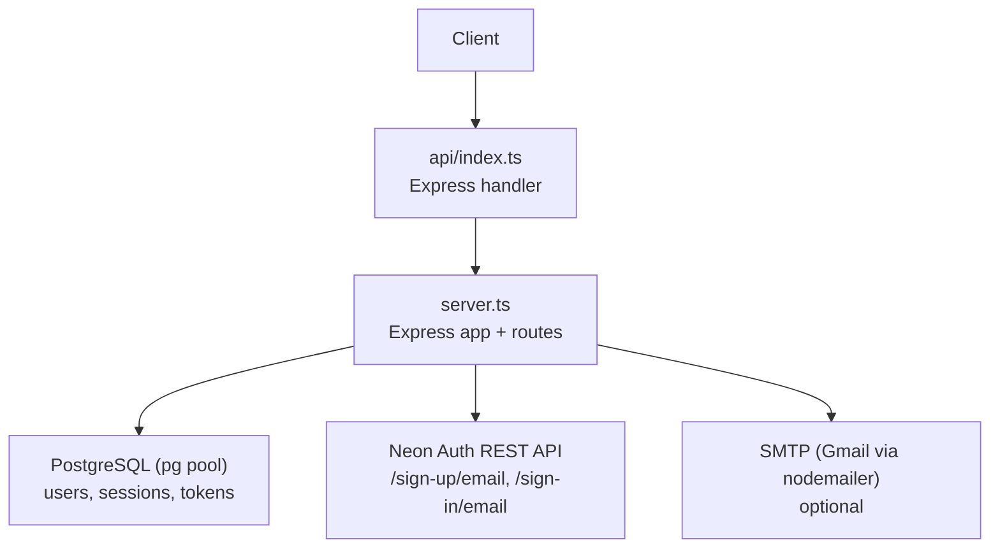
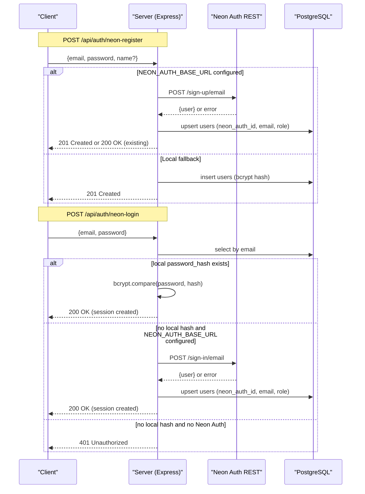
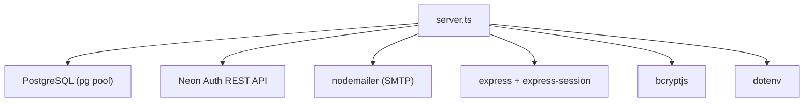

# Email/Neon Auth Integration

<cite>
**Referenced Files in This Document**
- [server.ts](file://server.ts)
- [api/index.ts](file://api/index.ts)
- [package.json](file://package.json)
- [scripts/sync-secrets.mjs](file://scripts/sync-secrets.mjs)
- [scripts/generate-env.mjs](file://scripts/generate-env.mjs)
- [src/components/SettingsTab.tsx](file://src/components/SettingsTab.tsx)
</cite>

## Table of Contents
1. [Introduction](#introduction)
2. [Project Structure](#project-structure)
3. [Core Components](#core-components)
4. [Architecture Overview](#architecture-overview)
5. [Detailed Component Analysis](#detailed-component-analysis)
6. [Dependency Analysis](#dependency-analysis)
7. [Performance Considerations](#performance-considerations)
8. [Troubleshooting Guide](#troubleshooting-guide)
9. [Conclusion](#conclusion)

## Introduction
This document provides comprehensive API documentation for email-based authentication with Neon Auth integration. It covers the /api/auth/neon-register endpoint for email registration (with an optional name field) and the /api/auth/neon-login endpoint for email authentication. The implementation supports two modes:
- Direct Neon Auth integration via a REST API when NEON_AUTH_BASE_URL is configured.
- Local fallback mode using bcrypt against a local PostgreSQL users table when NEON_AUTH_BASE_URL is not set.

It also explains configuration, dual authentication paths, user synchronization between Neon Auth and the local database, error handling for email verification requirements, request/response schemas, status codes, and troubleshooting guidance.

## Project Structure
The authentication endpoints are implemented in the Express server. The API entrypoint delegates to the main application instance. Environment variables drive configuration, including Neon Auth base URL, database connection, session secret, and SMTP settings.

**Diagram sources**
- [api/index.ts:1-5](file://api/index.ts#L1-L5)
- [server.ts:18-28](file://server.ts#L18-L28)
- [server.ts:394-748](file://server.ts#L394-L748)

**Section sources**
- [api/index.ts:1-5](file://api/index.ts#L1-L5)
- [server.ts:18-28](file://server.ts#L18-L28)
- [package.json:1-64](file://package.json#L1-L64)

## Core Components
- Express server initializes middleware (JSON parsing, URL-encoded, sessions), database pool, and defines authentication routes.
- Neon Auth integration uses a typed fetch wrapper to call Neon Auth REST endpoints server-side, avoiding CORS issues.
- User synchronization upserts identities into the local users table, preserving roles and linking neon_auth_id.
- Local-only fallback implements bcrypt hashing and comparison without calling Neon Auth.
- Session creation helper ensures consistent response behavior and handles timeouts or persistence errors gracefully.

Key environment variables:
- NEON_AUTH_BASE_URL or VITE_NEON_AUTH_URL: Base URL for Neon Auth REST API.
- DATABASE_URL: PostgreSQL connection string.
- SESSION_SECRET: Secret used to sign session cookies.
- APP_URL: Origin header sent to Neon Auth; defaults to a safe value if unset.
- SMTP_USER and SMTP_PASS: Optional Gmail credentials for password reset emails.

**Section sources**
- [server.ts:18-28](file://server.ts#L18-L28)
- [server.ts:82-90](file://server.ts#L82-L90)
- [server.ts:394-404](file://server.ts#L394-L404)
- [server.ts:408-470](file://server.ts#L408-L470)
- [server.ts:472-545](file://server.ts#L472-L545)
- [server.ts:547-591](file://server.ts#L547-L591)
- [server.ts:594-680](file://server.ts#L594-L680)
- [server.ts:683-748](file://server.ts#L683-L748)
- [scripts/sync-secrets.mjs:23-51](file://scripts/sync-secrets.mjs#L23-L51)
- [scripts/generate-env.mjs:1-45](file://scripts/generate-env.mjs#L1-L45)
- [src/components/SettingsTab.tsx:138-165](file://src/components/SettingsTab.tsx#L138-L165)

## Architecture Overview
The authentication flow supports two paths based on configuration:
- Neon Auth path: Requests are proxied to Neon Auth REST endpoints, then synchronized to the local users table.
- Local fallback path: Registration and login use bcrypt directly against the local database.

**Diagram sources**
- [server.ts:594-680](file://server.ts#L594-L680)
- [server.ts:683-748](file://server.ts#L683-L748)
- [server.ts:408-470](file://server.ts#L408-L470)

## Detailed Component Analysis

### /api/auth/neon-register
Purpose: Register a new user via email with optional name. Supports both Neon Auth integration and local fallback.

Request schema:
- email: string (required)
- password: string (required, minimum length enforced)
- name: string (optional)

Validation:
- email must contain "@"
- password length must meet minimum threshold
- duplicate email detection returns conflict

Behavior:
- If NEON_AUTH_BASE_URL is set:
  - Hash password locally for fallback capability
  - Call Neon Auth /sign-up/email
  - Handle existing user responses (409/422 or body flags)
  - Upsert local user record with neon_auth_id and email
  - Create session and return appropriate status code
- If NEON_AUTH_BASE_URL is not set:
  - Use local bcrypt hashing and insert into users table
  - Create session and return status code

Status codes:
- 201 Created: New user registered successfully
- 200 OK: Existing user detected; session created after updating local hash
- 400 Bad Request: Validation errors
- 409 Conflict: Duplicate email
- 403 Forbidden: Email verification required (when Neon Auth enforces this)
- 5xx: Internal server errors

Response schema:
- On success: { user: { id, username, role } }
- On error: { error: string }

Example requests/responses:
- Neon Auth integration setup:
  - Configure NEON_AUTH_BASE_URL to point to your Neon Auth service.
  - Send POST /api/auth/neon-register with { email, password, name }.
  - Expect 201 for new users, 200 for existing users, 403 if email not verified.
- Local fallback mode:
  - Do not set NEON_AUTH_BASE_URL.
  - Send POST /api/auth/neon-register with { email, password, name }.
  - Expect 201 for new users, 409 for duplicates, 400 for validation errors.

**Section sources**
- [server.ts:594-680](file://server.ts#L594-L680)
- [server.ts:408-470](file://server.ts#L408-L470)

### /api/auth/neon-login
Purpose: Authenticate a user via email with local-first optimization that skips Neon Auth calls when a local bcrypt hash exists.

Request schema:
- email: string (required)
- password: string (required)

Behavior:
- Query local users table by email.
- If a valid bcrypt hash exists:
  - Compare password locally.
  - On success, create session and return 200 OK.
- If no local hash and NEON_AUTH_BASE_URL is configured:
  - Call Neon Auth /sign-in/email.
  - Handle email verification requirement (403 with EMAIL_NOT_VERIFIED).
  - Upsert local user record and create session.
- If no local hash and NEON_AUTH_BASE_URL is not configured:
  - Return 401 Unauthorized.

Status codes:
- 200 OK: Successful login with session created
- 400 Bad Request: Validation errors
- 401 Unauthorized: Invalid credentials or missing configuration
- 403 Forbidden: Email not verified (Neon Auth enforcement)
- 5xx: Internal server errors

Response schema:
- On success: { user: { id, username, role } }
- On error: { error: string }

Example requests/responses:
- With local hash present:
  - Send POST /api/auth/neon-login with { email, password }.
  - Expect 200 OK if credentials match.
- Without local hash and Neon Auth configured:
  - Send POST /api/auth/neon-login with { email, password }.
  - Expect 200 OK after successful Neon Auth authentication and local sync.
- Email verification required:
  - Expect 403 Forbidden with message indicating registration step needed.

**Section sources**
- [server.ts:683-748](file://server.ts#L683-L748)

### User Synchronization (upsertNeonAuthUser)
Purpose: Maintain consistency between Neon Auth identities and local users table.

Logic:
- Search by neon_auth_id first, then by email.
- Update existing record with neon_auth_id, email, and optional password_hash.
- For new records, derive username from name or email prefix, ensure uniqueness, assign role (admin for first user, user otherwise), and insert with neon_auth_id.

Complexity:
- Database queries are O(1) per operation with proper indexing.
- Username derivation includes sanitization and collision resolution.

**Section sources**
- [server.ts:408-470](file://server.ts#L408-L470)

### Local Fallback Functions
localNeonRegister:
- Validates email uniqueness.
- Derives username from name or email prefix.
- Hashes password with bcrypt.
- Inserts user with role assignment (admin for first user).

localNeonLogin:
- Queries user by email.
- Compares password with stored bcrypt hash.
- Returns user data on success or throws with status 401 on failure.

**Section sources**
- [server.ts:472-545](file://server.ts#L472-L545)

### Session Creation Helper
createSession:
- Regenerates session and sets userId, username, role.
- Handles timeout protection (5 seconds) to ensure response is always sent.
- Gracefully handles session persistence failures while still returning user data.

**Section sources**
- [server.ts:547-591](file://server.ts#L547-L591)

## Dependency Analysis
The authentication system depends on several external services and configurations:

**Diagram sources**
- [server.ts:1-15](file://server.ts#L1-L15)
- [server.ts:18-28](file://server.ts#L18-L28)
- [server.ts:82-90](file://server.ts#L82-L90)

Key dependencies:
- PostgreSQL for user storage and session persistence
- Neon Auth REST API for identity management (optional)
- bcryptjs for password hashing
- express-session for session management
- dotenv for environment variable loading
- nodemailer for email delivery (optional)

**Section sources**
- [server.ts:1-15](file://server.ts#L1-L15)
- [server.ts:18-28](file://server.ts#L18-L28)
- [package.json:15-45](file://package.json#L15-L45)

## Performance Considerations
- Local-first login optimization: When a bcrypt hash exists locally, authentication bypasses Neon Auth calls, reducing latency significantly.
- Connection pooling: PostgreSQL connections are managed through a pool for efficient resource utilization.
- Session store: Uses connect-pg-simple for persistent sessions in production environments.
- Timeout protection: Session creation includes a 5-second timeout to prevent hanging responses.

Optimization opportunities:
- Consider caching frequently accessed user data to reduce database queries.
- Implement rate limiting on authentication endpoints to prevent brute force attacks.
- Monitor Neon Auth API response times and implement circuit breakers if necessary.

[No sources needed since this section provides general guidance]

## Troubleshooting Guide
Common issues and resolutions:

1. NEON_AUTH_BASE_URL not configured:
   - Symptom: Authentication falls back to local bcrypt only.
   - Resolution: Set NEON_AUTH_BASE_URL or VITE_NEON_AUTH_URL environment variable.

2. Email verification required:
   - Symptom: 403 Forbidden with EMAIL_NOT_VERIFIED during login.
   - Resolution: Complete registration process to synchronize access.

3. Duplicate email conflicts:
   - Symptom: 409 Conflict during registration.
   - Resolution: Use a different email address or verify existing account.

4. Session persistence failures:
   - Symptom: Authentication succeeds but session not saved.
   - Resolution: Check DATABASE_URL configuration and PostgreSQL connectivity.

5. SMTP configuration issues:
   - Symptom: Password reset emails not sent.
   - Resolution: Configure SMTP_USER and SMTP_PASS environment variables.

6. CORS issues with Neon Auth:
   - Symptom: Network errors when calling Neon Auth endpoints.
   - Resolution: Ensure NEON_AUTH_BASE_URL points to correct Neon Auth service and APP_URL is properly configured.

**Section sources**
- [server.ts:594-680](file://server.ts#L594-L680)
- [server.ts:683-748](file://server.ts#L683-L748)
- [scripts/sync-secrets.mjs:23-51](file://scripts/sync-secrets.mjs#L23-L51)

## Conclusion
The email-based authentication system provides flexible integration with Neon Auth while maintaining robust local fallback capabilities. The dual-path architecture ensures reliability and performance through local-first optimizations. Proper configuration of environment variables is essential for optimal functionality, particularly NEON_AUTH_BASE_URL for Neon Auth integration. The system handles common authentication scenarios including user registration, login, email verification requirements, and user synchronization between external and local identity stores.

[No sources needed since this section summarizes without analyzing specific files]