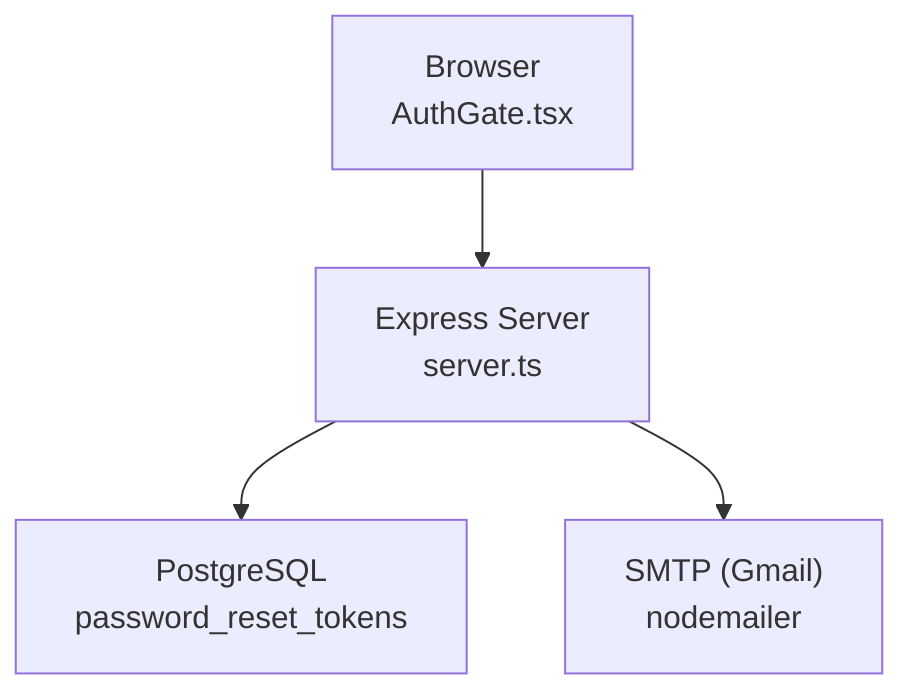
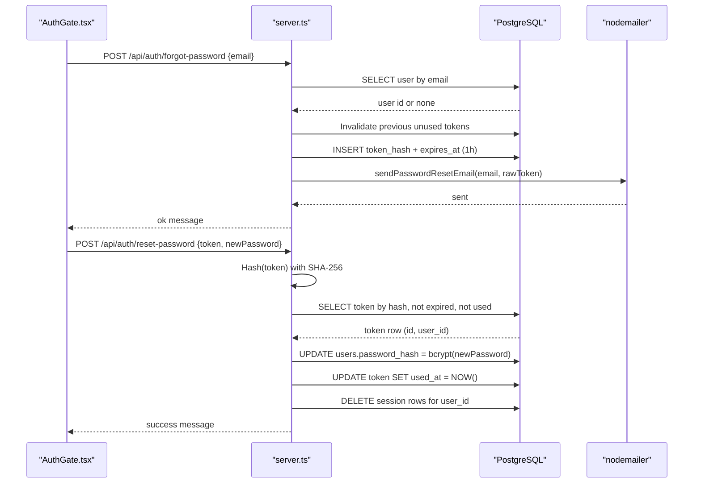
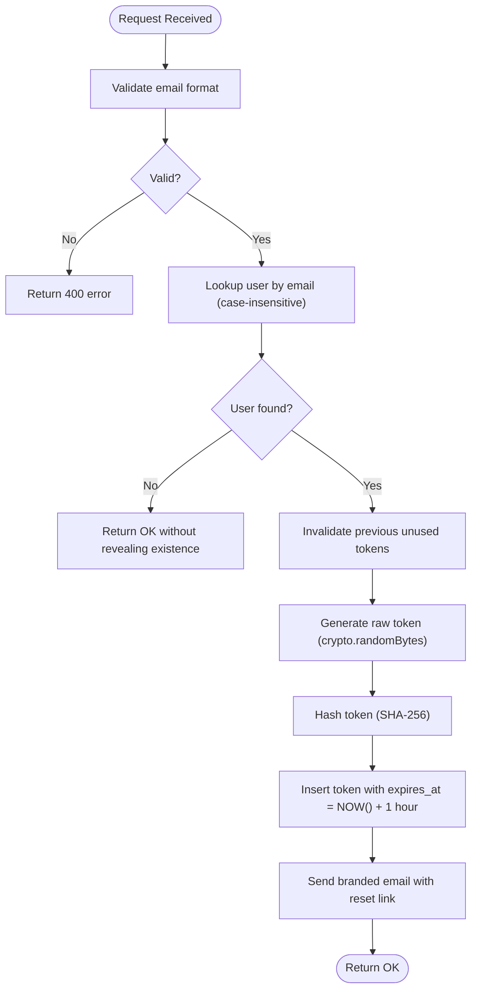
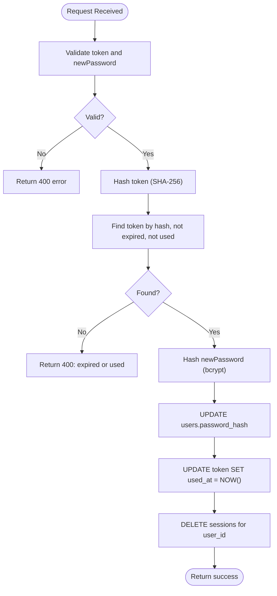
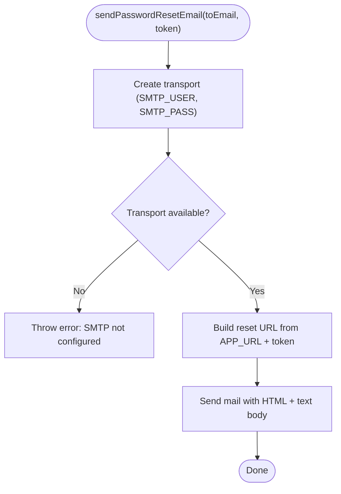
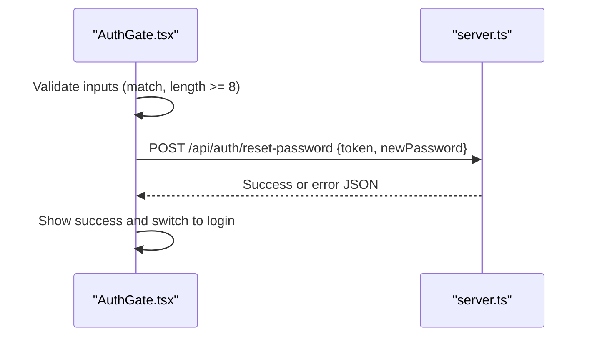
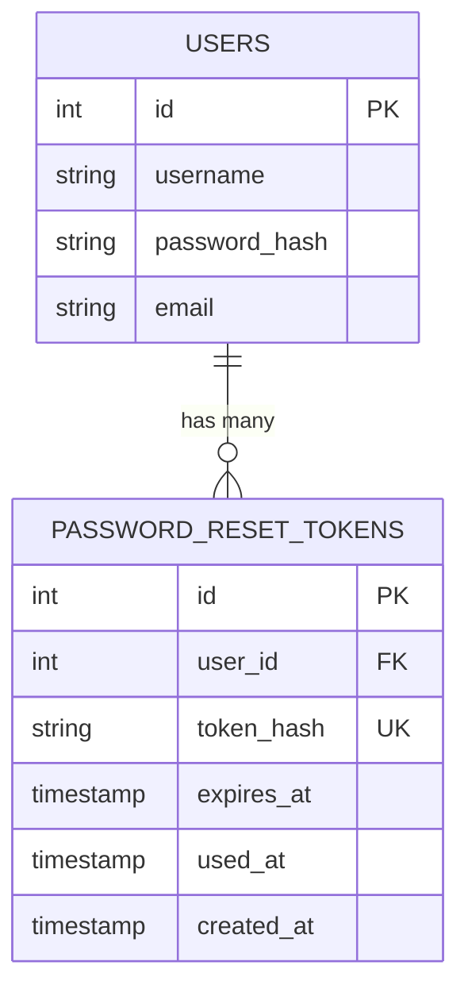
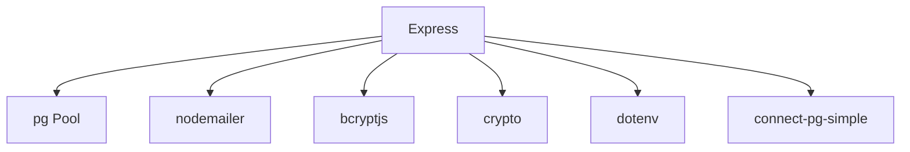

# Password Reset Flow

<cite>
**Referenced Files in This Document**
- [server.ts](file://server.ts)
- [AuthGate.tsx](file://src/components/AuthGate.tsx)
- [package.json](file://package.json)
- [generate-env.mjs](file://scripts/generate-env.mjs)
- [sync-secrets.mjs](file://scripts/sync-secrets.mjs)
</cite>

## Table of Contents
1. [Introduction](#introduction)
2. [Project Structure](#project-structure)
3. [Core Components](#core-components)
4. [Architecture Overview](#architecture-overview)
5. [Detailed Component Analysis](#detailed-component-analysis)
6. [Dependency Analysis](#dependency-analysis)
7. [Performance Considerations](#performance-considerations)
8. [Troubleshooting Guide](#troubleshooting-guide)
9. [Conclusion](#conclusion)

## Introduction
This document explains the password reset functionality, focusing on two endpoints:
- POST /api/auth/forgot-password: Generates a secure reset token, stores its hash, and sends an email with a branded template.
- POST /api/auth/reset-password: Validates the token, enforces new password requirements (minimum 8 characters), and atomically updates the user’s password while invalidating the token and active sessions.

The implementation uses crypto.randomBytes for token generation, SHA-256 hashing for secure storage, one-hour expiration, and SMTP via nodemailer configured with environment variables. Security considerations include timing attack prevention during login and robust token validation to prevent reuse or replay.

## Project Structure
Password reset is implemented server-side in Express within a single file, with the frontend triggering the reset flow from a React component. Email delivery relies on nodemailer and Gmail SMTP configuration through environment variables. Database interactions use PostgreSQL via pg pool, including a dedicated table for reset tokens.

**Diagram sources**
- [server.ts](file://server.ts)
- [AuthGate.tsx](file://src/components/AuthGate.tsx)

**Section sources**
- [server.ts](file://server.ts)
- [AuthGate.tsx](file://src/components/AuthGate.tsx)

## Core Components
- Forgot Password Endpoint: Validates email, looks up user by normalized email, invalidates previous unused tokens, generates a random token, hashes it with SHA-256, inserts into password_reset_tokens with a 1-hour expiry, and sends an email containing the reset link.
- Reset Password Endpoint: Validates token length and new password length, hashes the token with SHA-256, finds a valid unused non-expired token, hashes the new password with bcrypt, updates the user’s password, marks the token as used, and destroys active sessions for that user.
- Email Delivery: Uses nodemailer with Gmail SMTP configured via SMTP_USER and SMTP_PASS; constructs a branded HTML email with a reset link using APP_URL.
- Data Model: password_reset_tokens table stores token_hash, expires_at, used_at, and references users(id).

**Section sources**
- [server.ts](file://server.ts)

## Architecture Overview
The password reset flow involves client input, server-side validation, database operations, and email delivery. The sequence below maps to actual code paths.

**Diagram sources**
- [server.ts](file://server.ts)
- [AuthGate.tsx](file://src/components/AuthGate.tsx)

## Detailed Component Analysis

### Forgot Password Endpoint (/api/auth/forgot-password)
- Input validation: Ensures email is present and contains “@”.
- User lookup: Normalizes email case-insensitively to find the user.
- Token lifecycle: Invalidates any previous unused tokens for the user, generates a cryptographically secure token with crypto.randomBytes(32), hashes it with SHA-256, and persists it with a 1-hour expiration.
- Email sending: Constructs a branded HTML email with a reset URL built from APP_URL and the raw token.
- Response behavior: Always returns a success-like response even if the email does not exist to avoid enumeration.

**Diagram sources**
- [server.ts](file://server.ts)

**Section sources**
- [server.ts](file://server.ts)

### Reset Password Endpoint (/api/auth/reset-password)
- Input validation: Requires token string (length >= 32) and newPassword string (length >= 8).
- Token validation: Hashes the provided token with SHA-256 and queries for a matching, non-expired, unused token.
- Atomic update: On success, hashes the new password with bcrypt, updates the user’s password, marks the token as used, and deletes active sessions for the user to force re-login.
- Error handling: Returns clear errors for invalid token, expired/used token, and general failures.

**Diagram sources**
- [server.ts](file://server.ts)

**Section sources**
- [server.ts](file://server.ts)

### Email Delivery and Template
- Transport: Created via nodemailer using Gmail SMTP settings from SMTP_USER and SMTP_PASS.
- Template: Branded HTML email includes a call-to-action button and fallback plain text, with a reset URL constructed from APP_URL plus the raw token.
- Fallback behavior: If SMTP credentials are missing, an error is thrown indicating misconfiguration.

**Diagram sources**
- [server.ts](file://server.ts)

**Section sources**
- [server.ts](file://server.ts)

### Frontend Integration (AuthGate.tsx)
- The reset form validates that passwords match and meet minimum length, then calls POST /api/auth/reset-password with token and newPassword.
- On success, shows a confirmation message and switches back to login mode after a delay.

**Diagram sources**
- [AuthGate.tsx](file://src/components/AuthGate.tsx)
- [server.ts](file://server.ts)

**Section sources**
- [AuthGate.tsx](file://src/components/AuthGate.tsx)

### Data Model: password_reset_tokens
- Columns: id (primary key), user_id (foreign key to users), token_hash (unique), expires_at (timestamp), used_at (nullable timestamp), created_at (default now).
- Indexes: token_hash and user_id for efficient lookups and invalidation.

**Diagram sources**
- [server.ts](file://server.ts)

**Section sources**
- [server.ts](file://server.ts)

## Dependency Analysis
Key dependencies involved in the password reset flow:
- Express: HTTP routing and request/response handling.
- pg (Pool): Database connectivity and query execution.
- connect-pg-simple: Session store backed by PostgreSQL.
- bcryptjs: Password hashing for user accounts.
- nodemailer: Email delivery via SMTP.
- crypto: Secure token generation and SHA-256 hashing.
- dotenv: Environment variable loading.

**Diagram sources**
- [server.ts](file://server.ts)
- [package.json](file://package.json)

**Section sources**
- [package.json](file://package.json)
- [server.ts](file://server.ts)

## Performance Considerations
- Token lookup efficiency: The password_reset_tokens table includes indexes on token_hash and user_id to optimize queries for validation and invalidation.
- Session cleanup: Deleting sessions by pattern matching user_id ensures immediate logout across devices after password reset.
- Email latency: SMTP delivery can be asynchronous; ensure timeouts and retries are handled appropriately at the application layer if needed.
- Database connection pooling: Using pg.Pool helps manage concurrent requests efficiently.

[No sources needed since this section provides general guidance]

## Troubleshooting Guide
Common issues and resolutions:
- Email not received:
  - Verify SMTP_USER and SMTP_PASS are set correctly.
  - Ensure APP_URL is configured so the reset link is correct.
  - Check spam/junk folders and SMTP provider logs.
- Token invalid or expired:
  - Tokens expire after 1 hour and are invalidated after use.
  - Request a new token via forgot-password endpoint.
- Password reset fails:
  - Ensure newPassword meets minimum length requirement (>= 8).
  - Confirm token is valid, not expired, and not already used.
- Timing attacks:
  - Login path uses constant-time comparison patterns to mitigate enumeration; reset flow avoids leaking user existence.
- Session persistence:
  - After successful reset, existing sessions for the user are destroyed to enforce re-authentication.

**Section sources**
- [server.ts](file://server.ts)

## Conclusion
The password reset implementation follows security best practices: cryptographic token generation, hashed storage, strict validation, short-lived tokens, and atomic updates. It integrates seamlessly with the frontend and delivers branded emails via SMTP. Proper configuration of environment variables and monitoring of email delivery are essential for reliable operation.

[No sources needed since this section summarizes without analyzing specific files]