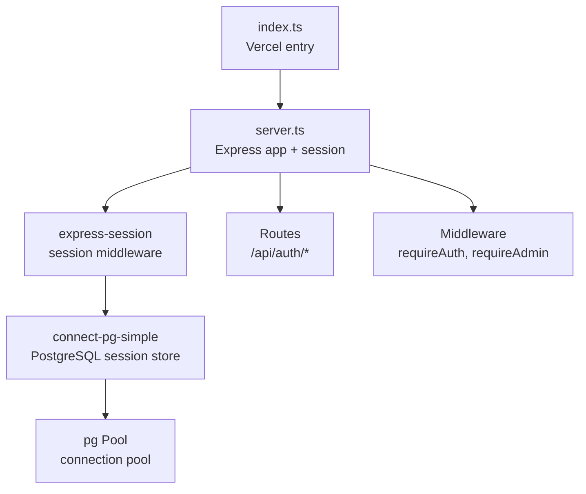
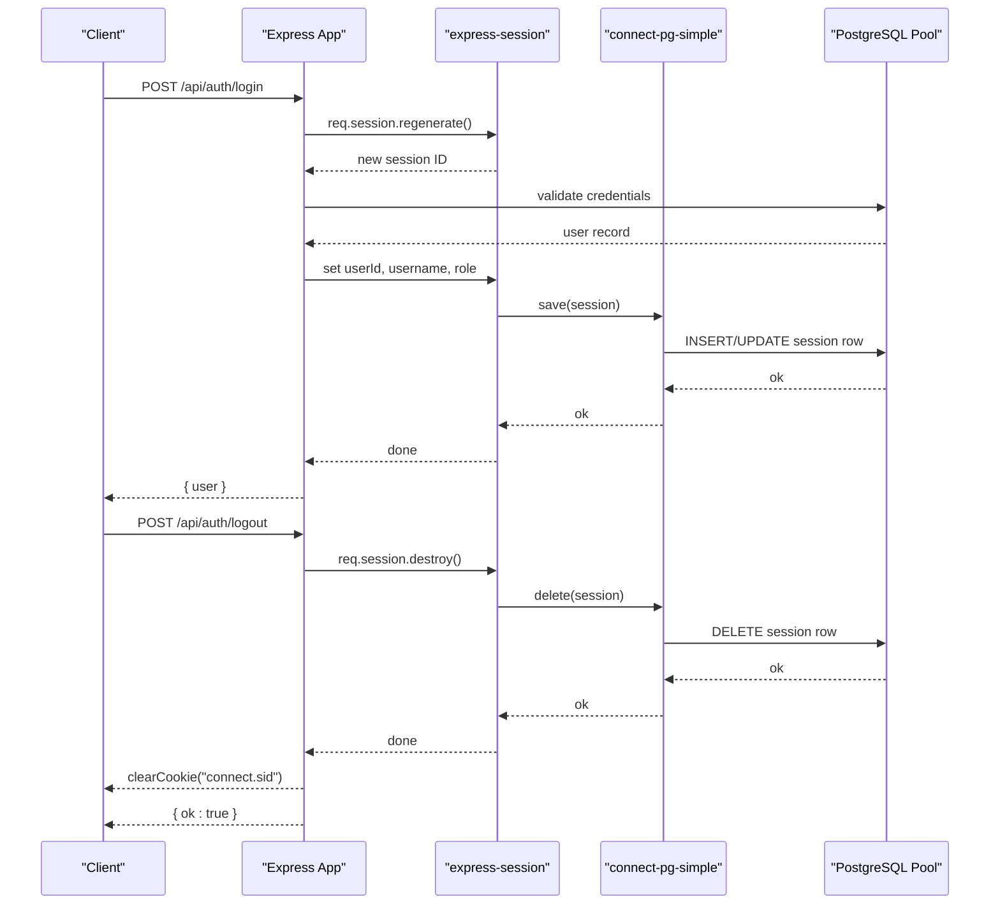
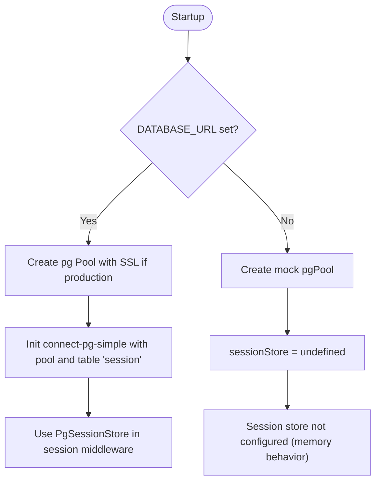
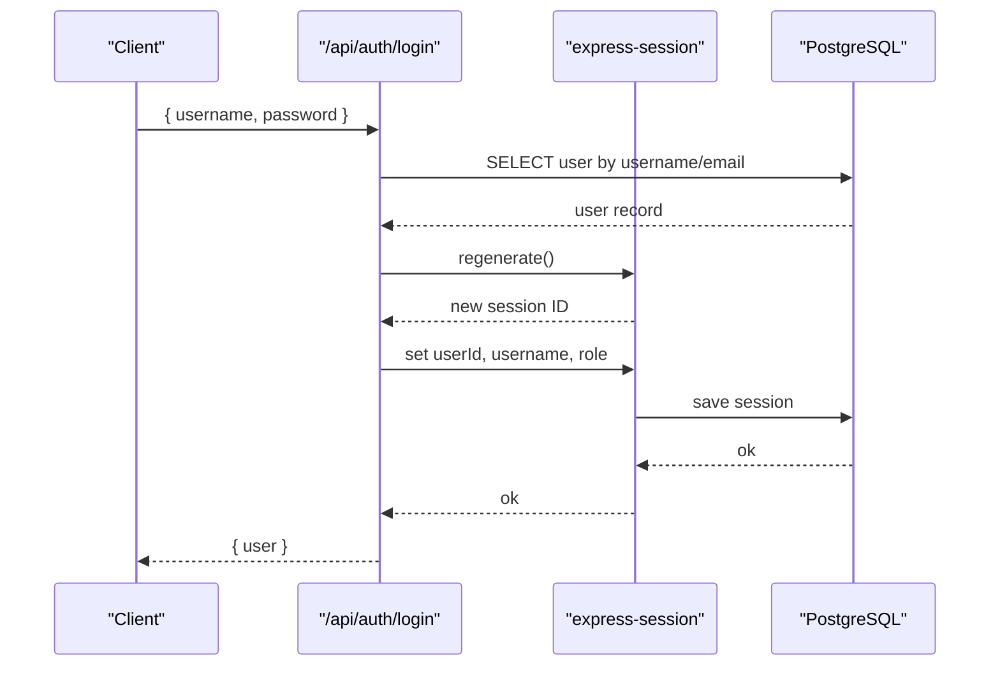
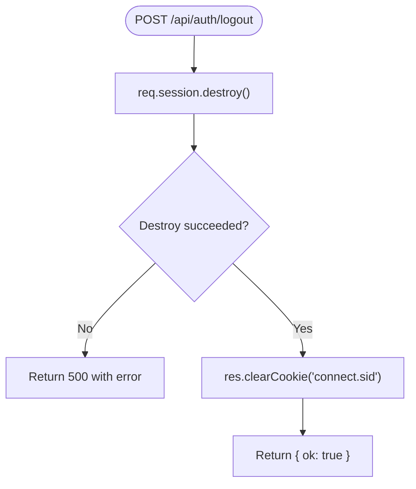
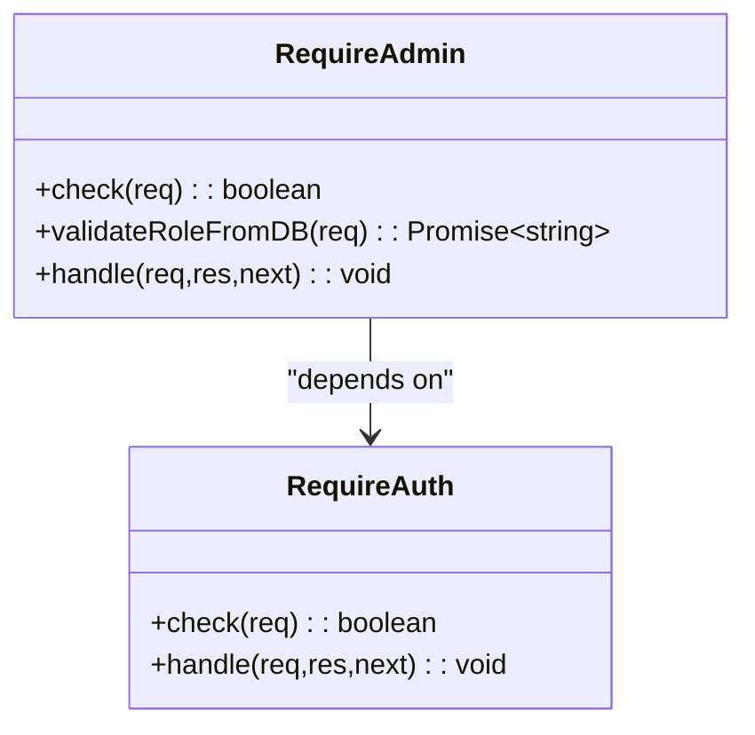
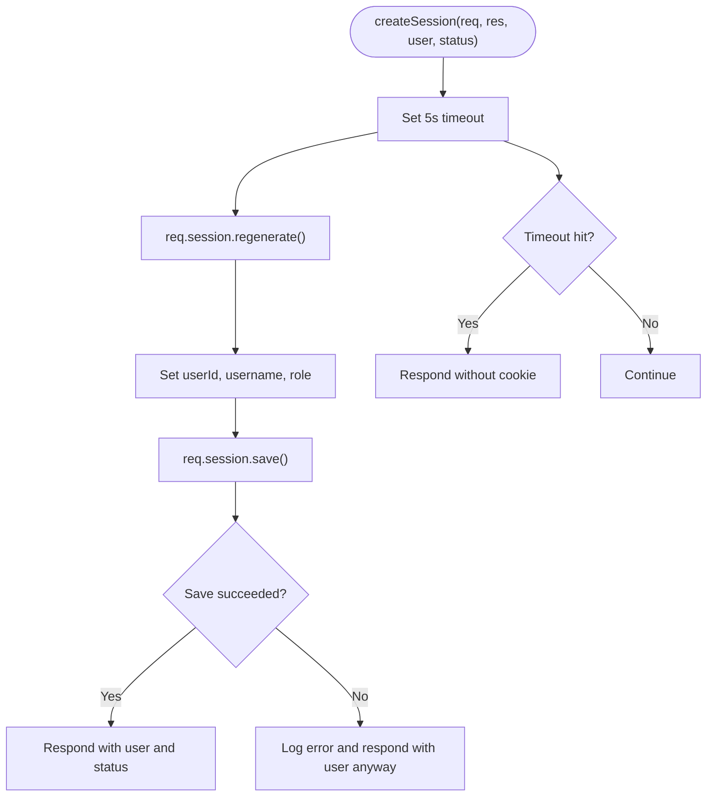
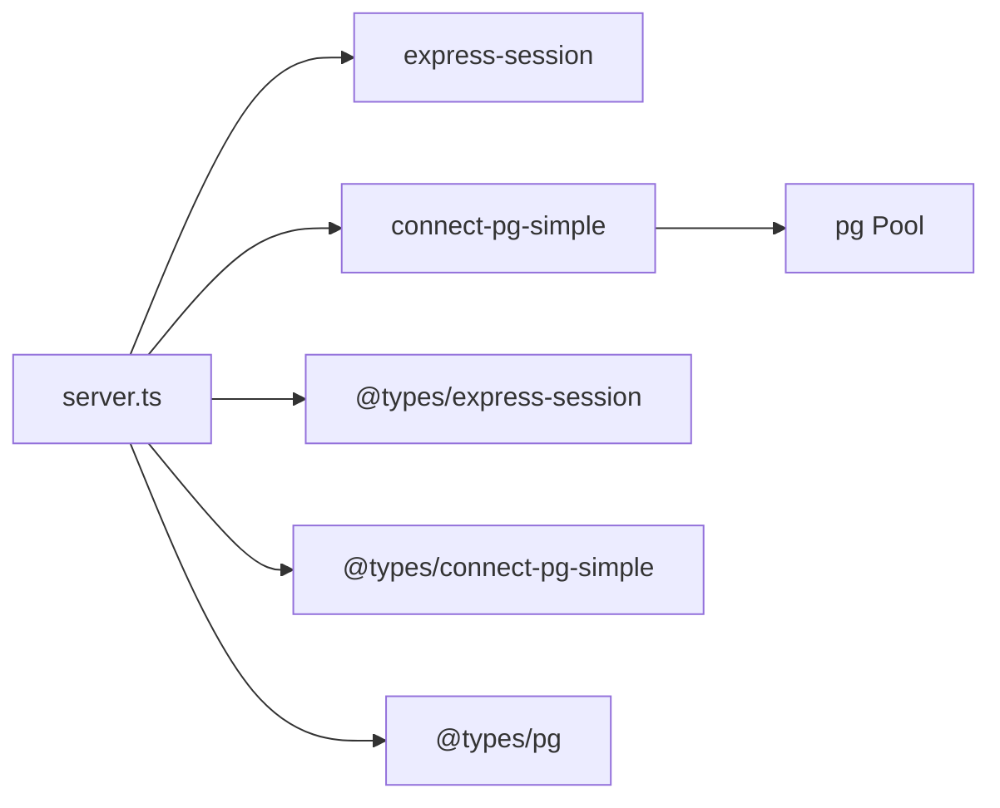

# Session Management

<cite>
**Referenced Files in This Document**
- [server.ts](file://server.ts)
- [index.ts](file://index.ts)
- [package.json](file://package.json)
</cite>

## Table of Contents
1. [Introduction](#introduction)
2. [Project Structure](#project-structure)
3. [Core Components](#core-components)
4. [Architecture Overview](#architecture-overview)
5. [Detailed Component Analysis](#detailed-component-analysis)
6. [Dependency Analysis](#dependency-analysis)
7. [Performance Considerations](#performance-considerations)
8. [Troubleshooting Guide](#troubleshooting-guide)
9. [Conclusion](#conclusion)

## Introduction
This document explains the session management implementation for the application, focusing on:
- The /api/auth/logout endpoint for terminating sessions and cleaning cookies
- express-session configuration with PostgreSQL storage via connect-pg-simple
- Security settings: httpOnly cookies, secure flag in production, SameSite configuration, and 7-day expiration
- Session data structure containing userId, username, and role fields
- Session regeneration on authentication events to prevent fixation attacks
- Middleware functions requireAuth and requireAdmin for protecting routes
- Examples of session usage patterns, error handling for persistence failures, and debugging techniques
- Session store configuration, PostgreSQL connection pooling, and fallback behavior in development

## Project Structure
Session-related logic is implemented primarily in the server entrypoint and initialization files:
- server.ts: Express app setup, session middleware, auth endpoints, and route protection
- index.ts: Vercel serverless entry that initializes database tables and exports the Express app
- package.json: Declares dependencies including express-session, connect-pg-simple, pg, and related types

**Diagram sources**
- [index.ts:1-20](file://index.ts#L1-L20)
- [server.ts:18-125](file://server.ts#L18-L125)
- [server.ts:24-34](file://server.ts#L24-L34)
- [server.ts:112-125](file://server.ts#L112-L125)

**Section sources**
- [index.ts:1-20](file://index.ts#L1-L20)
- [server.ts:18-125](file://server.ts#L18-L125)
- [package.json:28-33](file://package.json#L28-L33)

## Core Components
- Session middleware configuration with express-session
- PostgreSQL-backed session store using connect-pg-simple
- Authentication endpoints (/api/auth/login, /api/auth/register, /api/auth/logout)
- Route protection middleware (requireAuth, requireAdmin)
- Shared helper for creating sessions safely with timeouts

Key behaviors:
- Sessions are stored in PostgreSQL when DATABASE_URL is set; otherwise, a mock pool is used and no persistent session store is configured
- Cookie security flags are set based on environment
- Session IDs are regenerated on login/register to mitigate fixation attacks
- Role checks can be revalidated against the database on protected routes

**Section sources**
- [server.ts:24-34](file://server.ts#L24-L34)
- [server.ts:112-125](file://server.ts#L112-L125)
- [server.ts:209-235](file://server.ts#L209-L235)
- [server.ts:340-392](file://server.ts#L340-L392)
- [server.ts:547-591](file://server.ts#L547-L591)

## Architecture Overview
The session architecture integrates Express, express-session, and connect-pg-simple with a PostgreSQL pool. Requests flow through session middleware, which attaches session data to the request object. Protected routes use middleware to enforce authentication and authorization.

**Diagram sources**
- [server.ts:340-392](file://server.ts#L340-L392)
- [server.ts:24-34](file://server.ts#L24-L34)
- [server.ts:112-125](file://server.ts#L112-L125)

## Detailed Component Analysis

### Session Store Configuration and PostgreSQL Pooling
- When DATABASE_URL is present, a pg Pool is created with SSL enabled in production
- connect-pg-simple is initialized with the pool, table name "session", and auto-create enabled
- If DATABASE_URL is missing, a mock pgPool is provided and sessionStore remains undefined, effectively falling back to memory-based behavior

**Diagram sources**
- [server.ts:24-34](file://server.ts#L24-L34)
- [server.ts:36-76](file://server.ts#L36-L76)

**Section sources**
- [server.ts:24-34](file://server.ts#L24-L34)
- [server.ts:36-76](file://server.ts#L36-L76)

### Session Middleware and Cookie Security
- express-session is mounted with:
  - secret from SESSION_SECRET env or a development fallback
  - resave: false, saveUninitialized: false
  - cookie options:
    - httpOnly: true
    - secure: true only in production
    - sameSite: "lax"
    - maxAge: 7 days (in milliseconds)

These settings ensure:
- Cookies are inaccessible to client-side scripts
- Secure transmission over HTTPS in production
- Cross-site request behavior controlled by SameSite
- Long-lived sessions with 7-day expiration

**Section sources**
- [server.ts:107-125](file://server.ts#L107-L125)

### Session Data Structure
- SessionData is extended to include:
  - userId: number
  - username: string
  - role: string

These fields are populated after successful authentication and used by middleware and endpoints to determine identity and permissions.

**Section sources**
- [server.ts:99-105](file://server.ts#L99-L105)
- [server.ts:361-376](file://server.ts#L361-L376)
- [server.ts:318-333](file://server.ts#L318-L333)

### Authentication Endpoints and Session Regeneration
- /api/auth/login:
  - Validates credentials
  - Regenerates session to prevent fixation
  - Sets userId, username, role
  - Persists session and returns user info
- /api/auth/register:
  - Creates user
  - Regenerates session
  - Sets session fields and persists
- /api/auth/logout:
  - Destroys session
  - Clears the connect.sid cookie
  - Returns success

**Diagram sources**
- [server.ts:340-381](file://server.ts#L340-L381)
- [server.ts:318-333](file://server.ts#L318-L333)

**Section sources**
- [server.ts:340-381](file://server.ts#L340-L381)
- [server.ts:318-333](file://server.ts#L318-L333)
- [server.ts:383-392](file://server.ts#L383-L392)

### Logout Endpoint: Session Termination and Cookie Cleanup
- POST /api/auth/logout:
  - Calls req.session.destroy() to remove session from store
  - Clears the connect.sid cookie
  - Returns { ok: true }
  - Handles errors and logs them

**Diagram sources**
- [server.ts:383-392](file://server.ts#L383-L392)

**Section sources**
- [server.ts:383-392](file://server.ts#L383-L392)

### Middleware Functions: requireAuth and requireAdmin
- requireAuth:
  - Checks req.session.userId
  - Returns 401 if not authenticated
- requireAdmin:
  - Ensures user is authenticated
  - Re-validates role from the database for immediate effect
  - Updates session.role with current role
  - Returns 403 if not admin, 500 on DB errors

**Diagram sources**
- [server.ts:209-235](file://server.ts#L209-L235)

**Section sources**
- [server.ts:209-235](file://server.ts#L209-L235)

### Shared Session Creation Helper
- createSession:
  - Wraps session regeneration and persistence in a Promise
  - Includes a 5-second timeout guard to avoid hanging responses
  - On save errors, still returns user data but logs the issue
  - Used by multiple auth flows to standardize session creation

**Diagram sources**
- [server.ts:547-591](file://server.ts#L547-L591)

**Section sources**
- [server.ts:547-591](file://server.ts#L547-L591)

### Usage Patterns and Protected Routes
- Protected endpoints use requireAuth and/or requireAdmin:
  - Examples include CRM operations, LMS endpoints, chatbot leads, and orchestrator calls
- Typical pattern:
  - Apply middleware before handler
  - Handler assumes req.session.userId exists
  - Admin-only endpoints re-check role from DB

**Section sources**
- [server.ts:1964-1988](file://server.ts#L1964-L1988)
- [server.ts:3316-3379](file://server.ts#L3316-L3379)
- [server.ts:3490-3565](file://server.ts#L3490-L3565)
- [server.ts:4836-4867](file://server.ts#L4836-L4867)
- [server.ts:4972](file://server.ts#L4972)

## Dependency Analysis
Dependencies relevant to session management:
- express-session: Provides session middleware and cookie handling
- connect-pg-simple: Bridges express-session to PostgreSQL
- pg: Connection pooling and query execution
- @types packages for TypeScript support

**Diagram sources**
- [package.json:28-33](file://package.json#L28-L33)
- [package.json:48-54](file://package.json#L48-L54)

**Section sources**
- [package.json:28-33](file://package.json#L28-L33)
- [package.json:48-54](file://package.json#L48-L54)

## Performance Considerations
- Connection pooling:
  - PostgreSQL connections are expensive; pooling reduces overhead
  - Ensure pool size aligns with CPU cores and workload
- Session persistence:
  - Database writes occur on session save; consider caching strategies if needed
  - Timeouts protect against unresponsive stores
- Production hardening:
  - Enable secure cookies only over HTTPS
  - Use strong SESSION_SECRET values
  - Monitor session store performance and DB load

[No sources needed since this section provides general guidance]

## Troubleshooting Guide
Common issues and debugging steps:
- Session not persisting:
  - Verify DATABASE_URL is set and accessible
  - Confirm connect-pg-simple is initialized and table "session" exists
  - Check logs for session save errors
- Cookie not sent:
  - Ensure secure flag matches HTTPS usage
  - Validate SameSite setting for cross-site requests
  - Inspect browser DevTools for cookie attributes
- Authentication bypass:
  - Confirm requireAuth/requireAdmin are applied to routes
  - Re-validate roles from DB where necessary
- Memory fallback behavior:
  - Without DATABASE_URL, sessionStore is undefined; sessions may not persist across processes
  - Use proper environment variables in production

Debugging techniques:
- Log session regeneration and save callbacks
- Inspect response headers for Set-Cookie
- Query the "session" table directly to verify persistence
- Use console logs around middleware and endpoints

**Section sources**
- [server.ts:36-76](file://server.ts#L36-L76)
- [server.ts:112-125](file://server.ts#L112-L125)
- [server.ts:547-591](file://server.ts#L547-L591)

## Conclusion
The session management system leverages express-session with PostgreSQL-backed persistence via connect-pg-simple, providing secure cookie handling, robust authentication flows, and flexible middleware for route protection. Proper configuration of environment variables ensures secure and scalable operation across environments. Debugging tools and error handling improve reliability and maintainability.

[No sources needed since this section summarizes without analyzing specific files]