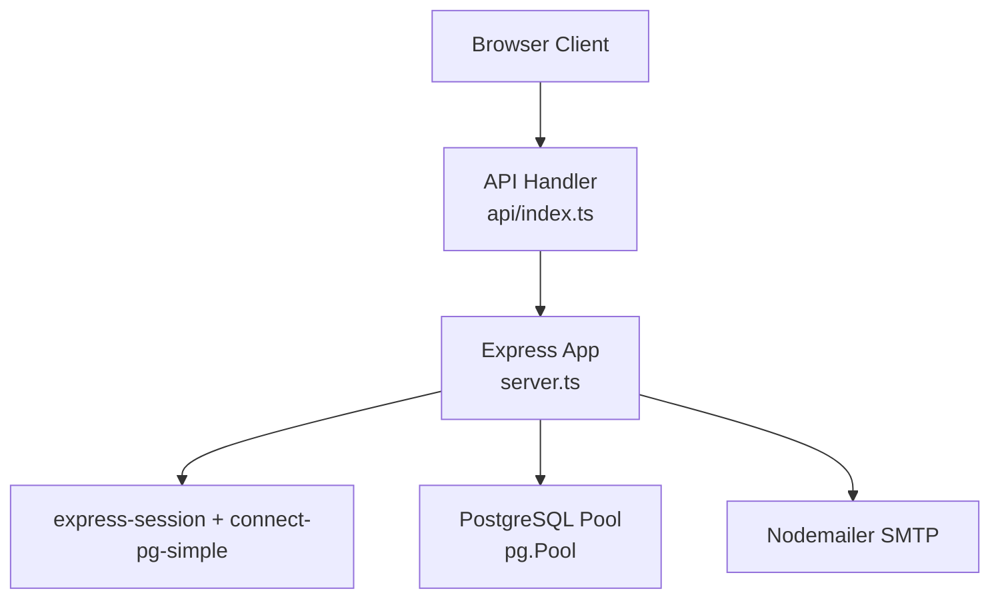
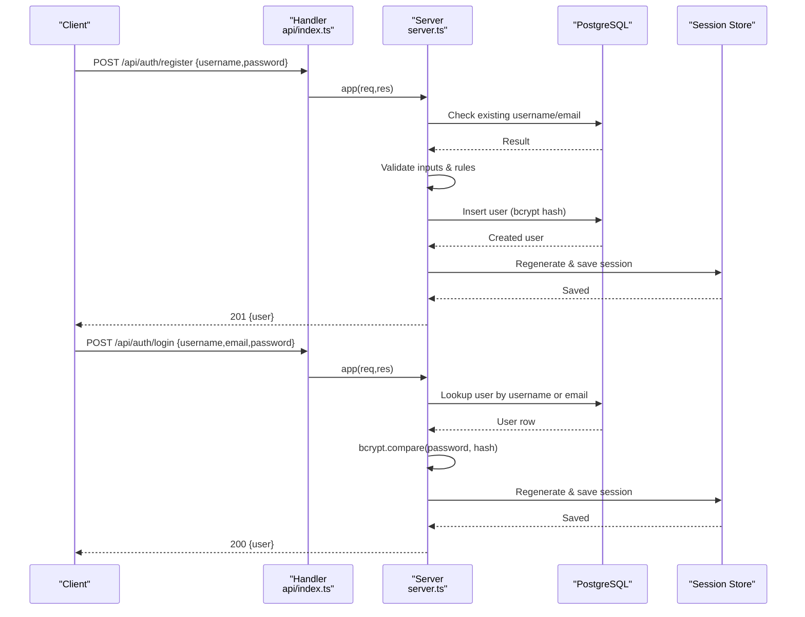
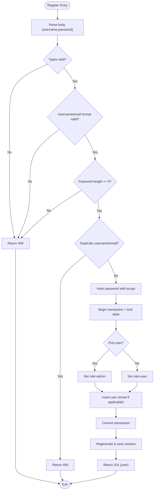
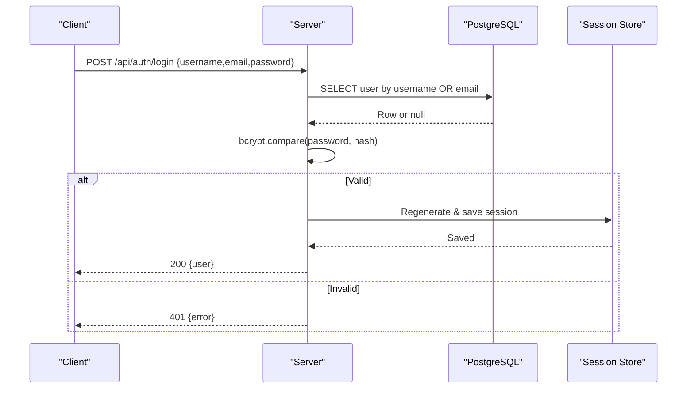
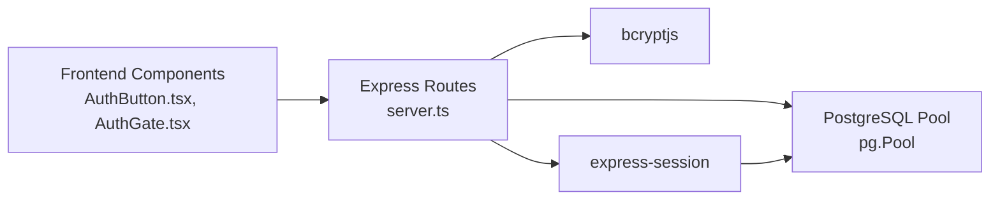

# Username/Password Authentication

<cite>
**Referenced Files in This Document**
- [server.ts](file://server.ts)
- [api/index.ts](file://api/index.ts)
- [AuthButton.tsx](file://src/components/AuthButton.tsx)
- [AuthGate.tsx](file://src/components/AuthGate.tsx)
</cite>

## Table of Contents
1. Introduction
2. Project Structure
3. Core Components
4. Architecture Overview
5. Detailed Component Analysis
6. Dependency Analysis
7. Performance Considerations
8. Troubleshooting Guide
9. Conclusion
10. Appendices

## Introduction
This document provides detailed API documentation for the username/password authentication endpoints:
- POST /api/auth/register: User registration with username/password validation, duplicate detection, bcrypt hashing, and session creation.
- POST /api/auth/login: Authentication supporting both usernames and email addresses, bcrypt verification, and session creation.

It includes request/response schemas, HTTP status codes, security considerations (timing attack prevention), and practical examples using curl and JavaScript fetch.

## Project Structure
The authentication endpoints are implemented in the Express server and exposed via a Vercel/Node handler. The frontend components call these endpoints to perform login and registration flows.

**Diagram sources**
- [api/index.ts:1-5](file://api/index.ts#L1-L5)
- [server.ts:18-125](file://server.ts#L18-L125)

**Section sources**
- [api/index.ts:1-5](file://api/index.ts#L1-L5)
- [server.ts:18-125](file://server.ts#L18-L125)

## Core Components
- Registration endpoint: validates input, checks duplicates, hashes password with bcrypt, creates user, initializes session, returns 201 on success.
- Login endpoint: accepts username or email, verifies password with bcrypt, creates session, returns 200 on success.
- Session management: uses express-session with PostgreSQL storage via connect-pg-simple; cookie configured with httpOnly, secure (production), sameSite lax, and maxAge.
- Database schema: users table with id, username (unique), password_hash, role, created_at; optional email and neon_auth_id columns added via migration.

Key implementation references:
- Input validation and regex for username/email format
- Duplicate check across username and email
- bcrypt hashing and comparison
- Transactional user creation with first-user admin assignment
- Session regeneration and persistence

**Section sources**
- [server.ts:266-338](file://server.ts#L266-L338)
- [server.ts:340-381](file://server.ts#L340-L381)
- [server.ts:112-125](file://server.ts#L112-L125)
- [server.ts:3430-3444](file://server.ts#L3430-L3444)

## Architecture Overview
The authentication flow is handled by Express routes that interact with PostgreSQL for data operations and use bcrypt for password hashing. Sessions are stored in PostgreSQL via connect-pg-simple.

**Diagram sources**
- [api/index.ts:1-5](file://api/index.ts#L1-L5)
- [server.ts:266-338](file://server.ts#L266-L338)
- [server.ts:340-381](file://server.ts#L340-L381)
- [server.ts:112-125](file://server.ts#L112-L125)

## Detailed Component Analysis

### Endpoint: POST /api/auth/register
- Purpose: Create a new user account with username/password.
- Request body:
  - username: string, 3–64 characters, allowed characters include letters, numbers, . _ - @ (also supports email format).
  - password: string, minimum length 8.
- Validation:
  - Type checks for username and password.
  - Regex validation for username/email format.
  - Password length check.
  - Duplicate username/email detection.
- Processing:
  - If username looks like an email, store it also in the email column.
  - Hash password with bcrypt (cost factor 12).
  - First registered user becomes admin; others get role "user".
  - Use transaction with table lock to avoid race conditions during first registration.
- Response:
  - 201 Created: { user: { id, username, role } }
  - 400 Bad Request: validation errors
  - 409 Conflict: duplicate username/email
  - 500 Internal Server Error: unexpected error

**Diagram sources**
- [server.ts:266-338](file://server.ts#L266-L338)

**Section sources**
- [server.ts:266-338](file://server.ts#L266-L338)

### Endpoint: POST /api/auth/login
- Purpose: Authenticate user with username or email and password.
- Request body:
  - username: string (accepts username or email)
  - password: string
- Processing:
  - Lookup user by username or email (case-insensitive email match).
  - Always run bcrypt.compare against a valid or invalid hash to prevent timing-based enumeration.
  - On success, regenerate and save session.
- Response:
  - 200 OK: { user: { id, username, role } }
  - 400 Bad Request: missing fields
  - 401 Unauthorized: invalid credentials
  - 500 Internal Server Error: unexpected error

**Diagram sources**
- [server.ts:340-381](file://server.ts#L340-L381)

**Section sources**
- [server.ts:340-381](file://server.ts#L340-L381)

### Session Management
- Middleware: express-session configured with secret, httpOnly cookie, secure flag in production, sameSite lax, maxAge 7 days.
- Storage: connect-pg-simple stores sessions in PostgreSQL table "session" (auto-created if missing).
- Security: session regenerated after successful auth to prevent fixation.

**Section sources**
- [server.ts:112-125](file://server.ts#L112-L125)
- [server.ts:24-34](file://server.ts#L24-L34)

### Database Schema
- users table:
  - id SERIAL PRIMARY KEY
  - username VARCHAR(32) NOT NULL UNIQUE
  - password_hash TEXT NOT NULL DEFAULT ''
  - role VARCHAR(20) NOT NULL DEFAULT 'user'
  - created_at TIMESTAMP NOT NULL DEFAULT NOW()
  - email VARCHAR(255) UNIQUE (added via migration)
  - neon_auth_id TEXT UNIQUE (added via migration)
- password_reset_tokens table used by reset flows (not part of core register/login but relevant for overall auth).

**Section sources**
- [server.ts:3430-3444](file://server.ts#L3430-L3444)

## Dependency Analysis
- Express app initialization and middleware setup.
- PostgreSQL pool configuration and usage for queries.
- bcryptjs for password hashing and comparison.
- express-session and connect-pg-simple for session persistence.
- Frontend components calling endpoints for login/register flows.

**Diagram sources**
- [server.ts:1-15](file://server.ts#L1-L15)
- [server.ts:112-125](file://server.ts#L112-L125)
- [AuthButton.tsx:117-135](file://src/components/AuthButton.tsx#L117-L135)
- [AuthGate.tsx:56-70](file://src/components/AuthGate.tsx#L56-L70)

**Section sources**
- [server.ts:1-15](file://server.ts#L1-L15)
- [server.ts:112-125](file://server.ts#L112-L125)
- [AuthButton.tsx:117-135](file://src/components/AuthButton.tsx#L117-L135)
- [AuthGate.tsx:56-70](file://src/components/AuthGate.tsx#L56-L70)

## Performance Considerations
- bcrypt cost factor 12 balances security and performance; consider tuning based on server capacity.
- PostgreSQL connection pooling reduces overhead under load.
- Session regeneration avoids reuse of old session identifiers.
- Avoid unnecessary database calls; ensure proper indexing on frequently queried columns (e.g., username, email).

[No sources needed since this section provides general guidance]

## Troubleshooting Guide
Common issues and resolutions:
- Missing DATABASE_URL: server falls back to mock pgPool and MemoryStore; configure DATABASE_URL for real behavior.
- SESSION_SECRET not set: development fallback used; set SESSION_SECRET in production.
- Duplicate username/email: expect 409 response; choose different username or use email.
- Invalid credentials: expect 401; verify username/email and password.
- Session save failures: server may still return success but cookie might not be set; check session store connectivity.

**Section sources**
- [server.ts:35-77](file://server.ts#L35-L77)
- [server.ts:107-110](file://server.ts#L107-L110)
- [server.ts:266-338](file://server.ts#L266-L338)
- [server.ts:340-381](file://server.ts#L340-L381)

## Conclusion
The authentication system implements secure username/password registration and login with robust validation, bcrypt hashing, duplicate detection, and persistent sessions in PostgreSQL. It supports both usernames and emails for login, enforces strong password policies, and mitigates timing attacks through constant-time comparisons.

[No sources needed since this section summarizes without analyzing specific files]

## Appendices

### Request/Response Schemas

- POST /api/auth/register
  - Request:
    - username: string (3–64 chars, letters, numbers, . _ - @; email format supported)
    - password: string (min 8 chars)
  - Success Response (201):
    - user: object
      - id: number
      - username: string
      - role: string ("admin" or "user")
  - Error Responses:
    - 400: { error: string }
    - 409: { error: string }
    - 500: { error: string }

- POST /api/auth/login
  - Request:
    - username: string (username or email)
    - password: string
  - Success Response (200):
    - user: object
      - id: number
      - username: string
      - role: string
  - Error Responses:
    - 400: { error: string }
    - 401: { error: string }
    - 500: { error: string }

**Section sources**
- [server.ts:266-338](file://server.ts#L266-L338)
- [server.ts:340-381](file://server.ts#L340-L381)

### Practical Examples

- Register with curl:
  - curl -X POST https://your-domain/api/auth/register -H "Content-Type: application/json" -d '{"username":"alice","password":"securepass123"}'
  - Expected: 201 with user object

- Login with curl:
  - curl -X POST https://your-domain/api/auth/login -H "Content-Type: application/json" -d '{"username":"alice@example.com","password":"securepass123"}'
  - Expected: 200 with user object

- Register with JavaScript fetch:
  - fetch('/api/auth/register', { method: 'POST', headers: { 'Content-Type': 'application/json' }, body: JSON.stringify({ username: 'bob', password: 'strongpass123' }) }).then(r => r.json()).then(console.log)

- Login with JavaScript fetch:
  - fetch('/api/auth/login', { method: 'POST', headers: { 'Content-Type': 'application/json' }, body: JSON.stringify({ username: 'bob@example.com', password: 'strongpass123' }) }).then(r => r.json()).then(console.log)

**Section sources**
- [AuthButton.tsx:117-135](file://src/components/AuthButton.tsx#L117-L135)
- [AuthGate.tsx:56-70](file://src/components/AuthGate.tsx#L56-L70)

### Security Considerations
- Timing attack prevention: bcrypt.compare always runs against a valid or invalid hash to avoid leaking existence information.
- Password hashing: bcrypt with cost factor 12 ensures strong hashing.
- Session security: httpOnly cookies, secure flag in production, sameSite lax, and session regeneration after auth.
- Duplicate detection: prevents multiple accounts with same username or email.

**Section sources**
- [server.ts:340-381](file://server.ts#L340-L381)
- [server.ts:112-125](file://server.ts#L112-L125)