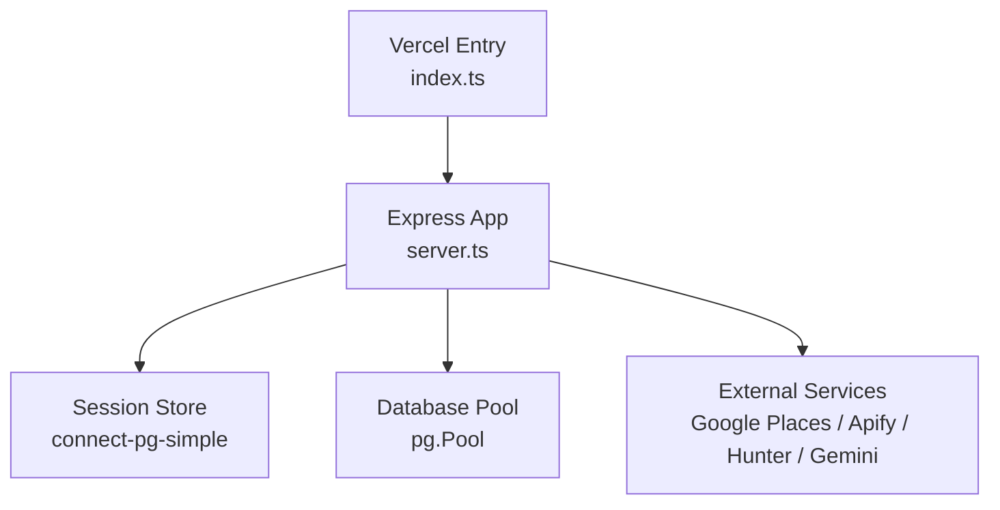
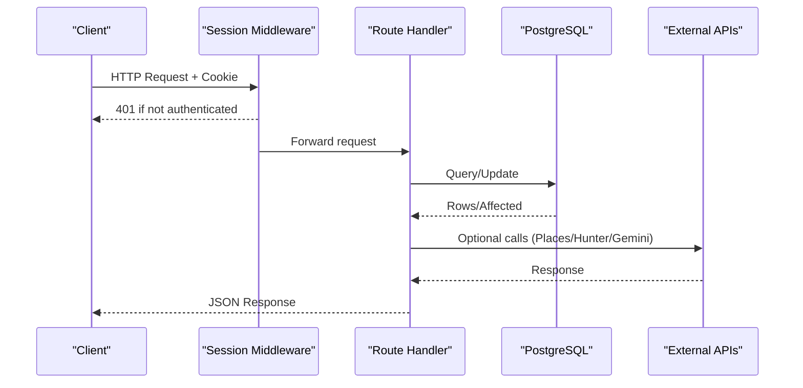
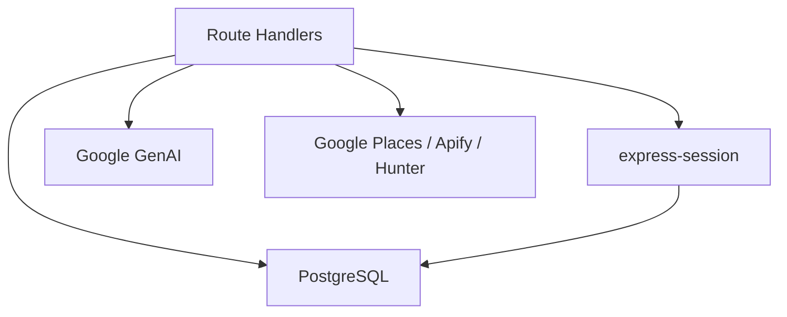
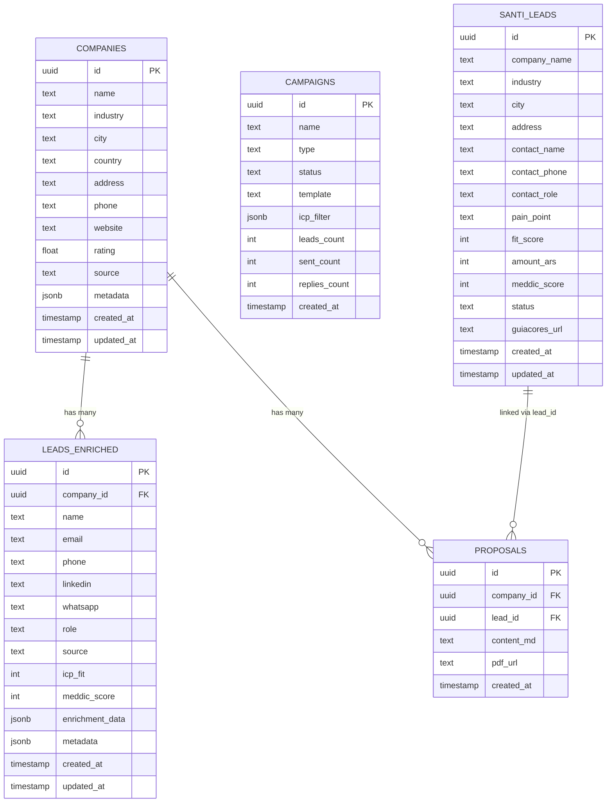

# Data Management API

<cite>
**Referenced Files in This Document**
- [server.ts](file://server.ts)
- [index.ts](file://index.ts)
- [api/index.ts](file://api/index.ts)
- [src/types.ts](file://src/types.ts)
- [src/agents/types.ts](file://src/agents/types.ts)
</cite>

## Table of Contents
1. Introduction
2. Project Structure
3. Core Components
4. Architecture Overview
5. Detailed Component Analysis
6. Dependency Analysis
7. Performance Considerations
8. Troubleshooting Guide
9. Conclusion
10. Appendices

## Introduction
This document provides comprehensive API documentation for data management endpoints covering CRM entities: leads, companies, contacts (enriched leads), campaigns, and templates. It includes authentication using session-based auth, request/response schemas, validation rules, business logic constraints, pagination, filtering, bulk operations, and error handling strategies. Practical examples with curl and JavaScript fetch are provided where applicable.

## Project Structure
The server is an Express application that registers all API routes at module level. The Vercel serverless entry point initializes database tables and exports the Express app.

**Diagram sources**
- [index.ts:12-19](file://index.ts#L12-L19)
- [server.ts:18-35](file://server.ts#L18-L35)

**Section sources**
- [index.ts:1-19](file://index.ts#L1-L19)
- [server.ts:18-35](file://server.ts#L18-L35)

## Core Components
- Authentication and Session Management:
  - POST /api/auth/register
  - POST /api/auth/login
  - POST /api/auth/logout
  - GET /api/auth/me
  - POST /api/auth/neon-register
  - POST /api/auth/neon-login
  - POST /api/auth/forgot-password
  - POST /api/auth/reset-password
- Companies CRUD:
  - GET /api/companies
  - POST /api/companies
  - GET /api/companies/:id
  - PATCH /api/companies/:id
- Leads Enriched:
  - GET /api/leads-enriched
  - POST /api/leads-enriched
  - PATCH /api/leads-enriched/:id
- Campaigns:
  - GET /api/campaigns
  - POST /api/campaigns
  - PATCH /api/campaigns/:id
  - DELETE /api/campaigns/:id
- Proposals:
  - GET /api/proposals
  - POST /api/proposals
- SDR Lead Ingestion and Consumption (Santi):
  - POST /api/leads (requireAuth)
  - GET /api/leads (requireApiKey)
  - PATCH /api/leads/:id (requireApiKey)
  - POST /api/leads/:id/notes (requireApiKey)
  - POST /api/leads/:id/brochure (requireAuth)
  - GET /api/leads/:id/brochure (requireApiKey)
- AI Orchestration and Metrics:
  - POST /api/orchestrator (requireAuth)
  - GET /api/orchestrator/metrics

Authentication mechanisms:
- Session-based auth via express-session with PostgreSQL store.
- Admin-only actions protected by requireAdmin middleware.
- Server-to-server API key protection via requireApiKey middleware.
- Webhook token protection via requireCrmToken middleware.

**Section sources**
- [server.ts:112-125](file://server.ts#L112-L125)
- [server.ts:209-235](file://server.ts#L209-L235)
- [server.ts:240-264](file://server.ts#L240-L264)
- [server.ts:266-392](file://server.ts#L266-L392)
- [server.ts:594-748](file://server.ts#L594-L748)
- [server.ts:753-830](file://server.ts#L753-L830)
- [server.ts:832-851](file://server.ts#L832-L851)
- [server.ts:4529-4621](file://server.ts#L4529-L4621)
- [server.ts:4625-4691](file://server.ts#L4625-L4691)
- [server.ts:4734-4797](file://server.ts#L4734-L4797)
- [server.ts:4695-4730](file://server.ts#L4695-L4730)
- [server.ts:4832-4888](file://server.ts#L4832-L4888)
- [server.ts:4895-4969](file://server.ts#L4895-L4969)
- [server.ts:4972-5085](file://server.ts#L4972-L5085)
- [server.ts:4236-4266](file://server.ts#L4236-L4266)

## Architecture Overview
The API uses a layered approach:
- Middleware layer handles authentication, authorization, and input parsing.
- Route handlers implement business logic and interact with the database.
- External integrations include Google Places, Apify scrapers, Hunter.io enrichment, and Gemini AI.

**Diagram sources**
- [server.ts:112-125](file://server.ts#L112-L125)
- [server.ts:209-235](file://server.ts#L209-L235)
- [server.ts:4529-4621](file://server.ts#L4529-L4621)

## Detailed Component Analysis

### Authentication Endpoints
- POST /api/auth/register
  - Method: POST
  - URL: /api/auth/register
  - Auth: None
  - Request body: { username: string, password: string }
  - Validation:
    - username must match pattern letters/numbers/._-@ and length 3–64
    - password minimum 8 characters
  - Business logic:
    - Prevent duplicate username/email
    - First user becomes admin; others become user
  - Response: 201 with { user: { id, username, role } }
  - Errors: 400, 409, 500

- POST /api/auth/login
  - Method: POST
  - URL: /api/auth/login
  - Auth: None
  - Request body: { username: string, password: string }
  - Validation: both fields required
  - Business logic: bcrypt compare; session created on success
  - Response: 200 with { user: { id, username, role } }
  - Errors: 400, 401, 500

- POST /api/auth/logout
  - Method: POST
  - URL: /api/auth/logout
  - Auth: Required (session)
  - Response: 200 { ok: true }
  - Errors: 500

- GET /api/auth/me
  - Method: GET
  - URL: /api/auth/me
  - Auth: Required (session)
  - Response: 200 { user: { id, username, role } }
  - Errors: 401, 500

- POST /api/auth/neon-register
  - Method: POST
  - URL: /api/auth/neon-register
  - Auth: None
  - Request body: { email: string, password: string, name?: string }
  - Validation: email format, password min 8 chars
  - Business logic: Proxies to Neon Auth or local fallback; upserts local user; creates session
  - Response: 201 or 200 depending on flow
  - Errors: 400, 401, 403, 409, 500

- POST /api/auth/neon-login
  - Method: POST
  - URL: /api/auth/neon-login
  - Auth: None
  - Request body: { email: string, password: string }
  - Validation: both fields required
  - Business logic: Local bcrypt first; fallback to Neon Auth; upserts local user; creates session
  - Response: 200 { user: ... }
  - Errors: 400, 401, 403, 500

- POST /api/auth/forgot-password
  - Method: POST
  - URL: /api/auth/forgot-password
  - Auth: None
  - Request body: { email: string }
  - Validation: email format
  - Business logic: Generates secure reset token, stores hash, sends email
  - Response: 200 { ok: true, message: ... }
  - Errors: 400, 500

- POST /api/auth/reset-password
  - Method: POST
  - URL: /api/auth/reset-password
  - Auth: None
  - Request body: { token: string, newPassword: string }
  - Validation: token length >= 32; password min 8 chars
  - Business logic: Validates token hash, updates password, invalidates sessions
  - Response: 200 { ok: true, message: ... }
  - Errors: 400, 500

Practical examples:
- curl register:
  - curl -X POST https://your-domain/api/auth/register -H "Content-Type: application/json" -d '{"username":"user@example.com","password":"securepass123"}'
- curl login:
  - curl -X POST https://your-domain/api/auth/login -H "Content-Type: application/json" -d '{"username":"user@example.com","password":"securepass123"}' -c cookies.txt
- curl logout:
  - curl -X POST https://your-domain/api/auth/logout -b cookies.txt
- curl me:
  - curl -X GET https://your-domain/api/auth/me -b cookies.txt
- curl neon-register:
  - curl -X POST https://your-domain/api/auth/neon-register -H "Content-Type: application/json" -d '{"email":"user@example.com","password":"securepass123","name":"User Name"}'
- curl neon-login:
  - curl -X POST https://your-domain/api/auth/neon-login -H "Content-Type: application/json" -d '{"email":"user@example.com","password":"securepass123"}' -c cookies.txt
- curl forgot-password:
  - curl -X POST https://your-domain/api/auth/forgot-password -H "Content-Type: application/json" -d '{"email":"user@example.com"}'
- curl reset-password:
  - curl -X POST https://your-domain/api/auth/reset-password -H "Content-Type: application/json" -d '{"token":"long-token-here","newPassword":"securepass123"}'

JavaScript fetch examples:
- Login:
  - fetch('/api/auth/login', { method: 'POST', headers: { 'Content-Type': 'application/json' }, credentials: 'include', body: JSON.stringify({ username: 'user@example.com', password: 'securepass123' }) }).then(r => r.json()).then(console.log)
- Me:
  - fetch('/api/auth/me', { method: 'GET', credentials: 'include' }).then(r => r.json()).then(console.log)

**Section sources**
- [server.ts:266-338](file://server.ts#L266-L338)
- [server.ts:340-381](file://server.ts#L340-L381)
- [server.ts:383-392](file://server.ts#L383-L392)
- [server.ts:832-851](file://server.ts#L832-L851)
- [server.ts:594-680](file://server.ts#L594-L680)
- [server.ts:683-748](file://server.ts#L683-L748)
- [server.ts:753-791](file://server.ts#L753-L791)
- [server.ts:795-830](file://server.ts#L795-L830)

### Companies CRUD
- GET /api/companies
  - Method: GET
  - URL: /api/companies
  - Auth: None (public listing)
  - Query params: status?, industry?, city?, limit? (default 50, max 200), offset? (default 0)
  - Filtering:
    - status exact match
    - industry substring match
    - city substring match
  - Pagination: limit and offset applied
  - Response: { companies: [...], total: number }
  - Errors: 500

- POST /api/companies
  - Method: POST
  - URL: /api/companies
  - Auth: None
  - Request body: { name: string, industry?: string, city?: string, country?: string, address?: string, phone?: string, website?: string, rating?: number, source?: string, metadata?: object }
  - Validation: name required
  - Business logic: Upsert by (name, city); updates optional fields if present
  - Response: company row
  - Errors: 400, 500

- GET /api/companies/:id
  - Method: GET
  - URL: /api/companies/:id
  - Auth: None
  - Response: { company: row, leads: [...] }
  - Errors: 404, 500

- PATCH /api/companies/:id
  - Method: PATCH
  - URL: /api/companies/:id
  - Auth: None
  - Request body: subset of { name, industry, city, country, address, phone, website, rating, status }
  - Validation: at least one field provided
  - Response: updated company row
  - Errors: 400, 500

Practical examples:
- curl list companies:
  - curl "https://your-domain/api/companies?industry=tech&city=buenos+aires&limit=20&offset=0"
- curl create company:
  - curl -X POST https://your-domain/api/companies -H "Content-Type: application/json" -d '{"name":"Acme Corp","industry":"Tech","city":"Buenos Aires","country":"Argentina"}'
- curl get company:
  - curl https://your-domain/api/companies/abc123
- curl update company:
  - curl -X PATCH https://your-domain/api/companies/abc123 -H "Content-Type: application/json" -d '{"rating":4.5}'

JavaScript fetch examples:
- List:
  - fetch('/api/companies?industry=tech&limit=20').then(r => r.json()).then(console.log)
- Create:
  - fetch('/api/companies', { method: 'POST', headers: { 'Content-Type': 'application/json' }, body: JSON.stringify({ name: 'Acme Corp', industry: 'Tech', city: 'Buenos Aires' }) }).then(r => r.json()).then(console.log)

**Section sources**
- [server.ts:4529-4558](file://server.ts#L4529-L4558)
- [server.ts:4560-4581](file://server.ts#L4560-L4581)
- [server.ts:4583-4595](file://server.ts#L4583-L4595)
- [server.ts:4597-4621](file://server.ts#L4597-L4621)

### Leads Enriched
- GET /api/leads-enriched
  - Method: GET
  - URL: /api/leads-enriched
  - Auth: None
  - Query params: company_id?, limit? (default 50)
  - Response: { leads: [...] }
  - Errors: 500

- POST /api/leads-enriched
  - Method: POST
  - URL: /api/leads-enriched
  - Auth: None
  - Request body: { company_id: string, name?: string, email?: string, phone?: string, linkedin?: string, whatsapp?: string, role?: string, source?: string, icp_fit?: number, meddic_score?: number, metadata?: object }
  - Validation: company_id required
  - Response: inserted lead row
  - Errors: 400, 500

- PATCH /api/leads-enriched/:id
  - Method: PATCH
  - URL: /api/leads-enriched/:id
  - Auth: None
  - Request body: { icp_fit?: number, meddic_score?: number, status?: string, meddic?: object }
  - Validation: at least one field provided
  - Business logic: Updates numeric fields and merges meddic into enrichment_data JSONB
  - Response: updated lead row
  - Errors: 400, 404, 500

Practical examples:
- curl list enriched leads:
  - curl "https://your-domain/api/leads-enriched?company_id=abc123&limit=20"
- curl create enriched lead:
  - curl -X POST https://your-domain/api/leads-enriched -H "Content-Type: application/json" -d '{"company_id":"abc123","name":"Jane Doe","email":"jane@example.com","icp_fit":85,"meddic_score":24}'
- curl update enriched lead:
  - curl -X PATCH https://your-domain/api/leads-enriched/lead123 -H "Content-Type: application/json" -d '{"status":"contacted","meddic":{"metrics":"Revenue growth"}}'

JavaScript fetch examples:
- Create:
  - fetch('/api/leads-enriched', { method: 'POST', headers: { 'Content-Type': 'application/json' }, body: JSON.stringify({ company_id: 'abc123', name: 'Jane Doe', email: 'jane@example.com' }) }).then(r => r.json()).then(console.log)

**Section sources**
- [server.ts:4625-4642](file://server.ts#L4625-L4642)
- [server.ts:4676-4691](file://server.ts#L4676-L4691)
- [server.ts:4644-4674](file://server.ts#L4644-L4674)

### Campaigns
- GET /api/campaigns
  - Method: GET
  - URL: /api/campaigns
  - Auth: None
  - Response: array of campaign summaries
  - Errors: 500

- POST /api/campaigns
  - Method: POST
  - URL: /api/campaigns
  - Auth: None
  - Request body: { name: string, type?: "email"|"whatsapp"|"linkedin", status?: "draft"|"active"|"paused"|"completed", template?: string, icp_filter?: object }
  - Validation: name required
  - Response: created campaign row (201)
  - Errors: 400, 500

- PATCH /api/campaigns/:id
  - Method: PATCH
  - URL: /api/campaigns/:id
  - Auth: None
  - Request body: subset of allowed fields (name, status, template, leads_count, sent_count, replies_count, icp_filter)
  - Validation: at least one field provided
  - Response: updated campaign row
  - Errors: 400, 404, 500

- DELETE /api/campaigns/:id
  - Method: DELETE
  - URL: /api/campaigns/:id
  - Auth: None
  - Response: { ok: true }
  - Errors: 500

Practical examples:
- curl create campaign:
  - curl -X POST https://your-domain/api/campaigns -H "Content-Type: application/json" -d '{"name":"Q4 Outreach","type":"email","status":"draft","template":"intro","icp_filter":{"industry":"Tech"}}'
- curl update campaign:
  - curl -X PATCH https://your-domain/api/campaigns/camp123 -H "Content-Type: application/json" -d '{"status":"active"}'
- curl delete campaign:
  - curl -X DELETE https://your-domain/api/campaigns/camp123

JavaScript fetch examples:
- Create:
  - fetch('/api/campaigns', { method: 'POST', headers: { 'Content-Type': 'application/json' }, body: JSON.stringify({ name: 'Q4 Outreach', type: 'email', status: 'draft' }) }).then(r => r.json()).then(console.log)

**Section sources**
- [server.ts:4734-4745](file://server.ts#L4734-L4745)
- [server.ts:4747-4761](file://server.ts#L4747-L4761)
- [server.ts:4763-4787](file://server.ts#L4763-L4787)
- [server.ts:4789-4797](file://server.ts#L4789-L4797)

### Proposals
- GET /api/proposals
  - Method: GET
  - URL: /api/proposals
  - Auth: None
  - Query params: company_id?, status?, limit? (default 20, max 100)
  - Response: { proposals: [...] }
  - Errors: 500

- POST /api/proposals
  - Method: POST
  - URL: /api/proposals
  - Auth: None
  - Request body: { company_id: string, lead_id?: string, content_md: string, pdf_url?: string }
  - Validation: company_id and content_md required
  - Response: inserted proposal row
  - Errors: 400, 500

Practical examples:
- curl create proposal:
  - curl -X POST https://your-domain/api/proposals -H "Content-Type: application/json" -d '{"company_id":"abc123","content_md":"Proposal content..."}'

JavaScript fetch examples:
- Create:
  - fetch('/api/proposals', { method: 'POST', headers: { 'Content-Type': 'application/json' }, body: JSON.stringify({ company_id: 'abc123', content_md: 'Proposal content...' }) }).then(r => r.json()).then(console.log)

**Section sources**
- [server.ts:4695-4714](file://server.ts#L4695-L4714)
- [server.ts:4716-4730](file://server.ts#L4716-L4730)

### SDR Leads (Santi)
- POST /api/leads (requireAuth)
  - Method: POST
  - URL: /api/leads
  - Auth: Session-based
  - Request body: { company_name: string, industry?: string, city?: string, address?: string, contact_name?: string, contact_phone?: string, contact_role?: string, pain_point?: string, fit_score?: number, amount_ars?: number, meddic_score?: number, guiacores_url?: string }
  - Validation: company_name required
  - Response: 201 { ok: true, id: number }
  - Errors: 400, 500

- GET /api/leads (requireApiKey)
  - Method: GET
  - URL: /api/leads?status=pendiente&limit=20
  - Auth: API Key via header x-api-key
  - Query params: status (default "pendiente"), limit (max 100)
  - Response: { leads: [...] }
  - Errors: 500

- PATCH /api/leads/:id (requireApiKey)
  - Method: PATCH
  - URL: /api/leads/:id
  - Auth: API Key via header x-api-key
  - Request body: { status: "pendiente"|"contactado"|"caliente"|"tibio"|"frio"|"agendado" }
  - Validation: status must be valid enum
  - Response: { ok: true, id, status }
  - Errors: 400, 404, 500

- POST /api/leads/:id/notes (requireApiKey)
  - Method: POST
  - URL: /api/leads/:id/notes
  - Auth: API Key via header x-api-key
  - Request body: { summary: string }
  - Validation: summary required
  - Response: { ok: true, id }
  - Errors: 400, 404, 500

- POST /api/leads/:id/brochure (requireAuth)
  - Method: POST
  - URL: /api/leads/:id/brochure
  - Auth: Session-based
  - Request body: { content: string, hook?: string }
  - Validation: content required
  - Business logic: Transactional replace of brochure per lead
  - Response: { ok: true }
  - Errors: 400, 500

- GET /api/leads/:id/brochure (requireApiKey)
  - Method: GET
  - URL: /api/leads/:id/brochure
  - Auth: API Key via header x-api-key
  - Response: { brochure: row }
  - Errors: 404, 500

Practical examples:
- curl create lead (session):
  - curl -X POST https://your-domain/api/leads -H "Content-Type: application/json" -b cookies.txt -d '{"company_name":"Acme Corp","industry":"Tech","city":"Buenos Aires","amount_ars":180000,"meddic_score":24}'
- curl list leads (API key):
  - curl "https://your-domain/api/leads?status=pendiente&limit=20" -H "x-api-key: YOUR_API_KEY"
- curl update lead status (API key):
  - curl -X PATCH https://your-domain/api/leads/lead123 -H "x-api-key: YOUR_API_KEY" -H "Content-Type: application/json" -d '{"status":"contactado"}'
- curl add notes (API key):
  - curl -X POST https://your-domain/api/leads/lead123/notes -H "x-api-key: YOUR_API_KEY" -H "Content-Type: application/json" -d '{"summary":"Initial outreach successful"}'
- curl save brochure (session):
  - curl -X POST https://your-domain/api/leads/lead123/brochure -H "Content-Type: application/json" -b cookies.txt -d '{"content":"<h1>Proposal</h1>","hook":"Custom hook"}'
- curl get brochure (API key):
  - curl https://your-domain/api/leads/lead123/brochure -H "x-api-key: YOUR_API_KEY"

JavaScript fetch examples:
- Create lead (session):
  - fetch('/api/leads', { method: 'POST', headers: { 'Content-Type': 'application/json' }, credentials: 'include', body: JSON.stringify({ company_name: 'Acme Corp', industry: 'Tech', amount_ars: 180000, meddic_score: 24 }) }).then(r => r.json()).then(console.log)
- Update lead status (API key):
  - fetch('/api/leads/lead123', { method: 'PATCH', headers: { 'x-api-key': 'YOUR_API_KEY', 'Content-Type': 'application/json' }, body: JSON.stringify({ status: 'contactado' }) }).then(r => r.json()).then(console.log)

**Section sources**
- [server.ts:4832-4860](file://server.ts#L4832-L4860)
- [server.ts:4895-4913](file://server.ts#L4895-L4913)
- [server.ts:4933-4949](file://server.ts#L4933-L4949)
- [server.ts:4951-4969](file://server.ts#L4951-L4969)
- [server.ts:4862-4888](file://server.ts#L4862-L4888)
- [server.ts:4915-4929](file://server.ts#L4915-L4929)

### AI Orchestrator and Metrics
- POST /api/orchestrator (requireAuth)
  - Method: POST
  - URL: /api/orchestrator
  - Auth: Session-based
  - Request body: { message: string, history?: Array<{ role: string, content: string }> }
  - Validation: message required
  - Business logic: Aggregates real-time DB context and responds with agent-tagged response
  - Response: { ok: true, response: string, agent: string }
  - Errors: 400, 503, 500

- GET /api/orchestrator/metrics
  - Method: GET
  - URL: /api/orchestrator/metrics
  - Auth: None
  - Response: { task_metrics: [...], cost_metrics: [...], period: string }
  - Errors: 500

Practical examples:
- curl orchestrator:
  - curl -X POST https://your-domain/api/orchestrator -H "Content-Type: application/json" -b cookies.txt -d '{"message":"Show pipeline summary","history":[{"role":"user","content":"Hello"}]}'
- curl metrics:
  - curl https://your-domain/api/orchestrator/metrics

JavaScript fetch examples:
- Orchestrator:
  - fetch('/api/orchestrator', { method: 'POST', headers: { 'Content-Type': 'application/json' }, credentials: 'include', body: JSON.stringify({ message: 'Show pipeline summary', history: [] }) }).then(r => r.json()).then(console.log)

**Section sources**
- [server.ts:4972-5085](file://server.ts#L4972-L5085)
- [server.ts:4236-4266](file://server.ts#L4236-L4266)

## Dependency Analysis
Key dependencies:
- express-session with connect-pg-simple for persistent sessions
- pg.Pool for PostgreSQL connections
- bcryptjs for password hashing
- nodemailer for email sending
- Google GenAI SDK for AI generation
- External services: Google Places, Apify, Hunter.io

**Diagram sources**
- [server.ts:18-35](file://server.ts#L18-L35)
- [server.ts:854-878](file://server.ts#L854-L878)
- [server.ts:1636-1728](file://server.ts#L1636-L1728)
- [server.ts:1731-1859](file://server.ts#L1731-L1859)
- [server.ts:1911-1959](file://server.ts#L1911-L1959)

**Section sources**
- [server.ts:18-35](file://server.ts#L18-L35)
- [server.ts:854-878](file://server.ts#L854-L878)
- [server.ts:1636-1728](file://server.ts#L1636-L1728)
- [server.ts:1731-1859](file://server.ts#L1731-L1859)
- [server.ts:1911-1959](file://server.ts#L1911-L1959)

## Performance Considerations
- Use limit and offset for pagination to avoid large result sets.
- Prefer PATCH over full updates to minimize payload size.
- Batch operations where possible (e.g., bulk import).
- Leverage indexes on frequently filtered columns (status, industry, city).
- Cache external API responses when appropriate to reduce latency.

[No sources needed since this section provides general guidance]

## Troubleshooting Guide
Common issues:
- 401 Unauthorized: Missing or invalid session/API key/token.
- 400 Bad Request: Missing required fields or invalid values.
- 404 Not Found: Resource ID does not exist.
- 500 Internal Server Error: Database or external service failures.

Debugging steps:
- Verify session cookie presence for session-authenticated endpoints.
- Check x-api-key header for server-to-server endpoints.
- Inspect query parameters for correct types and ranges.
- Review server logs for detailed error messages.

**Section sources**
- [server.ts:209-235](file://server.ts#L209-L235)
- [server.ts:240-264](file://server.ts#L240-L264)
- [server.ts:4529-4621](file://server.ts#L4529-L4621)
- [server.ts:4625-4691](file://server.ts#L4625-L4691)
- [server.ts:4734-4797](file://server.ts#L4734-L4797)
- [server.ts:4832-4969](file://server.ts#L4832-L4969)

## Conclusion
The Data Management API provides robust CRUD operations for CRM entities with strong authentication, validation, and integration capabilities. It supports MEDDIC scoring for leads, company database operations, campaign creation and monitoring, and analytics retrieval. Follow the documented schemas and constraints to ensure reliable integration.

[No sources needed since this section summarizes without analyzing specific files]

## Appendices

### Data Models Diagram

**Diagram sources**
- [server.ts:4529-4621](file://server.ts#L4529-L4621)
- [server.ts:4625-4691](file://server.ts#L4625-L4691)
- [server.ts:4734-4797](file://server.ts#L4734-L4797)
- [server.ts:4695-4730](file://server.ts#L4695-L4730)
- [server.ts:4832-4969](file://server.ts#L4832-L4969)

### Template Management
Template management is integrated within campaign creation and updates. Templates are stored as strings and can be extended to support custom templates. No dedicated template CRUD endpoints are currently exposed.

**Section sources**
- [server.ts:4747-4761](file://server.ts#L4747-L4761)
- [server.ts:4763-4787](file://server.ts#L4763-L4787)

### Analytics Data Retrieval
Analytics data can be retrieved via orchestrator metrics endpoint and through querying related tables for KPIs such as lead counts, campaign performance, and proposal statuses.

**Section sources**
- [server.ts:4236-4266](file://server.ts#L4236-L4266)
- [server.ts:4734-4797](file://server.ts#L4734-L4797)
- [server.ts:4695-4730](file://server.ts#L4695-L4730)