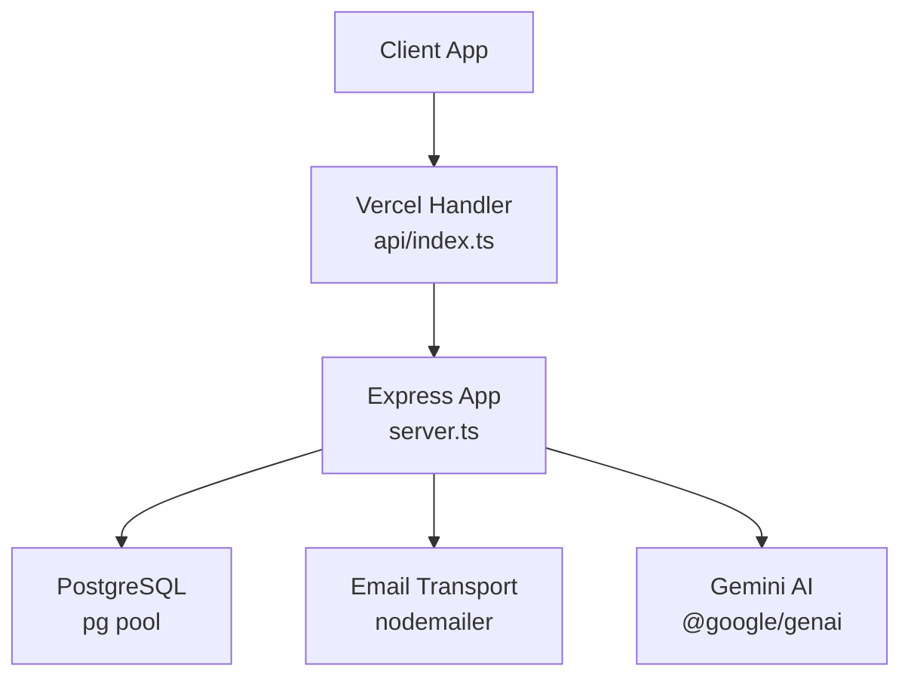
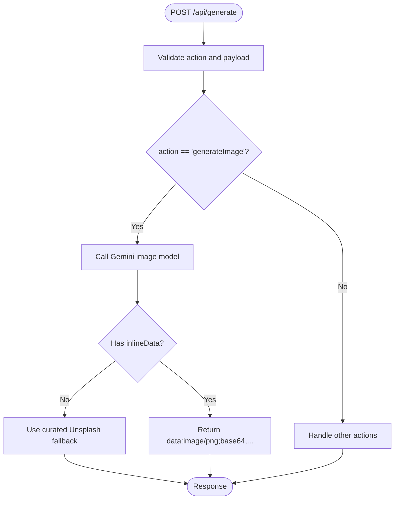
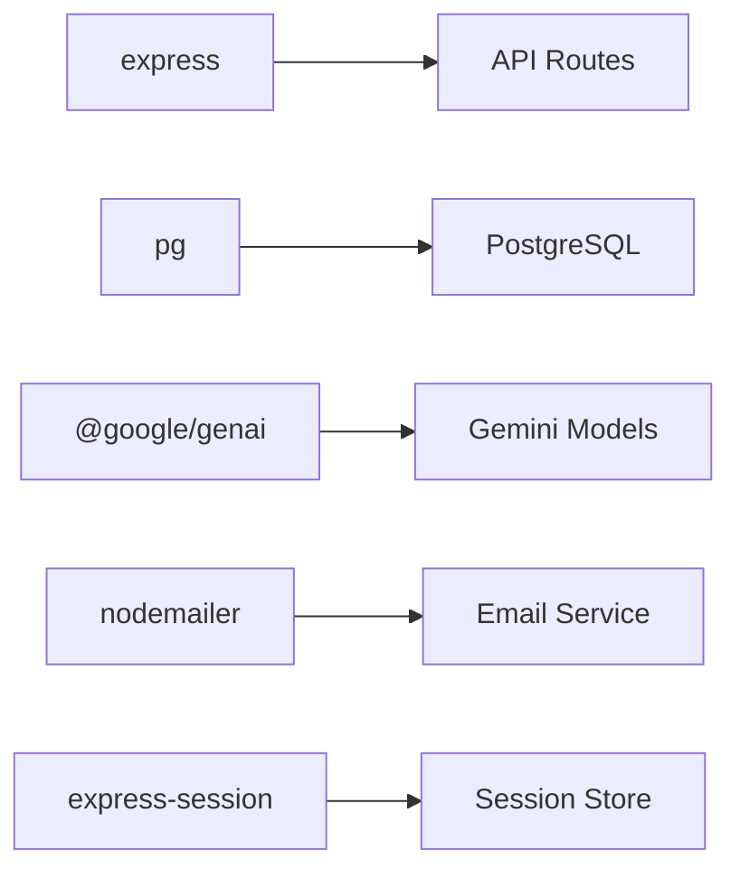

# File Upload API

<cite>
**Referenced Files in This Document**
- [server.ts](file://server.ts)
- [index.ts](file://index.ts)
- [api/index.ts](file://api/index.ts)
- [package.json](file://package.json)
</cite>

## Table of Contents
1. [Introduction](#introduction)
2. [Project Structure](#project-structure)
3. [Core Components](#core-components)
4. [Architecture Overview](#architecture-overview)
5. [Detailed Component Analysis](#detailed-component-analysis)
6. [Dependency Analysis](#dependency-analysis)
7. [Performance Considerations](#performance-considerations)
8. [Troubleshooting Guide](#troubleshooting-guide)
9. [Conclusion](#conclusion)
10. [Appendices](#appendices)

## Introduction
This document provides detailed API documentation for file upload and download endpoints supporting document processing, image uploads, and template file management. It specifies HTTP methods, URL patterns, multipart form data handling, file validation rules, storage locations, access control, and practical examples for workflows, progress tracking, error handling, and security considerations such as file type validation and size restrictions.

Important note: The current codebase does not implement dedicated file upload/download endpoints. Instead, it exposes a unified generation endpoint that can produce images (including base64-encoded responses) and JSON content. For full file upload/download capabilities, this document outlines recommended endpoints and implementation guidance aligned with the existing server architecture.

## Project Structure
The application is an Express-based Node.js server with routes defined in a single large module. A Vercel-compatible entry point exports the Express app. Key files:
- server.ts: Express app, middleware, authentication, and all API routes
- index.ts: Vercel serverless entry point that initializes DB tables and exports the app
- api/index.ts: Simple handler forwarding requests to the Express app
- package.json: Dependencies including express, pg, nodemailer, and others



**Diagram sources**
- [server.ts:1-120](file://server.ts#L1-L120)
- [index.ts:1-20](file://index.ts#L1-L20)
- [api/index.ts:1-5](file://api/index.ts#L1-L5)
- [package.json:15-45](file://package.json#L15-L45)

**Section sources**
- [server.ts:1-120](file://server.ts#L1-L120)
- [index.ts:1-20](file://index.ts#L1-L20)
- [api/index.ts:1-5](file://api/index.ts#L1-L5)
- [package.json:15-45](file://package.json#L15-L45)

## Core Components
- Authentication and Authorization: Session-based auth with role checks; admin-only actions enforced via middleware
- AI Generation: Unified POST /api/generate endpoint supports multiple actions including image generation returning base64 data URLs
- External Integrations: Google Places, Apify scrapers, Hunter.io enrichment, email via SMTP
- Database: PostgreSQL schema initialization and CRUD operations across many modules

Relevant to file handling:
- Image generation returns base64-encoded PNG data URLs when using the Gemini image model
- No explicit file upload/download endpoints are implemented in the current codebase

**Section sources**
- [server.ts:2248-2270](file://server.ts#L2248-L2270)
- [server.ts:2946-3072](file://server.ts#L2946-L3072)
- [server.ts:1-120](file://server.ts#L1-L120)

## Architecture Overview
The server uses Express middleware for parsing JSON and URL-encoded bodies. Authentication middleware protects sensitive endpoints. The generate endpoint centralizes AI-driven actions, including image generation. There is no multipart/form-data middleware configured, so direct file uploads are not supported out-of-the-box.

```mermaid
sequenceDiagram
participant C as "Client"
participant E as "Express Server"
participant G as "Gemini AI"
participant DB as "PostgreSQL"
C->>E : POST /api/generate { action : "generateImage", payload }
E->>G : Generate image (model + config)
G-->>E : Response with inlineData (base64)
E-->>C : { result : { imageUrl : "data : image/png;base64,...", isAI : true } }
```

**Diagram sources**
- [server.ts:2946-3072](file://server.ts#L2946-L3072)
- [server.ts:2248-2270](file://server.ts#L2248-L2270)

## Detailed Component Analysis

### Unified Generation Endpoint (/api/generate)
- Method: POST
- Content-Type: application/json
- Purpose: Centralized AI-powered actions including brochure copy generation, chatbot answers, SEO audits, social posts, and image generation
- Access Control: Public for specific actions; otherwise requires authenticated session; admin-only for certain actions
- Notable behavior:
  - Action routing based on body.action
  - Admin-only actions enforced by requireAdmin middleware
  - Authenticated actions enforced by requireAuth middleware
  - Fallback mechanisms for AI failures

Key sections:
- Action gating and middleware selection
- Image generation flow returning base64 data URLs

**Section sources**
- [server.ts:2248-2270](file://server.ts#L2248-L2270)
- [server.ts:2262-2271](file://server.ts#L2262-L2271)
- [server.ts:2946-3072](file://server.ts#L2946-L3072)

### Image Generation Flow
- Input: payload includes industry, pageNumber, customPrompt
- Processing: Calls Gemini image model with aspect ratio configuration
- Output: Returns base64-encoded PNG data URL or fallback curated image URL
- Error Handling: Falls back to curated Unsplash images if AI unavailable



**Diagram sources**
- [server.ts:2946-3072](file://server.ts#L2946-L3072)

**Section sources**
- [server.ts:2946-3072](file://server.ts#L2946-L3072)

### Authentication and Authorization Middleware
- requireAuth: Validates session.userId before allowing access
- requireAdmin: Checks user role from database for admin-only endpoints
- Session configuration: Secure cookies, httpOnly, sameSite, configurable maxAge

**Section sources**
- [server.ts:209-235](file://server.ts#L209-L235)
- [server.ts:112-125](file://server.ts#L112-L125)

### Database Integration
- PostgreSQL connection pooling with SSL support in production
- Schema initialization functions for various modules (users, LMS, agent OS, etc.)
- Idempotent table creation and migration helpers

**Section sources**
- [server.ts:24-35](file://server.ts#L24-L35)
- [server.ts:3246-3313](file://server.ts#L3246-L3313)
- [server.ts:3666-3867](file://server.ts#L3666-L3867)

## Dependency Analysis
The server relies on several key dependencies:
- express: Web framework for routing and middleware
- pg: PostgreSQL client for database operations
- @google/genai: Google AI SDK for Gemini integration
- nodemailer: Email sending functionality
- express-session: Session management
- connect-pg-simple: PostgreSQL session store



**Diagram sources**
- [package.json:15-45](file://package.json#L15-L45)

**Section sources**
- [package.json:15-45](file://package.json#L15-L45)

## Performance Considerations
- AI API calls include retry logic and fallback mechanisms to handle rate limits and transient errors
- Database queries use prepared statements and parameterized queries for security and performance
- Session storage can be configured for persistence using PostgreSQL
- Image generation may return large base64 payloads; consider chunking or streaming for large files

[No sources needed since this section provides general guidance]

## Troubleshooting Guide
Common issues and resolutions:
- Missing API keys: Ensure GEMINI_API_KEY is configured for AI features
- Database connection: Verify DATABASE_URL and SSL settings for production
- Session issues: Check SESSION_SECRET and session store configuration
- Email delivery: Configure SMTP_USER and SMTP_PASS for password reset emails

Error handling patterns:
- Consistent error response format with descriptive messages
- Logging for debugging and monitoring
- Graceful fallbacks for external service failures

**Section sources**
- [server.ts:854-878](file://server.ts#L854-L878)
- [server.ts:133-143](file://server.ts#L133-L143)
- [server.ts:107-125](file://server.ts#L107-L125)

## Conclusion
While the current codebase does not implement dedicated file upload/download endpoints, it provides a robust foundation for extending file handling capabilities. The unified generation endpoint demonstrates how to handle binary data (images) through base64 encoding. To implement comprehensive file upload/download functionality, the recommended approach would involve adding multipart form data parsing, file validation middleware, secure storage mechanisms, and appropriate access controls following the existing architectural patterns.

[No sources needed since this section summarizes without analyzing specific files]

## Appendices

### Recommended File Upload/Download API Design
Based on the existing architecture, here are recommended endpoints for implementing file handling:

#### File Upload Endpoints
- POST /api/files/upload
  - Content-Type: multipart/form-data
  - Parameters: file (required), metadata (optional JSON)
  - Validation: File type whitelist, size limits, virus scanning
  - Response: { fileId, fileName, fileSize, mimeType, uploadedAt }

- POST /api/files/batch-upload
  - Content-Type: multipart/form-data
  - Parameters: files[] (array), metadata (optional JSON)
  - Response: { uploadedFiles[], failedFiles[] }

#### File Download Endpoints
- GET /api/files/:id
  - Response: File stream with appropriate Content-Type headers
  - Access Control: Requires authentication and file ownership verification

- GET /api/files/:id/preview
  - Response: Thumbnail or preview version of the file

#### File Metadata Management
- GET /api/files/:id/metadata
  - Response: { id, fileName, fileSize, mimeType, uploadedBy, createdAt, tags }

- PUT /api/files/:id/metadata
  - Request: Updated metadata fields
  - Response: Updated file metadata

#### Security Considerations
- File type validation using MIME type detection and extension whitelisting
- Size limits to prevent abuse (e.g., 10MB per file, 50MB per batch)
- Virus scanning for uploaded documents
- Secure storage with encrypted filenames and path obfuscation
- Access control based on user roles and file ownership
- Rate limiting for upload endpoints
- Audit logging for file operations

[No sources needed since this section provides conceptual recommendations]