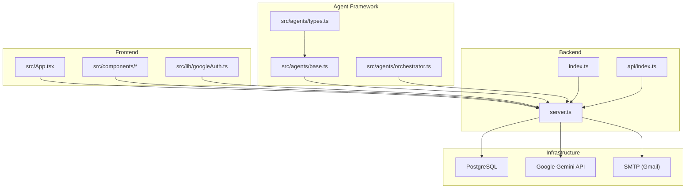
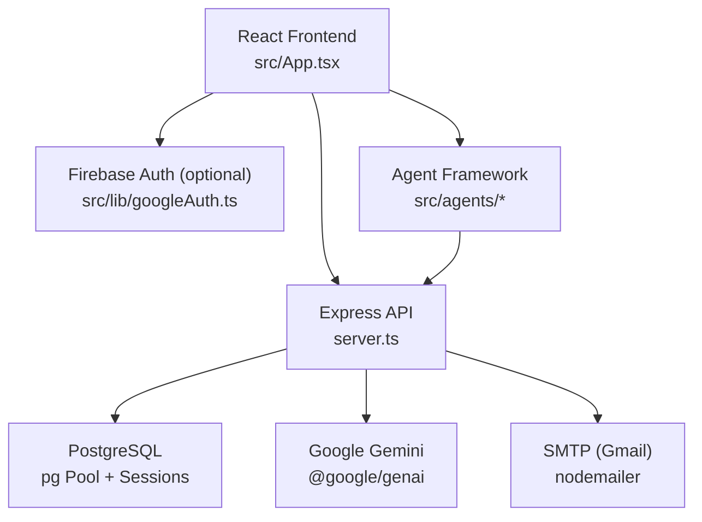
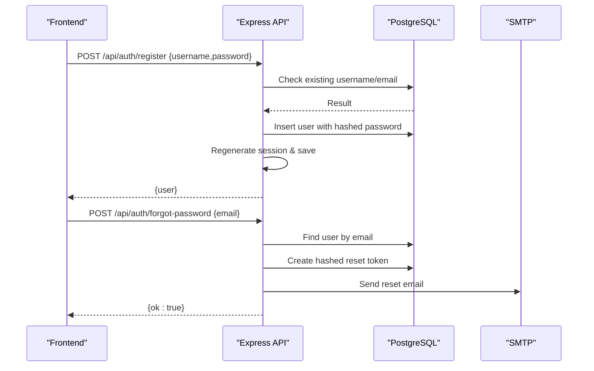
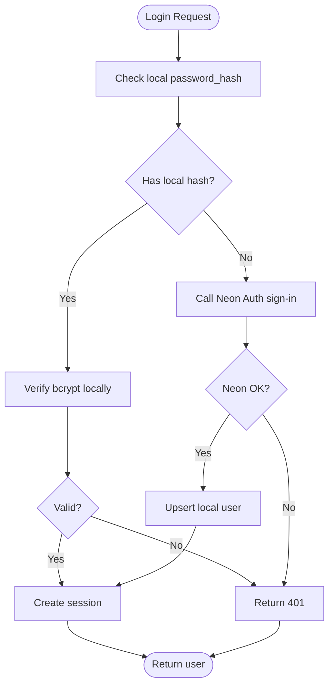
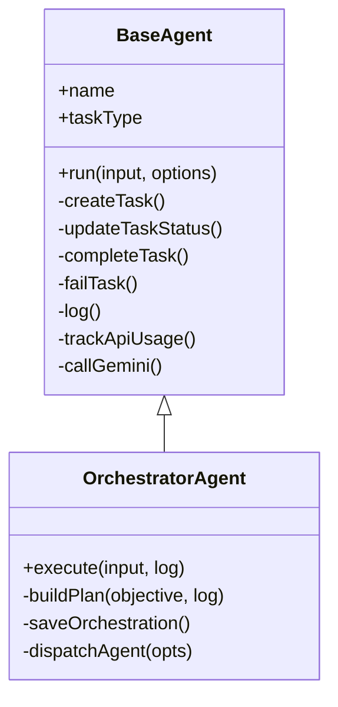
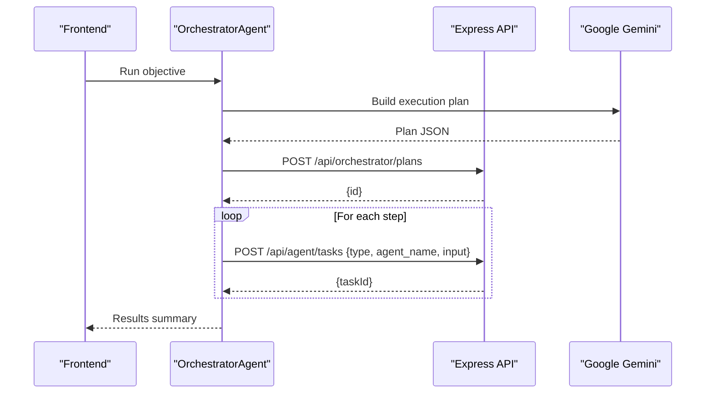
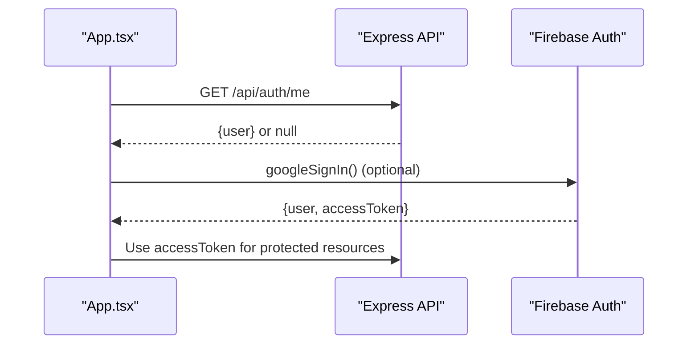
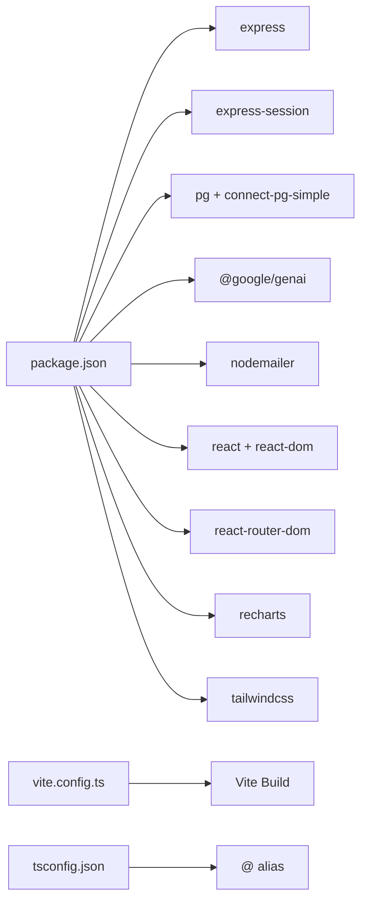

# Architecture Overview

<cite>
**Referenced Files in This Document**
- [package.json](file://package.json)
- [server.ts](file://server.ts)
- [index.ts](file://index.ts)
- [api/index.ts](file://api/index.ts)
- [src/App.tsx](file://src/App.tsx)
- [src/agents/base.ts](file://src/agents/base.ts)
- [src/agents/orchestrator.ts](file://src/agents/orchestrator.ts)
- [src/agents/types.ts](file://src/agents/types.ts)
- [src/lib/googleAuth.ts](file://src/lib/googleAuth.ts)
- [vite.config.ts](file://vite.config.ts)
- [tsconfig.json](file://tsconfig.json)
- [README.md](file://README.md)
- [scripts/generate-env.mjs](file://scripts/generate-env.mjs)
- [scripts/setup-env.js](file://scripts/setup-env.js)
</cite>

## Table of Contents
1. Introduction
2. Project Structure
3. Core Components
4. Architecture Overview
5. Detailed Component Analysis
6. Dependency Analysis
7. Performance Considerations
8. Troubleshooting Guide
9. Conclusion

## Introduction
This document describes the full-stack architecture of the ClientumLatam AI Marketing Dashboard. The system combines a React frontend with an Express.js backend, PostgreSQL for persistence, and Google Gemini AI integration. It uses a component-based UI architecture, session-based authentication with server-side storage, and an agent orchestration framework to coordinate multi-step AI-driven workflows.

Key goals:
- Provide a unified dashboard for marketing operations (prospecting, enrichment, proposals, campaigns).
- Orchestrate AI agents via a central orchestrator that plans and dispatches tasks.
- Persist user sessions and business data in PostgreSQL.
- Integrate Google Gemini models through a secure backend proxy.

[No sources needed since this section provides general context]

## Project Structure
The project is organized into:
- Frontend: React application under src/, built with Vite and Tailwind CSS.
- Backend: Express server under server.ts with API routes, session management, and database access.
- Agent Framework: TypeScript classes under src/agents/ implementing base agent behavior and orchestration.
- Configuration: Environment setup scripts and build configuration files.

**Diagram sources**
- [src/App.tsx:1-177](file://src/App.tsx#L1-L177)
- [server.ts:1-120](file://server.ts#L1-L120)
- [src/agents/base.ts:1-199](file://src/agents/base.ts#L1-L199)
- [src/agents/orchestrator.ts:1-181](file://src/agents/orchestrator.ts#L1-L181)
- [src/agents/types.ts:1-181](file://src/agents/types.ts#L1-L181)
- [api/index.ts:1-5](file://api/index.ts#L1-L5)
- [index.ts:1-20](file://index.ts#L1-L20)

**Section sources**
- [package.json:1-64](file://package.json#L1-L64)
- [vite.config.ts:1-23](file://vite.config.ts#L1-L23)
- [tsconfig.json:1-27](file://tsconfig.json#L1-L27)
- [README.md:1-21](file://README.md#L1-L21)

## Core Components
- Express Server: Central API layer handling authentication, email, AI proxying, and database operations.
- Session Management: Cookie-based sessions persisted in PostgreSQL using connect-pg-simple.
- Authentication: Username/password and optional Neon Auth integration; password reset via email.
- Agent Framework: BaseAgent lifecycle, logging, retries, and Gemini calls; OrchestratorAgent planning and dispatch.
- Frontend App: Tabbed React app with auth checks and command palette; integrates Google sign-in flow.

Highlights:
- Database pool configured conditionally; mock fallback when DATABASE_URL is missing.
- Role enforcement re-checked from DB on admin endpoints.
- Gemini calls proxied through /api/agent/ai/gemini to keep keys server-side.
- Email transport via SMTP for password resets.

**Section sources**
- [server.ts:1-120](file://server.ts#L1-L120)
- [server.ts:209-264](file://server.ts#L209-L264)
- [server.ts:266-381](file://server.ts#L266-L381)
- [server.ts:594-748](file://server.ts#L594-L748)
- [server.ts:750-800](file://server.ts#L750-L800)
- [src/agents/base.ts:1-199](file://src/agents/base.ts#L1-L199)
- [src/agents/orchestrator.ts:1-181](file://src/agents/orchestrator.ts#L1-L181)
- [src/App.tsx:43-88](file://src/App.tsx#L43-L88)

## Architecture Overview
The system follows a layered architecture:
- Presentation Layer: React components render dashboards and interact with the backend via REST APIs.
- Application Layer: Express routes handle requests, enforce auth, manage sessions, and orchestrate AI tasks.
- Data Layer: PostgreSQL stores users, sessions, leads, companies, campaigns, logs, and orchestration plans.
- External Integrations: Google Gemini for AI responses; SMTP for emails; optional Neon Auth identity provider.

**Diagram sources**
- [src/App.tsx:1-177](file://src/App.tsx#L1-L177)
- [server.ts:1-120](file://server.ts#L1-L120)
- [src/agents/base.ts:1-199](file://src/agents/base.ts#L1-L199)
- [src/lib/googleAuth.ts:1-60](file://src/lib/googleAuth.ts#L1-L60)

## Detailed Component Analysis

### Express Server and API Endpoints
Responsibilities:
- Initialize Express, middleware, and session store.
- Provide authentication endpoints (register, login, logout, forgot/reset password).
- Support Neon Auth integration with local fallback.
- Proxy AI calls to Gemini securely.
- Enforce role-based access and internal tokens for server-to-server integrations.

Key flows:
- Registration/Login: Validate input, hash passwords, create or verify users, regenerate session, persist session to DB.
- Password Reset: Generate secure token, store hashed token, send email via SMTP.
- Admin Enforcement: Re-check role from DB per request.

**Diagram sources**
- [server.ts:266-338](file://server.ts#L266-L338)
- [server.ts:340-381](file://server.ts#L340-L381)
- [server.ts:750-800](file://server.ts#L750-L800)

**Section sources**
- [server.ts:1-120](file://server.ts#L1-L120)
- [server.ts:209-264](file://server.ts#L209-L264)
- [server.ts:266-381](file://server.ts#L266-L381)
- [server.ts:594-748](file://server.ts#L594-L748)
- [server.ts:750-800](file://server.ts#L750-L800)

### Session Management and Security
- Sessions are cookie-based with httpOnly flags and configurable maxAge.
- Store uses connect-pg-simple to persist sessions in PostgreSQL.
- SESSION_SECRET used to sign cookies; production should set secure cookies.
- Admin endpoints re-check roles from DB to ensure immediate effect of role changes.

Security considerations:
- Avoid trusting session snapshots for roles; always validate against DB.
- Use strong SESSION_SECRET and HTTPS in production.
- Fail closed for misconfigured CRM tokens.

**Section sources**
- [server.ts:112-125](file://server.ts#L112-L125)
- [server.ts:216-235](file://server.ts#L216-L235)

### Authentication System
Supports:
- Local username/password registration/login with bcrypt hashing.
- Optional Neon Auth integration for email-based identity; local fallback if not configured.
- Password reset via email with time-limited tokens.

Flow highlights:
- Register: Hash password, lock table to ensure first user becomes admin, create session.
- Login: Try local bcrypt first; if no local hash, call Neon Auth; upsert local user record.
- Logout: Destroy session and clear cookie.

**Diagram sources**
- [server.ts:683-748](file://server.ts#L683-L748)
- [server.ts:594-680](file://server.ts#L594-L680)

**Section sources**
- [server.ts:266-381](file://server.ts#L266-L381)
- [server.ts:594-748](file://server.ts#L594-L748)

### AI Agent Orchestration Framework
Components:
- BaseAgent: Lifecycle management (create/update/complete/fail), retry with backoff, logging, Gemini proxy.
- OrchestratorAgent: Parses objective, builds plan via Gemini, persists plan, dispatches steps respecting dependencies.
- Types: Shared interfaces for tasks, logs, results, and business entities.

Data flow:
- Frontend triggers orchestrator via /api/agent/tasks and /api/orchestrator/plans.
- Orchestrator calls Gemini to generate plan JSON; falls back to default plan if parsing fails.
- Steps dispatched sequentially; failures logged and tracked.

**Diagram sources**
- [src/agents/base.ts:1-199](file://src/agents/base.ts#L1-L199)
- [src/agents/orchestrator.ts:1-181](file://src/agents/orchestrator.ts#L1-L181)

**Diagram sources**
- [src/agents/orchestrator.ts:1-181](file://src/agents/orchestrator.ts#L1-L181)
- [src/agents/base.ts:1-199](file://src/agents/base.ts#L1-L199)

**Section sources**
- [src/agents/base.ts:1-199](file://src/agents/base.ts#L1-L199)
- [src/agents/orchestrator.ts:1-181](file://src/agents/orchestrator.ts#L1-L181)
- [src/agents/types.ts:1-181](file://src/agents/types.ts#L1-L181)

### Frontend Application and Google Sign-In
- React app manages tabs and renders feature modules based on activeTab state.
- Checks session via /api/auth/me; handles logout and event-driven updates.
- Optional Google sign-in via Firebase Auth for Drive integration.

**Diagram sources**
- [src/App.tsx:43-88](file://src/App.tsx#L43-L88)
- [src/lib/googleAuth.ts:1-60](file://src/lib/googleAuth.ts#L1-L60)

**Section sources**
- [src/App.tsx:1-177](file://src/App.tsx#L1-L177)
- [src/lib/googleAuth.ts:1-60](file://src/lib/googleAuth.ts#L1-L60)

## Dependency Analysis
Core runtime dependencies:
- Express, express-session, connect-pg-simple, pg for server and sessions.
- @google/genai for Gemini integration.
- nodemailer for SMTP email sending.
- React, react-router-dom, recharts, tailwind for frontend.

Build and dev tooling:
- Vite for development and build; esbuild for bundling server.
- TypeScript configuration with path aliases.

Environment variables:
- Scripts generate .env with defaults and prompts for secrets.

**Diagram sources**
- [package.json:1-64](file://package.json#L1-L64)
- [vite.config.ts:1-23](file://vite.config.ts#L1-L23)
- [tsconfig.json:1-27](file://tsconfig.json#L1-L27)

**Section sources**
- [package.json:1-64](file://package.json#L1-L64)
- [scripts/generate-env.mjs:1-73](file://scripts/generate-env.mjs#L1-L73)
- [scripts/setup-env.js:87-259](file://scripts/setup-env.js#L87-L259)

## Performance Considerations
- Database pooling: Ensure connection pooling is enabled; avoid creating new connections per request.
- Session store: Use PostgreSQL-backed sessions for scalability across instances.
- Gemini calls: Keep model selection efficient; use flash variants for low-latency tasks.
- Retry/backoff: BaseAgent implements exponential backoff to mitigate transient failures.
- Build optimization: Vite HMR disabled in certain environments to reduce CPU usage during edits.

[No sources needed since this section provides general guidance]

## Troubleshooting Guide
Common issues:
- Missing DATABASE_URL: Server falls back to mock pool and memory sessions; check environment configuration.
- Session creation timeout: A 5-second guard ensures response even if session store callback stalls.
- Neon Auth errors: Handle EMAIL_NOT_VERIFIED and user existence conflicts gracefully.
- SMTP misconfiguration: Password reset will fail if SMTP_USER/SMTP_PASS are missing.

Recommendations:
- Validate all required env vars before deployment.
- Monitor session store health and DB connectivity.
- Log and surface meaningful error messages for clients.

**Section sources**
- [server.ts:24-77](file://server.ts#L24-L77)
- [server.ts:548-591](file://server.ts#L548-L591)
- [server.ts:724-748](file://server.ts#L724-L748)
- [server.ts:133-143](file://server.ts#L133-L143)

## Conclusion
The ClientumLatam AI Marketing Dashboard integrates a React frontend, Express backend, PostgreSQL database, and Google Gemini AI into a cohesive system. The agent orchestration framework enables complex, multi-step AI workflows while maintaining robust authentication, session management, and observability. With careful configuration and scaling practices, the system can support growing marketing automation needs.

[No sources needed since this section summarizes without analyzing specific files]