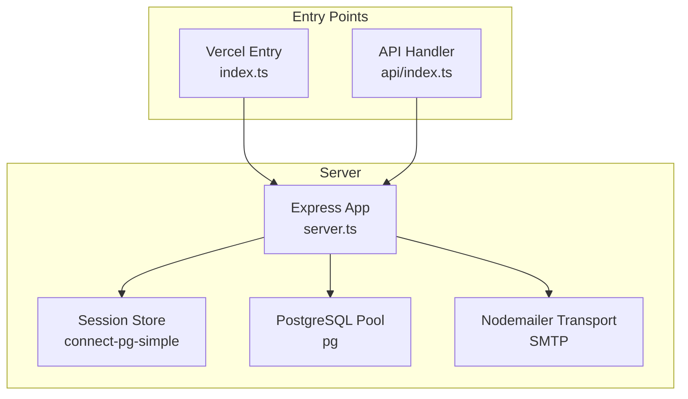
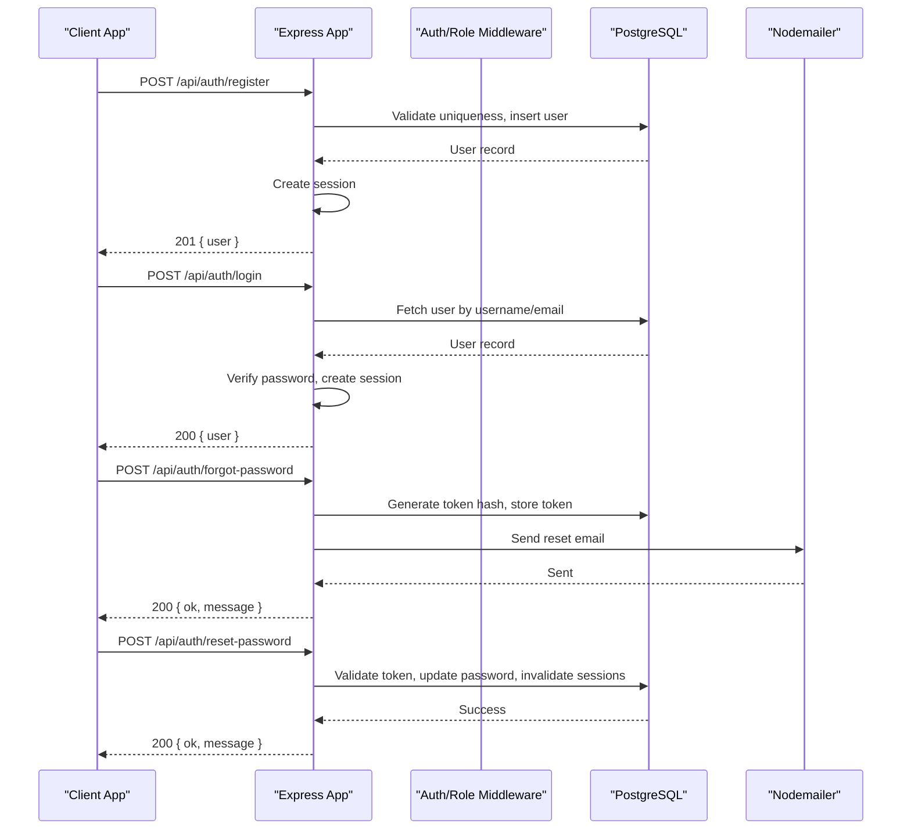
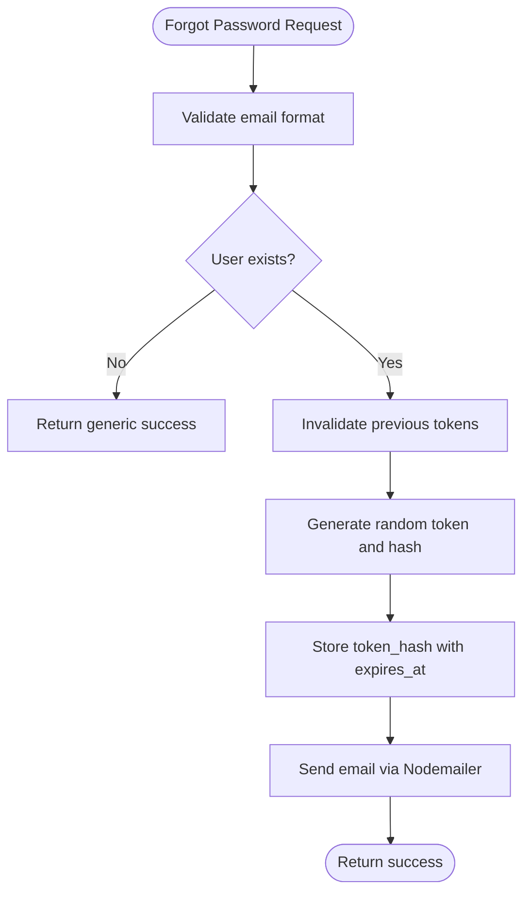
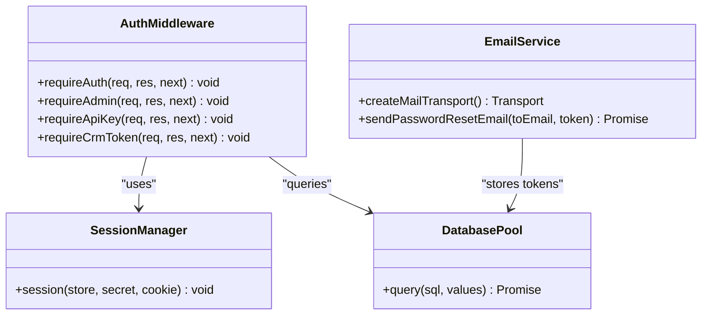
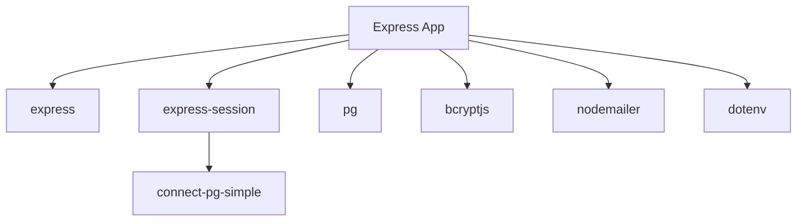

# API Routes & Endpoints

<cite>
**Referenced Files in This Document**
- [server.ts](file://server.ts)
- [api/index.ts](file://api/index.ts)
- [index.ts](file://index.ts)
- [package.json](file://package.json)
- [AuthGate.tsx](file://src/components/AuthGate.tsx)
</cite>

## Table of Contents
1. [Introduction](#introduction)
2. [Project Structure](#project-structure)
3. [Core Components](#core-components)
4. [Architecture Overview](#architecture-overview)
5. [Detailed Component Analysis](#detailed-component-analysis)
6. [Dependency Analysis](#dependency-analysis)
7. [Performance Considerations](#performance-considerations)
8. [Troubleshooting Guide](#troubleshooting-guide)
9. [Conclusion](#conclusion)

## Introduction
This document provides a comprehensive guide to the RESTful API routes and endpoints implemented in the project. It focuses on authentication endpoints (register, login, logout, forgot-password, reset-password), email service integration with nodemailer and SMTP configuration, middleware chain, request processing flow, and response formatting patterns. It also addresses common operational concerns such as CORS behavior, input validation/sanitization, and API versioning strategy. The content is designed to be accessible for beginners while offering sufficient technical depth for experienced developers.

## Project Structure
The server is built with Express and exposes all API routes from a single module. A Vercel-compatible entry point exports the Express app after initializing required database tables.

**Diagram sources**
- [server.ts:18-35](file://server.ts#L18-L35)
- [server.ts:107-125](file://server.ts#L107-L125)
- [server.ts:133-143](file://server.ts#L133-L143)
- [index.ts:12-19](file://index.ts#L12-L19)
- [api/index.ts:1-5](file://api/index.ts#L1-L5)

**Section sources**
- [server.ts:18-35](file://server.ts#L18-L35)
- [index.ts:12-19](file://index.ts#L12-L19)
- [api/index.ts:1-5](file://api/index.ts#L1-L5)

## Core Components
- Authentication endpoints: register, login, logout, forgot-password, reset-password, and session introspection (/api/auth/me).
- Email service: password reset emails via nodemailer using Gmail SMTP.
- Middleware: session management, role-based authorization, API key/token verification for server-to-server calls.
- Database: PostgreSQL pool with session store and password reset tokens table.
- Response formatting: consistent JSON responses with error fields and HTTP status codes.

Key implementation highlights:
- Session persistence via connect-pg-simple with secure cookie settings.
- Password hashing with bcryptjs.
- Secure token generation and storage for password resets.
- Consistent error handling across endpoints.

**Section sources**
- [server.ts:107-125](file://server.ts#L107-L125)
- [server.ts:133-143](file://server.ts#L133-L143)
- [server.ts:266-338](file://server.ts#L266-L338)
- [server.ts:340-381](file://server.ts#L340-L381)
- [server.ts:383-392](file://server.ts#L383-L392)
- [server.ts:753-791](file://server.ts#L753-L791)
- [server.ts:795-830](file://server.ts#L795-L830)
- [server.ts:832-851](file://server.ts#L832-L851)

## Architecture Overview
The API follows a straightforward Express architecture:
- Global middleware sets up JSON parsing, URL-encoded parsing, and sessions.
- Route handlers implement business logic, validate inputs, interact with the database, and return standardized JSON responses.
- Middleware enforces authentication and authorization at route or action levels.
- External integrations include PostgreSQL (database and sessions), nodemailer (email), and optional third-party services (e.g., Google Places, Apify, Gemini AI).

**Diagram sources**
- [server.ts:266-338](file://server.ts#L266-L338)
- [server.ts:340-381](file://server.ts#L340-L381)
- [server.ts:383-392](file://server.ts#L383-L392)
- [server.ts:753-791](file://server.ts#L753-L791)
- [server.ts:795-830](file://server.ts#L795-L830)

## Detailed Component Analysis

### Authentication Endpoints

#### Register
- Method: POST
- Path: /api/auth/register
- Request body:
  - username: string (supports usernames or email-like strings; validated against a regex pattern)
  - password: string (minimum length enforced)
- Validation:
  - Type checks for username and password
  - Username format validation
  - Password length validation
  - Duplicate check by username or email
- Behavior:
  - Hashes password with bcrypt
  - Inserts user into users table (first user becomes admin)
  - Creates a new session and returns user info
- Responses:
  - 201 Created: { user: { id, username, role } }
  - 400 Bad Request: { error: "..." }
  - 409 Conflict: { error: "Ese usuario ya existe." }
  - 500 Internal Server Error: { error: "Ocurrió un error al registrar el usuario." }

**Section sources**
- [server.ts:266-338](file://server.ts#L266-L338)

#### Login
- Method: POST
- Path: /api/auth/login
- Request body:
  - username: string (accepts username or email)
  - password: string
- Validation:
  - Type checks for username and password
  - Lookup by username or email
  - Constant-time password comparison to mitigate timing attacks
- Behavior:
  - On success, regenerates session and stores userId, username, role
- Responses:
  - 200 OK: { user: { id, username, role } }
  - 401 Unauthorized: { error: "Usuario o contraseña incorrectos." }
  - 500 Internal Server Error: { error: "Ocurrió un error al iniciar sesión." }

**Section sources**
- [server.ts:340-381](file://server.ts#L340-L381)

#### Logout
- Method: POST
- Path: /api/auth/logout
- Behavior:
  - Destroys session and clears the session cookie
- Responses:
  - 200 OK: { ok: true }
  - 500 Internal Server Error: { error: "Ocurrió un error al cerrar sesión." }

**Section sources**
- [server.ts:383-392](file://server.ts#L383-L392)

#### Forgot Password
- Method: POST
- Path: /api/auth/forgot-password
- Request body:
  - email: string (validated to contain "@")
- Behavior:
  - Looks up user by email (case-insensitive)
  - Invalidates any previous unused reset tokens for the user
  - Generates a secure random token, hashes it, and stores with expiration
  - Sends an HTML email with a reset link
  - Always responds with success to avoid enumerating existing emails
- Responses:
  - 200 OK: { ok: true, message: "Si el email existe, recibirás un correo en breve." }
  - 400 Bad Request: { error: "Email inválido." }
  - 500 Internal Server Error: { error: "Error al procesar la solicitud. Intentá de nuevo." }

**Section sources**
- [server.ts:753-791](file://server.ts#L753-L791)

#### Reset Password
- Method: POST
- Path: /api/auth/reset-password
- Request body:
  - token: string (minimum length enforced)
  - newPassword: string (minimum length enforced)
- Behavior:
  - Validates token hash against stored tokens (expired or used tokens rejected)
  - Updates user password hash
  - Marks token as used
  - Destroys active sessions for the user to force re-login
- Responses:
  - 200 OK: { ok: true, message: "Contraseña actualizada. Ya podés iniciar sesión." }
  - 400 Bad Request: { error: "Token inválido." } or { error: "El enlace expiró o ya fue usado. Solicitá uno nuevo." }
  - 500 Internal Server Error: { error: "Error al restablecer la contraseña." }

**Section sources**
- [server.ts:795-830](file://server.ts#L795-L830)

#### Get Current User
- Method: GET
- Path: /api/auth/me
- Behavior:
  - Requires authenticated session
  - Re-fetches role from database to reflect immediate changes
- Responses:
  - 200 OK: { user: { id, username, role } }
  - 401 Unauthorized: { error: "No autenticado." }
  - 500 Internal Server Error: { error: "Ocurrió un error al verificar la sesión." }

**Section sources**
- [server.ts:832-851](file://server.ts#L832-L851)

### Email Service Integration (Nodemailer + SMTP)
- Transport creation:
  - Uses nodemailer.createTransport with Gmail SMTP host, port 587, STARTTLS, and credentials from environment variables.
- Password reset email:
  - Builds a reset URL using APP_URL and includes a raw token parameter.
  - Sends both HTML and plain text versions.
- Configuration requirements:
  - SMTP_USER and SMTP_PASS must be set for email sending.
  - APP_URL should be configured to build correct reset links.

**Diagram sources**
- [server.ts:133-143](file://server.ts#L133-L143)
- [server.ts:753-791](file://server.ts#L753-L791)

**Section sources**
- [server.ts:133-143](file://server.ts#L133-L143)
- [server.ts:753-791](file://server.ts#L753-L791)

### Middleware Chain and Authorization
- Session middleware:
  - Configured with secure cookie options and persistent store via connect-pg-simple.
- Authentication middleware:
  - requireAuth checks for userId in session; returns 401 if missing.
- Admin middleware:
  - requireAdmin verifies current role from database; returns 403 if not admin.
- API key middleware:
  - requireApiKey validates x-api-key header against env variable.
- CRM token middleware:
  - requireCrmToken validates x-crm-token header against env variable; fails closed if misconfigured.

**Diagram sources**
- [server.ts:107-125](file://server.ts#L107-L125)
- [server.ts:209-235](file://server.ts#L209-L235)
- [server.ts:240-264](file://server.ts#L240-L264)
- [server.ts:133-143](file://server.ts#L133-L143)

**Section sources**
- [server.ts:107-125](file://server.ts#L107-L125)
- [server.ts:209-235](file://server.ts#L209-L235)
- [server.ts:240-264](file://server.ts#L240-L264)

### Request Processing Flow and Response Formatting
- All requests are parsed as JSON or URL-encoded.
- Responses follow a consistent structure:
  - Success responses include data payloads (e.g., { user }, { ok, message }).
  - Error responses include an error field with descriptive messages.
- Status codes:
  - 200 OK for successful operations.
  - 201 Created for successful registration.
  - 400 Bad Request for invalid inputs.
  - 401 Unauthorized for missing or invalid authentication.
  - 403 Forbidden for insufficient permissions.
  - 500 Internal Server Error for unexpected failures.

**Section sources**
- [server.ts:79-80](file://server.ts#L79-L80)
- [server.ts:266-338](file://server.ts#L266-L338)
- [server.ts:340-381](file://server.ts#L340-L381)
- [server.ts:753-791](file://server.ts#L753-L791)
- [server.ts:795-830](file://server.ts#L795-L830)

### Frontend Integration Examples
The frontend component demonstrates how clients interact with the authentication endpoints:
- Calls /api/auth/login and /api/auth/register with appropriate payloads.
- Handles errors and updates UI state accordingly.
- Implements forgot-password flow by calling /api/auth/forgot-password.

**Section sources**
- [AuthGate.tsx:46-91](file://src/components/AuthGate.tsx#L46-L91)

## Dependency Analysis
The API relies on several key dependencies:
- express: HTTP server and routing.
- express-session: Session management.
- connect-pg-simple: Persistent session store using PostgreSQL.
- pg: PostgreSQL client.
- bcryptjs: Password hashing.
- nodemailer: Email transport.
- dotenv: Environment variable loading.

**Diagram sources**
- [package.json:15-45](file://package.json#L15-L45)
- [server.ts:1-16](file://server.ts#L1-L16)

**Section sources**
- [package.json:15-45](file://package.json#L15-L45)
- [server.ts:1-16](file://server.ts#L1-L16)

## Performance Considerations
- Database pooling: Uses pg.Pool for efficient connection management.
- Session persistence: connect-pg-simple avoids memory leaks and supports horizontal scaling.
- Password hashing: bcrypt with appropriate cost factor balances security and performance.
- Token generation: crypto.randomBytes ensures secure, unpredictable tokens.
- Email delivery: Asynchronous send operations prevent blocking request handling.

[No sources needed since this section provides general guidance]

## Troubleshooting Guide
Common issues and resolutions:
- CORS configuration: No explicit CORS middleware is configured; ensure client origins are allowed by default or add cors middleware if needed.
- Input sanitization: Basic validation is implemented; consider additional sanitization libraries for complex inputs.
- API versioning: Currently no versioning strategy; consider prefixing routes with /api/v1 for future compatibility.
- SMTP configuration: Ensure SMTP_USER and SMTP_PASS are correctly set; verify Gmail SMTP settings and app passwords.
- Session issues: Check SESSION_SECRET and DATABASE_URL; ensure session table exists in PostgreSQL.

**Section sources**
- [server.ts:107-125](file://server.ts#L107-L125)
- [server.ts:133-143](file://server.ts#L133-L143)

## Conclusion
The API provides a robust foundation for user authentication, session management, and password recovery workflows. The implementation follows best practices for security, including password hashing, secure token generation, and proper error handling. The modular design allows for easy extension and maintenance. For production deployments, consider adding CORS middleware, implementing API versioning, and enhancing input sanitization for improved security and scalability.

[No sources needed since this section summarizes without analyzing specific files]