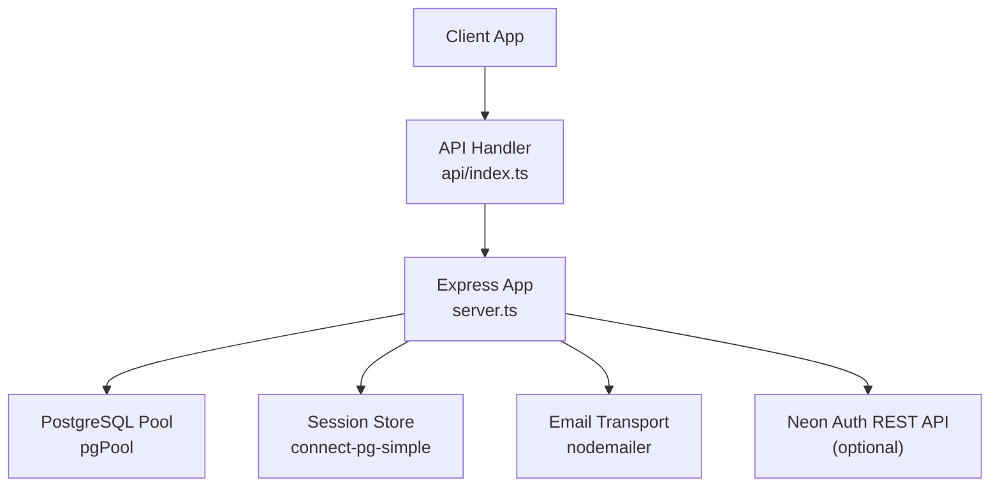
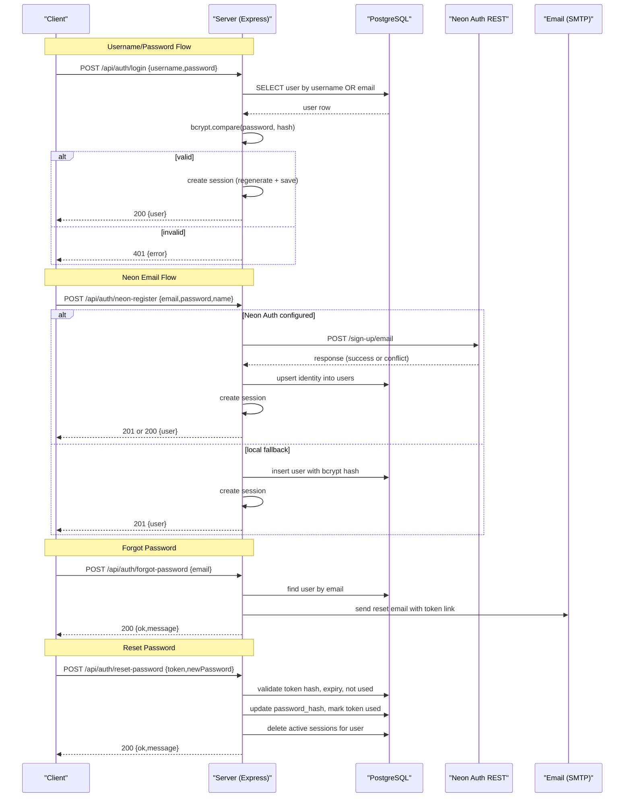
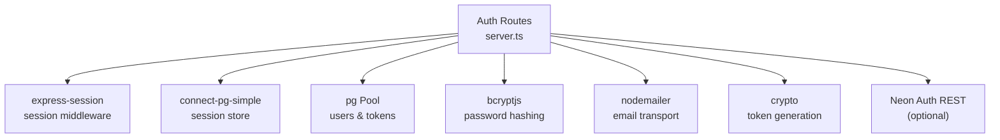

# Authentication Endpoints

<cite>
**Referenced Files in This Document**
- [server.ts](file://server.ts)
- [api/index.ts](file://api/index.ts)
- [package.json](file://package.json)
</cite>

## Table of Contents
1. [Introduction](#introduction)
2. [Project Structure](#project-structure)
3. [Core Components](#core-components)
4. [Architecture Overview](#architecture-overview)
5. [Detailed Component Analysis](#detailed-component-analysis)
6. [Dependency Analysis](#dependency-analysis)
7. [Performance Considerations](#performance-considerations)
8. [Troubleshooting Guide](#troubleshooting-guide)
9. [Conclusion](#conclusion)

## Introduction
This document provides comprehensive API documentation for the authentication endpoints, covering both traditional username/password and email-based Neon Auth integration. It details HTTP methods, URL patterns, request/response schemas, authentication requirements, error codes, and common error scenarios. It also explains session management, password hashing with bcryptjs, security considerations, input validation, rate limiting strategies, and CSRF protection.

## Project Structure
The authentication endpoints are implemented in a single Express application entry point that is exposed via an API handler. The server initializes middleware (JSON parsing, sessions), sets up database connectivity, and defines all auth routes.

**Diagram sources**
- [api/index.ts:1-5](file://api/index.ts#L1-L5)
- [server.ts:18-35](file://server.ts#L18-L35)
- [server.ts:112-125](file://server.ts#L112-L125)
- [server.ts:133-143](file://server.ts#L133-L143)

**Section sources**
- [api/index.ts:1-5](file://api/index.ts#L1-L5)
- [server.ts:18-35](file://server.ts#L18-L35)
- [server.ts:112-125](file://server.ts#L112-L125)

## Core Components
- Express app with JSON and URL-encoded body parsers.
- Session middleware using express-session with PostgreSQL-backed store.
- Database pool for users and password reset tokens.
- bcryptjs for password hashing.
- nodemailer for sending password reset emails.
- Optional Neon Auth integration via REST calls when configured.

Key environment variables used by authentication:
- DATABASE_URL: PostgreSQL connection string.
- SESSION_SECRET: Secret used to sign session cookies.
- SMTP_USER / SMTP_PASS: Credentials for Gmail SMTP transport.
- NEON_AUTH_BASE_URL or VITE_NEON_AUTH_URL: Base URL for Neon Auth REST API.
- APP_URL: Used to build password reset links.

**Section sources**
- [server.ts:79-80](file://server.ts#L79-L80)
- [server.ts:112-125](file://server.ts#L112-L125)
- [server.ts:133-143](file://server.ts#L133-L143)
- [server.ts:145-207](file://server.ts#L145-L207)
- [server.ts:401-404](file://server.ts#L401-L404)

## Architecture Overview
The system supports two authentication flows:
- Traditional username/password against local users table.
- Email-based Neon Auth flow that proxies to Neon Auth REST API and syncs identities into the local users table.

**Diagram sources**
- [server.ts:340-381](file://server.ts#L340-L381)
- [server.ts:594-680](file://server.ts#L594-L680)
- [server.ts:683-748](file://server.ts#L683-L748)
- [server.ts:753-791](file://server.ts#L753-L791)
- [server.ts:795-830](file://server.ts#L795-L830)

## Detailed Component Analysis

### POST /api/auth/register (Username/Password)
- Method: POST
- URL: /api/auth/register
- Authentication: None (public)
- Request schema:
  - username: string (3–64 chars; letters, numbers, . _ - @; or valid email)
  - password: string (minimum 8 characters)
- Response schema:
  - 201 Created: { user: { id: number, username: string, role: string } }
  - 400 Bad Request: { error: string }
  - 409 Conflict: { error: string }
  - 500 Internal Server Error: { error: string }
- Behavior:
  - Validates inputs and checks existing username/email.
  - Hashes password with bcrypt (cost factor 12).
  - First user becomes admin; subsequent users get role "user".
  - If username looks like an email, persists it in the email column.
  - Creates a new session and returns user info.

Common errors:
- Missing fields or invalid formats → 400
- Duplicate username/email → 409
- Database/session errors → 500

**Section sources**
- [server.ts:266-338](file://server.ts#L266-L338)

### POST /api/auth/login (Username/Password)
- Method: POST
- URL: /api/auth/login
- Authentication: None (public)
- Request schema:
  - username: string (accepts username or email)
  - password: string
- Response schema:
  - 200 OK: { user: { id: number, username: string, role: string } }
  - 400 Bad Request: { error: string }
  - 401 Unauthorized: { error: string }
  - 500 Internal Server Error: { error: string }
- Behavior:
  - Looks up user by username or email.
  - Compares password using bcrypt.
  - On success, regenerates session and stores userId, username, role.

Common errors:
- Invalid credentials → 401
- Missing fields → 400
- Database/session errors → 500

**Section sources**
- [server.ts:340-381](file://server.ts#L340-L381)

### POST /api/auth/logout
- Method: POST
- URL: /api/auth/logout
- Authentication: Requires active session
- Request schema: none
- Response schema:
  - 200 OK: { ok: boolean }
  - 500 Internal Server Error: { error: string }
- Behavior:
  - Destroys session and clears connect.sid cookie.

Common errors:
- Session destruction failure → 500

**Section sources**
- [server.ts:383-392](file://server.ts#L383-L392)

### POST /api/auth/neon-register (Email-based Neon Auth)
- Method: POST
- URL: /api/auth/neon-register
- Authentication: None (public)
- Request schema:
  - email: string (must include "@")
  - password: string (minimum 8 characters)
  - name: string (optional)
- Response schema:
  - 201 Created: { user: { id: number, username: string, role: string } }
  - 200 OK: { user: { id: number, username: string, role: string } } (when account already exists in Neon Auth)
  - 400 Bad Request: { error: string }
  - 409 Conflict: { error: string }
  - 403 Forbidden: { error: string } (if Neon Auth requires email verification)
  - 500 Internal Server Error: { error: string }
- Behavior:
  - If NEON_AUTH_BASE_URL is set, proxies registration to Neon Auth REST API.
  - Upserts identity into local users table and creates a session.
  - If Neon Auth reports user already exists, updates local password hash and logs in.
  - If Neon Auth is not configured, falls back to local registration with bcrypt.

Common errors:
- Invalid email/password format → 400
- User already exists locally → 409
- Neon Auth errors propagated appropriately → varies
- Session creation timeout handled gracefully

**Section sources**
- [server.ts:594-680](file://server.ts#L594-L680)
- [server.ts:408-470](file://server.ts#L408-L470)
- [server.ts:473-524](file://server.ts#L473-L524)

### POST /api/auth/neon-login (Email-based Neon Auth)
- Method: POST
- URL: /api/auth/neon-login
- Authentication: None (public)
- Request schema:
  - email: string
  - password: string
- Response schema:
  - 200 OK: { user: { id: number, username: string, role: string } }
  - 400 Bad Request: { error: string }
  - 401 Unauthorized: { error: string }
  - 403 Forbidden: { error: string } (if email not verified in Neon Auth)
  - 500 Internal Server Error: { error: string }
- Behavior:
  - Tries local bcrypt comparison first if password_hash exists.
  - If no local hash, calls Neon Auth REST API for sign-in.
  - Upserts identity into local users table and creates a session.

Common errors:
- Invalid credentials → 401
- Email not verified in Neon Auth → 403
- Neon Auth errors propagated appropriately → varies

**Section sources**
- [server.ts:683-748](file://server.ts#L683-L748)

### POST /api/auth/forgot-password
- Method: POST
- URL: /api/auth/forgot-password
- Authentication: None (public)
- Request schema:
  - email: string (must include "@")
- Response schema:
  - 200 OK: { ok: boolean, message: string }
  - 400 Bad Request: { error: string }
  - 500 Internal Server Error: { error: string }
- Behavior:
  - Validates email format.
  - Looks up user by email (case-insensitive).
  - Always responds OK to avoid enumeration.
  - Generates secure random token, hashes it, stores with expiry (1 hour).
  - Sends reset email via SMTP.

Common errors:
- Invalid email → 400
- SMTP misconfiguration → 500

**Section sources**
- [server.ts:753-791](file://server.ts#L753-L791)

### POST /api/auth/reset-password
- Method: POST
- URL: /api/auth/reset-password
- Authentication: None (public)
- Request schema:
  - token: string (minimum 32 characters)
  - newPassword: string (minimum 8 characters)
- Response schema:
  - 200 OK: { ok: boolean, message: string }
  - 400 Bad Request: { error: string }
  - 500 Internal Server Error: { error: string }
- Behavior:
  - Validates token length and password length.
  - Hashes token and verifies against stored hash, expiry, and usage status.
  - Updates user password_hash with bcrypt.
  - Marks token as used.
  - Destroys any active sessions for the user.

Common errors:
- Invalid/expired/used token → 400
- Weak password → 400
- Database errors → 500

**Section sources**
- [server.ts:795-830](file://server.ts#L795-L830)

### GET /api/auth/me
- Method: GET
- URL: /api/auth/me
- Authentication: Requires active session
- Request schema: none
- Response schema:
  - 200 OK: { user: { id: number, username: string, role: string } }
  - 401 Unauthorized: { error: string }
  - 500 Internal Server Error: { error: string }
- Behavior:
  - Checks session.userId.
  - Re-fetches role from database to reflect immediate changes.
  - Returns current user info.

Common errors:
- Not authenticated → 401
- Database errors → 500

**Section sources**
- [server.ts:832-851](file://server.ts#L832-L851)

## Dependency Analysis
Authentication endpoints depend on:
- express-session for session management.
- connect-pg-simple for persistent sessions in PostgreSQL.
- pg (node-postgres) for database queries.
- bcryptjs for password hashing.
- nodemailer for email delivery.
- crypto for secure token generation and hashing.
- Optional Neon Auth REST API for email-based authentication.

**Diagram sources**
- [server.ts:112-125](file://server.ts#L112-L125)
- [server.ts:24-35](file://server.ts#L24-L35)
- [server.ts:133-143](file://server.ts#L133-L143)
- [server.ts:145-207](file://server.ts#L145-L207)
- [server.ts:401-404](file://server.ts#L401-L404)

**Section sources**
- [server.ts:24-35](file://server.ts#L24-L35)
- [server.ts:112-125](file://server.ts#L112-L125)
- [server.ts:133-143](file://server.ts#L133-L143)
- [server.ts:145-207](file://server.ts#L145-L207)
- [server.ts:401-404](file://server.ts#L401-L404)

## Performance Considerations
- Session creation uses a Promise wrapper with a 5-second timeout to ensure responses are sent even if session persistence hangs.
- Local bcrypt login path avoids external calls when password_hash exists, reducing latency.
- Database queries use parameterized statements to prevent SQL injection and leverage indexes where applicable.
- Email sending is asynchronous and should be monitored for failures; consider retry logic or queueing in high-throughput environments.

[No sources needed since this section provides general guidance]

## Troubleshooting Guide
Common issues and debugging techniques:
- Session not persisting:
  - Ensure DATABASE_URL is configured for connect-pg-simple.
  - Check session store initialization and table creation.
  - Verify SESSION_SECRET is set and strong.
- Login fails despite correct credentials:
  - Confirm password_hash exists and matches bcrypt format.
  - Check bcrypt.compare behavior and timing attacks mitigation.
- Neon Auth integration problems:
  - Validate NEON_AUTH_BASE_URL or VITE_NEON_AUTH_URL configuration.
  - Inspect Neon Auth REST responses and error messages.
  - Ensure CORS and Origin headers are correctly set.
- Forgot password email not received:
  - Verify SMTP_USER and SMTP_PASS are configured.
  - Check email content and reset link construction.
  - Monitor SMTP server logs for delivery issues.
- Token reset failures:
  - Ensure token length meets minimum requirements.
  - Verify token hash computation and storage.
  - Check token expiry and usage status in database.

**Section sources**
- [server.ts:547-591](file://server.ts#L547-L591)
- [server.ts:133-143](file://server.ts#L133-L143)
- [server.ts:145-207](file://server.ts#L145-L207)
- [server.ts:753-791](file://server.ts#L753-L791)
- [server.ts:795-830](file://server.ts#L795-L830)

## Conclusion
The authentication system provides robust support for both traditional username/password and email-based Neon Auth integration. It implements secure password hashing, session management with PostgreSQL persistence, and a complete password reset workflow. Proper configuration of environment variables and monitoring of external dependencies (database, email, optional Neon Auth) are essential for reliable operation. Input validation, error handling, and security considerations are addressed throughout the implementation.

[No sources needed since this section summarizes without analyzing specific files]