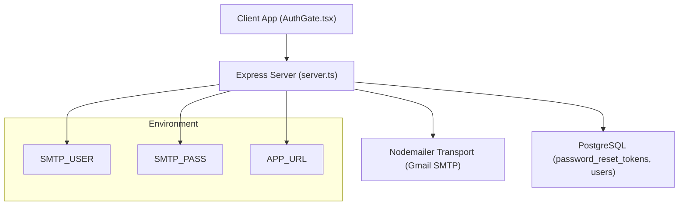
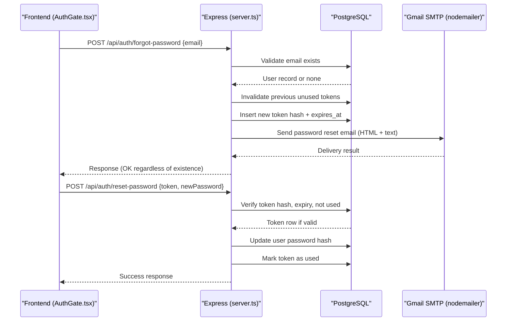
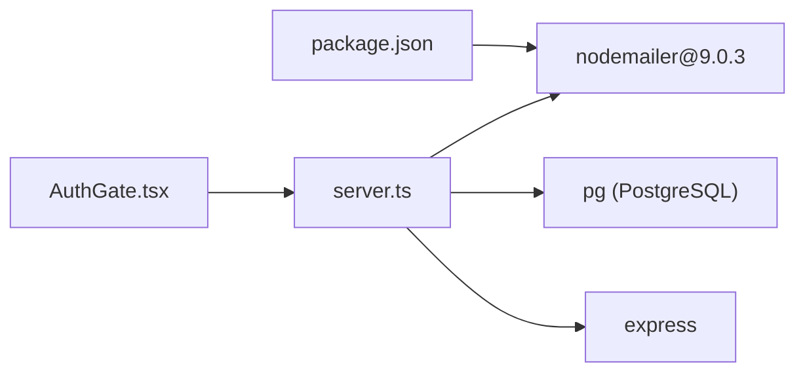

# Email Service Endpoints

<cite>
**Referenced Files in This Document**
- [server.ts](file://server.ts)
- [package.json](file://package.json)
- [scripts/setup-check.mjs](file://scripts/setup-check.mjs)
- [scripts/doctor.mjs](file://scripts/doctor.mjs)
- [src/components/AuthGate.tsx](file://src/components/AuthGate.tsx)
</cite>

## Table of Contents
1. [Introduction](#introduction)
2. [Project Structure](#project-structure)
3. [Core Components](#core-components)
4. [Architecture Overview](#architecture-overview)
5. [Detailed Component Analysis](#detailed-component-analysis)
6. [Dependency Analysis](#dependency-analysis)
7. [Performance Considerations](#performance-considerations)
8. [Troubleshooting Guide](#troubleshooting-guide)
9. [Conclusion](#conclusion)
10. [Appendices](#appendices)

## Introduction
This document explains the email service integration endpoints used for password reset flows, focusing on SMTP configuration with nodemailer and Gmail SMTP, transport setup, authentication, HTML email templates, secure token generation, expiration handling, error handling, and operational guidance. It also documents required environment variables and provides best practices to improve deliverability and monitor health.

## Project Structure
The email functionality is implemented server-side using Express and nodemailer. The key files include:
- Server routes and email logic: server.ts
- Dependencies declaration: package.json
- Environment variable documentation and checks: scripts/setup-check.mjs
- Health check utilities: scripts/doctor.mjs
- Frontend interactions for password reset: src/components/AuthGate.tsx

**Diagram sources**
- [server.ts:133-143](file://server.ts#L133-L143)
- [server.ts:145-207](file://server.ts#L145-L207)
- [server.ts:750-830](file://server.ts#L750-L830)
- [package.json:38](file://package.json#L38)
- [scripts/setup-check.mjs:94-116](file://scripts/setup-check.mjs#L94-L116)

**Section sources**
- [server.ts:133-143](file://server.ts#L133-L143)
- [server.ts:145-207](file://server.ts#L145-L207)
- [server.ts:750-830](file://server.ts#L750-L830)
- [package.json:38](file://package.json#L38)
- [scripts/setup-check.mjs:94-116](file://scripts/setup-check.mjs#L94-L116)

## Core Components
- SMTP Transport Setup: Creates a nodemailer transport configured for Gmail SMTP using STARTTLS on port 587.
- Password Reset Flow: Generates secure tokens, stores hashed tokens with expiration, sends an HTML email, and validates tokens when resetting passwords.
- Error Handling: Validates inputs, handles missing SMTP configuration, and returns appropriate HTTP responses.
- Environment Variables: Uses SMTP_USER, SMTP_PASS, and APP_URL to configure transport and build reset links.

Key responsibilities:
- createMailTransport(): Builds the nodemailer transport from environment variables.
- sendPasswordResetEmail(): Composes and sends the password reset email with HTML and plain text versions.
- /api/auth/forgot-password: Initiates token generation and email dispatch.
- /api/auth/reset-password: Validates token, updates user password, and invalidates the token.

**Section sources**
- [server.ts:133-143](file://server.ts#L133-L143)
- [server.ts:145-207](file://server.ts#L145-L207)
- [server.ts:750-830](file://server.ts#L750-L830)

## Architecture Overview
The password reset flow integrates frontend requests, Express routes, database operations, and email delivery via Gmail SMTP.

**Diagram sources**
- [server.ts:750-830](file://server.ts#L750-L830)
- [server.ts:145-207](file://server.ts#L145-L207)
- [src/components/AuthGate.tsx:93-115](file://src/components/AuthGate.tsx#L93-L115)

## Detailed Component Analysis

### SMTP Configuration and Transport Setup
- Transport creation reads SMTP_USER and SMTP_PASS from environment variables.
- Configured for Gmail SMTP host smtp.gmail.com, port 587, STARTTLS (secure: false).
- If credentials are missing, transport creation returns null and subsequent email sending throws an error.

Security considerations:
- Credentials must be set securely via environment variables.
- Avoid logging sensitive values; only log non-sensitive status messages.

Operational notes:
- Ensure Gmail account allows less secure apps or uses app-specific passwords where applicable.
- Use dedicated service accounts for production to avoid personal account limitations.

**Section sources**
- [server.ts:133-143](file://server.ts#L133-L143)

### Password Reset Email Functionality
- Endpoint /api/auth/forgot-password accepts an email, validates it, and ensures consistent responses even if the email does not exist to prevent enumeration.
- Token generation:
  - Raw token: crypto.randomBytes(32).toString("hex")
  - Stored token hash: SHA-256 digest of raw token
  - Expiration: 1 hour from insertion time
- Database operations:
  - Invalidate any previous unused tokens for the user before issuing a new one.
  - Insert new token hash with expires_at timestamp.
- Email composition:
  - From address uses SMTP_USER.
  - Subject indicates password reset purpose.
  - HTML template includes branding, instructions, CTA button, fallback link, and expiration notice.
  - Plain text alternative included for compatibility.

Expiration handling:
- Tokens expire after 1 hour; validation queries enforce expires_at > NOW().
- Used tokens are marked with used_at timestamp and cannot be reused.

**Section sources**
- [server.ts:750-830](file://server.ts#L750-L830)
- [server.ts:145-207](file://server.ts#L145-L207)

### Token Generation Algorithms and Security Best Practices
- Secure random token generation using Node.js crypto module.
- Hashing with SHA-256 before storage prevents exposure of raw tokens in the database.
- Enforce minimum token length validation on reset endpoint.
- Invalidate prior tokens to mitigate replay attacks.
- Clear session data upon successful password reset to force re-authentication.

Best practices:
- Use HTTPS for all endpoints to protect tokens in transit.
- Rate-limit forgot-password requests to reduce abuse.
- Monitor failed attempts and implement alerting for anomalies.

**Section sources**
- [server.ts:750-830](file://server.ts#L750-L830)

### Email Template Structure
- HTML template includes:
  - Dark theme styling with brand colors.
  - Clear call-to-action button linking to APP_URL with reset_token parameter.
  - Fallback plain text version for clients that do not render HTML.
  - Expiration notice and security disclaimer.
- Text template provides essential information without formatting.

Template rendering approach:
- Inline styles for broad email client compatibility.
- Minimal external dependencies to ensure reliable rendering.

**Section sources**
- [server.ts:145-207](file://server.ts#L145-L207)

### Email Sending Process and Error Handling
- sendPasswordResetEmail() constructs the message and calls transport.sendMail().
- Errors during transport creation or sending are caught and logged.
- Missing SMTP configuration results in immediate error propagation.
- HTTP responses provide generic messages to avoid leaking user existence.

Fallback mechanisms:
- Current implementation does not implement retry or alternate SMTP providers.
- Recommended enhancements include queueing and retry logic with exponential backoff.

**Section sources**
- [server.ts:145-207](file://server.ts#L145-L207)
- [server.ts:750-830](file://server.ts#L750-L830)

### Frontend Integration
- AuthGate component triggers password reset by calling /api/auth/reset-password with token and new password.
- Handles success and error states, redirects to login after successful update.

User experience:
- Clear feedback for validation errors and success messages.
- Loading indicators during submission.

**Section sources**
- [src/components/AuthGate.tsx:93-115](file://src/components/AuthGate.tsx#L93-L115)

## Dependency Analysis
- Nodemailer dependency declared in package.json enables email sending capabilities.
- Express server orchestrates routes, database interactions, and email delivery.
- PostgreSQL stores user records and password reset tokens with expiration timestamps.

**Diagram sources**
- [package.json:38](file://package.json#L38)
- [server.ts:1-15](file://server.ts#L1-L15)

**Section sources**
- [package.json:38](file://package.json#L38)
- [server.ts:1-15](file://server.ts#L1-L15)

## Performance Considerations
- Email sending is synchronous within request handling; consider offloading to a background job for high-volume scenarios.
- Database queries are minimal but should be indexed appropriately (e.g., user_id, token_hash, expires_at).
- Avoid heavy template rendering; inline styles minimize processing overhead.

Optimization opportunities:
- Implement connection pooling for SMTP if multiple emails are sent concurrently.
- Cache frequently accessed configuration values to reduce environment lookups.

[No sources needed since this section provides general guidance]

## Troubleshooting Guide
Common issues and resolutions:
- SMTP not configured: Ensure SMTP_USER and SMTP_PASS are set. Transport creation will fail otherwise.
- Gmail authentication failures: Verify app-specific passwords or enable necessary permissions in Gmail settings.
- Emails not delivered: Check spam filters, domain authentication (SPF/DKIM), and sender reputation.
- Token expiration: Users must request a new reset link if the token has expired.

Monitoring and health checks:
- Use scripts/doctor.mjs to verify SMTP configuration presence.
- Log email delivery outcomes and errors for observability.

Environment variable verification:
- scripts/setup-check.mjs lists SMTP_USER and SMTP_PASS under Email group.

**Section sources**
- [scripts/doctor.mjs:158-163](file://scripts/doctor.mjs#L158-L163)
- [scripts/setup-check.mjs:94-116](file://scripts/setup-check.mjs#L94-L116)

## Conclusion
The email service integration leverages nodemailer with Gmail SMTP to support secure password reset flows. Robust token generation, expiration handling, and comprehensive HTML templates ensure a reliable user experience. Proper configuration of environment variables and adherence to security best practices are critical for safe and effective email delivery. Future enhancements may include retry mechanisms, alternate SMTP providers, and advanced monitoring to improve resilience and observability.

[No sources needed since this section summarizes without analyzing specific files]

## Appendices

### Required Environment Variables
- SMTP_USER: Gmail SMTP username or API key for authentication.
- SMTP_PASS: Gmail SMTP password or app-specific password.
- APP_URL: Public application URL used to construct reset links in emails.

Additional notes:
- Ensure HTTPS is enforced for all endpoints.
- Rotate credentials regularly and use secrets management tools.

**Section sources**
- [scripts/setup-check.mjs:94-116](file://scripts/setup-check.mjs#L94-L116)

### Spam Prevention Techniques
- Use authenticated sender domains and configure SPF/DKIM/DMARC.
- Include clear unsubscribe options and maintain clean recipient lists.
- Avoid excessive promotional content in transactional emails like password resets.

[No sources needed since this section provides general guidance]

### Monitoring Email Service Health
- Integrate logging for email send successes and failures.
- Set up alerts for SMTP connection errors and rate limits.
- Periodically test email delivery with dummy recipients.

[No sources needed since this section provides general guidance]