# Middleware & Security

<cite>
**Referenced Files in This Document**
- [server.ts](file://server.ts)
- [index.ts](file://index.ts)
- [api/index.ts](file://api/index.ts)
- [package.json](file://package.json)
</cite>

## Table of Contents
1. [Introduction](#introduction)
2. [Project Structure](#project-structure)
3. [Core Components](#core-components)
4. [Architecture Overview](#architecture-overview)
5. [Detailed Component Analysis](#detailed-component-analysis)
6. [Dependency Analysis](#dependency-analysis)
7. [Performance Considerations](#performance-considerations)
8. [Troubleshooting Guide](#troubleshooting-guide)
9. [Conclusion](#conclusion)
10. [Appendices](#appendices)

## Introduction
This document explains the middleware chain and security implementation for the Express-based server. It covers session-based authentication (requireAuth), role-based authorization (requireAdmin), server-to-server API key authentication (requireApiKey), and WordPress plugin integration via a shared token (requireCrmToken). It also details session management with express-session and PostgreSQL storage, cookie configuration, input validation patterns, SQL injection prevention, XSS protection measures, error handling strategies, CORS considerations, rate limiting approaches, and API versioning strategies.

## Project Structure
The server is implemented as a single-file Express application with routes and middleware defined at module level. The entry points are:
- Development/standalone: server.ts initializes the Express app, registers middleware and routes, and binds the HTTP server.
- Vercel serverless: index.ts imports server.ts to register routes and export the Express app handler.
- API adapter: api/index.ts exports a handler that delegates requests to the Express app.

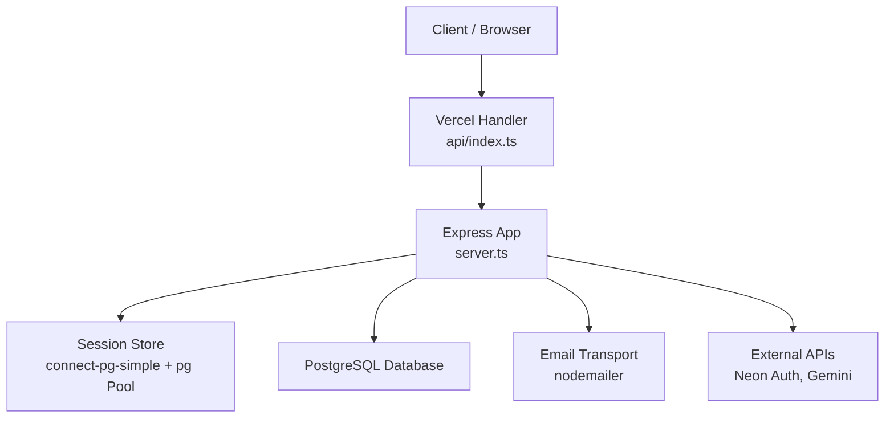

**Diagram sources**
- [index.ts:1-20](file://index.ts#L1-L20)
- [api/index.ts:1-5](file://api/index.ts#L1-L5)
- [server.ts:1-125](file://server.ts#L1-L125)

**Section sources**
- [index.ts:1-20](file://index.ts#L1-L20)
- [api/index.ts:1-5](file://api/index.ts#L1-L5)
- [server.ts:1-125](file://server.ts#L1-L125)

## Core Components
- Authentication middleware: requireAuth checks for a valid session userId.
- Authorization middleware: requireAdmin validates current user role by querying the database on each request.
- Server-to-server authentication: requireApiKey validates an API key header against an environment variable.
- WordPress integration: requireCrmToken validates a shared internal token header against an environment variable.
- Session management: express-session configured with connect-pg-simple using a PostgreSQL pool; secure cookie settings applied.
- Input validation: strict type checks and regex validation for usernames and emails; password length enforcement.
- SQL injection prevention: parameterized queries throughout all database operations.
- XSS protection: httpOnly cookies, sameSite policy, and no direct rendering of untrusted content.
- Error handling: consistent JSON error responses, try/catch blocks, and safe fallbacks.

**Section sources**
- [server.ts:209-264](file://server.ts#L209-L264)
- [server.ts:112-125](file://server.ts#L112-L125)
- [server.ts:266-381](file://server.ts#L266-L381)
- [server.ts:750-830](file://server.ts#L750-L830)

## Architecture Overview
The request flow passes through global middleware (body parsing, session) before reaching route-specific middleware (auth/authz) and handlers. Sessions are persisted in PostgreSQL. Role checks re-query the database to ensure immediate effect of role changes.

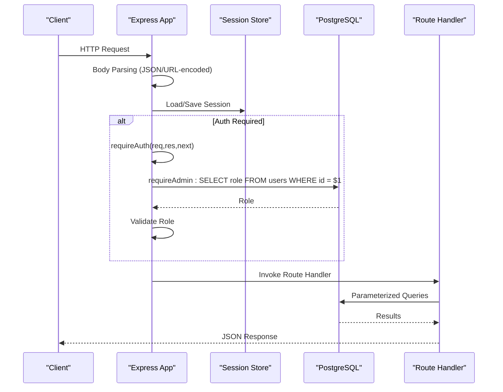

**Diagram sources**
- [server.ts:79-125](file://server.ts#L79-L125)
- [server.ts:209-264](file://server.ts#L209-L264)
- [server.ts:832-851](file://server.ts#L832-L851)

## Detailed Component Analysis

### requireAuth Middleware (Session-Based Authentication)
- Purpose: Ensure the request has an authenticated session by checking req.session.userId.
- Behavior: If missing, returns 401 with a JSON error; otherwise calls next().
- Usage: Applied to routes that require login (e.g., lead ingestion endpoints).

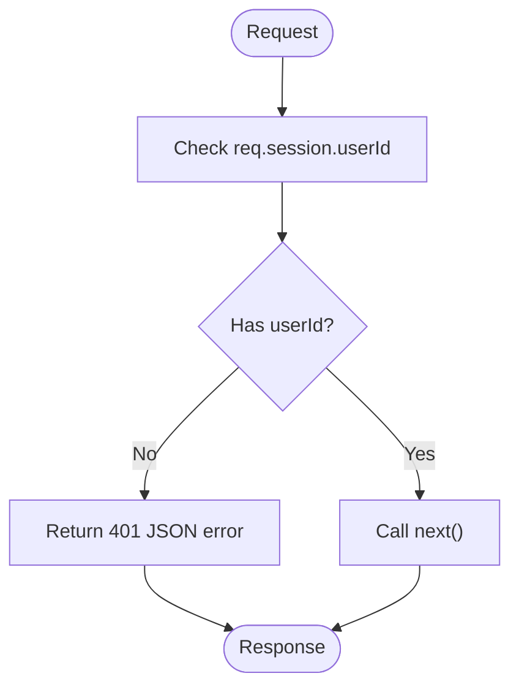

**Diagram sources**
- [server.ts:209-214](file://server.ts#L209-L214)

**Section sources**
- [server.ts:209-214](file://server.ts#L209-L214)

### requireAdmin Middleware (Role-Based Authorization)
- Purpose: Enforce admin-only access by verifying the current user’s role from the database.
- Behavior:
  - If no session userId, returns 401.
  - Queries the database for the user’s role.
  - If not admin, returns 403 with a JSON error.
  - Updates session.role to reflect the latest role.
- Rationale: Re-checking the role per request ensures immediate effect of role changes without requiring re-login.

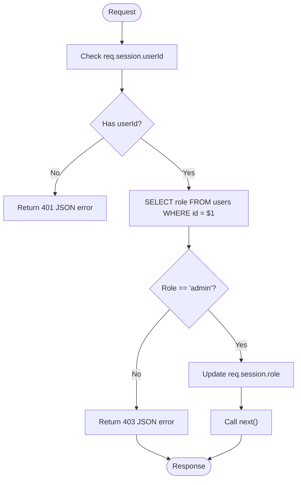

**Diagram sources**
- [server.ts:216-235](file://server.ts#L216-L235)

**Section sources**
- [server.ts:216-235](file://server.ts#L216-L235)

### requireApiKey Middleware (Server-to-Server Authentication)
- Purpose: Protect internal APIs used by another service (e.g., Hermes → AI Prospector).
- Behavior: Validates the x-api-key header against an environment variable; returns 401 if invalid or missing.

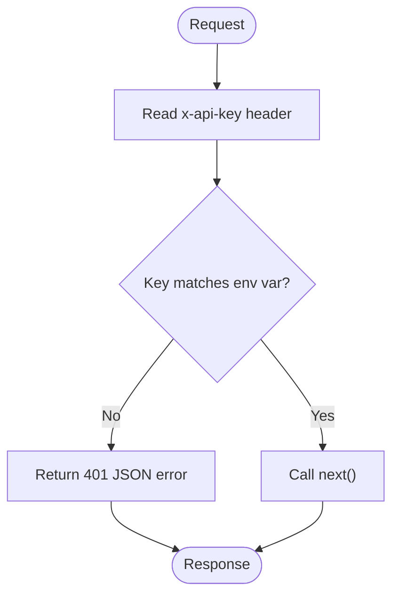

**Diagram sources**
- [server.ts:240-246](file://server.ts#L240-L246)

**Section sources**
- [server.ts:240-246](file://server.ts#L240-L246)

### requireCrmToken Middleware (WordPress Plugin Integration)
- Purpose: Secure webhook endpoints called by the WordPress plugin using a shared internal token.
- Behavior:
  - Reads x-crm-token header.
  - Fails closed with 503 if CRM_INTERNAL_TOKEN is not configured.
  - Returns 401 if token is missing or mismatched.

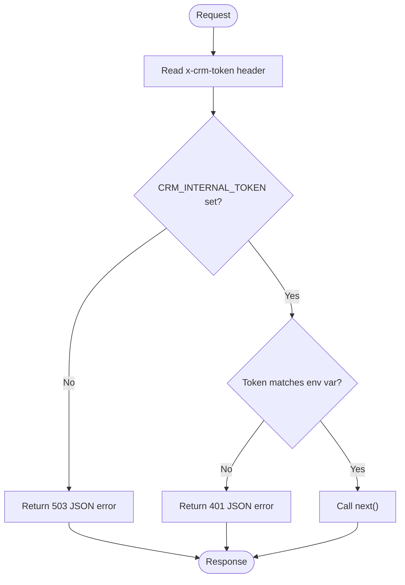

**Diagram sources**
- [server.ts:253-264](file://server.ts#L253-L264)

**Section sources**
- [server.ts:253-264](file://server.ts#L253-L264)

### Session Management with express-session and PostgreSQL Storage
- Configuration:
  - Secret derived from SESSION_SECRET with a development fallback warning.
  - Cookie options: httpOnly true, secure enabled in production, sameSite lax, maxAge 7 days.
  - Store: connect-pg-simple using a PostgreSQL pool; table name “session”, auto-create if missing.
- Session lifecycle:
  - regenerate() used after login/register to prevent fixation.
  - save() persists session data; a timeout guard ensures response even if store callback stalls.
- Security implications:
  - httpOnly prevents client-side script access.
  - secure ensures cookies only over HTTPS in production.
  - sameSite lax mitigates CSRF for cross-site requests.

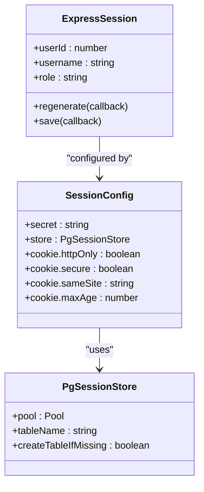

**Diagram sources**
- [server.ts:107-125](file://server.ts#L107-L125)
- [server.ts:24-34](file://server.ts#L24-L34)
- [server.ts:547-591](file://server.ts#L547-L591)

**Section sources**
- [server.ts:107-125](file://server.ts#L107-L125)
- [server.ts:24-34](file://server.ts#L24-L34)
- [server.ts:547-591](file://server.ts#L547-L591)

### Input Validation Patterns
- Username/email validation:
  - Regex enforces allowed characters and length for username field.
  - Email format validated where applicable.
- Password validation:
  - Minimum length enforced.
- Body parsing:
  - express.json() and express.urlencoded({ extended: false }) parse payloads safely.
- Example usage:
  - Registration and login endpoints validate types and formats before DB operations.

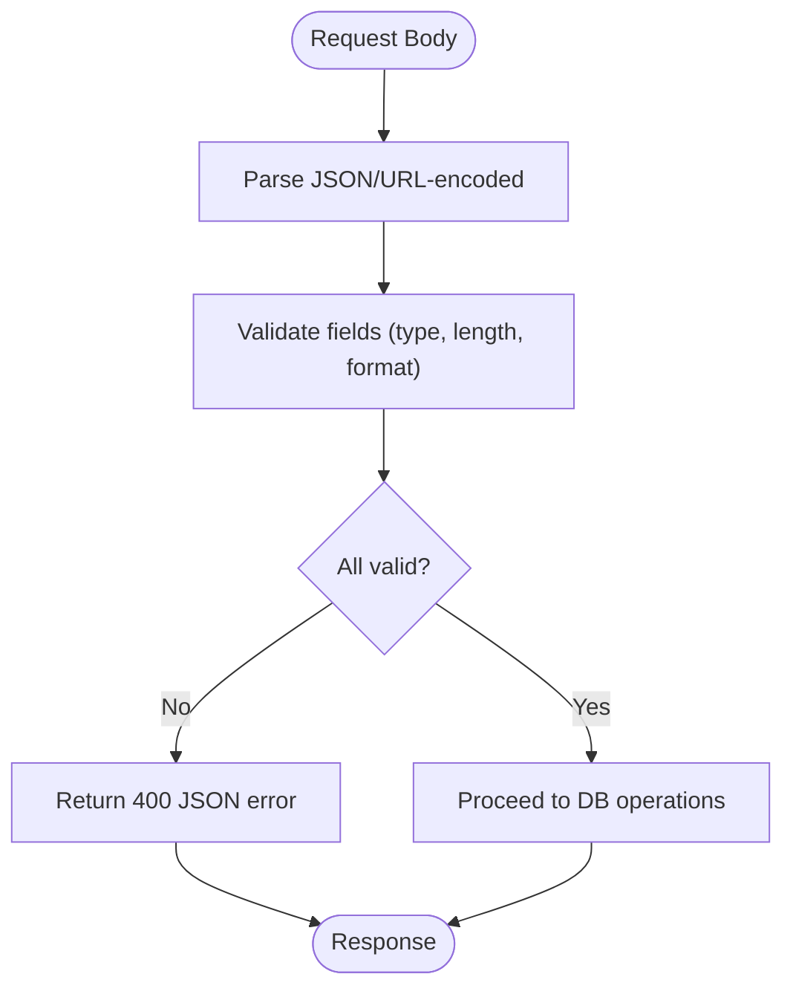

**Diagram sources**
- [server.ts:79-80](file://server.ts#L79-L80)
- [server.ts:266-286](file://server.ts#L266-L286)
- [server.ts:340-359](file://server.ts#L340-L359)

**Section sources**
- [server.ts:79-80](file://server.ts#L79-L80)
- [server.ts:266-286](file://server.ts#L266-L286)
- [server.ts:340-359](file://server.ts#L340-L359)

### SQL Injection Prevention
- All database queries use parameterized statements with placeholders ($1, $2, etc.).
- Values are passed as arrays to prevent injection.
- Examples include registration, login, role checks, and CRUD operations.

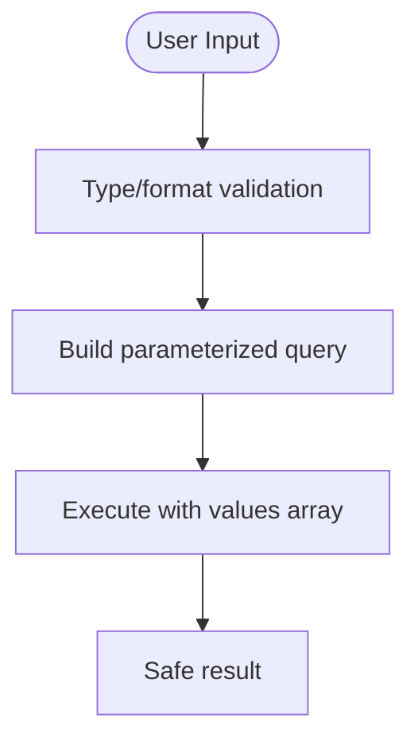

**Diagram sources**
- [server.ts:279-286](file://server.ts#L279-L286)
- [server.ts:348-351](file://server.ts#L348-L351)
- [server.ts:832-851](file://server.ts#L832-L851)

**Section sources**
- [server.ts:279-286](file://server.ts#L279-L286)
- [server.ts:348-351](file://server.ts#L348-L351)
- [server.ts:832-851](file://server.ts#L832-L851)

### XSS Protection Measures
- Cookies are httpOnly to prevent client-side script access.
- sameSite lax reduces cross-site request risks.
- No direct rendering of untrusted content; responses are JSON.
- Password reset tokens are hashed before storage and compared securely.

**Section sources**
- [server.ts:119-122](file://server.ts#L119-L122)
- [server.ts:775-782](file://server.ts#L775-L782)

### Custom Middleware Implementation Examples
- requireAuth: checks session presence.
- requireAdmin: verifies role via DB lookup.
- requireApiKey: validates API key header.
- requireCrmToken: validates shared token header and fails closed if misconfigured.

**Section sources**
- [server.ts:209-264](file://server.ts#L209-L264)

### Error Handling Strategies
- Consistent JSON error responses with descriptive messages.
- try/catch blocks around async operations.
- Safe fallbacks for external services (e.g., AI provider quota handling).
- Timeout guard for session persistence to avoid hanging responses.

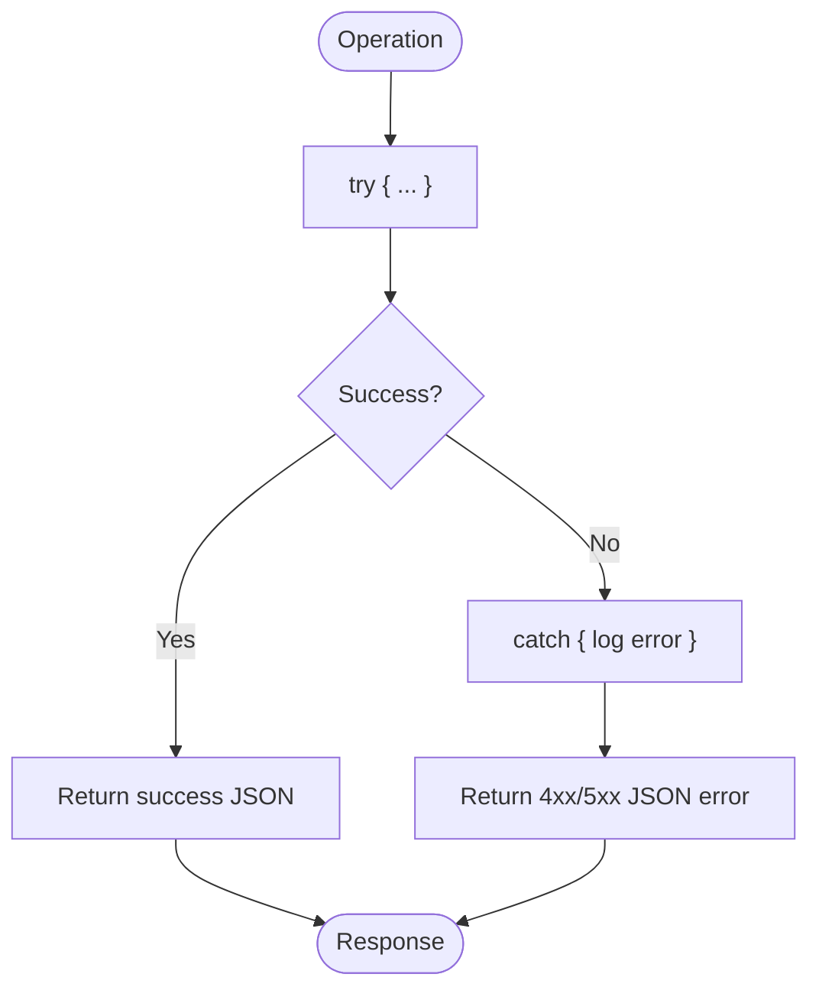

**Diagram sources**
- [server.ts:334-338](file://server.ts#L334-L338)
- [server.ts:377-381](file://server.ts#L377-L381)
- [server.ts:547-591](file://server.ts#L547-L591)

**Section sources**
- [server.ts:334-338](file://server.ts#L334-L338)
- [server.ts:377-381](file://server.ts#L377-L381)
- [server.ts:547-591](file://server.ts#L547-L591)

### CORS Configuration
- Not explicitly configured in the server code. Requests rely on default Express behavior.
- For cross-origin browser requests, consider adding cors middleware and configuring allowed origins, methods, and headers.

[No sources needed since this section provides general guidance]

### Rate Limiting Approaches
- Not implemented in the server code.
- Recommended approach: integrate a rate limiter (e.g., express-rate-limit) to protect endpoints like login and registration.

[No sources needed since this section provides general guidance]

### API Versioning Strategies
- Not implemented in the server code.
- Recommended approach: prefix routes with version segments (e.g., /api/v1/) to manage backward compatibility.

[No sources needed since this section provides general guidance]

## Dependency Analysis
Key dependencies involved in middleware and security:
- express: HTTP server and middleware framework.
- express-session: session management.
- connect-pg-simple: PostgreSQL-backed session store.
- pg: PostgreSQL client.
- bcryptjs: password hashing.
- nodemailer: email transport for password resets.
- crypto: secure token generation and hashing.

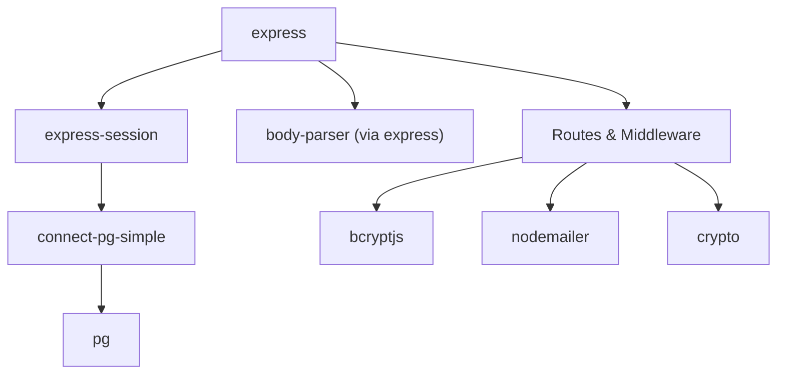

**Diagram sources**
- [package.json:15-45](file://package.json#L15-L45)
- [server.ts:1-15](file://server.ts#L1-L15)

**Section sources**
- [package.json:15-45](file://package.json#L15-L45)
- [server.ts:1-15](file://server.ts#L1-L15)

## Performance Considerations
- Parameterized queries reduce overhead and improve safety.
- Session regeneration avoids fixation attacks but adds DB writes; ensure efficient session store configuration.
- Role checks query the DB on each request; consider caching roles with short TTL if appropriate, while balancing consistency needs.
- External API calls (e.g., AI providers) have retry/fallback logic to mitigate latency and quota limits.

[No sources needed since this section provides general guidance]

## Troubleshooting Guide
Common issues and resolutions:
- Missing SESSION_SECRET: A development fallback is used with a warning; configure a strong secret in production.
- DATABASE_URL not set: Mock pool and memory store are used; ensure proper DB configuration for production.
- Session save timeouts: A timeout guard sends a response even if session persistence stalls; investigate DB connectivity.
- Token misconfiguration: requireCrmToken returns 503 if CRM_INTERNAL_TOKEN is missing; verify environment variables.

**Section sources**
- [server.ts:107-110](file://server.ts#L107-L110)
- [server.ts:35-36](file://server.ts#L35-L36)
- [server.ts:547-591](file://server.ts#L547-L591)
- [server.ts:253-264](file://server.ts#L253-L264)

## Conclusion
The server implements a robust middleware chain for authentication, authorization, and server-to-server verification. Sessions are securely managed with PostgreSQL persistence and hardened cookie settings. Input validation and parameterized queries mitigate common vulnerabilities. While CORS, rate limiting, and API versioning are not implemented, they can be added following recommended practices to further harden the system.

[No sources needed since this section summarizes without analyzing specific files]

## Appendices

### Entry Points and Deployment
- Standalone server: server.ts initializes and binds the HTTP server.
- Vercel serverless: index.ts imports server.ts and exports the Express app.
- API adapter: api/index.ts delegates requests to the Express app.

**Section sources**
- [index.ts:1-20](file://index.ts#L1-L20)
- [api/index.ts:1-5](file://api/index.ts#L1-L5)
- [server.ts:5088-5169](file://server.ts#L5088-L5169)