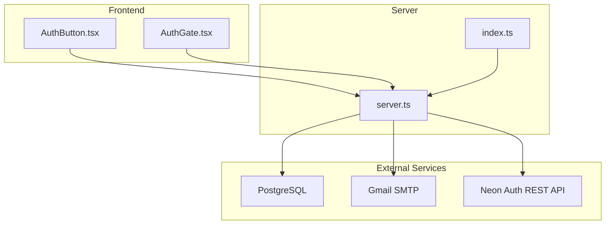
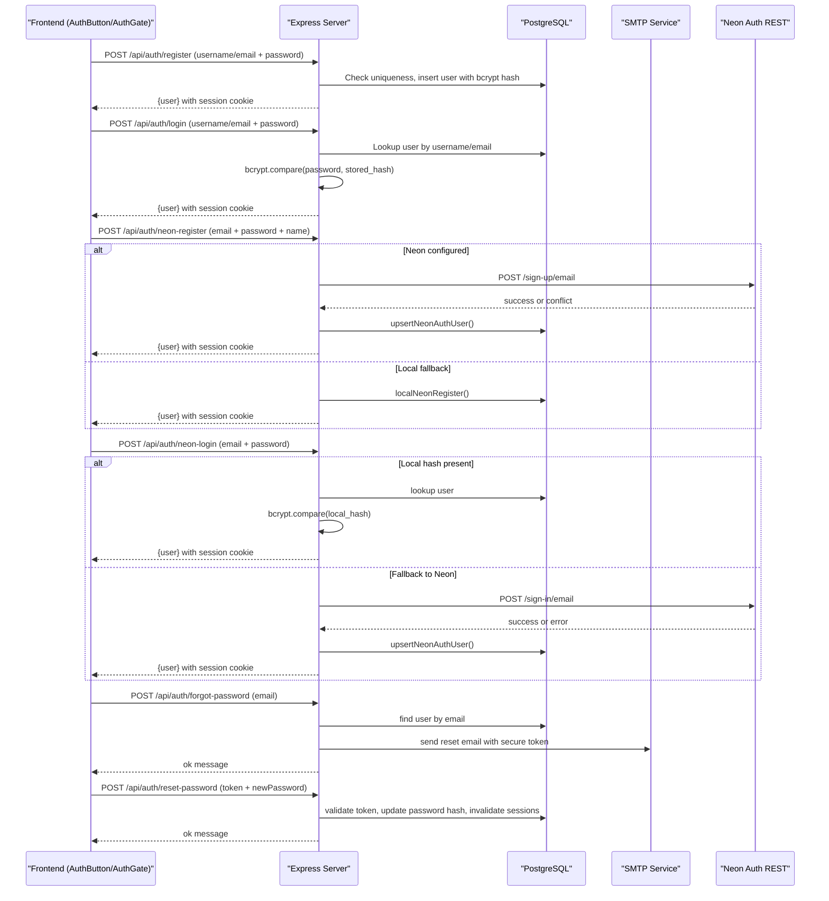
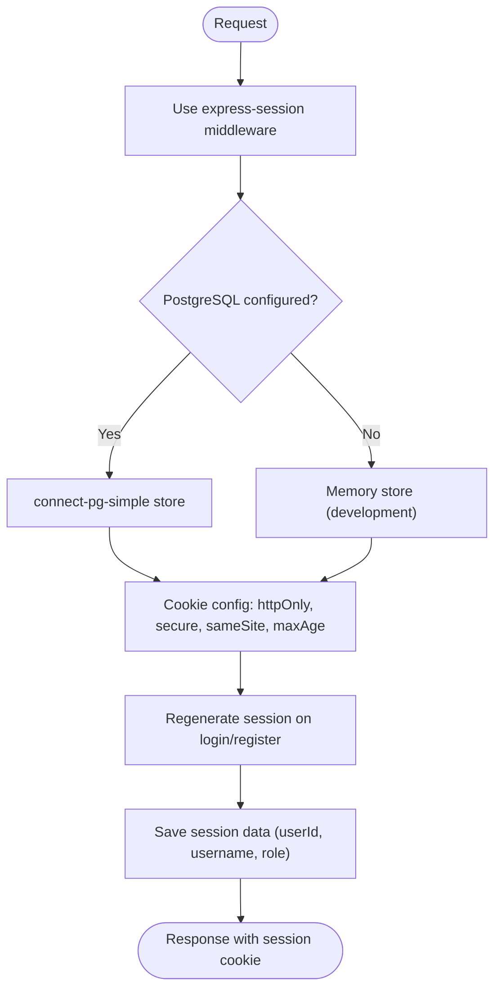
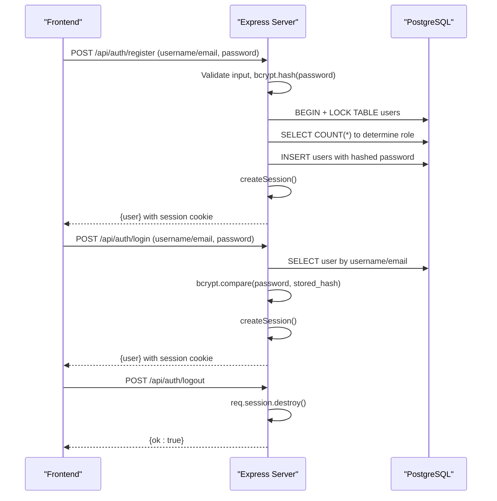
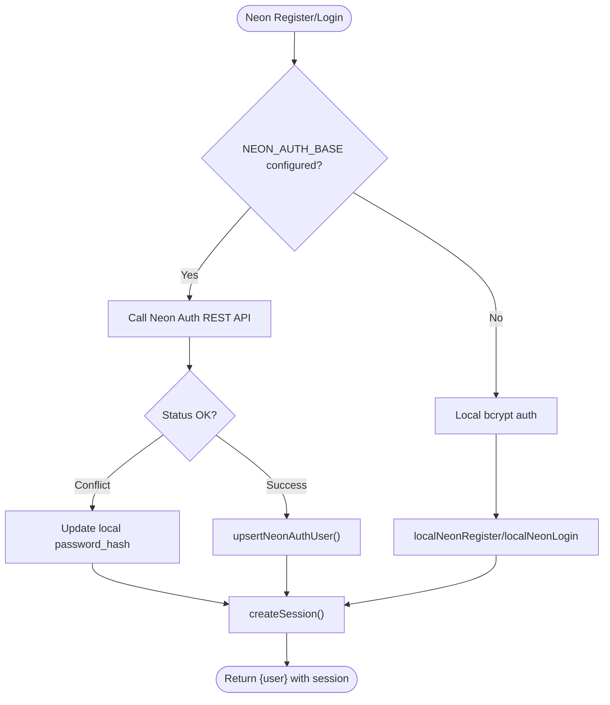
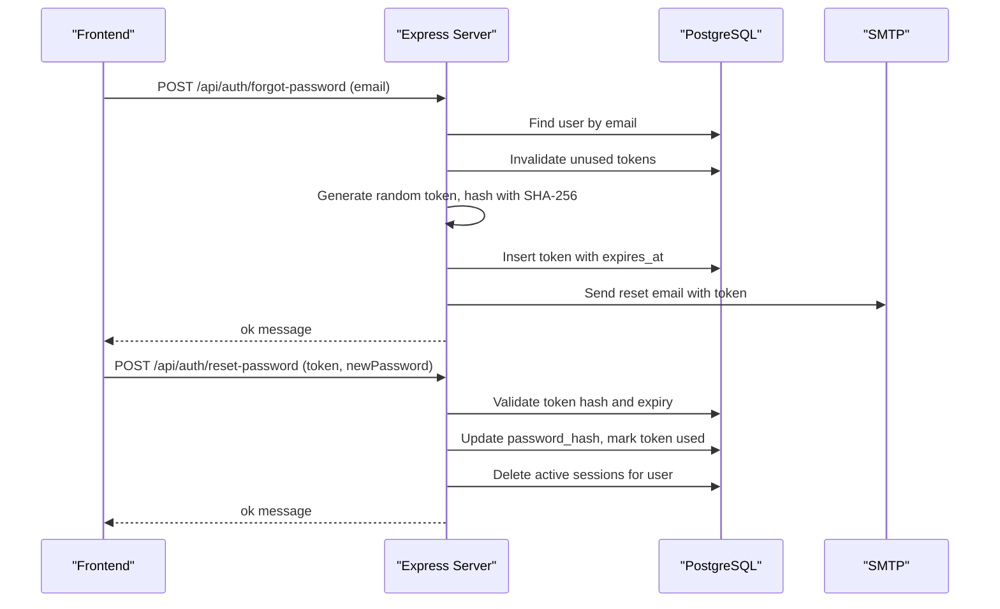
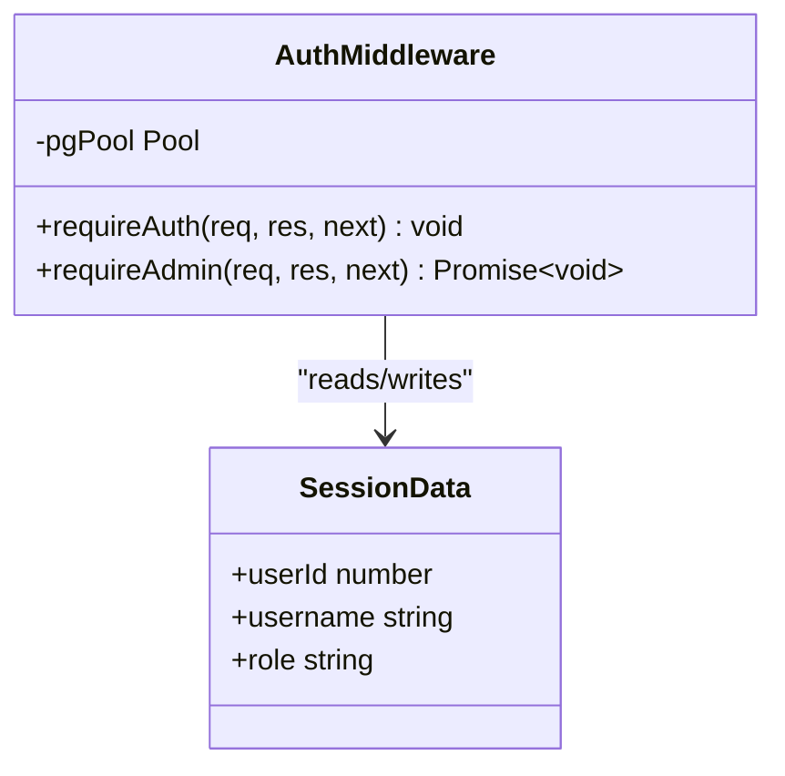
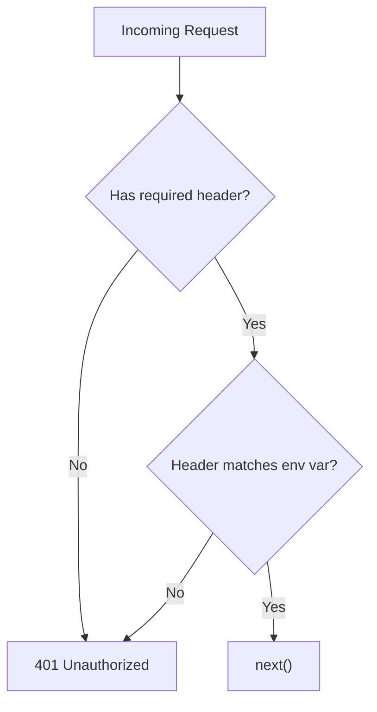
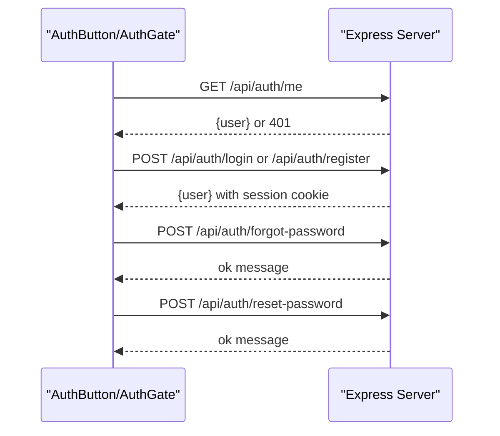
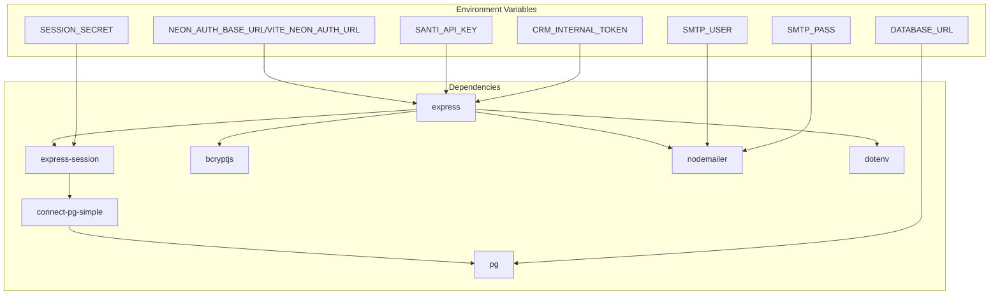

# Authentication System

<cite>
**Referenced Files in This Document**
- [server.ts](file://server.ts)
- [index.ts](file://index.ts)
- [AuthButton.tsx](file://src/components/AuthButton.tsx)
- [AuthGate.tsx](file://src/components/AuthGate.tsx)
- [package.json](file://package.json)
- [generate-env.mjs](file://scripts/generate-env.mjs)
- [sync-secrets.mjs](file://scripts/sync-secrets.mjs)
</cite>

## Table of Contents
1. [Introduction](#introduction)
2. [Project Structure](#project-structure)
3. [Core Components](#core-components)
4. [Architecture Overview](#architecture-overview)
5. [Detailed Component Analysis](#detailed-component-analysis)
6. [Dependency Analysis](#dependency-analysis)
7. [Performance Considerations](#performance-considerations)
8. [Troubleshooting Guide](#troubleshooting-guide)
9. [Conclusion](#conclusion)

## Introduction
This document explains the authentication system implemented in the project. It covers:
- Traditional username/password authentication with bcrypt hashing
- Neon Auth integration for email-based sign-up/sign-in with local fallback
- Session management using express-session backed by PostgreSQL via connect-pg-simple
- Role-based authorization middleware (requireAuth and requireAdmin)
- API key authentication for server-to-server communication
- Password reset flow with secure tokens and email delivery
- Security considerations including cookie configuration, session persistence, and concurrent user creation safeguards

The content is designed to be accessible to beginners while providing sufficient technical depth for experienced developers.

## Project Structure
Authentication-related code spans the Express server implementation and React components that interact with it:
- Server-side endpoints and middleware are defined in a single file
- The Vercel entry point initializes database tables and exports the Express app
- Frontend components provide login/register/forgot-password/reset UIs and call the appropriate endpoints

**Diagram sources**
- [server.ts:1-125](file://server.ts#L1-L125)
- [index.ts:1-20](file://index.ts#L1-L20)
- [AuthButton.tsx:1-120](file://src/components/AuthButton.tsx#L1-L120)
- [AuthGate.tsx:1-120](file://src/components/AuthGate.tsx#L1-L120)

**Section sources**
- [server.ts:1-125](file://server.ts#L1-L125)
- [index.ts:1-20](file://index.ts#L1-L20)

## Core Components
- Session configuration and store setup
- Traditional auth endpoints (register, login, logout)
- Neon Auth integration endpoints (neon-register, neon-login)
- Password reset endpoints (forgot-password, reset-password)
- Authorization middleware (requireAuth, requireAdmin)
- API key and CRM token middleware for server-to-server calls

Key responsibilities:
- Validate inputs and enforce password policies
- Hash passwords securely with bcrypt
- Manage sessions with regeneration on login/registration
- Persist sessions in PostgreSQL for reliability
- Provide role checks against the database on each request
- Support both email-based Neon Auth and local fallback

**Section sources**
- [server.ts:99-125](file://server.ts#L99-L125)
- [server.ts:209-264](file://server.ts#L209-L264)
- [server.ts:266-392](file://server.ts#L266-L392)
- [server.ts:394-748](file://server.ts#L394-L748)
- [server.ts:750-830](file://server.ts#L750-L830)
- [server.ts:832-851](file://server.ts#L832-L851)

## Architecture Overview
The authentication architecture combines multiple providers and mechanisms:
- Traditional username/password stored as bcrypt hashes in PostgreSQL
- Neon Auth integration for email-based identity verification, with local fallback when Neon is unavailable or when local hash exists
- Sessions managed via express-session with PostgreSQL-backed storage
- Role-based access enforced through middleware that queries the current role from the database on each request
- Server-to-server APIs protected by API keys and shared tokens

**Diagram sources**
- [server.ts:266-392](file://server.ts#L266-L392)
- [server.ts:394-748](file://server.ts#L394-L748)
- [server.ts:750-830](file://server.ts#L750-L830)
- [server.ts:832-851](file://server.ts#L832-L851)

## Detailed Component Analysis

### Session Management with express-session
- Session secret is loaded from environment variables; a development fallback is used if not set
- Cookie settings: httpOnly enabled, secure flag based on NODE_ENV, sameSite lax, maxAge 7 days
- Session store uses connect-pg-simple to persist sessions in PostgreSQL; table created automatically if missing
- Session regeneration occurs after successful login/registration to prevent fixation attacks
- A shared helper ensures consistent session creation with timeout protection

**Diagram sources**
- [server.ts:24-35](file://server.ts#L24-L35)
- [server.ts:107-125](file://server.ts#L107-L125)
- [server.ts:547-591](file://server.ts#L547-L591)

**Section sources**
- [server.ts:24-35](file://server.ts#L24-L35)
- [server.ts:107-125](file://server.ts#L107-L125)
- [server.ts:547-591](file://server.ts#L547-L591)

### Traditional Username/Password Authentication
- Registration validates username/email format and password length, then hashes the password with bcrypt
- Concurrent registration uses a transaction and table lock to ensure only the first user becomes admin
- Login accepts either username or email, performs bcrypt comparison with constant-time check to avoid timing attacks
- Logout destroys the session and clears the session cookie

**Diagram sources**
- [server.ts:266-338](file://server.ts#L266-L338)
- [server.ts:340-392](file://server.ts#L340-L392)
- [server.ts:547-591](file://server.ts#L547-L591)

**Section sources**
- [server.ts:266-338](file://server.ts#L266-L338)
- [server.ts:340-392](file://server.ts#L340-L392)
- [server.ts:547-591](file://server.ts#L547-L591)

### Neon Auth Integration
- When Neon Auth is configured, registration proxies to Neon’s REST API, stores a local bcrypt hash for fallback, and upserts the user into the local database
- Login first tries local bcrypt verification for performance; falls back to Neon Auth if no local hash exists
- Handles conflicts (already registered) and email-not-verified scenarios gracefully
- Upserts user records with neon_auth_id linkage and maintains role consistency

**Diagram sources**
- [server.ts:394-470](file://server.ts#L394-L470)
- [server.ts:472-524](file://server.ts#L472-L524)
- [server.ts:594-680](file://server.ts#L594-L680)
- [server.ts:682-748](file://server.ts#L682-L748)

**Section sources**
- [server.ts:394-470](file://server.ts#L394-L470)
- [server.ts:472-524](file://server.ts#L472-L524)
- [server.ts:594-680](file://server.ts#L594-L680)
- [server.ts:682-748](file://server.ts#L682-L748)

### Password Reset Flow
- Forgot password endpoint validates email, generates a secure random token, stores its SHA-256 hash with expiration, and sends an email via SMTP
- Reset password endpoint validates the token, updates the password hash, invalidates previous tokens, and destroys active sessions for security
- Email template includes a secure link with the raw token; the server only stores the hash

**Diagram sources**
- [server.ts:750-830](file://server.ts#L750-L830)

**Section sources**
- [server.ts:750-830](file://server.ts#L750-L830)

### Role-Based Authorization Middleware
- requireAuth checks for a valid session userId
- requireAdmin verifies the current role from the database on each request, ensuring immediate effect of role changes
- Both middleware return appropriate HTTP status codes for unauthorized/forbidden scenarios

**Diagram sources**
- [server.ts:209-235](file://server.ts#L209-L235)

**Section sources**
- [server.ts:209-235](file://server.ts#L209-L235)

### API Key Authentication for Server-to-Server Communication
- requireApiKey validates the x-api-key header against an environment variable
- requireCrmToken validates the x-crm-token header for WordPress plugin integration
- Both fail closed when configuration is missing to prevent silent failures

**Diagram sources**
- [server.ts:240-264](file://server.ts#L240-L264)

**Section sources**
- [server.ts:240-264](file://server.ts#L240-L264)

### Frontend Authentication Components
- AuthButton provides a modal interface for login/register/forgot-password with Supabase integration when available
- AuthGate offers a full-screen authentication page with support for password reset flows
- Both components handle session checking via /api/auth/me and dispatch events to refresh UI state

**Diagram sources**
- [AuthButton.tsx:28-145](file://src/components/AuthButton.tsx#L28-L145)
- [AuthGate.tsx:46-115](file://src/components/AuthGate.tsx#L46-L115)

**Section sources**
- [AuthButton.tsx:28-145](file://src/components/AuthButton.tsx#L28-L145)
- [AuthGate.tsx:46-115](file://src/components/AuthGate.tsx#L46-L115)

## Dependency Analysis
The authentication system depends on several key packages and services:

**Diagram sources**
- [package.json:15-45](file://package.json#L15-L45)
- [server.ts:1-15](file://server.ts#L1-L15)
- [server.ts:24-35](file://server.ts#L24-L35)
- [server.ts:107-125](file://server.ts#L107-L125)

**Section sources**
- [package.json:15-45](file://package.json#L15-L45)
- [server.ts:1-15](file://server.ts#L1-L15)
- [server.ts:24-35](file://server.ts#L24-L35)
- [server.ts:107-125](file://server.ts#L107-L125)

## Performance Considerations
- Local bcrypt verification is prioritized in Neon login to avoid external API latency
- Database connection pooling is configured for production environments
- Session store uses PostgreSQL for reliability and scalability
- Input validation reduces unnecessary database queries
- Transaction locks prevent race conditions during concurrent user creation

[No sources needed since this section provides general guidance]

## Troubleshooting Guide
Common issues and their solutions:

### Session Persistence Problems
- Ensure DATABASE_URL is properly configured for production deployments
- Verify SESSION_SECRET is set in production environments
- Check PostgreSQL connectivity and permissions for the session table

### Concurrent User Creation Conflicts
- The system uses database transactions and table locks to prevent duplicate admin accounts
- Monitor database logs for lock contention during high-registration periods

### Credential Validation Issues
- Username/email validation regex ensures proper format handling
- Password length validation prevents weak credentials
- bcrypt comparison uses constant-time operations to prevent timing attacks

### CSRF Protection
- No explicit CSRF middleware is implemented; consider adding csurf for additional protection
- SameSite cookie configuration provides basic cross-site request protection

### Rate Limiting
- No rate limiting middleware is currently implemented
- Consider adding express-rate-limit to prevent brute force attacks

**Section sources**
- [server.ts:24-35](file://server.ts#L24-L35)
- [server.ts:107-125](file://server.ts#L107-L125)
- [server.ts:266-338](file://server.ts#L266-L338)
- [server.ts:340-392](file://server.ts#L340-L392)

## Conclusion
The authentication system provides a robust foundation supporting multiple authentication providers, secure session management, and role-based authorization. The implementation balances security best practices with practical considerations for development and production environments. Key strengths include:

- Multi-provider support with graceful fallbacks
- Secure password handling with bcrypt
- Reliable session persistence via PostgreSQL
- Comprehensive role-based access control
- Secure password reset functionality

For production deployments, consider implementing additional security measures such as CSRF protection, rate limiting, and enhanced monitoring. The modular design allows for easy extension with additional authentication providers or security features.

[No sources needed since this section summarizes without analyzing specific files]