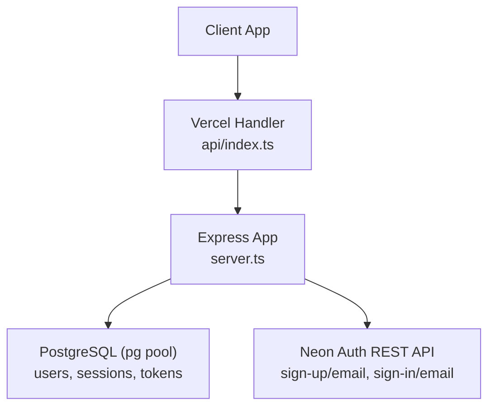
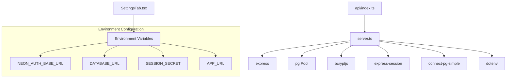

# Neon Auth Integration

<cite>
**Referenced Files in This Document**
- [server.ts](file://server.ts)
- [api/index.ts](file://api/index.ts)
- [package.json](file://package.json)
- [src/components/SettingsTab.tsx](file://src/components/SettingsTab.tsx)
- [scripts/sync-secrets.mjs](file://scripts/sync-secrets.mjs)
</cite>

## Table of Contents
1. [Introduction](#introduction)
2. [Project Structure](#project-structure)
3. [Core Components](#core-components)
4. [Architecture Overview](#architecture-overview)
5. [Detailed Component Analysis](#detailed-component-analysis)
6. [Dependency Analysis](#dependency-analysis)
7. [Performance Considerations](#performance-considerations)
8. [Troubleshooting Guide](#troubleshooting-guide)
9. [Conclusion](#conclusion)
10. [Appendices](#appendices)

## Introduction
This document explains the Neon Auth integration system implemented in the application. It covers a dual-path authentication architecture that supports:
- Neon Auth as an identity provider via REST endpoints
- Local fallback mode using bcrypt when Neon Auth is unavailable or not configured

The system provides registration and login flows with robust error handling, upsert synchronization between Neon Auth and a local users table, and session persistence via Express sessions backed by PostgreSQL.

## Project Structure
At runtime, the server exposes Express routes for authentication and proxies calls to Neon Auth when configured. The Vercel entry point initializes database tables and exports the Express app.



**Diagram sources**
- [api/index.ts:1-20](file://api/index.ts#L1-L20)
- [server.ts:1-125](file://server.ts#L1-L125)

**Section sources**
- [api/index.ts:1-20](file://api/index.ts#L1-L20)
- [server.ts:1-125](file://server.ts#L1-L125)

## Core Components
- Dual-path auth endpoints:
  - POST /api/auth/neon-register
  - POST /api/auth/neon-login
- Upsert mechanism to synchronize user data across Neon Auth and local users table
- Session creation helper with timeout guard for resilience
- Local-only fallback functions for register/login when Neon Auth is not configured

Key responsibilities:
- Validate inputs and enforce password policies
- Call Neon Auth REST endpoints when NEON_AUTH_BASE_URL is set
- Handle existing user scenarios (409/422) during registration
- Prefer local bcrypt verification on login for performance
- Maintain neon_auth_id references and email/password sync

**Section sources**
- [server.ts:394-748](file://server.ts#L394-L748)

## Architecture Overview
The system implements a dual-path strategy:
- Path A (Neon Auth): When NEON_AUTH_BASE_URL is configured, requests are proxied to Neon Auth’s REST API. On success, the local users table is upserted to keep CRM roles and identities in sync.
- Path B (Local fallback): If NEON_AUTH_BASE_URL is not configured, registration and login use local bcrypt hashing against the users table.

```mermaid
sequenceDiagram
participant C as "Client"
participant S as "Server (server.ts)"
participant N as "Neon Auth REST"
participant D as "PostgreSQL"
Note over C,S : Registration Flow
C->>S : POST /api/auth/neon-register {email,password,name}
alt NEON_AUTH_BASE_URL configured
S->>N : POST /sign-up/email
N-->>S : 200 OK or 409/422 (existing)
opt 409/422 detected
S->>D : Update local password_hash if needed
S-->>C : 200 OK with user
else Success
S->>D : upsertNeonAuthUser(...)
S-->>C : 201 Created with user
end
else Fallback
S->>D : Create user with bcrypt hash
S-->>C : 201 Created with user
end
Note over C,S : Login Flow
C->>S : POST /api/auth/neon-login {email,password}
S->>D : SELECT user by email
alt Local hash present
S->>S : bcrypt.compare(password, hash)
alt Valid
S-->>C : 200 OK with user
else Invalid
S-->>C : 401 Unauthorized
end
else No local hash and Neon Auth configured
S->>N : POST /sign-in/email
N-->>S : 200 OK or error
alt Success
S->>D : upsertNeonAuthUser(...)
S-->>C : 200 OK with user
else Error
S-->>C : 401/403 with error message
end
else Fallback
S-->>C : 401 Unauthorized
end
```

**Diagram sources**
- [server.ts:594-680](file://server.ts#L594-L680)
- [server.ts:683-748](file://server.ts#L683-L748)

## Detailed Component Analysis

### Registration Endpoint (/api/auth/neon-register)
Behavior:
- Validates email format and password length
- If NEON_AUTH_BASE_URL is set:
  - Hashes password locally for fallback capability
  - Calls Neon Auth /sign-up/email
  - Handles 409/422 responses indicating existing user; updates local password_hash and creates session
  - On success, upserts user into local users table and creates session
- If NEON_AUTH_BASE_URL is not set:
  - Uses localNeonRegister to create user with bcrypt hash

Error handling:
- Returns appropriate HTTP status codes (400, 409, 422, 500)
- Logs detailed Neon Auth response for debugging

Session creation:
- Uses createSession helper with timeout protection

**Section sources**
- [server.ts:594-680](file://server.ts#L594-L680)

### Login Endpoint (/api/auth/neon-login)
Behavior:
- Validates email and password presence
- First attempts local bcrypt verification for performance
- If no local hash exists and Neon Auth is configured:
  - Calls Neon Auth /sign-in/email
  - Handles EMAIL_NOT_VERIFIED scenario (403)
  - Upserts user data and creates session
- Falls back to local-only mode if Neon Auth is not configured

Performance optimization:
- Skips Neon Auth round-trip when local hash is available
- Reduces latency from ~4s to local bcrypt comparison

**Section sources**
- [server.ts:683-748](file://server.ts#L683-L748)

### Upsert Mechanism (upsertNeonAuthUser)
Functionality:
- Looks up existing user by neon_auth_id or email
- Updates neon_auth_id, email, and password_hash fields as needed
- Creates new user with derived username and role assignment (first user becomes admin)
- Maintains consistency between Neon Auth identity and local users table

Data synchronization:
- Ensures neon_auth_id references are maintained
- Syncs email addresses between systems
- Stores local bcrypt hash for fallback authentication

**Section sources**
- [server.ts:408-470](file://server.ts#L408-L470)

### Session Management (createSession)
Features:
- Promise-based session creation with timeout protection
- Handles session regeneration and persistence errors gracefully
- Returns user data even if session storage fails (resilient design)
- Configures secure cookie settings (httpOnly, secure, sameSite)

**Section sources**
- [server.ts:547-591](file://server.ts#L547-L591)

### Local Fallback Functions
localNeonRegister:
- Creates users directly in PostgreSQL with bcrypt hashing
- Handles duplicate email detection (409 conflict)
- Assigns roles based on first-user logic

localNeonLogin:
- Verifies credentials using bcrypt.compare
- Returns user data or throws 401 error

**Section sources**
- [server.ts:472-545](file://server.ts#L472-L545)

## Dependency Analysis
The Neon Auth integration depends on several key components:



**Diagram sources**
- [server.ts:1-125](file://server.ts#L1-L125)
- [api/index.ts:1-20](file://api/index.ts#L1-L20)
- [src/components/SettingsTab.tsx:138-165](file://src/components/SettingsTab.tsx#L138-L165)

**Section sources**
- [server.ts:1-125](file://server.ts#L1-L125)
- [package.json:15-45](file://package.json#L15-L45)

## Performance Considerations
- **Local-first login**: Prioritizes bcrypt verification over Neon Auth calls to reduce latency
- **Connection pooling**: Uses pg.Pool for efficient database connections
- **Session timeout protection**: Prevents hanging requests when session storage fails
- **Efficient queries**: Uses targeted SELECT statements with proper indexing considerations
- **Minimal network calls**: Only calls Neon Auth when necessary (no local hash or during registration)

## Troubleshooting Guide

### Common Issues and Solutions

**Email Verification Required**
- Symptom: 403 error with EMAIL_NOT_VERIFIED message
- Solution: Users must complete registration through the Neon Auth flow before attempting login
- Implementation: Handled in login endpoint with specific error messaging

**CORS Configuration**
- Issue: Cross-origin requests blocked when calling Neon Auth
- Solution: Ensure Origin header matches allowed domains in Neon Auth configuration
- Implementation: APP_URL environment variable controls Origin header

**Session Persistence Problems**
- Symptom: Sessions not persisting across requests
- Solution: Verify DATABASE_URL and SESSION_SECRET are properly configured
- Check: connect-pg-simple configuration and session table existence

**Neon Auth Connectivity**
- Symptom: Network timeouts or connection errors
- Solution: Verify NEON_AUTH_BASE_URL is accessible and properly formatted
- Check: Network connectivity and firewall rules

**Database Schema Issues**
- Symptom: Missing columns like neon_auth_id or email
- Solution: Run database initialization to ensure schema is up-to-date
- Implementation: Automatic schema migration on server startup

### Configuration Requirements

**Required Environment Variables:**
- `DATABASE_URL`: PostgreSQL connection string
- `SESSION_SECRET`: Secure random string for session signing
- `NEON_AUTH_BASE_URL` or `VITE_NEON_AUTH_URL`: Neon Auth service URL
- `APP_URL`: Application base URL for CORS configuration

**Optional Environment Variables:**
- `SMTP_USER` and `SMTP_PASS`: For password reset functionality
- `NODE_ENV`: Controls production vs development behavior

**Section sources**
- [server.ts:394-748](file://server.ts#L394-L748)
- [src/components/SettingsTab.tsx:138-165](file://src/components/SettingsTab.tsx#L138-L165)
- [scripts/sync-secrets.mjs:23-51](file://scripts/sync-secrets.mjs#L23-L51)

## Conclusion
The Neon Auth integration provides a robust, dual-path authentication system that seamlessly switches between Neon Auth as an identity provider and local bcrypt authentication. The implementation prioritizes performance through local-first login verification while maintaining full compatibility with Neon Auth workflows. The upsert mechanism ensures data consistency between external and local user stores, and comprehensive error handling provides clear feedback for troubleshooting common issues.

## Appendices

### API Endpoints Reference

**Registration:**
- Endpoint: POST /api/auth/neon-register
- Request Body: { email, password, name }
- Success Response: { user: { id, username, role } }
- Error Responses: 400 (validation), 409 (duplicate), 422 (existing user), 500 (server error)

**Login:**
- Endpoint: POST /api/auth/neon-login
- Request Body: { email, password }
- Success Response: { user: { id, username, role } }
- Error Responses: 400 (validation), 401 (invalid credentials), 403 (email not verified), 500 (server error)

### Database Schema

The users table includes the following relevant columns for Neon Auth integration:
- `id`: Primary key (SERIAL)
- `username`: Unique username (VARCHAR(32))
- `password_hash`: Bcrypt hash for local authentication (TEXT)
- `role`: User role (VARCHAR(20), default 'user')
- `email`: Email address (VARCHAR(255), UNIQUE)
- `neon_auth_id`: External Neon Auth user ID (TEXT, UNIQUE)
- `created_at`: Timestamp (TIMESTAMP)

**Section sources**
- [server.ts:3430-3444](file://server.ts#L3430-L3444)