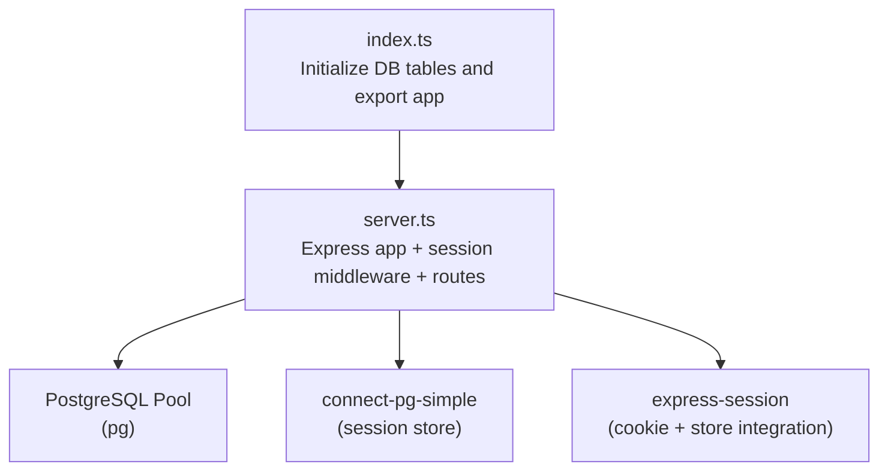
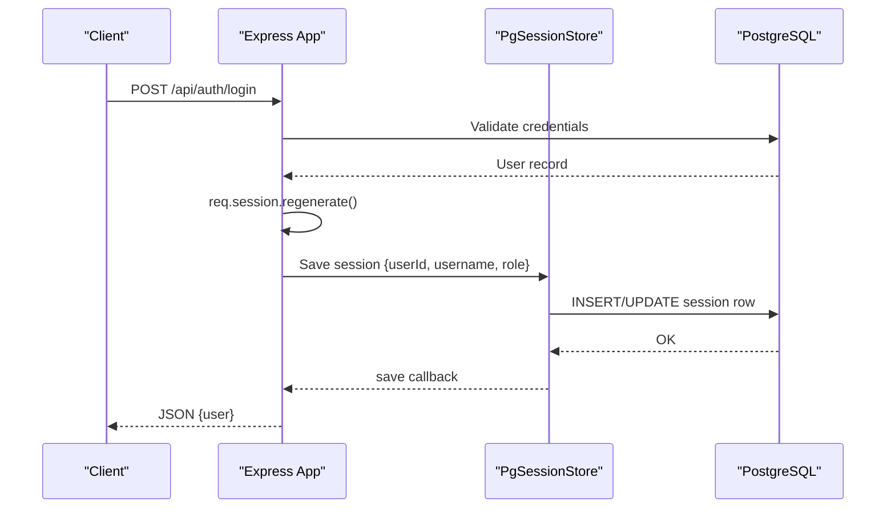
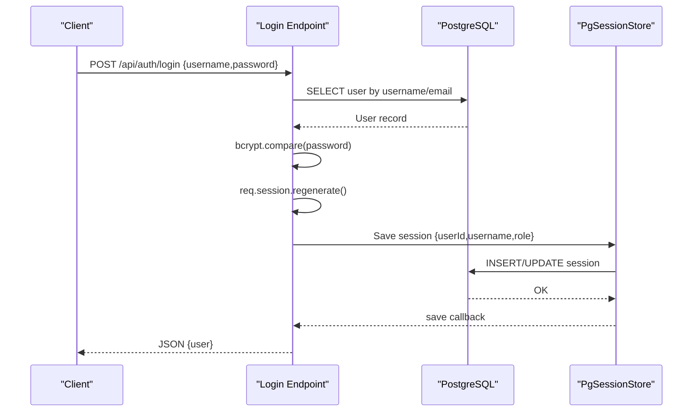
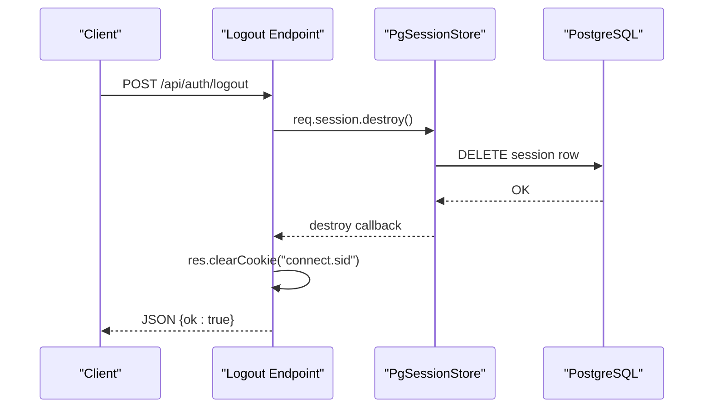
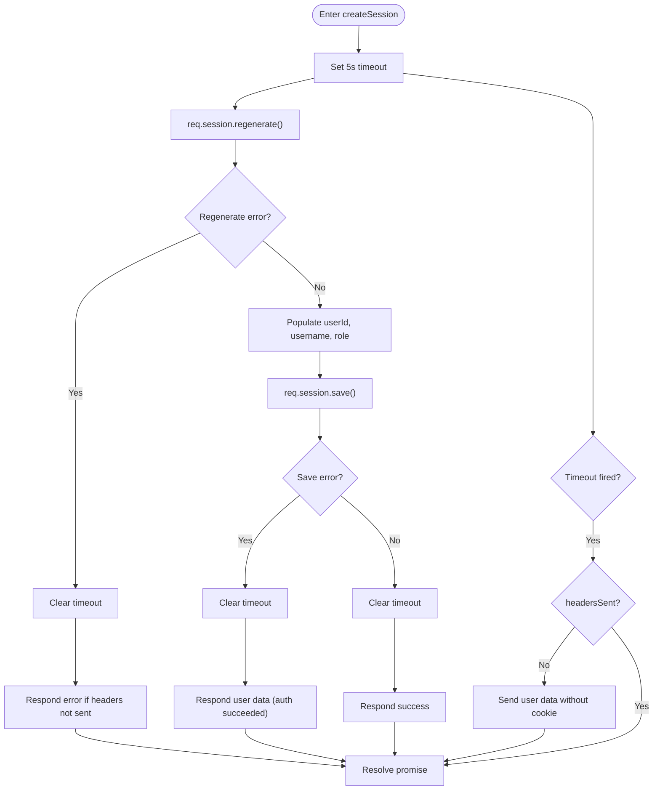
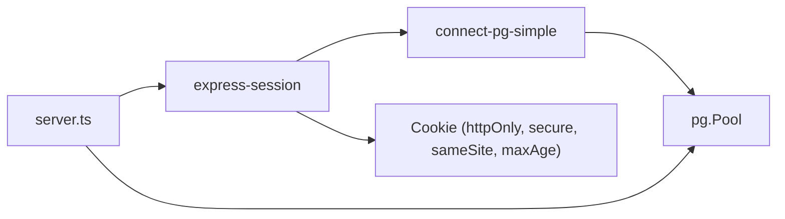

# Session Management

<cite>
**Referenced Files in This Document**
- [server.ts](file://server.ts)
- [index.ts](file://index.ts)
- [package.json](file://package.json)
- [replit.md](file://replit.md)
</cite>

## Table of Contents
1. [Introduction](#introduction)
2. [Project Structure](#project-structure)
3. [Core Components](#core-components)
4. [Architecture Overview](#architecture-overview)
5. [Detailed Component Analysis](#detailed-component-analysis)
6. [Dependency Analysis](#dependency-analysis)
7. [Performance Considerations](#performance-considerations)
8. [Troubleshooting Guide](#troubleshooting-guide)
9. [Conclusion](#conclusion)

## Introduction
This document explains the session management system implemented with express-session and PostgreSQL storage via connect-pg-simple. It covers configuration (secret, cookies, expiration), database-backed session store setup, lifecycle from authentication to logout, security-focused session regeneration after login, a timeout guard ensuring responses are always sent even if session persistence fails, example session data structure, production considerations, and troubleshooting strategies for persistence and connectivity issues.

## Project Structure
The Express server is defined in server.ts and initialized by index.ts. The session middleware is registered early in the request pipeline, followed by typed session augmentation and route handlers that create or destroy sessions.

**Diagram sources**
- [index.ts:12-19](file://index.ts#L12-L19)
- [server.ts:18-125](file://server.ts#L18-L125)

**Section sources**
- [index.ts:12-19](file://index.ts#L12-L19)
- [server.ts:18-125](file://server.ts#L18-L125)

## Core Components
- Session middleware configuration: secret, cookie options (httpOnly, secure, sameSite, maxAge), resave/saveUninitialized behavior, and store selection.
- PostgreSQL connection pooling using pg.Pool.
- connect-pg-simple session store configured with the pool, table name, and auto-create flag.
- Typed session data augmentation for userId, username, role.
- Authentication endpoints that regenerate sessions and persist user context.
- Logout endpoint that destroys sessions and clears cookies.
- Timeout guard helper to ensure HTTP responses are always sent even when session persistence hangs.

Key implementation references:
- Session store initialization and pool setup
- express-session middleware registration
- Session data type augmentation
- Login/register/logout flows
- Timeout guard helper

**Section sources**
- [server.ts:24-34](file://server.ts#L24-L34)
- [server.ts:99-105](file://server.ts#L99-L105)
- [server.ts:112-125](file://server.ts#L112-L125)
- [server.ts:340-381](file://server.ts#L340-L381)
- [server.ts:383-392](file://server.ts#L383-L392)
- [server.ts:547-591](file://server.ts#L547-L591)

## Architecture Overview
The application uses express-session with a PostgreSQL-backed store. On each request, the session middleware loads the session from the store using the cookie identifier. Authentication endpoints validate credentials, regenerate the session ID to prevent fixation, populate session fields, and persist them to PostgreSQL. Logout destroys the session and clears the cookie.

**Diagram sources**
- [server.ts:340-381](file://server.ts#L340-L381)
- [server.ts:24-34](file://server.ts#L24-L34)

## Detailed Component Analysis

### Session Configuration and Cookie Settings
- Secret management: reads SESSION_SECRET from environment; logs a warning if missing and falls back to a development-only value.
- Cookie policy: httpOnly enabled; secure set based on NODE_ENV; sameSite set to lax; maxAge set to 7 days.
- Persistence behavior: resave false and saveUninitialized false to avoid unnecessary writes and memory usage.

Security notes:
- In production, ensure SESSION_SECRET is provided and not hardcoded.
- secure cookie requires HTTPS.
- sameSite=lax balances CSRF protection with cross-site navigation.

References:
- Secret handling and fallback
- Cookie settings and expiration
- Middleware registration

**Section sources**
- [server.ts:107-110](file://server.ts#L107-L110)
- [server.ts:112-125](file://server.ts#L112-L125)

### PostgreSQL Session Store Setup
- Connection pooling: pg.Pool created with DATABASE_URL and SSL toggled in production.
- connect-pg-simple: instantiated with the pool, tableName set to "session", and createTableIfMissing true.
- Fallback mode: when DATABASE_URL is absent, a mock pool is used and sessionStore is undefined (in-memory behavior).

Operational implications:
- Auto-creation of the session table ensures minimal setup overhead.
- Using a shared pool integrates session persistence with other database operations.

References:
- Pool creation and SSL config
- connect-pg-simple instantiation
- Fallback behavior

**Section sources**
- [server.ts:24-34](file://server.ts#L24-L34)
- [server.ts:35-76](file://server.ts#L35-L76)

### Session Data Model and Type Augmentation
- SessionData augmented with userId (number), username (string), role (string).
- These fields are populated during authentication and used for authorization checks.

Example session payload shape:
- userId: numeric identifier
- username: string
- role: string (e.g., admin, user)

References:
- SessionData augmentation

**Section sources**
- [server.ts:99-105](file://server.ts#L99-L105)

### Authentication Flow and Session Regeneration
- Registration and login endpoints:
  - Validate inputs
  - Verify credentials against PostgreSQL
  - Call req.session.regenerate() to rotate session IDs post-authentication
  - Populate session fields and persist via req.session.save()
- Logout endpoint:
  - Destroy session and clear cookie

Security benefits:
- Session regeneration mitigates session fixation attacks.
- Role re-check on sensitive endpoints ensures up-to-date permissions.

References:
- Register flow with session regeneration
- Login flow with session regeneration
- Logout flow

**Section sources**
- [server.ts:266-338](file://server.ts#L266-L338)
- [server.ts:340-381](file://server.ts#L340-L381)
- [server.ts:383-392](file://server.ts#L383-L392)

### Timeout Guard Implementation
A shared helper wraps session creation in a Promise with a 5-second timeout. If the session store callback does not complete within the timeout, it sends an HTTP response without the cookie to avoid hanging requests.

Behavior:
- Starts a timer upon entering the helper
- Clears the timer on success or error
- Ensures headersSent check before responding
- Returns user data even if session persistence fails, allowing the client to proceed while logging errors

References:
- Timeout guard helper definition and usage

**Section sources**
- [server.ts:547-591](file://server.ts#L547-L591)

### Authorization and Role Re-validation
- requireAuth middleware checks for userId presence in the session.
- requireAdmin middleware queries the database to verify current role, updating the session’s role field to reflect changes immediately.

References:
- Auth and admin middleware

**Section sources**
- [server.ts:209-214](file://server.ts#L209-L214)
- [server.ts:216-235](file://server.ts#L216-L235)

### Sequence Diagrams

#### Login and Session Creation

**Diagram sources**
- [server.ts:340-381](file://server.ts#L340-L381)
- [server.ts:24-34](file://server.ts#L24-L34)

#### Logout and Session Destruction

**Diagram sources**
- [server.ts:383-392](file://server.ts#L383-L392)
- [server.ts:24-34](file://server.ts#L24-L34)

### Flowchart: Timeout Guard Logic

**Diagram sources**
- [server.ts:547-591](file://server.ts#L547-L591)

## Dependency Analysis
The session subsystem depends on:
- express-session for cookie-based session management
- connect-pg-simple for PostgreSQL-backed session storage
- pg for connection pooling and queries
- dotenv for environment variables

**Diagram sources**
- [package.json:28-33](file://package.json#L28-L33)
- [server.ts:9-12](file://server.ts#L9-L12)

**Section sources**
- [package.json:28-33](file://package.json#L28-L33)
- [server.ts:9-12](file://server.ts#L9-L12)

## Performance Considerations
- Memory vs Database Storage:
  - Using connect-pg-simple persists sessions to PostgreSQL, reducing per-process memory usage and enabling horizontal scaling across multiple instances.
  - In-memory stores (default when no store is configured) are fast but do not scale across processes.
- Expiration Policy:
  - Cookie maxAge set to 7 days; consider shorter durations for high-security environments.
- Connection Pooling:
  - Pg.Pool manages connections efficiently; tune pool size according to CPU cores and expected concurrency.
- Resave and Save Uninitialized:
  - resave=false avoids redundant writes; saveUninitialized=false reduces unnecessary session rows.
- SSL in Production:
  - SSL enabled conditionally based on NODE_ENV to secure database connections.

[No sources needed since this section provides general guidance]

## Troubleshooting Guide
Common issues and resolutions:
- Missing SESSION_SECRET:
  - Symptom: Warning logged about fallback secret; sessions signed with known value in dev.
  - Resolution: Provide a strong SESSION_SECRET in production.
- No DATABASE_URL:
  - Symptom: Mock pool used; sessionStore undefined; sessions may be in-memory only.
  - Resolution: Configure DATABASE_URL for persistent sessions.
- Session persistence failures:
  - Symptom: Errors saving session; timeout guard responds without cookie.
  - Resolution: Check PostgreSQL connectivity, pool health, and network timeouts; review logs for specific errors.
- Cookie not set:
  - Symptom: Browser does not receive session cookie.
  - Resolution: Ensure secure=true only over HTTPS; verify sameSite and domain settings; confirm headersSent is false before sending.
- Role not updated:
  - Symptom: Admin checks fail after role change.
  - Resolution: rely on requireAdmin which re-fetches role from DB; ensure DB updates succeed.

Relevant references:
- Secret fallback warning
- Database URL absence and mock behavior
- Timeout guard behavior
- Logout and cookie clearing

**Section sources**
- [server.ts:107-110](file://server.ts#L107-L110)
- [server.ts:35-76](file://server.ts#L35-L76)
- [server.ts:547-591](file://server.ts#L547-L591)
- [server.ts:383-392](file://server.ts#L383-L392)

## Conclusion
The session management system leverages express-session with a PostgreSQL-backed store to provide scalable, secure, and resilient session handling. Key strengths include session regeneration after authentication, robust timeout guarding, and strict cookie policies. For production, ensure a strong SESSION_SECRET, proper HTTPS configuration, and well-tuned database pooling. When issues arise, focus on environment configuration, database connectivity, and session persistence callbacks.