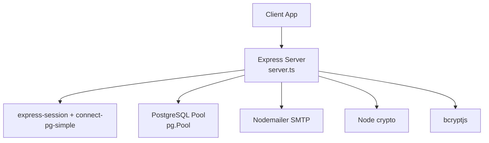
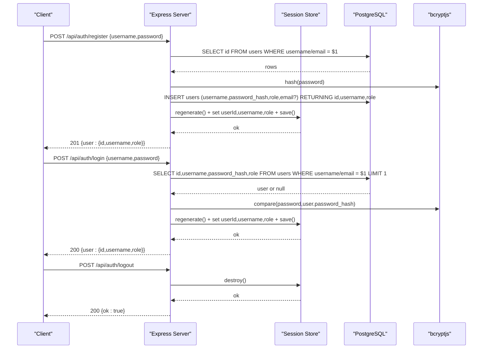
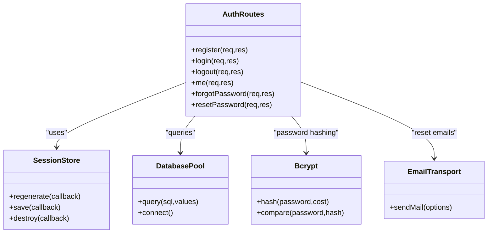
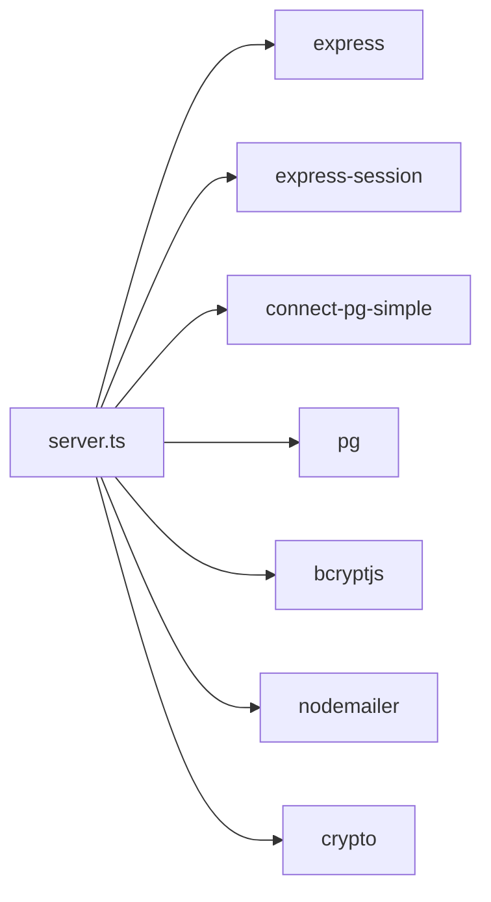

# Traditional Username/Password Authentication

<cite>
**Referenced Files in This Document**
- [server.ts](file://server.ts)
- [api/index.ts](file://api/index.ts)
- [index.ts](file://index.ts)
- [package.json](file://package.json)
</cite>

## Table of Contents
1. [Introduction](#introduction)
2. [Project Structure](#project-structure)
3. [Core Components](#core-components)
4. [Architecture Overview](#architecture-overview)
5. [Detailed Component Analysis](#detailed-component-analysis)
6. [Dependency Analysis](#dependency-analysis)
7. [Performance Considerations](#performance-considerations)
8. [Troubleshooting Guide](#troubleshooting-guide)
9. [Conclusion](#conclusion)

## Introduction
This document explains the traditional username/password authentication system implemented in the application. It covers:
- Registration with username validation that accepts both usernames and email addresses
- Password hashing using bcrypt
- Role assignment logic where the first user becomes admin
- Login accepting both usernames and emails, password verification via bcrypt.compare, and secure session creation
- Logout functionality that destroys sessions and clears cookies
- Request/response patterns and error handling for duplicate users, invalid credentials, and database connection issues
- Security considerations including parameterized queries to prevent SQL injection, timing attack mitigation, and secure password storage practices

## Project Structure
The authentication endpoints are implemented in a single Express server file. The API entry point exports the Express app for serverless environments. Database initialization runs on cold start to ensure required tables exist.

**Diagram sources**
- [server.ts:1-20](file://server.ts#L1-L20)
- [server.ts:24-34](file://server.ts#L24-L34)
- [server.ts:112-125](file://server.ts#L112-L125)

**Section sources**
- [server.ts:1-20](file://server.ts#L1-L20)
- [api/index.ts:1-5](file://api/index.ts#L1-L5)
- [index.ts:1-20](file://index.ts#L1-L20)
- [package.json:16-45](file://package.json#L16-L45)

## Core Components
- Express app with JSON parsing and URL-encoded body parsing
- PostgreSQL connection pool and persistent session store backed by PostgreSQL
- bcrypt-based password hashing and comparison
- Session middleware with secure cookie configuration
- Authentication routes: register, login, logout, me (current user), forgot-password, reset-password
- Admin role enforcement middleware
- Database schema initialization for users and password reset tokens

Key implementation highlights:
- Parameterized queries throughout to prevent SQL injection
- Secure session cookies with httpOnly, secure flag in production, SameSite=Lax, and expiration
- First-user admin assignment protected by table-level locks within a transaction
- Timing-safe password verification pattern to reduce enumeration risks

**Section sources**
- [server.ts:79-81](file://server.ts#L79-L81)
- [server.ts:24-34](file://server.ts#L24-L34)
- [server.ts:112-125](file://server.ts#L112-L125)
- [server.ts:209-235](file://server.ts#L209-L235)
- [server.ts:3430-3460](file://server.ts#L3430-L3460)

## Architecture Overview
The authentication flow uses Express routes backed by PostgreSQL and bcrypt. Sessions are persisted in PostgreSQL via connect-pg-simple. All sensitive operations use parameterized queries.

**Diagram sources**
- [server.ts:266-338](file://server.ts#L266-L338)
- [server.ts:340-381](file://server.ts#L340-L381)
- [server.ts:383-392](file://server.ts#L383-L392)
- [server.ts:112-125](file://server.ts#L112-L125)

## Detailed Component Analysis

### Registration Flow (/api/auth/register)
- Accepts username or email in the username field
- Validates input length and format
- Checks for duplicates against both username and email columns
- Hashes password with bcrypt
- Assigns role: first user becomes admin; subsequent users become user
- Persists user record with optional email column when input looks like an email
- Creates a new session and returns user info

Request/Response examples:
- Success: 201 with { user: { id, username, role } }
- Validation errors: 400 with descriptive messages
- Duplicate user: 409 with error message
- Server error: 500 with generic error

Security notes:
- Parameterized queries prevent SQL injection
- bcrypt cost factor 12 for strong hashing
- Transaction with table lock ensures only one admin is created even under concurrency

**Section sources**
- [server.ts:266-338](file://server.ts#L266-L338)
- [server.ts:279-316](file://server.ts#L279-L316)
- [server.ts:289-308](file://server.ts#L289-L308)

### Login Flow (/api/auth/login)
- Accepts username or email in the username field
- Retrieves user by username or email
- Uses bcrypt.compare with a fallback invalid hash when user not found to mitigate timing attacks
- On success, regenerates session and sets userId, username, role
- Returns user info

Request/Response examples:
- Success: 200 with { user: { id, username, role } }
- Invalid credentials: 401 with error message
- Server error: 500 with generic error

Security notes:
- bcrypt.compare avoids timing differences between existing and non-existing users
- Session regeneration prevents fixation

**Section sources**
- [server.ts:340-381](file://server.ts#L340-L381)
- [server.ts:348-359](file://server.ts#L348-L359)

### Logout Flow (/api/auth/logout)
- Destroys the current session
- Clears the session cookie
- Returns success response

Request/Response examples:
- Success: 200 with { ok: true }
- Server error: 500 with error message

Security notes:
- Session destruction removes server-side state
- Cookie clearing ensures client-side cleanup

**Section sources**
- [server.ts:383-392](file://server.ts#L383-L392)

### Current User Endpoint (/api/auth/me)
- Requires authenticated session
- Re-fetches role from the database to reflect immediate role changes
- Updates session role and returns user info

Request/Response examples:
- Authenticated: 200 with { user: { id, username, role } }
- Unauthenticated: 401 with error message
- Server error: 500 with error message

Security notes:
- Role re-check prevents stale permissions based on session snapshot

**Section sources**
- [server.ts:832-851](file://server.ts#L832-L851)

### Forgot Password and Reset Password
- Generates secure random token, stores hashed token with expiry
- Sends email with reset link
- Validates token usage and expiry
- Updates password hash and invalidates active sessions for the user

Request/Response examples:
- Forgot password: always responds OK without revealing existence
- Reset password: validates token and new password length, updates hash, marks token used

Security notes:
- Token stored as SHA-256 hash
- Expiration enforced at query time
- Active sessions invalidated upon password change

**Section sources**
- [server.ts:750-830](file://server.ts#L750-L830)

### Admin Enforcement Middleware
- Ensures caller is authenticated
- Re-checks role from database on each request
- Denies access if role is not admin

Security notes:
- Prevents privilege escalation based on stale session data

**Section sources**
- [server.ts:216-235](file://server.ts#L216-L235)

### Database Schema Initialization
- Creates users table with id, username (unique), password_hash, role, created_at
- Adds email and neon_auth_id columns idempotently
- Creates password_reset_tokens table with indexes

Schema details:
- users.id: SERIAL PRIMARY KEY
- users.username: VARCHAR(32) NOT NULL UNIQUE
- users.password_hash: TEXT NOT NULL DEFAULT ''
- users.role: VARCHAR(20) NOT NULL DEFAULT 'user'
- users.created_at: TIMESTAMP NOT NULL DEFAULT NOW()
- users.email: VARCHAR(255) UNIQUE (added via migration)
- users.neon_auth_id: TEXT UNIQUE (added via migration)
- password_reset_tokens: id, user_id FK, token_hash UNIQUE, expires_at, used_at, created_at

**Section sources**
- [server.ts:3430-3460](file://server.ts#L3430-L3460)

### Session Configuration
- express-session configured with secret, resave=false, saveUninitialized=false
- Cookie settings: httpOnly=true, secure in production, sameSite=lax, maxAge=7 days
- Persistent session store using connect-pg-simple with PostgreSQL

Security notes:
- httpOnly prevents client-side script access to session cookie
- secure flag enforces HTTPS in production
- SameSite reduces CSRF risk
- Long-lived but bounded session duration

**Section sources**
- [server.ts:112-125](file://server.ts#L112-L125)
- [server.ts:24-34](file://server.ts#L24-L34)

## Architecture Overview
The authentication subsystem integrates Express, PostgreSQL, bcrypt, and nodemailer. All endpoints follow consistent patterns: validate inputs, perform parameterized queries, handle errors uniformly, and return structured JSON responses.

**Diagram sources**
- [server.ts:266-338](file://server.ts#L266-L338)
- [server.ts:340-381](file://server.ts#L340-L381)
- [server.ts:750-830](file://server.ts#L750-L830)
- [server.ts:112-125](file://server.ts#L112-L125)

## Dependency Analysis
External dependencies relevant to authentication:
- express: HTTP server and middleware
- express-session: session management
- connect-pg-simple: persistent session store
- pg: PostgreSQL client
- bcryptjs: password hashing
- nodemailer: email transport
- crypto: secure token generation

**Diagram sources**
- [server.ts:1-14](file://server.ts#L1-L14)
- [package.json:16-45](file://package.json#L16-L45)

**Section sources**
- [server.ts:1-14](file://server.ts#L1-L14)
- [package.json:16-45](file://package.json#L16-L45)

## Performance Considerations
- bcrypt hashing cost 12 balances security and performance
- Parameterized queries avoid overhead and improve safety
- Session persistence in PostgreSQL scales with connection pooling
- Short-circuiting login path when local hash exists reduces external calls
- Timeout guard in session creation prevents hanging responses

[No sources needed since this section provides general guidance]

## Troubleshooting Guide
Common issues and resolutions:
- Duplicate user registration: Check for existing username or email; respond with 409
- Invalid credentials: Ensure correct username/email and password; verify bcrypt.compare usage
- Database connection failures: Verify DATABASE_URL and SSL settings; check pool connectivity
- Session save failures: Inspect session store configuration and PostgreSQL availability
- Email sending failures: Validate SMTP_USER and SMTP_PASS; confirm network access to SMTP server

Error handling patterns:
- Input validation returns 400 with descriptive messages
- Business rule violations return appropriate status codes (e.g., 409 for duplicates)
- Authentication failures return 401
- Unexpected errors return 500 with generic messages

**Section sources**
- [server.ts:266-338](file://server.ts#L266-L338)
- [server.ts:340-381](file://server.ts#L340-L381)
- [server.ts:750-830](file://server.ts#L750-L830)

## Conclusion
The authentication system implements robust traditional username/password flows with strong security practices:
- Parameterized queries prevent SQL injection
- bcrypt hashing ensures secure password storage
- Timing-safe comparisons mitigate enumeration attacks
- Secure session configuration protects against common vulnerabilities
- Role enforcement checks database state on every request
- Comprehensive error handling provides clear feedback while maintaining security