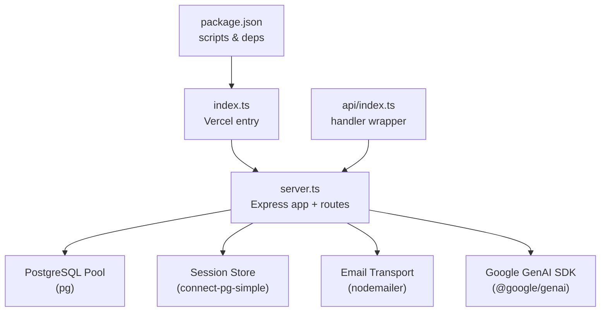
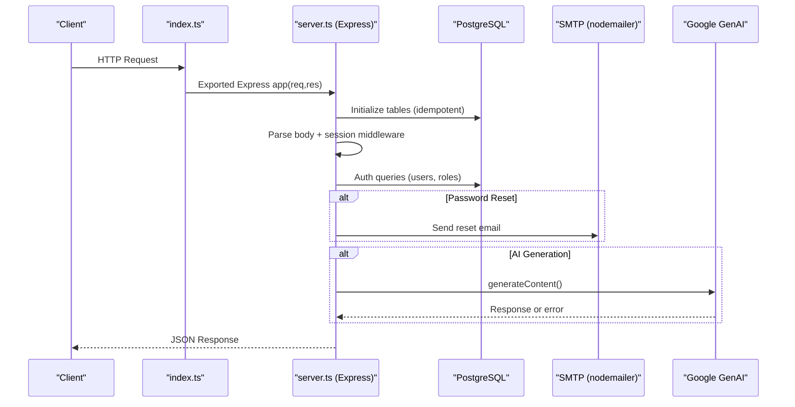
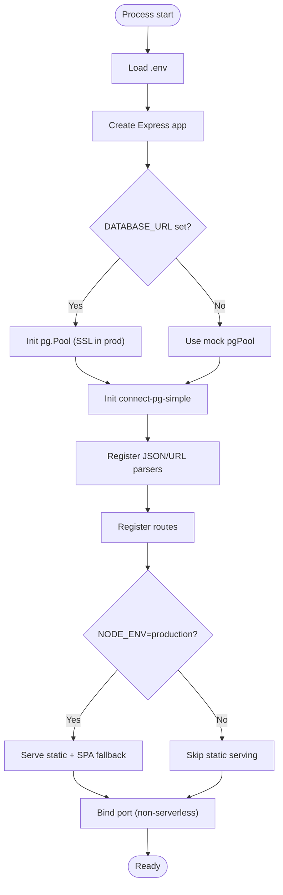
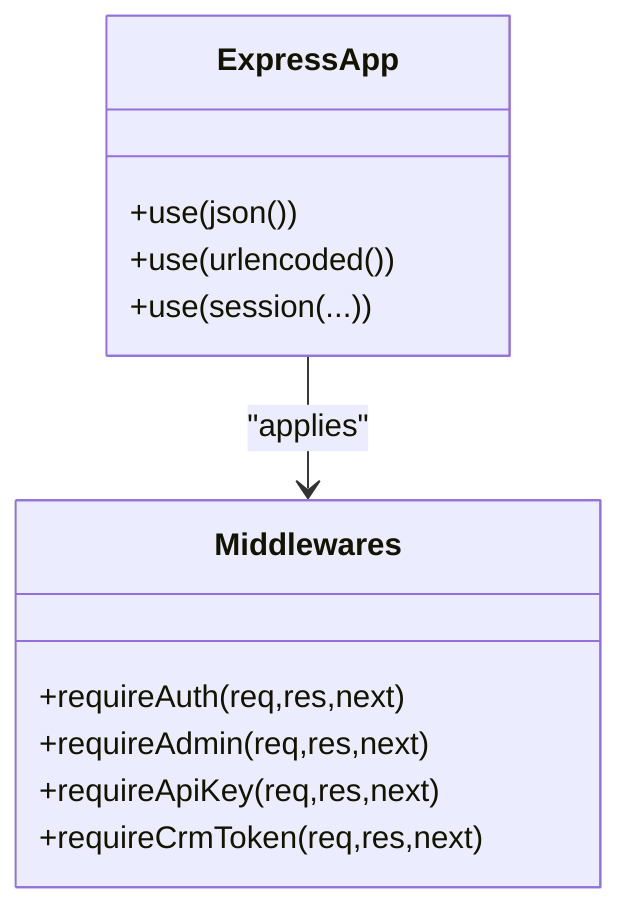
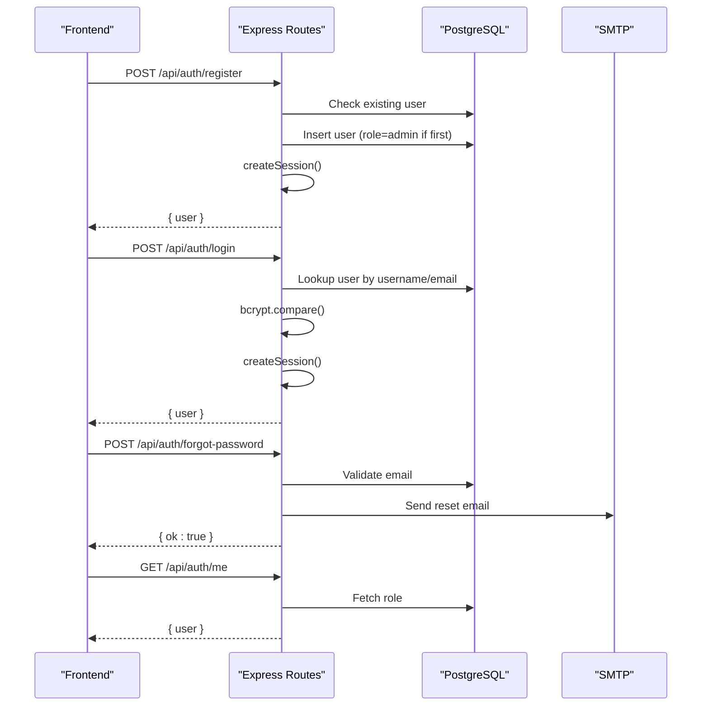
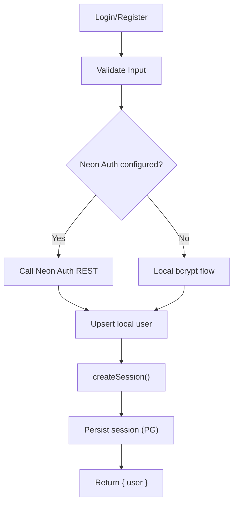
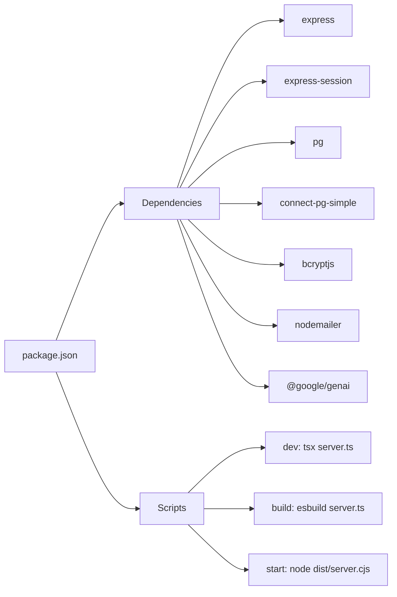

# Backend Architecture

<cite>
**Referenced Files in This Document**
- [server.ts](file://server.ts)
- [index.ts](file://index.ts)
- [api/index.ts](file://api/index.ts)
- [package.json](file://package.json)
</cite>

## Table of Contents
1. Introduction
2. Project Structure
3. Core Components
4. Architecture Overview
5. Detailed Component Analysis
6. Dependency Analysis
7. Performance Considerations
8. Troubleshooting Guide
9. Conclusion

## Introduction
This document explains the Express.js backend architecture, focusing on server initialization, middleware configuration, route organization, and API endpoint structure. It also covers authentication with session management, database connection handling, error processing patterns, and security considerations such as CORS posture, request validation, and response formatting. The content is designed for both beginners (conceptual overviews) and experienced developers (technical details and code-level references).

## Project Structure
The backend is implemented as a single-file Express application with additional entry points for different deployment targets:
- server.ts: Main Express app, middleware, routes, DB setup, and server lifecycle.
- index.ts: Vercel serverless entry that initializes tables and exports the Express app.
- api/index.ts: Alternative handler wrapper used by some environments to invoke the Express app.
- package.json: Scripts and dependencies including Express, sessions, PostgreSQL driver, and build tooling.

**Diagram sources**
- [package.json:1-64](file://package.json#L1-L64)
- [index.ts:1-20](file://index.ts#L1-L20)
- [api/index.ts:1-5](file://api/index.ts#L1-L5)
- [server.ts:1-120](file://server.ts#L1-L120)

**Section sources**
- [server.ts:1-120](file://server.ts#L1-L120)
- [index.ts:1-20](file://index.ts#L1-L20)
- [api/index.ts:1-5](file://api/index.ts#L1-L5)
- [package.json:1-64](file://package.json#L1-L64)

## Core Components
- Express Application: Created once and reused across deployments; all routes are registered at module load time.
- Database Layer: PostgreSQL pool configured via environment variables; optional SSL in production; mock pool provided when DATABASE_URL is absent.
- Session Management: express-session with connect-pg-simple store using the same Postgres pool; secure cookie settings based on environment.
- Authentication Middleware: requireAuth and requireAdmin enforce session presence and role checks; server-to-server APIs use header-based tokens.
- Email Service: nodemailer transport configured via SMTP_USER/SMTP_PASS for password reset emails.
- AI Integration: Optional Google GenAI client with fallback logic for model failures or missing keys.

Key responsibilities:
- Request parsing and body normalization.
- Centralized error responses.
- Consistent JSON payloads.
- Environment-driven behavior (production vs development).

**Section sources**
- [server.ts:18-125](file://server.ts#L18-L125)
- [server.ts:209-264](file://server.ts#L209-L264)
- [server.ts:854-878](file://server.ts#L854-L878)

## Architecture Overview
The server bootstraps the Express app, configures middleware, sets up persistent sessions backed by Postgres, and registers REST endpoints under /api. In production, static assets are served and the app listens on a port. In serverless environments, the exported app is invoked directly without binding a port.

**Diagram sources**
- [index.ts:1-20](file://index.ts#L1-L20)
- [server.ts:5088-5169](file://server.ts#L5088-L5169)
- [server.ts:133-207](file://server.ts#L133-L207)
- [server.ts:854-971](file://server.ts#L854-L971)

## Detailed Component Analysis

### Server Initialization and Lifecycle
- Loads environment variables.
- Creates Express app and reads PORT/DATABASE_URL.
- Initializes pg.Pool with SSL in production; falls back to a mock pool if DATABASE_URL is not set.
- Configures express-session with connect-pg-simple using the same pool.
- Registers global middleware: JSON and URL-encoded parsers.
- Exports the app and table init functions for serverless usage.
- Binds the HTTP server only outside serverless environments; serves static files and SPA fallback in production.

**Diagram sources**
- [server.ts:18-77](file://server.ts#L18-L77)
- [server.ts:79-125](file://server.ts#L79-L125)
- [server.ts:5088-5169](file://server.ts#L5088-L5169)

**Section sources**
- [server.ts:18-77](file://server.ts#L18-L77)
- [server.ts:79-125](file://server.ts#L79-L125)
- [server.ts:5088-5169](file://server.ts#L5088-L5169)

### Middleware Configuration
- Body parsing: JSON and URL-encoded bodies are parsed.
- Session middleware: Persistent store via connect-pg-simple; secure cookies; httpOnly; SameSite=Lax; configurable maxAge.
- Typed aliases: AuthRequest/Response/Next types avoid type conflicts.
- Custom middlewares:
  - requireAuth: Ensures session.userId exists.
  - requireAdmin: Re-checks role from DB on each request.
  - requireApiKey: Validates x-api-key header for server-to-server calls.
  - requireCrmToken: Validates x-crm-token header for WordPress plugin integration.

**Diagram sources**
- [server.ts:79-125](file://server.ts#L79-L125)
- [server.ts:209-264](file://server.ts#L209-L264)

**Section sources**
- [server.ts:79-125](file://server.ts#L79-L125)
- [server.ts:209-264](file://server.ts#L209-L264)

### Route Organization and API Endpoints
Routes are grouped under /api/auth and other feature areas. Examples include:
- Registration and login flows (username/password and email-based Neon Auth integration).
- Logout and session management.
- Password reset token generation and reset flow.
- Current user info endpoint (/api/auth/me).
- Server-to-server endpoints protected by API key or CRM token.

Typical response shape:
- Success: { user: { id, username, role } } or { ok: true, ... }.
- Error: { error: "..." }.

**Diagram sources**
- [server.ts:266-338](file://server.ts#L266-L338)
- [server.ts:340-381](file://server.ts#L340-L381)
- [server.ts:383-392](file://server.ts#L383-L392)
- [server.ts:594-680](file://server.ts#L594-L680)
- [server.ts:683-748](file://server.ts#L683-L748)
- [server.ts:753-791](file://server.ts#L753-L791)
- [server.ts:832-851](file://server.ts#L832-L851)

**Section sources**
- [server.ts:266-392](file://server.ts#L266-L392)
- [server.ts:594-748](file://server.ts#L594-L748)
- [server.ts:753-851](file://server.ts#L753-L851)

### Authentication System and Session Management
- Username/password auth:
  - Registration validates input, hashes password, ensures uniqueness, assigns admin role to the first user, then creates a session.
  - Login verifies credentials and creates a session.
- Email-based Neon Auth:
  - If NEON_AUTH_BASE is configured, registration/login proxies to Neon Auth REST endpoints and upserts local user records.
  - Local bcrypt hash stored to allow fast local login even when email verification is pending.
- Session creation helper:
  - Regenerates session, attaches userId/username/role, persists via store, and includes a timeout guard to ensure responses are always sent.
- Logout destroys session and clears cookie.

Security notes:
- Password hashing uses bcrypt with appropriate cost.
- Role checks re-query the database to reflect immediate changes.
- CSRF protection is not explicitly enabled; consider adding it if needed.

**Diagram sources**
- [server.ts:266-338](file://server.ts#L266-L338)
- [server.ts:340-381](file://server.ts#L340-L381)
- [server.ts:594-680](file://server.ts#L594-L680)
- [server.ts:683-748](file://server.ts#L683-L748)
- [server.ts:551-591](file://server.ts#L551-L591)

**Section sources**
- [server.ts:266-381](file://server.ts#L266-L381)
- [server.ts:551-591](file://server.ts#L551-L591)
- [server.ts:594-748](file://server.ts#L594-L748)

### Database Connection Handling
- Uses pg.Pool with connection string from DATABASE_URL.
- SSL enabled in production; otherwise disabled.
- When DATABASE_URL is missing, a mock pool is used for development.
- Tables are initialized idempotently during startup (users, password_reset_tokens, chatbot leads, Santi tables, etc.).
- Session store uses connect-pg-simple with the same pool.

Best practices observed:
- Single pool instance shared across app.
- Idempotent table initialization avoids migration errors.
- Graceful fallback to mock pool prevents crashes in dev.

**Section sources**
- [server.ts:24-77](file://server.ts#L24-L77)
- [server.ts:5088-5169](file://server.ts#L5088-L5169)

### Error Processing Patterns
- Consistent JSON error responses with descriptive messages.
- try/catch blocks around async operations with logging.
- Specific status codes:
  - 400 for validation errors.
  - 401 for unauthorized.
  - 403 for forbidden (admin-only).
  - 409 for conflict (duplicate users).
  - 500 for internal errors.
- Session save timeouts prevent hanging responses.

Example patterns:
- Validation early returns with 400 and error message.
- Database errors caught and logged; user receives generic error.
- External service errors normalized to consistent shapes.

**Section sources**
- [server.ts:266-338](file://server.ts#L266-L338)
- [server.ts:340-381](file://server.ts#L340-L381)
- [server.ts:551-591](file://server.ts#L551-L591)

### Security Implementation
- CORS posture: No explicit CORS middleware is configured; requests rely on default Express behavior. For cross-origin needs, add cors middleware with strict origins/methods/credentials.
- Request validation: Input validation performed before DB operations; regex for usernames; length checks for passwords; email format checks.
- Response formatting: All responses are JSON with standardized fields.
- Secure cookies: httpOnly, secure flag in production, SameSite=Lax, reasonable maxAge.
- Secret management: SESSION_SECRET and API keys read from environment variables.

Recommendations:
- Add cors middleware with explicit allowed origins.
- Consider helmet for security headers.
- Rate-limit sensitive endpoints (login, register, forgot-password).

**Section sources**
- [server.ts:107-125](file://server.ts#L107-L125)
- [server.ts:209-264](file://server.ts#L209-L264)
- [server.ts:266-338](file://server.ts#L266-L338)

### Practical Examples

#### Creating an API Endpoint
Steps:
- Define route path and method (e.g., POST /api/resource).
- Validate request body.
- Perform business logic (DB calls, external services).
- Return JSON success or error.

Reference paths:
- [server.ts:266-338](file://server.ts#L266-L338)
- [server.ts:340-381](file://server.ts#L340-L381)

#### Developing Middleware
Patterns:
- Require authentication: check session.userId.
- Require admin: re-check role from DB.
- Header-based auth: validate x-api-key or x-crm-token.

Reference paths:
- [server.ts:209-264](file://server.ts#L209-L264)

#### Error Handling Strategy
Patterns:
- Wrap async handlers in try/catch.
- Log errors with context.
- Respond with consistent JSON error objects.
- Use specific HTTP status codes.

Reference paths:
- [server.ts:551-591](file://server.ts#L551-L591)
- [server.ts:753-791](file://server.ts#L753-L791)

## Dependency Analysis
Core runtime dependencies:
- express: Web framework.
- express-session: Session management.
- connect-pg-simple: Persistent session store.
- pg: PostgreSQL driver.
- bcryptjs: Password hashing.
- nodemailer: Email transport.
- @google/genai: AI integration.

Build and scripts:
- Development runs server.ts via tsx.
- Production bundles server.ts with esbuild and starts dist/server.cjs.
- Vercel entry exports the Express app after initializing tables.

**Diagram sources**
- [package.json:1-64](file://package.json#L1-L64)

**Section sources**
- [package.json:1-64](file://package.json#L1-L64)

## Performance Considerations
- Connection pooling: Using pg.Pool reduces overhead and improves concurrency.
- Session persistence: connect-pg-simple avoids memory growth and supports horizontal scaling.
- AI fallback: Model selection and retry logic mitigate transient failures and quota limits.
- Static asset serving: In production, static files are served synchronously before port binding to avoid race conditions.
- Avoid unnecessary imports: Vite dev middleware is dynamically imported to prevent loading heavy packages in serverless.

Recommendations:
- Tune pool size based on CPU cores and expected concurrency.
- Configure idle timeouts for connections.
- Monitor AI API quotas and adjust fallback strategies.

[No sources needed since this section provides general guidance]

## Troubleshooting Guide
Common issues and resolutions:
- Missing DATABASE_URL:
  - Symptom: Mock pool used; features relying on DB may behave differently.
  - Resolution: Set DATABASE_URL and ensure SSL options match your provider.
- SESSION_SECRET not set:
  - Symptom: Development fallback secret used; warnings logged.
  - Resolution: Provide a strong SESSION_SECRET in production.
- Port already in use:
  - Symptom: EADDRINUSE error on startup.
  - Resolution: Free the port or change PORT; the server logs and exits gracefully.
- SMTP not configured:
  - Symptom: Password reset emails fail.
  - Resolution: Set SMTP_USER and SMTP_PASS.
- AI key missing or invalid:
  - Symptom: Fallback local generator used; warnings logged.
  - Resolution: Set GEMINI_API_KEY appropriately.

Operational tips:
- Inspect console logs for detailed error messages.
- Verify environment variables for critical services.
- Test endpoints locally with curl or Postman.

**Section sources**
- [server.ts:107-125](file://server.ts#L107-L125)
- [server.ts:5088-5169](file://server.ts#L5088-L5169)
- [server.ts:133-207](file://server.ts#L133-L207)
- [server.ts:854-878](file://server.ts#L854-L878)

## Conclusion
The Express backend is a cohesive, single-file application that integrates authentication, sessions, database access, email, and optional AI capabilities. It follows consistent patterns for validation, error handling, and response formatting, and adapts to both containerized and serverless environments. By adhering to the recommended enhancements (CORS, rate limiting, security headers), the system can be hardened for production while maintaining clarity and maintainability.

[No sources needed since this section summarizes without analyzing specific files]