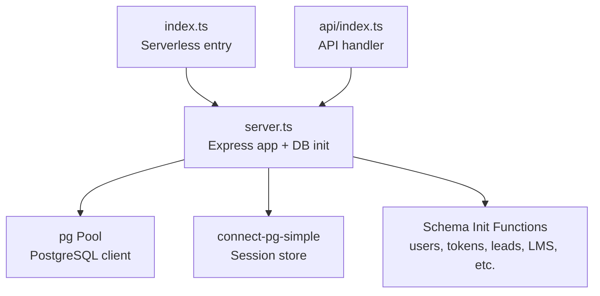
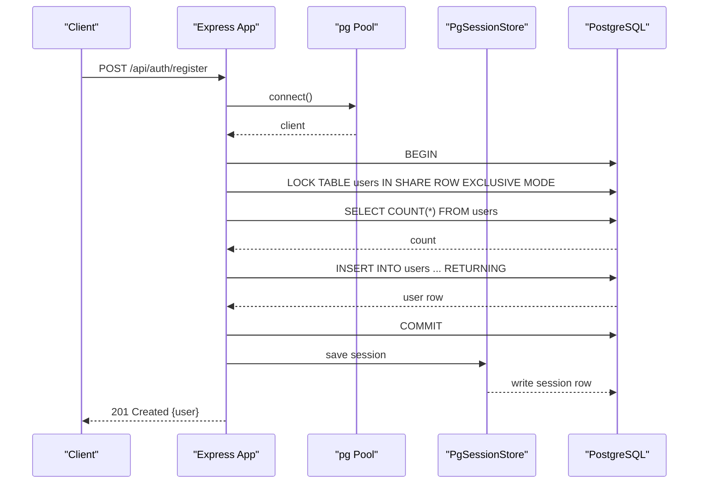
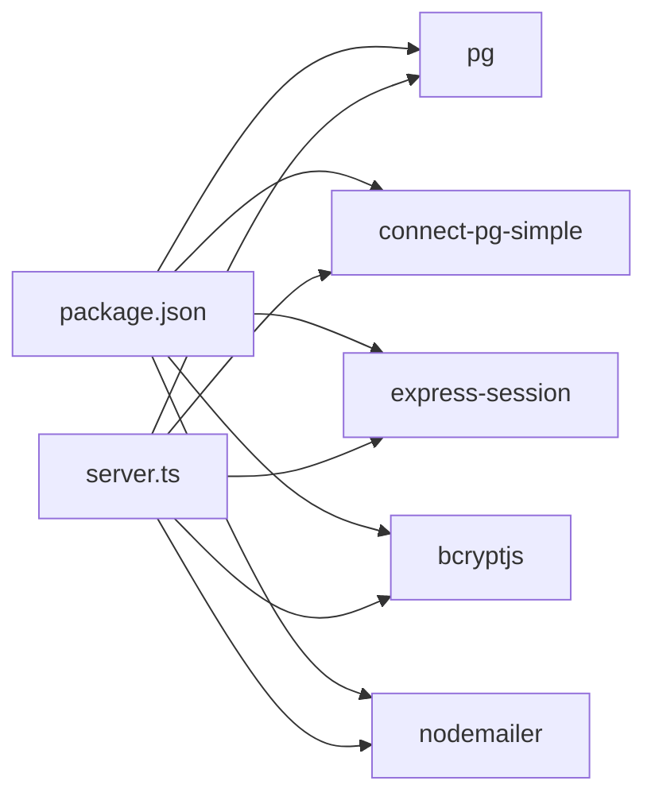

# Database Layer

<cite>
**Referenced Files in This Document**
- [server.ts](file://server.ts)
- [index.ts](file://index.ts)
- [api/index.ts](file://api/index.ts)
- [package.json](file://package.json)
</cite>

## Table of Contents
1. [Introduction](#introduction)
2. [Project Structure](#project-structure)
3. [Core Components](#core-components)
4. [Architecture Overview](#architecture-overview)
5. [Detailed Component Analysis](#detailed-component-analysis)
6. [Dependency Analysis](#dependency-analysis)
7. [Performance Considerations](#performance-considerations)
8. [Troubleshooting Guide](#troubleshooting-guide)
9. [Conclusion](#conclusion)

## Introduction
This document explains the database layer for PostgreSQL integration and connection pooling in the application. It covers how the pg Pool is configured, how connections are managed, query execution patterns, transaction handling with rollback, table locking strategies for concurrency, session storage via connect-pg-simple, password reset token management, and data validation patterns. It also includes a mock database implementation used when no DATABASE_URL is provided to support development without a live database.

## Project Structure
The database layer is implemented primarily in server.ts, which initializes the pg Pool, configures session storage, defines schema initialization functions, and exposes Express routes that execute queries against PostgreSQL. The index.ts entry point runs schema initialization on cold start for serverless deployments, while api/index.ts exports an Express handler for API routing.

**Diagram sources**
- [index.ts:1-19](file://index.ts#L1-L19)
- [server.ts:24-77](file://server.ts#L24-L77)
- [server.ts:3430-3460](file://server.ts#L3430-L3460)
- [api/index.ts:1-5](file://api/index.ts#L1-L5)

**Section sources**
- [index.ts:1-19](file://index.ts#L1-L19)
- [server.ts:24-77](file://server.ts#L24-L77)
- [api/index.ts:1-5](file://api/index.ts#L1-L5)

## Core Components
- PostgreSQL connection pool (pg Pool)
- Session store using connect-pg-simple
- Schema initialization functions (idempotent CREATE TABLE IF NOT EXISTS)
- Authentication endpoints with transactions and table locks
- Password reset token flow
- Mock database implementation for development

Key responsibilities:
- Initialize and manage the pg Pool with environment-driven configuration
- Provide idempotent schema setup for all tables
- Execute authenticated CRUD operations with proper error handling
- Manage sessions persistently across requests
- Implement secure password reset token generation and validation

**Section sources**
- [server.ts:24-77](file://server.ts#L24-L77)
- [server.ts:3430-3460](file://server.ts#L3430-L3460)
- [server.ts:3468-3484](file://server.ts#L3468-L3484)
- [server.ts:3586-3625](file://server.ts#L3586-L3625)
- [server.ts:3627-3638](file://server.ts#L3627-L3638)
- [server.ts:3640-3661](file://server.ts#L3640-L3661)

## Architecture Overview
The application uses Express as the HTTP server, with PostgreSQL accessed through a shared pg Pool. Sessions are persisted in PostgreSQL via connect-pg-simple. Schema initialization runs at startup to ensure required tables exist. Authentication flows use transactions and explicit table locks to maintain consistency during concurrent registration.

**Diagram sources**
- [server.ts:266-338](file://server.ts#L266-L338)
- [server.ts:24-35](file://server.ts#L24-L35)

**Section sources**
- [server.ts:266-338](file://server.ts#L266-L338)
- [server.ts:24-35](file://server.ts#L24-L35)

## Detailed Component Analysis

### PostgreSQL Connection Pool Configuration
- The pg Pool is created conditionally based on the presence of DATABASE_URL.
- In production, SSL is enabled with rejectUnauthorized set to false.
- If DATABASE_URL is not set, a mock pgPool is provided with query handlers for common operations to support local development.

Configuration highlights:
- Connection string from environment variable
- Conditional SSL settings
- Mock fallback for development

**Section sources**
- [server.ts:24-77](file://server.ts#L24-L77)

### Connection Management Patterns
- Direct pool queries are used for read/write operations.
- For multi-step operations requiring atomicity, a dedicated client is obtained via pgPool.connect(), and manual transaction control is applied.
- Clients are released in finally blocks to prevent leaks.

Examples:
- Registration uses a client-level transaction with explicit lock and rollback on error.
- Role checks and admin middleware re-query roles from the database per request.

**Section sources**
- [server.ts:296-316](file://server.ts#L296-L316)
- [server.ts:216-235](file://server.ts#L216-L235)

### Query Execution Patterns
- Parameterized queries are used throughout to avoid SQL injection.
- Common patterns include:
  - Simple SELECT/INSERT/UPDATE statements with placeholders
  - Returning clauses to fetch inserted rows
  - Count queries to determine first-user role assignment

Examples:
- User lookup by username or email
- Inserting users with optional email field
- Counting users to assign admin role to the first account

**Section sources**
- [server.ts:348-351](file://server.ts#L348-L351)
- [server.ts:303-308](file://server.ts#L303-L308)
- [server.ts:301-302](file://server.ts#L301-L302)

### Transaction Handling and Error Rollback
- Transactions are explicitly started with BEGIN and committed with COMMIT.
- On any error within a transaction block, ROLLBACK is executed before rethrowing the error.
- This ensures consistent state even under failures.

Example flow:
- Begin transaction
- Acquire table lock
- Perform reads/writes
- Commit or rollback on error

**Section sources**
- [server.ts:298-316](file://server.ts#L298-L316)
- [server.ts:503-524](file://server.ts#L503-L524)

### Table Locking Strategies for Concurrent Operations
- During user registration, a table-level lock (SHARE ROW EXCLUSIVE MODE) is used to prevent race conditions when determining the first user’s role.
- This ensures only one registration can observe zero users and become admin simultaneously.

Best practices demonstrated:
- Use explicit locks around critical sections
- Keep locked sections short to minimize contention
- Combine locks with transactions for atomicity

**Section sources**
- [server.ts:300-302](file://server.ts#L300-L302)
- [server.ts:505-509](file://server.ts#L505-L509)

### Session Storage Using connect-pg-simple
- Sessions are stored in PostgreSQL using connect-pg-simple.
- The session store is initialized with the same pg Pool instance.
- Tables are created automatically if missing.

Configuration:
- Shared pool passed to PgSessionStore
- Table name set to “session”
- Auto-create table enabled

**Section sources**
- [server.ts:29-34](file://server.ts#L29-L34)

### Password Reset Token Management
- Tokens are generated securely using crypto.randomBytes and hashed with SHA-256 before storage.
- Tokens expire after one hour and can be marked as used.
- The forgot-password endpoint invalidates previous unused tokens for the user before issuing a new one.
- The reset-password endpoint validates the token, updates the password hash, marks the token as used, and destroys active sessions for security.

Data model:
- password_reset_tokens table with fields for user_id, token_hash, expires_at, used_at, created_at
- Indexes on token_hash and user_id for performance

Flow:
- Generate raw token, hash it, insert into DB
- Send email with raw token link
- Validate token hash, update password, mark token used, destroy sessions

**Section sources**
- [server.ts:753-791](file://server.ts#L753-L791)
- [server.ts:795-830](file://server.ts#L795-L830)
- [server.ts:3446-3460](file://server.ts#L3446-L3460)

### Data Validation Patterns
- Input validation is performed early in request handlers.
- Username/email format validation using regex.
- Password length constraints enforced.
- Status values validated against allowed sets.

Examples:
- Username regex allows letters, numbers, dots, underscores, hyphens, and @ signs
- Password minimum length checks
- Enumerated status values for lead updates

**Section sources**
- [server.ts:128](file://server.ts#L128)
- [server.ts:269-277](file://server.ts#L269-L277)
- [server.ts:3569](file://server.ts#L3569)

### Mock Database Implementation for Development
- When DATABASE_URL is not set, a mock pgPool is provided.
- The mock implements query methods that return predefined results for common operations like user insertion and selection.
- Session store is undefined in this mode, falling back to in-memory sessions.

Behavior:
- Logs queries for debugging
- Returns mock user data for login scenarios
- Supports basic CRUD operations for development

**Section sources**
- [server.ts:36-77](file://server.ts#L36-L77)

### Schema Initialization Functions
- Idempotent CREATE TABLE IF NOT EXISTS statements ensure tables exist without errors on repeated runs.
- Migrations add columns where needed (e.g., email, neon_auth_id).
- Multiple schema modules cover users, password reset tokens, chatbot leads, santi leads, WhatsApp conversations/messages, LMS enrollments/progress/certificates, and more.

Initialization order:
- Users table first
- Password reset tokens
- Chatbot leads
- Santi tables
- Prospecting searches
- WhatsApp tables
- Agent tables
- LMS tables

**Section sources**
- [server.ts:3430-3444](file://server.ts#L3430-L3444)
- [server.ts:3446-3460](file://server.ts#L3446-L3460)
- [server.ts:3468-3484](file://server.ts#L3468-L3484)
- [server.ts:3586-3625](file://server.ts#L3586-L3625)
- [server.ts:3627-3638](file://server.ts#L3627-L3638)
- [server.ts:3640-3661](file://server.ts#L3640-L3661)
- [index.ts:14-17](file://index.ts#L14-L17)

## Dependency Analysis
The database layer depends on several key packages:
- pg: PostgreSQL client library
- connect-pg-simple: Session store backed by PostgreSQL
- express-session: Session management middleware
- bcryptjs: Password hashing
- nodemailer: Email sending for password resets

These dependencies are declared in package.json and imported in server.ts.

**Diagram sources**
- [package.json:15-45](file://package.json#L15-L45)
- [server.ts:9-14](file://server.ts#L9-L14)

**Section sources**
- [package.json:15-45](file://package.json#L15-L45)
- [server.ts:9-14](file://server.ts#L9-L14)

## Performance Considerations
- Connection pooling reduces resource usage and improves scalability.
- Short transactions minimize lock contention and deadlock risk.
- Parameterized queries prevent SQL injection and leverage prepared statements efficiently.
- Idempotent schema initialization avoids unnecessary overhead on repeated runs.
- Mock database enables fast local development without database latency.

Recommendations:
- Monitor connection pool size and adjust based on workload
- Keep transactions minimal and avoid long-running operations inside them
- Use appropriate indexes for frequently queried columns
- Consider statement timeouts to prevent runaway queries

[No sources needed since this section provides general guidance]

## Troubleshooting Guide
Common issues and resolutions:
- Missing DATABASE_URL: Application falls back to mock database; verify environment configuration
- Session persistence failures: Ensure connect-pg-simple table exists and pool is properly configured
- Authentication errors: Check password hashing and bcrypt comparison logic
- Permission denied: Verify database user permissions for schema operations
- Deadlocks: Review lock ordering and transaction scope

Debugging tips:
- Enable detailed logging for database queries in mock mode
- Check PostgreSQL logs for constraint violations or deadlocks
- Validate input parameters before executing queries
- Use try-catch blocks around database operations to handle exceptions gracefully

**Section sources**
- [server.ts:36-77](file://server.ts#L36-L77)
- [server.ts:296-316](file://server.ts#L296-L316)
- [server.ts:348-351](file://server.ts#L348-L351)

## Conclusion
The database layer implements robust PostgreSQL integration with connection pooling, secure authentication flows, persistent session storage, and comprehensive schema management. The use of transactions, explicit locking, and parameterized queries ensures data consistency and security. The mock database implementation supports efficient development workflows. Following the patterns and best practices outlined here will help maintain reliability and performance as the application scales.

[No sources needed since this section summarizes without analyzing specific files]