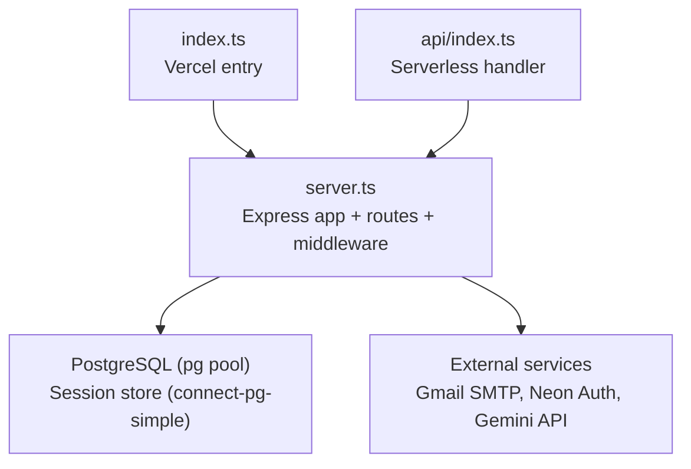
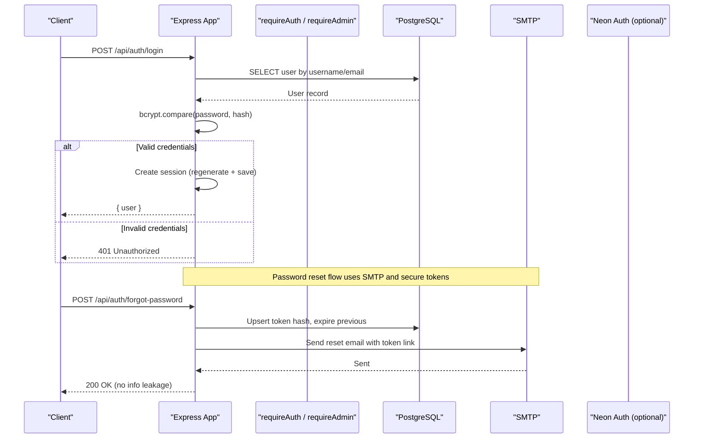
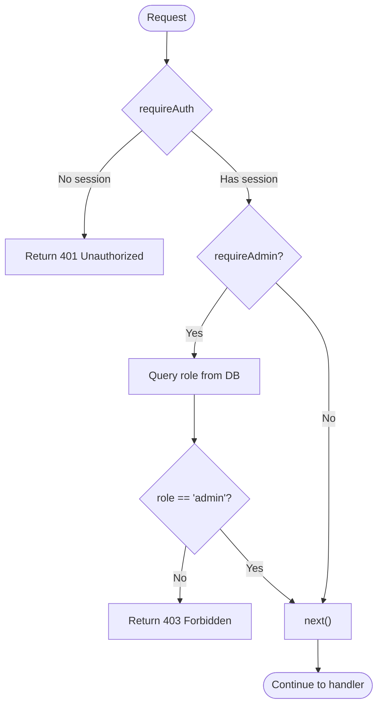
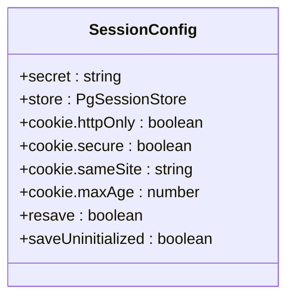
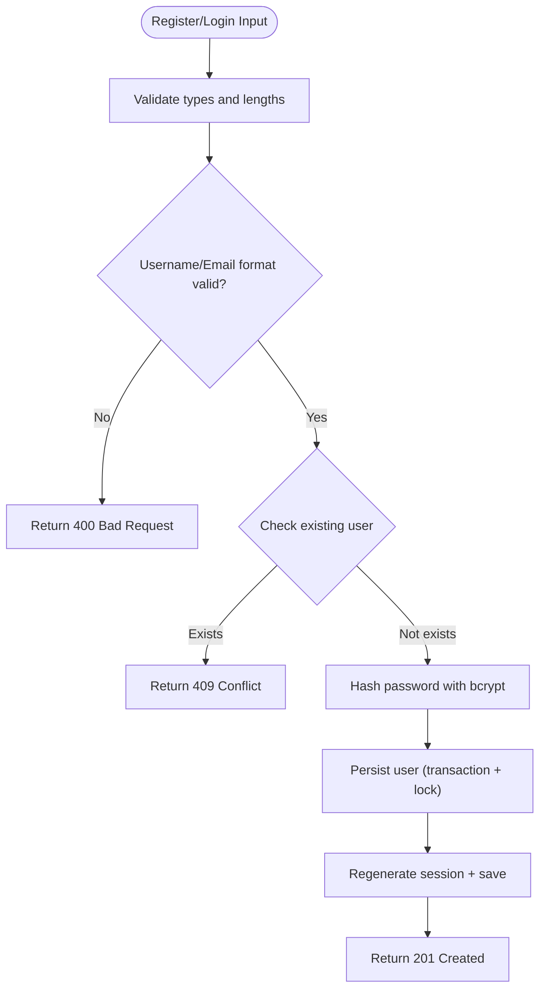
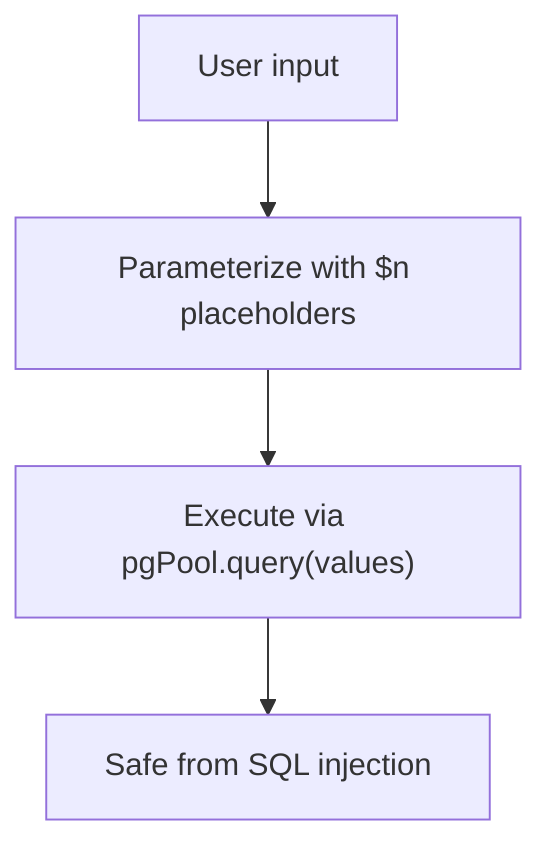
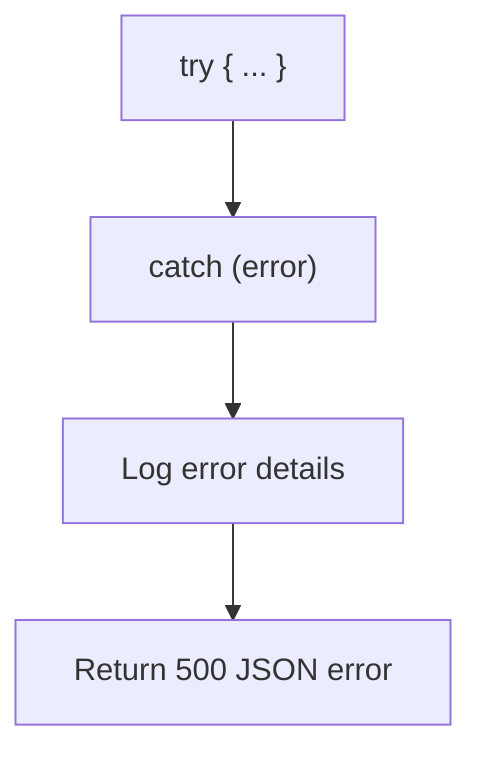
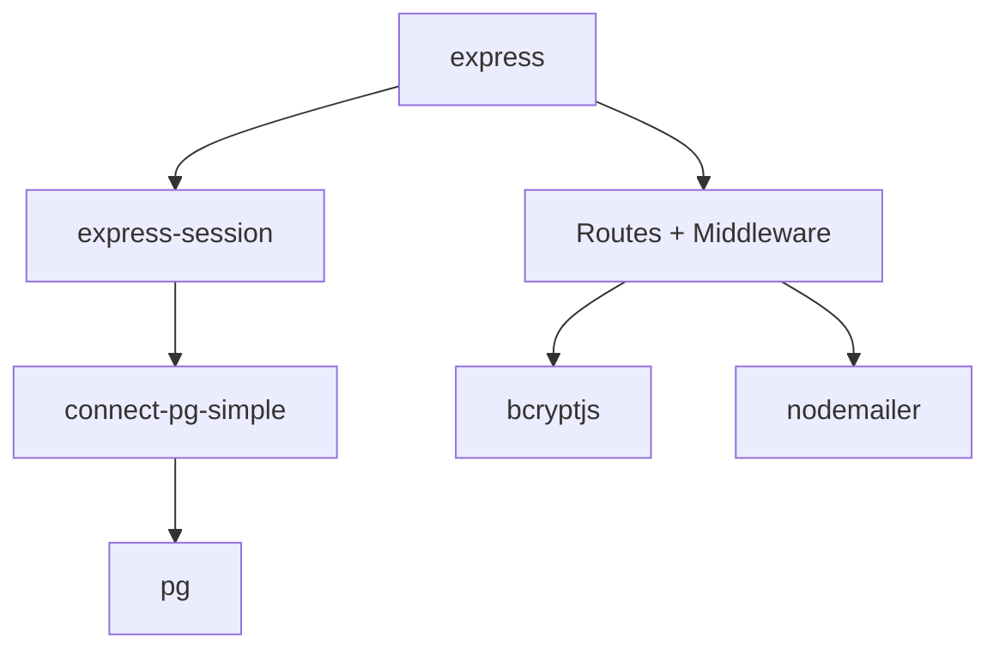

# Middleware & Security

<cite>
**Referenced Files in This Document**
- [server.ts](file://server.ts)
- [index.ts](file://index.ts)
- [api/index.ts](file://api/index.ts)
- [package.json](file://package.json)
</cite>

## Table of Contents
1. [Introduction](#introduction)
2. [Project Structure](#project-structure)
3. [Core Components](#core-components)
4. [Architecture Overview](#architecture-overview)
5. [Detailed Component Analysis](#detailed-component-analysis)
6. [Dependency Analysis](#dependency-analysis)
7. [Performance Considerations](#performance-considerations)
8. [Troubleshooting Guide](#troubleshooting-guide)
9. [Conclusion](#conclusion)

## Introduction
This document explains the Express.js middleware and security patterns implemented in the project. It focuses on custom middleware for authentication and authorization (requireAuth, requireAdmin, requireApiKey, requireCrmToken), input validation, SQL injection prevention, XSS protection via secure cookies, session configuration, CORS considerations, rate limiting guidance, and error handling patterns. The content is structured to be accessible to beginners while providing technical depth for experienced developers.

## Project Structure
The server implementation and middleware are centralized in a single Express application file. Entry points expose the app for both local development and serverless deployment.

**Diagram sources**
- [index.ts:1-20](file://index.ts#L1-L20)
- [api/index.ts:1-5](file://api/index.ts#L1-L5)
- [server.ts:24-35](file://server.ts#L24-L35)

**Section sources**
- [index.ts:1-20](file://index.ts#L1-L20)
- [api/index.ts:1-5](file://api/index.ts#L1-L5)
- [server.ts:24-35](file://server.ts#L24-L35)

## Core Components
- Custom middleware:
  - requireAuth: ensures a valid session exists.
  - requireAdmin: validates admin role by re-checking the database on each request.
  - requireApiKey: validates an API key header for server-to-server calls.
  - requireCrmToken: validates a shared token header for WordPress plugin webhooks.
- Session management:
  - express-session with PostgreSQL-backed store.
  - Secure cookie settings (httpOnly, secure flag based on environment, sameSite, maxAge).
- Input validation:
  - Strict type checks and regex-based username/email validation.
  - Password length enforcement.
- SQL injection prevention:
  - Parameterized queries using pg placeholders ($1, $2, ...).
- XSS protection:
  - httpOnly cookies prevent client-side script access to session cookies.
- Error handling:
  - Consistent JSON error responses and try/catch blocks around async operations.

**Section sources**
- [server.ts:112-125](file://server.ts#L112-L125)
- [server.ts:209-264](file://server.ts#L209-L264)
- [server.ts:266-338](file://server.ts#L266-L338)
- [server.ts:340-381](file://server.ts#L340-L381)
- [server.ts:753-791](file://server.ts#L753-L791)
- [server.ts:795-830](file://server.ts#L795-L830)

## Architecture Overview
The Express app initializes parsing, sessions, and then registers route handlers that use middleware for auth and authorization. External integrations include PostgreSQL for persistence and email, optional Neon Auth for identity, and optional Gemini API for AI features.

**Diagram sources**
- [server.ts:340-381](file://server.ts#L340-L381)
- [server.ts:753-791](file://server.ts#L753-L791)
- [server.ts:795-830](file://server.ts#L795-L830)

## Detailed Component Analysis

### Authentication and Authorization Middleware
- requireAuth
  - Checks req.session.userId; returns 401 if missing.
  - Used to protect endpoints requiring login.
- requireAdmin
  - Ensures session exists, then queries the database to verify current role equals "admin".
  - Updates session.role to reflect latest DB state.
  - Returns 403 if not admin; handles DB errors with 500.
- requireApiKey
  - Reads x-api-key header and compares against SANTI_API_KEY env var.
  - Returns 401 if missing or invalid.
- requireCrmToken
  - Reads x-crm-token header and compares against CRM_INTERNAL_TOKEN env var.
  - Fails closed (503) if the expected token is not configured.
  - Returns 401 if token is missing or mismatched.

**Diagram sources**
- [server.ts:209-235](file://server.ts#L209-L235)

**Section sources**
- [server.ts:209-264](file://server.ts#L209-L264)

### Session Configuration and Secure Cookies
- express-session initialized with:
  - secret from SESSION_SECRET env var (with dev fallback warning).
  - PostgreSQL-backed session store via connect-pg-simple.
  - Cookie options:
    - httpOnly: true
    - secure: true in production
    - sameSite: lax
    - maxAge: 7 days
- Session regeneration on login/register to prevent fixation.
- Logout clears the session and the connect.sid cookie.

**Diagram sources**
- [server.ts:112-125](file://server.ts#L112-L125)
- [server.ts:24-35](file://server.ts#L24-L35)

**Section sources**
- [server.ts:112-125](file://server.ts#L112-L125)
- [server.ts:24-35](file://server.ts#L24-L35)

### Input Validation and Password Handling
- Username/email validation:
  - Regex enforces allowed characters and length.
  - Accepts either classic usernames or email addresses.
- Password validation:
  - Minimum length enforced.
- Registration:
  - Checks for existing username/email.
  - Hashes password with bcrypt before storage.
  - Uses transactions and table locks to ensure only the first account becomes admin.
- Login:
  - Supports username or email.
  - Uses constant-time comparison via bcrypt.compare to mitigate timing attacks.
  - Regenerates session and persists session data.

**Diagram sources**
- [server.ts:266-338](file://server.ts#L266-L338)
- [server.ts:340-381](file://server.ts#L340-L381)

**Section sources**
- [server.ts:266-338](file://server.ts#L266-L338)
- [server.ts:340-381](file://server.ts#L340-L381)

### SQL Injection Prevention
- All database queries use parameterized placeholders ($1, $2, ...) via pg Pool.
- No string concatenation for query construction.
- Example patterns:
  - Select by username/email with LOWER(email) normalization.
  - Insert with explicit column lists and values array.

**Diagram sources**
- [server.ts:279-285](file://server.ts#L279-L285)
- [server.ts:348-351](file://server.ts#L348-L351)

**Section sources**
- [server.ts:279-285](file://server.ts#L279-L285)
- [server.ts:348-351](file://server.ts#L348-L351)

### XSS Protection via Secure Cookies
- httpOnly prevents JavaScript access to session cookies.
- secure flag set in production to enforce HTTPS-only transmission.
- sameSite lax reduces CSRF risk while allowing top-level navigation.

**Section sources**
- [server.ts:118-123](file://server.ts#L118-L123)

### CORS Setup and Cross-Origin Considerations
- The codebase does not explicitly configure CORS middleware.
- For cross-origin requests (e.g., frontend SPA calling backend APIs), consider adding a CORS middleware and restricting allowed origins, methods, and headers.
- Ensure cookies with sameSite and secure flags align with cross-site requirements.

[No sources needed since this section provides general guidance]

### Request Rate Limiting Considerations
- No explicit rate limiting middleware is present.
- Recommendations:
  - Add a rate limiter (e.g., express-rate-limit) for sensitive endpoints like login, register, and password reset.
  - Use per-IP and per-user limits where applicable.
  - Combine with exponential backoff on clients.

[No sources needed since this section provides general guidance]

### Error Handling Middleware
- Each endpoint uses try/catch blocks and returns consistent JSON error objects.
- Session creation includes a timeout guard to avoid hanging responses.
- Database initialization errors are caught and logged without blocking startup.

**Diagram sources**
- [server.ts:334-338](file://server.ts#L334-L338)
- [server.ts:377-381](file://server.ts#L377-L381)
- [server.ts:551-591](file://server.ts#L551-L591)

**Section sources**
- [server.ts:334-338](file://server.ts#L334-L338)
- [server.ts:377-381](file://server.ts#L377-L381)
- [server.ts:551-591](file://server.ts#L551-L591)

### Practical Examples: Middleware Development Patterns
- Protecting routes with requireAuth:
  - Apply middleware before route handlers to ensure authenticated users.
- Admin-only endpoints:
  - Chain requireAuth and requireAdmin to restrict sensitive operations.
- Server-to-server endpoints:
  - Use requireApiKey for internal service calls.
  - Use requireCrmToken for webhook endpoints from external systems.

Example references:
- requireAuth usage pattern: [server.ts:209-214](file://server.ts#L209-L214)
- requireAdmin usage pattern: [server.ts:216-235](file://server.ts#L216-L235)
- requireApiKey usage pattern: [server.ts:240-246](file://server.ts#L240-L246)
- requireCrmToken usage pattern: [server.ts:253-264](file://server.ts#L253-L264)

**Section sources**
- [server.ts:209-264](file://server.ts#L209-L264)

## Dependency Analysis
Key runtime dependencies relevant to middleware and security:
- express: HTTP server and middleware framework.
- express-session: Session management.
- connect-pg-simple: PostgreSQL-backed session store.
- pg: PostgreSQL client for parameterized queries.
- bcryptjs: Password hashing and comparison.
- nodemailer: Email transport for password reset flows.

**Diagram sources**
- [package.json:15-45](file://package.json#L15-L45)

**Section sources**
- [package.json:15-45](file://package.json#L15-L45)

## Performance Considerations
- Session store backed by PostgreSQL avoids memory growth and supports horizontal scaling.
- Parameterized queries reduce overhead and improve safety.
- Session regeneration on login/register mitigates session fixation risks.
- Avoid unnecessary DB reads by caching roles judiciously; however, the code refreshes role on critical endpoints to ensure immediate effect after role changes.

[No sources needed since this section provides general guidance]

## Troubleshooting Guide
Common issues and resolutions:
- Missing SESSION_SECRET:
  - A development fallback is used; set SESSION_SECRET in production.
- SMTP not configured:
  - Password reset will fail; ensure SMTP_USER and SMTP_PASS are set.
- CRM webhook misconfiguration:
  - requireCrmToken returns 503 when CRM_INTERNAL_TOKEN is missing; configure the environment variable.
- Session save timeouts:
  - createSession includes a timeout guard; check DB connectivity and session store health.

**Section sources**
- [server.ts:107-110](file://server.ts#L107-L110)
- [server.ts:145-148](file://server.ts#L145-L148)
- [server.ts:253-264](file://server.ts#L253-L264)
- [server.ts:551-591](file://server.ts#L551-L591)

## Conclusion
The project implements robust middleware and security practices centered around Express.js. Authentication and authorization are enforced through clear middleware functions, input validation is strict, SQL injection is prevented via parameterized queries, and XSS risks are mitigated with secure cookie settings. While CORS and rate limiting are not explicitly configured, the foundation allows straightforward integration of these protections. Error handling is consistent and resilient, ensuring reliable operation across environments.