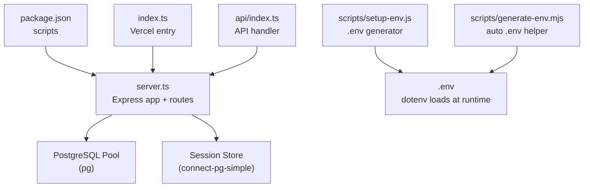
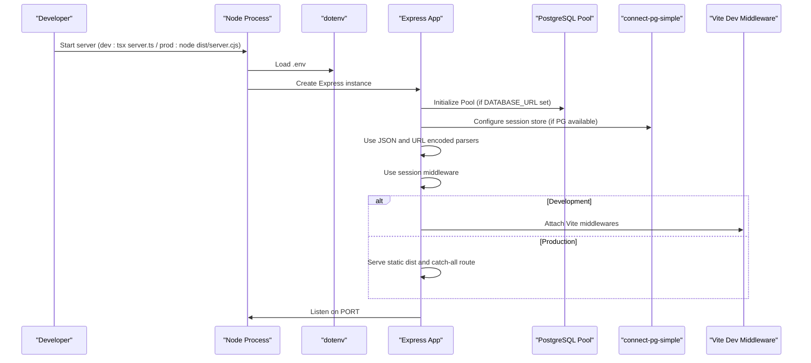
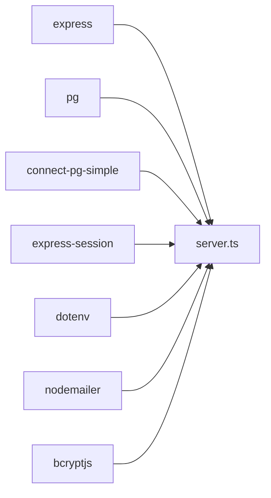

# Server Initialization & Configuration

<cite>
**Referenced Files in This Document**
- [server.ts](file://server.ts)
- [index.ts](file://index.ts)
- [api/index.ts](file://api/index.ts)
- [package.json](file://package.json)
- [scripts/setup-env.js](file://scripts/setup-env.js)
- [scripts/generate-env.mjs](file://scripts/generate-env.mjs)
</cite>

## Table of Contents
1. Introduction
2. Project Structure
3. Core Components
4. Architecture Overview
5. Detailed Component Analysis
6. Dependency Analysis
7. Performance Considerations
8. Troubleshooting Guide
9. Conclusion

## Introduction
This document explains how the Express server is bootstrapped and configured, including environment variable loading with dotenv, port configuration, database connection initialization, PostgreSQL pool settings (with SSL for production), session store setup using connect-pg-simple, and development fallbacks. It also documents the middleware stack (JSON parsing, URL encoding, sessions) and shows practical examples for starting the server, configuring environments, and connecting to the database. The content targets both beginners and experienced developers, using terminology consistent with the codebase.

## Project Structure
The server entry points are:
- Development: tsx runs server.ts directly.
- Production build: esbuild bundles server.ts into dist/server.cjs; Node starts it.
- Vercel serverless: index.ts imports server.ts, runs DB init functions, and exports the Express app.
- API adapter: api/index.ts forwards requests to the same Express app.

**Diagram sources**
- [server.ts:1-20](file://server.ts#L1-L20)
- [index.ts:1-20](file://index.ts#L1-L20)
- [api/index.ts:1-5](file://api/index.ts#L1-L5)
- [package.json:6-13](file://package.json#L6-L13)
- [scripts/setup-env.js:1-20](file://scripts/setup-env.js#L1-L20)
- [scripts/generate-env.mjs:1-20](file://scripts/generate-env.mjs#L1-L20)

**Section sources**
- [server.ts:1-20](file://server.ts#L1-L20)
- [index.ts:1-20](file://index.ts#L1-L20)
- [api/index.ts:1-5](file://api/index.ts#L1-L5)
- [package.json:6-13](file://package.json#L6-L13)

## Core Components
- Environment loading: dotenv.config() is called early to load .env variables.
- Port configuration: PORT from process.env.PORT or default 3000.
- Database connection: pg.Pool initialized when DATABASE_URL is present; otherwise a mock pool is used for development.
- Session store: connect-pg-simple stores sessions in PostgreSQL when available; undefined in dev fallback.
- Middleware stack: JSON body parser, URL-encoded body parser, and express-session with secure cookie settings.
- Server startup: static assets in production, Vite dev middleware in development, and graceful error handling on listen.

Key implementation references:
- dotenv config and Express creation: [server.ts:7-18](file://server.ts#L7-L18)
- Port and env usage: [server.ts:19](file://server.ts#L19)
- PG pool and session store setup: [server.ts:24-35](file://server.ts#L24-L35)
- Dev fallback mock pool and session store: [server.ts:36-77](file://server.ts#L36-L77)
- Body parsers and session middleware: [server.ts:79-125](file://server.ts#L79-L125)
- Production static serving and listen: [server.ts:5088-5118](file://server.ts#L5088-L5118)
- Vite dev middleware: [server.ts:5141-5154](file://server.ts#L5141-L5154)

**Section sources**
- [server.ts:7-18](file://server.ts#L7-L18)
- [server.ts:19](file://server.ts#L19)
- [server.ts:24-35](file://server.ts#L24-L35)
- [server.ts:36-77](file://server.ts#L36-L77)
- [server.ts:79-125](file://server.ts#L79-L125)
- [server.ts:5088-5118](file://server.ts#L5088-L5118)
- [server.ts:5141-5154](file://server.ts#L5141-L5154)

## Architecture Overview
The application initializes the Express app, sets up environment-driven configuration, connects to PostgreSQL (or uses a mock), configures persistent sessions, and then listens for HTTP requests. In development, Vite’s middleware serves the SPA and hot reloads. In production, static files are served and the app binds to the configured port.

**Diagram sources**
- [server.ts:7-18](file://server.ts#L7-L18)
- [server.ts:24-35](file://server.ts#L24-L35)
- [server.ts:79-125](file://server.ts#L79-L125)
- [server.ts:5088-5118](file://server.ts#L5088-L5118)
- [server.ts:5141-5154](file://server.ts#L5141-L5154)

## Detailed Component Analysis

### Application Bootstrap and Environment Loading
- dotenv.config() is executed before any other module-level logic to ensure environment variables are available.
- The Express app is created immediately after loading env.
- PORT is derived from process.env.PORT with a sensible default.

Practical example:
- Ensure .env contains PORT, NODE_ENV, DATABASE_URL, SESSION_SECRET, and other required keys.
- Run development via npm script that invokes tsx server.ts.

**Section sources**
- [server.ts:7-18](file://server.ts#L7-L18)
- [server.ts:19](file://server.ts#L19)
- [package.json:6-13](file://package.json#L6-L13)

### PostgreSQL Pool Configuration and SSL Settings
- If DATABASE_URL is set, a pg.Pool is created with connectionString and ssl options.
- In production (NODE_ENV === "production"), ssl.rejectUnauthorized is enabled to enforce SSL verification.
- In development, SSL is disabled for local convenience.

Best practices:
- Always provide a valid DATABASE_URL in production.
- Keep NODE_ENV set appropriately to control SSL behavior.

**Section sources**
- [server.ts:24-28](file://server.ts#L24-L28)

### Session Store Setup with connect-pg-simple and Development Fallback
- When PG is available, connect-pg-simple creates a PgSessionStore backed by a "session" table.
- createTableIfMissing ensures the table exists automatically.
- In development without DATABASE_URL, sessionStore is undefined, so sessions use memory-backed defaults.

Security notes:
- SESSION_SECRET should be a strong random value in production.
- Cookie settings include httpOnly, secure (in production), sameSite lax, and maxAge.

**Section sources**
- [server.ts:29-35](file://server.ts#L29-L35)
- [server.ts:36-77](file://server.ts#L36-L77)
- [server.ts:107-125](file://server.ts#L107-L125)

### Middleware Stack: JSON Parsing, URL Encoding, and Sessions
- express.json() parses JSON request bodies.
- express.urlencoded({ extended: false }) parses URL-encoded forms.
- express-session is mounted with secret, resave, saveUninitialized, and cookie options.

Operational tips:
- Ensure content-type headers match expected formats for clients.
- For stateless APIs, consider token-based auth instead of sessions.

**Section sources**
- [server.ts:79-81](file://server.ts#L79-L81)
- [server.ts:112-125](file://server.ts#L112-L125)

### Server Startup: Static Assets, Listening, and Error Handling
- In production, static files under dist are served, and a catch-all route returns index.html for SPA routing.
- The server listens on PORT bound to 0.0.0.0 for containerized deployments.
- EADDRINUSE and other listen errors are handled gracefully to avoid crash loops.
- In development, Vite middleware is attached after DB initialization.

Production readiness checklist:
- Build assets with vite build and bundle server.ts with esbuild.
- Set NODE_ENV=production and configure DATABASE_URL.

**Section sources**
- [server.ts:5088-5118](file://server.ts#L5088-L5118)
- [server.ts:5141-5154](file://server.ts#L5141-L5154)

### Database Initialization Functions
- initUsersTable creates users and adds email/neon_auth_id columns idempotently.
- initPasswordResetTokensTable creates password reset tokens with indexes.
- initChatbotLeadsTable creates chatbot_leads table.
- initSantiTables creates santi_leads, santi_brochures, and santi_notes tables.
- Additional init functions exist for prospecting, WhatsApp, agents, and LMS tables.

These functions are invoked after the port is bound to avoid blocking responses.

**Section sources**
- [server.ts:3430-3444](file://server.ts#L3430-L3444)
- [server.ts:3446-3460](file://server.ts#L3446-L3460)
- [server.ts:3468-3484](file://server.ts#L3468-L3484)
- [server.ts:3586-3625](file://server.ts#L3586-L3625)
- [server.ts:5120-5132](file://server.ts#L5120-L5132)

### Vercel Serverless Entry Point
- index.ts loads dotenv, imports the Express app and DB init functions, runs them sequentially, and exports the app.
- This pattern allows Vercel to invoke the exported app as a serverless function.

**Section sources**
- [index.ts:1-20](file://index.ts#L1-L20)

### API Adapter
- api/index.ts exports a handler that forwards requests to the Express app, enabling alternative deployment adapters.

**Section sources**
- [api/index.ts:1-5](file://api/index.ts#L1-L5)

### Environment Variable Management Scripts
- scripts/setup-env.js guides interactive creation/update of .env with descriptions and acquisition links.
- scripts/generate-env.mjs auto-populates missing variables with safe defaults or secrets.

Usage:
- Run npm run setup:env to generate or update .env.
- Pre-run hook npm run predev executes setup before dev.

**Section sources**
- [scripts/setup-env.js:1-20](file://scripts/setup-env.js#L1-L20)
- [scripts/generate-env.mjs:1-20](file://scripts/generate-env.mjs#L1-L20)
- [package.json:6-13](file://package.json#L6-L13)

## Dependency Analysis
The server depends on:
- express for HTTP server and middleware.
- pg for PostgreSQL connections and pooling.
- connect-pg-simple for session persistence.
- express-session for session management.
- dotenv for environment loading.
- nodemailer for email sending.
- bcryptjs for password hashing.

**Diagram sources**
- [server.ts:1-15](file://server.ts#L1-L15)
- [package.json:15-45](file://package.json#L15-L45)

**Section sources**
- [server.ts:1-15](file://server.ts#L1-L15)
- [package.json:15-45](file://package.json#L15-L45)

## Performance Considerations
- Connection pooling: Reuse pg.Pool across requests to minimize overhead.
- SSL in production: Enforce SSL to reduce latency and improve security.
- Session persistence: Persistent sessions avoid re-authentication but add DB round-trips; ensure proper indexing on session tables.
- Static asset serving: Serve built assets directly in production to avoid unnecessary processing.
- Graceful error handling: Avoid restart loops by handling EADDRINUSE and listen errors.

[No sources needed since this section provides general guidance]

## Troubleshooting Guide
Common issues and resolutions:
- Missing DATABASE_URL: Server falls back to mock pool and memory sessions; verify .env and environment.
- EADDRINUSE: Another process occupies PORT; kill the process or change PORT.
- Session not persisting: Ensure connect-pg-simple is configured and session table exists.
- SSL errors in production: Confirm NODE_ENV=production and correct DATABASE_URL with SSL parameters.
- Vite dev issues: Ensure HMR clientPort matches proxy settings (e.g., 443 on Replit).

**Section sources**
- [server.ts:36-77](file://server.ts#L36-L77)
- [server.ts:5111-5118](file://server.ts#L5111-L5118)
- [server.ts:5141-5154](file://server.ts#L5141-L5154)

## Conclusion
The server bootstrap integrates environment loading, Express configuration, PostgreSQL connectivity, and session persistence with robust fallbacks for development. Production mode enforces SSL and serves static assets efficiently. Using the provided scripts, you can manage environment variables safely and consistently across environments.

[No sources needed since this section summarizes without analyzing specific files]