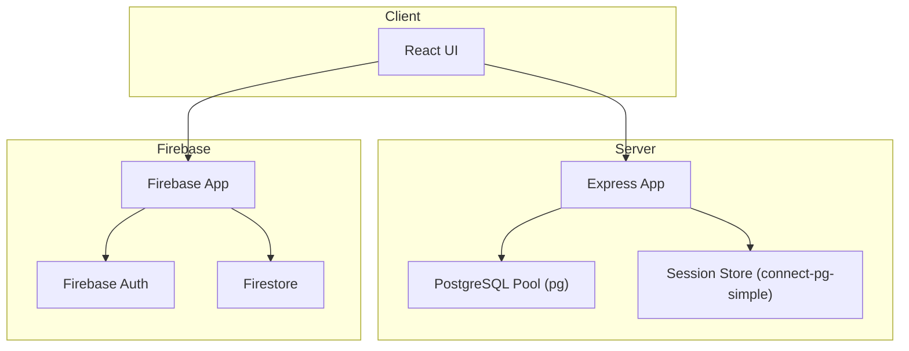
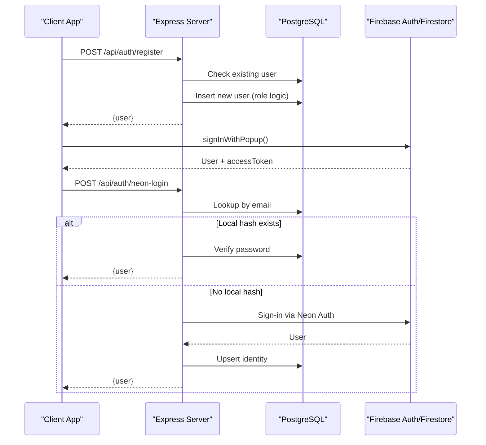
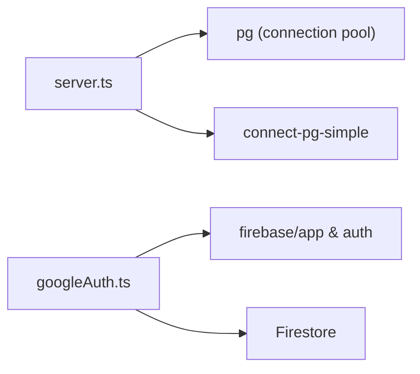

# Database Layer

<cite>
**Referenced Files in This Document**
- [server.ts](file://server.ts)
- [package.json](file://package.json)
- [firebase-applet-config.json](file://firebase-applet-config.json)
- [firestore.rules](file://firestore.rules)
- [firebase-blueprint.json](file://firebase-blueprint.json)
- [googleAuth.ts](file://src/lib/googleAuth.ts)
- [AiHubTab.tsx](file://src/components/AiHubTab.tsx)
- [generate-env.mjs](file://scripts/generate-env.mjs)
- [sync-secrets.mjs](file://scripts/sync-secrets.mjs)
- [SettingsTab.tsx](file://src/components/SettingsTab.tsx)
- [CrmFullConfig.tsx](file://src/components/crm-full/CrmFullConfig.tsx)
- [SKILL.md](file://.agents/skills/supabase-postgres-best-practices/SKILL.md)
- [conn-pooling.md](file://.agents/skills/supabase-postgres-best-practices/references/conn-pooling.md)
- [conn-idle-timeout.md](file://.agents/skills/supabase-postgres-best-practices/references/conn-idle-timeout.md)
- [conn-limits.md](file://.agents/skills/supabase-postgres-best-practices/references/conn-limits.md)
- [query-missing-indexes.md](file://.agents/skills/supabase-postgres-best-practices/references/query-missing-indexes.md)
- [data-batch-inserts.md](file://.agents/skills/supabase-postgres-best-practices/references/data-batch-inserts.md)
- [schema-constraints.md](file://.agents/skills/supabase-postgres-best-practices/references/schema-constraints.md)
</cite>

## Table of Contents
1. Introduction
2. Project Structure
3. Core Components
4. Architecture Overview
5. Detailed Component Analysis
6. Dependency Analysis
7. Performance Considerations
8. Troubleshooting Guide
9. Conclusion

## Introduction
This document explains the database layer with a focus on PostgreSQL and Firebase integration. It covers schema design, connection pooling configuration, data access patterns, Firestore security rules, migration strategies, backup procedures, and performance optimization techniques. The content is structured to be accessible for beginners while providing technical depth for experienced developers.

## Project Structure
The application uses:
- A Node.js server (Express) that connects to PostgreSQL via a connection pool and stores sessions in PostgreSQL.
- Firebase for client-side authentication and Firestore as a real-time cloud database.
- Configuration files for Firebase project settings and Firestore rules.
- Scripts to generate environment variables and sync secrets across environments.

**Diagram sources**
- [server.ts:1-80](file://server.ts#L1-L80)
- [package.json:15-45](file://package.json#L15-L45)
- [firebase-applet-config.json:1-12](file://firebase-applet-config.json#L1-L12)

**Section sources**
- [server.ts:1-80](file://server.ts#L1-L80)
- [package.json:15-45](file://package.json#L15-L45)
- [firebase-applet-config.json:1-12](file://firebase-applet-config.json#L1-L12)

## Core Components
- PostgreSQL connection pool:
  - Created using the pg library with a connection string from environment variables.
  - SSL enabled in production.
  - Used for all database operations including user registration, login, and role checks.
- Session storage:
  - Sessions are persisted in PostgreSQL using connect-pg-simple.
  - A session table is created automatically if missing.
- Firebase initialization:
  - Client-side Firebase app initialized with project configuration.
  - Google authentication provider configured for sign-in flows.
- Firestore rules:
  - Currently allow read/write to all documents; should be tightened for production.
- Environment configuration:
  - DATABASE_URL and other DB-related variables managed via scripts and UI settings.

**Section sources**
- [server.ts:20-35](file://server.ts#L20-L35)
- [server.ts:112-125](file://server.ts#L112-L125)
- [googleAuth.ts:1-10](file://src/lib/googleAuth.ts#L1-L10)
- [firestore.rules:1-9](file://firestore.rules#L1-L9)
- [generate-env.mjs:10-25](file://scripts/generate-env.mjs#L10-L25)
- [SettingsTab.tsx:138-165](file://src/components/SettingsTab.tsx#L138-L165)

## Architecture Overview
The system integrates two databases:
- PostgreSQL for relational data and session persistence.
- Firestore for real-time synchronization and cloud-backed data.

**Diagram sources**
- [server.ts:266-338](file://server.ts#L266-L338)
- [server.ts:683-748](file://server.ts#L683-L748)
- [googleAuth.ts:33-49](file://src/lib/googleAuth.ts#L33-L49)

## Detailed Component Analysis

### PostgreSQL Connection Pooling and Configuration
- The server initializes a pg.Pool with a connection string from DATABASE_URL.
- SSL is enabled in production mode.
- connect-pg-simple is used to persist sessions in PostgreSQL.
- If DATABASE_URL is not set, a mock pool is used for development.

Best practices applied:
- Use connection pooling to handle concurrency efficiently.
- Configure idle timeouts to reclaim resources.
- Set appropriate max_connections based on available memory.

Recommendations:
- Ensure sslmode=require in production connection strings.
- Monitor pg_stat_activity for connection usage.
- Tune work_mem and max_connections according to instance size.

**Section sources**
- [server.ts:20-35](file://server.ts#L20-L35)
- [server.ts:29-34](file://server.ts#L29-L34)
- [conn-pooling.md:1-42](file://.agents/skills/supabase-postgres-best-practices/references/conn-pooling.md#L1-L42)
- [conn-idle-timeout.md:1-47](file://.agents/skills/supabase-postgres-best-practices/references/conn-idle-timeout.md#L1-L47)
- [conn-limits.md:1-45](file://.agents/skills/supabase-postgres-best-practices/references/conn-limits.md#L1-L45)

### Data Access Patterns and Schema Design
- Users table supports username/email-based authentication and role management.
- Registration flow includes transactional inserts with table-level locking to ensure the first user becomes admin.
- Login flow verifies bcrypt hashes and creates sessions.
- Password reset tokens are stored and hashed securely.

Schema considerations:
- Use lowercase identifiers for compatibility.
- Add constraints safely in migrations.
- Index frequently filtered columns (e.g., email).

Data access patterns:
- Batch inserts for bulk operations.
- Avoid N+1 queries by batching or using JOINs.

**Section sources**
- [server.ts:266-338](file://server.ts#L266-L338)
- [server.ts:340-381](file://server.ts#L340-L381)
- [server.ts:750-791](file://server.ts#L750-L791)
- [schema-constraints.md:1-81](file://.agents/skills/supabase-postgres-best-practices/references/schema-constraints.md#L1-L81)
- [query-missing-indexes.md:1-44](file://.agents/skills/supabase-postgres-best-practices/references/query-missing-indexes.md#L1-L44)
- [data-batch-inserts.md:1-55](file://.agents/skills/supabase-postgres-best-practices/references/data-batch-inserts.md#L1-L55)

### Firebase Integration and Firestore Rules
- Firebase app is initialized with project configuration from firebase-applet-config.json.
- Google authentication is configured with Drive scope.
- Firestore rules currently allow unrestricted read/write access.

Security recommendations:
- Restrict Firestore rules to authenticated users only.
- Implement role-based access control.
- Validate data schemas using Firestore security rules.

Real-time capabilities:
- Use Firestore listeners for live updates.
- Cache access tokens to avoid repeated sign-ins.

**Section sources**
- [firebase-applet-config.json:1-12](file://firebase-applet-config.json#L1-L12)
- [googleAuth.ts:1-10](file://src/lib/googleAuth.ts#L1-L10)
- [firestore.rules:1-9](file://firestore.rules#L1-L9)

### Migration Strategies and Backup Procedures
- Migrations should be idempotent and safe to run multiple times.
- Use DO blocks to check constraint existence before adding.
- For large tables, consider partitioning for performance.
- Backups can be performed using pg_dump and restored with pg_restore.

Operational guidance:
- Test migrations in staging before production.
- Monitor query plans with EXPLAIN ANALYZE.
- Use VACUUM and ANALYZE regularly.

**Section sources**
- [schema-constraints.md:1-81](file://.agents/skills/supabase-postgres-best-practices/references/schema-constraints.md#L1-L81)
- [SKILL.md:1-65](file://.agents/skills/supabase-postgres-best-practices/SKILL.md#L1-L65)

### Performance Optimization Techniques
- Add indexes on WHERE and JOIN columns.
- Use partial indexes for filtered queries.
- Batch INSERT statements for bulk data.
- Eliminate N+1 queries with batch loading.

Monitoring and diagnostics:
- Use pg_stat_statements to identify slow queries.
- Monitor vacuum and analyze processes.

**Section sources**
- [query-missing-indexes.md:1-44](file://.agents/skills/supabase-postgres-best-practices/references/query-missing-indexes.md#L1-L44)
- [data-batch-inserts.md:1-55](file://.agents/skills/supabase-postgres-best-practices/references/data-batch-inserts.md#L1-L55)

## Dependency Analysis
The database layer depends on:
- pg library for PostgreSQL connections.
- connect-pg-simple for session storage.
- Firebase SDK for client-side authentication and Firestore.

**Diagram sources**
- [server.ts:1-15](file://server.ts#L1-L15)
- [package.json:28-39](file://package.json#L28-L39)
- [googleAuth.ts:1-5](file://src/lib/googleAuth.ts#L1-L5)

**Section sources**
- [server.ts:1-15](file://server.ts#L1-L15)
- [package.json:28-39](file://package.json#L28-L39)
- [googleAuth.ts:1-5](file://src/lib/googleAuth.ts#L1-L5)

## Performance Considerations
- Connection pooling is critical for handling concurrent users efficiently.
- Proper indexing reduces query latency significantly.
- Batch operations minimize round trips to the database.
- Monitoring tools help identify bottlenecks and optimize queries.

[No sources needed since this section provides general guidance]

## Troubleshooting Guide
Common issues and solutions:
- Database connection failures: Verify DATABASE_URL and SSL settings.
- Session storage errors: Ensure PostgreSQL session table exists.
- Firestore permission denied: Update firestore.rules to allow authenticated access.
- Slow queries: Add indexes and use EXPLAIN ANALYZE.

Debugging steps:
- Check server logs for error messages.
- Monitor PostgreSQL activity with pg_stat_activity.
- Validate Firebase configuration and rules.

**Section sources**
- [server.ts:35-77](file://server.ts#L35-L77)
- [firestore.rules:1-9](file://firestore.rules#L1-L9)

## Conclusion
The database layer combines PostgreSQL for relational data and sessions with Firebase for real-time capabilities. Proper configuration of connection pooling, indexing, and security rules ensures optimal performance and security. Following best practices for migrations, backups, and monitoring will maintain system reliability and scalability.

[No sources needed since this section summarizes without analyzing specific files]