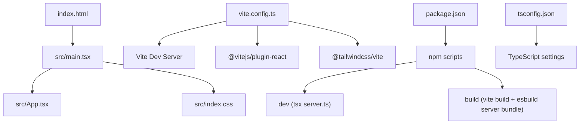
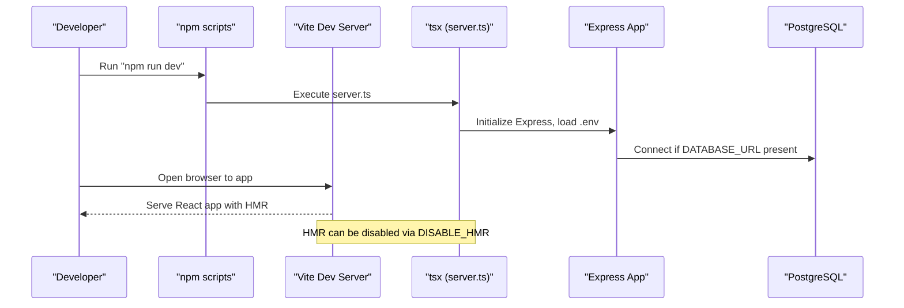
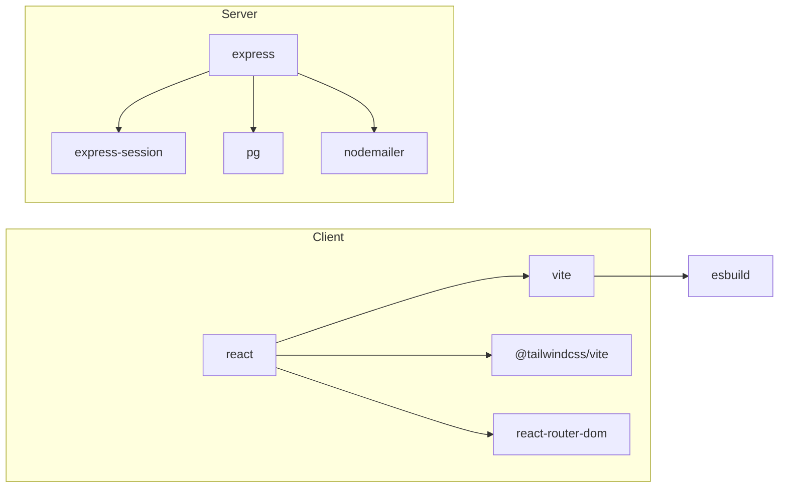

# Build Configuration

<cite>
**Referenced Files in This Document**
- [package.json](file://package.json)
- [vite.config.ts](file://vite.config.ts)
- [tsconfig.json](file://tsconfig.json)
- [index.html](file://index.html)
- [src/index.css](file://src/index.css)
- [src/main.tsx](file://src/main.tsx)
- [server.ts](file://server.ts)
- [scripts/setup-env.js](file://scripts/setup-env.js)
- [scripts/generate-env.mjs](file://scripts/generate-env.mjs)
</cite>

## Table of Contents
1. Introduction
2. Project Structure
3. Core Components
4. Architecture Overview
5. Detailed Component Analysis
6. Dependency Analysis
7. Performance Considerations
8. Troubleshooting Guide
9. Conclusion

## Introduction
This document explains the build configuration for development and production, focusing on Vite setup, TypeScript compilation, Tailwind CSS integration, and npm scripts that drive development, building, and deployment workflows. It also covers global CSS architecture, theme configuration, and asset management strategies. The content is structured to be accessible to beginners while providing technical depth for experienced developers.

## Project Structure
The project uses a modern stack centered around Vite for fast builds and HMR, React with TypeScript, and Tailwind CSS v4 for styling. The entry points are:
- HTML template that mounts the app and loads the module entry
- Vite config enabling React and Tailwind plugins, path aliases, and dev server behavior
- TypeScript configuration aligned with bundler resolution and JSX transform
- Global CSS importing Tailwind v4
- A Node/Express server used during development and bundled for production

**Diagram sources**
- [index.html:1-14](file://index.html#L1-L14)
- [src/main.tsx:1-11](file://src/main.tsx#L1-L11)
- [vite.config.ts:1-23](file://vite.config.ts#L1-L23)
- [package.json:1-64](file://package.json#L1-L64)
- [tsconfig.json:1-27](file://tsconfig.json#L1-L27)

**Section sources**
- [index.html:1-14](file://index.html#L1-L14)
- [src/main.tsx:1-11](file://src/main.tsx#L1-L11)
- [vite.config.ts:1-23](file://vite.config.ts#L1-L23)
- [package.json:1-64](file://package.json#L1-L64)
- [tsconfig.json:1-27](file://tsconfig.json#L1-L27)

## Core Components
- Vite configuration: Enables React plugin, Tailwind v4 plugin, path aliasing, and controlled HMR via environment variable.
- TypeScript configuration: Targets ES2022, uses bundler module resolution, isolated modules, JSX react-jsx transform, and noEmit for type-check only.
- Tailwind CSS: Imported globally from src/index.css using Tailwind v4 import directive.
- Entry points: index.html defines the root element and module script; src/main.tsx bootstraps React and imports global CSS.
- Scripts: package.json provides dev, build, start, clean, lint, and predev hooks for environment setup.

Key responsibilities:
- Development experience: Fast HMR, optional file watching control, and immediate feedback.
- Production build: Static assets built by Vite; server code bundled with esbuild into a CommonJS output.
- Type safety: TypeScript configured for strict checks without emitting files.

**Section sources**
- [vite.config.ts:1-23](file://vite.config.ts#L1-L23)
- [tsconfig.json:1-27](file://tsconfig.json#L1-L27)
- [src/index.css:1-2](file://src/index.css#L1-L2)
- [index.html:1-14](file://index.html#L1-L14)
- [src/main.tsx:1-11](file://src/main.tsx#L1-L11)
- [package.json:1-64](file://package.json#L1-L64)

## Architecture Overview
The build pipeline integrates Vite for client-side assets and esbuild for server-side bundling. Environment variables are managed through helper scripts and loaded at runtime by the server.

**Diagram sources**
- [package.json:1-64](file://package.json#L1-L64)
- [server.ts:1-800](file://server.ts#L1-L800)
- [vite.config.ts:1-23](file://vite.config.ts#L1-L23)

## Detailed Component Analysis

### Vite Configuration
- Plugins: React and Tailwind v4 are enabled.
- Path alias: @ maps to the project root for cleaner imports.
- Dev server: HMR toggled via DISABLE_HMR; file watching disabled when HMR is off to reduce CPU usage during agent edits.

Practical customization examples:
- Add a new dependency: Install via package manager and import in components; Vite will include it automatically.
- Configure build optimizations: Extend vite.config.ts with optimization flags such as chunk splitting or minification options.
- Extend development environment: Add proxy rules or custom middleware under server configuration.

**Section sources**
- [vite.config.ts:1-23](file://vite.config.ts#L1-L23)

### TypeScript Compilation Settings
- Target and libraries: ES2022 target with DOM and DOM.Iterable libs for browser APIs.
- Module system: ESNext with bundler resolution and isolatedModules for faster type checking.
- JSX: react-jsx transform for modern React.
- Paths: @/* mapped to project root matching Vite alias.
- No emit: Type checking only; outputs handled by Vite and esbuild.

Common scenarios:
- Enable stricter checks: Adjust compilerOptions for additional flags like strict or noUncheckedIndexedAccess.
- Add lib features: Include additional lib entries if targeting newer browser capabilities.

**Section sources**
- [tsconfig.json:1-27](file://tsconfig.json#L1-L27)

### Tailwind CSS Integration
- Global import: Tailwind v4 is imported in src/index.css using the official import directive.
- Theme usage: Components use Tailwind utility classes and dynamic theme mappings for color variants.

Customization tips:
- Add custom utilities or extend theme via Tailwind configuration if needed.
- Use class-variance-authority and tailwind-merge for component-level variant composition.

**Section sources**
- [src/index.css:1-2](file://src/index.css#L1-L2)

### Entry Points and Asset Management
- HTML template: Defines viewport, title, favicon, and the root div for mounting.
- Main entry: Bootstraps React StrictMode and renders App; imports global CSS.
- Assets: Static assets can be placed under public and referenced directly; Vite handles caching and hashing for optimized delivery.

Best practices:
- Keep large images under public or lazy-load them in components.
- Use relative paths for static assets referenced from CSS.

**Section sources**
- [index.html:1-14](file://index.html#L1-L14)
- [src/main.tsx:1-11](file://src/main.tsx#L1-L11)

### Package.json Scripts and Workflows
- Predev: Runs environment setup before starting dev server.
- Dev: Starts the server with tsx for live reload of server code.
- Build: Builds client assets with Vite and bundles server code with esbuild into dist/server.cjs.
- Start: Runs the production server from the bundled output.
- Clean: Removes build artifacts.
- Lint: Performs TypeScript type checking without emitting files.

Workflow guidance:
- For local development, ensure environment variables are set via setup scripts.
- For production, run build then start; ensure required env vars are provided to the runtime.

**Section sources**
- [package.json:1-64](file://package.json#L1-L64)

### Environment Setup and Runtime Configuration
- Interactive setup: scripts/setup-env.js guides creation/update of .env with descriptions and guides for each key.
- Automated generation: scripts/generate-env.mjs auto-populates missing variables with defaults or generated values.
- Runtime loading: server.ts loads dotenv and reads environment variables for database connections, sessions, and integrations.

Operational notes:
- Always provide secure secrets in production (SESSION_SECRET, API keys).
- Disable HMR in environments where file watching causes issues (e.g., AI Studio).

**Section sources**
- [scripts/setup-env.js:1-260](file://scripts/setup-env.js#L1-L260)
- [scripts/generate-env.mjs:1-73](file://scripts/generate-env.mjs#L1-L73)
- [server.ts:1-800](file://server.ts#L1-L800)

## Dependency Analysis
Client-side dependencies include React, Vite, Tailwind v4, and UI utilities. Server-side dependencies include Express, PostgreSQL client, session store, email transport, and authentication helpers.

**Diagram sources**
- [package.json:1-64](file://package.json#L1-L64)

**Section sources**
- [package.json:1-64](file://package.json#L1-L64)

## Performance Considerations
- Development: HMR provides instant feedback; disable file watching when not needed to reduce CPU usage.
- Production: Vite optimizes assets and code splitting; esbuild produces a compact CommonJS server bundle.
- Type checking: TypeScript runs in isolated mode for speed; consider adding incremental checks in CI pipelines.
- Asset strategy: Lazy-load heavy resources and leverage browser caching via hashed filenames.

[No sources needed since this section provides general guidance]

## Troubleshooting Guide
- Missing environment variables: Use the setup scripts to generate or update .env; verify required keys like DATABASE_URL, SESSION_SECRET, and API tokens.
- HMR flickering: Set DISABLE_HMR=true to disable file watching in environments where editing triggers unwanted rebuilds.
- Build failures: Ensure all dependencies are installed; check TypeScript errors with the lint script; confirm server bundle output exists before running start.
- Database connection: Verify DATABASE_URL format and SSL settings; ensure credentials are correct in production.

**Section sources**
- [scripts/setup-env.js:1-260](file://scripts/setup-env.js#L1-L260)
- [scripts/generate-env.mjs:1-73](file://scripts/generate-env.mjs#L1-L73)
- [server.ts:1-800](file://server.ts#L1-L800)
- [vite.config.ts:1-23](file://vite.config.ts#L1-L23)
- [package.json:1-64](file://package.json#L1-L64)

## Conclusion
The build configuration leverages Vite for a fast development experience, TypeScript for type safety, and Tailwind v4 for efficient styling. Scripts streamline environment setup and production packaging. By following the customization and troubleshooting guidance, teams can confidently extend the build pipeline, optimize performance, and maintain a robust development workflow.

[No sources needed since this section summarizes without analyzing specific files]