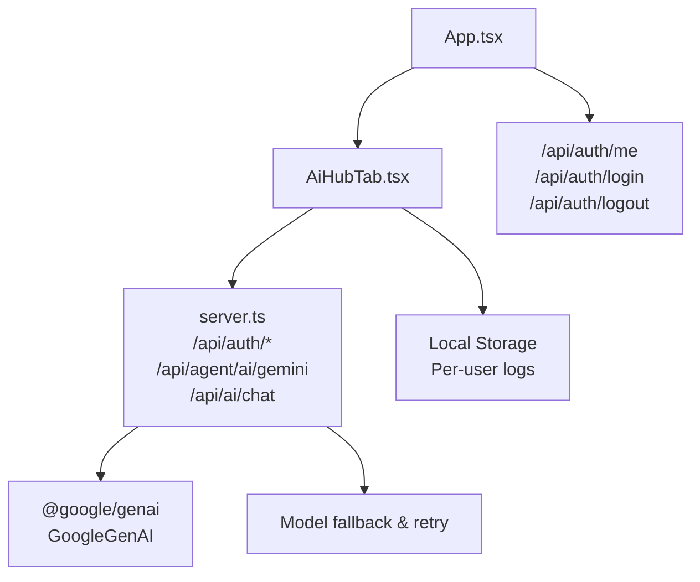
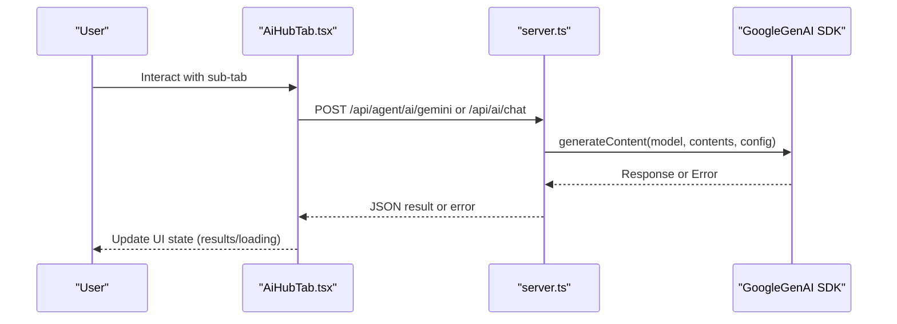
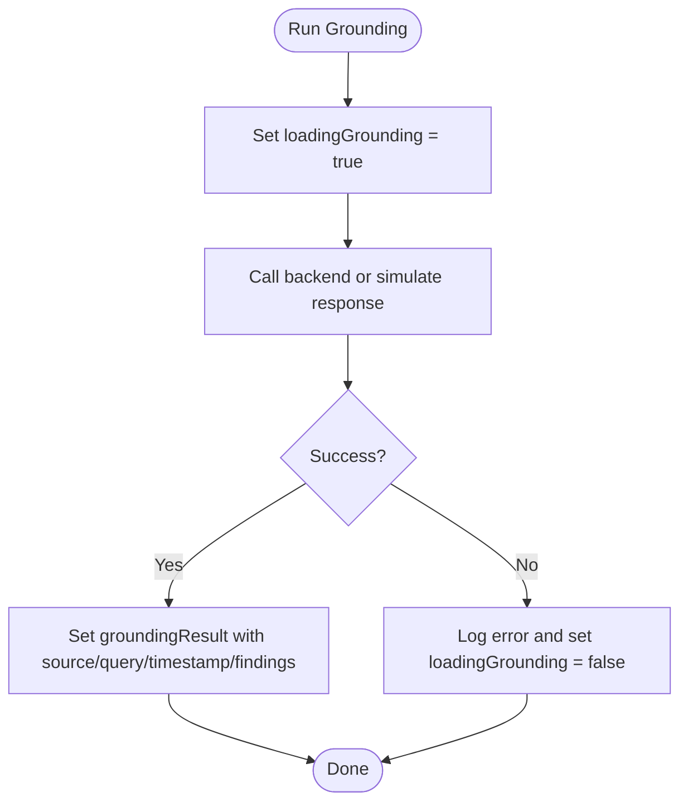
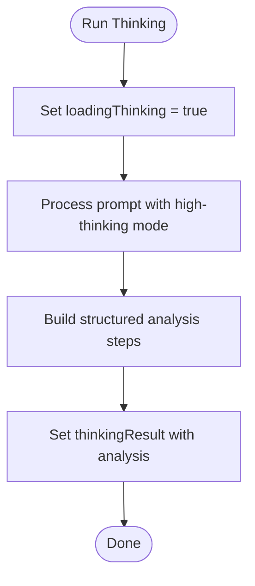
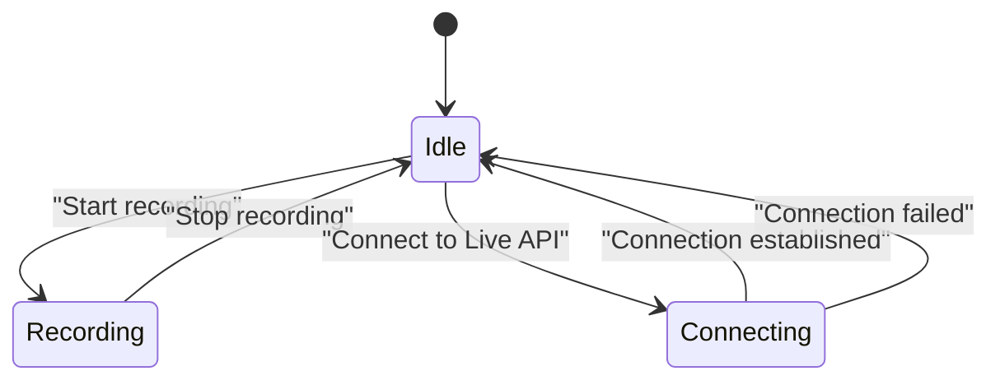
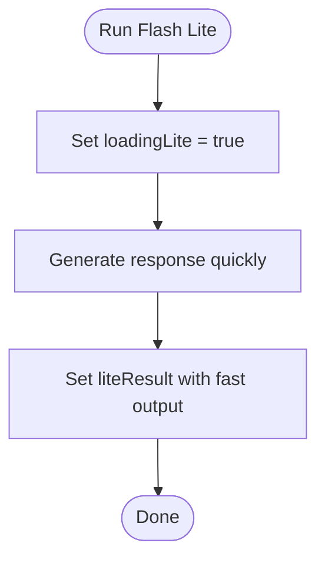
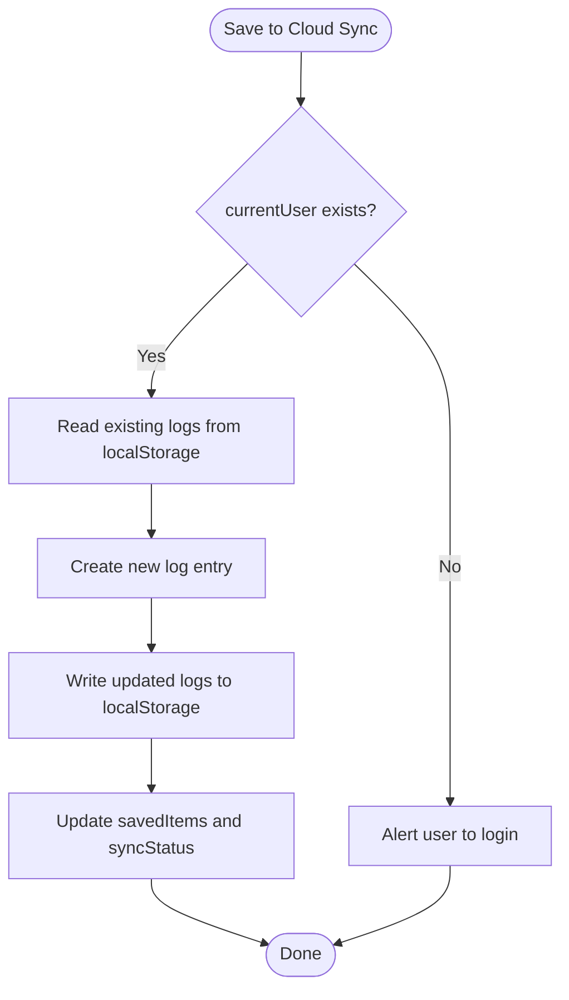
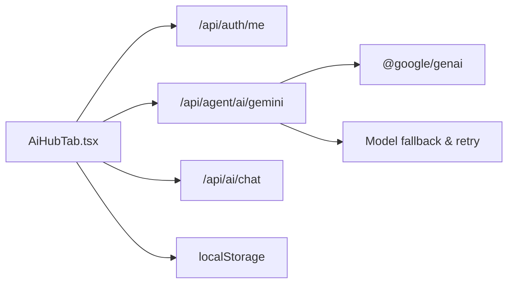

# AI Hub Tab

<cite>
**Referenced Files in This Document**
- [AiHubTab.tsx](file://src/components/AiHubTab.tsx)
- [googleAuth.ts](file://src/lib/googleAuth.ts)
- [server.ts](file://server.ts)
- [App.tsx](file://src/App.tsx)
- [index.ts](file://api/index.ts)
</cite>

## Table of Contents
1. [Introduction](#introduction)
2. [Project Structure](#project-structure)
3. [Core Components](#core-components)
4. [Architecture Overview](#architecture-overview)
5. [Detailed Component Analysis](#detailed-component-analysis)
6. [Dependency Analysis](#dependency-analysis)
7. [Performance Considerations](#performance-considerations)
8. [Troubleshooting Guide](#troubleshooting-guide)
9. [Conclusion](#conclusion)

## Introduction
The AI Hub Tab is the central AI interaction interface for the application. It provides a unified workspace with five sub-tabs:
- Search & Maps Grounding
- High Thinking Mode
- Voice & Live Conversations
- Low-Latency Flash Lite
- Database Cloud Sync

It integrates Google Gemini models through a secure server proxy, manages concurrent operations via React state, and offers real-time voice UI patterns. The grounding system simulates verified search results from Google Search/Maps, while High Thinking Mode demonstrates complex reasoning workflows. Ultra-low latency responses are provided by the Flash Lite model path. Cloud sync persists user logs locally per authenticated session.

## Project Structure
The AI Hub Tab is a React component mounted under the main app shell. Authentication and Gemini API calls are handled on the server side to keep secrets safe.

**Diagram sources**
- [App.tsx:109-174](file://src/App.tsx#L109-L174)
- [AiHubTab.tsx:1-565](file://src/components/AiHubTab.tsx#L1-L565)
- [server.ts:853-947](file://server.ts#L853-L947)
- [server.ts:4054-4127](file://server.ts#L4054-L4127)

**Section sources**
- [App.tsx:109-174](file://src/App.tsx#L109-L174)
- [AiHubTab.tsx:1-565](file://src/components/AiHubTab.tsx#L1-L565)
- [server.ts:853-947](file://server.ts#L853-L947)
- [server.ts:4054-4127](file://server.ts#L4054-L4127)

## Core Components
- AiHubTab: Orchestrates five sub-tabs, maintains local state for each operation, and renders interactive UIs for grounding, thinking, voice, flash-lite, and cloud sync.
- googleAuth: Firebase-based Google sign-in utility that exposes access tokens and auth state changes.
- server.ts: Express backend providing authentication endpoints and a Gemini proxy with robust error handling and model fallback.

Key responsibilities:
- Sub-tab routing and state management (activeSubTab, loading flags, results).
- Session retrieval via /api/auth/me and event-driven updates.
- Simulated grounding results and structured thinking outputs.
- Voice conversation UI with live status and transcript display.
- Local persistence of AI logs keyed by user id.

**Section sources**
- [AiHubTab.tsx:1-565](file://src/components/AiHubTab.tsx#L1-L565)
- [googleAuth.ts:1-60](file://src/lib/googleAuth.ts#L1-L60)
- [server.ts:318-381](file://server.ts#L318-L381)
- [server.ts:4054-4127](file://server.ts#L4054-L4127)

## Architecture Overview
The AI Hub Tab follows a client-server architecture:
- Client-side React components manage UI state and user interactions.
- Server-side Express routes handle authentication and proxy Gemini requests securely.
- A centralized Gemini client initializes once and supports multiple models with automatic fallback and retries.

**Diagram sources**
- [AiHubTab.tsx:62-124](file://src/components/AiHubTab.tsx#L62-L124)
- [server.ts:4054-4127](file://server.ts#L4054-L4127)
- [server.ts:853-947](file://server.ts#L853-L947)

## Detailed Component Analysis

### Sub-tab 1: Search & Maps Grounding
Purpose:
- Provide verified search results grounded in Google Search or Google Maps context.
- Display findings with timestamps and source labels.

Implementation highlights:
- State variables: queryText, groundingType, groundingResult, loadingGrounding.
- Action handler simulates grounding response with structured findings.
- Results can be saved to cloud sync if user is authenticated.

**Diagram sources**
- [AiHubTab.tsx:62-89](file://src/components/AiHubTab.tsx#L62-L89)

**Section sources**
- [AiHubTab.tsx:62-89](file://src/components/AiHubTab.tsx#L62-L89)

### Sub-tab 2: High Thinking Mode
Purpose:
- Demonstrate advanced reasoning using a high-complexity model path.
- Return structured analysis with step-by-step breakdown.

Implementation highlights:
- State variables: thinkingPrompt, thinkingResult, loadingThinking.
- Action handler simulates a long-form analytical output.
- Output formatted as monospaced text for readability.

**Diagram sources**
- [AiHubTab.tsx:91-108](file://src/components/AiHubTab.tsx#L91-L108)

**Section sources**
- [AiHubTab.tsx:91-108](file://src/components/AiHubTab.tsx#L91-L108)

### Sub-tab 3: Voice & Live Conversations
Purpose:
- Provide a real-time voice conversation UI pattern using Gemini Live Audio API concepts.
- Manage recording state, transcript display, and connection status.

Implementation highlights:
- State variables: isRecording, transcript, voiceModelStatus.
- Toggle recording and update status messages.
- Transcript area shows simulated live transcription.

**Diagram sources**
- [AiHubTab.tsx:413-458](file://src/components/AiHubTab.tsx#L413-L458)

**Section sources**
- [AiHubTab.tsx:413-458](file://src/components/AiHubTab.tsx#L413-L458)

### Sub-tab 4: Low-Latency Flash Lite
Purpose:
- Deliver ultra-fast responses suitable for quick prompts and autocompletion.
- Emphasize low-latency UX with immediate feedback.

Implementation highlights:
- State variables: litePrompt, liteResult, loadingLite.
- Action handler simulates rapid generation with short delay.
- Result displayed in monospaced format for clarity.

**Diagram sources**
- [AiHubTab.tsx:110-124](file://src/components/AiHubTab.tsx#L110-L124)

**Section sources**
- [AiHubTab.tsx:110-124](file://src/components/AiHubTab.tsx#L110-L124)

### Sub-tab 5: Database Cloud Sync
Purpose:
- Persist AI Hub logs per authenticated user using local storage keys.
- Show sync status and list of saved items.

Implementation highlights:
- State variables: savedItems, syncStatus, currentUser.
- Save action creates a log entry with id, uid, email, timestamp, prompt, result.
- Load action retrieves stored logs for current user.

**Diagram sources**
- [AiHubTab.tsx:126-170](file://src/components/AiHubTab.tsx#L126-L170)

**Section sources**
- [AiHubTab.tsx:126-170](file://src/components/AiHubTab.tsx#L126-L170)

## Dependency Analysis
The AI Hub Tab depends on:
- React state for managing sub-tab selection and operation states.
- Server endpoints for authentication and Gemini API proxying.
- Local storage for per-user log persistence.

**Diagram sources**
- [AiHubTab.tsx:1-565](file://src/components/AiHubTab.tsx#L1-L565)
- [server.ts:4054-4127](file://server.ts#L4054-L4127)
- [server.ts:853-947](file://server.ts#L853-L947)

**Section sources**
- [AiHubTab.tsx:1-565](file://src/components/AiHubTab.tsx#L1-L565)
- [server.ts:4054-4127](file://server.ts#L4054-L4127)
- [server.ts:853-947](file://server.ts#L853-L947)

## Performance Considerations
- Model fallback strategy ensures resilience against quota limits and transient errors.
- Flash Lite path prioritizes speed for quick interactions.
- Local storage avoids network overhead for log persistence.
- Concurrent operations are isolated via separate state variables per sub-tab.

[No sources needed since this section provides general guidance]

## Troubleshooting Guide
Common issues and resolutions:
- Authentication failures: Ensure /api/auth/me returns valid user data; check session configuration.
- Gemini API errors: Verify GEMINI_API_KEY environment variable; review fallback behavior and retry logic.
- Local storage issues: Confirm browser permissions and storage quotas; validate JSON parsing for saved logs.

**Section sources**
- [server.ts:318-381](file://server.ts#L318-L381)
- [server.ts:853-947](file://server.ts#L853-L947)
- [AiHubTab.tsx:126-170](file://src/components/AiHubTab.tsx#L126-L170)

## Conclusion
The AI Hub Tab delivers a comprehensive AI interaction surface with five specialized sub-tabs. It leverages Google Gemini models through a secure server proxy, implements robust error handling and model fallback, and provides real-time voice UI patterns. The grounding system offers verified search insights, High Thinking Mode enables complex analysis, and Flash Lite ensures ultra-low latency responses. Cloud sync functionality persists user logs locally, enhancing continuity across sessions.

[No sources needed since this section summarizes without analyzing specific files]