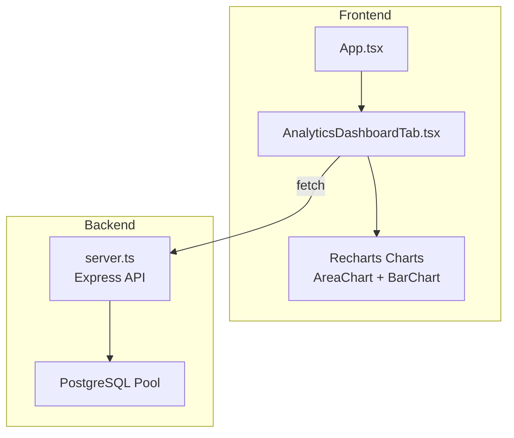
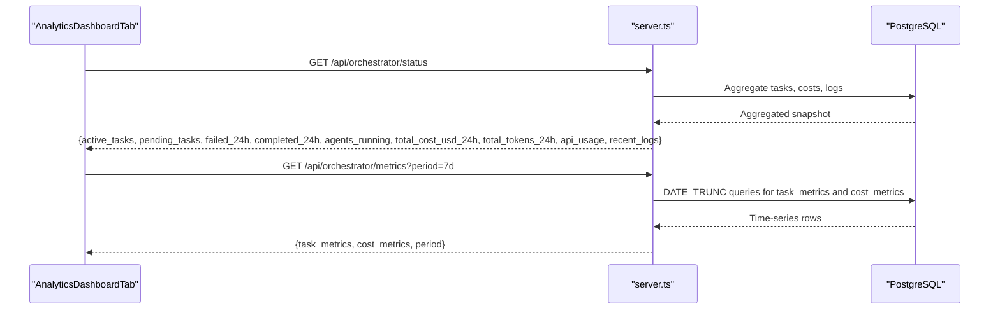
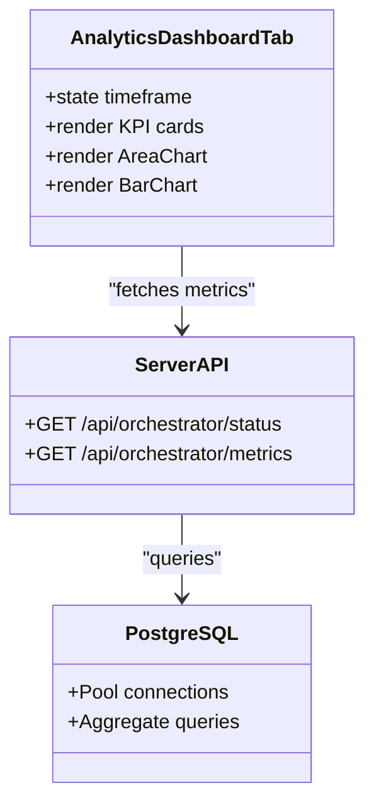

# Analytics Dashboard Tab

<cite>
**Referenced Files in This Document**
- [AnalyticsDashboardTab.tsx](file://src/components/AnalyticsDashboardTab.tsx)
- [App.tsx](file://src/App.tsx)
- [types.ts](file://src/types.ts)
- [server.ts](file://server.ts)
- [api/index.ts](file://api/index.ts)
- [package.json](file://package.json)
</cite>

## Table of Contents
1. [Introduction](#introduction)
2. [Project Structure](#project-structure)
3. [Core Components](#core-components)
4. [Architecture Overview](#architecture-overview)
5. [Detailed Component Analysis](#detailed-component-analysis)
6. [Dependency Analysis](#dependency-analysis)
7. [Performance Considerations](#performance-considerations)
8. [Troubleshooting Guide](#troubleshooting-guide)
9. [Conclusion](#conclusion)
10. [Appendices](#appendices)

## Introduction
This document provides a comprehensive guide to the Analytics Dashboard Tab component focused on data visualization and performance metrics. It explains the dashboard layout, responsive design, chart components using Recharts, KPI widgets, and data aggregation patterns. It also outlines how to integrate with backend APIs for historical data from PostgreSQL, caching strategies for performance optimization, and real-time update approaches (polling or WebSocket). Examples include metric calculations, chart configurations, filtering options, and export functionality.

## Project Structure
The Analytics Dashboard Tab is a React component integrated into the application’s tabbed interface. The component renders KPI cards and two charts: an area chart for ROI trends and a bar chart for channel conversion rates. The app routes to this tab via the main App component. Backend endpoints exist for orchestrator status and metrics that can be used as a foundation for analytics data.

**Diagram sources**
- [App.tsx:138](file://src/App.tsx#L138)
- [AnalyticsDashboardTab.tsx:1-149](file://src/components/AnalyticsDashboardTab.tsx#L1-L149)
- [server.ts:4186-4270](file://server.ts#L4186-L4270)

**Section sources**
- [App.tsx:138](file://src/App.tsx#L138)
- [AnalyticsDashboardTab.tsx:1-149](file://src/components/AnalyticsDashboardTab.tsx#L1-L149)

## Core Components
- AnalyticsDashboardTab: Renders KPI cards and charts; includes timeframe selection state.
- Recharts AreaChart: Displays ROI trend over time with gradients and tooltips.
- Recharts BarChart: Shows conversion rate by channel.
- App routing: Injects the AnalyticsDashboardTab when activeTab equals 'analytics_dashboard'.

Key responsibilities:
- Present multi-channel ROI and conversion metrics visually.
- Provide timeframe filter UI (1M, 3M, 6M, 1Y) ready for data binding.
- Maintain responsive layout across screen sizes.

**Section sources**
- [AnalyticsDashboardTab.tsx:1-149](file://src/components/AnalyticsDashboardTab.tsx#L1-L149)
- [App.tsx:138](file://src/App.tsx#L138)

## Architecture Overview
The current implementation uses static mock data within the component. To enable real-time analytics:
- Fetch aggregated metrics from server endpoints (e.g., /api/orchestrator/status, /api/orchestrator/metrics).
- Use polling or WebSockets to keep charts updated.
- Cache results at the client level to reduce network load.

**Diagram sources**
- [server.ts:4186-4270](file://server.ts#L4186-L4270)

## Detailed Component Analysis

### AnalyticsDashboardTab Component
- Layout: Uses Tailwind CSS grid and spacing utilities for responsive design.
- KPI Cards: Four cards showing Global Average ROI, Attributable Revenue, Captured Leads, and Average Cost per Lead. Each card includes a change indicator and contextual description.
- Charts:
  - AreaChart for ROI trend by channel (SEO and Email), with gradient fills and tooltips.
  - BarChart for conversion rate by channel.
- State: Timeframe selector controls which dataset to display (currently not wired to data fetching).

Implementation highlights:
- ResponsiveContainer ensures charts adapt to container size.
- CartesianGrid and axes are styled for readability.
- Tooltips provide detailed hover information.

Data flow:
- Currently uses local arrays for roiTrendData and channelComparison.
- Ready to accept props/state-driven datasets for dynamic updates.

Export considerations:
- No built-in export; can be extended using jsPDF/html2canvas or CSV generation similar to other components in the project.

Real-time updates:
- Add polling or WebSocket integration to refresh KPIs and charts periodically.

Filtering:
- Timeframe buttons are present; implement handlers to fetch corresponding datasets.

Accessibility:
- Ensure aria-labels for charts and KPI cards for screen readers.

**Section sources**
- [AnalyticsDashboardTab.tsx:1-149](file://src/components/AnalyticsDashboardTab.tsx#L1-L149)

### App Integration
- The App component conditionally renders AnalyticsDashboardTab when activeTab is 'analytics_dashboard'.
- Centralized session management and navigation are handled in App.

**Section sources**
- [App.tsx:138](file://src/App.tsx#L138)

### Backend Endpoints for Metrics
- /api/orchestrator/status: Returns live system snapshot including active/pending tasks, failures/completions in last 24 hours, running agents, total cost and tokens usage, recent logs.
- /api/orchestrator/metrics: Returns historical metrics grouped by day for tasks and API usage over a configurable period.

These endpoints can be adapted to serve marketing analytics metrics such as ROI by channel, conversion rates, and lead counts.

**Section sources**
- [server.ts:4186-4270](file://server.ts#L4186-L4270)

## Dependency Analysis
- Frontend dependencies:
  - React and Recharts for rendering charts.
  - Lucide icons for visual elements.
- Backend dependencies:
  - Express server with PostgreSQL pool.
  - Session storage backed by PostgreSQL.
- External libraries:
  - jspdf and html2canvas-pro available for export functionality.

**Diagram sources**
- [AnalyticsDashboardTab.tsx:1-149](file://src/components/AnalyticsDashboardTab.tsx#L1-L149)
- [server.ts:4186-4270](file://server.ts#L4186-L4270)

**Section sources**
- [package.json:43](file://package.json#L43)
- [server.ts:25-34](file://server.ts#L25-L34)

## Performance Considerations
- Client-side caching:
  - Implement in-memory cache or localStorage for frequently accessed metrics.
  - Use stale-while-revalidate pattern to show cached data while refreshing.
- Polling strategy:
  - For real-time dashboards, poll every 10–30 seconds depending on data volatility.
  - Debounce rapid timeframe changes to avoid excessive requests.
- Chart rendering:
  - Keep datasets minimal; aggregate on the server where possible.
  - Use Recharts’ ResponsiveContainer efficiently; avoid unnecessary re-renders.
- Database queries:
  - Leverage existing DATE_TRUNC aggregations for time-series data.
  - Index frequently queried columns (created_at, agent_name, status).

[No sources needed since this section provides general guidance]

## Troubleshooting Guide
Common issues and resolutions:
- Charts not updating:
  - Verify timeframe state changes trigger data refetch.
  - Check network requests and error responses.
- Real-time data not streaming:
  - If implementing WebSockets, ensure connection lifecycle and error handling.
  - For polling, confirm intervals and backoff strategies.
- Export failures:
  - Validate data serialization for CSV/PDF generation.
  - Handle large datasets by chunking or server-side exports.

**Section sources**
- [server.ts:4186-4270](file://server.ts#L4186-L4270)

## Conclusion
The Analytics Dashboard Tab provides a solid foundation for displaying multi-channel ROI and conversion metrics through Recharts. With enhancements for data fetching, caching, and real-time updates, it can evolve into a powerful analytics interface. The existing backend endpoints offer a template for serving aggregated metrics from PostgreSQL, enabling scalable and performant dashboards.

[No sources needed since this section summarizes without analyzing specific files]

## Appendices

### Data Models and Aggregation Patterns
- Task metrics: Grouped by day, counting completed/failed tasks and average duration.
- Cost metrics: Sum of costs and tokens by day and API name.
- Pipeline funnel: Counts across companies, leads, proposals, campaigns, emails, and replies.

These patterns can be adapted for marketing analytics by mapping channels to agents and conversions to task completions.

**Section sources**
- [server.ts:4236-4270](file://server.ts#L4236-L4270)
- [server.ts:4274-4297](file://server.ts#L4274-L4297)

### Example Metric Calculations
- ROI by Channel: Calculate (Revenue - Cost) / Cost * 100 for each channel.
- Conversion Rate: (Conversions / Leads) * 100.
- Cost per Lead: Total Spend / Number of Leads.

These formulas can be implemented on the frontend after receiving raw data from the backend.

[No sources needed since this section provides general guidance]

### Chart Configurations
- AreaChart:
  - XAxis: month labels
  - YAxis: ROI percentage
  - Area series: SEO ROI and Email ROI with gradient fills
  - Tooltip: Hover details
- BarChart:
  - XAxis: channel names
  - YAxis: conversion rate percentage
  - Bar series: conversion rate with rounded corners

**Section sources**
- [AnalyticsDashboardTab.tsx:104-144](file://src/components/AnalyticsDashboardTab.tsx#L104-L144)

### Filtering Options
- Timeframe selector: 1M, 3M, 6M, 1Y
- Implement onChange handlers to fetch corresponding datasets
- Debounce rapid changes to optimize performance

**Section sources**
- [AnalyticsDashboardTab.tsx:37-49](file://src/components/AnalyticsDashboardTab.tsx#L37-L49)

### Export Functionality
- CSV export: Generate headers and rows from chart data
- PDF export: Use jsPDF and html2canvas for report generation
- Implement download triggers with proper MIME types

[No sources needed since this section provides general guidance]

### Real-time Updates
- Polling: Set intervals to refresh data every 10-30 seconds
- WebSocket: Establish persistent connection for live updates
- Error handling: Retry logic and fallback mechanisms

[No sources needed since this section provides general guidance]