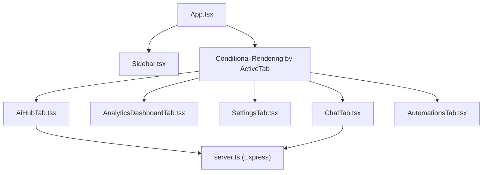
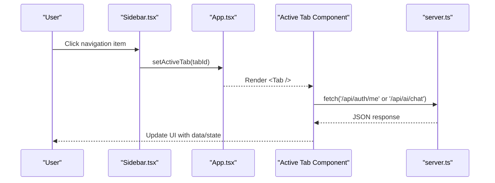
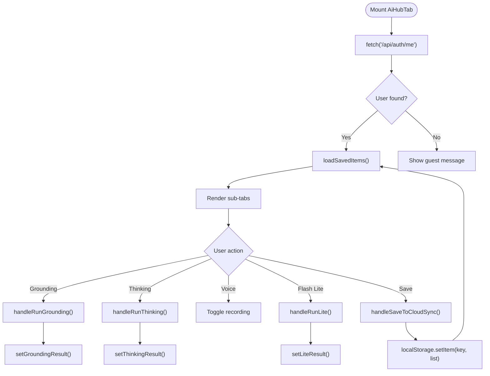
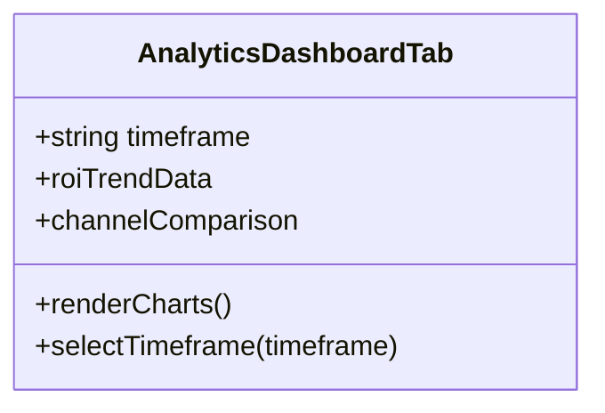
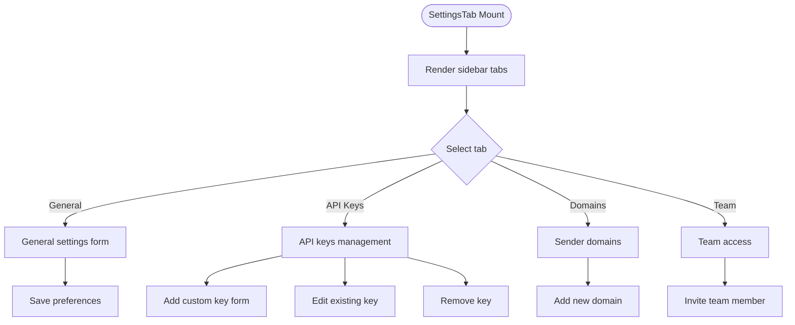
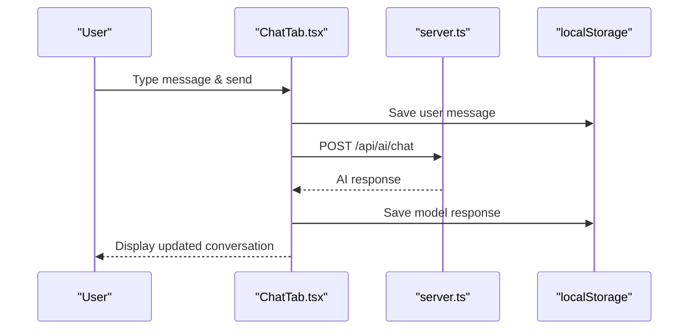
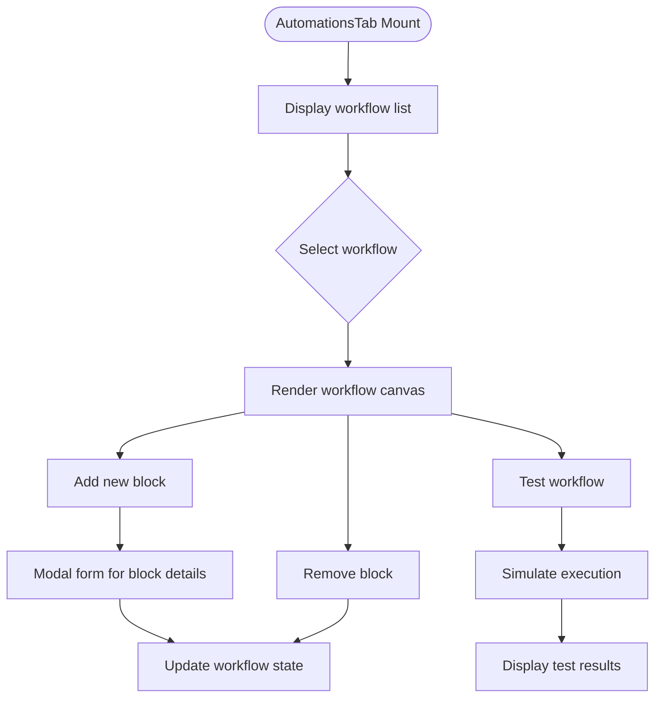
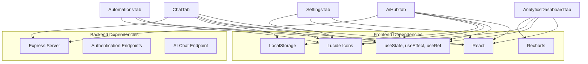

# Feature Components

<cite>
**Referenced Files in This Document**
- [App.tsx](file://src/App.tsx)
- [types.ts](file://src/types.ts)
- [Sidebar.tsx](file://src/components/Sidebar.tsx)
- [AiHubTab.tsx](file://src/components/AiHubTab.tsx)
- [AnalyticsDashboardTab.tsx](file://src/components/AnalyticsDashboardTab.tsx)
- [SettingsTab.tsx](file://src/components/SettingsTab.tsx)
- [ChatTab.tsx](file://src/components/ChatTab.tsx)
- [AutomationsTab.tsx](file://src/components/AutomationsTab.tsx)
- [server.ts](file://server.ts)
</cite>

## Table of Contents
1. [Introduction](#introduction)
2. [Project Structure](#project-structure)
3. [Core Components](#core-components)
4. [Architecture Overview](#architecture-overview)
5. [Detailed Component Analysis](#detailed-component-analysis)
6. [Dependency Analysis](#dependency-analysis)
7. [Performance Considerations](#performance-considerations)
8. [Troubleshooting Guide](#troubleshooting-guide)
9. [Conclusion](#conclusion)

## Introduction
This document explains the tab-based feature architecture and implementation details for the main application tabs: AiHubTab, AnalyticsDashboardTab, SettingsTab, ChatTab, and AutomationsTab. It covers component state management, API integration patterns, data flow between features, and practical examples for common use cases such as data fetching, form handling, and real-time updates. The content is structured to be accessible to beginners while providing technical depth for experienced developers.

## Project Structure
The application uses a single-page React app with a sidebar-driven navigation that renders different Tab components based on the active tab. Each major feature is encapsulated in its own Tab component, enabling clear separation of concerns and independent state management.

**Diagram sources**
- [App.tsx:109-164](file://src/App.tsx#L109-L164)
- [Sidebar.tsx:75-161](file://src/components/Sidebar.tsx#L75-L161)
- [AiHubTab.tsx:1-565](file://src/components/AiHubTab.tsx#L1-L565)
- [AnalyticsDashboardTab.tsx:1-149](file://src/components/AnalyticsDashboardTab.tsx#L1-L149)
- [SettingsTab.tsx:1-689](file://src/components/SettingsTab.tsx#L1-L689)
- [ChatTab.tsx:1-355](file://src/components/ChatTab.tsx#L1-L355)
- [AutomationsTab.tsx:1-280](file://src/components/AutomationsTab.tsx#L1-L280)
- [server.ts:1-200](file://server.ts#L1-L200)

**Section sources**
- [App.tsx:43-177](file://src/App.tsx#L43-L177)
- [Sidebar.tsx:54-161](file://src/components/Sidebar.tsx#L54-L161)

## Core Components
Each Tab component manages its own UI state, handles user interactions, and integrates with backend APIs where applicable. The following sections detail each component’s responsibilities, state, and data flows.

**Section sources**
- [AiHubTab.tsx:1-565](file://src/components/AiHubTab.tsx#L1-L565)
- [AnalyticsDashboardTab.tsx:1-149](file://src/components/AnalyticsDashboardTab.tsx#L1-L149)
- [SettingsTab.tsx:1-689](file://src/components/SettingsTab.tsx#L1-L689)
- [ChatTab.tsx:1-355](file://src/components/ChatTab.tsx#L1-L355)
- [AutomationsTab.tsx:1-280](file://src/components/AutomationsTab.tsx#L1-L280)

## Architecture Overview
The tab-based architecture centers around a root App component that maintains the active tab and conditionally renders the corresponding Tab component. Sidebar provides navigation and updates the active tab. Tabs are self-contained and manage their internal state. Some tabs integrate with the Express server via fetch calls to endpoints like /api/auth/me and /api/ai/chat.

**Diagram sources**
- [App.tsx:109-164](file://src/App.tsx#L109-L164)
- [Sidebar.tsx:252-286](file://src/components/Sidebar.tsx#L252-L286)
- [AiHubTab.tsx:8-23](file://src/components/AiHubTab.tsx#L8-L23)
- [ChatTab.tsx:134-166](file://src/components/ChatTab.tsx#L134-L166)
- [server.ts:112-125](file://server.ts#L112-L125)

## Detailed Component Analysis

### AiHubTab
AiHubTab is a multi-subtab interface for AI interactions including grounding, high thinking mode, voice conversations, low-latency responses, and cloud sync. It manages multiple sub-states and performs local storage operations for persistence.

Key responsibilities:
- Sub-tab switching for Grounding, High Thinking, Voice, Flash Lite, Cloud Sync
- Fetching session user from /api/auth/me and listening to auth-changed events
- Simulating AI responses with timeouts for demonstration
- Local storage synchronization for logs per user

State management:
- activeSubTab controls which sub-feature is visible
- currentUser holds authenticated user info
- Various loading flags and result states per sub-feature
- savedItems and syncStatus for cloud sync view

API integration:
- GET /api/auth/me to retrieve current user
- Optional future integration for actual Gemini APIs (currently simulated)

Data flow:
- On mount, fetch session user; listen for auth changes
- User actions trigger handlers that update local state and optionally persist to localStorage
- Results are displayed within respective sub-tabs

Practical examples:
- Data fetching: Retrieve session user and update currentUser
- Form handling: Input fields for queries and prompts
- Real-time updates: Loading indicators and status messages during processing

**Diagram sources**
- [AiHubTab.tsx:8-36](file://src/components/AiHubTab.tsx#L8-L36)
- [AiHubTab.tsx:62-89](file://src/components/AiHubTab.tsx#L62-L89)
- [AiHubTab.tsx:91-108](file://src/components/AiHubTab.tsx#L91-L108)
- [AiHubTab.tsx:110-124](file://src/components/AiHubTab.tsx#L110-L124)
- [AiHubTab.tsx:126-170](file://src/components/AiHubTab.tsx#L126-L170)

**Section sources**
- [AiHubTab.tsx:1-565](file://src/components/AiHubTab.tsx#L1-L565)

### AnalyticsDashboardTab
AnalyticsDashboardTab presents marketing analytics with charts and metrics. It uses static data for demonstration but can be extended to fetch live data.

Key responsibilities:
- Display ROI trends and channel comparison charts using Recharts
- Timeframe selection for filtering data views
- Metric cards showing key performance indicators

State management:
- timeframe controls chart data selection

API integration:
- Currently uses static datasets; can be extended to fetch from backend

Data flow:
- User selects timeframe -> updates chart data
- Charts render responsive visualizations

Practical examples:
- Chart rendering with AreaChart and BarChart
- Interactive timeframe buttons
- Responsive layout for mobile and desktop

**Diagram sources**
- [AnalyticsDashboardTab.tsx:21-149](file://src/components/AnalyticsDashboardTab.tsx#L21-L149)

**Section sources**
- [AnalyticsDashboardTab.tsx:1-149](file://src/components/AnalyticsDashboardTab.tsx#L1-L149)

### SettingsTab
SettingsTab provides comprehensive platform configuration including API keys, sender domains, and team access management.

Key responsibilities:
- Manage API keys and integrations with masking/unmasking capabilities
- Configure sender domains with DNS verification status
- Team member management with role-based access
- General preferences like workspace name

State management:
- activeSubTab for navigation between General, API Keys, Domains, Team
- configuredKeys map for storing API credentials
- revealedKeys for password visibility toggles
- collapsedCats for category accordion behavior
- forms for adding custom keys, domains, and team members

API integration:
- Client-side only; no direct API calls in current implementation
- Designed to integrate with backend for persistent storage

Data flow:
- Form submissions update local state
- Key masking/unmasking for security
- Category collapse/expand for better UX

Practical examples:
- Form handling with validation
- Conditional rendering based on configuration status
- Dynamic table rendering for team members

**Diagram sources**
- [SettingsTab.tsx:170-689](file://src/components/SettingsTab.tsx#L170-L689)

**Section sources**
- [SettingsTab.tsx:1-689](file://src/components/SettingsTab.tsx#L1-L689)

### ChatTab
ChatTab implements an AI-powered chat interface with multiple personas and model selection. It persists conversation history locally and communicates with the backend AI service.

Key responsibilities:
- Multiple AI personas (CMO, SDR, Copywriter, Architect) with specialized instructions
- Model selection (Gemini variants) for different performance characteristics
- Message history persistence using localStorage
- Real-time chat interface with typing indicators and error handling

State management:
- activePersona for current AI assistant
- selectedModel for AI model choice
- messages array for conversation history
- loading state for API requests
- showSettings for toggleable configuration panel

API integration:
- POST /api/ai/chat with messages, model, and system instruction
- Error handling for connection failures

Data flow:
- User sends message -> append to history -> call API -> receive response -> update history
- History persists per persona in localStorage
- Auto-scroll to latest messages

Practical examples:
- Real-time messaging with async API calls
- LocalStorage persistence for conversation history
- Dynamic prompt suggestions based on persona

**Diagram sources**
- [ChatTab.tsx:114-166](file://src/components/ChatTab.tsx#L114-L166)
- [ChatTab.tsx:86-102](file://src/components/ChatTab.tsx#L86-L102)

**Section sources**
- [ChatTab.tsx:1-355](file://src/components/ChatTab.tsx#L1-L355)

### AutomationsTab
AutomationsTab provides a visual workflow builder for automating marketing and CRM processes.

Key responsibilities:
- Workflow creation and management with trigger-action blocks
- Visual block-based interface for building automation sequences
- Testing functionality for workflow simulation
- Block addition and removal with modal interface

State management:
- workflows array containing automation definitions
- selectedWorkflowId for current workflow editing
- testing state for workflow simulation
- Modal state for adding new blocks

API integration:
- Client-side only; designed for future backend integration
- Test functionality simulates workflow execution

Data flow:
- User adds/removes blocks -> updates workflow state
- Test button triggers simulation with loading state
- Workflow selection updates canvas view

Practical examples:
- Dynamic block rendering with type-specific styling
- Modal form handling for block creation
- Workflow testing with simulated execution

**Diagram sources**
- [AutomationsTab.tsx:12-280](file://src/components/AutomationsTab.tsx#L12-L280)

**Section sources**
- [AutomationsTab.tsx:1-280](file://src/components/AutomationsTab.tsx#L1-L280)

## Dependency Analysis
The tab components have minimal dependencies on each other, promoting loose coupling and maintainability. They primarily depend on:
- React hooks for state management
- Lucide icons for consistent UI elements
- Recharts for data visualization
- LocalStorage for client-side persistence
- Express server for API endpoints

**Diagram sources**
- [AiHubTab.tsx:1-565](file://src/components/AiHubTab.tsx#L1-L565)
- [AnalyticsDashboardTab.tsx:1-149](file://src/components/AnalyticsDashboardTab.tsx#L1-L149)
- [SettingsTab.tsx:1-689](file://src/components/SettingsTab.tsx#L1-L689)
- [ChatTab.tsx:1-355](file://src/components/ChatTab.tsx#L1-L355)
- [AutomationsTab.tsx:1-280](file://src/components/AutomationsTab.tsx#L1-L280)
- [server.ts:1-200](file://server.ts#L1-L200)

**Section sources**
- [types.ts:1-178](file://src/types.ts#L1-L178)
- [server.ts:112-125](file://server.ts#L112-L125)

## Performance Considerations
- **Component State Management**: Each Tab component manages its own state independently, preventing unnecessary re-renders across the application
- **Local Storage Usage**: Efficient client-side persistence for chat history and AI hub logs reduces server load
- **Lazy Loading**: Tab components are only rendered when active, improving initial page load performance
- **Chart Optimization**: Recharts components are wrapped in ResponsiveContainer for optimal rendering across devices
- **API Call Optimization**: Debouncing and proper error handling prevent excessive network requests

## Troubleshooting Guide
Common issues and solutions:

**Authentication Problems:**
- Ensure /api/auth/me endpoint is properly configured
- Check browser console for CORS errors
- Verify session cookies are being set correctly

**Chat Functionality Issues:**
- Verify /api/ai/chat endpoint availability
- Check network tab for failed API requests
- Ensure localStorage permissions are granted

**Data Persistence Problems:**
- Clear browser cache if localStorage becomes corrupted
- Check browser privacy settings blocking storage
- Validate JSON parsing for stored data

**Chart Rendering Issues:**
- Ensure Recharts dependencies are properly installed
- Check data format matches expected structure
- Verify responsive container dimensions

**Section sources**
- [AiHubTab.tsx:8-23](file://src/components/AiHubTab.tsx#L8-L23)
- [ChatTab.tsx:134-166](file://src/components/ChatTab.tsx#L134-L166)
- [server.ts:112-125](file://server.ts#L112-L125)

## Conclusion
The tab-based architecture provides a scalable and maintainable foundation for the marketing dashboard. Each feature component is self-contained with clear responsibilities, making it easy to extend and modify individual features without affecting others. The combination of React state management, local storage persistence, and API integration creates a robust user experience while maintaining code organization and performance.

The implementation demonstrates best practices for:
- Component isolation and state management
- API integration patterns with error handling
- User experience considerations with loading states and feedback
- Data persistence strategies for offline functionality
- Scalable architecture supporting future feature additions