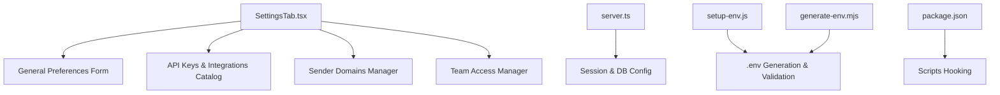
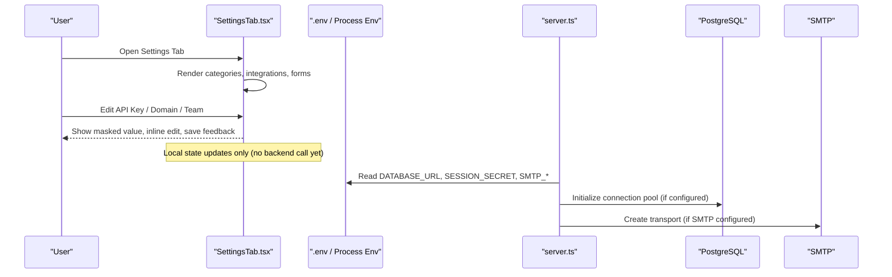
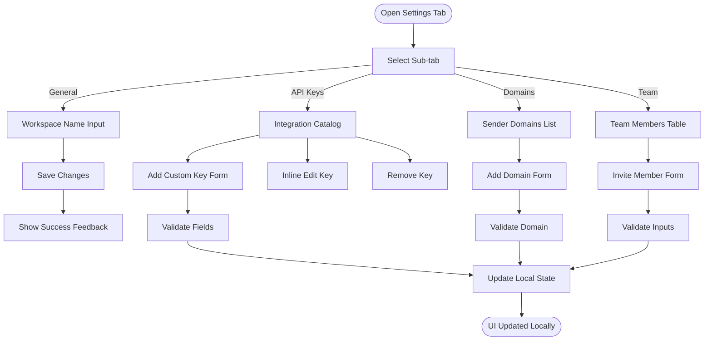
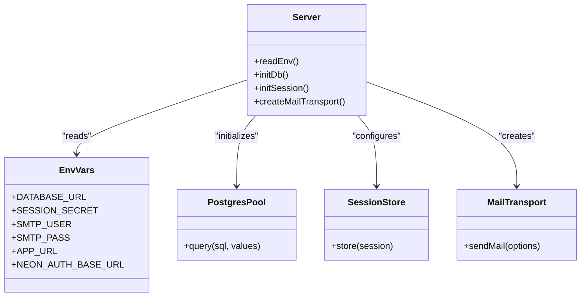
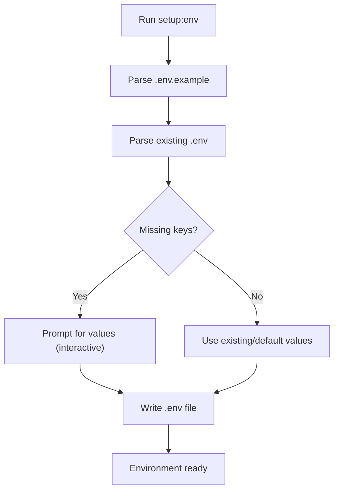
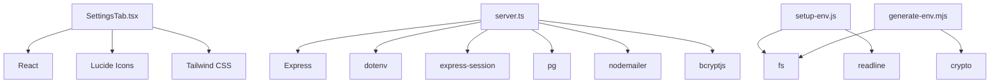

# Settings Tab

<cite>
**Referenced Files in This Document**
- [SettingsTab.tsx](file://src/components/SettingsTab.tsx)
- [server.ts](file://server.ts)
- [setup-env.js](file://scripts/setup-env.js)
- [generate-env.mjs](file://scripts/generate-env.mjs)
- [package.json](file://package.json)
</cite>

## Table of Contents
1. [Introduction](#introduction)
2. [Project Structure](#project-structure)
3. [Core Components](#core-components)
4. [Architecture Overview](#architecture-overview)
5. [Detailed Component Analysis](#detailed-component-analysis)
6. [Dependency Analysis](#dependency-analysis)
7. [Performance Considerations](#performance-considerations)
8. [Troubleshooting Guide](#troubleshooting-guide)
9. [Conclusion](#conclusion)
10. [Appendices](#appendices)

## Introduction
This document provides comprehensive documentation for the Settings Tab component, which centralizes application configuration and user preferences. It covers the form structure, validation rules, persistence mechanisms, and configuration categories including email service setup, database connections, API keys management, and UI customization options. It also explains environment variable management, security considerations for sensitive data, and outlines strategies for backup/restore and cross-device synchronization.

## Project Structure
The Settings Tab is implemented as a single React component that organizes settings into sub-tabs: General, API Keys & Integrations, Sender Domains, and Team Access. The component uses local state to manage forms and displays an integration catalog with masked values and inline editing. Environment setup scripts support .env generation and validation, while the server reads runtime secrets from environment variables.

**Diagram sources**
- [SettingsTab.tsx](file://src/components/SettingsTab.tsx)
- [server.ts](file://server.ts)
- [setup-env.js](file://scripts/setup-env.js)
- [generate-env.mjs](file://scripts/generate-env.mjs)
- [package.json](file://package.json)

**Section sources**
- [SettingsTab.tsx](file://src/components/SettingsTab.tsx)
- [server.ts](file://server.ts)
- [setup-env.js](file://scripts/setup-env.js)
- [generate-env.mjs](file://scripts/generate-env.mjs)
- [package.json](file://package.json)

## Core Components
- SettingsTab component:
  - Sub-tabs: general, apikeys, domains, team
  - Stateful forms for workspace name, API keys, sender domains, and team members
  - Integration catalog grouped by category with masking and inline editing
  - Helpers for save feedback, key reveal toggles, category collapse, and CRUD operations on keys/domains/team

- Server-side configuration:
  - Reads DATABASE_URL, SESSION_SECRET, SMTP_USER, SMTP_PASS, APP_URL, NEON_AUTH_BASE_URL, etc.
  - Initializes PostgreSQL pool and session store; falls back to mock when DATABASE_URL is missing
  - Email transport via nodemailer using SMTP_USER and SMTP_PASS

- Environment setup:
  - Interactive script to generate/update .env with guides and defaults
  - Non-interactive generator to auto-populate missing variables

**Section sources**
- [SettingsTab.tsx](file://src/components/SettingsTab.tsx)
- [server.ts](file://server.ts)
- [setup-env.js](file://scripts/setup-env.js)
- [generate-env.mjs](file://scripts/generate-env.mjs)

## Architecture Overview
The Settings Tab is a client-side configuration UI. Sensitive credentials are not persisted in the browser; they are managed through environment variables on the server. The UI allows users to view and edit keys locally (masked), add custom keys, manage sender domains, and invite team members. Persistence is currently local state only; backend APIs can be integrated to persist changes securely.

**Diagram sources**
- [SettingsTab.tsx](file://src/components/SettingsTab.tsx)
- [server.ts](file://server.ts)

## Detailed Component Analysis

### SettingsTab Component
- Sub-tabs:
  - General: Workspace name input and save action with temporary success feedback
  - API Keys & Integrations:
    - Category-based grouping (AI & LLMs, Prospecting & Data, Email & Communication, CRM & Agents, Database & Infrastructure)
    - Each integration has id, envVar, required flag, docsUrl, placeholder
    - Masked display with toggle to reveal; inline editing; remove key
    - Add custom key form (name, env var, value, category)
  - Sender Domains:
    - List of domains with verification status and DKIM/SPF flags
    - Add domain form; initial state includes sample entries
  - Team Access:
    - Invite member form (name, email, role)
    - Team table with roles and actions

- Validation:
  - Client-side checks for non-empty fields before adding keys/domains/members
  - Required integrations flagged visually
  - Save feedback shown briefly after submission

- Persistence:
  - Currently uses local state; no backend calls
  - Designed to integrate with backend APIs for secure storage

**Diagram sources**
- [SettingsTab.tsx](file://src/components/SettingsTab.tsx)

**Section sources**
- [SettingsTab.tsx](file://src/components/SettingsTab.tsx)

### Server Configuration and Security
- Environment variables:
  - DATABASE_URL: PostgreSQL connection string
  - SESSION_SECRET: Secret for signing session cookies
  - SMTP_USER / SMTP_PASS: SMTP credentials for email delivery
  - APP_URL: Base URL used in emails and callbacks
  - NEON_AUTH_BASE_URL: Neon Auth endpoint for identity provider

- Session and DB initialization:
  - If DATABASE_URL is present, connect-pg-simple stores sessions in Postgres
  - Otherwise, a mock pgPool and memory store are used for development

- Email transport:
  - Nodemailer configured with Gmail SMTP host/port and auth if credentials exist

- Security practices:
  - Secrets loaded from process.env, never hardcoded
  - Session cookie flags set for httpOnly, secure (production), sameSite
  - Password reset tokens hashed and stored securely

**Diagram sources**
- [server.ts](file://server.ts)

**Section sources**
- [server.ts](file://server.ts)

### Environment Variable Management
- Interactive setup script:
  - Parses .env.example and existing .env
  - Prompts for missing keys with descriptions and guides
  - Writes updated .env with comments and defaults

- Non-interactive generator:
  - Auto-populates missing variables with safe defaults or random strings
  - Ensures .env exists and is ready for development

- Package scripts:
  - Predev hook runs setup:env to ensure .env is prepared
  - Dev/build/start scripts reference server entry points

**Diagram sources**
- [setup-env.js](file://scripts/setup-env.js)
- [generate-env.mjs](file://scripts/generate-env.mjs)
- [package.json](file://package.json)

**Section sources**
- [setup-env.js](file://scripts/setup-env.js)
- [generate-env.mjs](file://scripts/generate-env.mjs)
- [package.json](file://package.json)

## Dependency Analysis
- SettingsTab depends on:
  - React state hooks for form handling and UI interactions
  - Lucide icons for visual indicators
  - Tailwind classes for styling

- Server dependencies:
  - Express for HTTP server
  - dotenv for loading environment variables
  - express-session and connect-pg-simple for session management
  - pg for PostgreSQL connectivity
  - nodemailer for SMTP email sending
  - bcryptjs for password hashing

- Scripts dependencies:
  - Node fs and path modules for file operations
  - readline for interactive prompts
  - crypto for generating secure secrets

**Diagram sources**
- [SettingsTab.tsx](file://src/components/SettingsTab.tsx)
- [server.ts](file://server.ts)
- [setup-env.js](file://scripts/setup-env.js)
- [generate-env.mjs](file://scripts/generate-env.mjs)

**Section sources**
- [SettingsTab.tsx](file://src/components/SettingsTab.tsx)
- [server.ts](file://server.ts)
- [setup-env.js](file://scripts/setup-env.js)
- [generate-env.mjs](file://scripts/generate-env.mjs)

## Performance Considerations
- Client-side rendering:
  - Minimal re-renders due to localized state updates
  - Collapsible categories reduce DOM size and improve UX
- Server-side:
  - PostgreSQL connection pooling reduces latency
  - Session store backed by Postgres ensures scalability
- Recommendations:
  - Integrate backend APIs to persist settings changes efficiently
  - Cache frequently accessed configuration on the server
  - Use lazy loading for large integration catalogs if needed

[No sources needed since this section provides general guidance]

## Troubleshooting Guide
- Missing DATABASE_URL:
  - Server logs a warning and uses mock pgPool; configure DATABASE_URL to enable real DB features
- Missing SESSION_SECRET:
  - Development fallback secret is used; set SESSION_SECRET in production
- SMTP not configured:
  - Email functions will throw errors if SMTP_USER/SMTP_PASS are missing; configure both
- .env issues:
  - Run setup:env to validate and populate missing variables
  - Ensure .env is not committed to version control

**Section sources**
- [server.ts](file://server.ts)
- [setup-env.js](file://scripts/setup-env.js)
- [generate-env.mjs](file://scripts/generate-env.mjs)

## Conclusion
The Settings Tab provides a robust interface for managing application configuration and user preferences. While currently relying on local state, it is structured to integrate with backend APIs for secure persistence. Environment variable management scripts streamline setup and validation. Security best practices are followed for handling sensitive data, and the architecture supports future enhancements such as cross-device synchronization and backup/restore functionality.

[No sources needed since this section summarizes without analyzing specific files]

## Appendices

### Configuration Categories Summary
- AI & LLMs: Google Gemini API key
- Prospecting & Data: Apify token, Google Maps Platform key, Hunter.io key
- Email & Communication: SMTP username/password, SendGrid API key
- CRM & Agents: Santi SDR agent key, CRM internal token, App URL, Google API key
- Database & Infrastructure: PostgreSQL connection, Neon Auth base URL, Session secret

**Section sources**
- [SettingsTab.tsx](file://src/components/SettingsTab.tsx)

### Backup/Restore Strategy
- Export current settings to JSON for backup
- Import JSON to restore configuration across devices
- Encrypt sensitive fields during export/import
- Validate imported settings against expected schema

[No sources needed since this section provides general guidance]

### Cross-Device Synchronization
- Store settings in a secure backend database
- Sync via authenticated API endpoints
- Handle conflicts with last-write-wins or merge strategies
- Maintain audit logs for configuration changes

[No sources needed since this section provides general guidance]