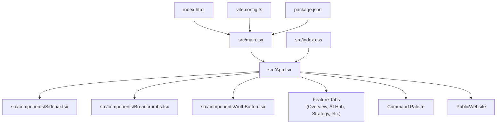
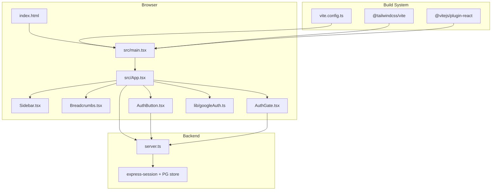
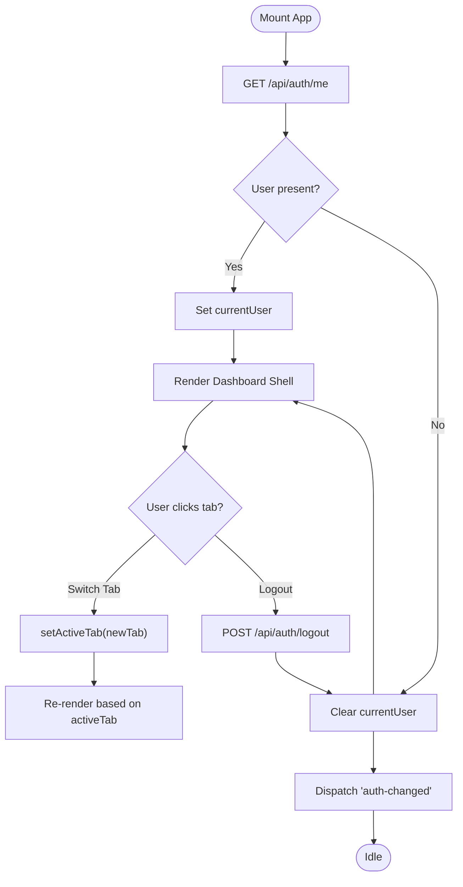
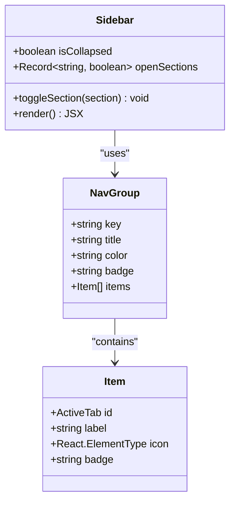
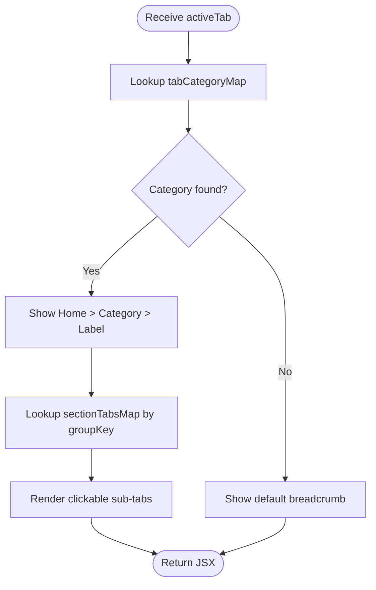
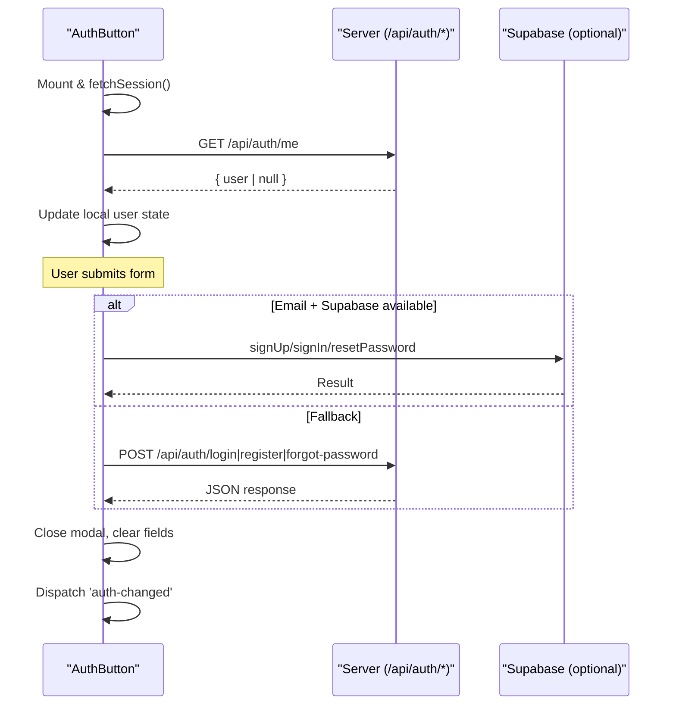
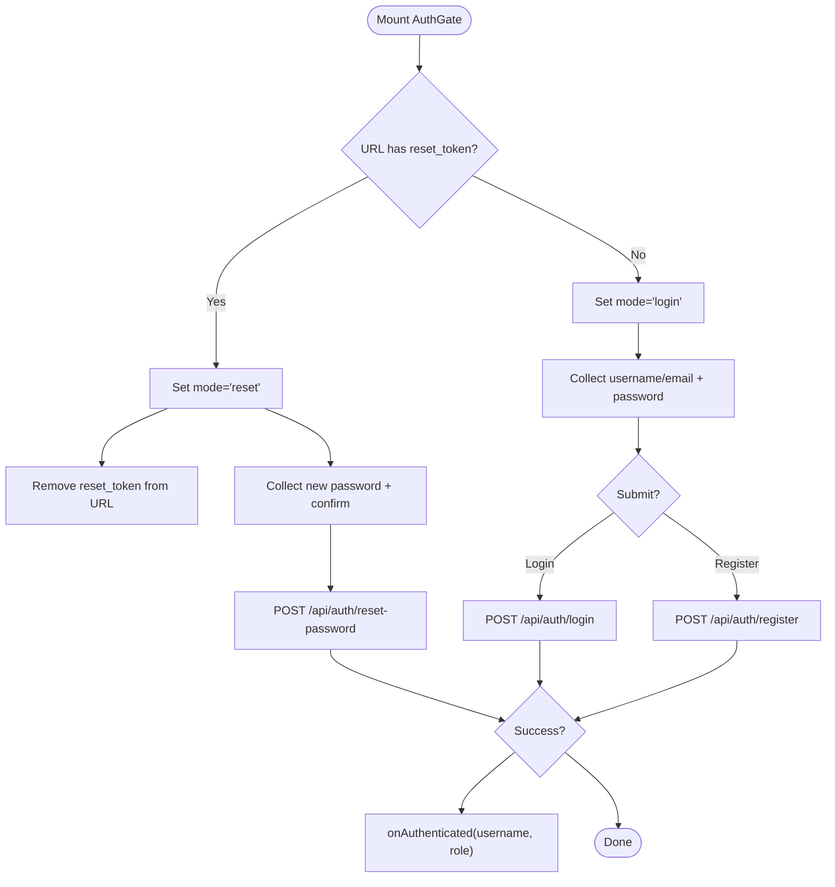
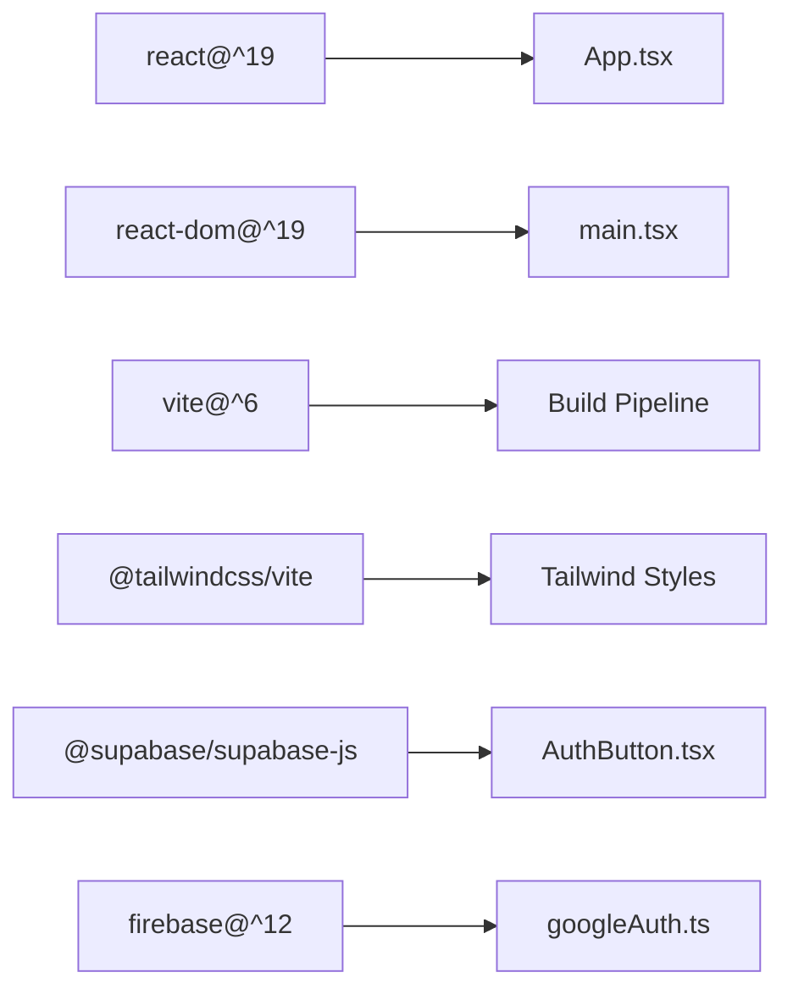

# Frontend Architecture

<cite>
**Referenced Files in This Document**
- [index.html](file://index.html)
- [vite.config.ts](file://vite.config.ts)
- [package.json](file://package.json)
- [src/main.tsx](file://src/main.tsx)
- [src/index.css](file://src/index.css)
- [src/App.tsx](file://src/App.tsx)
- [src/types.ts](file://src/types.ts)
- [src/components/Sidebar.tsx](file://src/components/Sidebar.tsx)
- [src/components/Breadcrumbs.tsx](file://src/components/Breadcrumbs.tsx)
- [src/components/AuthButton.tsx](file://src/components/AuthButton.tsx)
- [src/components/AuthGate.tsx](file://src/components/AuthGate.tsx)
- [src/lib/googleAuth.ts](file://src/lib/googleAuth.ts)
- [server.ts](file://server.ts)
</cite>

## Table of Contents
1. Introduction
2. Project Structure
3. Core Components
4. Architecture Overview
5. Detailed Component Analysis
6. Dependency Analysis
7. Performance Considerations
8. Troubleshooting Guide
9. Conclusion

## Introduction
This document explains the frontend architecture of a React 19 application built with Vite and styled with Tailwind CSS. It focuses on the component-based structure, tab-based navigation, state management patterns, routing approach, authentication flow with session management, and modular organization. The content is designed for both beginners (conceptual overviews) and experienced developers (technical details and diagrams).

## Project Structure
The application follows a modern React + Vite setup:
- Entry point HTML defines the root container and loads the module script.
- Vite config enables React and Tailwind plugins and sets up an alias.
- The React app bootstraps via main.tsx, which renders App inside StrictMode.
- Tailwind is imported through index.css using the Tailwind Vite plugin.
- The App component manages global UI state (active tab, currency, region, command palette, current user) and composes layout components and feature tabs.



**Diagram sources**
- [index.html:1-14](file://index.html#L1-L14)
- [src/main.tsx:1-11](file://src/main.tsx#L1-L11)
- [src/App.tsx:1-177](file://src/App.tsx#L1-L177)
- [src/components/Sidebar.tsx:1-317](file://src/components/Sidebar.tsx#L1-L317)
- [src/components/Breadcrumbs.tsx:1-167](file://src/components/Breadcrumbs.tsx#L1-L167)
- [src/components/AuthButton.tsx:1-384](file://src/components/AuthButton.tsx#L1-L384)
- [src/index.css:1-2](file://src/index.css#L1-L2)
- [vite.config.ts:1-23](file://vite.config.ts#L1-L23)
- [package.json:1-64](file://package.json#L1-L64)

**Section sources**
- [index.html:1-14](file://index.html#L1-L14)
- [vite.config.ts:1-23](file://vite.config.ts#L1-L23)
- [package.json:1-64](file://package.json#L1-L64)
- [src/main.tsx:1-11](file://src/main.tsx#L1-L11)
- [src/index.css:1-2](file://src/index.css#L1-L2)
- [src/App.tsx:1-177](file://src/App.tsx#L1-L177)

## Core Components
- App: Root component that holds global state (activeTab, currency, region, command palette visibility, currentUser), performs initial session check, handles logout, and conditionally renders either PublicWebsite or the main dashboard shell.
- Sidebar: Collapsible navigation grouped by categories; updates activeTab via props.
- Breadcrumbs: Displays category and label for the active tab and provides contextual sub-tabs to switch within a category.
- AuthButton: Compact or standard auth widget supporting login/register/forgot-password flows, integrates with Supabase when available, otherwise falls back to server endpoints. Dispatches auth-changed events to keep UI in sync.
- AuthGate: Standalone full-page auth screen supporting login, register, forgot password, and reset password flows.
- GoogleAuth helper: Firebase-based Google sign-in utility for scenarios requiring Google tokens.

Key responsibilities:
- State management: Local React state in App and child components; cross-component synchronization via window events (auth-changed).
- Navigation: Tab-driven rendering controlled by activeTab string typed as ActiveTab union.
- Styling: Tailwind classes applied throughout components.

**Section sources**
- [src/App.tsx:1-177](file://src/App.tsx#L1-L177)
- [src/components/Sidebar.tsx:1-317](file://src/components/Sidebar.tsx#L1-L317)
- [src/components/Breadcrumbs.tsx:1-167](file://src/components/Breadcrumbs.tsx#L1-L167)
- [src/components/AuthButton.tsx:1-384](file://src/components/AuthButton.tsx#L1-L384)
- [src/components/AuthGate.tsx:1-440](file://src/components/AuthGate.tsx#L1-L440)
- [src/lib/googleAuth.ts:1-60](file://src/lib/googleAuth.ts#L1-L60)
- [src/types.ts:1-178](file://src/types.ts#L1-L178)

## Architecture Overview
The frontend uses a single-page application pattern with client-side tab navigation. Authentication is handled via server sessions and optional Supabase integration. The build system is Vite with React and Tailwind plugins.



**Diagram sources**
- [index.html:1-14](file://index.html#L1-L14)
- [src/main.tsx:1-11](file://src/main.tsx#L1-L11)
- [src/App.tsx:1-177](file://src/App.tsx#L1-L177)
- [src/components/Sidebar.tsx:1-317](file://src/components/Sidebar.tsx#L1-L317)
- [src/components/Breadcrumbs.tsx:1-167](file://src/components/Breadcrumbs.tsx#L1-L167)
- [src/components/AuthButton.tsx:1-384](file://src/components/AuthButton.tsx#L1-L384)
- [src/components/AuthGate.tsx:1-440](file://src/components/AuthGate.tsx#L1-L440)
- [src/lib/googleAuth.ts:1-60](file://src/lib/googleAuth.ts#L1-L60)
- [vite.config.ts:1-23](file://vite.config.ts#L1-L23)
- [server.ts:1-800](file://server.ts#L1-L800)

## Detailed Component Analysis

### App.tsx: Tab-based Shell and Global State
App orchestrates:
- Global state: activeTab, currency, region, command palette open flag, currentUser.
- Session check on mount via GET /api/auth/me; listens to auth-changed events to refresh session.
- Conditional rendering: if activeTab equals public_website, render PublicWebsite with auth callbacks; otherwise render the dashboard shell with Sidebar, Header, Breadcrumbs, and conditional tab panels.
- Logout handler calls POST /api/auth/logout and dispatches auth-changed event.



**Diagram sources**
- [src/App.tsx:1-177](file://src/App.tsx#L1-L177)

**Section sources**
- [src/App.tsx:1-177](file://src/App.tsx#L1-L177)

### Sidebar.tsx: Navigation Groups and Tab Selection
- Maintains collapsed state and per-section open/close state.
- Defines nav groups with color-coded styles and badges.
- Updates activeTab via setActiveTab prop; supports quick access buttons for workflow and public website.



**Diagram sources**
- [src/components/Sidebar.tsx:1-317](file://src/components/Sidebar.tsx#L1-L317)

**Section sources**
- [src/components/Sidebar.tsx:1-317](file://src/components/Sidebar.tsx#L1-L317)

### Breadcrumbs.tsx: Contextual Sub-navigation
- Maps each activeTab to a category and label.
- Renders a breadcrumb trail and a contextual submenu for related tabs within the same group.
- Provides keyboard shortcut hint to open command palette.



**Diagram sources**
- [src/components/Breadcrumbs.tsx:1-167](file://src/components/Breadcrumbs.tsx#L1-L167)

**Section sources**
- [src/components/Breadcrumbs.tsx:1-167](file://src/components/Breadcrumbs.tsx#L1-L167)

### AuthButton.tsx: Inline Authentication Widget
- Supports compact and standard modes.
- Checks session via GET /api/auth/me on mount and listens to auth-changed events.
- Handles login/register/forgot-password flows:
  - If Supabase is available and email-based, uses Supabase SDK.
  - Otherwise falls back to server endpoints (/api/auth/login, /api/auth/register, /api/auth/forgot-password).
- On success or logout, dispatches auth-changed event to synchronize UI across components.



**Diagram sources**
- [src/components/AuthButton.tsx:1-384](file://src/components/AuthButton.tsx#L1-L384)
- [server.ts:1-800](file://server.ts#L1-L800)

**Section sources**
- [src/components/AuthButton.tsx:1-384](file://src/components/AuthButton.tsx#L1-L384)

### AuthGate.tsx: Full-screen Authentication Screen
- Provides login, register, forgot password, and reset password flows.
- Uses server endpoints directly (/api/auth/login, /api/auth/register, /api/auth/forgot-password, /api/auth/reset-password).
- Cleans reset_token from URL after capturing it.



**Diagram sources**
- [src/components/AuthGate.tsx:1-440](file://src/components/AuthGate.tsx#L1-L440)
- [server.ts:1-800](file://server.ts#L1-L800)

**Section sources**
- [src/components/AuthGate.tsx:1-440](file://src/components/AuthGate.tsx#L1-L440)

### GoogleAuth Helper: Google Sign-In Utility
- Initializes Firebase app and provider with Drive scope.
- Exposes initAuth listener, googleSignIn popup, getAccessToken, and logout helpers.
- Useful for features requiring Google tokens (e.g., Google Drive integration).

```mermaid
classDiagram
class GoogleAuth {
+initAuth(onAuthSuccess, onAuthFailure) Function
+googleSignIn() Promise~{user, accessToken}~
+getAccessToken() Promise~string|null~
+logout() Promise~void~
}
```

**Diagram sources**
- [src/lib/googleAuth.ts:1-60](file://src/lib/googleAuth.ts#L1-L60)

**Section sources**
- [src/lib/googleAuth.ts:1-60](file://src/lib/googleAuth.ts#L1-L60)

### Types and Data Contracts
- ActiveTab union defines all supported tabs used across the app for type-safe navigation.
- Additional interfaces define data shapes for campaigns, SEO results, contacts, CRM deals, brochures, and chat messages.

**Section sources**
- [src/types.ts:1-178](file://src/types.ts#L1-L178)

## Dependency Analysis
Frontend dependencies relevant to architecture:
- React 19 and react-dom for UI runtime.
- Vite and @vitejs/plugin-react for build and development.
- Tailwind CSS via @tailwindcss/vite and tailwindcss for styling.
- react-router-dom is listed but not used in the provided files; navigation is tab-based rather than route-based.
- Supabase SDK is used optionally in AuthButton for email-based auth.
- Firebase SDK is used in GoogleAuth for Google sign-in.



**Diagram sources**
- [package.json:1-64](file://package.json#L1-L64)
- [vite.config.ts:1-23](file://vite.config.ts#L1-L23)
- [src/components/AuthButton.tsx:1-384](file://src/components/AuthButton.tsx#L1-L384)
- [src/lib/googleAuth.ts:1-60](file://src/lib/googleAuth.ts#L1-L60)

**Section sources**
- [package.json:1-64](file://package.json#L1-L64)
- [vite.config.ts:1-23](file://vite.config.ts#L1-L23)

## Performance Considerations
- Rendering model: Tab-based conditional rendering keeps the DOM minimal by only mounting the active tab’s component tree.
- HMR: Vite’s HMR can be disabled via DISABLE_HMR env var to reduce CPU usage during agent edits.
- Session polling: App and AuthButton poll /api/auth/me on mount and listen to auth-changed events to avoid unnecessary re-renders.
- Tailwind: Using the Vite plugin ensures efficient style generation and reduces CSS payload.
- Avoid heavy computations in render paths; prefer memoization or lazy loading for large tab components if needed.

[No sources needed since this section provides general guidance]

## Troubleshooting Guide
Common issues and resolutions:
- Session not detected: Ensure /api/auth/me returns a valid user object; verify cookies and session configuration on the server.
- Auth flows failing: Confirm Supabase availability and credentials; fallback endpoints must be reachable.
- Event synchronization: After login/logout, ensure auth-changed is dispatched so all components update consistently.
- HMR behavior: If experiencing flicker during edits, DISABLE_HMR may be set to true intentionally; adjust environment accordingly.

**Section sources**
- [src/App.tsx:1-177](file://src/App.tsx#L1-L177)
- [src/components/AuthButton.tsx:1-384](file://src/components/AuthButton.tsx#L1-L384)
- [vite.config.ts:1-23](file://vite.config.ts#L1-L23)
- [server.ts:1-800](file://server.ts#L1-L800)

## Conclusion
The frontend architecture centers around a React 19 SPA with Vite and Tailwind CSS. App.tsx acts as the central orchestrator for tab-based navigation and global state, while Sidebar and Breadcrumbs provide intuitive navigation and context. Authentication is robust, supporting both Supabase and server-based flows with consistent session management. The modular component design promotes clarity and maintainability, enabling straightforward extension of new tabs and features.