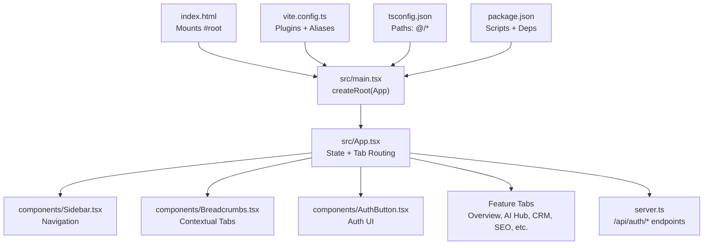
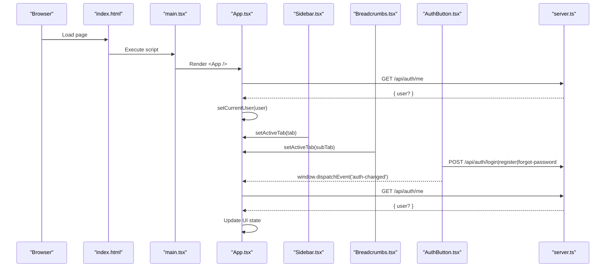
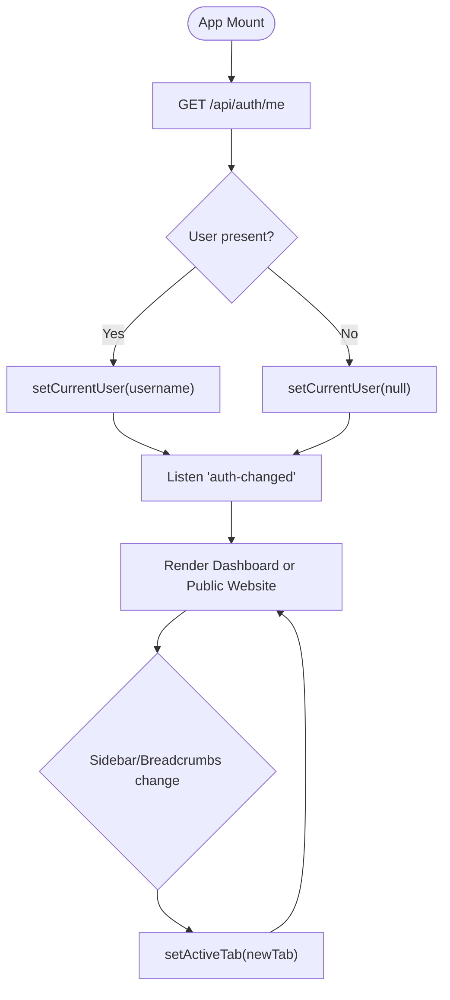
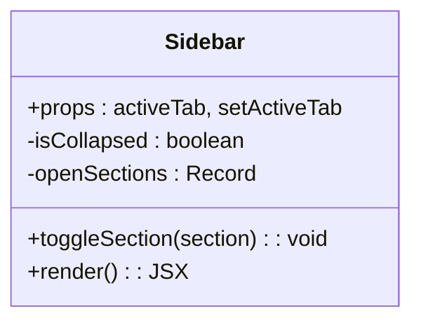
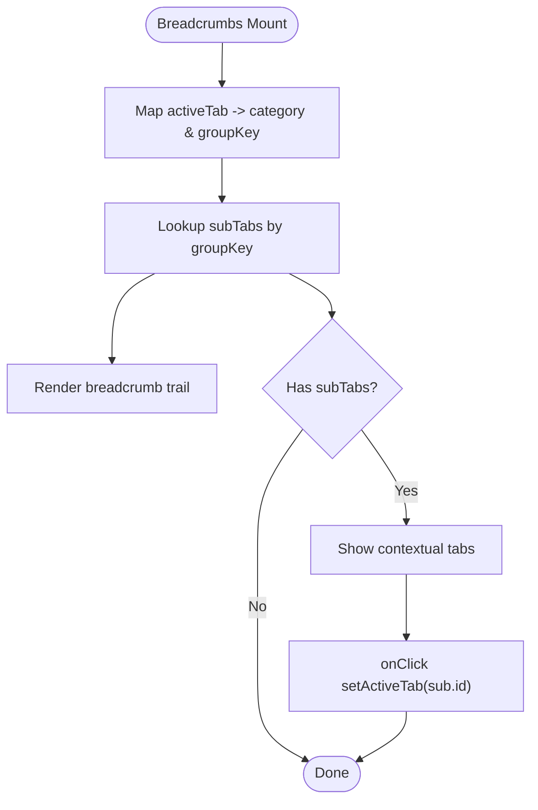
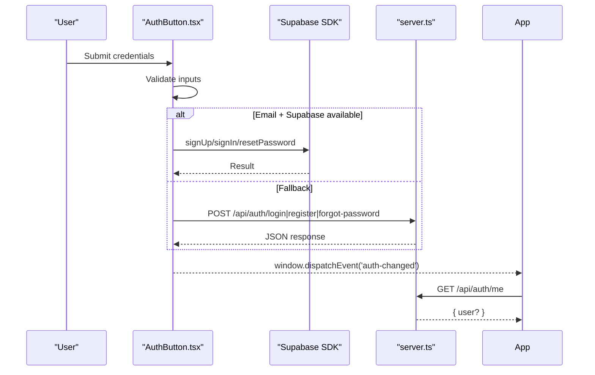
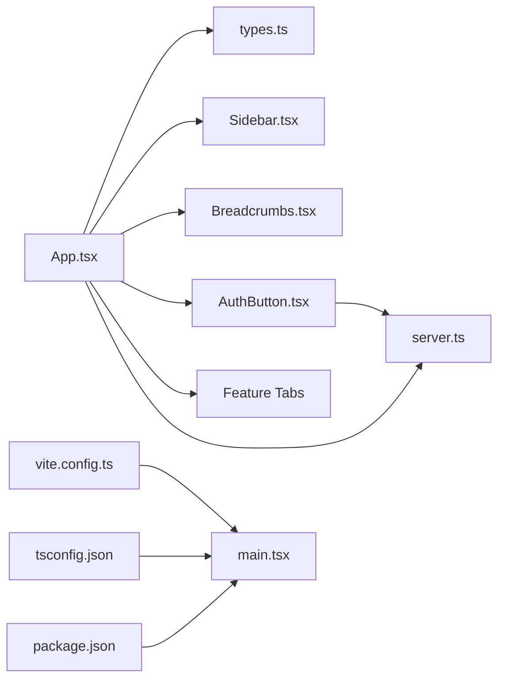

# React Application Structure

<cite>
**Referenced Files in This Document**
- [index.html](file://index.html)
- [main.tsx](file://src/main.tsx)
- [App.tsx](file://src/App.tsx)
- [types.ts](file://src/types.ts)
- [Sidebar.tsx](file://src/components/Sidebar.tsx)
- [Breadcrumbs.tsx](file://src/components/Breadcrumbs.tsx)
- [AuthButton.tsx](file://src/components/AuthButton.tsx)
- [vite.config.ts](file://vite.config.ts)
- [tsconfig.json](file://tsconfig.json)
- [package.json](file://package.json)
- [server.ts](file://server.ts)
- [api/index.ts](file://api/index.ts)
</cite>

## Table of Contents
1. Introduction
2. Project Structure
3. Core Components
4. Architecture Overview
5. Detailed Component Analysis
6. Dependency Analysis
7. Performance Considerations
8. Troubleshooting Guide
9. Conclusion

## Introduction
This document explains the React application structure with a focus on the main entry points and core architecture. It covers how the app bootstraps, how App.tsx orchestrates tab-based navigation and state, the TypeScript configuration and types system, and how authentication integrates across the UI and server. It also provides practical examples for common tasks like switching tabs, managing user sessions, and understanding component lifecycles.

## Project Structure
The application is a Vite + React project with a Node/Express server that exposes REST endpoints for authentication and other features. The HTML page mounts the React root, which renders the App component. The App component manages global UI state (active tab, currency, region, command palette visibility, current user) and composes feature modules as child components. Navigation is driven by an ActiveTab union type and rendered via conditional rendering.

**Diagram sources**
- [index.html:1-14](file://index.html#L1-L14)
- [main.tsx:1-11](file://src/main.tsx#L1-L11)
- [App.tsx:1-177](file://src/App.tsx#L1-L177)
- [Sidebar.tsx:1-317](file://src/components/Sidebar.tsx#L1-L317)
- [Breadcrumbs.tsx:1-167](file://src/components/Breadcrumbs.tsx#L1-L167)
- [AuthButton.tsx:1-384](file://src/components/AuthButton.tsx#L1-L384)
- [vite.config.ts:1-23](file://vite.config.ts#L1-L23)
- [tsconfig.json:1-27](file://tsconfig.json#L1-L27)
- [package.json:1-64](file://package.json#L1-L64)

**Section sources**
- [index.html:1-14](file://index.html#L1-L14)
- [main.tsx:1-11](file://src/main.tsx#L1-L11)
- [vite.config.ts:1-23](file://vite.config.ts#L1-L23)
- [tsconfig.json:1-27](file://tsconfig.json#L1-L27)
- [package.json:1-64](file://package.json#L1-L64)

## Core Components
- App.tsx: Central orchestrator managing active tab state, session checks, logout flow, and composition of feature tabs. It conditionally renders a public website view or the main dashboard layout with Sidebar, Header, Breadcrumbs, and feature tabs.
- Sidebar.tsx: Provides grouped navigation items mapped to ActiveTab values; updates activeTab via props callback.
- Breadcrumbs.tsx: Displays contextual sub-tabs based on the current category mapping and allows quick switching within a section.
- AuthButton.tsx: Handles login/register/forgot-password flows using Supabase when available, otherwise falls back to server endpoints; dispatches auth-changed events to keep UI in sync.

Key responsibilities:
- State management: Local state for activeTab, currency, region, command palette, and currentUser.
- Session lifecycle: On mount, fetch session from /api/auth/me; listen for auth-changed events to refresh.
- Tab routing: Conditional rendering based on activeTab string; special case for public_website.
- Composition: Renders feature modules as needed; passes shared props (currency, region).

**Section sources**
- [App.tsx:1-177](file://src/App.tsx#L1-L177)
- [Sidebar.tsx:1-317](file://src/components/Sidebar.tsx#L1-L317)
- [Breadcrumbs.tsx:1-167](file://src/components/Breadcrumbs.tsx#L1-L167)
- [AuthButton.tsx:1-384](file://src/components/AuthButton.tsx#L1-L384)

## Architecture Overview
The application follows a simple but effective architecture:
- Bootstrap: index.html loads main.tsx, which creates a React root and renders App under StrictMode.
- Orchestration: App holds global UI state and decides which feature module to render.
- Navigation: Sidebar and Breadcrumbs update activeTab; App re-renders the corresponding tab component.
- Authentication: AuthButton and App coordinate with server endpoints (/api/auth/*) and Supabase; they broadcast auth-changed events to synchronize state across components.
- Build tooling: Vite config enables React and Tailwind plugins, sets path aliases (@/*), and controls HMR behavior.
- TypeScript: tsconfig defines modern targets, JSX runtime, module resolution, and path aliases.

**Diagram sources**
- [index.html:1-14](file://index.html#L1-L14)
- [main.tsx:1-11](file://src/main.tsx#L1-L11)
- [App.tsx:1-177](file://src/App.tsx#L1-L177)
- [Sidebar.tsx:1-317](file://src/components/Sidebar.tsx#L1-L317)
- [Breadcrumbs.tsx:1-167](file://src/components/Breadcrumbs.tsx#L1-L167)
- [AuthButton.tsx:1-384](file://src/components/AuthButton.tsx#L1-L384)
- [server.ts:266-392](file://server.ts#L266-L392)

## Detailed Component Analysis

### App.tsx: Central Orchestrator
- State: activeTab, currency, region, isCommandPaletteOpen, currentUser.
- Lifecycle: useEffect initializes session check and subscribes to auth-changed events.
- Routing: Conditional rendering maps each ActiveTab value to its feature component; special branch for public_website.
- Integration: Uses AuthButton for authentication UI; dispatches auth-changed after logout.

**Diagram sources**
- [App.tsx:1-177](file://src/App.tsx#L1-L177)

**Section sources**
- [App.tsx:1-177](file://src/App.tsx#L1-L177)

### Sidebar.tsx: Navigation Model
- Groups tabs into logical sections with icons and badges.
- Updates activeTab via prop callback; supports collapsed mode.
- Highlights active item and shows contextual badges.

**Diagram sources**
- [Sidebar.tsx:1-317](file://src/components/Sidebar.tsx#L1-L317)

**Section sources**
- [Sidebar.tsx:1-317](file://src/components/Sidebar.tsx#L1-L317)

### Breadcrumbs.tsx: Contextual Sub-navigation
- Maps each ActiveTab to a category and label.
- Renders a breadcrumb trail and a contextual submenu for related tabs.
- Supports opening a command palette via callback.

**Diagram sources**
- [Breadcrumbs.tsx:1-167](file://src/components/Breadcrumbs.tsx#L1-L167)

**Section sources**
- [Breadcrumbs.tsx:1-167](file://src/components/Breadcrumbs.tsx#L1-L167)

### AuthButton.tsx: Authentication Flow
- Modes: login, register, forgot-password.
- Providers: Supabase if available; fallback to server endpoints.
- Events: Dispatches auth-changed to notify App and other consumers.
- UI: Compact and standard modes with modal forms and error handling.

**Diagram sources**
- [AuthButton.tsx:1-384](file://src/components/AuthButton.tsx#L1-L384)
- [server.ts:266-392](file://server.ts#L266-L392)

**Section sources**
- [AuthButton.tsx:1-384](file://src/components/AuthButton.tsx#L1-L384)

### Types System
- ActiveTab: Union of all supported tab identifiers used throughout the app for routing and navigation.
- Domain interfaces: CampaignStrategy, AdCopyResult, SeoAuditResult, ClientItem, ChatMessage, EmailContact, EmailCampaignItem, EmailTemplateItem, AutomationWorkflow, CRMDeal, BrochureData, CustomTemplate, AIChatMessage.

These types ensure consistent data shapes across components and APIs.

**Section sources**
- [types.ts:1-178](file://src/types.ts#L1-L178)

### Bootstrap and Configuration
- index.html: Defines the root element and loads main.tsx as a module.
- main.tsx: Creates React root and renders App under StrictMode.
- vite.config.ts: Enables React and Tailwind plugins, sets alias @/*, and controls HMR/watch behavior.
- tsconfig.json: Sets target ES2022, JSX react-jsx, moduleResolution bundler, isolatedModules, and path aliases.
- package.json: Scripts for dev/build/start, dependencies including React, Vite, Express, Supabase, and Tailwind.

**Section sources**
- [index.html:1-14](file://index.html#L1-L14)
- [main.tsx:1-11](file://src/main.tsx#L1-L11)
- [vite.config.ts:1-23](file://vite.config.ts#L1-L23)
- [tsconfig.json:1-27](file://tsconfig.json#L1-L27)
- [package.json:1-64](file://package.json#L1-L64)

## Dependency Analysis
- Frontend dependencies: React, React DOM, Vite, Tailwind, Lucide icons, Radix UI primitives, Recharts, date-fns, jspdf, html2canvas-pro, motion, express-session (server), pg, bcryptjs, nodemailer, supabase-js, firebase, google genai.
- Build-time: Vite plugin-react, tailwindcss, autoprefixer, esbuild, tsx, typescript.
- Path aliases: @/* resolves to repository root, enabling clean imports.

**Diagram sources**
- [App.tsx:1-177](file://src/App.tsx#L1-L177)
- [types.ts:1-178](file://src/types.ts#L1-L178)
- [Sidebar.tsx:1-317](file://src/components/Sidebar.tsx#L1-L317)
- [Breadcrumbs.tsx:1-167](file://src/components/Breadcrumbs.tsx#L1-L167)
- [AuthButton.tsx:1-384](file://src/components/AuthButton.tsx#L1-L384)
- [server.ts:266-392](file://server.ts#L266-L392)
- [vite.config.ts:1-23](file://vite.config.ts#L1-L23)
- [tsconfig.json:1-27](file://tsconfig.json#L1-L27)
- [package.json:1-64](file://package.json#L1-L64)

**Section sources**
- [package.json:1-64](file://package.json#L1-L64)

## Performance Considerations
- Conditional rendering: App.tsx renders only the active tab component, avoiding unnecessary overhead.
- Event-driven auth synchronization: Using a single auth-changed event avoids prop drilling and reduces re-renders.
- HMR control: Vite disables file watching when DISABLE_HMR is true to save CPU during agent edits.
- Type safety: TypeScript prevents runtime errors and improves developer productivity.
- External libraries: Use minimal icon sets and lazy-load heavy features where possible.

[No sources needed since this section provides general guidance]

## Troubleshooting Guide
Common issues and resolutions:
- Session not detected: Ensure /api/auth/me returns a valid user object; verify cookies and CORS settings.
- Auth events not firing: Confirm AuthButton dispatches 'auth-changed' after login/logout; ensure listeners are attached in App.
- Tab not rendering: Verify ActiveTab value matches the expected string; check conditional branches in App.tsx.
- Build errors: Check tsconfig paths and Vite alias configuration; ensure React and Tailwind plugins are enabled.
- Server endpoints failing: Inspect server logs for database connectivity, session store, and environment variables (SESSION_SECRET, DATABASE_URL, SMTP_*).

**Section sources**
- [App.tsx:1-177](file://src/App.tsx#L1-L177)
- [AuthButton.tsx:1-384](file://src/components/AuthButton.tsx#L1-L384)
- [server.ts:266-392](file://server.ts#L266-L392)

## Conclusion
The application centers around App.tsx as the orchestrator for tab-based navigation and global state, with clear separation between UI composition and authentication flows. The types system ensures consistency, while Vite and TypeScript provide a robust build and development experience. The server exposes secure endpoints for authentication and integrates with external providers when available. This structure scales well as new feature modules are added and maintains clarity through explicit routing and event-driven synchronization.

[No sources needed since this section summarizes without analyzing specific files]