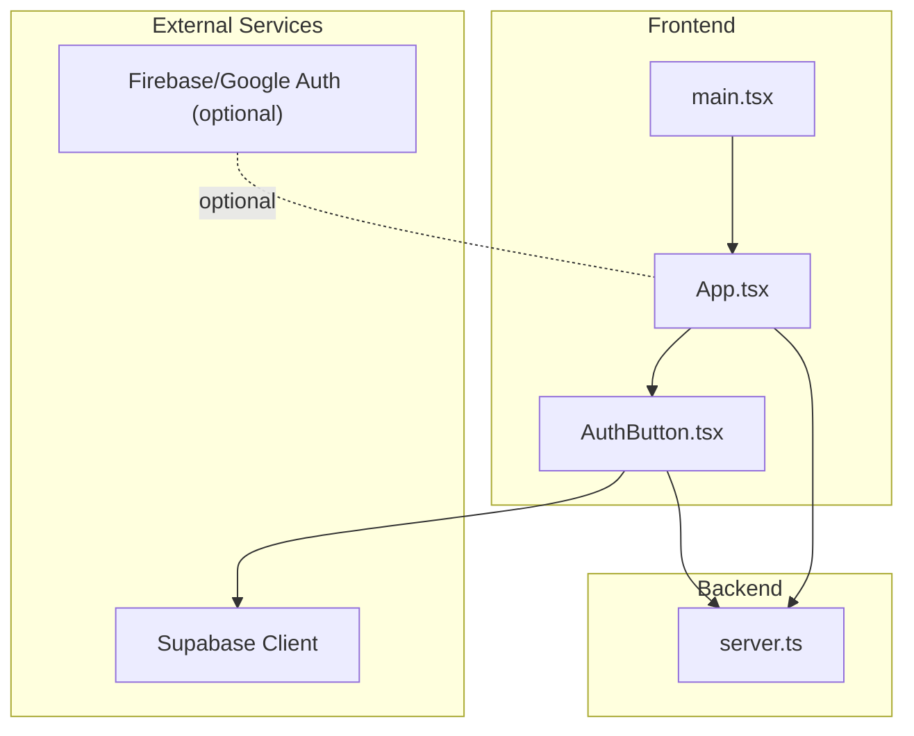
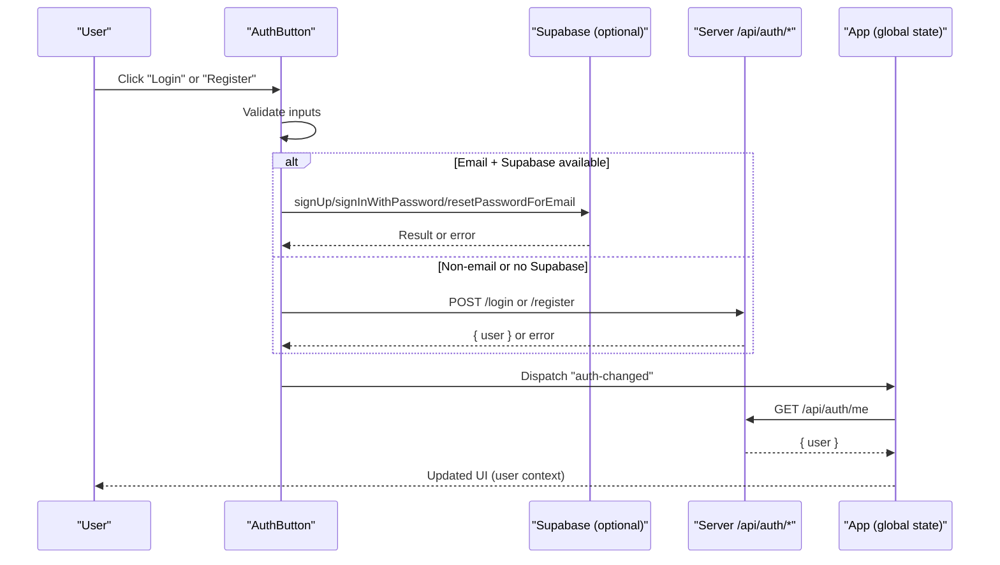
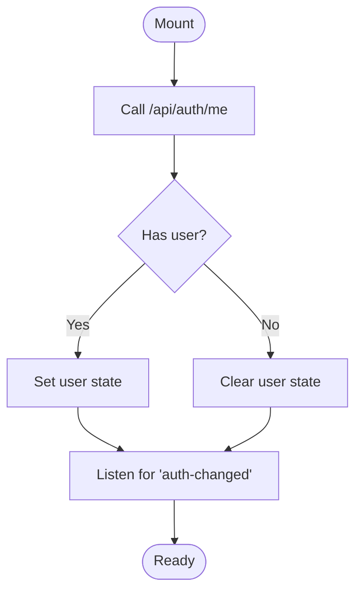
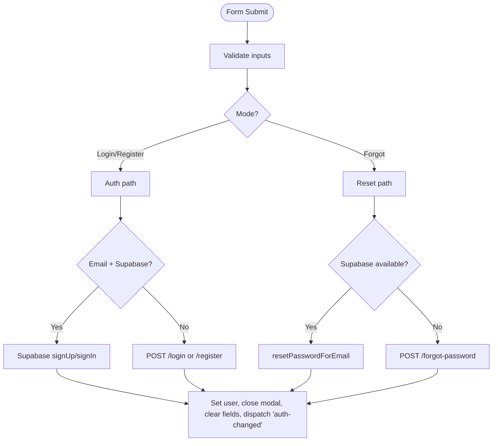
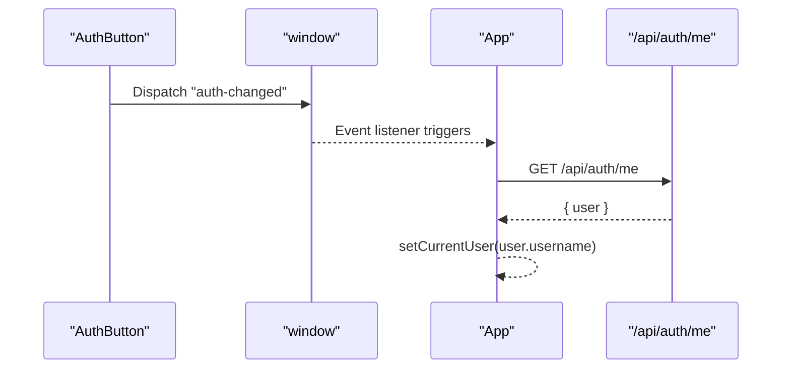
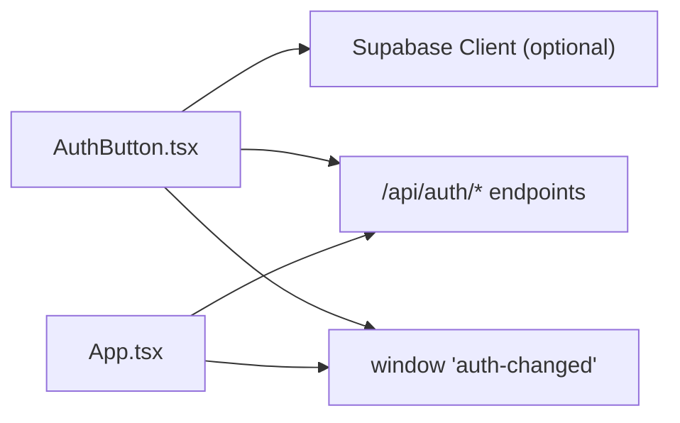

# Authentication Button Component

<cite>
**Referenced Files in This Document**
- [AuthButton.tsx](file://src/components/AuthButton.tsx)
- [App.tsx](file://src/App.tsx)
- [server.ts](file://server.ts)
- [googleAuth.ts](file://src/lib/googleAuth.ts)
- [main.tsx](file://src/main.tsx)
</cite>

## Table of Contents
1. [Introduction](#introduction)
2. [Project Structure](#project-structure)
3. [Core Components](#core-components)
4. [Architecture Overview](#architecture-overview)
5. [Detailed Component Analysis](#detailed-component-analysis)
6. [Dependency Analysis](#dependency-analysis)
7. [Performance Considerations](#performance-considerations)
8. [Troubleshooting Guide](#troubleshooting-guide)
9. [Conclusion](#conclusion)

## Introduction
This document explains the AuthButton component, a self-contained authentication interface that supports login, registration, password reset, and logout flows. It manages local session state, integrates with both Supabase (when available) and server-side endpoints, and communicates global auth changes via a lightweight event system. The component renders two visual modes: a standard card-style UI and a compact pill-style UI for constrained spaces. It also demonstrates responsive design using Tailwind CSS and includes accessibility-friendly patterns such as labels, titles, and focus states.

## Project Structure
The AuthButton lives under src/components and is consumed by the application root and public-facing views. It interacts with:
- A server-side authentication API (/api/auth/*)
- Optional Supabase client for email-based auth and password reset
- Global window events to synchronize auth state across components

**Diagram sources**
- [main.tsx:1-11](file://src/main.tsx#L1-L11)
- [App.tsx:43-107](file://src/App.tsx#L43-L107)
- [AuthButton.tsx:1-384](file://src/components/AuthButton.tsx#L1-L384)
- [server.ts:318-392](file://server.ts#L318-L392)

**Section sources**
- [main.tsx:1-11](file://src/main.tsx#L1-L11)
- [App.tsx:43-107](file://src/App.tsx#L43-L107)
- [AuthButton.tsx:1-384](file://src/components/AuthButton.tsx#L1-L384)

## Core Components
- AuthButton: React component providing login/register/forgot-password/logout UX with dual rendering modes (standard and compact).
- App: Root app that polls /api/auth/me on mount and listens for global auth-changed events to refresh user context.
- server.ts: Express-like endpoints handling register, login, logout, and session management; returns user objects including role.
- googleAuth.ts: Optional Firebase/Google sign-in utilities (not directly used by AuthButton but present in the codebase).

Key responsibilities:
- Session polling and synchronization via /api/auth/me
- Form validation and submission for login/register/forgot
- Conditional use of Supabase vs server endpoints
- Emitting auth-changed events to keep other parts of the app in sync
- Rendering accessible forms and buttons with Tailwind styles

**Section sources**
- [AuthButton.tsx:15-162](file://src/components/AuthButton.tsx#L15-L162)
- [App.tsx:50-88](file://src/App.tsx#L50-L88)
- [server.ts:318-392](file://server.ts#L318-L392)
- [googleAuth.ts:1-60](file://src/lib/googleAuth.ts#L1-L60)

## Architecture Overview
AuthButton orchestrates authentication through three primary paths:
- Email-based flow via Supabase when available
- Username/password flow via server endpoints
- Password reset via Supabase or server fallback

It maintains local state for the current user and loading/error indicators, and it broadcasts auth-changed events to notify peers like App.

**Diagram sources**
- [AuthButton.tsx:62-145](file://src/components/AuthButton.tsx#L62-L145)
- [App.tsx:50-88](file://src/App.tsx#L50-L88)
- [server.ts:318-392](file://server.ts#L318-L392)

## Detailed Component Analysis

### Props Interface
- compact?: boolean — When true, renders a compact pill-style UI suitable for tight headers or toolbars. Default is false.

Behavioral notes:
- Without props, the component renders a full card modal for login/register/forgot flows.
- With compact=true, it shows a small avatar/name area when logged in, or a minimal login button otherwise.

**Section sources**
- [AuthButton.tsx:11-13](file://src/components/AuthButton.tsx#L11-L13)

### State Management and Session Handling
- Local state tracks user, checkingSession, showModal, mode ('login' | 'register' | 'forgot'), form fields, loading, and error.
- On mount, it calls fetchSession which hits /api/auth/me to hydrate the user. It also subscribes to the global auth-changed event to refresh state after any auth action elsewhere.

**Diagram sources**
- [AuthButton.tsx:28-60](file://src/components/AuthButton.tsx#L28-L60)

**Section sources**
- [AuthButton.tsx:15-60](file://src/components/AuthButton.tsx#L15-L60)

### Authentication Flows
- Login/Register:
  - If input looks like an email and Supabase is available, uses Supabase signUp/signInWithPassword.
  - Otherwise, posts to /api/auth/login or /api/auth/register with username/password.
  - On success, sets local user, closes modal, clears passwords, and dispatches auth-changed.
- Forgot Password:
  - If Supabase is available, calls resetPasswordForEmail with redirect URL.
  - Else falls back to POST /api/auth/forgot-password with email.
  - Displays a confirmation message.
- Logout:
  - Attempts Supabase signOut if available, clears local user, and dispatches auth-changed.

**Diagram sources**
- [AuthButton.tsx:62-145](file://src/components/AuthButton.tsx#L62-L145)

**Section sources**
- [AuthButton.tsx:62-145](file://src/components/AuthButton.tsx#L62-L145)

### User Role Handling
- The server returns a user object containing id, username, and role.
- AuthButton displays an “Admin” badge when role equals 'admin'.
- App-level features can gate access based on this role where needed.

**Section sources**
- [server.ts:318-392](file://server.ts#L318-L392)
- [AuthButton.tsx:292-315](file://src/components/AuthButton.tsx#L292-L315)
- [AuthButton.tsx:340-369](file://src/components/AuthButton.tsx#L340-L369)

### Event Integration with App
- AuthButton dispatches a global 'auth-changed' event after successful login/register/logout.
- App subscribes to this event and re-fetches /api/auth/me to update its currentUser state.

**Diagram sources**
- [AuthButton.tsx:136-145](file://src/components/AuthButton.tsx#L136-L145)
- [App.tsx:50-88](file://src/App.tsx#L50-L88)

**Section sources**
- [AuthButton.tsx:136-145](file://src/components/AuthButton.tsx#L136-L145)
- [App.tsx:50-88](file://src/App.tsx#L50-L88)

### Styling and Responsive Behavior
- Uses Tailwind CSS classes for layout, colors, spacing, shadows, and transitions.
- Compact mode hides text on smaller screens and shows only essential elements (avatar, name, logout icon).
- Standard mode reveals more details on larger screens (username, role badge, active session indicator).
- Modal overlay uses backdrop blur and fixed positioning for focus isolation.

Accessibility highlights:
- Labels for inputs, descriptive titles for buttons, disabled states during loading, and visible focus rings.

**Section sources**
- [AuthButton.tsx:164-280](file://src/components/AuthButton.tsx#L164-L280)
- [AuthButton.tsx:282-383](file://src/components/AuthButton.tsx#L282-L383)

### Error Handling and User Feedback
- Errors are captured and displayed inside the modal in a styled alert box.
- Loading states disable submit buttons and show a spinner.
- Network errors fall back gracefully and log warnings/errors to console.

**Section sources**
- [AuthButton.tsx:140-145](file://src/components/AuthButton.tsx#L140-L145)
- [AuthButton.tsx:257-261](file://src/components/AuthButton.tsx#L257-L261)

## Dependency Analysis
AuthButton depends on:
- React hooks for state and effects
- Lucide icons for UI symbols
- Supabase client (optional) for email-based auth and password reset
- Server endpoints for non-email flows and session verification
- Global window events for cross-component synchronization

**Diagram sources**
- [AuthButton.tsx:1-384](file://src/components/AuthButton.tsx#L1-L384)
- [App.tsx:43-107](file://src/App.tsx#L43-L107)
- [server.ts:318-392](file://server.ts#L318-L392)

**Section sources**
- [AuthButton.tsx:1-384](file://src/components/AuthButton.tsx#L1-L384)
- [App.tsx:43-107](file://src/App.tsx#L43-L107)
- [server.ts:318-392](file://server.ts#L318-L392)

## Performance Considerations
- Minimal re-renders: AuthButton keeps all auth-related state locally; App updates only on auth-changed events.
- Efficient polling: Session check runs once on mount and on auth-changed; no heavy intervals.
- Conditional Supabase usage avoids unnecessary network calls when not configured.
- Debouncing or caching could be added if frequent re-auth checks are needed.

[No sources needed since this section provides general guidance]

## Troubleshooting Guide
Common issues and resolutions:
- Supabase client undefined:
  - Ensure environment variables are set so the Supabase client initializes correctly.
  - AuthButton already guards against missing Supabase and falls back to server endpoints.
- Session not refreshing:
  - Verify that auth-changed events are dispatched after login/logout.
  - Confirm App subscribes to auth-changed and calls /api/auth/me.
- Login/register failures:
  - Check server endpoint responses and error messages returned in JSON payloads.
  - Inspect browser console for network errors and thrown exceptions.
- Password reset not working:
  - For forgot password, ensure either Supabase is configured or /api/auth/forgot-password is reachable.

**Section sources**
- [AuthButton.tsx:80-101](file://src/components/AuthButton.tsx#L80-L101)
- [AuthButton.tsx:140-145](file://src/components/AuthButton.tsx#L140-L145)
- [App.tsx:50-88](file://src/App.tsx#L50-L88)
- [server.ts:318-392](file://server.ts#L318-L392)

## Conclusion
AuthButton is a robust, flexible authentication UI that adapts to different environments (Supabase vs server-only), handles multiple flows (login, register, forgot password, logout), and synchronizes state across the app via lightweight events. Its Tailwind-based styling ensures responsiveness and clarity, while its error handling and feedback mechanisms provide a smooth user experience. For custom flows, extend the form logic and integrate additional providers or APIs following the established patterns.

[No sources needed since this section summarizes without analyzing specific files]