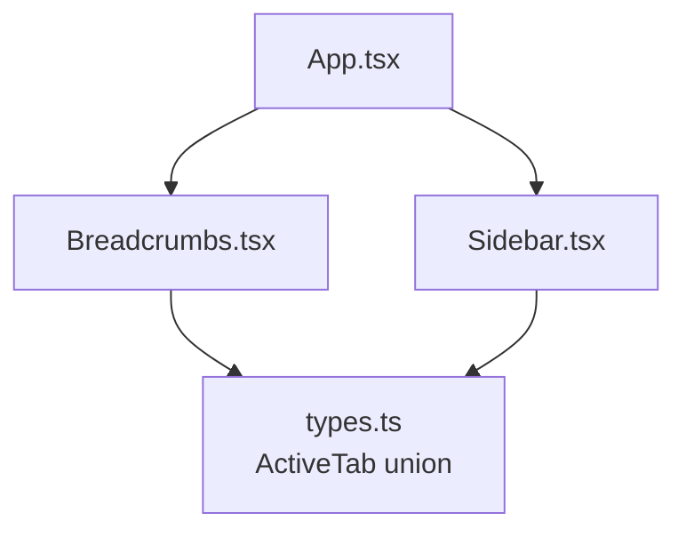
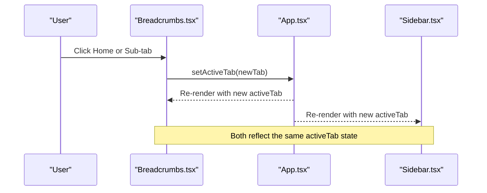
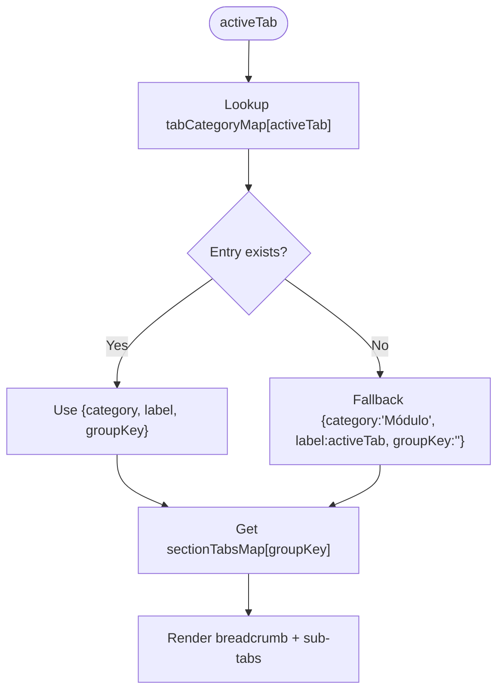
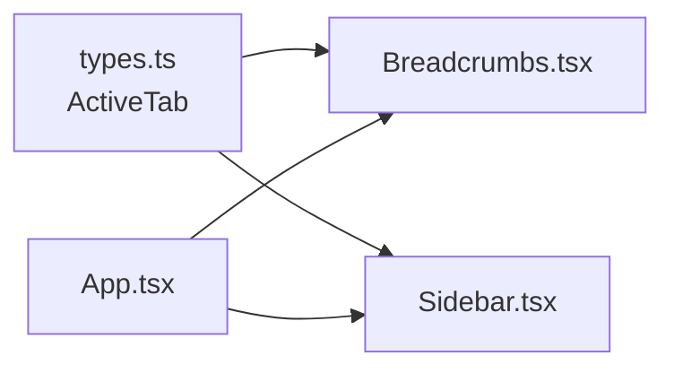

# Breadcrumbs Navigation Helper

<cite>
**Referenced Files in This Document**
- [Breadcrumbs.tsx](file://src/components/Breadcrumbs.tsx)
- [App.tsx](file://src/App.tsx)
- [types.ts](file://src/types.ts)
- [Sidebar.tsx](file://src/components/Sidebar.tsx)
- [index.css](file://src/index.css)
</cite>

## Table of Contents
1. [Introduction](#introduction)
2. [Project Structure](#project-structure)
3. [Core Components](#core-components)
4. [Architecture Overview](#architecture-overview)
5. [Detailed Component Analysis](#detailed-component-analysis)
6. [Dependency Analysis](#dependency-analysis)
7. [Performance Considerations](#performance-considerations)
8. [Troubleshooting Guide](#troubleshooting-guide)
9. [Conclusion](#conclusion)
10. [Appendices](#appendices)

## Introduction
The Breadcrumbs navigation helper provides a clear, hierarchical context for users as they navigate between feature modules and sub-tabs within the application. It displays:
- A breadcrumb trail showing Home > Category > Current Feature
- A contextual submenu (section tabs) that allows quick switching among related features within the same category

This component is driven by a centralized tab registry and type-safe ActiveTab values, ensuring consistent labels, categories, and grouping across the app.

## Project Structure
The Breadcrumbs component is a small, focused React component integrated into the top-level App layout. It receives the current active tab and a setter to update it, plus an optional command palette trigger. The Sidebar also manages the same ActiveTab state, keeping both navigation surfaces synchronized.



**Diagram sources**
- [App.tsx:109-174](file://src/App.tsx#L109-L174)
- [Breadcrumbs.tsx:101-166](file://src/components/Breadcrumbs.tsx#L101-L166)
- [Sidebar.tsx:54-161](file://src/components/Sidebar.tsx#L54-L161)
- [types.ts:1-35](file://src/types.ts#L1-L35)

**Section sources**
- [App.tsx:109-174](file://src/App.tsx#L109-L174)
- [Breadcrumbs.tsx:101-166](file://src/components/Breadcrumbs.tsx#L101-L166)
- [Sidebar.tsx:54-161](file://src/components/Sidebar.tsx#L54-L161)
- [types.ts:1-35](file://src/types.ts#L1-L35)

## Core Components
- Breadcrumbs.tsx: Renders the breadcrumb trail and contextual sub-tabs; maps activeTab to category/label/groupKey via internal maps.
- types.ts: Defines the ActiveTab union used throughout the app to ensure type safety for all navigable screens.
- App.tsx: Owns the activeTab state and passes it down to Breadcrumbs and other components.
- Sidebar.tsx: Also updates activeTab, keeping sidebar selection in sync with breadcrumbs.

Key responsibilities:
- Resolve current category and label from activeTab using tabCategoryMap
- Render section tabs based on groupKey using sectionTabsMap
- Provide keyboard shortcut hint for command palette when available

**Section sources**
- [Breadcrumbs.tsx:5-54](file://src/components/Breadcrumbs.tsx#L5-L54)
- [Breadcrumbs.tsx:101-166](file://src/components/Breadcrumbs.tsx#L101-L166)
- [types.ts:1-35](file://src/types.ts#L1-L35)
- [App.tsx:43-48](file://src/App.tsx#L43-L48)
- [App.tsx:126-130](file://src/App.tsx#L126-L130)
- [Sidebar.tsx:54-161](file://src/components/Sidebar.tsx#L54-L161)

## Architecture Overview
The Breadcrumbs component is stateless and derives its display entirely from props. The parent App owns the single source of truth for activeTab. Clicking either the breadcrumb home button or any contextual sub-tab triggers setActiveTab, which re-renders Breadcrumbs and the corresponding feature module.



**Diagram sources**
- [Breadcrumbs.tsx:101-166](file://src/components/Breadcrumbs.tsx#L101-L166)
- [App.tsx:43-48](file://src/App.tsx#L43-L48)
- [App.tsx:126-130](file://src/App.tsx#L126-L130)
- [Sidebar.tsx:54-161](file://src/components/Sidebar.tsx#L54-L161)

## Detailed Component Analysis

### Props Interface
- activeTab: ActiveTab — the currently selected feature/module
- setActiveTab: (tab: ActiveTab) => void — callback to change the active tab
- onOpenCommandPalette?: () => void — optional callback to open the global command palette

These props are minimal and focused on navigation control and optional integration with the command palette.

**Section sources**
- [Breadcrumbs.tsx:5-9](file://src/components/Breadcrumbs.tsx#L5-L9)
- [types.ts:1-35](file://src/types.ts#L1-L35)

### Data Model and Mapping
- tabCategoryMap: Maps each ActiveTab to a human-readable category, label, and groupKey
- sectionTabsMap: Maps groupKey to an array of sub-tabs (id and label) used to render the contextual submenu

This design centralizes labeling and grouping, making it easy to add or rename features without touching rendering logic.



**Diagram sources**
- [Breadcrumbs.tsx:101-103](file://src/components/Breadcrumbs.tsx#L101-L103)
- [Breadcrumbs.tsx:16-54](file://src/components/Breadcrumbs.tsx#L16-L54)
- [Breadcrumbs.tsx:56-99](file://src/components/Breadcrumbs.tsx#L56-L99)

**Section sources**
- [Breadcrumbs.tsx:16-54](file://src/components/Breadcrumbs.tsx#L16-L54)
- [Breadcrumbs.tsx:56-99](file://src/components/Breadcrumbs.tsx#L56-L99)
- [Breadcrumbs.tsx:101-103](file://src/components/Breadcrumbs.tsx#L101-L103)

### Rendering Behavior
- Breadcrumb trail:
  - Home button sets activeTab back to overview
  - Chevron icons separate segments
  - Category and current label are displayed with distinct styling
- Contextual submenu:
  - Only shown when the current group has multiple sub-tabs
  - Active sub-tab is highlighted; others are hoverable
  - Horizontal scrolling supported via custom scrollbar class

```mermaid
classDiagram
class BreadcrumbsProps {
+ActiveTab activeTab
+setActiveTab(tab)
+onOpenCommandPalette()
}
class TabCategoryEntry {
+string category
+string label
+string groupKey
}
class SubTab {
+ActiveTab id
+string label
}
BreadcrumbsProps --> TabCategoryEntry : "maps activeTab"
TabCategoryEntry --> SubTab[] : "groupKey -> sectionTabsMap"
```

**Diagram sources**
- [Breadcrumbs.tsx:5-14](file://src/components/Breadcrumbs.tsx#L5-L14)
- [Breadcrumbs.tsx:16-54](file://src/components/Breadcrumbs.tsx#L16-L54)
- [Breadcrumbs.tsx:56-99](file://src/components/Breadcrumbs.tsx#L56-L99)

**Section sources**
- [Breadcrumbs.tsx:101-166](file://src/components/Breadcrumbs.tsx#L101-L166)

### Integration with Routing and State
- The activeTab state lives in App.tsx and is passed to Breadcrumbs and Sidebar
- Changing activeTab via Breadcrumbs updates the UI consistently across the app
- No URL routing is used here; navigation is state-driven within the SPA

To integrate with a real router (e.g., React Router), you can:
- Subscribe to route changes and set activeTab accordingly
- Update the URL when setActiveTab is called
- Keep Breadcrumbs purely presentational while the router drives the state

**Section sources**
- [App.tsx:43-48](file://src/App.tsx#L43-L48)
- [App.tsx:126-130](file://src/App.tsx#L126-L130)
- [Sidebar.tsx:54-161](file://src/components/Sidebar.tsx#L54-L161)

### Visual Design Patterns
- Compact, pill-like breadcrumb bar with subtle borders and shadows
- Distinct active state for the current label using accent color and background
- Section tabs styled as segmented buttons with hover and active states
- Dark mode support through Tailwind dark variants
- Responsive behavior:
  - Home text hides on small screens; icon remains visible
  - Horizontal overflow handled with a custom scrollbar class

Styling relies on Tailwind utility classes and a custom scrollbar class referenced in the component.

**Section sources**
- [Breadcrumbs.tsx:108-138](file://src/components/Breadcrumbs.tsx#L108-L138)
- [Breadcrumbs.tsx:141-163](file://src/components/Breadcrumbs.tsx#L141-L163)
- [index.css:1-2](file://src/index.css#L1-L2)

### Accessibility Considerations
- Uses semantic <nav> for the breadcrumb area
- Buttons have clear labels and roles for screen readers
- Keyboard shortcuts are indicated visually for the command palette
- Recommendations for further improvements:
  - Add aria-label to the nav element describing its purpose
  - Ensure focus management when navigating between sections
  - Provide aria-current="page" on the active sub-tab for better semantics

**Section sources**
- [Breadcrumbs.tsx:108-138](file://src/components/Breadcrumbs.tsx#L108-L138)
- [Breadcrumbs.tsx:141-163](file://src/components/Breadcrumbs.tsx#L141-L163)

## Dependency Analysis
- Breadcrumbs depends on:
  - types.ts for ActiveTab union
  - lucide-react icons for visual indicators
- App orchestrates state and renders Breadcrumbs alongside Sidebar and feature modules
- Sidebar mirrors the same ActiveTab state, ensuring consistent navigation visuals



**Diagram sources**
- [types.ts:1-35](file://src/types.ts#L1-L35)
- [Breadcrumbs.tsx:1-3](file://src/components/Breadcrumbs.tsx#L1-L3)
- [Sidebar.tsx:1-34](file://src/components/Sidebar.tsx#L1-L34)
- [App.tsx:39-40](file://src/App.tsx#L39-L40)

**Section sources**
- [types.ts:1-35](file://src/types.ts#L1-L35)
- [Breadcrumbs.tsx:1-3](file://src/components/Breadcrumbs.tsx#L1-L3)
- [Sidebar.tsx:1-34](file://src/components/Sidebar.tsx#L1-L34)
- [App.tsx:39-40](file://src/App.tsx#L39-L40)

## Performance Considerations
- Breadcrumbs is lightweight and stateless; rendering cost is minimal
- Large numbers of sub-tabs may cause horizontal scrolling; consider pagination or collapsible groups if needed
- Avoid unnecessary re-renders by keeping setActiveTab stable and avoiding prop churn in parent components

[No sources needed since this section provides general guidance]

## Troubleshooting Guide
Common issues and resolutions:
- Breadcrumbs not updating:
  - Verify that setActiveTab is correctly wired in App.tsx and passed to Breadcrumbs
  - Ensure the clicked sub-tab id matches one of the ActiveTab values
- Missing category or label:
  - Check tabCategoryMap includes the activeTab key
  - Confirm fallback behavior is acceptable when mapping is missing
- Command palette button not visible:
  - Ensure onOpenCommandPalette is provided from App.tsx
  - Check responsive visibility rules (hidden md:flex)

**Section sources**
- [Breadcrumbs.tsx:101-166](file://src/components/Breadcrumbs.tsx#L101-L166)
- [App.tsx:126-130](file://src/App.tsx#L126-L130)

## Conclusion
The Breadcrumbs component delivers a concise, accessible, and responsive navigation aid that keeps users oriented within the application’s hierarchy. Its data-driven mapping approach makes it easy to extend with new modules and maintain consistent labeling across the app. For production use, consider adding explicit accessibility attributes and integrating with a URL-based router for deep linking and history support.

[No sources needed since this section summarizes without analyzing specific files]

## Appendices

### Example Usage in App
- Pass activeTab and setActiveTab from App to Breadcrumbs
- Optionally pass onOpenCommandPalette to enable the keyboard shortcut hint

**Section sources**
- [App.tsx:126-130](file://src/App.tsx#L126-L130)

### Extending Breadcrumbs for Nested Scenarios
- To support deeper nesting (e.g., Module > Section > Page), extend tabCategoryMap entries with additional levels and adjust the rendering logic to show multi-step breadcrumbs
- Alternatively, introduce a nested route structure and derive breadcrumbs from the current route path

[No sources needed since this section provides general guidance]