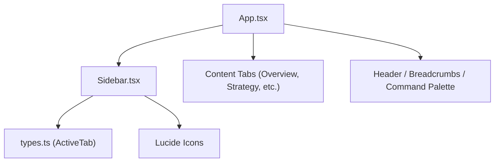
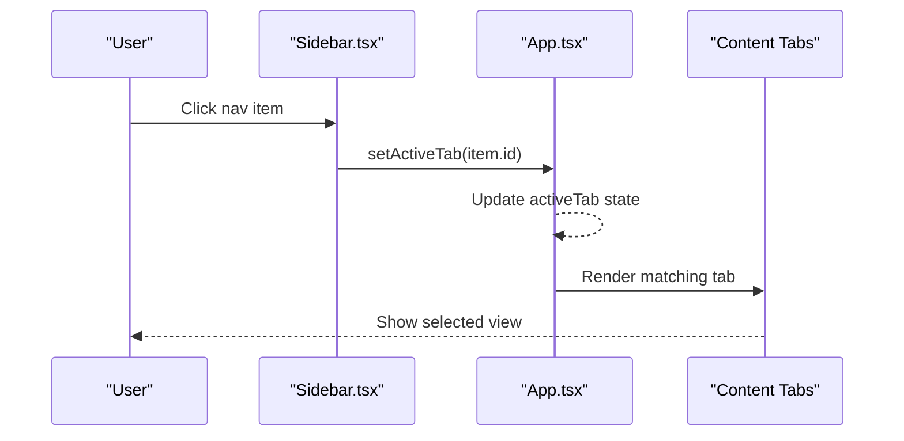
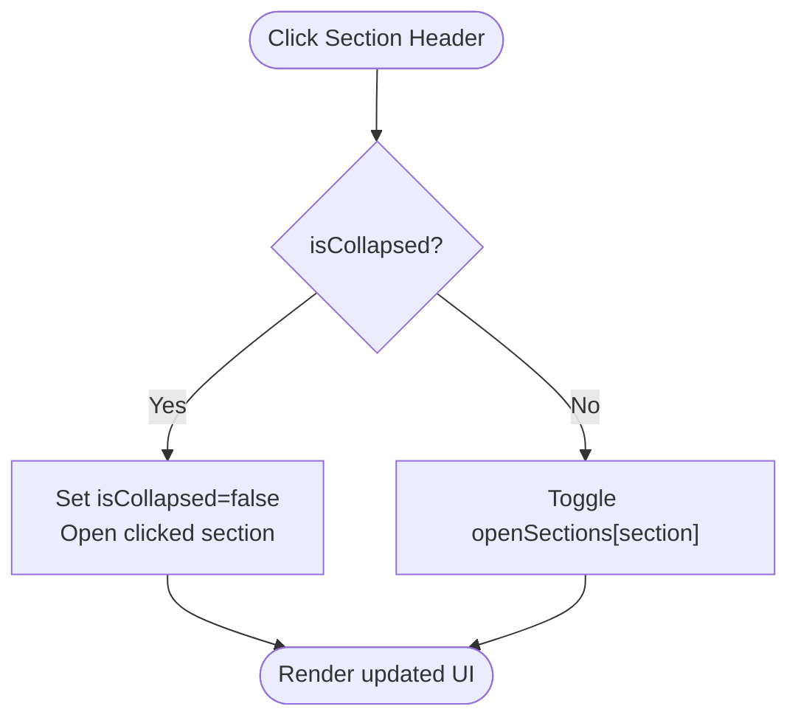
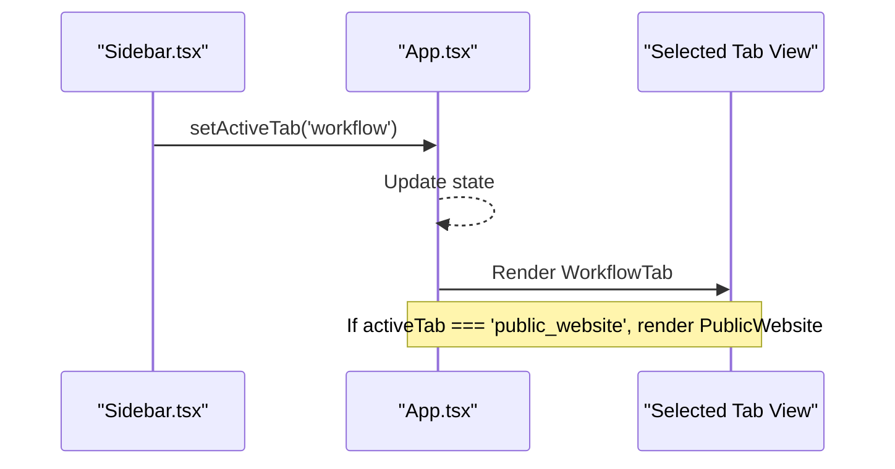
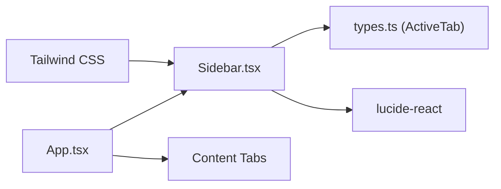
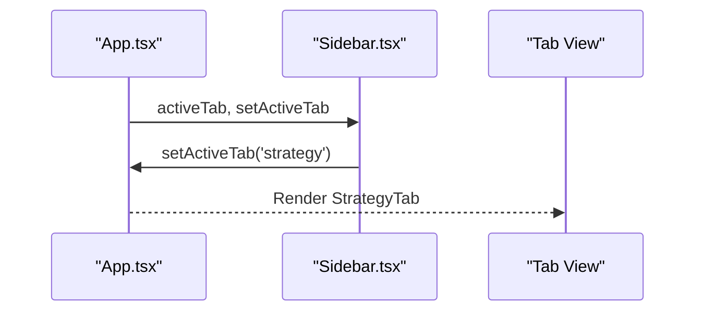

# Sidebar Navigation Component

<cite>
**Referenced Files in This Document**
- [Sidebar.tsx](file://src/components/Sidebar.tsx)
- [App.tsx](file://src/App.tsx)
- [types.ts](file://src/types.ts)
- [index.css](file://src/index.css)
- [package.json](file://package.json)
</cite>

## Table of Contents
1. [Introduction](#introduction)
2. [Project Structure](#project-structure)
3. [Core Components](#core-components)
4. [Architecture Overview](#architecture-overview)
5. [Detailed Component Analysis](#detailed-component-analysis)
6. [Dependency Analysis](#dependency-analysis)
7. [Performance Considerations](#performance-considerations)
8. [Troubleshooting Guide](#troubleshooting-guide)
9. [Conclusion](#conclusion)
10. [Appendices](#appendices)

## Introduction
The Sidebar is the primary navigation interface for the application. It organizes features into collapsible sections, supports grouped navigation items with color-coded themes, badges, and icons from Lucide React, and adapts to different screen sizes. It manages active tab state via props and exposes a callback to update the active section, enabling seamless integration with the app’s routing and content rendering logic.

## Project Structure
The Sidebar component lives under src/components and is consumed by the root App component. The ActiveTab type is defined centrally in src/types.ts. Styling uses Tailwind CSS imported through src/index.css, and dependencies are declared in package.json.

**Diagram sources**
- [App.tsx:110-174](file://src/App.tsx#L110-L174)
- [Sidebar.tsx:1-34](file://src/components/Sidebar.tsx#L1-L34)
- [types.ts:1-35](file://src/types.ts#L1-L35)

**Section sources**
- [Sidebar.tsx:1-34](file://src/components/Sidebar.tsx#L1-L34)
- [App.tsx:110-174](file://src/App.tsx#L110-L174)
- [types.ts:1-35](file://src/types.ts#L1-L35)
- [index.css:1-2](file://src/index.css#L1-L2)
- [package.json:36](file://package.json#L36)

## Core Components
- Sidebar component: Renders the left navigation panel with collapsible groups, quick access buttons, and a footer area. It receives activeTab and setActiveTab as props and manages internal collapsed state and per-section open/close state.
- ActiveTab type: A union of all navigable feature keys used across the app.
- App component: Holds the global activeTab state and renders the corresponding tab content based on selection.

Key responsibilities:
- Grouped navigation with color-coded styles and optional badges
- Collapsible sections that expand/collapse on click
- Active item highlighting using the provided activeTab prop
- Responsive behavior: hidden on small screens, visible on medium+ screens
- Accessibility-friendly labels and titles for collapsed mode

**Section sources**
- [Sidebar.tsx:36-52](file://src/components/Sidebar.tsx#L36-L52)
- [Sidebar.tsx:54-73](file://src/components/Sidebar.tsx#L54-L73)
- [Sidebar.tsx:75-161](file://src/components/Sidebar.tsx#L75-L161)
- [Sidebar.tsx:163-170](file://src/components/Sidebar.tsx#L163-L170)
- [Sidebar.tsx:172-313](file://src/components/Sidebar.tsx#L172-L313)
- [types.ts:1-35](file://src/types.ts#L1-L35)
- [App.tsx:43-48](file://src/App.tsx#L43-L48)
- [App.tsx:110-174](file://src/App.tsx#L110-L174)

## Architecture Overview
The Sidebar is a presentational and interaction component driven by parent state. The App component owns activeTab and passes it down to Sidebar. When a user clicks a navigation item or quick action button, setActiveTab updates the parent state, causing the main content area to re-render the selected tab.

**Diagram sources**
- [Sidebar.tsx:258-261](file://src/components/Sidebar.tsx#L258-L261)
- [App.tsx:110-174](file://src/App.tsx#L110-L174)

## Detailed Component Analysis

### Props Interface and State Management
- Props:
  - activeTab: Current active feature key (from types.ts ActiveTab)
  - setActiveTab: Callback to update activeTab in the parent
- Internal state:
  - isCollapsed: Controls sidebar width and visibility of text/icons
  - openSections: Map of section keys to boolean open states; toggled via toggleSection

Behavior highlights:
- When collapsed, clicking a section header expands the sidebar and opens that section
- Otherwise, toggles the specific section’s open state
- Quick access buttons set activeTab directly to workflow or public_website

**Section sources**
- [Sidebar.tsx:36-39](file://src/components/Sidebar.tsx#L36-L39)
- [Sidebar.tsx:54-73](file://src/components/Sidebar.tsx#L54-L73)
- [Sidebar.tsx:195-218](file://src/components/Sidebar.tsx#L195-L218)

### Navigation Group Structure
- NavGroup defines:
  - key: unique identifier for grouping
  - title: displayed group heading
  - color: theme color key mapped to Tailwind classes
  - badge: optional group-level badge
  - items: array of navigation entries with id, label, icon, and optional badge
- Color mapping:
  - indigo, emerald, purple, amber, cyan, slate each map to background, text, border-left accent, and icon colors
- Items render with:
  - Icon from Lucide React
  - Label text (hidden when collapsed)
  - Optional badge (e.g., “IA”, “Gemini”, “Voice”)
  - Active styling based on activeTab match

Examples of groups include configuration, audience, prospecting, AI & content generation, campaigns, SEO & content, and analytics & ROI.

**Section sources**
- [Sidebar.tsx:41-52](file://src/components/Sidebar.tsx#L41-L52)
- [Sidebar.tsx:75-161](file://src/components/Sidebar.tsx#L75-L161)
- [Sidebar.tsx:163-170](file://src/components/Sidebar.tsx#L163-L170)
- [Sidebar.tsx:253-283](file://src/components/Sidebar.tsx#L253-L283)

### Section Collapsing/Expanding Behavior
- Section headers toggle open/close
- In collapsed mode, the entire sidebar collapses to a narrow strip; clicking a section auto-expands and opens it
- Visual indicators use chevron icons to show current open state

**Diagram sources**
- [Sidebar.tsx:66-73](file://src/components/Sidebar.tsx#L66-L73)

### Active State Highlighting
- Each item compares its id to activeTab
- Active items receive color-specific background, text, left border, and icon color
- Group headers highlight if any child item is active

**Section sources**
- [Sidebar.tsx:253-283](file://src/components/Sidebar.tsx#L253-L283)
- [Sidebar.tsx:224-246](file://src/components/Sidebar.tsx#L224-L246)

### Mobile Responsiveness Patterns
- Sidebar is hidden on small screens (md breakpoint) and visible on medium+ screens
- On larger screens, the sidebar provides a persistent navigation experience
- For mobile, consider adding a mobile menu trigger in the header to toggle sidebar visibility (not implemented in this component)

**Section sources**
- [Sidebar.tsx:173](file://src/components/Sidebar.tsx#L173)

### Styling Approach with Tailwind CSS
- Uses Tailwind utility classes for layout, spacing, typography, colors, borders, shadows, transitions, and responsive breakpoints
- Dark theme achieved via dark slate backgrounds and light text; no explicit dark-mode class toggling in the component
- Custom scrollbar class referenced but not defined here; ensure it exists in your CSS pipeline

**Section sources**
- [Sidebar.tsx:173-313](file://src/components/Sidebar.tsx#L173-L313)
- [index.css:1-2](file://src/index.css#L1-L2)

### Accessibility Considerations
- Buttons have descriptive titles in collapsed mode to aid screen readers and tooltips
- Semantic elements like aside and nav are used appropriately
- Focus management and keyboard navigation can be enhanced by ensuring focus-visible styles and aria attributes where needed

[No sources needed since this section provides general guidance]

### Integration with Main Application Routing
- App holds activeTab state and passes it to Sidebar
- Sidebar calls setActiveTab on item clicks
- App conditionally renders the corresponding tab component based on activeTab
- Special case: when activeTab equals public_website, App renders PublicWebsite instead of the standard editor layout

**Diagram sources**
- [App.tsx:110-174](file://src/App.tsx#L110-L174)
- [App.tsx:90-107](file://src/App.tsx#L90-L107)

**Section sources**
- [App.tsx:43-48](file://src/App.tsx#L43-L48)
- [App.tsx:110-174](file://src/App.tsx#L110-L174)

## Dependency Analysis
- External libraries:
  - lucide-react: Provides all icons used in navigation items and UI controls
  - tailwindcss: Utility-first styling framework
- Internal dependencies:
  - types.ts: Defines ActiveTab union used by Sidebar and App
  - App.tsx: Parent component managing activeTab state and rendering content

**Diagram sources**
- [Sidebar.tsx:1-34](file://src/components/Sidebar.tsx#L1-L34)
- [types.ts:1-35](file://src/types.ts#L1-L35)
- [package.json:36](file://package.json#L36)
- [index.css:1-2](file://src/index.css#L1-L2)

**Section sources**
- [package.json:36](file://package.json#L36)
- [index.css:1-2](file://src/index.css#L1-L2)
- [types.ts:1-35](file://src/types.ts#L1-L35)
- [Sidebar.tsx:1-34](file://src/components/Sidebar.tsx#L1-L34)

## Performance Considerations
- Rendering efficiency:
  - Sections and items are rendered via arrays; ensure stable keys (already using item.id)
  - Avoid unnecessary re-renders by keeping state local to Sidebar and passing only necessary props
- Interactions:
  - Collapsing/expanding sections is lightweight; avoid heavy computations inside render loops
- Styling:
  - Tailwind utilities are compiled; ensure custom scrollbar class is available to prevent layout shifts

[No sources needed since this section provides general guidance]

## Troubleshooting Guide
Common issues and resolutions:
- Active tab not highlighting:
  - Verify that item.id matches the ActiveTab union values
  - Ensure setActiveTab is called with the correct id
- Section not expanding:
  - Confirm openSections includes the section key and toggleSection is invoked
- Icons missing:
  - Ensure lucide-react is installed and the specific icon is imported
- Responsive behavior unexpected:
  - Check Tailwind breakpoints; sidebar is hidden below md breakpoint
- Accessibility concerns:
  - Add aria-labels or roles where appropriate, especially for collapsed mode interactions

**Section sources**
- [Sidebar.tsx:258-261](file://src/components/Sidebar.tsx#L258-L261)
- [Sidebar.tsx:66-73](file://src/components/Sidebar.tsx#L66-L73)
- [Sidebar.tsx:173](file://src/components/Sidebar.tsx#L173)

## Conclusion
The Sidebar component provides a robust, accessible, and visually cohesive navigation system. It leverages Tailwind CSS for styling, integrates seamlessly with the app’s state-driven routing, and supports rich navigation patterns including collapsible sections, color-coded groups, badges, and icons. Its clear props interface and predictable behavior make it easy to extend and maintain.

[No sources needed since this section summarizes without analyzing specific files]

## Appendices

### Usage Example: Integrating Sidebar with App Routing
- Define activeTab state in App and pass it to Sidebar
- Use setActiveTab to switch views
- Conditionally render PublicWebsite when activeTab equals public_website

**Diagram sources**
- [App.tsx:110-174](file://src/App.tsx#L110-L174)
- [Sidebar.tsx:258-261](file://src/components/Sidebar.tsx#L258-L261)

**Section sources**
- [App.tsx:43-48](file://src/App.tsx#L43-L48)
- [App.tsx:110-174](file://src/App.tsx#L110-L174)