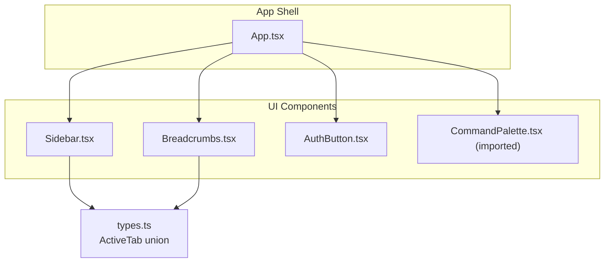
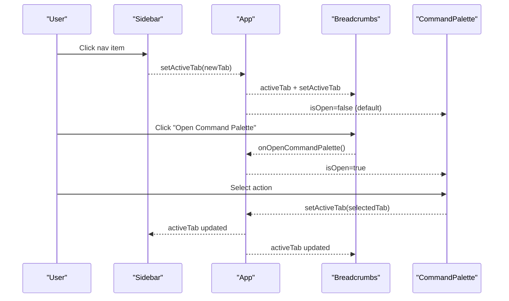
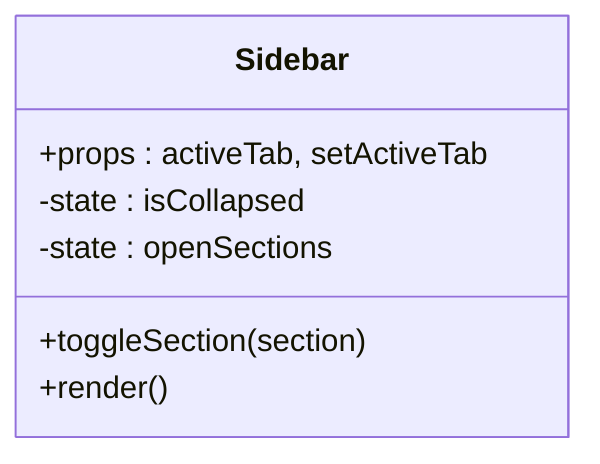
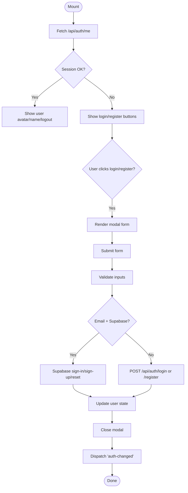
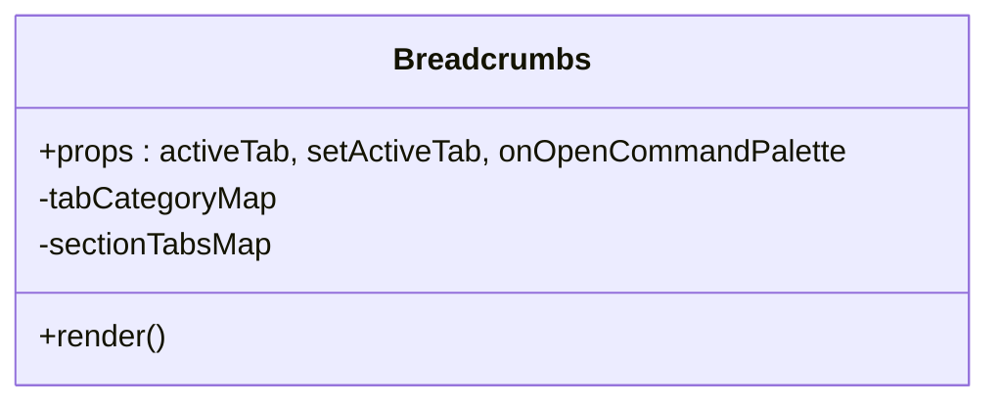
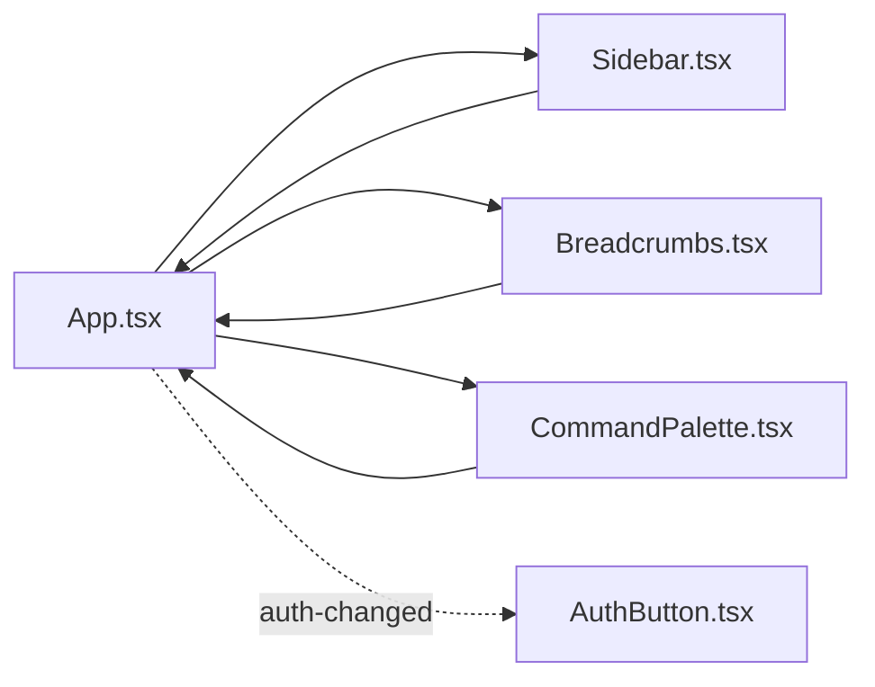

# UI Components System

<cite>
**Referenced Files in This Document**
- [Sidebar.tsx](file://src/components/Sidebar.tsx)
- [AuthButton.tsx](file://src/components/AuthButton.tsx)
- [Breadcrumbs.tsx](file://src/components/Breadcrumbs.tsx)
- [App.tsx](file://src/App.tsx)
- [types.ts](file://src/types.ts)
</cite>

## Table of Contents
1. Introduction
2. Project Structure
3. Core Components
4. Architecture Overview
5. Detailed Component Analysis
6. Dependency Analysis
7. Performance Considerations
8. Troubleshooting Guide
9. Conclusion

## Introduction
This document explains the reusable UI components system with a focus on:
- Sidebar navigation component
- AuthButton authentication interface
- Breadcrumbs navigation helper
- CommandPalette utility (integration points and usage patterns)

It covers component props interfaces, event handling patterns, state management, composition strategies (prop drilling vs context), styling with Tailwind CSS, responsive design, and accessibility considerations. The goal is to make the system approachable for beginners while providing enough technical depth for experienced developers.

## Project Structure
The UI components are organized under src/components and share a common type definition for active tabs. The application shell in App.tsx composes these components and manages global state such as the active tab and command palette visibility.

**Diagram sources**
- [App.tsx:109-173](file://src/App.tsx#L109-L173)
- [Sidebar.tsx:36-52](file://src/components/Sidebar.tsx#L36-L52)
- [Breadcrumbs.tsx:5-14](file://src/components/Breadcrumbs.tsx#L5-L14)
- [types.ts:1-35](file://src/types.ts#L1-L35)

**Section sources**
- [App.tsx:1-177](file://src/App.tsx#L1-L177)
- [types.ts:1-35](file://src/types.ts#L1-L35)

## Core Components
- Sidebar: Collapsible navigation grouped by feature categories; manages its own open/closed sections and collapsed state; communicates tab changes via props.
- Breadcrumbs: Displays current category and label; renders contextual sub-tabs for the active section; optionally opens the command palette.
- AuthButton: Provides login/register/forgot-password flows; supports compact mode; uses Supabase when available or falls back to server endpoints; emits cross-component auth events.
- CommandPalette: Imported and controlled from App.tsx; receives isOpen, onClose, and setActiveTab to navigate via keyboard-driven search.

Key shared types:
- ActiveTab: A union of all navigable screen identifiers used across Sidebar, Breadcrumbs, and App.

**Section sources**
- [Sidebar.tsx:36-52](file://src/components/Sidebar.tsx#L36-L52)
- [Breadcrumbs.tsx:5-14](file://src/components/Breadcrumbs.tsx#L5-L14)
- [AuthButton.tsx:11-13](file://src/components/AuthButton.tsx#L11-L13)
- [App.tsx:43-48](file://src/App.tsx#L43-L48)
- [types.ts:1-35](file://src/types.ts#L1-L35)

## Architecture Overview
The app follows a top-down prop-drilling pattern for navigation state (activeTab) and an optional callback for opening the command palette. Auth state is coordinated via a lightweight window event bus.

**Diagram sources**
- [App.tsx:109-173](file://src/App.tsx#L109-L173)
- [Sidebar.tsx:258-261](file://src/components/Sidebar.tsx#L258-L261)
- [Breadcrumbs.tsx:129-137](file://src/components/Breadcrumbs.tsx#L129-L137)

## Detailed Component Analysis

### Sidebar Navigation Component
Responsibilities:
- Renders categorized navigation groups with icons and optional badges.
- Supports collapse/expand behavior for both the entire sidebar and individual sections.
- Emits tab changes through setActiveTab.

Props and internal state:
- Props: activeTab, setActiveTab
- Internal state: isCollapsed, openSections map keyed by group key

Event handling:
- Section toggle toggles openSections and auto-expands when collapsing.
- Item click calls setActiveTab(item.id).

Styling and responsiveness:
- Uses Tailwind classes for layout, colors, and transitions.
- Collapsed width reduces to icon-only view; labels hidden when collapsed.
- Hidden on small screens via responsive utilities.

Accessibility:
- Buttons with clear labels and titles when collapsed.
- Keyboard-friendly interactions via native button elements.

**Diagram sources**
- [Sidebar.tsx:36-52](file://src/components/Sidebar.tsx#L36-L52)
- [Sidebar.tsx:54-73](file://src/components/Sidebar.tsx#L54-L73)
- [Sidebar.tsx:258-261](file://src/components/Sidebar.tsx#L258-L261)

**Section sources**
- [Sidebar.tsx:36-52](file://src/components/Sidebar.tsx#L36-L52)
- [Sidebar.tsx:54-73](file://src/components/Sidebar.tsx#L54-L73)
- [Sidebar.tsx:172-313](file://src/components/Sidebar.tsx#L172-L313)

### AuthButton Authentication Interface
Responsibilities:
- Presents login, register, and forgot-password flows.
- Detects session via /api/auth/me and listens to auth-changed events.
- Integrates with Supabase when available; otherwise falls back to server endpoints.
- Offers compact mode for inline placement.

Props and internal state:
- Props: compact (boolean)
- Internal state: user, checkingSession, showModal, mode, form fields, loading, error

Event handling:
- handleSignIn validates inputs, routes to Supabase or server endpoints, updates local user, closes modal, and dispatches auth-changed.
- handleSignOut clears local user and dispatches auth-changed.
- useEffect subscribes to auth-changed to refresh session.

Styling and responsiveness:
- Two modes: compact and standard, each with distinct Tailwind styles.
- Modal overlay with backdrop blur and accessible close button.

Accessibility:
- Form labels, required attributes, and visible error messages.
- Focus rings and disabled states for buttons.

**Diagram sources**
- [AuthButton.tsx:28-47](file://src/components/AuthButton.tsx#L28-L47)
- [AuthButton.tsx:62-145](file://src/components/AuthButton.tsx#L62-L145)
- [AuthButton.tsx:147-162](file://src/components/AuthButton.tsx#L147-L162)

**Section sources**
- [AuthButton.tsx:11-13](file://src/components/AuthButton.tsx#L11-L13)
- [AuthButton.tsx:28-47](file://src/components/AuthButton.tsx#L28-L47)
- [AuthButton.tsx:62-145](file://src/components/AuthButton.tsx#L62-L145)
- [AuthButton.tsx:147-162](file://src/components/AuthButton.tsx#L147-L162)
- [AuthButton.tsx:164-280](file://src/components/AuthButton.tsx#L164-L280)
- [AuthButton.tsx:283-328](file://src/components/AuthButton.tsx#L283-L328)
- [AuthButton.tsx:331-383](file://src/components/AuthButton.tsx#L331-L383)

### Breadcrumbs Navigation Helper
Responsibilities:
- Shows current category and label based on activeTab.
- Renders contextual sub-tabs for the active section.
- Optionally exposes a button to open the command palette.

Props:
- activeTab, setActiveTab, onOpenCommandPalette

Data mapping:
- tabCategoryMap maps each ActiveTab to a category and groupKey.
- sectionTabsMap provides sub-tab definitions per groupKey.

Event handling:
- Home button sets activeTab to overview.
- Sub-tab buttons call setActiveTab(sub.id).
- Optional command palette button triggers onOpenCommandPalette.

Styling and responsiveness:
- Horizontal scrollable breadcrumb and sub-tabs with dark/light theme classes.
- Compact text sizes and spacing suitable for dense layouts.

Accessibility:
- Semantic <nav> element.
- Clear visual hierarchy and hover states.

**Diagram sources**
- [Breadcrumbs.tsx:5-14](file://src/components/Breadcrumbs.tsx#L5-L14)
- [Breadcrumbs.tsx:16-54](file://src/components/Breadcrumbs.tsx#L16-L54)
- [Breadcrumbs.tsx:56-99](file://src/components/Breadcrumbs.tsx#L56-L99)
- [Breadcrumbs.tsx:101-166](file://src/components/Breadcrumbs.tsx#L101-L166)

**Section sources**
- [Breadcrumbs.tsx:5-14](file://src/components/Breadcrumbs.tsx#L5-L14)
- [Breadcrumbs.tsx:16-54](file://src/components/Breadcrumbs.tsx#L16-L54)
- [Breadcrumbs.tsx:56-99](file://src/components/Breadcrumbs.tsx#L56-L99)
- [Breadcrumbs.tsx:101-166](file://src/components/Breadcrumbs.tsx#L101-L166)

### CommandPalette Utility (Integration Points)
Usage in App:
- Controlled by isCommandPaletteOpen state.
- Receives isOpen, onClose, and setActiveTab props.
- Triggered from Header and Breadcrumbs via onOpenCommandPalette callbacks.

Behavior expectations:
- Opens a modal-like overlay with a searchable list of actions.
- Selecting an action calls setActiveTab to navigate.
- Closes via onClose callback.

Note: The CommandPalette component file is imported but not present in the analyzed snapshot; integration points are documented here based on usage in App.tsx.

**Section sources**
- [App.tsx:38-48](file://src/App.tsx#L38-L48)
- [App.tsx:121-130](file://src/App.tsx#L121-L130)
- [App.tsx:168-172](file://src/App.tsx#L168-L172)

## Dependency Analysis
Component relationships and data flow:
- App owns activeTab and command palette state; passes setActiveTab down to Sidebar and Breadcrumbs.
- Sidebar and Breadcrumbs update activeTab via callbacks.
- AuthButton coordinates with App via a custom window event for auth changes.
- CommandPalette is controlled by App and updates activeTab upon selection.

**Diagram sources**
- [App.tsx:109-173](file://src/App.tsx#L109-L173)
- [AuthButton.tsx:49-60](file://src/components/AuthButton.tsx#L49-L60)

**Section sources**
- [App.tsx:109-173](file://src/App.tsx#L109-L173)
- [AuthButton.tsx:49-60](file://src/components/AuthButton.tsx#L49-L60)

## Performance Considerations
- Sidebar: Rendering many items is efficient due to simple button lists; consider memoization if groups grow significantly.
- Breadcrumbs: Minimal re-renders; mappings are static objects.
- AuthButton: Avoid unnecessary re-renders by keeping form state local; ensure fetch calls are debounced if needed during rapid interactions.
- Global state: Using prop drilling keeps components decoupled; consider React Context only if many components need auth or theme state.

[No sources needed since this section provides general guidance]

## Troubleshooting Guide
Common issues and resolutions:
- Auth state not updating across components: Ensure the auth-changed event is dispatched after successful login/logout. Verify listeners are attached in both App and AuthButton.
- Command palette not opening: Confirm onOpenCommandPalette is passed from App to Breadcrumbs/Header and that setIsCommandPaletteOpen(true) is called.
- Sidebar navigation not switching tabs: Verify setActiveTab is correctly wired and that activeTab matches one of the ActiveTab union values.
- Responsive display problems: Check Tailwind breakpoints and ensure hidden/md:flex patterns are applied consistently.

**Section sources**
- [AuthButton.tsx:49-60](file://src/components/AuthButton.tsx#L49-L60)
- [App.tsx:79-88](file://src/App.tsx#L79-L88)
- [App.tsx:121-130](file://src/App.tsx#L121-L130)

## Conclusion
The UI components system centers around a clean separation of concerns:
- Sidebar handles navigation structure and collapsibility.
- Breadcrumbs provides contextual navigation and quick access to the command palette.
- AuthButton encapsulates authentication flows with robust fallbacks and cross-component synchronization.
- CommandPalette is integrated at the app level to offer keyboard-driven navigation.

This architecture balances simplicity (prop drilling) with flexibility (event-based auth sync), making it easy to extend and maintain while delivering a responsive, accessible experience.