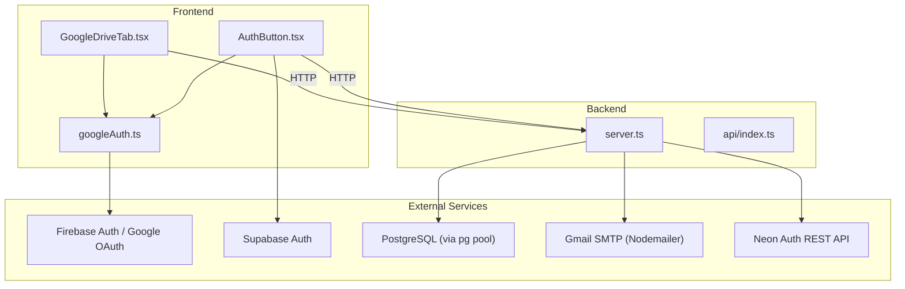
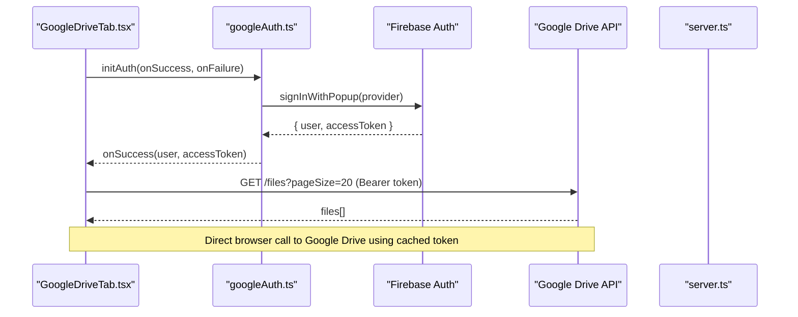
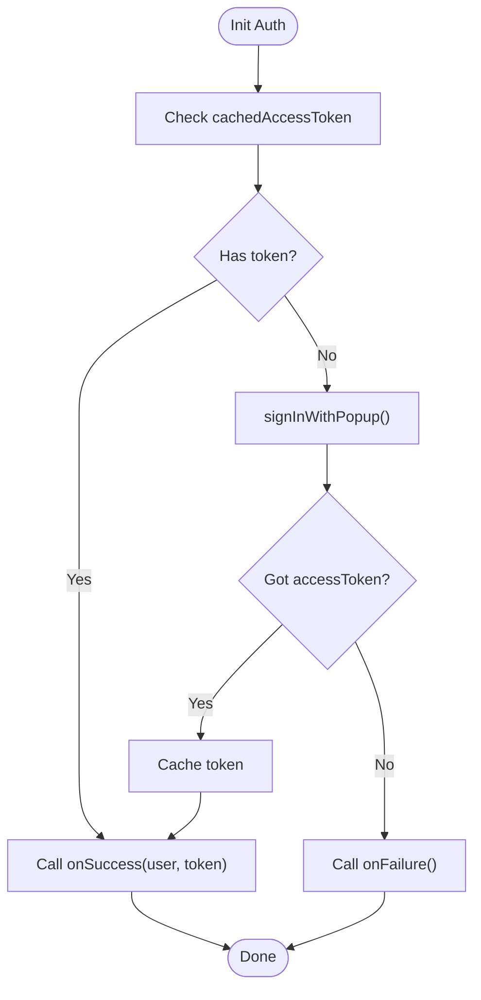
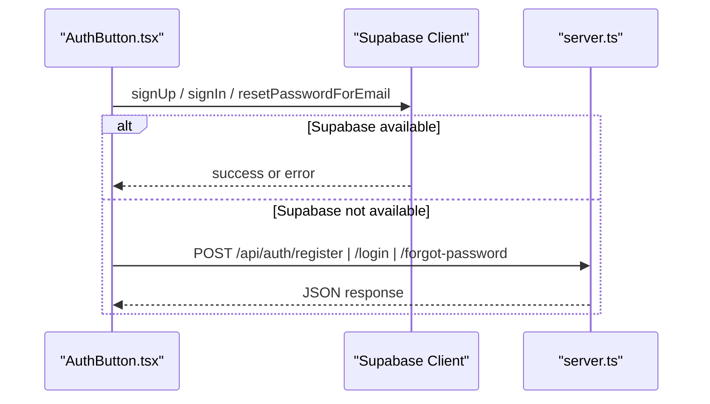
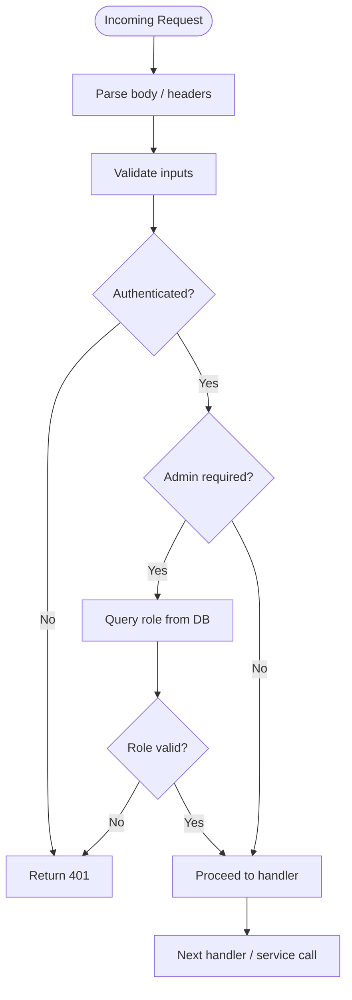
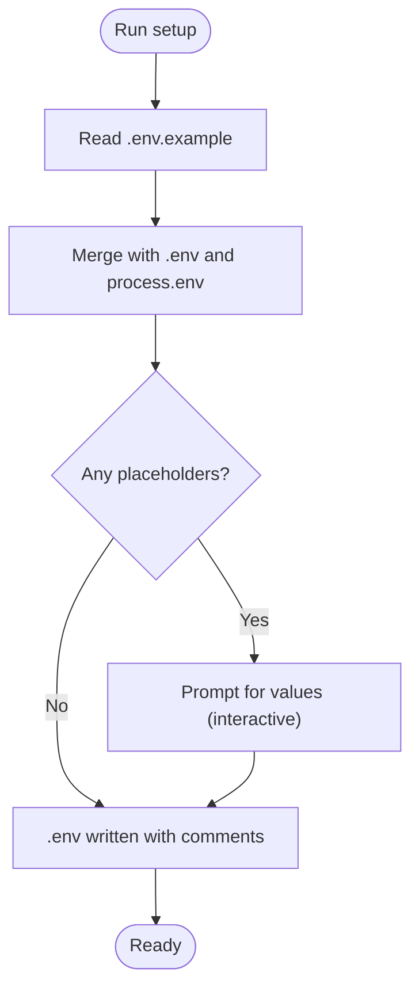

# System Integration

<cite>
**Referenced Files in This Document**
- [googleAuth.ts](file://src/lib/googleAuth.ts)
- [GoogleDriveTab.tsx](file://src/components/GoogleDriveTab.tsx)
- [server.ts](file://server.ts)
- [api/index.ts](file://api/index.ts)
- [package.json](file://package.json)
- [setup-env.js](file://scripts/setup-env.js)
- [generate-env.mjs](file://scripts/generate-env.mjs)
- [base.ts](file://src/agents/base.ts)
- [AuthButton.tsx](file://src/components/AuthButton.tsx)
</cite>

## Table of Contents
1. [Introduction](#introduction)
2. [Project Structure](#project-structure)
3. [Core Components](#core-components)
4. [Architecture Overview](#architecture-overview)
5. [Detailed Component Analysis](#detailed-component-analysis)
6. [Dependency Analysis](#dependency-analysis)
7. [Performance Considerations](#performance-considerations)
8. [Troubleshooting Guide](#troubleshooting-guide)
9. [Conclusion](#conclusion)
10. [Appendices](#appendices)

## Introduction
This document explains how the application integrates with third-party services and coordinates internal modules. It focuses on:
- Google Authentication via Firebase for user sign-in and token management
- Supabase connectivity patterns for authentication and data access
- External API orchestration across server endpoints, agent tasks, and downstream providers
- Environment variable management and configuration strategies
- Error handling, retry logic, and fallback strategies for resilient integrations

The content is structured to be accessible to beginners while providing technical depth for experienced developers.

## Project Structure
At a high level, integration points are split between the frontend (React components and libraries) and the backend (Express server). The server centralizes environment-driven configuration, session management, database pooling, and external API calls. Frontend components coordinate with both local APIs and third-party SDKs.



**Diagram sources**
- [GoogleDriveTab.tsx:1-104](file://src/components/GoogleDriveTab.tsx#L1-L104)
- [AuthButton.tsx:1-384](file://src/components/AuthButton.tsx#L1-L384)
- [googleAuth.ts:1-60](file://src/lib/googleAuth.ts#L1-L60)
- [server.ts:1-800](file://server.ts#L1-L800)
- [api/index.ts:1-5](file://api/index.ts#L1-L5)

**Section sources**
- [server.ts:1-126](file://server.ts#L1-L126)
- [package.json:1-64](file://package.json#L1-L64)

## Core Components
- Google Authentication library: initializes Firebase, manages Google OAuth provider, caches access tokens, and exposes login/logout helpers.
- Google Drive UI tab: orchestrates sign-in, token retrieval, and direct calls to Google Drive API using the cached access token.
- Server-side Express app: configures sessions, PostgreSQL pool, email transport, and provides auth endpoints with fallbacks to Neon Auth or local bcrypt-based auth.
- Agent base class: implements task lifecycle and retry/backoff when calling internal agent APIs.
- Auth button component: supports Supabase auth flow with fallback to server endpoints; handles forgot-password flows through either Supabase or server.

Key responsibilities:
- Centralized environment-driven configuration for all integrations
- Graceful fallbacks when optional services are unavailable
- Consistent error handling and logging across layers
- Secure session management and role checks

**Section sources**
- [googleAuth.ts:1-60](file://src/lib/googleAuth.ts#L1-L60)
- [GoogleDriveTab.tsx:1-104](file://src/components/GoogleDriveTab.tsx#L1-L104)
- [server.ts:1-800](file://server.ts#L1-L800)
- [base.ts:53-126](file://src/agents/base.ts#L53-L126)
- [AuthButton.tsx:1-384](file://src/components/AuthButton.tsx#L1-L384)

## Architecture Overview
The system uses a hybrid authentication strategy:
- Frontend can use Supabase Auth directly when configured; otherwise it falls back to server-side endpoints.
- Google OAuth via Firebase is used for Google Drive access and identity.
- The server maintains sessions and can integrate with Neon Auth as an identity provider, falling back to local bcrypt if needed.
- Database operations use a pooled PostgreSQL client; email delivery uses Nodemailer with Gmail SMTP.



**Diagram sources**
- [GoogleDriveTab.tsx:1-104](file://src/components/GoogleDriveTab.tsx#L1-L104)
- [googleAuth.ts:1-60](file://src/lib/googleAuth.ts#L1-L60)

**Section sources**
- [server.ts:1-126](file://server.ts#L1-L126)

## Detailed Component Analysis

### Google Authentication Integration
- Initialization: Firebase app is initialized once; a GoogleAuthProvider is created with Drive scope.
- Sign-in: Popup flow returns a user and access token; token is cached for subsequent API calls.
- Token retrieval: Cached token is exposed to callers; logout clears state and signs out from Firebase.
- Error handling: Errors during sign-in are logged and rethrown; UI components handle failures gracefully.



**Diagram sources**
- [googleAuth.ts:1-60](file://src/lib/googleAuth.ts#L1-L60)

**Section sources**
- [googleAuth.ts:1-60](file://src/lib/googleAuth.ts#L1-L60)
- [GoogleDriveTab.tsx:1-104](file://src/components/GoogleDriveTab.tsx#L1-L104)

### Supabase Connectivity Patterns
- Conditional initialization: The UI checks for a Supabase client before attempting Supabase-specific flows.
- Auth flow: When available, Supabase handles sign-up/sign-in/reset-password; otherwise, server endpoints are used.
- Fallback behavior: If Supabase is not configured, the component falls back to server-side registration/login endpoints.



**Diagram sources**
- [AuthButton.tsx:1-384](file://src/components/AuthButton.tsx#L1-L384)
- [server.ts:1-800](file://server.ts#L1-L800)

**Section sources**
- [AuthButton.tsx:1-384](file://src/components/AuthButton.tsx#L1-L384)

### External API Orchestration Patterns
- Typed fetch wrapper: A casted fetch function avoids type conflicts and standardizes responses.
- Session middleware: Express-session with Postgres-backed store ensures persistent sessions.
- Role enforcement: Admin checks query the database per request to enforce current roles.
- Email sending: Nodemailer transport is created conditionally based on SMTP credentials.



**Diagram sources**
- [server.ts:1-800](file://server.ts#L1-L800)

**Section sources**
- [server.ts:1-800](file://server.ts#L1-L800)

### Environment Variable Management and Configuration Strategies
- Two scripts manage .env generation:
  - Interactive setup script reads .env.example, merges with existing .env and system env, and writes annotated .env file.
  - Non-interactive generator populates defaults and secrets where possible.
- Key variables include database URLs, session secret, CRM internal token, SMTP credentials, and third-party API keys.
- Runtime usage:
  - Server loads dotenv at startup and reads process.env for configuration.
  - Components rely on runtime availability (e.g., Supabase client presence).



**Diagram sources**
- [setup-env.js:1-260](file://scripts/setup-env.js#L1-L260)
- [generate-env.mjs:1-73](file://scripts/generate-env.mjs#L1-L73)

**Section sources**
- [setup-env.js:1-260](file://scripts/setup-env.js#L1-L260)
- [generate-env.mjs:1-73](file://scripts/generate-env.mjs#L1-L73)
- [server.ts:1-126](file://server.ts#L1-L126)

### Service Discovery Mechanisms
- No explicit service discovery registry is present. Instead, the app uses:
  - Environment variables to configure endpoints and credentials
  - Conditional checks to enable/disable features (e.g., Supabase client presence)
  - Fallback paths in code (e.g., server-side auth vs. Supabase)

Practical implications:
- Ensure all required environment variables are set before deployment
- Use feature flags or runtime checks to gracefully degrade functionality

**Section sources**
- [AuthButton.tsx:1-384](file://src/components/AuthButton.tsx#L1-L384)
- [server.ts:1-800](file://server.ts#L1-L800)

### Error Handling Patterns for External Dependencies
- Frontend:
  - Google sign-in errors are caught and logged; UI shows failure states.
  - Supabase calls throw errors that are surfaced to users; fallback to server endpoints when client is missing.
- Backend:
  - HTTP wrappers parse non-JSON bodies safely and propagate status codes.
  - Session creation includes timeout guards to avoid hanging responses.
  - Admin role checks catch DB errors and return safe messages.
  - Email sending validates configuration and throws descriptive errors.

Retry logic and fallback strategies:
- Agent base class implements exponential backoff retries for internal API calls.
- Auth flows support multiple providers (Supabase, Neon Auth, local bcrypt) with clear fallbacks.

**Section sources**
- [googleAuth.ts:1-60](file://src/lib/googleAuth.ts#L1-L60)
- [AuthButton.tsx:1-384](file://src/components/AuthButton.tsx#L1-L384)
- [server.ts:1-800](file://server.ts#L1-L800)
- [base.ts:53-126](file://src/agents/base.ts#L53-L126)

## Dependency Analysis
The project’s dependencies reflect its integration surface:
- Firebase for Google OAuth and auth state
- Supabase JS packages for client-side auth and SSR utilities
- Express and session storage backed by PostgreSQL
- Nodemailer for email delivery
- Apify client and other third-party SDKs referenced in package manifests

```mermaid
graph LR
Pkg["package.json"] --> FB["firebase"]
Pkg --> SB["@supabase/ssr", "@supabase/supabase-js"]
Pkg --> EXP["express", "express-session", "connect-pg-simple"]
Pkg --> PG["pg"]
Pkg --> NM["nodemailer"]
Pkg --> AP["apify-client"]
```

**Diagram sources**
- [package.json:1-64](file://package.json#L1-L64)

**Section sources**
- [package.json:1-64](file://package.json#L1-L64)

## Performance Considerations
- Database pooling: Use connection pooling to handle concurrent requests efficiently.
- Session persistence: Postgres-backed sessions scale better than in-memory stores under load.
- External API calls: Minimize round-trips by caching tokens and batching requests where possible.
- Retry/backoff: Implement exponential backoff for transient failures to reduce load spikes.

[No sources needed since this section provides general guidance]

## Troubleshooting Guide
Common issues and resolutions:
- Missing Supabase client: Ensure SUPABASE_URL and related variables are set; the UI will fall back to server endpoints if absent.
- SMTP misconfiguration: Verify SMTP_USER and SMTP_PASS; email sending will fail closed with a descriptive error.
- Session timeouts: The server includes a timeout guard to prevent hanging responses during session save.
- Google OAuth failures: Check Firebase configuration and scopes; ensure Drive scope is granted.

Operational tips:
- Use the interactive setup script to validate and fill missing environment variables.
- Monitor logs for error messages around auth, DB queries, and email sending.

**Section sources**
- [server.ts:1-800](file://server.ts#L1-L800)
- [setup-env.js:1-260](file://scripts/setup-env.js#L1-L260)

## Conclusion
The system integrates multiple third-party services through a robust, environment-driven configuration model. It employs conditional feature activation, fallback strategies, and consistent error handling to maintain reliability. For production deployments, ensure all required credentials are configured, sessions are persisted securely, and external API calls are resilient with retries and timeouts.

[No sources needed since this section summarizes without analyzing specific files]

## Appendices

### Practical Examples
- Configure Google OAuth:
  - Initialize Firebase and add Drive scope
  - Use popup sign-in to obtain access token
  - Pass token to Google Drive API calls
- Set up Supabase auth:
  - Provide SUPABASE_URL and anon key
  - Use client methods for sign-up/sign-in/reset-password
  - Fall back to server endpoints if client is unavailable
- Handle external API errors:
  - Wrap fetch calls with typed wrapper
  - Parse responses safely and map status codes
  - Log errors and return user-friendly messages

[No sources needed since this section provides general guidance]