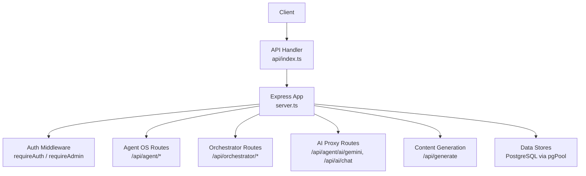
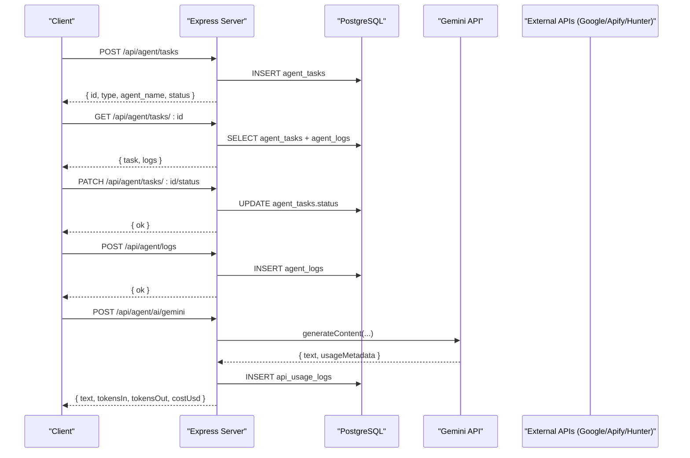
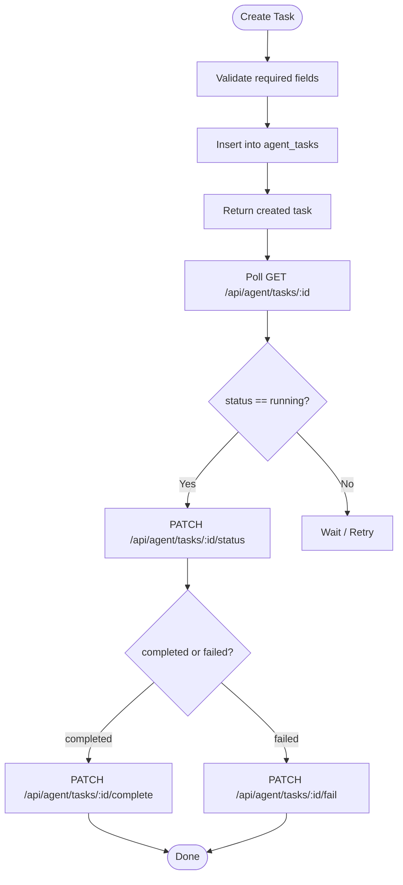
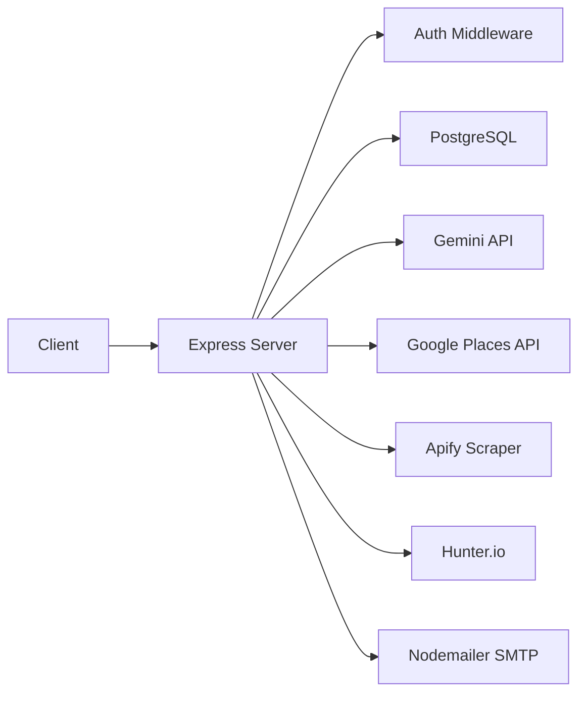

# AI Agent Endpoints

<cite>
**Referenced Files in This Document**
- [server.ts](file://server.ts)
- [index.ts](file://api/index.ts)
- [types.ts](file://src/agents/types.ts)
- [index.ts](file://src/agents/index.ts)
</cite>

## Table of Contents
1. Introduction
2. Project Structure
3. Core Components
4. Architecture Overview
5. Detailed Component Analysis
6. Dependency Analysis
7. Performance Considerations
8. Troubleshooting Guide
9. Conclusion
10. Appendices

## Introduction
This document provides comprehensive API documentation for the AI agent orchestration endpoints exposed by the application server. It covers task creation for orchestrator, prospector, and enricher agents; task status monitoring; agent-specific endpoints for lead analysis, content generation, and marketing automation; error handling strategies for AI service failures; rate limiting considerations; and result caching strategies. It also includes common workflow patterns and integration scenarios to help you build robust integrations.

## Project Structure
The API surface is implemented as an Express application with typed routes and middleware for authentication, authorization, and cross-cutting concerns. The entry point exports a handler that delegates requests to the Express app instance.

**Diagram sources**
- [index.ts:1-5](file://api/index.ts#L1-L5)
- [server.ts:1-120](file://server.ts#L1-L120)

**Section sources**
- [index.ts:1-5](file://api/index.ts#L1-L5)
- [server.ts:1-120](file://server.ts#L1-L120)

## Core Components
- Agent Task Model: Defines tasks, logs, statuses, and types used across the system.
- Orchestrator Plan: Describes multi-step plans with dependencies and inputs.
- System Status and Metrics: Aggregates active/pending tasks, costs, tokens, and recent logs.
- Data Entities: Companies, enriched leads, proposals, campaigns, campaign emails, conversations, and ICP profiles.

Key types and structures are defined centrally and reused by routes and runners.

**Section sources**
- [types.ts:1-181](file://src/agents/types.ts#L1-L181)
- [index.ts:1-28](file://src/agents/index.ts#L1-L28)

## Architecture Overview
The server exposes REST endpoints for:
- Agent task lifecycle management (create, list, get, update status, complete/fail).
- Logging and usage tracking per task and per API call.
- Orchestration planning and live system status/metrics.
- AI proxying to Gemini for text and image generation with fallbacks.
- Content generation actions (industry copy, chatbot answers, SEO, social posts, repurposing).
- Prospecting and enrichment runners using Google Places/Apify and Hunter.io.
- CRM-like entities (companies, leads, proposals, campaigns, conversations).

**Diagram sources**
- [server.ts:3889-3906](file://server.ts#L3889-L3906)
- [server.ts:3909-3931](file://server.ts#L3909-L3931)
- [server.ts:3934-3947](file://server.ts#L3934-L3947)
- [server.ts:3950-3964](file://server.ts#L3950-L3964)
- [server.ts:3967-3980](file://server.ts#L3967-L3980)
- [server.ts:3983-3996](file://server.ts#L3983-L3996)
- [server.ts:4001-4015](file://server.ts#L4001-L4015)
- [server.ts:4057-4099](file://server.ts#L4057-L4099)

## Detailed Component Analysis

### Agent Tasks API
- Create Task
  - Endpoint: POST /api/agent/tasks
  - Auth: None (public write; intended for internal runners or authenticated clients)
  - Request body:
    - id: string (optional UUID)
    - type: TaskType (e.g., prospect_companies, enrich_lead, analyze_website, generate_proposal, generate_copy, run_campaign, follow_up_lead, score_lead, respond_conversation, build_icp, orchestrate)
    - agent_name: AgentName (orchestrator, strategist, prospector, enricher, web_analyst, proposal_generator, copywriter, campaign_runner, follow_up, conversation, scoring, observability)
    - input: Record<string, unknown>
    - parent_task_id: string (optional)
    - max_retries: number (default 2)
  - Response: Created task fields (id, type, agent_name, status, created_at)
- List Tasks
  - Endpoint: GET /api/agent/tasks
  - Query params: status, agent, limit (max 200), offset
  - Response: { tasks[], total }
- Get Task with Logs
  - Endpoint: GET /api/agent/tasks/:id
  - Response: { task, logs[] }
- Update Status
  - Endpoint: PATCH /api/agent/tasks/:id/status
  - Body: { status } (pending | running | completed | failed | retrying | cancelled)
  - Behavior: Sets started_at when status=running
- Complete Task
  - Endpoint: PATCH /api/agent/tasks/:id/complete
  - Body: { output, tokens_used, cost_usd, duration_ms }
- Fail Task
  - Endpoint: PATCH /api/agent/tasks/:id/fail
  - Body: { error, duration_ms }

**Diagram sources**
- [server.ts:3889-3906](file://server.ts#L3889-L3906)
- [server.ts:3909-3931](file://server.ts#L3909-L3931)
- [server.ts:3934-3947](file://server.ts#L3934-L3947)
- [server.ts:3950-3964](file://server.ts#L3950-L3964)
- [server.ts:3967-3980](file://server.ts#L3967-L3980)
- [server.ts:3983-3996](file://server.ts#L3983-L3996)

**Section sources**
- [server.ts:3889-3906](file://server.ts#L3889-L3906)
- [server.ts:3909-3931](file://server.ts#L3909-L3931)
- [server.ts:3934-3947](file://server.ts#L3934-L3947)
- [server.ts:3950-3964](file://server.ts#L3950-L3964)
- [server.ts:3967-3980](file://server.ts#L3967-L3980)
- [server.ts:3983-3996](file://server.ts#L3983-L3996)
- [types.ts:19-31](file://src/agents/types.ts#L19-L31)

### Agent Logs and Usage Tracking
- Log Action
  - Endpoint: POST /api/agent/logs
  - Body: { task_id?, agent_name, action, detail?, tokens_in?, tokens_out?, api_used?, cost_usd?, duration_ms? }
- Recent Logs
  - Endpoint: GET /api/agent/logs
  - Query: task_id?, agent?, limit (max 500)
- API Usage
  - Endpoint: POST /api/agent/api-usage
  - Body: { apiName|api_name, endpoint?, cost_usd?, tokens_in?, tokens_out? }

**Section sources**
- [server.ts:4001-4015](file://server.ts#L4001-L4015)
- [server.ts:4018-4034](file://server.ts#L4018-L4034)
- [server.ts:4039-4052](file://server.ts#L4039-L4052)

### Orchestrator Planning and Status
- Save Plan
  - Endpoint: POST /api/orchestrator/plans
  - Body: { objective, plan? }
- Live Status
  - Endpoint: GET /api/orchestrator/status
  - Response: { active_tasks, pending_tasks, failed_tasks_24h, completed_tasks_24h, agents_running, total_cost_usd_24h, total_tokens_24h, api_usage[], recent_logs[] }
- Historical Metrics
  - Endpoint: GET /api/orchestrator/metrics
  - Query: period (7d | 24h | 30d)
  - Response: { task_metrics[], cost_metrics[], period }

**Section sources**
- [server.ts:4171-4184](file://server.ts#L4171-L4184)
- [server.ts:4187-4234](file://server.ts#L4187-L4234)
- [server.ts:4237-4270](file://server.ts#L4237-L4270)

### AI Proxy and Chat
- Gemini Proxy
  - Endpoint: POST /api/agent/ai/gemini
  - Body: { prompt, model?, system_prompt? }
  - Response: { text, tokensIn, tokensOut, costUsd }
- Multi-turn Chat
  - Endpoint: POST /api/ai/chat
  - Body: { messages[], model?, systemInstruction? }
  - Response: { success, reply }

Fallback behavior:
- If primary key missing or quota exceeded, tries secondary key or free fallback.
- Returns structured fallback responses for JSON prompts when needed.

**Section sources**
- [server.ts:4057-4099](file://server.ts#L4057-L4099)
- [server.ts:4102-4166](file://server.ts#L4102-L4166)

### Content Generation (/api/generate)
Common actions include:
- validateGooglePlacesKey
- generateIndustryCopy
- assistantChat
- chatbotAnswer
- optimizeCopy
- translateBrochure
- prospectLeads
- buildICP
- researchProspect
- generateOutreach
- salesAdvisorAnswer
- generateImage
- generateSEOAudit
- generateSEOKeywords
- generateSocialPost
- repurposeContent

Authorization:
- Some actions require admin role; others require user session; some are public.

Response shape:
- Most return { result: ... }, sometimes with isFallback flag.

**Section sources**
- [server.ts:2262-3241](file://server.ts#L2262-L3241)

### Prospecting and Enrichment Runners
- Prospect Runner
  - Endpoint: POST /api/agent/run/prospect
  - Body: { industry, city, country?, limit?, source? }
  - Behavior: Uses Google Places or Apify based on configuration; upserts companies; returns counts and IDs.
- Enrich Runner
  - Endpoint: POST /api/agent/run/enrich
  - Body: { company_id, company_name?, website?, domain?, city?, industry? }
  - Behavior: Hunter.io domain search, optional Firecrawl scrape, Gemini pain-point inference; upserts leads_enriched.

**Section sources**
- [server.ts:4305-4392](file://server.ts#L4305-L4392)
- [server.ts:4395-4525](file://server.ts#L4395-L4525)

### CRM-like Entities
- Companies
  - GET /api/companies (filters: status, industry, city; pagination)
  - POST /api/companies
  - GET /api/companies/:id
  - PATCH /api/companies/:id
- Leads Enriched
  - GET /api/leads-enriched (filter by company_id)
  - PATCH /api/leads-enriched/:id
  - POST /api/leads-enriched
- Proposals
  - GET /api/proposals (filters: company_id, status)
  - POST /api/proposals
- Campaigns
  - GET /api/campaigns
  - POST /api/campaigns
  - PATCH /api/campaigns/:id
  - DELETE /api/campaigns/:id

**Section sources**
- [server.ts:4530-4581](file://server.ts#L4530-L4581)
- [server.ts:4584-4595](file://server.ts#L4584-L4595)
- [server.ts:4598-4621](file://server.ts#L4598-L4621)
- [server.ts:4626-4642](file://server.ts#L4626-L4642)
- [server.ts:4645-4674](file://server.ts#L4645-L4674)
- [server.ts:4677-4691](file://server.ts#L4677-L4691)
- [server.ts:4696-4714](file://server.ts#L4696-L4714)
- [server.ts:4717-4730](file://server.ts#L4717-L4730)
- [server.ts:4735-4745](file://server.ts#L4735-L4745)
- [server.ts:4748-4761](file://server.ts#L4748-L4761)
- [server.ts:4764-4787](file://server.ts#L4764-L4787)
- [server.ts:4790-4797](file://server.ts#L4790-L4797)

### Pipeline Funnel
- Endpoint: GET /api/pipeline/funnel
- Response: { companies, leads_enriched, proposals_sent, campaigns_active, emails_sent, replies }

**Section sources**
- [server.ts:4275-4297](file://server.ts#L4275-L4297)

## Dependency Analysis
- Authentication and Authorization
  - requireAuth: validates session userId.
  - requireAdmin: checks current role from DB.
  - requireApiKey / requireCrmToken: server-to-server auth for external integrations.
- External Integrations
  - Google GenAI SDK for text/image generation with fallback models and retries.
  - Google Places API and Apify scrapers for prospect discovery.
  - Hunter.io for contact enrichment.
  - Nodemailer for password reset emails.
- Database
  - PostgreSQL pool with schema initialization for users, sessions, agent OS tables, LMS, WhatsApp, chatbot leads, etc.

**Diagram sources**
- [server.ts:209-264](file://server.ts#L209-L264)
- [server.ts:854-878](file://server.ts#L854-L878)
- [server.ts:1636-1728](file://server.ts#L1636-L1728)
- [server.ts:1731-1909](file://server.ts#L1731-L1909)
- [server.ts:1913-1959](file://server.ts#L1913-L1959)
- [server.ts:133-143](file://server.ts#L133-L143)

**Section sources**
- [server.ts:209-264](file://server.ts#L209-L264)
- [server.ts:854-878](file://server.ts#L854-L878)
- [server.ts:1636-1728](file://server.ts#L1636-L1728)
- [server.ts:1731-1909](file://server.ts#L1731-L1909)
- [server.ts:1913-1959](file://server.ts#L1913-L1959)
- [server.ts:133-143](file://server.ts#L133-L143)

## Performance Considerations
- AI Service Resilience
  - Multiple model attempts with exponential backoff for transient errors.
  - Quota exhaustion triggers immediate model switch.
  - Structured local fallbacks ensure consistent JSON outputs when AI is unavailable.
- Rate Limiting
  - No built-in rate limiter is present at the API layer. Implement a gateway-level or middleware-based rate limiter if needed.
- Caching Strategies
  - Results are persisted to PostgreSQL (tasks, logs, entities). For read-heavy endpoints, consider Redis caching for orchestrator status and funnel metrics.
  - Cache expensive AI-generated assets (images, brochures) keyed by input hash.
- Concurrency and Backpressure
  - Use async queues for long-running runners (prospect/enrich) to avoid blocking HTTP handlers.
- Database Indexes
  - Ensure indexes on frequently filtered columns (status, agent_name, created_at) are present as initialized by schema.

[No sources needed since this section provides general guidance]

## Troubleshooting Guide
- Common Errors
  - Unauthorized: Missing or invalid session/API key/CRM token.
  - Validation Errors: Missing required fields in request bodies.
  - AI Quota/Rate Limits: 429 or RESOURCE_EXHAUSTED; handled via fallbacks.
  - External API Failures: Google Places/Apify/Hunter timeouts or errors; route falls back to simulated data or alternative sources.
- Debugging Steps
  - Check agent logs via GET /api/agent/logs and GET /api/agent/tasks/:id.
  - Inspect orchestrator status and metrics for overall health.
  - Verify environment variables for API keys (GEMINI_API_KEY, GOOGLE_MAPS_PLATFORM_KEY, APIFY_API_TOKEN, HUNTER_API_KEY, SMTP_*).
- Recovery Patterns
  - Retries are configured per task (max_retries).
  - Fallback generators provide deterministic results when AI is down.

**Section sources**
- [server.ts:209-264](file://server.ts#L209-L264)
- [server.ts:881-971](file://server.ts#L881-L971)
- [server.ts:1636-1728](file://server.ts#L1636-L1728)
- [server.ts:1731-1909](file://server.ts#L1731-L1909)
- [server.ts:1913-1959](file://server.ts#L1913-L1959)

## Conclusion
The API provides a robust foundation for AI-driven agent orchestration, including task lifecycle management, logging, orchestration planning, and rich content generation capabilities. With resilient AI fallbacks, clear status monitoring, and extensible entity models, it supports end-to-end workflows from prospecting through outreach and campaign execution. Adopt rate limiting and caching where appropriate to scale reliably.

[No sources needed since this section summarizes without analyzing specific files]

## Appendices

### Request Schema Reference (Selected)
- Agent Task Creation
  - Fields: id?, type, agent_name, input, parent_task_id?, max_retries?
- Task Status Update
  - Fields: status
- Task Completion/Failure
  - Completion: output?, tokens_used?, cost_usd?, duration_ms?
  - Failure: error?, duration_ms?
- AI Proxy
  - Gemini: prompt, model?, system_prompt?
  - Chat: messages[], model?, systemInstruction?
- Content Generation
  - Varies by action; see /api/generate action handlers.

**Section sources**
- [server.ts:3889-3906](file://server.ts#L3889-L3906)
- [server.ts:3950-3964](file://server.ts#L3950-L3964)
- [server.ts:3967-3980](file://server.ts#L3967-L3980)
- [server.ts:3983-3996](file://server.ts#L3983-L3996)
- [server.ts:4057-4099](file://server.ts#L4057-L4099)
- [server.ts:4102-4166](file://server.ts#L4102-L4166)
- [server.ts:2262-3241](file://server.ts#L2262-L3241)

### Example Workflow Patterns
- Lead Generation and Enrichment
  - Create a prospect task → run prospect runner → enrich contacts → score leads → create proposal → launch campaign.
- Content Generation Pipeline
  - Generate industry copy → optimize copy → translate brochure → generate images → publish social posts.
- Monitoring and Observability
  - Poll task status → fetch logs → aggregate orchestrator metrics → track API usage and costs.

[No sources needed since this section doesn't analyze specific files]