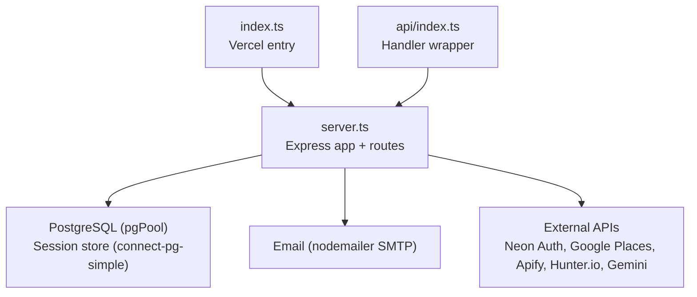
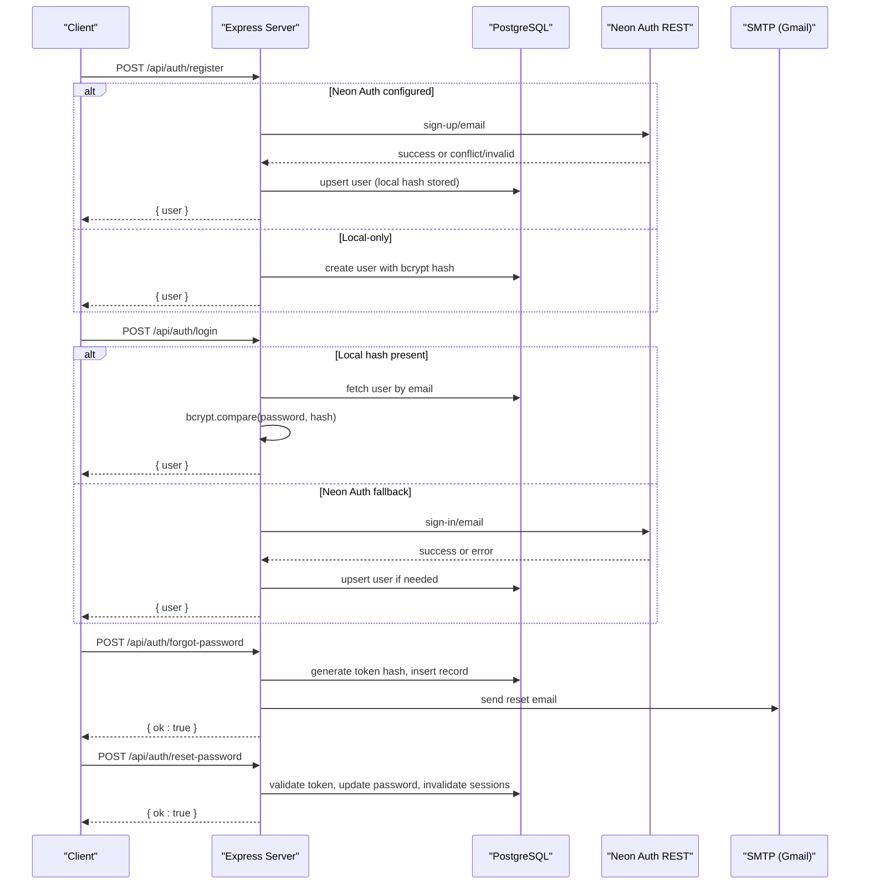
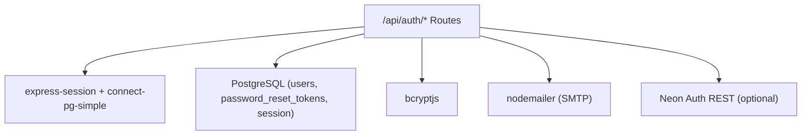

# API Endpoints

<cite>
**Referenced Files in This Document**
- [server.ts](file://server.ts)
- [index.ts](file://index.ts)
- [api/index.ts](file://api/index.ts)
</cite>

## Table of Contents
1. [Introduction](#introduction)
2. [Project Structure](#project-structure)
3. [Core Components](#core-components)
4. [Architecture Overview](#architecture-overview)
5. [Detailed Component Analysis](#detailed-component-analysis)
6. [Dependency Analysis](#dependency-analysis)
7. [Performance Considerations](#performance-considerations)
8. [Troubleshooting Guide](#troubleshooting-guide)
9. [Conclusion](#conclusion)

## Introduction
This document provides comprehensive API endpoint documentation for the Express server, focusing on authentication endpoints under /api/auth/*. It covers request/response schemas, parameter validation, error formats, session management, and security measures. It also explains how the server is exposed via a Vercel-compatible handler and outlines integration guidelines for client applications.

## Project Structure
The Express application is defined in server.ts and exported through index.ts for Vercel serverless deployment. The api/index.ts file re-exports the app as a handler function.

**Diagram sources**
- [index.ts:1-20](file://index.ts#L1-L20)
- [api/index.ts:1-5](file://api/index.ts#L1-L5)
- [server.ts:1-130](file://server.ts#L1-L130)

**Section sources**
- [index.ts:1-20](file://index.ts#L1-L20)
- [api/index.ts:1-5](file://api/index.ts#L1-L5)
- [server.ts:1-130](file://server.ts#L1-L130)

## Core Components
- Authentication middleware:
  - requireAuth: ensures a valid session exists.
  - requireAdmin: validates admin role by querying the database on each request.
  - requireApiKey: server-to-server key check via x-api-key header.
  - requireCrmToken: webhook auth via x-crm-token header.
- Session management:
  - express-session with PostgreSQL-backed store (connect-pg-simple).
  - Cookie configuration: httpOnly, secure in production, SameSite lax, 7-day maxAge.
- Database:
  - pg Pool configured from DATABASE_URL; mock pool fallback when not configured.
- Email:
  - nodemailer transport using Gmail SMTP for password reset emails.

**Section sources**
- [server.ts:99-125](file://server.ts#L99-L125)
- [server.ts:209-235](file://server.ts#L209-L235)
- [server.ts:240-264](file://server.ts#L240-L264)
- [server.ts:133-143](file://server.ts#L133-L143)

## Architecture Overview
Authentication flows support two modes:
- Local bcrypt-based auth (username/email + password).
- Neon Auth integration (email/password), with local bcrypt fallback for unverified email scenarios.

**Diagram sources**
- [server.ts:266-338](file://server.ts#L266-L338)
- [server.ts:340-381](file://server.ts#L340-L381)
- [server.ts:594-680](file://server.ts#L594-L680)
- [server.ts:683-748](file://server.ts#L683-L748)
- [server.ts:753-791](file://server.ts#L753-L791)
- [server.ts:795-830](file://server.ts#L795-L830)

## Detailed Component Analysis

### Authentication Endpoints (/api/auth/*)

#### POST /api/auth/register
- Purpose: Create a new account and start a session. Accepts username or email.
- Request body:
  - username: string (3–64 chars; letters, numbers, . _ - @; or valid email)
  - password: string (min 8 characters)
- Validation:
  - Type checks and regex for username/email.
  - Password length check.
  - Duplicate check by username or email.
- Behavior:
  - Hashes password with bcrypt.
  - First user becomes admin; others get role "user".
  - If username looks like an email, stores it in both username and email columns.
  - Creates a new session and returns user info.
- Success response (201):
  - { user: { id, username, role } }
- Error responses:
  - 400: Missing or invalid fields.
  - 409: Username/email already exists.
  - 500: Internal errors during registration or session creation.

**Section sources**
- [server.ts:266-338](file://server.ts#L266-L338)

#### POST /api/auth/login
- Purpose: Authenticate with username/email and password; start a session.
- Request body:
  - username: string (accepts username or email)
  - password: string
- Validation:
  - Type checks.
  - Always performs bcrypt comparison to mitigate timing attacks.
- Behavior:
  - Looks up user by username or email.
  - Regenerates session and sets userId, username, role.
- Success response (200):
  - { user: { id, username, role } }
- Error responses:
  - 400: Missing or invalid fields.
  - 401: Invalid credentials.
  - 500: Internal errors.

**Section sources**
- [server.ts:340-381](file://server.ts#L340-L381)

#### POST /api/auth/logout
- Purpose: Destroy session and clear cookie.
- Request body: none
- Behavior:
  - Destroys session and clears connect.sid cookie.
- Success response (200):
  - { ok: true }
- Error responses:
  - 500: Internal errors during session destruction.

**Section sources**
- [server.ts:383-392](file://server.ts#L383-L392)

#### POST /api/auth/neon-register
- Purpose: Register via Neon Auth (Better Auth) REST API; falls back to local bcrypt if Neon base URL is not set.
- Request body:
  - email: string (must include "@")
  - password: string (min 8 characters)
  - name: optional string
- Validation:
  - Type checks and email format.
  - Password length.
- Behavior:
  - If NEON_AUTH_BASE is set:
    - Calls Neon sign-up/email.
    - Handles conflicts (409/422) by updating local hash and creating session.
    - Upserts user into local users table and creates session.
  - Else local-only path:
    - Registers locally with bcrypt and sets role based on first-user logic.
- Success response:
  - 201 on new user, 200 on existing user login flow.
  - { user: { id, username, role } }
- Error responses:
  - 400: Validation errors.
  - 409: Email already exists.
  - 403: Email not verified (from Neon).
  - 500: Internal errors.

**Section sources**
- [server.ts:594-680](file://server.ts#L594-L680)

#### POST /api/auth/neon-login
- Purpose: Login via local bcrypt if available; otherwise fall back to Neon Auth.
- Request body:
  - email: string
  - password: string
- Validation:
  - Type checks.
- Behavior:
  - If local password_hash exists and is valid, authenticate locally without calling Neon.
  - Otherwise call Neon sign-in/email and upsert user if needed.
- Success response (200):
  - { user: { id, username, role } }
- Error responses:
  - 400: Missing or invalid fields.
  - 401: Invalid credentials.
  - 403: Email not verified (from Neon).
  - 500: Internal errors.

**Section sources**
- [server.ts:683-748](file://server.ts#L683-L748)

#### POST /api/auth/forgot-password
- Purpose: Initiate password reset via email.
- Request body:
  - email: string (must contain "@")
- Validation:
  - Type and email format.
- Behavior:
  - Finds user by email (case-insensitive).
  - Generates secure random token, hashes it, inserts into password_reset_tokens with 1-hour expiry.
  - Sends email with reset link.
  - Always responds OK to avoid enumeration.
- Success response (200):
  - { ok: true, message: "If the email exists, you will receive an email shortly." }
- Error responses:
  - 400: Invalid email.
  - 500: Internal errors.

**Section sources**
- [server.ts:753-791](file://server.ts#L753-L791)

#### POST /api/auth/reset-password
- Purpose: Reset password using a valid token.
- Request body:
  - token: string (min 32 characters)
  - newPassword: string (min 8 characters)
- Validation:
  - Token length and password length.
- Behavior:
  - Validates token hash against active, unused tokens within expiry.
  - Updates user password hash.
  - Marks token as used.
  - Destroys any active sessions for the user.
- Success response (200):
  - { ok: true, message: "Password updated. You can now log in." }
- Error responses:
  - 400: Invalid token or weak password.
  - 500: Internal errors.

**Section sources**
- [server.ts:795-830](file://server.ts#L795-L830)

#### GET /api/auth/me
- Purpose: Retrieve current authenticated user info and refresh role from DB.
- Authorization: requires session.
- Success response (200):
  - { user: { id, username, role } }
- Error responses:
  - 401: Not authenticated.
  - 500: Internal errors.

**Section sources**
- [server.ts:832-851](file://server.ts#L832-L851)

### Status Codes and Error Format Conventions
- 200: Successful operations (login, logout, forgot-password, reset-password, me).
- 201: Created resources (register, neon-register when new user).
- 400: Bad request (validation failures).
- 401: Unauthorized (missing session or invalid credentials).
- 403: Forbidden (role requirements, e.g., email not verified in Neon flow).
- 409: Conflict (duplicate username/email).
- 500: Internal server errors.
- Error bodies consistently use { error: "..." }.

**Section sources**
- [server.ts:266-338](file://server.ts#L266-L338)
- [server.ts:340-381](file://server.ts#L340-L381)
- [server.ts:594-680](file://server.ts#L594-L680)
- [server.ts:683-748](file://server.ts#L683-L748)
- [server.ts:753-791](file://server.ts#L753-L791)
- [server.ts:795-830](file://server.ts#L795-L830)
- [server.ts:832-851](file://server.ts#L832-L851)

### API Versioning Strategy
- No explicit version prefix is used in the /api/auth endpoints.
- Future versions should consider adding a version segment (e.g., /api/v1/auth/*) to maintain backward compatibility.

[No sources needed since this section provides general guidance]

### Pagination Patterns
- Authentication endpoints do not implement pagination.
- Other endpoints (e.g., agent tasks) demonstrate limit/offset patterns; these are not part of /api/auth.

[No sources needed since this section provides general guidance]

### Security Measures
- Session-based authentication with secure cookie settings (httpOnly, secure in production, SameSite lax, 7-day maxAge).
- Password hashing with bcrypt.
- Role checks performed against the database on sensitive requests to reflect immediate changes.
- Webhook authentication via shared token header (x-crm-token).
- Server-to-server API key validation via x-api-key header.
- Rate limiting and caching headers are not implemented in the codebase.

**Section sources**
- [server.ts:112-125](file://server.ts#L112-L125)
- [server.ts:209-235](file://server.ts#L209-L235)
- [server.ts:240-264](file://server.ts#L240-L264)

### Integration Guidelines for Clients
- Use cookies for session persistence across requests.
- For Neon Auth mode, ensure NEON_AUTH_BASE is configured server-side; clients interact only with /api/auth endpoints.
- Handle error responses uniformly by checking status codes and reading the error field.
- Respect 401/403 responses by prompting re-authentication or informing users about verification requirements.

**Section sources**
- [server.ts:112-125](file://server.ts#L112-L125)
- [server.ts:594-680](file://server.ts#L594-L680)
- [server.ts:683-748](file://server.ts#L683-L748)

## Dependency Analysis
The authentication endpoints depend on:
- PostgreSQL for user storage and session persistence.
- express-session and connect-pg-simple for session management.
- bcryptjs for password hashing.
- nodemailer for sending password reset emails.
- Optional Neon Auth REST API for identity provider integration.

**Diagram sources**
- [server.ts:1-130](file://server.ts#L1-L130)
- [server.ts:266-338](file://server.ts#L266-L338)
- [server.ts:594-680](file://server.ts#L594-L680)
- [server.ts:753-791](file://server.ts#L753-L791)

**Section sources**
- [server.ts:1-130](file://server.ts#L1-L130)
- [server.ts:266-338](file://server.ts#L266-L338)
- [server.ts:594-680](file://server.ts#L594-L680)
- [server.ts:753-791](file://server.ts#L753-L791)

## Performance Considerations
- Local bcrypt login path avoids external calls when a local hash exists, reducing latency.
- Session regeneration occurs after successful authentication to prevent fixation.
- Database queries are parameterized to avoid injection and optimize execution plans.
- No rate limiting is implemented; consider adding middleware to protect endpoints from abuse.

[No sources needed since this section provides general guidance]

## Troubleshooting Guide
Common issues and resolutions:
- Missing DATABASE_URL: Server uses a mock pool; ensure proper environment configuration for production.
- SESSION_SECRET not set: Development fallback secret is used; configure securely in production.
- SMTP_USER/SMTP_PASS missing: Password reset emails cannot be sent; configure Gmail SMTP credentials.
- Neon Auth base URL not configured: System falls back to local bcrypt auth; verify NEON_AUTH_BASE or VITE_NEON_AUTH_URL.
- Role updates not reflected: Ensure requireAdmin and /api/auth/me re-check roles from DB; confirm database connectivity.

**Section sources**
- [server.ts:24-77](file://server.ts#L24-L77)
- [server.ts:107-110](file://server.ts#L107-L110)
- [server.ts:133-143](file://server.ts#L133-L143)
- [server.ts:401-404](file://server.ts#L401-L404)

## Conclusion
The Express server exposes robust authentication endpoints supporting both local bcrypt and Neon Auth integration. Sessions are securely managed with PostgreSQL-backed storage, and password reset flows are implemented with secure tokens and email delivery. While no rate limiting or caching headers are present, the system provides strong foundational security practices suitable for integration into client applications.

[No sources needed since this section summarizes without analyzing specific files]