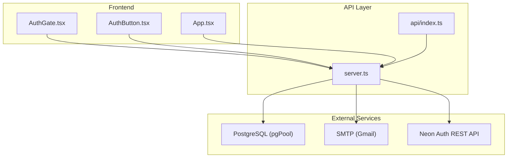
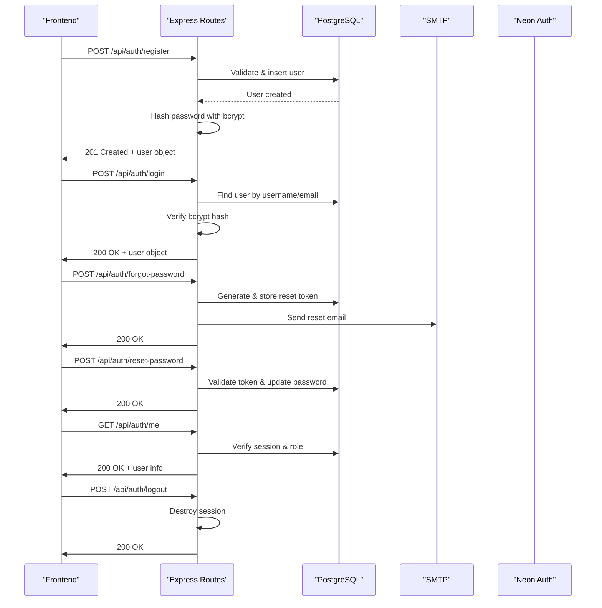
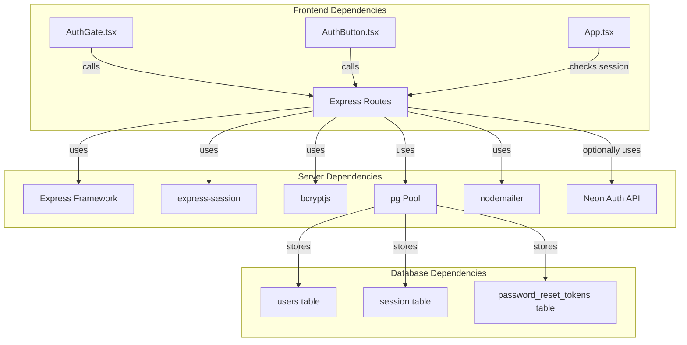

# Authentication Endpoints

<cite>
**Referenced Files in This Document**
- [server.ts](file://server.ts)
- [api/index.ts](file://api/index.ts)
- [AuthGate.tsx](file://src/components/AuthGate.tsx)
- [AuthButton.tsx](file://src/components/AuthButton.tsx)
- [App.tsx](file://src/App.tsx)
</cite>

## Table of Contents
1. [Introduction](#introduction)
2. [Project Structure](#project-structure)
3. [Core Components](#core-components)
4. [Architecture Overview](#architecture-overview)
5. [Detailed Component Analysis](#detailed-component-analysis)
6. [Dependency Analysis](#dependency-analysis)
7. [Performance Considerations](#performance-considerations)
8. [Troubleshooting Guide](#troubleshooting-guide)
9. [Conclusion](#conclusion)

## Introduction
This document provides comprehensive API documentation for the authentication endpoints implemented in the application. It covers:
- User registration and login with username/password validation
- Email-based authentication via Neon Auth integration with fallback to local bcrypt verification
- Session management using Express sessions backed by PostgreSQL
- Password reset flow (forgot-password and reset-password)
- Security measures including input validation, secure cookies, and session regeneration
- Common authentication flows and error handling patterns

The implementation is centered around an Express server that exposes REST endpoints under /api/auth. The frontend components call these endpoints to perform user actions such as registering, logging in, resetting passwords, and managing sessions.

## Project Structure
Authentication logic is primarily implemented in the server file, which defines all routes and middleware. Frontend components interact with these endpoints through fetch calls.



**Diagram sources**
- [server.ts:10-125](file://server.ts#L10-L125)
- [api/index.ts:1-5](file://api/index.ts#L1-L5)
- [AuthGate.tsx:46-115](file://src/components/AuthGate.tsx#L46-L115)
- [AuthButton.tsx:28-145](file://src/components/AuthButton.tsx#L28-L145)
- [App.tsx:50-77](file://src/App.tsx#L50-L77)

**Section sources**
- [server.ts:1-125](file://server.ts#L1-L125)
- [api/index.ts:1-5](file://api/index.ts#L1-L5)

## Core Components
- Express app setup with JSON parsing and URL-encoded body parsing
- Session configuration using express-session with PostgreSQL store
- Input validation and password hashing using bcryptjs
- Database operations via pg Pool
- Email transport via nodemailer for password reset emails
- Neon Auth integration endpoints with fallback to local bcrypt auth

Key environment variables:
- DATABASE_URL: PostgreSQL connection string
- SESSION_SECRET: Secret used to sign session cookies
- SMTP_USER/SMTP_PASS: Gmail SMTP credentials for sending password reset emails
- NEON_AUTH_BASE_URL or VITE_NEON_AUTH_URL: Base URL for Neon Auth REST API
- APP_URL: Application base URL used to build password reset links

**Section sources**
- [server.ts:18-125](file://server.ts#L18-L125)
- [server.ts:133-207](file://server.ts#L133-L207)
- [server.ts:401-404](file://server.ts#L401-L404)

## Architecture Overview
The authentication system follows a layered architecture:
- Frontend components handle user interactions and form validation
- Server-side Express routes process requests, validate inputs, and manage sessions
- Database layer stores user credentials and session data
- External services provide email delivery and optional identity provider integration



**Diagram sources**
- [server.ts:266-338](file://server.ts#L266-L338)
- [server.ts:340-381](file://server.ts#L340-L381)
- [server.ts:753-830](file://server.ts#L753-L830)
- [server.ts:832-851](file://server.ts#L832-L851)
- [server.ts:383-392](file://server.ts#L383-L392)

## Detailed Component Analysis

### Registration Endpoint: POST /api/auth/register
Handles user registration with username/password validation and automatic admin assignment for the first user.

**Request Schema:**
```json
{
  "username": "string (3-64 chars, alphanumeric with . _ - @)",
  "password": "string (minimum 8 characters)"
}
```

**Response Schemas:**
- Success (201): `{ "user": { "id": number, "username": string, "role": string } }`
- Validation Error (400): `{ "error": string }`
- Conflict (409): `{ "error": "Ese usuario ya existe." }`
- Server Error (500): `{ "error": string }`

**Processing Logic:**
1. Validates username format and password length
2. Checks for existing users by username or email
3. Hashes password using bcrypt with salt rounds of 12
4. Creates user record with automatic admin role for first user
5. Regenerates session and sets user context
6. Returns user information

**Security Measures:**
- Input validation with regex pattern matching
- Password hashing with bcrypt
- Transaction safety with database locks
- Session regeneration to prevent fixation attacks

**Section sources**
- [server.ts:266-338](file://server.ts#L266-L338)

### Login Endpoint: POST /api/auth/login
Supports both username and email authentication with bcrypt password verification.

**Request Schema:**
```json
{
  "username": "string (username or email)",
  "password": "string"
}
```

**Response Schemas:**
- Success (200): `{ "user": { "id": number, "username": string, "role": string } }`
- Unauthorized (401): `{ "error": "Usuario o contraseña incorrectos." }`
- Validation Error (400): `{ "error": "Usuario y contraseña son requeridos." }`
- Server Error (500): `{ "error": string }`

**Processing Logic:**
1. Validates request parameters
2. Searches for user by username or email (case-insensitive)
3. Performs constant-time bcrypt comparison to prevent timing attacks
4. Creates new session with user context
5. Returns authenticated user information

**Security Features:**
- Constant-time password comparison
- Case-insensitive email lookup
- Session regeneration after successful authentication
- Role re-validation on each request

**Section sources**
- [server.ts:340-381](file://server.ts#L340-L381)

### Logout Endpoint: POST /api/auth/logout
Terminates user sessions and clears session cookies.

**Request Schema:** None required

**Response Schemas:**
- Success (200): `{ "ok": true }`
- Server Error (500): `{ "error": string }`

**Processing Logic:**
1. Destroys current session
2. Clears session cookie
3. Returns success response

**Security Considerations:**
- Immediate session termination
- Cookie cleanup to prevent reuse
- Graceful error handling

**Section sources**
- [server.ts:383-392](file://server.ts#L383-L392)

### Neon Auth Integration: POST /api/auth/neon-register
Email-based registration with Neon Auth integration and local bcrypt fallback.

**Request Schema:**
```json
{
  "email": "string (valid email format)",
  "password": "string (minimum 8 characters)",
  "name": "string (optional)"
}
```

**Response Schemas:**
- Success (201): `{ "user": { "id": number, "username": string, "role": string } }`
- Validation Error (400): `{ "error": string }`
- Conflict (409): `{ "error": "Ya existe una cuenta con ese email." }`
- Server Error (500): `{ "error": string }`

**Processing Logic:**
1. Validates email format and password strength
2. Attempts Neon Auth registration if configured
3. Falls back to local bcrypt registration if Neon Auth unavailable
4. Upserts user into local database with proper role assignment
5. Creates session and returns user information

**Integration Points:**
- Neon Auth REST API integration when NEON_AUTH_BASE_URL is configured
- Local bcrypt fallback for development or when Neon Auth is unavailable
- Automatic username generation from email or name

**Section sources**
- [server.ts:594-680](file://server.ts#L594-L680)

### Neon Auth Login: POST /api/auth/neon-login
Email-based login with local bcrypt priority and Neon Auth fallback.

**Request Schema:**
```json
{
  "email": "string (valid email format)",
  "password": "string"
}
```

**Response Schemas:**
- Success (200): `{ "user": { "id": number, "username": string, "role": string } }`
- Unauthorized (401): `{ "error": "Email o contraseña incorrectos." }`
- Validation Error (400): `{ "error": "Email y contraseña son requeridos." }`
- Not Verified (403): `{ "error": "Registrate primero con el botón 'Registrarse' para sincronizar el acceso." }`

**Processing Logic:**
1. Prioritizes local bcrypt verification for performance
2. Falls back to Neon Auth if no local hash exists
3. Upserts user data into local database
4. Creates session with appropriate role

**Performance Optimization:**
- Local bcrypt check avoids external API calls when possible
- Cached user data reduces database queries
- Timeout protection for session creation

**Section sources**
- [server.ts:683-748](file://server.ts#L683-L748)

### Password Reset Flow

#### Forgot Password: POST /api/auth/forgot-password
Generates secure reset tokens and sends password reset emails.

**Request Schema:**
```json
{
  "email": "string (valid email format)"
}
```

**Response Schemas:**
- Success (200): `{ "ok": true, "message": "Si el email existe, recibirás un correo en breve." }`
- Validation Error (400): `{ "error": "Email inválido." }`
- Server Error (500): `{ "error": "Error al procesar la solicitud. Intentá de nuevo." }`

**Processing Logic:**
1. Validates email format
2. Generates cryptographically secure random token
3. Stores hashed token with expiration time
4. Sends reset email with secure link
5. Always responds successfully to prevent email enumeration

**Security Features:**
- Cryptographically secure token generation
- Token hashing before storage
- Time-limited tokens (1 hour expiration)
- No information leakage about user existence

**Section sources**
- [server.ts:753-791](file://server.ts#L753-L791)

#### Reset Password: POST /api/auth/reset-password
Validates reset tokens and updates user passwords.

**Request Schema:**
```json
{
  "token": "string (32+ characters)",
  "newPassword": "string (minimum 8 characters)"
}
```

**Response Schemas:**
- Success (200): `{ "ok": true, "message": "Contraseña actualizada. Ya podés iniciar sesión." }`
- Validation Error (400): `{ "error": "Token inválido." }`
- Expired Token (400): `{ "error": "El enlace expiró o ya fue usado. Solicitá uno nuevo." }`
- Server Error (500): `{ "error": "Error al restablecer la contraseña." }`

**Processing Logic:**
1. Validates token format and password strength
2. Verifies token exists and hasn't expired or been used
3. Hashes new password with bcrypt
4. Updates user password and marks token as used
5. Invalidates all active sessions for security

**Security Measures:**
- Single-use token validation
- Password strength requirements
- Session invalidation after password change
- Secure token handling with hashing

**Section sources**
- [server.ts:795-830](file://server.ts#L795-L830)

### Session Management: GET /api/auth/me
Retrieves current user information and validates session state.

**Request Schema:** None (requires valid session)

**Response Schemas:**
- Success (200): `{ "user": { "id": number, "username": string, "role": string } }`
- Unauthorized (401): `{ "error": "No autenticado." }`
- Server Error (500): `{ "error": "Ocurrió un error al verificar la sesión." }`

**Processing Logic:**
1. Validates session existence
2. Re-validates user role from database (not trusting session snapshot)
3. Updates session role to reflect any changes
4. Returns current user information

**Security Features:**
- Real-time role validation against database
- Session-based authentication
- Protected endpoint requiring valid session

**Section sources**
- [server.ts:832-851](file://server.ts#L832-L851)

## Dependency Analysis
The authentication system has clear dependencies between components:



**Diagram sources**
- [server.ts:1-15](file://server.ts#L1-L15)
- [server.ts:24-35](file://server.ts#L24-L35)
- [server.ts:112-125](file://server.ts#L112-L125)

**Section sources**
- [server.ts:1-125](file://server.ts#L1-L125)

## Performance Considerations
- **Local bcrypt priority**: Neon login checks local bcrypt hash first to avoid external API calls
- **Session timeout protection**: 5-second timeout prevents hanging responses during session creation
- **Database connection pooling**: Uses pg Pool for efficient database connections
- **Lazy initialization**: AI client and other resources initialized only when needed
- **Efficient queries**: Optimized SQL queries with proper indexing considerations

## Troubleshooting Guide

### Common Issues and Solutions

**Database Connection Errors:**
- Ensure DATABASE_URL is properly configured
- Check PostgreSQL service availability
- Verify SSL settings for production environments

**SMTP Configuration Issues:**
- Verify SMTP_USER and SMTP_PASS are set correctly
- Check Gmail SMTP settings and app passwords
- Ensure network connectivity to smtp.gmail.com

**Neon Auth Integration Problems:**
- Confirm NEON_AUTH_BASE_URL is correctly configured
- Check CORS settings if calling from browser
- Verify Neon Auth service availability

**Session Management Issues:**
- Ensure SESSION_SECRET is set to a strong random value
- Check PostgreSQL session table creation
- Verify cookie settings (secure, httpOnly, sameSite)

**Security Best Practices:**
- Use strong SESSION_SECRET values in production
- Implement rate limiting for authentication endpoints
- Add CSRF protection for sensitive operations
- Monitor failed login attempts for security

**Section sources**
- [server.ts:24-35](file://server.ts#L24-L35)
- [server.ts:133-143](file://server.ts#L133-L143)
- [server.ts:107-110](file://server.ts#L107-L110)

## Conclusion
The authentication system provides a comprehensive solution for user management with multiple authentication methods, robust security measures, and flexible integration options. The implementation balances security with usability through features like email-based authentication, password reset functionality, and seamless session management. The Neon Auth integration offers scalability while maintaining backward compatibility with local bcrypt authentication.

Key strengths include:
- Multiple authentication methods (username/password, email-based)
- Robust security with bcrypt hashing and secure sessions
- Flexible integration with external identity providers
- Comprehensive password reset workflow
- Proper error handling and validation throughout

The system is well-architected with clear separation of concerns and provides a solid foundation for user authentication in the application.