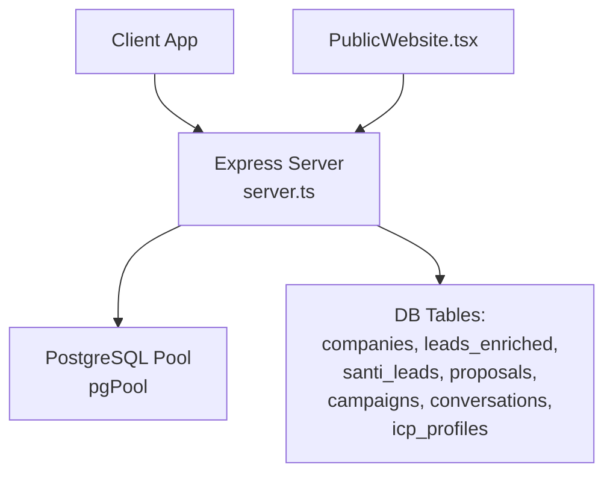
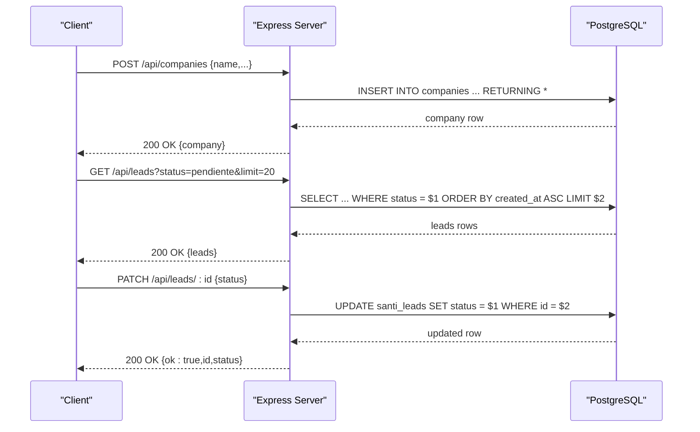
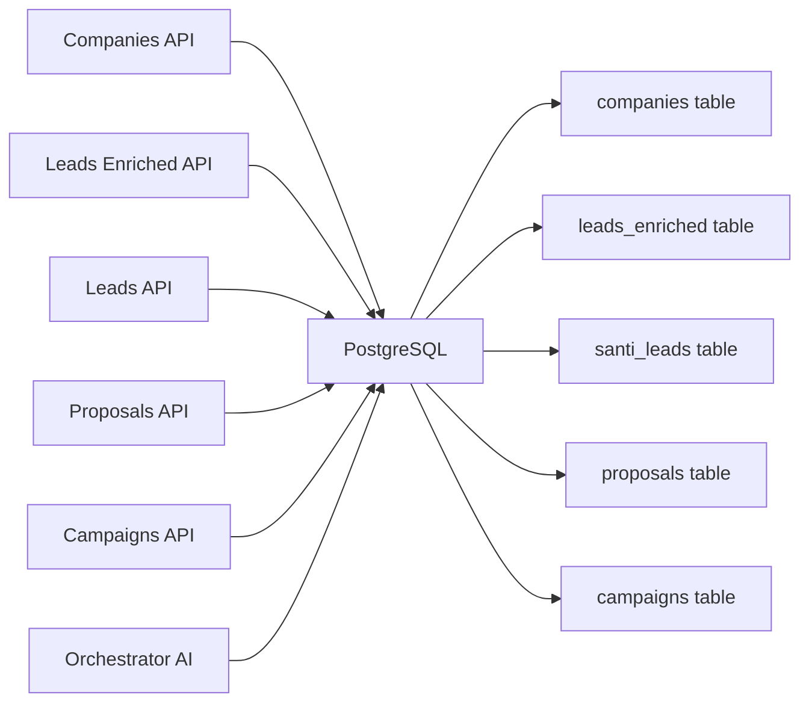
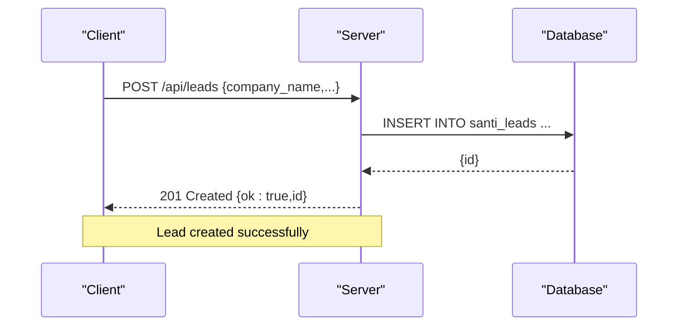
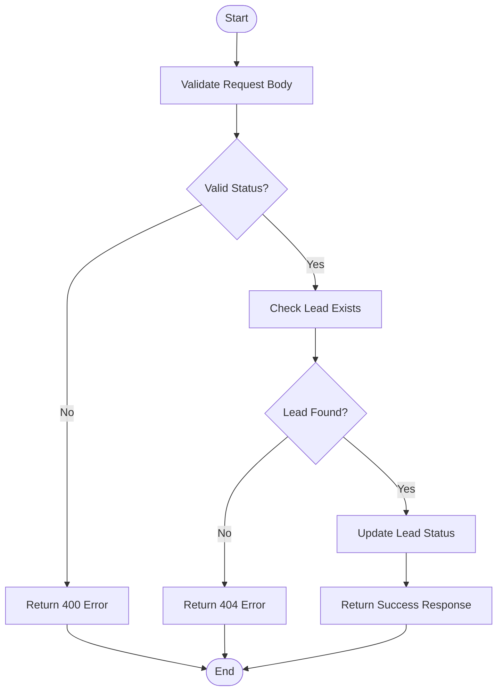

# CRM Data Endpoints

<cite>
**Referenced Files in This Document**
- [server.ts](file://server.ts)
- [types.ts](file://src/types.ts)
- [PublicWebsite.tsx](file://src/components/PublicWebsite.tsx)
</cite>

## Table of Contents
1. [Introduction](#introduction)
2. [Project Structure](#project-structure)
3. [Core Components](#core-components)
4. [Architecture Overview](#architecture-overview)
5. [Detailed Component Analysis](#detailed-component-analysis)
6. [Dependency Analysis](#dependency-analysis)
7. [Performance Considerations](#performance-considerations)
8. [Troubleshooting Guide](#troubleshooting-guide)
9. [Conclusion](#conclusion)
10. [Appendices](#appendices)

## Introduction
This document provides comprehensive API documentation for the CRM data endpoints implemented in the project. It covers lead management, company data, contact information (enriched leads), and pipeline operations including deals. The documentation explains CRUD operations, search and filtering, pagination patterns, status code conventions, error responses, and relationship management between entities. It also includes MEDDIC scoring integration and common CRM workflows such as lead creation, status updates, and data export patterns.

## Project Structure
The CRM functionality is primarily implemented in a single Express server file that initializes database tables and exposes REST endpoints. Frontend components reference available endpoints for discovery and usage examples.

**Diagram sources**
- [server.ts:4529-4558](file://server.ts#L4529-L4558)
- [server.ts:4560-4581](file://server.ts#L4560-L4581)
- [server.ts:4583-4595](file://server.ts#L4583-L4595)
- [server.ts:4597-4621](file://server.ts#L4597-L4621)
- [server.ts:4625-4642](file://server.ts#L4625-L4642)
- [server.ts:4644-4674](file://server.ts#L4644-L4674)
- [server.ts:4676-4691](file://server.ts#L4676-L4691)
- [server.ts:4832-4860](file://server.ts#L4832-L4860)
- [server.ts:4894-4913](file://server.ts#L4894-L4913)
- [server.ts:4931-4949](file://server.ts#L4931-L4949)
- [server.ts:4951-4969](file://server.ts#L4951-L4969)
- [PublicWebsite.tsx:5226-5240](file://src/components/PublicWebsite.tsx#L5226-L5240)

**Section sources**
- [server.ts:4529-4558](file://server.ts#L4529-L4558)
- [PublicWebsite.tsx:5226-5240](file://src/components/PublicWebsite.tsx#L5226-L5240)

## Core Components
- Companies API: List, create, get by ID, and update companies with filtering and pagination.
- Enriched Leads API: Create enriched contacts linked to companies; update MEDDIC and ICP fit scores; list by company.
- Leads API (Santi): Create leads, update statuses, add notes, and retrieve brochures.
- Proposals API: Create and list proposals linked to companies and leads.
- Campaigns API: Create, list, update, and delete campaigns.
- Orchestrator AI: Aggregates real-time metrics from santi_leads and chatbot_leads for analytics.

Key data models include:
- Company entity with fields like name, industry, city, country, address, phone, website, rating, source, status, metadata.
- Enriched Lead entity with name, email, phone, LinkedIn, WhatsApp, role, source, icp_fit, meddic_score, metadata.
- Santi Lead entity with company_name, industry, city, address, contact_name, contact_phone, contact_role, pain_point, fit_score, amount_ars, meddic_score, guiacores_url, status, source.
- Deal type definition with stage enumeration and MEDDIC fields.

**Section sources**
- [server.ts:4529-4558](file://server.ts#L4529-L4558)
- [server.ts:4560-4581](file://server.ts#L4560-L4581)
- [server.ts:4583-4595](file://server.ts#L4583-L4595)
- [server.ts:4597-4621](file://server.ts#L4597-L4621)
- [server.ts:4625-4642](file://server.ts#L4625-L4642)
- [server.ts:4644-4674](file://server.ts#L4644-L4674)
- [server.ts:4676-4691](file://server.ts#L4676-L4691)
- [server.ts:4832-4860](file://server.ts#L4832-L4860)
- [server.ts:4894-4913](file://server.ts#L4894-L4913)
- [server.ts:4931-4949](file://server.ts#L4931-L4949)
- [server.ts:4951-4969](file://server.ts#L4951-L4969)
- [types.ts:139-162](file://src/types.ts#L139-L162)

## Architecture Overview
The CRM system uses an Express server backed by PostgreSQL. Endpoints are organized by domain (companies, leads-enriched, leads, proposals, campaigns). Authentication and authorization are handled via middleware for specific routes. Database initialization creates necessary tables and indexes.

**Diagram sources**
- [server.ts:4560-4581](file://server.ts#L4560-L4581)
- [server.ts:4894-4913](file://server.ts#L4894-L4913)
- [server.ts:4931-4949](file://server.ts#L4931-L4949)

## Detailed Component Analysis

### Companies API
- GET /api/companies: Lists companies with optional filters (status, industry, city) and pagination (limit, offset). Returns total count.
- POST /api/companies: Creates or upserts a company based on unique constraint (name, city). Returns inserted/updated company.
- GET /api/companies/:id: Retrieves company details along with associated leads.
- PATCH /api/companies/:id: Updates allowed fields dynamically.

Filtering and pagination:
- Filters use ILIKE when values start with "%".
- Pagination parameters limit and offset are validated and bounded.

Error handling:
- Validation errors return 400 with error message.
- Not found returns 404.
- Server errors return 500 with error message.

**Section sources**
- [server.ts:4529-4558](file://server.ts#L4529-L4558)
- [server.ts:4560-4581](file://server.ts#L4560-L4581)
- [server.ts:4583-4595](file://server.ts#L4583-L4595)
- [server.ts:4597-4621](file://server.ts#L4597-L4621)

### Enriched Leads API
- GET /api/leads-enriched: Lists enriched leads with optional company_id filter and limit.
- POST /api/leads-enriched: Creates a new enriched lead linked to a company. Requires company_id.
- PATCH /api/leads-enriched/:id: Updates icp_fit, meddic_score, status, and merges meddic dimensions into enrichment_data JSONB.

MEDDIC integration:
- meddic_score field tracks overall score.
- meddic object can be merged into enrichment_data JSONB during updates.

Relationship management:
- Each enriched lead references a company via company_id foreign key.
- Unique index on (company_id, email) prevents duplicate emails per company.

**Section sources**
- [server.ts:4625-4642](file://server.ts#L4625-L4642)
- [server.ts:4644-4674](file://server.ts#L4644-L4674)
- [server.ts:4676-4691](file://server.ts#L4676-L4691)

### Leads API (Santi)
- POST /api/leads: Creates a new lead with company details, contact info, pain point, fit score, amount, and MEDDIC score. Requires authentication.
- GET /api/leads: Retrieves leads filtered by status with limit. Requires API key.
- PATCH /api/leads/:id: Updates lead status with validation against allowed states. Requires API key.
- POST /api/leads/:id/notes: Adds a note summary to a lead. Requires API key.
- POST /api/leads/:id/brochure: Saves or replaces AI-generated brochure content for a lead using transactional operations. Requires authentication.

Status workflow:
- Valid statuses: pendiente, contactado, caliente, tibio, frio, agendado.
- Status updates are validated before persistence.

Data validation:
- Required fields enforced at endpoint level.
- Transactional operations ensure consistency for brochure updates.

**Section sources**
- [server.ts:4832-4860](file://server.ts#L4832-L4860)
- [server.ts:4894-4913](file://server.ts#L4894-L4913)
- [server.ts:4931-4949](file://server.ts#L4931-L4949)
- [server.ts:4951-4969](file://server.ts#L4951-L4969)
- [server.ts:4862-4888](file://server.ts#L4862-L4888)

### Deals Pipeline
Deal types define the structure for pipeline operations with stages: leads, contacted, meeting, proposal, closed. MEDDIC fields are included for scoring and evaluation.

Note: While deal endpoints are referenced in frontend documentation, their implementation is not present in the analyzed server code. The type definitions provide the expected data model for deals.

**Section sources**
- [types.ts:139-162](file://src/types.ts#L139-L162)
- [PublicWebsite.tsx:5226-5240](file://src/components/PublicWebsite.tsx#L5226-L5240)

### Proposals API
- GET /api/proposals: Lists proposals with optional company_id and status filters and limit.
- POST /api/proposals: Creates a proposal linked to a company and optionally a lead. Requires content_md and company_id.

Relationship management:
- Proposals link to companies and enriched leads through foreign keys.

**Section sources**
- [server.ts:4695-4714](file://server.ts#L4695-L4714)
- [server.ts:4716-4730](file://server.ts#L4716-L4730)

### Campaigns API
- GET /api/campaigns: Lists campaigns with basic fields.
- POST /api/campaigns: Creates a campaign with name, type, status, template, and ICP filter.
- PATCH /api/campaigns/:id: Updates allowed fields including counts and ICP filter.
- DELETE /api/campaigns/:id: Deletes a campaign.

Bulk operations:
- Campaign creation supports ICP filtering for targeted outreach.

**Section sources**
- [server.ts:4734-4745](file://server.ts#L4734-L4745)
- [server.ts:4747-4761](file://server.ts#L4747-L4761)
- [server.ts:4763-4787](file://server.ts#L4763-L4787)
- [server.ts:4789-4797](file://server.ts#L4789-L4797)

### Orchestrator AI
- POST /api/orchestrator: Aggregates real-time metrics from santi_leads and chatbot_leads tables to provide analytics and insights. Requires authentication.

Data aggregation:
- Counts leads by status across different systems.
- Calculates total pipeline value and average MEDDIC scores.

**Section sources**
- [server.ts:4972-5085](file://server.ts#L4972-L5085)

## Dependency Analysis
The CRM endpoints depend on PostgreSQL for data persistence and use connection pooling for performance. Authentication middleware protects sensitive endpoints. Database tables are initialized during server startup with appropriate indexes for query optimization.

**Diagram sources**
- [server.ts:4529-4558](file://server.ts#L4529-L4558)
- [server.ts:4625-4642](file://server.ts#L4625-L4642)
- [server.ts:4832-4860](file://server.ts#L4832-L4860)
- [server.ts:4695-4714](file://server.ts#L4695-L4714)
- [server.ts:4734-4745](file://server.ts#L4734-L4745)
- [server.ts:4972-5085](file://server.ts#L4972-L5085)

**Section sources**
- [server.ts:3666-3867](file://server.ts#L3666-L3867)

## Performance Considerations
- Connection pooling: Uses pg.Pool for efficient database connections.
- Indexes: Strategic indexes created for frequently queried columns (status, company_id, created_at).
- Pagination: All list endpoints support limit and offset parameters to prevent large result sets.
- Query optimization: Parallel queries used where appropriate (e.g., counting totals while fetching data).
- Transactional operations: Used for critical updates to maintain data consistency.

[No sources needed since this section provides general guidance]

## Troubleshooting Guide
Common issues and their resolutions:
- Database connection errors: Ensure DATABASE_URL is properly configured.
- Authentication failures: Verify session configuration and required headers.
- Validation errors: Check request body structure and required fields.
- Rate limiting: Monitor API usage logs for throttling issues.

Error response format:
- All error responses follow a consistent structure with error message field.
- HTTP status codes indicate the nature of the error (400 for validation, 404 for not found, 500 for server errors).

**Section sources**
- [server.ts:4529-4558](file://server.ts#L4529-L4558)
- [server.ts:4560-4581](file://server.ts#L4560-L4581)
- [server.ts:4832-4860](file://server.ts#L4832-L4860)

## Conclusion
The CRM system provides a comprehensive set of endpoints for managing leads, companies, contacts, and pipeline operations. The architecture emphasizes data integrity through proper relationships, validation, and transactional operations. MEDDIC scoring integration enables sophisticated lead qualification and pipeline analysis. The system supports both authenticated user operations and API-based integrations through appropriate middleware.

[No sources needed since this section summarizes without analyzing specific files]

## Appendices

### Common CRM Workflows

#### Lead Creation Workflow

**Diagram sources**
- [server.ts:4832-4860](file://server.ts#L4832-L4860)

#### Status Update Workflow

**Diagram sources**
- [server.ts:4931-4949](file://server.ts#L4931-L4949)

#### Data Export Pattern
For bulk data export, use the list endpoints with appropriate filters and pagination:
- GET /api/companies?limit=100&offset=0
- GET /api/leads-enriched?company_id={id}&limit=100
- GET /api/leads?status=pendiente&limit=100

Combine multiple requests to export complete datasets while respecting rate limits and pagination constraints.

**Section sources**
- [server.ts:4529-4558](file://server.ts#L4529-L4558)
- [server.ts:4625-4642](file://server.ts#L4625-L4642)
- [server.ts:4894-4913](file://server.ts#L4894-L4913)