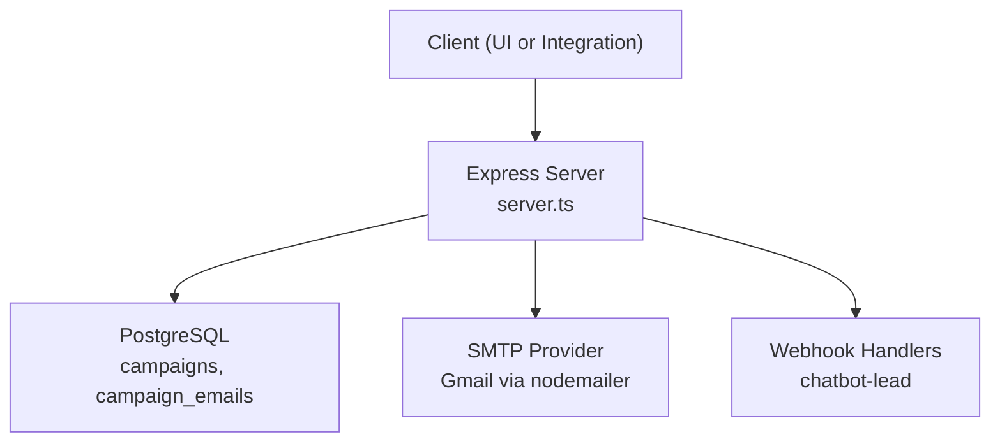
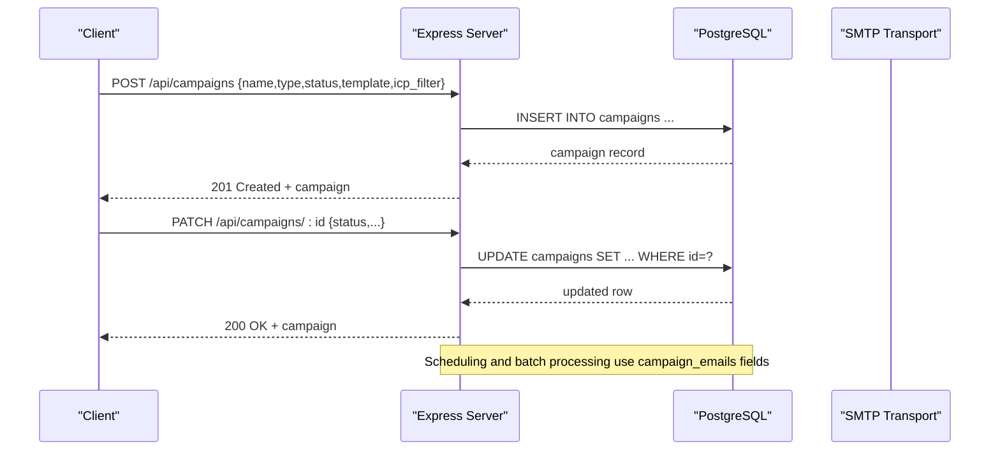
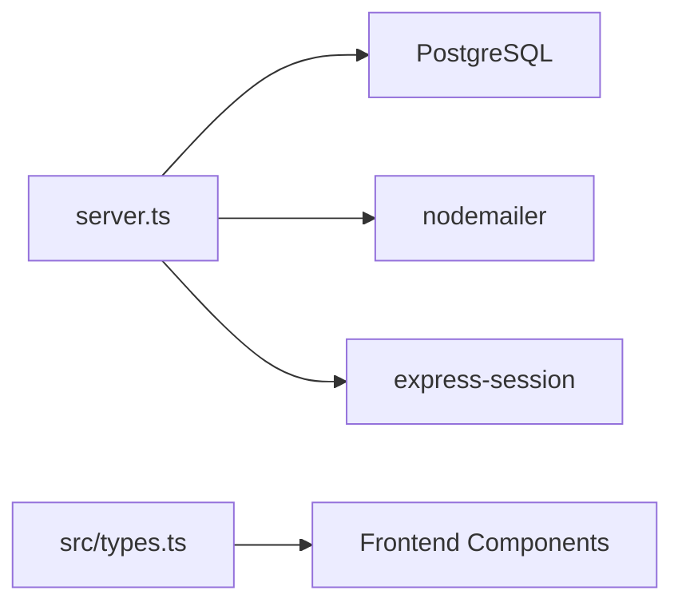

# Campaign Management Endpoints

<cite>
**Referenced Files in This Document**
- [server.ts](file://server.ts)
- [types.ts](file://src/types.ts)
</cite>

## Table of Contents
1. [Introduction](#introduction)
2. [Project Structure](#project-structure)
3. [Core Components](#core-components)
4. [Architecture Overview](#architecture-overview)
5. [Detailed Component Analysis](#detailed-component-analysis)
6. [Dependency Analysis](#dependency-analysis)
7. [Performance Considerations](#performance-considerations)
8. [Troubleshooting Guide](#troubleshooting-guide)
9. [Conclusion](#conclusion)

## Introduction
This document provides detailed API documentation for campaign management endpoints focused on email campaigns, template management, and automation workflows. It covers creating, updating, and managing marketing campaigns; scheduling and recipient management; template rendering; performance tracking; lifecycle states; batch processing capabilities; integration with email delivery services; and webhook endpoints for status updates and delivery notifications.

## Project Structure
The campaign management functionality is implemented primarily in the Express server file and supported by TypeScript type definitions used across the application. The server exposes REST endpoints under /api/campaigns and related resources, persists data to PostgreSQL, and integrates with an SMTP provider for email delivery.

**Diagram sources**
- [server.ts:4735-4797](file://server.ts#L4735-L4797)
- [server.ts:3796-3823](file://server.ts#L3796-L3823)
- [server.ts:131-143](file://server.ts#L131-L143)
- [server.ts:3525-3558](file://server.ts#L3525-L3558)

**Section sources**
- [server.ts:4735-4797](file://server.ts#L4735-L4797)
- [server.ts:3796-3823](file://server.ts#L3796-L3823)
- [server.ts:131-143](file://server.ts#L131-L143)
- [server.ts:3525-3558](file://server.ts#L3525-L3558)

## Core Components
- Campaign CRUD endpoints: list, create, update, delete campaigns.
- Campaign email records: schema for individual emails within a campaign, including scheduling and lifecycle timestamps.
- Email delivery: SMTP transport configuration for sending emails.
- Webhooks: inbound webhook for chatbot lead capture.
- Type models: frontend-facing types for email contacts, templates, campaigns, and automation workflows.

Key responsibilities:
- Persist campaign metadata and counters (leads_count, sent_count, replies_count).
- Track per-email lifecycle events (draft, scheduled, sent, opened, replied).
- Provide a foundation for batch processing and scheduling through campaign_emails fields.
- Integrate with SMTP for outbound email delivery.

**Section sources**
- [server.ts:4735-4797](file://server.ts#L4735-L4797)
- [server.ts:3796-3823](file://server.ts#L3796-L3823)
- [server.ts:131-143](file://server.ts#L131-L143)
- [server.ts:3525-3558](file://server.ts#L3525-L3558)
- [types.ts:99-136](file://src/types.ts#L99-L136)

## Architecture Overview
The campaign management system follows a straightforward REST architecture backed by PostgreSQL and an SMTP service. Clients interact with Express endpoints to manage campaigns and their associated emails. Scheduling and batch operations are modeled through campaign_emails fields, while webhooks enable external systems to push lead data into the platform.

**Diagram sources**
- [server.ts:4747-4761](file://server.ts#L4747-L4761)
- [server.ts:4763-4787](file://server.ts#L4763-L4787)
- [server.ts:3796-3823](file://server.ts#L3796-L3823)

## Detailed Component Analysis

### Campaigns API
Endpoints:
- GET /api/campaigns
  - Purpose: List campaigns with basic metadata and counters.
  - Response: Array of campaign objects including id, name, type, status, template, leads_count, sent_count, replies_count, created_at.
- POST /api/campaigns
  - Purpose: Create a new campaign.
  - Request body: name (required), type (default "email"), status (default "draft"), template (default "intro"), icp_filter (JSON object).
  - Response: Created campaign object.
- PATCH /api/campaigns/:id
  - Purpose: Update allowed fields for a campaign.
  - Allowed fields: name, status, template, leads_count, sent_count, replies_count, icp_filter.
  - Response: Updated campaign object.
- DELETE /api/campaigns/:id
  - Purpose: Delete a campaign by id.
  - Response: { ok: true }.

Notes:
- Validation: name is required for creation; otherwise returns 400.
- Error handling: all endpoints return error messages on failure.

**Section sources**
- [server.ts:4735-4745](file://server.ts#L4735-L4745)
- [server.ts:4747-4761](file://server.ts#L4747-L4761)
- [server.ts:4763-4787](file://server.ts#L4763-L4787)
- [server.ts:4789-4797](file://server.ts#L4789-L4797)

### Campaign Emails Schema and Lifecycle
Schema highlights:
- campaign_emails tracks individual emails per campaign with fields:
  - id, campaign_id, lead_id, email_number, subject, body, status, scheduled_at, sent_at, opened_at, replied_at.
- Indexes: idx_campaign_emails_status supports efficient queries by status.

Lifecycle states:
- draft: initial state before scheduling.
- scheduled: queued for future delivery.
- sent: delivered successfully.
- opened: recipient opened the email.
- replied: recipient replied to the email.

Batch processing and scheduling:
- Use scheduled_at to queue emails for later delivery.
- Status transitions support batch jobs that process pending/scheduled emails in chunks.

**Section sources**
- [server.ts:3811-3823](file://server.ts#L3811-L3823)
- [server.ts:3862](file://server.ts#L3862)

### Email Delivery Integration
SMTP configuration:
- Transport uses Gmail SMTP via nodemailer.
- Requires environment variables SMTP_USER and SMTP_PASS.
- Returns null if credentials are missing, indicating no mail transport available.

Usage:
- sendPasswordResetEmail demonstrates how to send HTML emails using the configured transport.

Integration points:
- Campaign email sending should leverage this transport to deliver content stored in campaign_emails.

**Section sources**
- [server.ts:131-143](file://server.ts#L131-L143)
- [server.ts:145-200](file://server.ts#L145-L200)

### Webhooks
Available webhook:
- POST /api/webhooks/chatbot-lead
  - Purpose: Receive inbound lead data from external systems (e.g., WordPress plugin).
  - Authentication: requires CRM_INTERNAL_TOKEN via header.
  - Request body: email (required), first_name, last_name, phone, company, source, tags, metadata.
  - Response: Success or error JSON.

Note:
- This webhook is not specific to campaign status/delivery but can be used to enrich recipients for campaigns.

**Section sources**
- [server.ts:3525-3558](file://server.ts#L3525-L3558)

### Template Management and Rendering
Frontend types:
- EmailTemplateItem defines expected structure for templates: id, name, category, subject, previewText, htmlContent.

Implementation status:
- No dedicated template CRUD endpoints are present in the server code.
- Templates can be managed externally or integrated later; campaign.template references a template identifier (e.g., "intro").

Rendering approach:
- Use campaign_emails.body to store rendered HTML content.
- Combine template placeholders with recipient context when generating final content.

**Section sources**
- [types.ts:120-127](file://src/types.ts#L120-L127)
- [server.ts:3796-3808](file://server.ts#L3796-L3808)

### Automation Workflows
Frontend types:
- AutomationWorkflow defines workflow attributes: id, name, trigger, status (Active|Paused), subscribersCount, conversionRate.

Implementation status:
- No automation workflow endpoints are exposed in the server code.
- Workflows can be modeled similarly to campaigns, using triggers and status fields to orchestrate sequences.

Recommendation:
- Extend the server with endpoints to manage workflows and link them to campaign_emails scheduling.

**Section sources**
- [types.ts:129-136](file://src/types.ts#L129-L136)

### Recipient Management
Types:
- EmailContact defines recipient attributes: id, email, name, status (Subscribed|Unsubscribed|Bounced), list, tags, addedDate.

Implementation status:
- No recipient CRUD endpoints are present in the server code.
- campaign_emails.lead_id links emails to enriched leads; consider maintaining a separate recipients table or leveraging existing lead tables.

Recommendation:
- Add endpoints to manage lists and tags, and integrate with campaign_emails to target segments.

**Section sources**
- [types.ts:99-107](file://src/types.ts#L99-L107)

### Performance Tracking
Campaign-level metrics:
- leads_count, sent_count, replies_count tracked in campaigns table.

Per-email metrics:
- sent_at, opened_at, replied_at timestamps in campaign_emails.

Suggested enhancements:
- Add open and click tracking via pixel or link redirection.
- Expose analytics endpoints aggregating these metrics.

**Section sources**
- [server.ts:3796-3808](file://server.ts#L3796-L3808)
- [server.ts:3811-3823](file://server.ts#L3811-L3823)

### Campaign Scheduling and Batch Processing
Scheduling:
- Use scheduled_at in campaign_emails to queue emails for future delivery.
- Status field indicates current stage (draft, scheduled, sent, etc.).

Batch processing:
- Implement background jobs to:
  - Select emails where status = 'scheduled' and scheduled_at <= NOW().
  - Send via SMTP transport.
  - Update status to 'sent' and set sent_at timestamp.
  - Handle failures with retries and error logging.

Operational considerations:
- Use database transactions to ensure consistency during status updates.
- Monitor job queues and implement backpressure for large batches.

**Section sources**
- [server.ts:3811-3823](file://server.ts#L3811-L3823)

### Webhooks for Campaign Status and Delivery Notifications
Current state:
- No campaign-specific webhook endpoints are implemented.
- Existing webhook handles chatbot lead ingestion.

Recommendation:
- Add endpoints such as:
  - POST /api/webhooks/campaign/email-opened
  - POST /api/webhooks/campaign/email-replied
  - POST /api/webhooks/campaign/email-bounced
- Validate payloads and update campaign_emails accordingly.

**Section sources**
- [server.ts:3525-3558](file://server.ts#L3525-L3558)

## Dependency Analysis
Component relationships:
- Express server depends on PostgreSQL for persistence.
- Email delivery depends on SMTP configuration via nodemailer.
- Webhooks depend on authentication middleware for internal tokens.
- Frontend types define contracts for UI components and potential integrations.

Potential circular dependencies:
- None detected in the current implementation.

External dependencies:
- PostgreSQL (pg pool)
- nodemailer (SMTP)
- express-session (session storage)
- connect-pg-simple (session store)

**Diagram sources**
- [server.ts:1-20](file://server.ts#L1-L20)
- [server.ts:131-143](file://server.ts#L131-L143)
- [types.ts:99-136](file://src/types.ts#L99-L136)

**Section sources**
- [server.ts:1-20](file://server.ts#L1-L20)
- [server.ts:131-143](file://server.ts#L131-L143)
- [types.ts:99-136](file://src/types.ts#L99-L136)

## Performance Considerations
- Use indexes on frequently queried columns (e.g., campaign_emails.status).
- Limit result sets in listing endpoints to avoid large payloads.
- Implement pagination for large datasets (e.g., campaign_emails).
- Offload heavy tasks (sending emails, rendering templates) to background workers.
- Cache frequent reads where appropriate (e.g., template content).

[No sources needed since this section provides general guidance]

## Troubleshooting Guide
Common issues:
- Missing SMTP credentials: verify SMTP_USER and SMTP_PASS environment variables.
- Database connection errors: check DATABASE_URL and network connectivity.
- Webhook authentication failures: ensure CRM_INTERNAL_TOKEN is provided in headers.
- Validation errors: confirm required fields (e.g., name for campaign creation).

Debugging steps:
- Inspect server logs for error messages.
- Validate request payloads against documented schemas.
- Check database constraints and indexes.

**Section sources**
- [server.ts:131-143](file://server.ts#L131-L143)
- [server.ts:3525-3558](file://server.ts#L3525-L3558)
- [server.ts:4747-4761](file://server.ts#L4747-L4761)

## Conclusion
The campaign management system provides foundational endpoints for managing email campaigns and their associated records. While template management, automation workflows, and recipient management are defined in types, their backend implementations are not yet present. Extending the server with additional endpoints for templates, workflows, recipients, and webhooks will complete the feature set. Proper scheduling, batch processing, and performance optimizations will enhance scalability and reliability.

[No sources needed since this section summarizes without analyzing specific files]