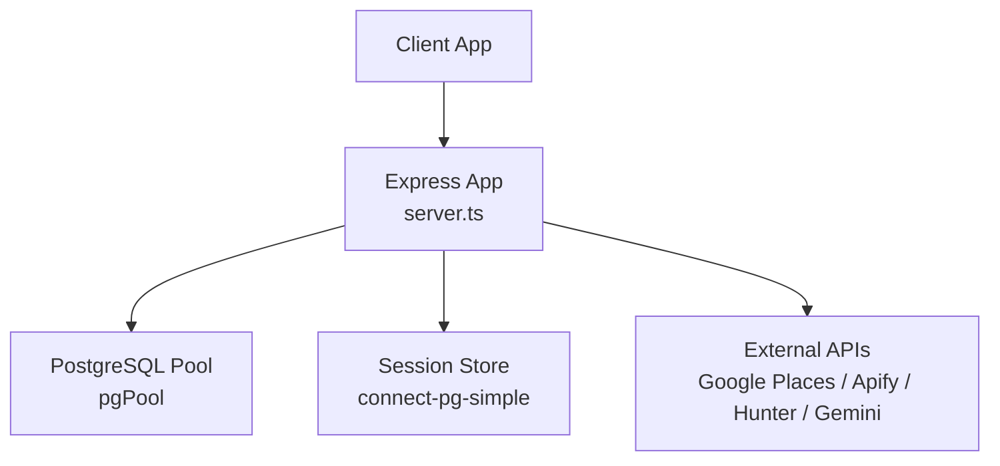
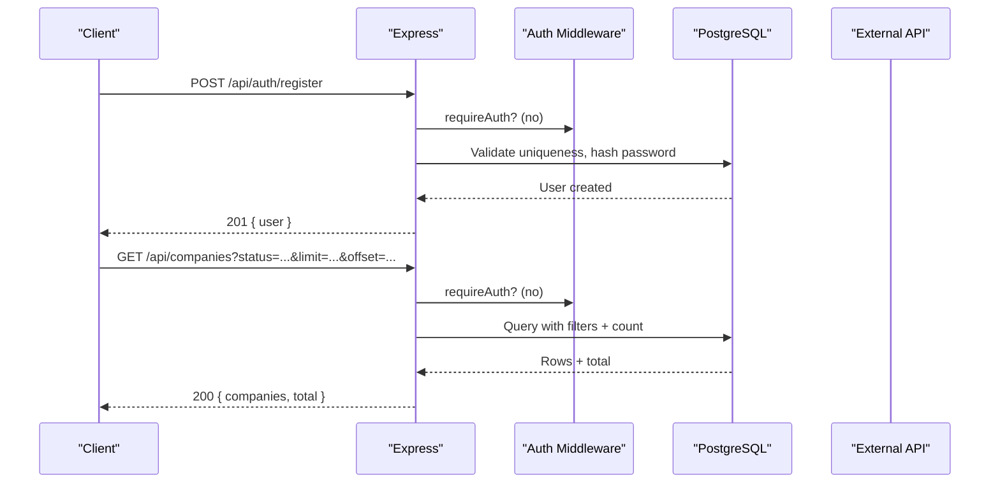

# Data Management Endpoints

<cite>
**Referenced Files in This Document**
- [server.ts](file://server.ts)
- [api/index.ts](file://api/index.ts)
- [types.ts](file://src/agents/types.ts)
</cite>

## Table of Contents
1. [Introduction](#introduction)
2. [Project Structure](#project-structure)
3. [Core Components](#core-components)
4. [Architecture Overview](#architecture-overview)
5. [Detailed Component Analysis](#detailed-component-analysis)
6. [Dependency Analysis](#dependency-analysis)
7. [Performance Considerations](#performance-considerations)
8. [Troubleshooting Guide](#troubleshooting-guide)
9. [Conclusion](#conclusion)
10. [Appendices](#appendices)

## Introduction
This document provides comprehensive API documentation for data management endpoints covering CRUD operations for core entities such as users, companies, leads (enriched and chatbot), campaigns, proposals, and related resources. It includes request/response schemas, parameter validation rules, pagination patterns, bulk operations, search and filtering, error handling strategies, status code conventions, and response formats. It also covers authentication flows, transaction handling, data integrity constraints, and media generation capabilities used by the application.

## Project Structure
The server is implemented with Express and PostgreSQL. All API routes are registered at module level in a single server file. A small adapter exports the Express app for serverless or custom hosting environments.



**Diagram sources**
- [server.ts:18-35](file://server.ts#L18-L35)
- [server.ts:24-77](file://server.ts#L24-L77)
- [api/index.ts:1-5](file://api/index.ts#L1-L5)

**Section sources**
- [server.ts:18-35](file://server.ts#L18-L35)
- [api/index.ts:1-5](file://api/index.ts#L1-L5)

## Core Components
- Authentication and session management: register/login/logout, Neon Auth integration, password reset, role checks.
- Companies: list with filters/pagination, create/upsert, get by id, partial update.
- Leads (enriched): create, list by company, partial update (scoring/status).
- Chatbot leads: create, list, patch status; webhook ingestion from WordPress plugin.
- Campaigns: list, create, partial update, delete.
- Proposals: list with filters, create.
- ICP profiles: list, create.
- AI content generation: unified endpoint for industry copy, SEO, social posts, repurposing, image generation.
- Bulk import and enrichment utilities: places search, scoring, bulk import to companies.

**Section sources**
- [server.ts:266-392](file://server.ts#L266-L392)
- [server.ts:594-748](file://server.ts#L594-L748)
- [server.ts:753-830](file://server.ts#L753-L830)
- [server.ts:4530-4621](file://server.ts#L4530-L4621)
- [server.ts:4626-4691](file://server.ts#L4626-L4691)
- [server.ts:3490-3581](file://server.ts#L3490-L3581)
- [server.ts:4734-4797](file://server.ts#L4734-L4797)
- [server.ts:4696-4730](file://server.ts#L4696-L4730)
- [server.ts:4801-4826](file://server.ts#L4801-L4826)
- [server.ts:2262-3241](file://server.ts#L2262-L3241)
- [server.ts:2008-2245](file://server.ts#L2008-L2245)

## Architecture Overview
The API uses Express middleware for JSON parsing, sessions, and authentication. Database access is via pg.Pool. External integrations include Google Places, Apify scrapers, Hunter.io, and Google GenAI for content generation.



**Diagram sources**
- [server.ts:266-338](file://server.ts#L266-L338)
- [server.ts:4530-4558](file://server.ts#L4530-L4558)

## Detailed Component Analysis

### Authentication and Session Management
- Register: validates username/email and password length, ensures uniqueness, hashes password, sets first user as admin, creates session.
- Login: supports username or email, bcrypt comparison, session creation.
- Logout: destroys session and clears cookie.
- Neon Auth: optional identity provider fallback; upserts local user record and returns session.
- Password reset flow: generates secure token, stores hashed token, sends email, resets password and invalidates sessions.
- Me: returns current user info with fresh role check.

Request/Response Schemas
- POST /api/auth/register
  - Request body: { username: string, password: string }
  - Response 201: { user: { id: number, username: string, role: string } }
  - Errors: 400 (validation), 409 (duplicate), 500 (server error)
- POST /api/auth/login
  - Request body: { username: string, password: string }
  - Response 200: { user: { id: number, username: string, role: string } }
  - Errors: 401 (invalid credentials), 500
- POST /api/auth/logout
  - Response 200: { ok: boolean }
- POST /api/auth/neon-register
  - Request body: { email: string, password: string, name?: string }
  - Response 201/200 depending on path; errors propagate from upstream or local fallback
- POST /api/auth/neon-login
  - Request body: { email: string, password: string }
  - Response 200; handles EMAIL_NOT_VERIFIED case
- POST /api/auth/forgot-password
  - Request body: { email: string }
  - Response 200: { ok: boolean, message: string }
- POST /api/auth/reset-password
  - Request body: { token: string, newPassword: string }
  - Response 200: { ok: boolean, message: string }
- GET /api/auth/me
  - Response 200: { user: { id: number, username: string, role: string } }

Validation and Constraints
- Username/email regex and length checks
- Password minimum length
- Unique username/email constraints
- Role enforcement via session and DB re-check

Status Codes
- 200/201 success
- 400 validation errors
- 401 unauthorized
- 403 forbidden (admin-only actions)
- 409 conflict (duplicate)
- 500 server errors

Error Handling Strategy
- Consistent JSON error responses with an "error" field
- Centralized try/catch blocks per route
- Safe fallbacks when external services fail

Transaction Handling
- Registration uses explicit BEGIN/COMMIT/ROLLBACK with table locks to ensure first-user admin logic is race-safe

**Section sources**
- [server.ts:266-338](file://server.ts#L266-L338)
- [server.ts:340-392](file://server.ts#L340-L392)
- [server.ts:594-748](file://server.ts#L594-L748)
- [server.ts:753-830](file://server.ts#L753-L830)
- [server.ts:832-851](file://server.ts#L832-L851)

### Companies
Endpoints
- GET /api/companies
  - Query params: status?, industry?, city?, limit?, offset?
  - Response: { companies: Company[], total: number }
- POST /api/companies
  - Request body: { name, industry?, city?, country?, address?, phone?, website?, rating?, source?, metadata? }
  - Response: Company (upsert on unique name+city)
- GET /api/companies/:id
  - Response: { company: Company, leads: EnrichedLead[] }
- PATCH /api/companies/:id
  - Request body: subset of fields allowed
  - Response: updated Company

Pagination and Filtering
- limit clamped between 1 and 200; offset >= 0
- Filters use LIKE for industry and city; exact match for status

Data Integrity
- Unique constraint on (name, city)
- ON CONFLICT DO UPDATE merges non-null fields

**Section sources**
- [server.ts:4530-4558](file://server.ts#L4530-L4558)
- [server.ts:4561-4581](file://server.ts#L4561-L4581)
- [server.ts:4584-4595](file://server.ts#L4584-L4595)
- [server.ts:4598-4621](file://server.ts#L4598-L4621)

### Leads (Enriched)
Endpoints
- GET /api/leads-enriched
  - Query params: company_id?, limit?
  - Response: { leads: EnrichedLead[] }
- POST /api/leads-enriched
  - Request body: { company_id, name?, email?, phone?, linkedin?, whatsapp?, role?, source?, icp_fit?, meddic_score?, metadata? }
  - Response: EnrichedLead
- PATCH /api/leads-enriched/:id
  - Request body: { icp_fit?, meddic_score?, status?, meddic? }
  - Response: updated EnrichedLead

Notes
- Metadata stored as JSONB
- Scoring fields support numeric updates
- Status updates supported

**Section sources**
- [server.ts:4626-4642](file://server.ts#L4626-L4642)
- [server.ts:4677-4691](file://server.ts#L4677-L4691)
- [server.ts:4645-4674](file://server.ts#L4645-L4674)

### Chatbot Leads
Endpoints
- POST /api/chatbot-leads (requireAuth)
  - Request body: { name, phone?, email?, company?, notes?, conversation? }
  - Response: { ok: boolean, lead: ChatbotLead }
- GET /api/chatbot-leads (requireAuth)
  - Response: { leads: ChatbotLead[] }
- PATCH /api/chatbot-leads/:id (requireAuth)
  - Request body: { status: "nuevo"|"contactado"|"calificado"|"descartado" }
  - Response: { ok: boolean, id: string, status: string }
- POST /api/webhooks/chatbot-lead (requireCrmToken)
  - Request body: { email, first_name?, last_name?, phone?, company?, source?, tags?, metadata? }
  - Response: { ok: boolean, lead: ChatbotLead }

Validation and Constraints
- name required for direct creation
- Email required for webhook ingestion
- Status values validated against allowed set

**Section sources**
- [server.ts:3490-3507](file://server.ts#L3490-L3507)
- [server.ts:3511-3523](file://server.ts#L3511-L3523)
- [server.ts:3565-3581](file://server.ts#L3565-L3581)
- [server.ts:3534-3561](file://server.ts#L3534-L3561)

### Campaigns
Endpoints
- GET /api/campaigns
  - Response: Campaign[] (limited to 100)
- POST /api/campaigns
  - Request body: { name, type?, status?, template?, icp_filter? }
  - Response: Campaign (201)
- PATCH /api/campaigns/:id
  - Request body: subset of allowed fields
  - Response: updated Campaign
- DELETE /api/campaigns/:id
  - Response: { ok: boolean }

Notes
- icp_filter stored as JSONB
- Counters available in schema (leads_count, sent_count, replies_count)

**Section sources**
- [server.ts:4734-4745](file://server.ts#L4734-L4745)
- [server.ts:4748-4761](file://server.ts#L4748-L4761)
- [server.ts:4764-4787](file://server.ts#L4764-L4787)
- [server.ts:4790-4797](file://server.ts#L4790-L4797)

### Proposals
Endpoints
- GET /api/proposals
  - Query params: company_id?, status?, limit?
  - Response: { proposals: Proposal[] }
- POST /api/proposals
  - Request body: { company_id, lead_id?, content_md, pdf_url? }
  - Response: Proposal

Validation
- company_id and content_md required

**Section sources**
- [server.ts:4696-4714](file://server.ts#L4696-L4714)
- [server.ts:4716-4730](file://server.ts#L4716-L4730)

### ICP Profiles
Endpoints
- GET /api/icp-profiles
  - Response: { profiles: IcpProfile[] }
- POST /api/icp-profiles
  - Request body: { name?, description?, industry?, company_size?, pain_points?, objections?, value_prop?, score_weights?, raw_json? }
  - Response: IcpProfile

Notes
- Arrays and objects stored as JSONB

**Section sources**
- [server.ts:4801-4809](file://server.ts#L4801-L4809)
- [server.ts:4812-4826](file://server.ts#L4812-L4826)

### AI Content Generation
Unified endpoint for multiple actions with authorization gating based on action type.

Endpoint
- POST /api/generate
  - Request body: { action, payload }
  - Actions include: validateGooglePlacesKey, generateIndustryCopy, optimizeCopy, generateImage, translateBrochure, generateSEOAudit, generateSEOKeywords, generateSocialPost, repurposeContent
  - Response varies by action; typically { result: ... } or { success: boolean, error?: string }

Authorization
- Admin-only actions: generateIndustryCopy, optimizeCopy, generateImage, translateBrochure
- Public actions: chatbotAnswer, assistantChat
- Other actions require authenticated session

Fallbacks
- Gemini model fallback chain with retries and quota handling
- Heuristic/local fallbacks when AI unavailable

**Section sources**
- [server.ts:2262-3241](file://server.ts#L2262-L3241)

### Places Search, Scoring, and Bulk Import
Endpoints
- POST /api/places/search
  - Request body: { rubro, ciudad, radio?, googlePlacesKey? }
  - Response: { results: Place[], simulated: boolean }
- GET /api/places/history
  - Response: { history: PlaceSearchHistory[] }
- POST /api/places/:id/score
  - Request body: Place
  - Response: { score: number, reason: string, action: string }
- POST /api/places/bulk-import
  - Request body: { places: Place[] }
  - Response: { imported: number, total: number }

Behavior
- Tries Google Places API, then Apify scrapers, then simulated data
- Logs searches to agent_logs

**Section sources**
- [server.ts:2008-2150](file://server.ts#L2008-L2150)
- [server.ts:2153-2177](file://server.ts#L2153-L2177)
- [server.ts:2180-2218](file://server.ts#L2180-L2218)
- [server.ts:2221-2245](file://server.ts#L2221-L2245)

### LMS (Learning Management System)
Endpoints
- POST /api/lms/enroll (requireAuth)
- GET /api/lms/my (requireAuth)
- PUT /api/lms/progress (requireAuth)
- POST /api/lms/complete (requireAuth)
- GET /api/lms/certificate/:id

Notes
- Idempotent enrollments and progress updates
- Certificates issued upon completion

**Section sources**
- [server.ts:3316-3334](file://server.ts#L3316-L3334)
- [server.ts:3337-3355](file://server.ts#L3337-L3355)
- [server.ts:3358-3376](file://server.ts#L3358-L3376)
- [server.ts:3379-3404](file://server.ts#L3379-L3404)
- [server.ts:3407-3423](file://server.ts#L3407-L3423)

### Orchestrator Agent
Endpoint
- POST /api/orchestrator (requireAuth)
  - Request body: { message, history? }
  - Response: { ok: boolean, response: string, agent: string }

Behavior
- Aggregates real-time DB context and responds using Gemini chat with system prompt

**Section sources**
- [server.ts:4972-5085](file://server.ts#L4972-L5085)

## Dependency Analysis
- Express app initialization and middleware stack
- PostgreSQL pool and session store
- External integrations: Google Places, Apify, Hunter, Gemini
- Type definitions for core entities

```mermaid
classDiagram
class Company {
+string id
+string name
+string industry
+string city
+string country
+string address
+string phone
+string website
+number rating
+string source
+string status
+string created_at
}
class EnrichedLead {
+string id
+string company_id
+string name
+string email
+string phone
+string linkedin
+string whatsapp
+string role
+string source
+number icp_fit
+number meddic_score
+string created_at
}
class Campaign {
+string id
+string name
+string type
+string status
+string template
+object icp_filter
+string created_at
}
class Proposal {
+string id
+string company_id
+string lead_id
+string content_md
+string pdf_url
+string status
+string sent_at
+string created_at
}
Company ||--o{ EnrichedLead : "has many"
Company ||--o{ Proposal : "has many"
Campaign ||--o{ Proposal : "related"
```

**Diagram sources**
- [types.ts:108-180](file://src/agents/types.ts#L108-L180)

**Section sources**
- [server.ts:18-35](file://server.ts#L18-L35)
- [server.ts:24-77](file://server.ts#L24-L77)
- [types.ts:108-180](file://src/agents/types.ts#L108-L180)

## Performance Considerations
- Pagination limits enforced to prevent large result sets
- Parallel queries for counts and lists where applicable
- Fallback mechanisms for external APIs to avoid timeouts
- Efficient JSONB usage for flexible metadata
- Avoid N+1 queries by leveraging joins and subqueries

[No sources needed since this section provides general guidance]

## Troubleshooting Guide
Common Error Responses
- 400 Bad Request: missing or invalid parameters
- 401 Unauthorized: missing or invalid session/API key/token
- 403 Forbidden: insufficient permissions (admin-only actions)
- 404 Not Found: resource not found
- 409 Conflict: duplicate entity
- 500 Internal Server Error: unexpected failures

Debugging Tips
- Check logs for detailed error messages
- Verify environment variables for external services
- Ensure database tables are initialized
- Validate input payloads against documented schemas

**Section sources**
- [server.ts:240-264](file://server.ts#L240-L264)
- [server.ts:210-235](file://server.ts#L210-L235)

## Conclusion
The API provides a robust set of endpoints for managing CRM data including companies, leads, campaigns, and proposals, with strong authentication, validation, and error handling. It integrates external services for enrichment and content generation while maintaining performance through pagination and efficient queries. The design supports both interactive UI workflows and server-to-server integrations.

[No sources needed since this section summarizes without analyzing specific files]

## Appendices

### Request/Response Examples

- Create Company
  - POST /api/companies
  - Body: { name: "Acme Corp", industry: "Technology", city: "Neuquén" }
  - Response: { id, name, industry, city, ... }

- List Companies with Filters
  - GET /api/companies?industry=Tech&city=Neuquén&limit=20&offset=0
  - Response: { companies: [...], total: 150 }

- Create Lead (Enriched)
  - POST /api/leads-enriched
  - Body: { company_id: "...", name: "John Doe", email: "john@example.com", icp_fit: 85 }
  - Response: { id, company_id, name, email, icp_fit, ... }

- Update Lead Score
  - PATCH /api/leads-enriched/:id
  - Body: { icp_fit: 90, status: "analyzed" }
  - Response: updated lead object

- Create Campaign
  - POST /api/campaigns
  - Body: { name: "Q4 Outreach", type: "email", status: "draft", icp_filter: { industry: "Tech" } }
  - Response: campaign object (201)

- Get Proposals
  - GET /api/proposals?company_id=...&status=draft&limit=10
  - Response: { proposals: [...] }

**Section sources**
- [server.ts:4561-4581](file://server.ts#L4561-L4581)
- [server.ts:4530-4558](file://server.ts#L4530-L4558)
- [server.ts:4677-4691](file://server.ts#L4677-L4691)
- [server.ts:4645-4674](file://server.ts#L4645-L4674)
- [server.ts:4748-4761](file://server.ts#L4748-L4761)
- [server.ts:4696-4714](file://server.ts#L4696-L4714)