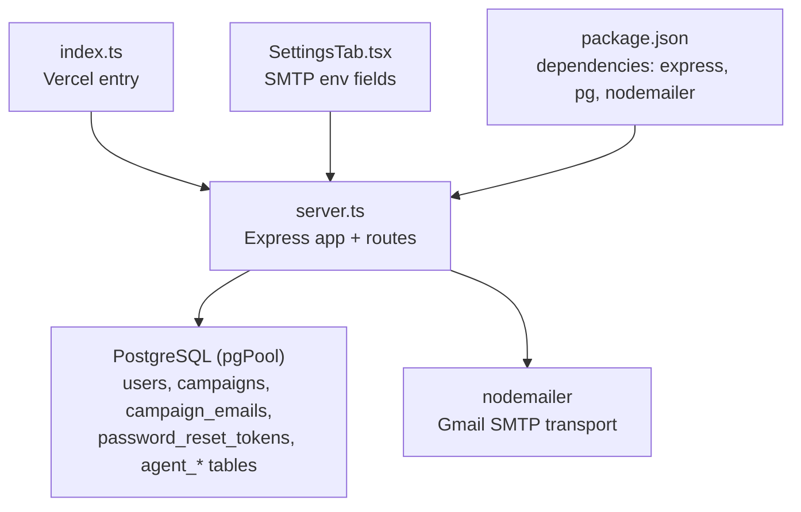
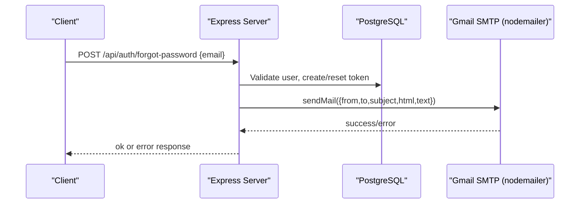
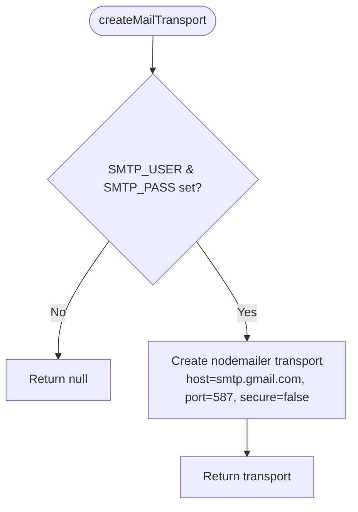
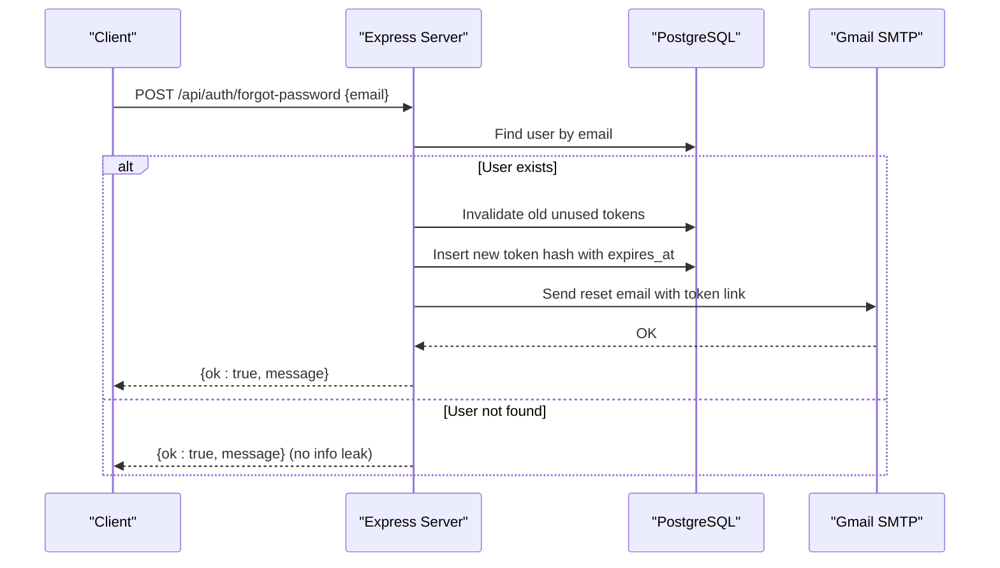
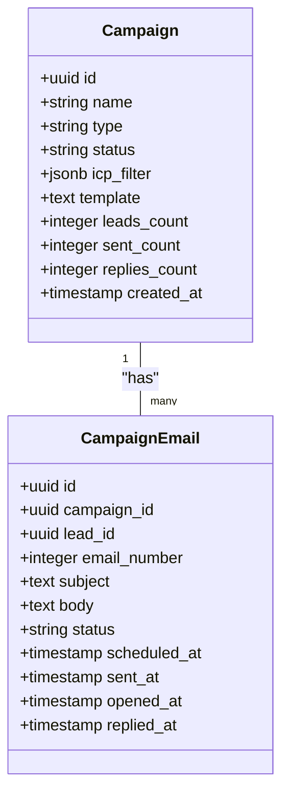
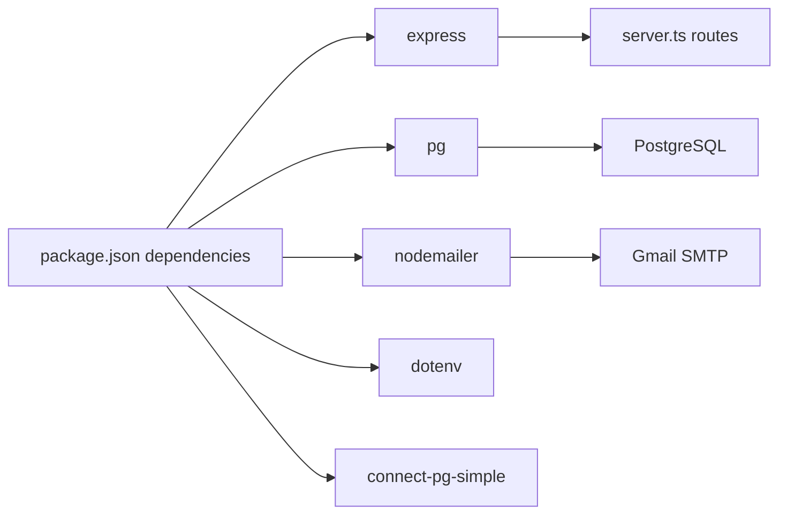

# Email Service Endpoints

<cite>
**Referenced Files in This Document**
- [server.ts](file://server.ts)
- [index.ts](file://index.ts)
- [package.json](file://package.json)
- [SettingsTab.tsx](file://src/components/SettingsTab.tsx)
- [types.ts](file://src/types.ts)
</cite>

## Table of Contents
1. [Introduction](#introduction)
2. [Project Structure](#project-structure)
3. [Core Components](#core-components)
4. [Architecture Overview](#architecture-overview)
5. [Detailed Component Analysis](#detailed-component-analysis)
6. [Dependency Analysis](#dependency-analysis)
7. [Performance Considerations](#performance-considerations)
8. [Troubleshooting Guide](#troubleshooting-guide)
9. [Conclusion](#conclusion)
10. [Appendices](#appendices)

## Introduction
This document provides detailed API documentation for the email service endpoints and related campaign management features implemented in the application. It covers SMTP integration with Gmail via nodemailer, password reset email delivery, campaign CRUD operations, and data models that support email tracking and analytics. It also explains error handling patterns for SMTP failures and outlines how to extend the system for attachment handling, template rendering, bounce processing, and delivery confirmation.

## Project Structure
The email functionality is primarily implemented in the Express server file, which initializes database tables, configures session storage, and registers HTTP routes. The Vercel entry point triggers database initialization before exporting the app. Frontend settings expose environment variables for SMTP configuration.

**Diagram sources**
- [index.ts:1-20](file://index.ts#L1-L20)
- [server.ts:1-120](file://server.ts#L1-L120)
- [server.ts:3796-3867](file://server.ts#L3796-L3867)
- [package.json:15-46](file://package.json#L15-L46)
- [SettingsTab.tsx:76-101](file://src/components/SettingsTab.tsx#L76-L101)

**Section sources**
- [index.ts:1-20](file://index.ts#L1-L20)
- [server.ts:1-120](file://server.ts#L1-L120)
- [package.json:15-46](file://package.json#L15-L46)
- [SettingsTab.tsx:76-101](file://src/components/SettingsTab.tsx#L76-L101)

## Core Components
- SMTP Transport: A Gmail SMTP transport is created using nodemailer when SMTP_USER and SMTP_PASS are configured.
- Password Reset Email: An endpoint generates a secure token, persists its hash, and sends an HTML/text email via the SMTP transport.
- Campaign Management: REST endpoints allow creating, listing, updating, and deleting campaigns; schema supports per-email tracking fields for scheduling and delivery events.
- Data Models: Tables include campaigns, campaign_emails, conversations, proposals, and various agent OS tables used by the broader system.

Key implementation references:
- SMTP creation and usage: [server.ts:131-207](file://server.ts#L131-L207)
- Forgot password flow and email sending: [server.ts:750-830](file://server.ts#L750-L830)
- Campaigns schema and indexes: [server.ts:3796-3867](file://server.ts#L3796-L3867)
- Campaigns CRUD endpoints: [server.ts:4732-4797](file://server.ts#L4732-L4797)

**Section sources**
- [server.ts:131-207](file://server.ts#L131-L207)
- [server.ts:750-830](file://server.ts#L750-L830)
- [server.ts:3796-3867](file://server.ts#L3796-L3867)
- [server.ts:4732-4797](file://server.ts#L4732-L4797)

## Architecture Overview
The email subsystem integrates with PostgreSQL and Gmail SMTP through Express routes. Campaigns and individual emails are persisted with status and timestamp fields to support scheduling and analytics. The frontend exposes SMTP configuration fields for easy setup.

**Diagram sources**
- [server.ts:750-830](file://server.ts#L750-L830)
- [server.ts:131-207](file://server.ts#L131-L207)

## Detailed Component Analysis

### SMTP Integration with Gmail
- Transport creation uses host smtp.gmail.com, port 587, STARTTLS, and credentials from environment variables.
- If credentials are missing, the transport returns null and email functions throw descriptive errors.

**Diagram sources**
- [server.ts:131-143](file://server.ts#L131-L143)

**Section sources**
- [server.ts:131-143](file://server.ts#L131-L143)

### Password Reset Email Endpoint
- Validates email input, ensures idempotent behavior by invalidating previous unused tokens, hashes the raw token, stores it with expiration, and sends a styled HTML email with a reset link.

**Diagram sources**
- [server.ts:750-830](file://server.ts#L750-L830)

**Section sources**
- [server.ts:750-830](file://server.ts#L750-L830)

### Campaign Management APIs
- GET /api/campaigns: Lists campaigns with counts and timestamps.
- POST /api/campaigns: Creates a campaign with name, type, status, template, and ICP filter.
- PATCH /api/campaigns/:id: Updates allowed fields including counters and filters.
- DELETE /api/campaigns/:id: Deletes a campaign.

Data model highlights:
- campaigns: id, name, type, status, template, icp_filter, created_at, counters.
- campaign_emails: id, campaign_id, lead_id, email_number, subject, body, status, scheduled_at, sent_at, opened_at, replied_at.

**Diagram sources**
- [server.ts:3796-3823](file://server.ts#L3796-L3823)

**Section sources**
- [server.ts:3796-3823](file://server.ts#L3796-L3823)
- [server.ts:4732-4797](file://server.ts#L4732-L4797)

### Email Sending Endpoints (Current Implementation)
- There is no dedicated “send email” endpoint exposed for arbitrary payloads. The only outbound email currently implemented is the password reset flow.
- To add generic email sending, you can reuse the existing SMTP transport and follow the same pattern used in the password reset function.

Recommendation:
- Add POST /api/email/send with validation, template rendering, attachment handling, and delivery tracking updates to campaign_emails.

**Section sources**
- [server.ts:131-207](file://server.ts#L131-L207)
- [server.ts:750-830](file://server.ts#L750-L830)

### Template Rendering and Attachments
- Templates: Not implemented yet. You can introduce a templates table and render HTML bodies using a templating engine or server-side string interpolation.
- Attachments: Not implemented yet. Extend the sendMail call to include attachments array and validate size/type.

Suggested schema additions:
- templates: id, name, category, subject_template, html_template, preview_text, created_at.

**Section sources**
- [types.ts:120-127](file://src/types.ts#L120-L127)

### Delivery Tracking and Analytics
- campaign_emails includes fields for scheduled_at, sent_at, opened_at, replied_at to track lifecycle events.
- Use these fields to compute open rates, reply rates, and campaign performance metrics.

Operational notes:
- Implement webhook handlers for provider delivery events (e.g., Gmail or transactional providers) to update opened_at/replied_at.
- For bounces, implement a bounce handler to mark statuses and maintain sender reputation.

**Section sources**
- [server.ts:3810-3823](file://server.ts#L3810-L3823)

### Error Handling for SMTP Failures
- If SMTP_USER or SMTP_PASS are missing, createMailTransport returns null and sendPasswordResetEmail throws an error indicating missing configuration.
- All route handlers wrap logic in try/catch blocks and return consistent JSON error responses.

Best practices:
- Log SMTP errors with context (recipient, subject).
- Retry transient failures with exponential backoff.
- Surface actionable messages to clients while avoiding information leakage.

**Section sources**
- [server.ts:131-143](file://server.ts#L131-L143)
- [server.ts:750-830](file://server.ts#L750-L830)

### Bounce Processing and Delivery Confirmation
- Not implemented in current codebase. Recommended approach:
  - Integrate with a provider’s webhook (SendGrid/Mailgun/Gmail postmaster) to receive bounce/delivery events.
  - Update campaign_emails.status and timestamps accordingly.
  - Maintain a bounce log table for analysis and suppression lists.

**Section sources**
- [server.ts:3810-3823](file://server.ts#L3810-L3823)

### Email Automation Workflows and CRM Integration Patterns
- The system includes robust Agent OS tables and endpoints for tasks, logs, and orchestration, enabling automation workflows.
- Typical workflow:
  - Prospecting via Google Places/Apify → companies and leads_enriched.
  - Enrichment via Hunter.io → contact emails.
  - Generate outreach content via AI proxy (/api/generate actions).
  - Create campaigns and schedule emails using campaign_emails.scheduled_at.
  - Track delivery and replies via campaign_emails timestamps.

Integration patterns:
- Use POST /api/agent/tasks to queue email sending jobs.
- Use POST /api/orchestrator/plans to define multi-step sequences.
- Persist conversation history in conversations table for auditability.

**Section sources**
- [server.ts:3666-3867](file://server.ts#L3666-L3867)
- [server.ts:4054-4166](file://server.ts#L4054-L4166)
- [server.ts:4168-4270](file://server.ts#L4168-L4270)

## Dependency Analysis
- Dependencies:
  - express: HTTP server and routing.
  - pg: PostgreSQL client for persistent storage.
  - nodemailer: SMTP transport for Gmail.
  - dotenv: Environment variable loading.
  - connect-pg-simple: Session store backed by PostgreSQL.
- Configuration exposure:
  - SettingsTab.tsx documents SMTP_USER, SMTP_PASS, and SENDGRID_API_KEY fields for UI-driven configuration.

**Diagram sources**
- [package.json:15-46](file://package.json#L15-L46)
- [server.ts:1-20](file://server.ts#L1-L20)
- [SettingsTab.tsx:76-101](file://src/components/SettingsTab.tsx#L76-L101)

**Section sources**
- [package.json:15-46](file://package.json#L15-L46)
- [server.ts:1-20](file://server.ts#L1-L20)
- [SettingsTab.tsx:76-101](file://src/components/SettingsTab.tsx#L76-L101)

## Performance Considerations
- SMTP throughput: Gmail SMTP has rate limits; batch sending should use queues and throttling.
- Database queries: Ensure proper indexing on campaign_emails(status), campaign_emails(campaign_id), and campaign_emails(scheduled_at) for efficient scheduling and reporting.
- AI generation: Gemini calls have fallbacks; cache generated content where appropriate to reduce latency and cost.

[No sources needed since this section provides general guidance]

## Troubleshooting Guide
Common issues and resolutions:
- SMTP misconfiguration:
  - Symptom: Errors indicating missing SMTP_USER or SMTP_PASS.
  - Resolution: Set environment variables and verify credentials.
- Session persistence:
  - Symptom: Sessions not saved in production without DATABASE_URL.
  - Resolution: Configure DATABASE_URL and ensure session store is initialized.
- Campaigns not appearing:
  - Symptom: Empty list from GET /api/campaigns.
  - Resolution: Verify POST /api/campaigns succeeded and check database state.

Relevant code paths:
- SMTP transport creation and error handling: [server.ts:131-143](file://server.ts#L131-L143)
- Password reset email sending: [server.ts:750-830](file://server.ts#L750-L830)
- Campaigns CRUD: [server.ts:4732-4797](file://server.ts#L4732-L4797)

**Section sources**
- [server.ts:131-143](file://server.ts#L131-L143)
- [server.ts:750-830](file://server.ts#L750-L830)
- [server.ts:4732-4797](file://server.ts#L4732-L4797)

## Conclusion
The application implements a solid foundation for email delivery via Gmail SMTP and comprehensive campaign management with tracking fields. While generic email sending, template rendering, and attachment handling are not yet exposed as endpoints, the existing SMTP transport and data models provide a clear path to extend functionality. Integrating webhooks for delivery confirmations and bounces will complete the observability loop for email campaigns.

[No sources needed since this section summarizes without analyzing specific files]

## Appendices

### API Definitions Summary
- POST /api/auth/forgot-password
  - Purpose: Generate reset token and send email.
  - Body: { email }
  - Response: { ok: boolean, message: string }
  - Errors: 400 invalid email, 500 internal error.

- GET /api/campaigns
  - Purpose: List campaigns.
  - Response: Array of campaign objects.

- POST /api/campaigns
  - Purpose: Create campaign.
  - Body: { name, type?, status?, template?, icp_filter? }
  - Response: Created campaign object.

- PATCH /api/campaigns/:id
  - Purpose: Update campaign fields.
  - Body: Allowed fields include name, status, template, counters, icp_filter.
  - Response: Updated campaign object.

- DELETE /api/campaigns/:id
  - Purpose: Delete campaign.
  - Response: { ok: true }

**Section sources**
- [server.ts:750-830](file://server.ts#L750-L830)
- [server.ts:4732-4797](file://server.ts#L4732-L4797)