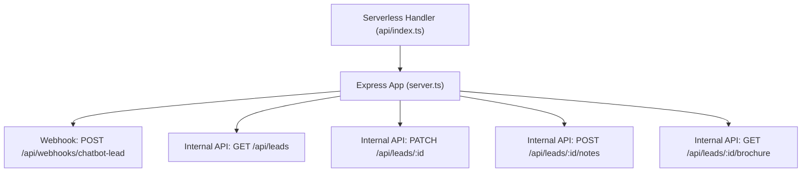
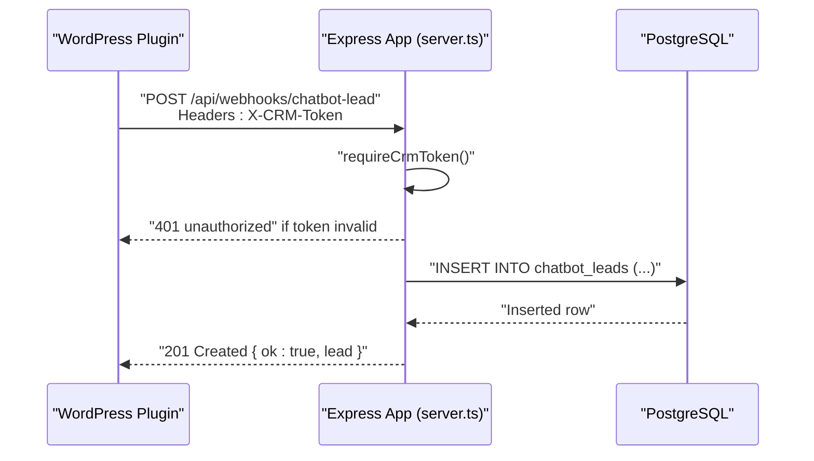
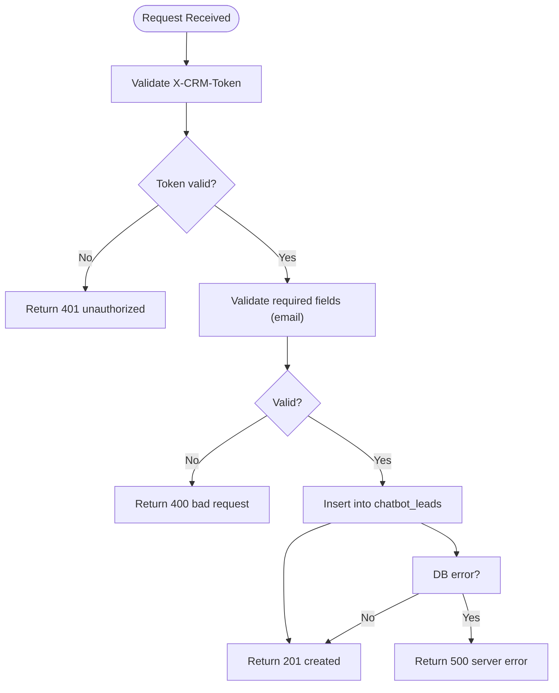
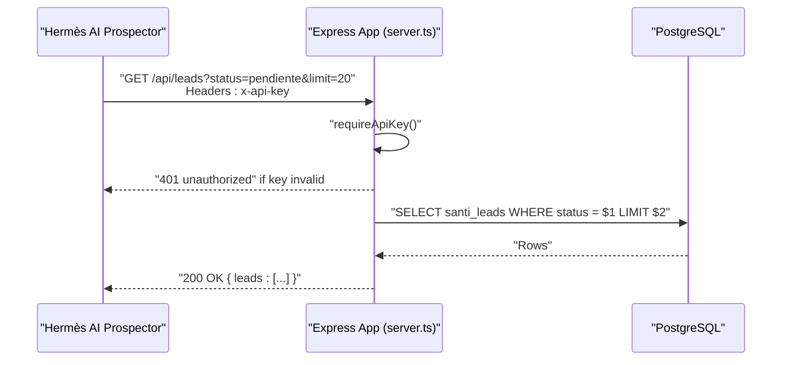
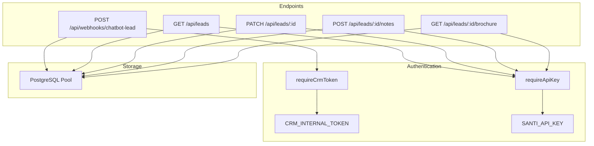

# Webhook Integration Endpoints

<cite>
**Referenced Files in This Document**
- [server.ts](file://server.ts)
- [api/index.ts](file://api/index.ts)
</cite>

## Table of Contents
1. [Introduction](#introduction)
2. [Project Structure](#project-structure)
3. [Core Components](#core-components)
4. [Architecture Overview](#architecture-overview)
5. [Detailed Component Analysis](#detailed-component-analysis)
6. [Dependency Analysis](#dependency-analysis)
7. [Performance Considerations](#performance-considerations)
8. [Troubleshooting Guide](#troubleshooting-guide)
9. [Conclusion](#conclusion)

## Introduction
This document provides comprehensive API documentation for webhook integration endpoints designed for external system integrations. It covers:
- CRM webhook endpoints that accept lead data from WordPress plugins using X-CRM-Token authentication.
- Server-to-server API key authentication endpoints for internal services like the Hermès AI Prospector.
- Webhook payload schemas, error handling strategies, and retry mechanisms.
- Security measures including token validation and environment-based configuration.
- Examples of webhook setup, payload structures, and integration patterns for third-party systems.

## Project Structure
The server is implemented with Express and exposes REST endpoints, including webhooks and internal APIs. The application entrypoint is exported via a small handler module for serverless deployment.

**Diagram sources**
- [server.ts:3525-3561](file://server.ts#L3525-L3561)
- [server.ts:4895-4969](file://server.ts#L4895-L4969)
- [api/index.ts:1-5](file://api/index.ts#L1-L5)

**Section sources**
- [server.ts:1-120](file://server.ts#L1-L120)
- [api/index.ts:1-5](file://api/index.ts#L1-L5)

## Core Components
- Authentication middleware:
  - requireCrmToken: Validates shared secret via X-CRM-Token header for inbound webhooks.
  - requireApiKey: Validates server-to-server requests via x-api-key header for internal services.
- Webhook endpoint:
  - POST /api/webhooks/chatbot-lead: Accepts lead payloads from WordPress plugin.
- Internal API endpoints:
  - GET /api/leads, PATCH /api/leads/:id, POST /api/leads/:id/notes, GET /api/leads/:id/brochure: Used by Hermès AI Prospector.

**Section sources**
- [server.ts:240-264](file://server.ts#L240-L264)
- [server.ts:3525-3561](file://server.ts#L3525-L3561)
- [server.ts:4895-4969](file://server.ts#L4895-L4969)

## Architecture Overview
The webhook flow authenticates incoming requests using a shared token and persists leads to the database. Internal APIs are protected by an API key.

**Diagram sources**
- [server.ts:253-264](file://server.ts#L253-L264)
- [server.ts:3534-3561](file://server.ts#L3534-L3561)

## Detailed Component Analysis

### CRM Webhook: POST /api/webhooks/chatbot-lead
- Purpose: Receive lead capture events from the WordPress AI Marketing Expert plugin.
- Authentication: Requires header X-CRM-Token matching CRM_INTERNAL_TOKEN.
- Payload schema:
  - email: string (required)
  - first_name: string (optional)
  - last_name: string (optional)
  - phone: string (optional)
  - company: string (optional)
  - source: string (optional)
  - tags: array of strings (optional)
  - metadata: object (optional; includes fields such as page_url)
- Behavior:
  - Constructs name from first_name and last_name or falls back to email.
  - Builds notes from source, tags, and metadata.page_url.
  - Persists conversation metadata as JSON.
  - Returns 201 with created lead on success.
- Error handling:
  - 400 when email is missing or invalid.
  - 500 on database errors.
  - 401 when token is missing or incorrect.
  - 503 when CRM_INTERNAL_TOKEN is not configured.

**Diagram sources**
- [server.ts:253-264](file://server.ts#L253-L264)
- [server.ts:3534-3561](file://server.ts#L3534-L3561)

**Section sources**
- [server.ts:253-264](file://server.ts#L253-L264)
- [server.ts:3525-3561](file://server.ts#L3525-L3561)

### Internal API: Hermès AI Prospector Endpoints
- Authentication: Requires header x-api-key matching SANTI_API_KEY.
- Endpoints:
  - GET /api/leads: Lists leads filtered by status and limited by count.
  - GET /api/leads/:id/brochure: Retrieves brochure content for a lead.
  - PATCH /api/leads/:id: Updates lead status with allowed values.
  - POST /api/leads/:id/notes: Adds notes to a lead.
- Error handling:
  - 401 when API key is missing or incorrect.
  - 400 for invalid inputs.
  - 404 when resource not found.
  - 500 on database errors.

**Diagram sources**
- [server.ts:240-246](file://server.ts#L240-L246)
- [server.ts:4895-4913](file://server.ts#L4895-L4913)

**Section sources**
- [server.ts:240-246](file://server.ts#L240-L246)
- [server.ts:4895-4969](file://server.ts#L4895-L4969)

### Webhook Setup and Usage Examples
- WordPress plugin configuration:
  - Set the webhook URL to your server’s /api/webhooks/chatbot-lead endpoint.
  - Include header X-CRM-Token with the value of CRM_INTERNAL_TOKEN.
  - Send JSON payload with at least the email field.
- Example payload structure:
  - email: "user@example.com"
  - first_name: "Jane"
  - last_name: "Doe"
  - phone: "+5491112345678"
  - company: "Acme Corp"
  - source: "website_chatbot"
  - tags: ["qualified", "enterprise"]
  - metadata: { page_url: "https://example.com/contact" }
- Expected responses:
  - 201 Created with { ok: true, lead: {...} }
  - 400 Bad Request with error message
  - 401 Unauthorized with error message
  - 503 Service Unavailable if CRM_INTERNAL_TOKEN is not configured

[No sources needed since this section provides general guidance]

### Retry Mechanisms and Reliability
- Current implementation:
  - No built-in retry logic for webhooks; each request is processed once.
  - Database operations are wrapped in try/catch blocks returning appropriate HTTP statuses.
- Recommendations:
  - Implement idempotency keys in webhook payloads to handle duplicates safely.
  - Add a background job queue to persist and retry failed deliveries.
  - Use exponential backoff and jitter for retries.
  - Log all failures with correlation IDs for observability.

[No sources needed since this section provides general guidance]

### Error Handling Strategies
- Validation errors return 400 with descriptive messages.
- Authentication failures return 401 unauthorized.
- Configuration issues return 503 service unavailable.
- Database errors return 500 server error with logged details.

**Section sources**
- [server.ts:253-264](file://server.ts#L253-L264)
- [server.ts:3534-3561](file://server.ts#L3534-L3561)
- [server.ts:4895-4969](file://server.ts#L4895-L4969)

## Dependency Analysis
The webhook and internal API endpoints depend on:
- Express middleware for request parsing and session management.
- PostgreSQL pool for database operations.
- Environment variables for secrets (CRM_INTERNAL_TOKEN, SANTI_API_KEY).

**Diagram sources**
- [server.ts:240-264](file://server.ts#L240-L264)
- [server.ts:3525-3561](file://server.ts#L3525-L3561)
- [server.ts:4895-4969](file://server.ts#L4895-L4969)

**Section sources**
- [server.ts:240-264](file://server.ts#L240-L264)
- [server.ts:3525-3561](file://server.ts#L3525-L3561)
- [server.ts:4895-4969](file://server.ts#L4895-L4969)

## Performance Considerations
- Keep webhook handlers lightweight and fast to avoid timeouts.
- Use asynchronous database queries efficiently.
- Avoid heavy processing in the request path; offload to background jobs if needed.
- Monitor database connection pool usage and query performance.

[No sources needed since this section provides general guidance]

## Troubleshooting Guide
Common issues and resolutions:
- 401 Unauthorized: Ensure X-CRM-Token or x-api-key headers match configured secrets.
- 503 Service Unavailable: Verify CRM_INTERNAL_TOKEN is set in environment.
- 400 Bad Request: Check payload schema and required fields.
- 500 Server Error: Review server logs for database or processing errors.

**Section sources**
- [server.ts:253-264](file://server.ts#L253-L264)
- [server.ts:3534-3561](file://server.ts#L3534-L3561)
- [server.ts:4895-4969](file://server.ts#L4895-L4969)

## Conclusion
The webhook integration provides secure, reliable lead ingestion from WordPress plugins and supports internal service communication through API key authentication. Proper configuration of secrets, payload validation, and error handling ensures robust operation. For enhanced reliability, consider implementing retry mechanisms and idempotency in future iterations.

[No sources needed since this section summarizes without analyzing specific files]