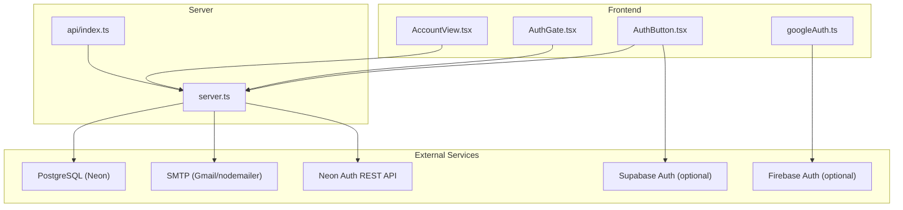
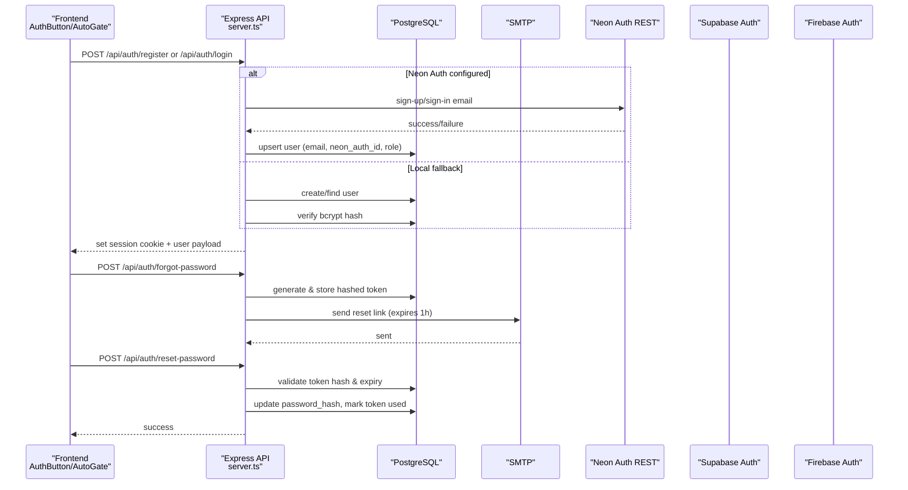
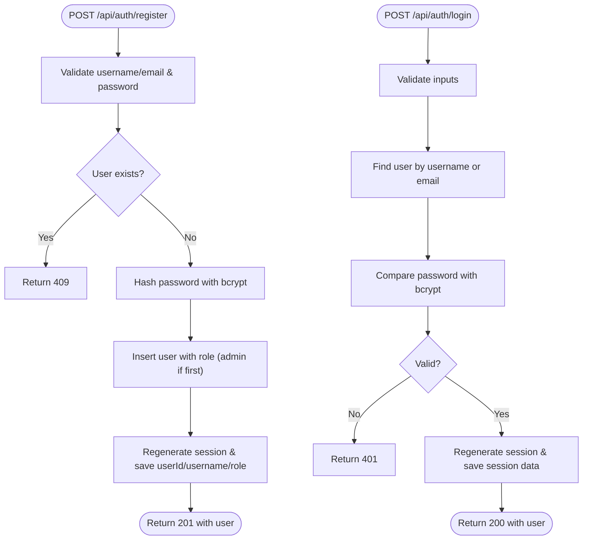
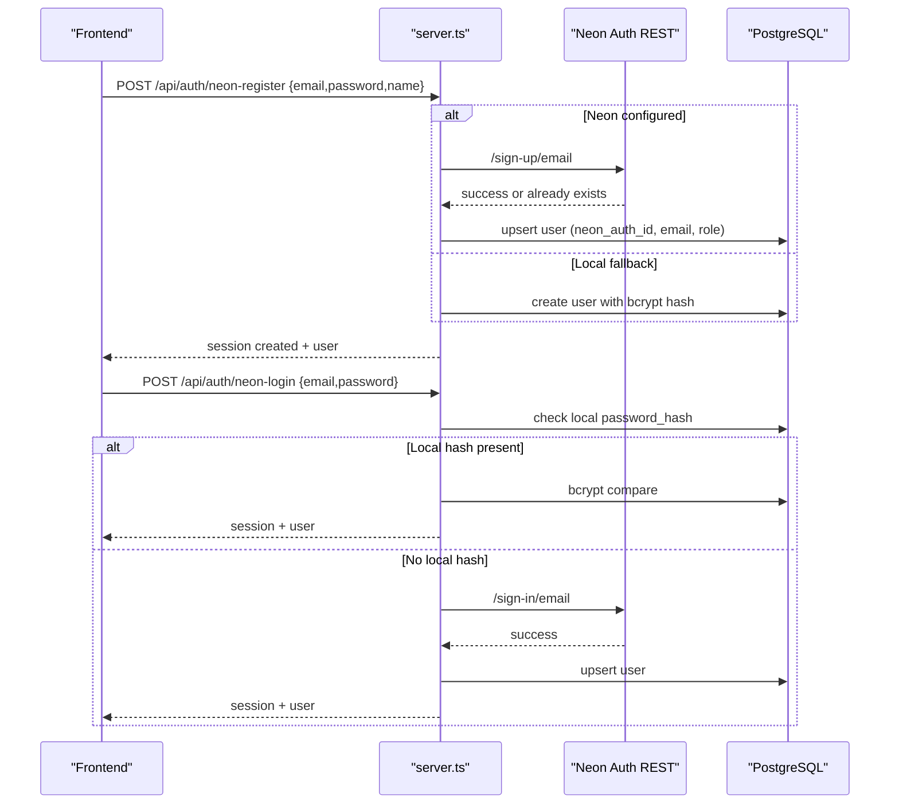
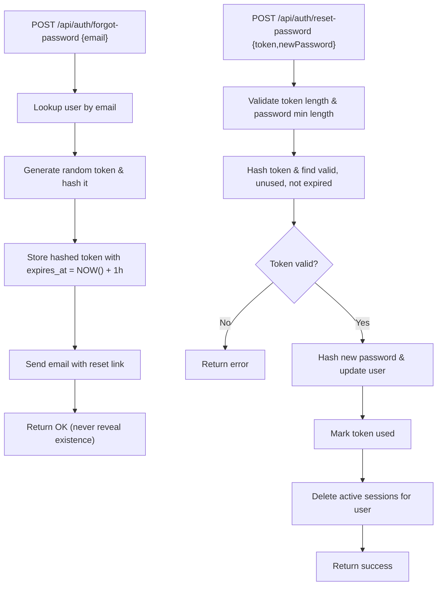
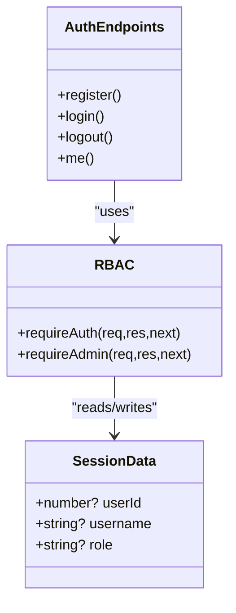
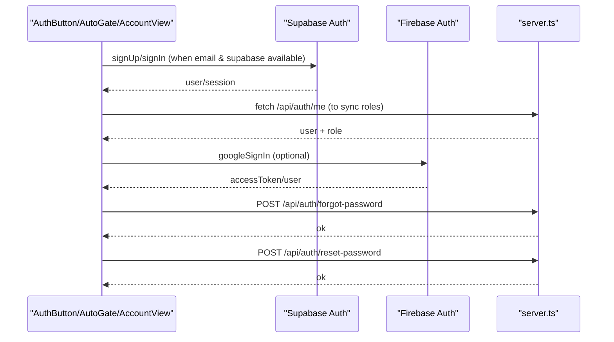
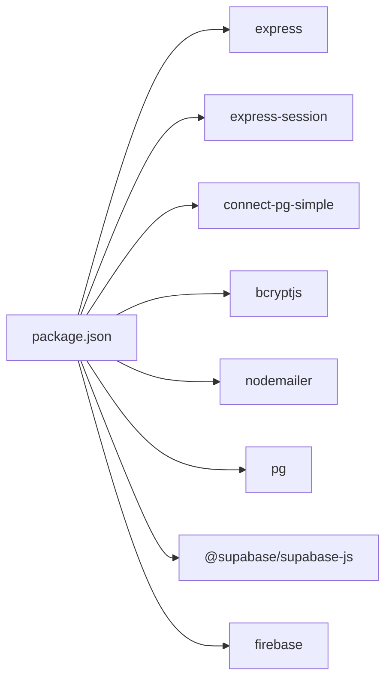

# Authentication System

<cite>
**Referenced Files in This Document**
- [server.ts](file://server.ts)
- [api/index.ts](file://api/index.ts)
- [AuthButton.tsx](file://src/components/AuthButton.tsx)
- [AuthGate.tsx](file://src/components/AuthGate.tsx)
- [AccountView.tsx](file://src/components/AccountView.tsx)
- [googleAuth.ts](file://src/lib/googleAuth.ts)
- [package.json](file://package.json)
</cite>

## Table of Contents
1. Introduction
2. Project Structure
3. Core Components
4. Architecture Overview
5. Detailed Component Analysis
6. Dependency Analysis
7. Performance Considerations
8. Troubleshooting Guide
9. Conclusion

## Introduction
This document explains the multi-provider authentication system implemented in the application. It covers:
- Traditional username/password authentication with bcrypt hashing, Express sessions, and role-based access control (RBAC).
- Neon Auth integration for email-based registration, login, and user synchronization between the local database and an external auth provider.
- Password reset flow using secure token generation, SMTP delivery, and token expiration handling.
- Security measures including CSRF considerations, session security best practices, and rate limiting guidance.

The system supports both server-side flows (Express endpoints) and client-side integrations (Supabase/Firebase), providing a resilient fallback strategy when external providers are unavailable.

## Project Structure
Authentication spans server routes, middleware, session configuration, and frontend components:
- Server-side Express app defines authentication endpoints, session store, RBAC middleware, password reset, and Neon Auth proxying.
- Frontend components handle login/register UI, forgot/reset password flows, and optional Supabase/Firebase integrations.
- Configuration is driven by environment variables for database, SMTP, session secret, and Neon Auth base URL.

**Diagram sources**
- [server.ts:1-120](file://server.ts#L1-L120)
- [api/index.ts:1-5](file://api/index.ts#L1-L5)
- [AuthButton.tsx:1-120](file://src/components/AuthButton.tsx#L1-L120)
- [AuthGate.tsx:1-115](file://src/components/AuthGate.tsx#L1-L115)
- [AccountView.tsx:1-79](file://src/components/AccountView.tsx#L1-L79)
- [googleAuth.ts:1-60](file://src/lib/googleAuth.ts#L1-L60)

**Section sources**
- [server.ts:1-120](file://server.ts#L1-L120)
- [api/index.ts:1-5](file://api/index.ts#L1-L5)
- [package.json:1-64](file://package.json#L1-L64)

## Core Components
- Session management: Express sessions with PostgreSQL-backed store, httpOnly cookies, SameSite=Lax, and configurable maxAge.
- Traditional auth: Username/email login and registration with bcrypt hashing; first user becomes admin.
- Neon Auth integration: Email-based register/login via Neon Auth REST API with local upsert to keep CRM roles intact.
- Password reset: Secure token generation, hashed storage, one-hour expiry, SMTP email delivery, and forced re-login on reset.
- RBAC: Middleware checks current role from DB on each request to enforce admin-only operations.
- Optional providers: Supabase and Firebase integrations for email/password or Google sign-in where available.

**Section sources**
- [server.ts:112-125](file://server.ts#L112-L125)
- [server.ts:266-338](file://server.ts#L266-L338)
- [server.ts:340-381](file://server.ts#L340-L381)
- [server.ts:394-470](file://server.ts#L394-L470)
- [server.ts:594-680](file://server.ts#L594-L680)
- [server.ts:683-748](file://server.ts#L683-L748)
- [server.ts:750-830](file://server.ts#L750-L830)
- [server.ts:832-851](file://server.ts#L832-L851)
- [AuthButton.tsx:103-135](file://src/components/AuthButton.tsx#L103-L135)
- [AuthGate.tsx:93-115](file://src/components/AuthGate.tsx#L93-L115)
- [AccountView.tsx:44-73](file://src/components/AccountView.tsx#L44-L73)
- [googleAuth.ts:1-60](file://src/lib/googleAuth.ts#L1-L60)

## Architecture Overview
The authentication architecture combines server-side Express endpoints with optional third-party identity providers. The server maintains a local users table for CRM features and synchronizes identities when Neon Auth is configured. Sessions are stored securely in Postgres, and passwords are hashed with bcrypt.

**Diagram sources**
- [server.ts:266-338](file://server.ts#L266-L338)
- [server.ts:340-381](file://server.ts#L340-L381)
- [server.ts:594-680](file://server.ts#L594-L680)
- [server.ts:683-748](file://server.ts#L683-L748)
- [server.ts:750-830](file://server.ts#L750-L830)
- [AuthButton.tsx:103-135](file://src/components/AuthButton.tsx#L103-L135)
- [AuthGate.tsx:93-115](file://src/components/AuthGate.tsx#L93-L115)

## Detailed Component Analysis

### Traditional Username/Password Authentication
- Registration validates input, hashes password with bcrypt, ensures uniqueness, and assigns role (first user admin, others user).
- Login accepts username or email, performs constant-time bcrypt comparison, and creates a new session.
- Logout destroys the session and clears the cookie.

**Diagram sources**
- [server.ts:266-338](file://server.ts#L266-L338)
- [server.ts:340-381](file://server.ts#L340-L381)

**Section sources**
- [server.ts:266-338](file://server.ts#L266-L338)
- [server.ts:340-381](file://server.ts#L340-L381)

### Neon Auth Integration (Email-Based)
- Register endpoint calls Neon Auth REST API when configured; otherwise falls back to local bcrypt registration.
- On success, upserts user into local DB with neon_auth_id and email, preserving CRM role logic.
- Login prefers local bcrypt verification for speed; if no local hash, proxies to Neon Auth and syncs local record.

**Diagram sources**
- [server.ts:594-680](file://server.ts#L594-L680)
- [server.ts:683-748](file://server.ts#L683-L748)
- [server.ts:408-470](file://server.ts#L408-L470)

**Section sources**
- [server.ts:594-680](file://server.ts#L594-L680)
- [server.ts:683-748](file://server.ts#L683-L748)
- [server.ts:408-470](file://server.ts#L408-L470)

### Password Reset Flow
- Forgot password generates a secure random token, stores its SHA-256 hash, sets 1-hour expiry, and sends an email via SMTP.
- Reset password validates token hash and expiry, updates password_hash, marks token used, and invalidates active sessions.

**Diagram sources**
- [server.ts:750-830](file://server.ts#L750-L830)

**Section sources**
- [server.ts:750-830](file://server.ts#L750-L830)

### Role-Based Access Control (RBAC)
- requireAuth checks session.userId presence.
- requireAdmin queries the database for the current role on every request to ensure immediate effect of role changes.
- /api/auth/me returns current user info and refreshes session.role from DB.

**Diagram sources**
- [server.ts:209-235](file://server.ts#L209-L235)
- [server.ts:832-851](file://server.ts#L832-L851)

**Section sources**
- [server.ts:209-235](file://server.ts#L209-L235)
- [server.ts:832-851](file://server.ts#L832-L851)

### Frontend Authentication Components
- AuthButton handles login/register/forgot flows, preferring Supabase when available, otherwise calling server endpoints.
- AuthGate manages forgot/reset password UI and submits reset-token based requests.
- AccountView provides profile and password change UI, calling /api/auth/me and /api/auth/change-password.
- googleAuth integrates Firebase Google sign-in for optional OAuth.

**Diagram sources**
- [AuthButton.tsx:103-135](file://src/components/AuthButton.tsx#L103-L135)
- [AuthGate.tsx:93-115](file://src/components/AuthGate.tsx#L93-L115)
- [AccountView.tsx:35-73](file://src/components/AccountView.tsx#L35-L73)
- [googleAuth.ts:1-60](file://src/lib/googleAuth.ts#L1-L60)

**Section sources**
- [AuthButton.tsx:1-135](file://src/components/AuthButton.tsx#L1-L135)
- [AuthGate.tsx:1-115](file://src/components/AuthGate.tsx#L1-L115)
- [AccountView.tsx:1-79](file://src/components/AccountView.tsx#L1-L79)
- [googleAuth.ts:1-60](file://src/lib/googleAuth.ts#L1-L60)

## Dependency Analysis
Key dependencies enabling authentication:
- express-session and connect-pg-simple for session persistence in Postgres.
- bcryptjs for password hashing.
- nodemailer for SMTP email delivery.
- pg for database connectivity.
- Optional @supabase/supabase-js and firebase for client-side auth integrations.

**Diagram sources**
- [package.json:15-45](file://package.json#L15-L45)

**Section sources**
- [package.json:1-64](file://package.json#L1-L64)

## Performance Considerations
- Prefer local bcrypt verification during login when a local hash exists to avoid external provider latency.
- Use PostgreSQL-backed session store for scalability and reliability under load.
- Keep session maxAge reasonable (e.g., 7 days) and use httpOnly + secure cookies in production.
- Avoid unnecessary DB queries by caching minimal session data; still re-check roles per request for accuracy.

[No sources needed since this section provides general guidance]

## Troubleshooting Guide
Common issues and resolutions:
- Missing DATABASE_URL: server falls back to mock pool and memory sessions; configure DATABASE_URL for production.
- SESSION_SECRET not set: development fallback is used; set a strong secret in production.
- SMTP_USER/SMTP_PASS missing: password reset emails will fail; configure SMTP credentials.
- Neon Auth not configured: endpoints fall back to local bcrypt auth; set NEON_AUTH_BASE_URL to enable Neon Auth.
- TypeScript errors related to response types: ensure proper typing for Express responses; the code uses aliases to avoid conflicts.

**Section sources**
- [server.ts:24-77](file://server.ts#L24-L77)
- [server.ts:107-110](file://server.ts#L107-L110)
- [server.ts:133-143](file://server.ts#L133-L143)
- [server.ts:401-404](file://server.ts#L401-L404)
- [attached_assets/Pasted-17-55-50-009-server-ts-172-16-error-TS2339-Property-sta_1785707437603.txt:1-41](file://attached_assets/Pasted-17-55-50-009-server-ts-172-16-error-TS2339-Property-sta_1785707437603.txt#L1-L41)

## Conclusion
The authentication system provides robust, multi-provider support with secure defaults:
- Strong password handling with bcrypt and secure session management via Postgres.
- Seamless Neon Auth integration while maintaining CRM role consistency.
- Reliable password reset flow with secure tokens and SMTP delivery.
- Clear RBAC enforcement with fresh role checks on each request.
- Optional Supabase and Firebase integrations for enhanced UX.

For production hardening, ensure:
- Strong SESSION_SECRET and HTTPS with secure cookies.
- Rate limiting on sensitive endpoints (login, register, forgot-password).
- CSRF protection for state-changing requests.
- Monitoring and logging for failed attempts and provider errors.

[No sources needed since this section summarizes without analyzing specific files]